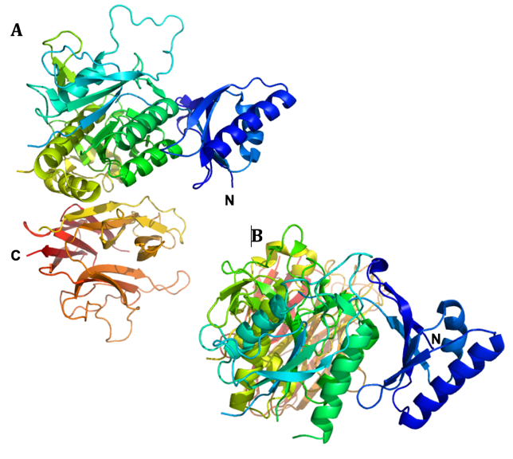
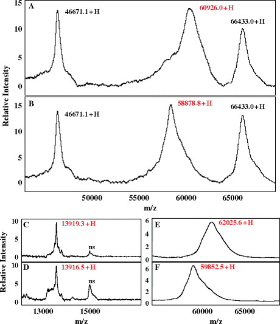
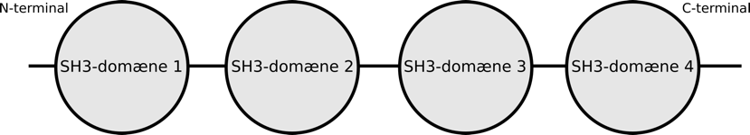
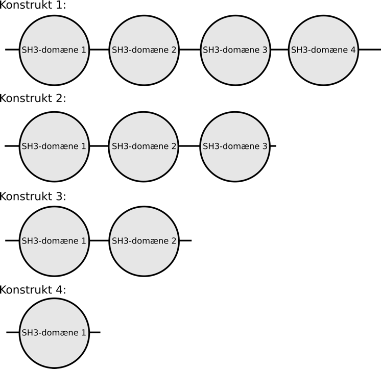
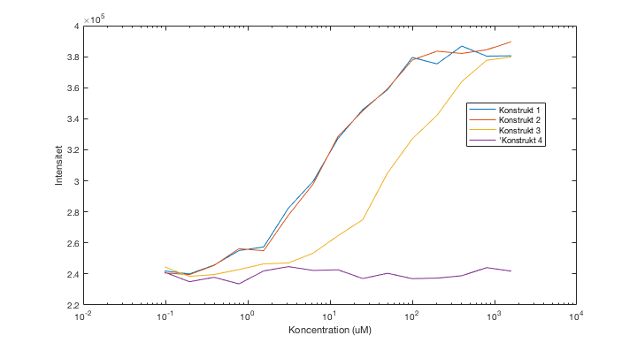
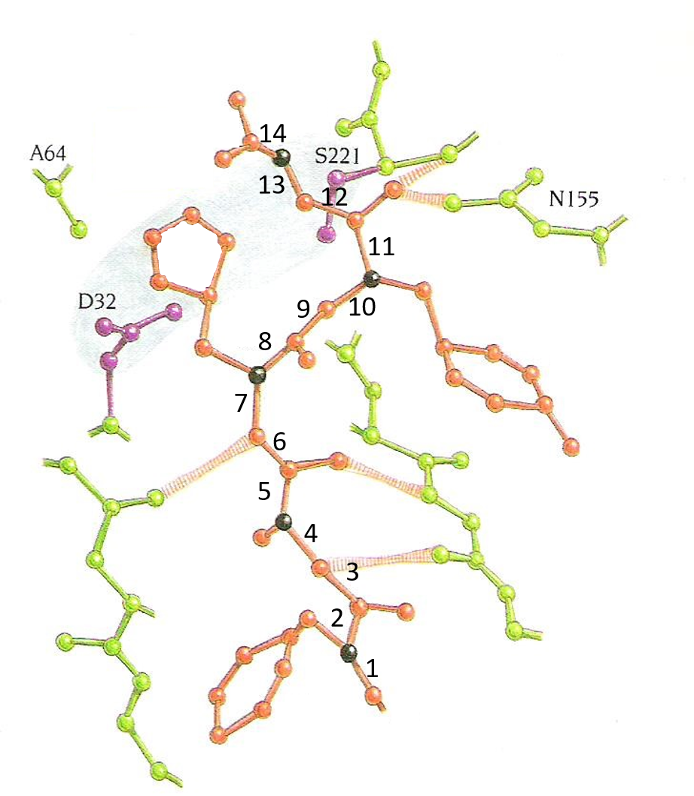
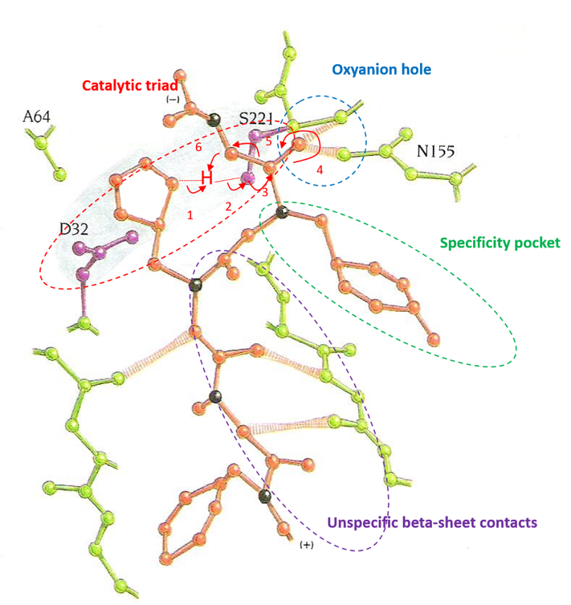
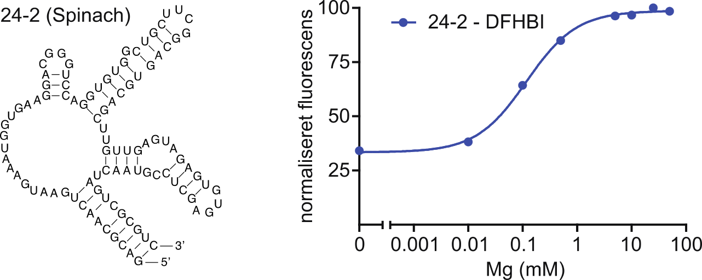

## Opgave 1

Nedenfor vises strukturen af et protein, X, i to forskellige
orienteringer.

{.lightbox width="90%" fig-align="center"}

*Figur 1. Den tre-dimensionelle struktur af protein X i
cartoon-repræsentation farvet fra blå ved N-terminalen til rød ved
C-terminalen. Bemærk at adskillige af peptidkædens forbindelser mellem
sekundær struktur elementer er uordnede og derfor ikke er vist. **A.**
Strukturen set fra siden. N- og C-terminalens placering er vist **B.**
Strukturen set ovenfra. Kun N-terminalens placering er vist.*

**Spørgsmål 1.** Beskriv antallet og rækkefølgen af strukturelle domæner
i Protein X. Brug farverne til at beskrive placeringen af de enkelte
domæner.

::: {.callout-solution}
Svar: Der er tre domæner. Et domæne er en uafhængig foldningsenhed og
der ses desuden en rumlig adskillelse af de tre domæner. Det første
N-terminale domæne er overvejende blåt, det andet centrale domæne er fra
turkis til gul, og det sidste C-terminale domæne er fra gult til rødt.
:::

**Spørgsmål 2.** Angiv hvilken foldningsklasse hvert enkelt domæne
tilhører. Begrund dit svar.

::: {.callout-solution}
Svar: Der er 3 klasser i CATH klassifikation (alpha, beta, alpha-beta),
men i SCOP er der 4 ( alpha, beta, alpha/beta, alpha+beta). Første og
andet domæne er et alpha-beta domæne da de både indeholder alpha helix
og beta plader. Det C-terminale domæne indeholder kun beta-plader og
tilhører derfor beta-klassen.
:::

Det vides at protein X er N-glykosyleret. Samtlige
pentapeptid-fragmenter i proteinets sekvens med asparagin i den centrale
position er vist nedenfor.

1\. PWNLE 8. VINEA

2\. FENVP 9. TPNLV

3\. VLNCQ 10. AHNAF

4\. VLNAA 11. QANCS

5\. AGNFR 12. QPNQC

6\. ATNAQ 13. VDNTC

7\. GTNFG

**Spørgsmål 3.** Angiv hvilke(n) asparagin(er) der højst sandsynligt er
glykosylerede. Begrund dit svar.

::: {.callout-solution}
Svar: N-glykosyleringer kan forekomme for sekvenser af typen NX(S/T)
hvor X kan være hvilken som helst aminosyre dog ikke prolin. Kun peptid
11 indeholder en sådan sekvens.
:::

Tunicamycin inhiberer enzymet *GlcNAc phosphotransferase (GPT)*, der
katalyserer overførsel af N-acetylglucosamine-1-phosphate fra
UDP-N-acetylglucosamine til dolichol phosphate. Protein X blev oprenset
fra en human cellelinje (HuH7) både med og uden tilsætning af
tunicamycin. De to proteinpræparationer blev herefter analyseret ved
hjælp af massespektrometri (Figur 2).

{.lightbox width="90%" fig-align="center"}

*Figur 2. Massespektrometrisk analyse af Protein X. Øverst, protein X
udtrykt uden tunicamycin. Nederst, protein X udtrykt med tilsat
tunicamycin.*

**Spørgsmål 4.** Forklar hvorfor tunicamycin påvirker massen af Protein
X.

::: {.callout-solution}
Svar: Glycosyleret dolichol phosphat fungerer som donor af high-mannose
glycosyleringer i ER. Det er således det første trin i glycylerings
processen der bliver inhiberet af tunicamycin. Derfor er massen af
Protein X mindre end når det udtrykkes sammen med tunicamycin da det
ikke er glykosyleret.
:::

## Opgave 2

SH3-domæner er små protein-protein interaktionsdomæner, der binder til
prolin-rige peptider. Proteinet YP, binder til et andet protein, 4SH,
bestående af fire SH3-domæner, der er forbundne med korte linkere.
SH3-domænerne kan formodes ikke at interagere med hinanden.
4SH-proteinets domænestruktur er skitseret nedenfor.

{.lightbox width="90%" fig-align="center"}

For at kortlægge præcis hvor interaktionen foregår, har man lavet
følgende rekombinante proteiner:

{.lightbox width="90%" fig-align="center"}

YP er mærket med en fluorofor (dansyl) med henblik på
fluorescenstitrering. I dette forsøg måles intensiteten af
fluorescens-emissionen fra 100 nM mærket peptid under stigende
koncentration af hver af de rekombinante protein-konstrukter.

Data fra fluorescenstitreringen kan findes i den vedhæftede fil,
Data_opgave_2.xlsx.

**Spørgsmål 1:** Plot fluorescens-målingerne fra titreringen af
konstrukt 1 på en måde, der tillader bestemmelse af K~d~. Beskriv i
korte træk hvorfor fluorescens-emissionen udvikler sig som observeret
for konstrukt 1.

::: {.callout-solution}
Svar: Et korrekt svar består af et plot af fluorescens intensiteten vs.
Protein koncentrationen som nedenstående. Det kan enten gøres med en
logaritmiske x-akse (bedst) eller lineær x-akse. Et point trækkes fra
for ikke at have labels på akser. Et point trækkes fra for at bytte om
på X og Y-akser, da det i princippet stadig kan bruges men ikke opfylder
fagets konventioner.
:::

Titreringen viser at fluorescens-intensiteten fra YP stiger ved højere
koncentrationer af 4SH. Dette skyldes at fluorescensen er stærkere fra
den bundne tilstand af YP. Når protein koncentrationen øges, skifter YP
gradvist til den bundne tilstand og dermed en højere fluorescens.

Nogle vil muligvis svare at quantum yield er højere i den bundne
tilstand, og/eller spekulere på at fluoroforen ændrer mljø. Disse svar
er også rigtige, men ikke nødvendige for max point.

**Spørgsmål 2:** Estimér YP\'s affinitet for hver af de 4 konstrukter.
Begrund dit svar.

::: {.callout-solution}
Svar: Opgaven kan enten løses grafisk eller ved ikke lineær fitning.

Grafisk aflæses ved at aflæse på plots a la dem for oven. Kd er halvvejs
til mætningen enten bestemmes som halvejs til plateauet i det øverste
plot, eller som omslagspunktet i semi-log plottet nederst. -1 point for
at angive korrekte svar men ikke at angive hvordan tallet er bestemt. -1
point for ikke at angive enhed. Aflæsningen behøves ikke være
super-præcis hvis det rigtige princip anvendes.
:::

Kd kan også bestemmes mere præcist ved hjælp af ikke lineær fitning i
f.eks. MATLAB.

Fitte ligningen er:

FI(x) = A+B\*x/(x+K)

Hvor A og B er konstanter, x er protein koncentrationen og K er Kd.
Fitning i MATLAB giver følgende Kd værdier.

{.lightbox width="90%" fig-align="center"}

Konstrukt 1: 8,4uM +/- 1,5uM

Konstrukt 2: 9,3uM +/- 1,5uM

Konstrukt 3: 72 uM +/- 11uM

Konstrukt 4: Ingen detekterbar binding

**Spørgsmål 3:** Hvilket eller hvilke domæne(r) binder YP sandsynligvis
til? Forklar dit svar.

::: {.callout-solution}
Svar: Konstrukt 1 og konstrukt 2 binder med samme affinitet. Dette viser
at domæne 4 ikke bidrager til bindingen. Konstrukt 3 er væsentligt
svagere end konstrukt 2, hvilket viser at domæne 3 bidrager til
bindingen. Konstrukt 4 binder slet ikke, hvilket viser at domæne 2 også
er vigtig for bindingen. Det tiltænkte svar er dog at bindingssitet er i
domæne 2 og 3.
:::

Domæne 1 binder slet ikke for sig selv, hvilket dog ikke helt udelukker
at det kunne bidrage til bindingen sammen med domæne 2. Et svar der
inkluderer domæne 1 vil også blive betragtet som rigtigt hvis det
diskuteres at det kun kan være i sammenhæng med andre domæner.

**Spørgsmål 4:** Beskriv i korte træk en eksperimentel strategi til
bestemmelse af hvilke aminosyrerester i YP, der er vigtige for
bindingen.

::: {.callout-solution}
Svar: Der er flere korrekte svar på dette spørgsmål. Fulde point gives
for alle svar der vil have en realistisk chance for at bestemme
interaktions-interfacet, f.eks.: mutagenese koblet med
affinitetsmålinger, co-krystallisation af komplekset, NMR-mapping af
interaktionsinterfacet.

Delvise point gives for et svar der indeholder en korrekt overordnet
strategi, men mangler et essentielt trin. Dette kunne f.eks. være at
svare Ala-scanning mutagenese uden at nævne at affiniteten skal
bestemmes.
:::

## Opgave 3

Diagrammet nedenfor viser den beregnede struktur af en del af en mutant
af proteasen subtilisin (grøn og lilla) i kompleks med et substrat
bestående af 5 aminosyrerester (brunt bortset fra Cα-atomerne, der er
sorte). Tallene 1-14 angiver bindinger i proteinets hovedkæde (bemærk at
rækkefølgen ikke nødvendigvis svarer til proteinets egen
N-til-C-terminus sekvens).

{.lightbox width="90%" fig-align="center"}

**Spørgsmål 1.** Hvilken type af sidekæde mangler subtilisin-mutanten
til at indgå i den katalytiske mekanisme udover S221 og D32? Vurdér hvor
stor aktivitet den viste mutant ville have i forhold til
vildtype-subtilisin overfor almindelige substrater og begrund dit svar.

::: {.callout-solution}
Svar: Histidin, ingen aktivitet.
:::

**Spørgsmål 2.** Angiv aminosyresekvensen af substratet fra N- til
C-terminal. I kraft af sin sekvens er dette molekyle ikke et almindeligt
substrat men indgår på en ret usædvanlig måde i den katalytiske
mekanisme. Beskriv hvordan.

::: {.callout-solution}
Svar: NH2-Phe-Ala-His-Tyr-Gly. (Ingen sidekæde på Gly!). His fungerer
som en "stand-in" for den katalytiske His. Den er ikke så præcist
placeret som i enzymet men det er bedre end ingenting.
:::

**Spørgsmål 3.** Kopiér figuren til dit svar og angiv det præcise
kløvningssted på substratet grafisk. Brug \"curly arrows\" til at angive
hvordan kløvningsstedet angribes og navngiv de involverede atomer. Angiv
også på tegningen hvor tre karakteristiske delelementer i proteasens
mekanisme findes.

{.lightbox width="90%" fig-align="center"}

**Spørgsmål 4.** Anvend specificitetsnomenklaturen til at navngive de
relevante aminosyrerester på substratet. Hvilken betegnelse får
aminosyreresten N155 på enzymet i følge denne nomenklatur?

::: {.callout-solution}
Svar: FAHYG svarer til P4-P3-P2-P1-P1\'. N155 svarer til S1.
:::

## Opgave 4

Ved studier af signaltransduktion via G-koblede receptorer (GPCR\'s) har
man identificeret en receptor, GPCR-1, der binder en lille ligand og
aktiverer et heterotrimert G-protein.

**Spørgsmål 1**. Ved måling af mængden af cAMP i cellen finder man at
koncentrationen stiger når liganden tilsættes. Beskriv kort de enkelte
trin i signaltransduktionen, herunder hvorfor cAMP-koncentrationen
stiger.

::: {.callout-solution}
Svar: Et korrekt svar skal indeholde at tilsætning at ligand aktiverer
GPCR-1, som aktiverer G-proteinet, som øger aktiviteten af adenylate
cyclase som katalysere dannelsen af cAMP fra ATP. (Stryer s. 400, Fig.
14.6).
:::

**Spørgsmål 2.** Det heterotrimeriske G-protein har ingen transmembrane
domæner, men alligevel finder man at både Gα og Gβγ er membranbundne.
Forklar hvad der kan ligge til grund for dette.

::: {.callout-solution}
Svar: Et korrekt svar skal indeholde at Gα og Gβγ er forankret i
lipiddobbeltlaget/membranen via. kovalent bundene fedtsyrer. (Stryer s.
401 og Williamsom Fig 8.41). Gα og Gβγ er altså membran-bundet også når
de ikke interagerer med membranproteiner såsom receptorer eller
adenylate cyclase.
:::

**Spørgsmål 3.** Stoffet nedenfor mikro-injiceres dernæst i celler, som
udtrykker GPCR-1 receptoren, og man måler aktiviteten af Protein Kinase
A. Forklar hvorfor stoffet stimulerer fosforyleringsaktiviteten af
Protein Kinase A.

{.lightbox width="90%" fig-align="center"}

::: {.callout-solution}
Svar: Et korrekt svar skal indeholde at strukturen viser en GTP analog
(5\'-guanosyl-methylene-triphosphate (GDPCP)) og at denne ikke
hydrolyseres ligesom GTP. Gα vil ikke kunne hydrolysere GDPCP og dermed
være aktiveret og det vil øge fosforylerings-aktiviteten af Protein
kinase A via adenylate cyclase.
:::

**Spørgsmål 4.** Ved mutation af konserverede serine- og
theronine-rester i den C-terminale del af GPCR-1 til alanine ses en øget
og længerevarende receptorsignalering. Giv en forklaring på den øgede
aktivitet.

::: {.callout-solution}
Svar: Et korrekt svar skal indeholde at når serin/threonin aminosyerene
muteres kan receptoren ikke fosforyleres og dermed ikke rekruttere
arrestin som normalt vil terminere signalering (derfor den øgede og
længerevarende signallering) (Stryer s. 404, Fig 14.12). De konserverede
serin/thronin aminosyrer bliver sandsynligvis fosforyleret og dermed
skaber docking-sites for arrestin binding som normalt dæmper receptor
aktiviteten.
:::

## Opgave 5

Green Fluorescent Protein (GFP) bruges bla. til at markere proteiner, så
de kan observeres i levende celler med fluorescensmikroskopi. I 2011
blev der udviklet en fluorescent RNA-aptamer, kaldet \"Spinach\", som på
lignende vis kan bruges til at markere RNA molekyler. Spinach blev
udviklet ved at selektere RNA-sekvenser, der binder til den kemiske
forbindelse **DFHBI**, der ligner fluoroforen **HBI** i GFP.

Til selektionseksperimentet blev der brugt et bibliotek bestående af ca.
5⋅10^13^ tilfældige sekvenser på 100 nukleotider.

**Spørgsmål 1.** Hvor meget RNA (målt i mikrogram) svarer dette
bibliotek til? Hint: Du skal bruge den gennemsnitlige molekylevægt for
et nukleotid (330 g/mol) samt Avogadros tal (6.022⋅10^23^).

::: {.callout-solution}
Svar: M(RNA) = 100 nt \* 330 g/(mol\*nt) = 33.000 g/mol

m(bibliotek) = n \* M = (antal/N~A~) \* 33.000 g/mol = 2,7 mikrogram

Selektion og efterfølgende sekventering af de udvalgte molekyler
resulterede i sekvensen 24-2, der blev opkaldt \"Spinach\". En
termodynamisk foldningsalgoritme, *Mfold*, blev brugt til at forudsige
en sekundær struktur.
:::

**Spørgsmål 2.** Beskriv alle elementerne i den sekundære struktur vist
til venstre i figuren herunder.

::: {.callout-solution}
Svar: Strukturen består af en stem og 3 hairpins og danner en 4-way
junction. De 3 hairpins har tetraloop. Hairpin 2 har G bulge. Hairpin 3
har asymmetrisk bulge med 3 nukleotider på 5\' side og 2 nukleotider på
3\' side.
:::

{.lightbox width="90%" fig-align="center"}

Højre side af figuren herover viser resultatet af et forsøg, hvor
fluorescensen fra Spinach-DFHBI komplekset måltes som funktion af
Mg^2+^-koncentrationen.

**Spørgsmål 3.** Beskriv hvilken effekt Mg^2+^ har på fluorescencen målt
fra Spinach-DFHBI og kom med en forklaring på hvordan denne effekt
opstår.

::: {.callout-solution}
Svar: Magnesium øger fluorescensen af DFHBI med en EC50 på ca. 0.1 mM.
Magnesium påvirker foldningen af RNA struktur positivt og når RNA foldes
korrekt kan det binde DFHBI.
:::

Krystalstrukturen af Spinach blev publiceret i 2014 (PDB ID 4TS2). Hent
strukturen ind i PyMol og udvælg og vis DFHBI med følgende kommandoer:

hide all
show lines
select DFHBI, resn 38E
show spheres, DFHBI
orient DFHBI

**Spørgsmål 4.** Hvilken type tertiær struktur er involveret i binding
af DFHBI og hvilke basepar interaktioner består denne struktur af?
Hvorfor ligner krystalstrukturen ikke *Mfold* strukturen, der er vist i
figuren ovenfor?

::: {.callout-solution}
Svar: G-quadruplex danner platform for binding af DFHBI. G-quadruplex
består af G baser, der interagerer med deres Watson-Crick side og deres
Hogsteen side. Termodynamisk foldnings-algoritme kan ikke forudsige
tertiær struktur, men kun sekundær struktur.
:::