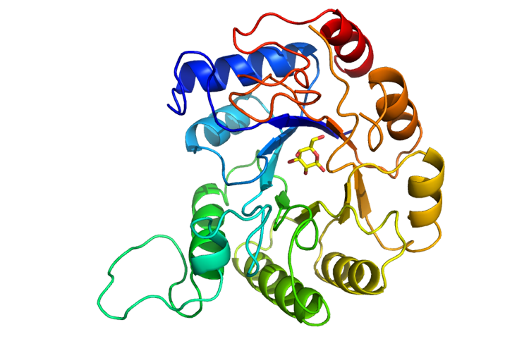
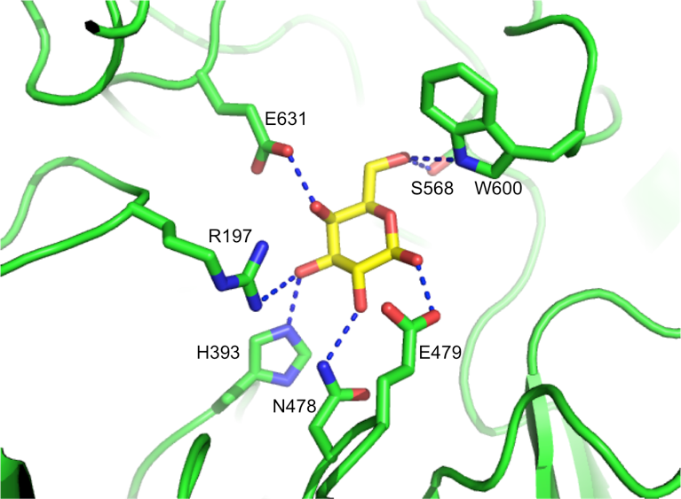
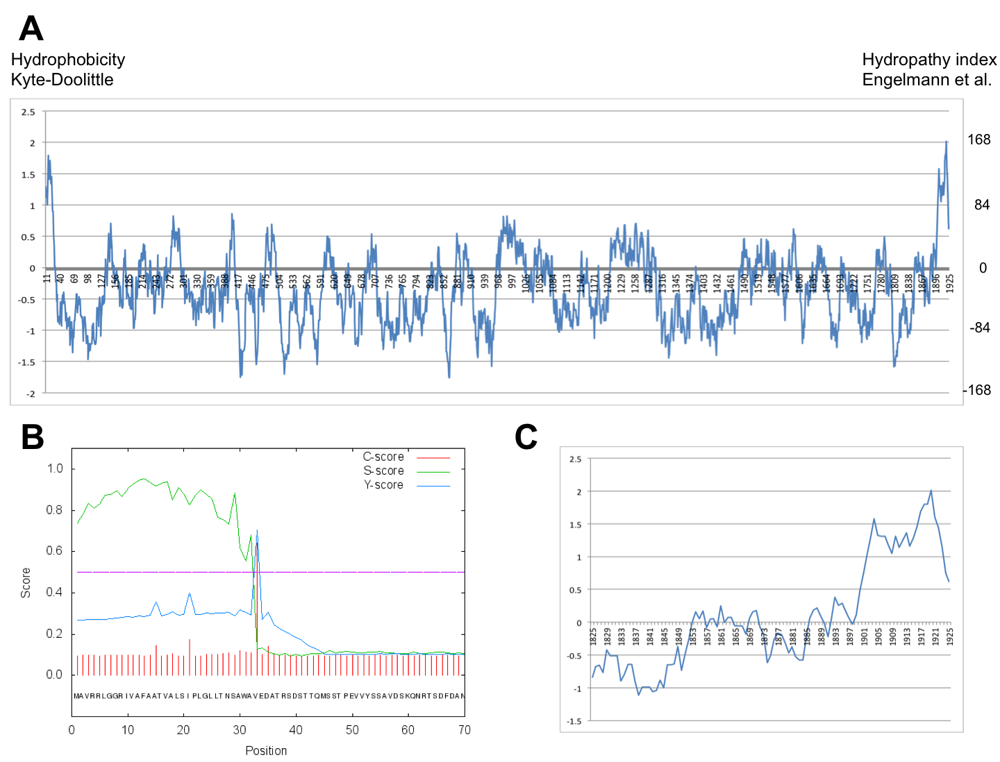
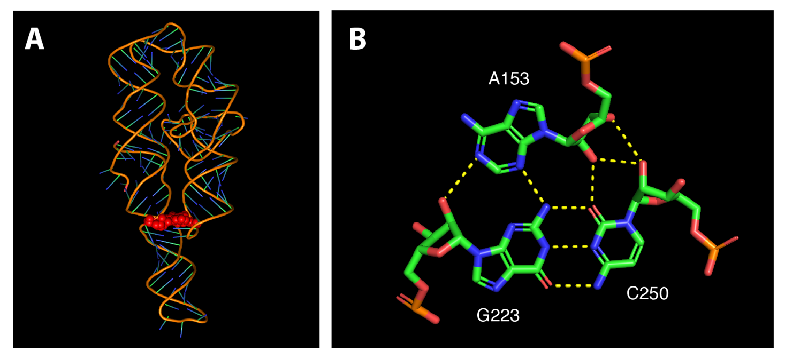
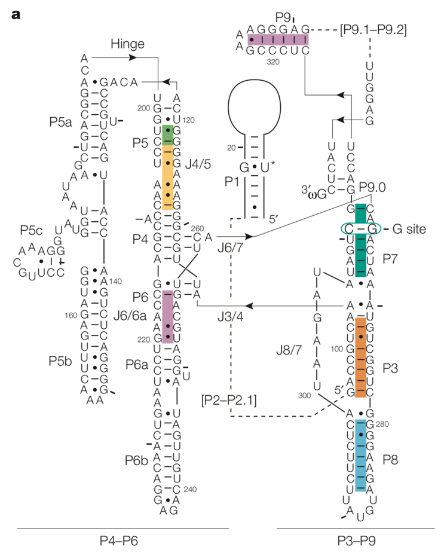
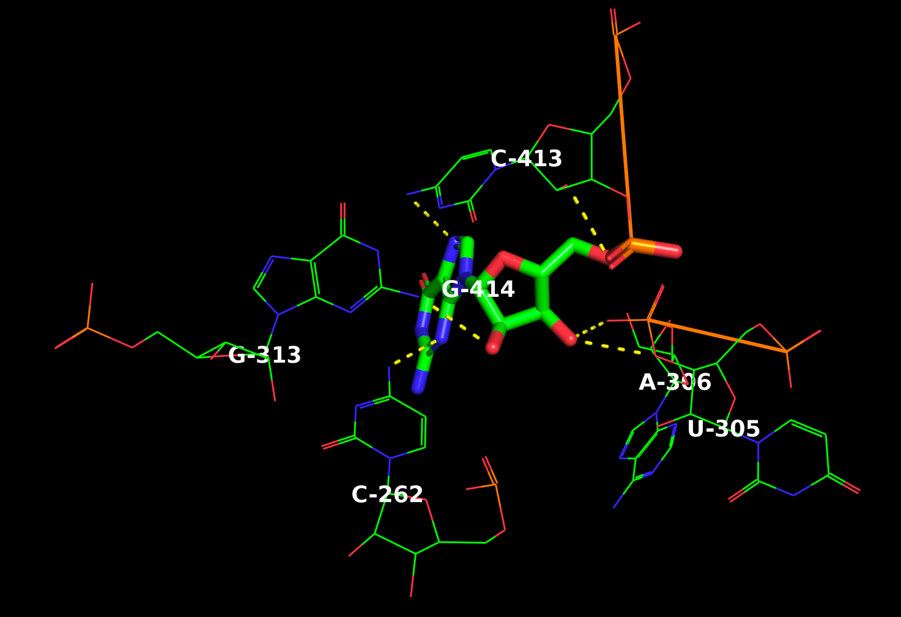
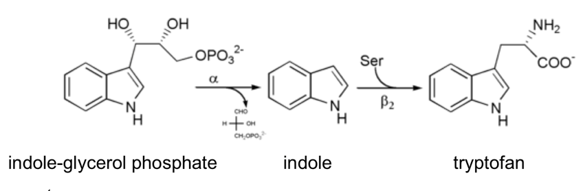
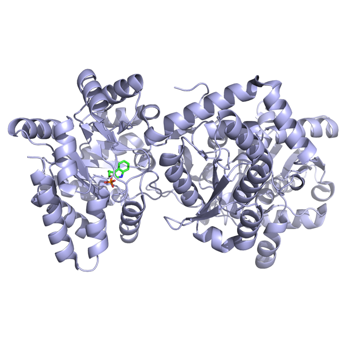

## Opgave 1 (spørgsmål 1 udenfor pensum)

Exosomet er en RNA-nedbrydende maskine, hvis overordnede opbygning er
bevaret fra bakterier til mennesket. I mennesket består exosomet af en
*central ringstruktur*, en *cap-struktur* samt flere *associerede
subunits*.

**Spørgsmål 1.** Beskriv funktionen af ringstrukturen, cap-strukturen og
de associerede subunits Rrp44 og Rrp6 i mennesker, herunder hvilke dele
af komplekset, der er aktive i nedbrydning af RNA.

Ringstrukturen består af RNase PH-domæner, der dog er inaktive i
mennesker. Disse organiserer resten af strukturen, herunder
cap-strukturen, der indeholder flere RNA-bindende proteiner samt Rrp44
og Rrp6, der er de aktive subunits. Rrp44 indeholder både endo- og
exo-nukleaseaktivitet, mens Rrp6 kun indeholder 3\'-5\'
exonukleaseaktivitet.

I archaea består den centrale ringstruktur af blot to forskellige
proteiner, *Rrp41* og *Rrp42*. Brug fetch-funktionen i PyMOL til at
hente strukturen af exosomet fra *Sulfolobus solfactaricus* bundet til
RNA (fetch 4BA2). Opret herefter objekter for Rrp41 og RNA og vis
nærliggende aminosyresidekæder med følgende kommandoer:

create rrp41, chain B

create RNA, chain R

create rrp41_resi, (byres RNA around 3.5 and rrp41)

center RNA

orient RNA

hide all

show cartoon, rrp41

show sticks, rrp41_resi or RNA

color forest, rrp41

color skyblue, RNA

util.cnc rrp41 or RNA

Start med at undersøge protein-RNA interaktionen.

**Spørgsmål 2.** Hvilke typer af sidekæder i Rrp41 deltager i
genkendelsen af RNA? Hvilken del af RNA-molekylet genkendes (baser,
sukkergrupper eller phosphatgrupper) og hvad betyder dette for exosomets
evne til at nedbryde RNA-molekyler med varierende sekvens?

To basiske argininsidekæder, der kun interagerer med phosphat-backbone.
Hermed er exosomet ikke sekvensspecifikt og vil kunne nedbryde alle
typer sekvenser.

**Spørgsmål 3.** I hvilken retning vil du forvente at exosomet nedbryder
RNA (5\'→3\' eller 3\'→5\')? Identificér i strukturen hvilken ende af
RNA\'et, der ligger inde i det aktive site. Passer dette med det
forventede? Forklar dit svar.

3\'-enden findes inde i enzymets aktive site, så retningen er 3\'-5\'.
Det stemmer overens.

Rrp41 benytter en *phosphorolytisk* reaktionsmekanisme til kløvning af
RNA, hvor en phosphat-ion aktiveres til at foretage et nukleofilt angreb
på det inderste nukleotid i det aktive site og der frigives et
*5\'-diphosphatnukleotid* (dvs. ADP, UDP, GDP eller CDP). Strukturen her
indeholder både RNA samt den angribende phosphat-ion.

**Spørgsmål 4.** Identificér phosphat-ionen i strukturen. Hvilke to
atomer må være involverede i det nukleofile angreb under reaktionen for
at der kan produceres et 5\'-diphosphatnukleotid?

Det er det ene iltatom bundet til phosphatgruppen, der foretager et
nukleofilt angreb på phosphoratomet mellem de to sidste nukleotider.
Hermed dannes det 5\'-diphosphatnukleotid, der frigives.

## Opgave 2

**Spørgsmål 1.** Beskriv funktionen af hver af de tre, centrale
aminosyrerester i serinproteasens katalytisk triade under kløvning af et
peptid.

Serine foretager det nukleofile angreb på peptidbindingens
carbonylcarbon. Serine aktiveres af histidine, der fungerer som en
generel base ved at abstrahere -OH protonen fra Ser. Histidins baseevne
forbedres af den nærliggende Asp, der forøger pKa.

Man ønsker at undersøge en serinproteases aktivitet ved brug af et
kromogent substrat (tilsvarende LØ), hvor produktet har en
ekstinktionskoefficient, ε~460~ = 67.000 M^-1^cm^-1^. Substratet
absorberer ikke ved denne bølgelængde.

Det vides at enzymet følger Michaelis-Menten kinetik og har k~cat~ = 50
s^-1^ og K~M~ = 41 µM. Til forsøget startes en reaktion med 1 nM enzym
og 1 mM substrat.

**Spørgsmål 2.** I hvor lang tid (målt i sekunder) er det en god
antagelse at substrat-koncentrationen er konstant under de givne
betingelser? Det kan antages at koncentrationen er konstant indtil den
er faldet til 95% af den originale værdi.

Forsøget udføres ved mættende betingelser da \[substrat\]\>\>K~M~.
Derfor forløber reaktionen ved Vmax = kcat\*\[enzym\] = 50 s-1 \* 1 nM =
50 nM/s. Vi antager at reaktionshastigheden er konstant indtil
\[substrat\]= 0.95 mM, dvs. at der er forbrugt 0.05 mM substrat, og
reaktion vil derfor være konstant i: t = 0.05e-3 M / 50e-9 M/s = 1000 s

Absorbansen måles med et spektrofotometer med en lysvej på 1 cm, der kan
måle præcise absorbanser fra 0,05 til 1,5.

**Spørgsmål 3.** Hvilken absorbans ville du i teorien måle ved den
længste reaktionstid beregnet ovenfor? Bliver lineariteten af den målte
absorbans først begrænset af substrat-koncentrationen eller af
spektrofotometeret?

Absorbansen af 0.05 mM produkt: A = 67000 M-1cm-1 \* 1 cm \* 0.05e-3 M =
3.35

Vi vil altså forvente at lineariteten først begrænses af
spektrofotometeret.

Efterfølgende oprensede man et muteret enzym fra en patient og målte
dannelsen af produkt fra 1 nM enzym ved forskellige
substratkoncentrationer. De eksperimentelle data kan findes i den første
tabel i vedhæftede fil.

**Spørgsmål 4.** Bestem K~M~ og k~cat~ for mutanten.

K~M~ = 8.9\*10^-4^ M, k~cat~ = 8.9\*10^5^ 1/s (se vedhæftede svar i
Excel)

## Opgave 3

*Bifidobacterium bifidum* er en anaerob, gram-positiv bakterie, der ofte
anvendes ved fermentering af mælkeprodukter på grund af dens probiotiske
egenskaber. Af særlig interesse i denne forbindelse er enzymer der er i
stand til at nedbryde lactose. I *B. bifidum* findes adskillige gener
kodende for enzymet *glycosyl hydrolase*, der nedbryder bl.a. lactose
til monosaccharider. Krystalstrukturen af en trunkeret form af ét af
disse enzymer (bbgIII aminosyrerester 33-917) i kompleks med det ene af
de hydrolytiske produkter, *galactose*, er blevet bestemt ved pH 7.6:

{.lightbox width="90%" fig-align="center"}

{.lightbox width="90%" fig-align="center"}

**Spørgsmål 1.** Hvilket foldningsmotiv ses i hydrolasens katalytiske
domæne?

TIM barrel

**Spørgsmål 2.** Angiv hvilke sidekæder der indgår i genkendelsen af O3
og O6 i galactose.

O3 vekselvirker med R197, H393, O6 vekselvirker med S568, W600

**Spørgsmål 3.** Beskriv i det omfang det er muligt hydrogenbindingerne
mellem galactose og aminosyreresterne R197, H393, N478 og W600 med
hensyn til ladninger, donor- og acceptoratomer.

Da strukturen er løst ved pH 7.6, er R197 protoneret og bærer en positiv
ladning medens H393 sandsynligvis vil være neutral da
histidine-sidekæden har en pKa-værdi omkring 6.  De to øvrige sidekæder,
asparagine og tryptophan, er begge uden ladning.

Hydrogen-binding R197-O3: R197 er donor og O3 acceptor

Hydrogen-binding H393-O3: Der kan ikke entydigt identificeres donor og
acceptor. Højst sandsynligt vil histidine være donor og O3 acceptor.
Sædvanligvis afbildes histidine med en proton på N-epsilon. (Dette
skyldes, at N-epsilon sædvanligvis bærer protonen (99%) medens den
tautomere form med protonen på N-delta har en hyppighed på  1%.)

Hydrogenbinding N478 - O2: Asparagin donerer en amid-proton og O2 er
acceptor

Hydrogenbinding W600 - O6: Tryptophan er donor og O6 acceptor

Nedenfor er vist et hydropatiplot (Kyle-Doolittle hydrophobicity plot)
for fuldlængde *bbgIII* (A), signalP-forudsigelse (B) for de 70
N-terminale aminosyrer samt i (C) et nærbillede af hydropatiplottet for
de 100 C-terminale aminosyrer.

{.lightbox width="90%" fig-align="center"}

**Spørgsmål 4.** Foreslå en subcellulær placering af bbgIII og begrund
dit forslag.

Sandsynligvis forankret i cellemembranen i det periplasmiske rum.
Hydropati-plottet viser at der både N- og C-terminalt er hydrofobe
områder. N-terminalt er det formodentligt del af et signalpeptid, der er
karakteriseret ved et hydrofobt område. C-terminalt er der tale om en
transmembran helix, der forankrer proteinet i membranen.

## Opgave 4

Den selvsplejsende intron (af type I) fra *Tetrahymena* er et eksempel
på et ribozym, hvor et RNA-molekyle kløver og ligerer sig selv, hvorved
en intron fjernes mellem to exoner in en protein-kodende region.

En del af RNA-strukturen danner en *pseudoknot* via en triplet
base-interaktion markeret med rødt i A nedenfor. Triplet-interaktionen
er desuden vist i detaljer med angivelse af polære interaktioner i B.

{.lightbox width="90%" fig-align="center"}

**Spørgsmål 1.** Beskriv triplet-interaktionen i figur B. Hvilke kanter
af baserne interagerer og hvad kaldes denne type interaktion?

GC er cWW. GA er WS og SS. CA er SS. A interagerer i minor groove af GC
basepar. Pseudoknot, A minor interaction.

Vi skal nu kigge på en version af molekylet, der også indeholder det
katalytiske site:

fetch 1GRZ\
remove chain B\
hide all\
show ribbon

Brug herefter menuen \"Display \> Sequence\" til at vise sekvensen.

**Spørgsmål 2.** Identificér baseparret G264:C311 samt 3\'-enden i
strukturen og vis dem med \"sticks\". Hvad er den omtrentlige minimale
afstand (målt i Å) mellem det pågældende basepar og nucleotidet i
3\'-enden af strukturen? Brug menuen \"Wizard \> Measurement\" til at
måle.

5.2 Å

I figuren herunder er den tilhørende sekundærstruktur vist, hvor man kan
se \"G site\" hvor \"guanosine co-factor\" bindes.

{.lightbox width="90%" fig-align="center"}

I første trin at splejsningsprocessen reagerer U\* i P1 stem
med \"guanosin cofaktor\" via en transesterficeringsreaktion.

**Spørgsmål 3.** Hvilken type basepar indgår det reaktive U i og hvilken
sekundær struktur er U'et placeret i? Hvilken stem (P1-9) i strukturen i
figuren ses en pseudoknot?

GU wobble basepar. Hairpin. P3.

I andet trin af splejsningsprocessen reagerer G414 med 3\'-OH på 5\'
exon via en ny transesterficeringsreaktion. G414 er ikke baseparret, men
har alligevel en specifik orientering, der er vigtig for
reaktionsmekanismen.

**Spørgsmål 4.** Beskriv (baseret på krystalstrukturen) nogle af de
polære kontakter der koordinerer G414 i en specifik orientering og
hvilken base interagerer med 3' OH gruppen på G414.

Hint: Identificér først G414, vælg og centrér på den. Vis så hele
molekylet med \"lines\" eller \"sticks\" og brug menuen \"A \> find \>
polar contacts \> to other atoms in object\" på det valgte nukleotid til
at finde interaktioner.

U305 3'-O interaktion med G414 backbone 3'-OH, A306 fosfatinteraktion
med G414 backbone 3'-OH, G313 interaktion med G414 sukker 2\'-OH, C413
interaktion med G414 fosfat, C413 interaktion med G414 base og C262
interaktion med G414 base.

{.lightbox width="90%" fig-align="center"}

## Opgave 5

I biosyntesen af aminosyren tryptophan indgår en række enzymer, der alle
kodes af den såkaldte *trp* operon. *trp* operon koder for 5
polypeptider, der til sammen katalyserer 5 delreaktioner, men der er
ikke en direkte sammenhæng mellem genprodukter og reaktioner.

**Spørgsmål 1.** Giv to eksempler på hvordan der er en manglende direkte
sammenhæng mellem genprodukter og reaktioner i *trp* operon.

trpE og trpD koder hver for en halvdel af én enzym, anthranilate
synthetase, trpC koder for ét enzym, der katalyserer to separate
reaktioner og endelig koder trpB og trpA også for hver en halvdel af
tryptophan synthetase.

Enzymet *tryptophan synthase* er det sidste del af pathway\'en fra
stoffet *indole 3-glycerol phosphate* til slutproduktet tryptophan og
udviser fænomenet *\"substrate channeling\"*:

{.lightbox width="90%" fig-align="center"}

**Spørgsmål 2.** Forklar kort, hvad *\"substate channeling\"* dækker
over samt hvorfor det er nødvendigt for enzymet i dette tilfælde.

Substrate channeling dækker over det fænomen at et mellemprodukt
kanaliseres inde i enzymet fra ét aktivt site til det næste. Det kan
være nødvendigt hvis mellemproduktet er meget reaktivt eller giftigt for
cellen. Endelig kan det være med til at effektivisere processen.

Nedenfor ses strukturen af tryptophan synthase bundet til en substratet
indole 3-glycerol phosphate (grønt).

{.lightbox width="90%" fig-align="center"}

**Spørgsmål 3.** Angiv hvor mange domæner, enzymet består af samt
hvilken af enzymets to reaktioner, der katalyseres i domænet med
substrat bundet. Hvad er produktet af denne reaktion og hvorledes indgår
dette i \"substrate channeling\"?

Der er to domæner i hver af to subunits. Indole 3-glycerol phosphate er
udgangsstoffet for de to reaktioner katalyseret af enzymet (jvf.
ovenfor), så det må være den første reaktion, der katalyseres i det
viste domæne. Produktet er indole, der beskyttes via substrate
channeling under transport til det andet domæne.

Tabellen nedenfor angiver reaktionshastigheder for tryptophan synthase
målt i nM/min for tre forskellige koncentrationer af indole 3-glycerol
phosphate (IGP) og fem forskellige koncentrationer af indole (I), begge
målt i mM.

+---------+---------+---------+---------+---------+---------+
| \[i\]   | 0       | 0.25    | 0.5     | 0.75    | 1       |
|         |         |         |         |         |         |
| \[IGP\] |         |         |         |         |         |
+=========+=========+=========+=========+=========+=========+
| 0.07    | 5.39    | 4.19    | 3.49    | 2.81    | 2.55    |
+---------+---------+---------+---------+---------+---------+
| 0.03    | 3.25    | 2.45    | 2.17    | 1.77    | 1.65    |
+---------+---------+---------+---------+---------+---------+
| 0.01    | 1.59    | 1.30    | 1.08    | 0.91    | 0.85    |
+---------+---------+---------+---------+---------+---------+

**Spørgsmål 4.** Analysér de kinetiske data via en grafisk fremstilling
og angiv hvilken type inhibitor, indole udgør. Kom med en biokemisk
forklaring på dette ud fra din viden om enzymet.

Skæringen med y-aksen varierer mens linjerne samles i et punkt på den
negative x-akse. Indole er en non-kompetitiv inhibitor.