## Opgave 1

I planten alm. gåsemad (*Arabidopsis thaliana*) findes en
chitin-genkendende receptor, **AtCERK1** og krystalstrukturen af den
ekstracellulære del af proteinet bundet til et chitin-fragment er blevet
bestemt. Nedenfor ses overfladen af AtCERK1 i grønt med
chitin-fragmentet som \"sticks\" farvet efter atomtype (C-gul, N-blå,
O-rød).

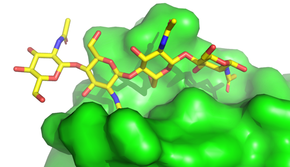{.lightbox width="90%" fig-align="center"}

**Spørgsmål 1.** Angiv hvilken ende af den viste chitin-tetramer, der er
den [reducerende ende]{.underline}. Forklar dit svar.

SVAR: Den reducerende ende er til højre på figuren. Det ses at det
anomere carbon (position 1) ikke er involveret i en glycosid binding.
Sukker ringen er derfor i ligevægt med den åbne form med en fri
aldehydgruppe, der er reducerende.

Chitin er en oligomer af N-acetyl-glucosaminer alle forbundet med samme
type glycosidbinding.

**Spørgsmål 2.** Angiv typen af glycosidbinding, herunder
konfigurationen omkring det anomere kulstofatom samt nummeret på de to
indgående kulstofatomer.

SVAR: Det er en β(1→4) glycosid binding. Det ses at det er en
β-konfiguration da C6 og O1 er på samme side af ringen (ses nemmest på
NAG nummer 2 fra højre). De to carbon atomer der indgår er C1, det
anomere carbon, og C4. Det ses nemmest på glycosid-bindingen længst til
venstre.

Nedenfor er angivet sekvensen af AtCERK1 samt vist en
cartoon-repræsentation af strukturen farvelagt med en \"rainbow\" fra
blå i N-terminalen til rød i C-terminalen. Desuden er tre disulfidbroer
vist med lilla \"sticks\".

10 20 30 40 50

\| \| \| \| \|

G**[C]{.mark}**RTS**[C]{.mark}**PLALASYYLENGTTLSVINQNLNSSIAPYDQINFDPILRYNSNI

KDKDRIQMGSRVLVPFP**[C]{.mark}**E**[C]{.mark}**QPGDFLGHNFSYSVRQEDTYERVAISNYAN

LTTMESLQARNPFPATNIPLSATLNVLVN**[C]{.mark}**S**[C]{.mark}**GDESVSKDFGLFVTYPLR

PEDSLSSIARSSGVSADILQRYNPGVNFNSGNGIVYVPGRDPNGAFPPFKS

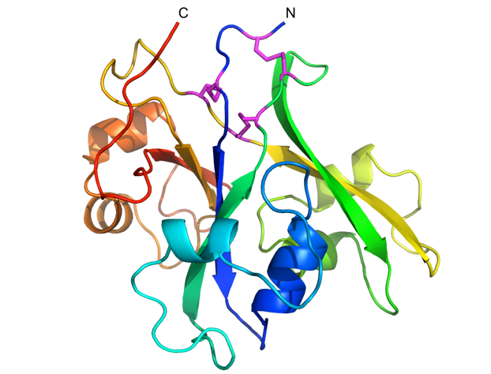{.lightbox width="90%" fig-align="center"}

**Spørgsmål 3.** Angiv under angivelse af sekvensnumre, hvilke [tre par
af cysteinrester,]{.underline} der danner disulfidbroer.

SVAR: Cys2-Cys70, Cys6-Cys132, Cys68-Cys130

Den vedhæftede PDB-fil Opgave1_nagbind.pdb indeholder et fragment af
strukturen af AtCERK1 samt én af N-acetyl-glucosamineresterne fra det
bundne fragment. Åbn strukturen i PyMOL, vis den som sticks og centrér
på C7 i N-acetyl-glucosaminresten med følgende kommando:

center (resi 814 and name C7)

Vis derefter fire afstande med følgende kommandoer:

dist (resi 814 and name O7), (resi 110 and name N)

dist (resi 814 and name N2), (resi 141 and name O)

dist (resi 814 and name C8), (resi 107 and name CG1)

dist (resi 814 and name C8), (resi 143 and name CD1)

**Spørgsmål 4.** Beskriv hvilke typer af vekselvirkninger der er
ansvarlige for genkendelse af [N-acetyl-gruppen]{.underline} af AtCERK1.

SVAR: N-acetylgruppen genkendes via 2 hydrogenbindinger. Den ene er
mellem amid nitrogen (H-bindings donor) i aminosyrerest 110 og carbonyl
gruppen (H-bindings acceptor) i N-acetylgruppen. Den anden er mellem
amid nitrogen (H-bindings donor) i N-acetylgruppen og carbonyl gruppen
(H-bindings acceptor) i aminosyrerest 141. Methylgruppen i
N-acetyl-gruppen vekselvirker i en hydrofob lomme via van Der Waals
kontakter med sidekæderne i Val107 og Leu143.

## Opgave 2

Forskere har undersøgt en arvelig sygdom ved hjælp af sekventering og
sporet problemet til mutationer i genet for proteinet **PKI**, der er en
proteinkinase-inhibitor. Det viste sig ydermere, at sygdommen kan
forekomme i en let, mellem eller svær udgave, afhængig af den konkrete
mutation:

  -----------------------------
  Sværhedsgrad   Mutation
  -------------- --------------
  Let            I231V

  Mellem         I231N

  Svær           I231P
  -----------------------------

**Spørgsmål 1.** Foreslå med udgangspunkt i aminosyrernes egenskaber og
din viden om proteiners foldning i almindelighed, hvorfor de angivne
mutationer fører til sygdomme af forskellig sværhedsgrad.

SVAR: Umiddelbart 3 point for hver af de første og 4 for den sidste.
I231V er en konservativ mutation, og har sandsynligvis kun en mindre
effekt. I231N er en ikke konservativ mutation. For at få fulde point i
proline mutationen skal det nævnes at den kan virke struktur
destabiliserende. Hvis blot de nævnes at den ikke er konservativ gives 2
point.

Efterfølgende analyseres bindingen af PKI samt mutanterne til den
tilhørende proteinkinase med *surface plasmon resonance*-teknikken med
følgende resultater:

  ---------------------------------------------
  PKI-variant     k~on~          k~off~
  --------------- -------------- --------------
  Vildtype        1,1 · 10^6^    3,2 · 10^-3^
                  M^-1^ s^-1^    s^-1^

  I231V           9,8 · 10^5^    3,3 · 10^-2^
                  M^-1^ s^-1^    s^-1^

  I231N           1,0 · 10^6^    1,2 · 10^-1^
                  M^-1^ s^-1^    s^-1^

  I231P           1,0 · 10^6^    89 s^-1^
                  M^-1^ s^-1^    
  ---------------------------------------------

**Spørgsmål 2.** Bestem K~d~ for hver variant og kom med en forklaring
på den observerede sammenhæng mellem styrken af inhibitoren og
sygdommens sværhedsgrad.

SVAR: Beregningen foretages som K~d~=k~off~/k~on~

  -----------------------------------------------------------------------
  Wild type               2,9 · 10^-9^ M          2,9 nM
  ----------------------- ----------------------- -----------------------
  I231V                   3,4 · 10^-8^ M          34 nM

  I231N                   1,2 · 10^-7^ M          120 nM

  I231P                   8,9 · 10^-5^ M          89μM
  -----------------------------------------------------------------------

Halvdelen af pointene gives for hvert spørgsmål. I det første spørgsmål
gives der 3 point hvis de laver den rigtige udregning af
(K~d~=k~off~/k~on~), men kludrer i tier potenserne. Der gives et point
hvis de bytter om på k~on~ og k~off~. Der trækkes et point hvis de ikke
angiver korrekte enheder.

I anden opgave kræver fulde point at de identificerer at svagere binding
giver sværere sygdom. Der giver ikke point hvis de foreslår at en høj
K~d~ svarer til en stærk inhibitor.

De cellulære koncentrationer af PKI og kinasen er hhv. 120 nM og 50 pM.
Det kan desuden antages at mutationerne ikke ændrer på proteinernes
koncentration samt at kinasen er helt inaktiv når den har bundet PKI.

**Spørgsmål 3: Estimér kinasens aktivitet (i omtrentlig % af
ikke-inhiberet enzym) ved tilstedeværelse af hver variant af PKI.
Begrund dine svar.**

SVAR: Denne opgave kan løses præcist ved en udregning eller ved blot at
sammenligne koncentration af PKI med K~d~. Der gives kun 10 point for en
udregning, og op til 7 point for et kvalitativt svar.

Udregning:

K~d~=\[E\]\[PKI\]/\[E-PKI\] = f~E~ c~PKI~/ f~E-PKI~

f~E~ + f~E-PKI~ = 1

K~d~ (1 - f~E~) = f~E~ c~PKI~

K~d~ = f~E~ (c~PKI~ + K~d~)

f~E~ = K~d~/(c~PKI~ + K~d~)

  -----------------------------------------------------------------
  Wild type                        2%
  -------------------------------- --------------------------------
  I231V                            22%

  I231N                            50%

  I231P                            100%
  -----------------------------------------------------------------

Det er ikke nødvendigt at selv at udlede ligningen for at få fulde
point.

Kvalitativt svar:

For WT proteinet er c~PKI~ \>\> K~d~. Derfor er der næsten ingen
aktivitet. For I231V er c~PKI~ \> K~d~, men ikke \>\>. Derfor er der
nogen aktivitet, men under halv. For I231N er Kd = c~PKI~. Derfor 50%
aktivitet. For I231P er Kd \>\> c~PKI~, derfor er der næsten fuld
aktivitet. Der giver op til 4 point for korrekte svar der ikke henviser
til forholdet imellem Kd og koncentrationen.

Til behandling af den pågældende sygdom har man udviklet en ny inhibitor
for kinasen, **SynPKI**, hvis binding er karakteriseret vha.
NMR-titrering, hvor koncentrationen af kinasen holdes konstant på 50 μM
mens koncentrationen af inhibitoren varieres. Det vedhæftede Excel-ark
Opgave2_data.xlsx indeholder en liste med kemiske skift målt via et
NMR-signal fra kinasen og som en funktion af koncentrationen af SynPKI.

**Spørgsmål 4. Benyt NMR-titreringen til at bestemme K~d~ for SynPKI i
forhold til kinasen.**

SVAR: Opgaver kan enten løses med et ikke lineært fit, eller grafisk ved
aflæsning af en kurve. Der giver fuldt point for et ikke lineært fit, og
op til 7 point for en aflæsning

Man kan vælge to forskellige funktioner til fittet: En hvor
koncentrationen af proteinet er meget lavere end omslagspunktet og
dermed kan ignoreres. Det er meste denne vi har arbejdet med i TØ, og
det ville blive betragtet som et fuldt svar da koncentrationen er mere
end en størrelsesorden under Kd. Man kan også bruge det fulde
kvadratiske fitte udtryk:

$$Y = K_{1} - K_{2} \times \ (c + K_{d} + \ P)\sqrt{{(c + K_{d} + \ P)}^{2} - 4P \times c\ }$$

Løsning af opgaven med SOLVER funktionen i Excel:

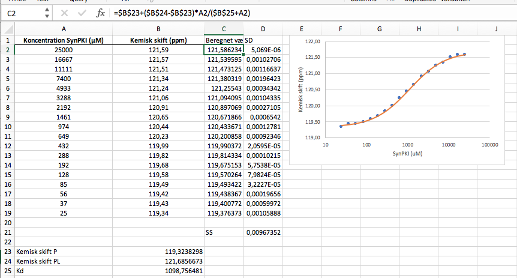{.lightbox width="90%" fig-align="center"}

## Opgave 3 (udenfor pensum)

Med henblik på strukturelle studier har forskere oprenset RNA-exosomet
fra en stamme af alm. bagegær, *Saccharomyces cerevisiae,* hvor genet
kodende for Rrp6 er fjernet genetisk (en *Δrrp6*-stamme). Oprensningen
er foregået via et Tandem Affinity Purification (TAP) tag på proteinet
Rrp46.

**Spørgsmål 1.** Forklar hvordan man kan benytte et TAP-tag til
isolering og karakterisering af større proteinkomplekser, herunder de
eksperimentelle trin, der indgår i analysen.

SVAR: Ét protein tagges med tandem affinity purification (TAP) tag og
hiver de andre med ud. Teknikken benytter sig af en dobbelt
affinitetsoprensning baseret på et Protein A-tag (binder til IgG beads)
og et calmodulin-bindende peptid. Her i mellem findes et Tev-site, der
bruges til at frigøre komplekserne fra IgG-søjlen. Efter oprensning kan
bånd identificeres vha. MS. Baseret på:
https://www.sciencedirect.com/science/article/pii/S1046202301911831

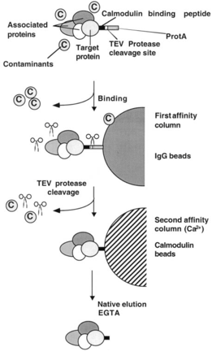{.lightbox width="90%" fig-align="center"}

**Spørgsmål 2.** Forklar hvilke overvejelser, der kunne ligge til grund
for at vælge en stamme, der er *Δrrp6*, herunder hvorfor dette kan være
vigtigt i forbindelse med strukturløsning af komplekset.

SVAR: Proteinet Rrp6p er en del af kerneexosomet, men ikke det exosom,
der findes i cytoplasma. Derfor vil man ved at arbejde med en
*Δrrp6*-stamme kunne fokusere på strukturen af det centrale exosom.

Efter TAP-oprensningen opnåedes to forskellige fraktioner med exosomet,
kaldet **CE** og **RE**. I figur (a) nedenfor ses en SDS-PAGE gel med de
to fraktioner og i panel (b) et kromatogram efter oprensning af de to
fraktioner på en gelfiltreringssøjle.

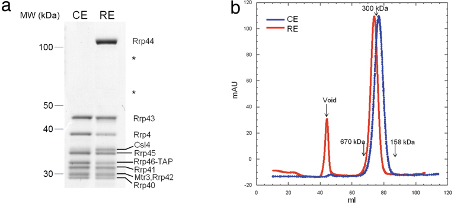{.lightbox width="90%" fig-align="center"}

**Spørgsmål 3.** Forklar hvordan indholdet af CE og RE adskiller sig og
anslå den omtrentlige molekylemasse (i hele hundrede kDa) af de to
komplekser. Forklar desuden baseret på din viden om exosomet hvorfor
netop disse to komplekser optræder.

SVAR: CE (core exosome) indeholder alle proteiner i exosomets tønde samt
\"cappen\" i den ene ende. Denne er katalytisk inaktivt i gær. RE (Rrp44
exosome) indeholder tillige proteinet Rrp44p, der er en katalytisk
subenhed. Ud fra gelfiltreringskromatogrammet kan vi estimere masserne
af de to komplekser til ca. 200 og ca. 400 kDa. I virkeligheden er de
284 og 398 kDa. Rrp44p er løsere knyttet til \"core exosome\" end de
andre proteiner, derfor kan man oprense tønden uden den katalytiske
enhed.

Baseret på: https://www.pnas.org/content/104/43/16844

Efterfølgende analyserede man komplekserne CE og RE vha. \"negative
stain\" elektronmikroskopi. Resultatet af dette er vist nedenfor.

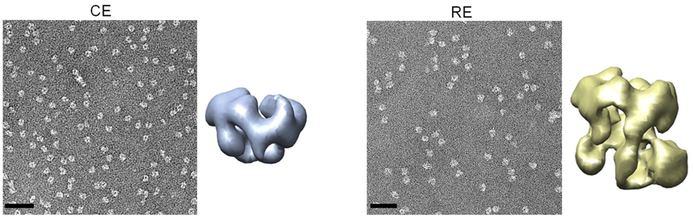{.lightbox width="90%" fig-align="center"}

**Spørgsmål 4.** Forklar hovedprincipperne i strukturløsning med
\"negative stain\"-metoden og kom med en fortolkning af strukturerne,
herunder overordnet form samt hvilke(t) protein(er), der udgør den
ekstra densitet i RE.

SVAR: I negative stain EM spottes prøven på et grid, hvorefter der
behandles med et stain (f.eks. uranyl acetate) og prøven tørres. Dette
får den meget elektronabsorberende stain til at danne aflejringer rundt
om proteinkomplekserne, der gør disse lettere at se i mikroskopet. Vi
ser at RE er større end CE men at toppen (tønden) minder om hinanden i
de to rekonstruktioner. Vi kan dermed konkludere at den ekstra densitet
nederst til højre må svare til Rrp44p.

## Opgave 4

Et antistof, der specifikt binder den kemiske forbindelse **1,**
katalyserer tillige nedbrydningen af stofferne **3-5** som angivet
nedenfor.

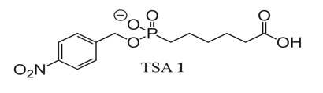{.lightbox width="90%" fig-align="center"}

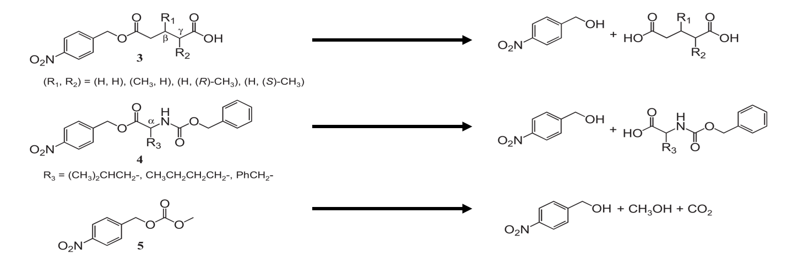{.lightbox width="90%" fig-align="center"}

**Spørgsmål 1.** Ud fra bindingen til **1**, forklar hvordan antistoffet
kan katalysere disse reaktioner.

SVAR: Der er tale om et katalytisk antistof. Eftersom enzymer
katalyserer en proces ved at stabilisere transitionstilstanden for den
pågældende reaktion, gælder det om at danne antistoffer mod stabile
analoger til transitionstilstanden. Stof **1** har en fosfat gruppe der
svarer til den pentavalente TS der opstår når en ester binding skal
hydrolyseres.

Antistoffet har såkaldt "bred substratspecificitet", dvs. at det er i
stand til at nedbryde meget forskellige stoffer. For at undersøge
hvordan det kan lade sig gøre, forsøgte man at løse strukturen af
antistoffet i kompleks med stof **1**, men det kunne ikke lade sig gøre.
Det lykkedes dog at få krystaller af komplekset mellem antistoffet og
stof **2.**

Strukturen er angivet nedenfor, hvor den tunge kæde af antistoffet er
vist i grøn, den lette kæde i turkis og stof **2** i gul (for
kulstofatomerne).

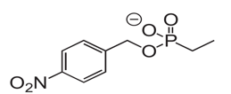{.lightbox width="90%" fig-align="center"}**2**

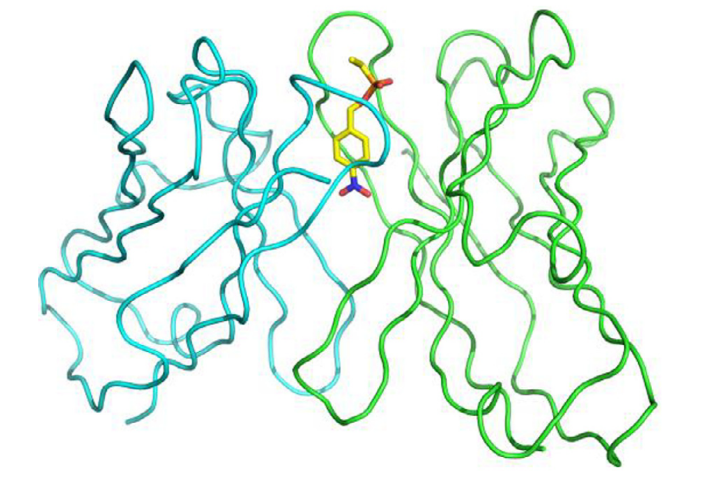{.lightbox width="90%" fig-align="center"}

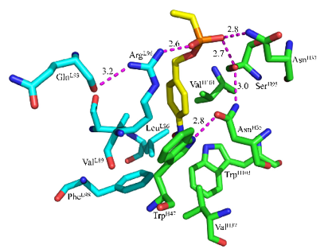{.lightbox width="90%" fig-align="center"}

**Spørgsmål 2.** Angiv baseret på strukturen en forklaring på hvorfor
antistoffet har så bred specificitet.

SVAR: PDB struktur 5XQW. Antistoffet binder kun stabilt til en meget
lille del af substratet, dvs. resten kan flagre frit -- derfor kan der
være mange forskellige grupper påhæftet.

Aktiviteten af enzymet carbonisk anhydrase (CA) hæmmes aktiviteten af
anionen trithiocarbonat (CS~3~^2-^). I strukturen af komplekset mellem
CA og CS~3~^2-^ er anioninen koordineret på følgende vis:

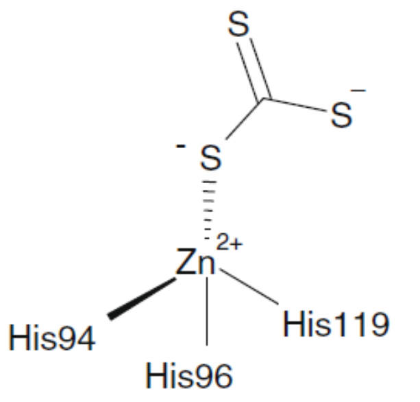{.lightbox width="90%" fig-align="center"}

**Spørgsmål 3.** Ud fra dit kendskab til strukturen og mekanismen for
CA, diskutér hvilken slags inhibitor CS3^2-^ er, og hvorfor stoffet
inhiberer enzymet.

SVAR: CS~3~^2-^ binder i det aktive sæde (lige ved Zn^2+^-ionen) så den
er en kompetitiv inhibitor. Mere specifikt binder den der hvor H~2~O
ellers binder snarere end CO~2~ (selvom den nok kunne tænkes at minde om
CO~2~ udfra tilstedeværelsen af en C=S dobbeltbinding), så den er mere
end en simpel substratanalog.

Tabellen nedenfor angiver reaktionshastigheder for et enzym målt i
nM/min for tre forskellige koncentrationer af substrat (S) og fem
forskellige koncentrationer af en inhibitor (I), begge målt i mM.

+---------+---------+---------+---------+---------+---------+
| \[i\]   | 0       | 0.25    | 0.5     | 0.75    | 1       |
|         |         |         |         |         |         |
| \[S\]   |         |         |         |         |         |
+=========+=========+=========+=========+=========+=========+
| 0.07    | 5.39    | 4.19    | 3.49    | 2.81    | 2.55    |
+---------+---------+---------+---------+---------+---------+
| 0.03    | 3.25    | 2.45    | 2.17    | 1.77    | 1.65    |
+---------+---------+---------+---------+---------+---------+
| 0.01    | 1.59    | 1.30    | 1.08    | 0.91    | 0.85    |
+---------+---------+---------+---------+---------+---------+

Spørgsmål 4. Analysér de kinetiske data via en grafisk fremstilling og
angiv hvilken type inhibitor der er tale om.

Skæringen med y-aksen varierer mens linjerne samles i et punkt på den
negative x-akse. Inhibitoren I er en non-kompetitiv inhibitor.

## Opgave 5

Somatotropin (STH) er et hormon, der folder stabilt som fire α-helicer
(et \"four helix bundle\") og binder to forskellige membran-bundne
receptorkinaser, RTK1 og RTK2.

Nedenfor er vist resultatet af et forsøg med gelfiltrering af STH og
receptordomænerne af RTK1 og RTK2 både hver for sig (grå, rød og blå
kurver) og sammen (grøn).

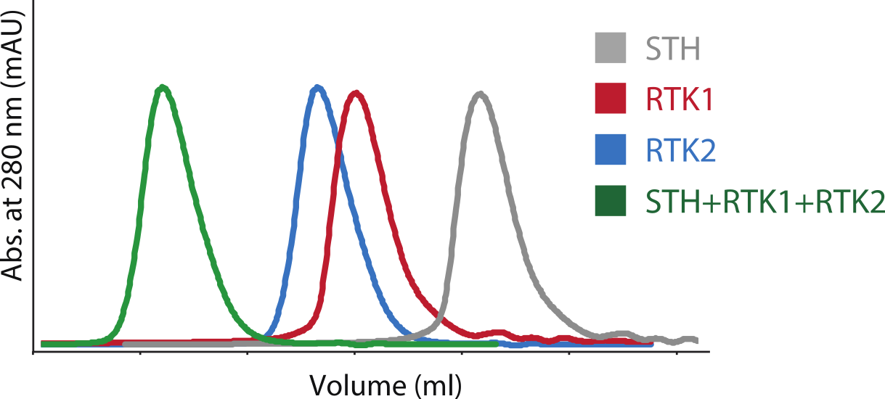{.lightbox width="90%" fig-align="center"}

**Spørgsmål 1.** Foreslå på baggrund af dette eksperiment en sandsynlig
aktiveringsmekanisme for receptorkinaserne RTK1 og RTK2

SVAR: **Ligand-induceret hetero-dimerisering.** Binding af hormonet STH
bringer de to receptor sammen (hetero-dimerisering) og derved kunne man
forestille sig at de intracellulære (tyrosine) kinase også kommer sammen
og kan aktivere hinanden ved trans-fosforylering.

En sjælden variant af RTK1 medfører en alvorlig genetisk lidelse.
Sekvensen af en lille del af kinasedomænet fra den variante RTK1*a* er
vist nedenfor i et alignment med af den normale RTK1-sekvens.

RTK1 1151 - DFGMTRDIYEDTYRKGGKG - 1169

RTK1*a* 1151 - DFGMTRDILEDTYRKGGKG - 1169

**Spørgsmål 2.** Giv en biokemisk forklaring på hvorfor
RTK1*a*-varianten giver sygdom ud fra dit generelle kendskab til
kinasers sekvens, struktur og funktion.

SVAR: Y1159 i RLK1 er muteret til L1159 i RLK1*a* varianten
(**Y1159L**).

Mutationen Y1159L i kinasedomænet af tyrosinereceptorkinasen medfører
højst sandsynligt at kinasen ikke kan phosphoryleres og derved aktiveres
(kunne være en tyrosin i aktiveringsloopet) og derfor giver varianten
sygdom.

Proteinet JAT har desuden vist sig at være essentielt for
STH-signalering og ud fra aminosyresekvensen af JAT identificeres et
N-terminalt kinasedomæne samt et C-terminalt SH2 domæne.

**Spørgsmål 3.** Forslå en funktion for de to domæner i JAT under
STH-signalering.

SVAR: SH2 domænet binder **phosphotyrosine**, så man kunne forvente at
JAT forbinder (wirering) signalering fra tyrosinkinaserne RTK1/2 ved at
binde phosphotyrosiner (docking site). Derudover kunne JAT
**amplificere** signalet via dets kinasedomæne.

Man finder at endnu et protein, MC1, indeholdende et
helix-turn-helix (HTH) domæne, har en vigtig rolle i STH-signalering.

**Spørgsmål 4.** Hvilken rolle kunne MC1 tænkes at have?

SVAR: HTH-domæner binder DNA. MC1 kunne være en
**transskriptionsfaktor** (binder DNA via sit HTH-domæne) som er vigtig
for STH signalering (ændre genekspressionen).
