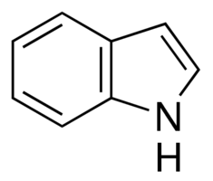
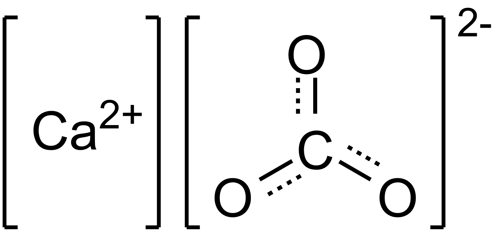
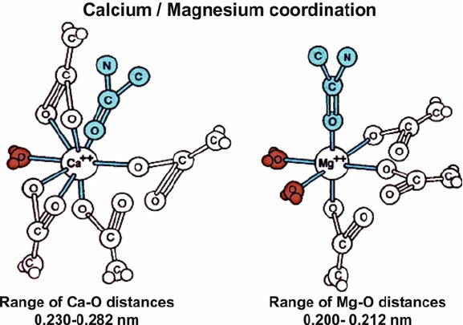
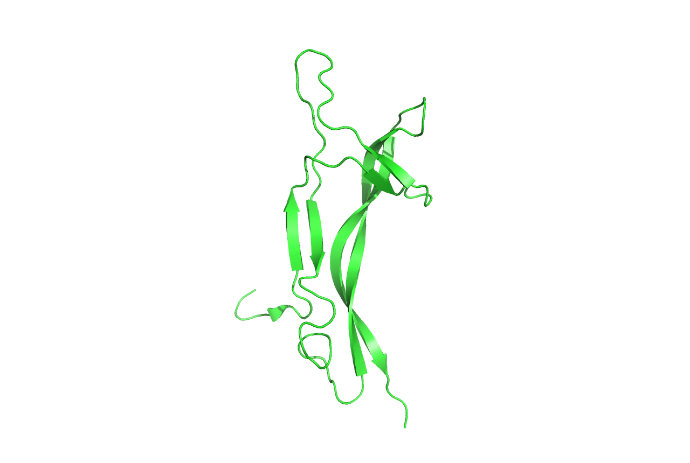
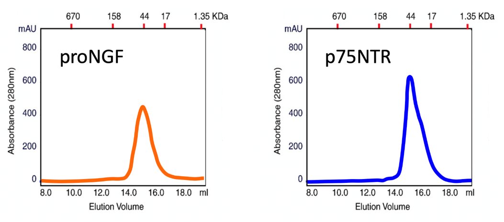
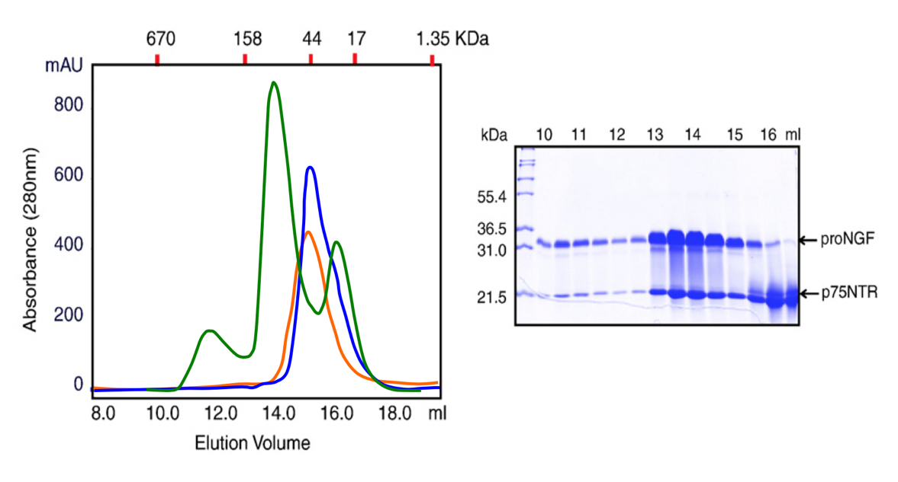

## Opgave 1

I *E. coli* binder Trp repressor en specifik DNA-sekvens under
tilstedeværelse af aminosyren [tryptofan]{.underline} og hæmmer dermed
udtryk af fem gener i *trp* operon. Trp repressor danner en homodimer,
der binder til DNA via to α-helicer (kaldet genkendelseshelicer).
Strukturen af Trp repressor bundet til DNA kan ses i vedhæftede
PyMOL-fil (**Trp repressor.pse**).

**Spørgsmål 1.** I hvilke DNA grooves binder Trp repressors to
genkendelseshelicer? Mål afstanden mellem helicerne i de to grooves.
Hvilken helixparameter svarer denne afstand til og hvorfor observeres
denne afstand typisk for transskriptionsfaktorer?

SVAR: Major groove. Ca. 31,6 Å, hvilket ca. svarer til pitch (afstand
for fuldt turn = 10.44 bp/turn x 3.4 Å rise/bp) = 35,5 Å.
Transskriptionsfaktorer er ofte homodimerer, der binder symmetrisk i
major groove.

Tryk **F2** for at se et strukturelt alignment af Trp repressor i den
DNA-bundne form (grå) med *apo*-formen (ikke bundet til Trp eller DNA,
lyserød).

**Spørgsmål 2.** Hvilken del af proteinet påvirkes mest af binding af
Trp og DNA? Mål afstanden mellem de to genkendelseshelicer
i *apo*-repressoren, og beskriv hvilken effekt ændringen må forventes at
have på binding til DNA.

SVAR: Genkendelseshelicernes position ændres mest. Afstanden mellem
genkendelseshelicerne er nu 24.5 Å. Det ser ud til at
genkendelses-helicerne kommer for tæt på DNAs rygrad og derfor ikke kan
binde i major groove.

Tryk **F3** for at se ned langs symmetriaksen, med DNA vist som
kuglemodel. For lettere at kunne se mønsteret af H-bindinger er
H-bindingsacceptorer farvet røde, H-bindingsdonorer blå, metylgrupper
grønne og ikke-polære hydrogenatomer gule.

**Spørgsmål 3.** Skjul Trp repressor ved at trykke på **F4**, så kun DNA
ses. Sammenlign de to bindingssites og forklar hvad der er
karakteristisk ved mønsteret af H-bindingsdonorer og -acceptorer samt
hvilket aspekt af Trp repressor afspejler dette?

SVAR: De to major grooves har samme mønster, der er totalssymmetrisk
omkring midtpunktet. Det afspejler at Trp er homodimer, hvor hver
monomer binder samme DNA-sekvens.

Tryk **F5** for at se H-bindinger mellem Trp repressor og DNA.
H-bindinger er hovedsageligt til DNA backbone, men Arg69 interagerer
specifikt med G2 i DNA. Tryk **F6** for at se denne interaktion.

**Spørgsmål 4.** Hvilken kant af basen interagerer Arg69 med? Hvilke
andre typer af interaktioner bidrager til bindingsspecificitet i
protein-DNA-komplekser?

SVAR: Arg69 interagerer med Hoogsteen-siden af G2. DNA-sekvensen bliver
også genkendt via form-komplementaritet og hydrofobe interaktioner.

## Opgave 2

Forskere har oprenset hæmoglobin (Hb) fra regnormen *Lumbricus
terrestris* og undersøgt dets iltbindingsegenskaber. Figuren nedenfor
angiver den maksimale hældning af Hill-plottet (*n*~max~) for Hb for
hhv. regnorm (blå) og menneske (*H. sapiens*, orange) Hb som funktion af
pH ved 100 mM NaCl.

**Spørgsmål 1.** Hvordan vil den tilsvarende kurve for humant
**myoglobin** se ud? Hvilken grafisk afbildning skal benyttes for at
beregne de enkelte punkter i ovenstående figur? Angiv hvad der plottes
på hver akse i sådan en grafisk afbildning.

Svar: Ved hvert pH plotter man log (Y/(1-Y)) mod log *p*O~2~, hvor Y er
brøkdelen af Hb der har bundet O~2~. Hældningen af et sådant plot
angiver bindingskooperativiteten, altså hvor mange steder per Hb
tetramer der binder ilt ved det pågældende ilt-tryk. *n*~max~ svarer til
den stejleste hældning.

Som monomer har myoglobin altid en *n*~max~-værdi på 1 uanset pH.

**Spørgsmål 2.** Hvad indikerer den høje *n*~max~-værdi ved pH 8 om den
kvarternære struktur af regnorme Hb?

Svar: der er simpelthen flere iltbindingssites på regnorme-Hb. Den
simpleste forklaring er at regnorme-Hb består af flere subunits (mindst
8 eftersom *n*~max~ når op på 7-8 ved pH 8, nok flere i lyset af at
humant Hb med 4 subunits kun har en *n*~max~ værdi på 2.8). I praksis
består regnorme Hb af 12 subunits (en dodecamer a~3~b~3~c~3~d~3~) men
det formodes ingen at vide på forhånd!

Nedenstående figur (med tilsvarende symboler som ovenfor) angiver
hvordan log(*p*~50~) varierer med pH for de to proteiner.

**Spørgsmål 3.** Hvad er årsagen til at log(*p*~50~) falder med stigende
pH for humant Hb? Aflæs og kommentér på betydningen af den tilhørende
pK~a~-værdi.

Svar: At log *p*~50~ falder med stigende pH betyder at
iltbindingsaffiniteten stiger med stigende pH. Det kan forklares ved at
R-formen stabiliseres i forhold til T-formen som funktion af pH.
pK~a~-værdien kan aflæses som halvvejspunktet (log *p*~50~ falder fra
ca. 1.2 til 0.2 i log *p*O~2~, altså er halvvejspunktet ca. 0.6 -- hvor
pH er ca. 7.4), og afspejler deprotoneringen af α-kædens N-terminale
aminogruppe såvel som His α122 og β146. M.a.o. når de protoneres (ved
lavere pH) falder affiniteten for ilt.

**Spørgsmål 4.** Kom ud fra dit kendskab til pH-reguleringen af
iltbindingen til humant Hb med et forslag til hvorfor log(*p*~50~) for
regnorme Hb falder mindre stejlt med pH end det humane protein.

Svar: Det kan skyldes at vi ikke er kommet i bund med titreringen (den
er ikke begyndt at flade ud endnu), dvs. pK~a~ er højere end for humant
Hb -- og altså må involvere nogle andre sidekæder med højere
pK~a~-værdier.

## Opgave 3

Bakterier kan gro ved mange forskellige temperaturer og i et eksperiment
deles en *E. coli* kultur i to. Én kultur inkuberes ved 4°C mens den
anden gror ved 32°C. Efter 3 timer analyseres lipidsammensætningen i de
to prøver.

**Spørgsmål 1**. Hvilke(n) forskel(le) vil man forvente der er på
lipidernes kemiske sammensætning i de to kulturer, og hvordan vil det
påvirke membranens egenskaber?

Svar: For kulturen der er groet ved 4°C vil man forvente flere umættede
lipider samt at den indeholder lipider med kortere fedtsyrer da det vil
øge **membranfluiditeten**.

**Spørgsmål 2**. Nedenfor er vist tre molekyler 1, 2 og 3. Identificér
stofferne ved navn og sortér efter stigende membranpermeabilitet.
Begrund dit svar.

**Molekyle 1 Molekyle 2 Molekyle 3**

{.lightbox width="90%" fig-align="center"}

{.lightbox width="90%" fig-align="center"}

{.lightbox width="90%" fig-align="center"}

Svar:

Molekyle 3 (indole) er **mest** permeable da den er lille og kun har
**en polær gruppe**.

Molekyle 2 (calcium) er **mindst** permeabelt da den er **stærkt positiv
ladet**.

Molekyle 1 (urea) har mellem permeabilitet, da den er **lille og
polær**, men **ikke ladet**.

I mennesker findes et integreret membranprotein HTX1, som har fire
transmembrane helicer, og transporterer molekyle 1 ovenfor over
plasmamembranen. HTX1 er blevet analyseret ved massespektrometri hvorved
man har fundet to glycosyleringer C-terminalt for de fire TM helicer.

**Spørgsmål 3**. På hvilken side af membranen ville du forvente at finde
den N-terminale ende af membranproteinet? Begrund dit svar.

Svar: Da **glycosylering kun findes på ydersiden/ekstracellulære** side
af membranen ved vi at C-terminalen vender ud og med fire transmembrane
helicer så må **N-terminalen også vende ud mod ydersiden**.

Nedenfor er vist et FRAP-eksperiment udført på HTX1 enten isoleret
(\"HTX\") eller med molekyle 1 i overskud (\"HTX + molekyle 1\").

**Spørgsmål 4**. Hvad undersøges i et FRAP-eksperiment og hvad er
effekten af tilsætning af molekyle 1 i dette tilfælde?

Svar: I et FRAP-eksperiment måles **lateral diffusion (mobilitet)**. Når
molekyle 1 tilsættes **nedsættes mobiliteten** af HTX1.

## Opgave 4

Den sarcoplasmiske calcium ATPase (SERCA) spiller en vigtig rolle i
muskelcellers funktion ved at transportere Ca^2+^ ioner på tværs af
membranen.

**Spørgsmål 1.** Forklar hvor i cellen SERCA befinder sig samt hvor fra
og hvor til Ca^2+^-ionerne transporteres. Foregår transporten med eller
mod den elektrokemiske gradient?

Svar: SERCA befinder sig i SR-membranen, der adskiller det
sarcoplasmiske reticulum fra cytoplasma. Calciumionerne transporteres
fra den lave koncentration i cytoplasma til den høje koncentration i SR,
der fungerer som en calciumbuffer, dermed mod den elektrokemiske
gradient.

**Spørgsmål 2.** SERCA tilhører membranpumper af typen P-type ATPaser,
der alle består af fire domæner. Angiv navnet på disse fire domæner og
beskriv kort deres funktion (max. 10 ord per domæne).

Svar:\
P-domæne, indeholder den Asp, der phosphoryleres under processen.

N-domæne, binder og hydrolyserer ATP.

A-domæne, aktuatordomæne, formidler konformationelle ændringer til det
transmembrane domæne.

Transmembrane domæne, binder calciumioner og styrer
åbne/lukke-funktionen.

Tabellen nedenfor viser koncentrationen af Ca^2+^-ioner i forskellige
cellulære miljøer:

  ------------------------------------
  Miljø                   \[Ca^2+^\]
  ----------------------- ------------
  Ekstracellulære rum     2.2 mM

  Cytoplasma              0.1 μM

  Sarcoplasmic reticulum  1.5 mM
  (SR)                    
  ------------------------------------

Potentialeforskellen på tværs af plasmamembranen er -0.070 V mens den er
ubetydelig på tværs af SR-membranen.

**Spørgsmål 3.** Beregn ΔG for transport af 2 Ca^2+^ ioner på tværs af
membranen af SERCA ved 37°C. Kræver processen energi eller er der tale
om faciliteret diffusion?

Svar: Vi kigger på transport af ioner på tværs af SR-membranen, fra
cytoplasma til SR, hvorfor potentialeforskellen kan negligeres. For én
ion er regnestykket:

$${\mathrm{\Delta}G = RT \bullet \ln\left( \frac{\left\lbrack {Ca}^{2 +} \right\rbrack_{end}}{\left\lbrack {Ca}^{2 +} \right\rbrack_{start}} \right) + Z \bullet F \bullet \mathrm{\Delta}V\  = \ RT \bullet \ln\left( \frac{\left\lbrack {Ca}^{2 +} \right\rbrack_{end}}{\left\lbrack {Ca}^{2 +} \right\rbrack_{start}} \right)
}{\mathrm{\Delta}G = 8.315 \bullet 10^{- 3}\frac{kJ}{K \bullet mol} \bullet 310K \bullet \ln\left( \frac{1.5 \bullet 10^{- 3}M}{0.1 \bullet 10^{- 6}M} \right) = 24.8\frac{kJ}{mol}}$$

Svaret er altså 49.6 kJ/mol for to ioner, hvilket passer med hydrolyse
af én ATP (50 kJ/mol). Processen kræver energi og det er dermed aktiv
transport.

SERCA binder Ca^2+^-ioner i det transmembrane område og en Mg^2+^-ion i
ATP-bindingsstedet. Figuren nedenfor viser eksempler på hvordan de to
ioner ofte koordineres i proteiner.

{.lightbox width="90%" fig-align="center"}

**Spørgsmål 4.** Angiv [to forskelle]{.underline} og [to
ligheder]{.underline} mellem koordination af de to ioner, f.eks. med
fokus på hvilke typer af sidekæder, der indgår i koordineringen, hvilke
andre molekyler der indgår, koordinationsgeometrien og/eller antallet af
ligander til hver ion.

Svar:\
Forskelle: Ca2+ binder 7-8 ligander, mens Mg2+ altid binder 6 ligander,
koordinationen er ikke streng ved Ca2+ mens den er strengt oktaedrisk
for Mg2+.

Ligheder: Begge ioner koordineres af sure sidekæder (Asp/Glu), vand
indgår i koordinationssfæren for begge ioner.

## Opgave 5

{.lightbox width="90%" fig-align="center"}Det humane protein proNGF udtrykkes med et
signalpeptid og sekreteres til det ekstracellulære rum. Den fuldstændige
sekvens af proteinet kan findes i vedhæftede fil (**proNGF.fasta**).

**Spørgsmål 1.** Angiv den N-terminale aminosyre af proNGF efter
kløvning med signal peptidase og forklar hvordan du er kommet frem til
resultatet.

Svar: Signalpeptidet kløves efter position 18 således at den N-terminale
aa i proNGF bliver Glu19. Svaret kan direkte ses i proNGFs entry på
uniprot.org eller sekvensen kan sendes til signalP-serveren.

Figuren til højre viser strukturen af NGF angivet som cartoon.

**Spørgsmål 2.** Hvilken foldningsklasse tilhører NGF? Forklar dit svar.

Svar: Den eneste sekundærstruktur der ses er beta-kæder. NGF tilhører
derfor beta-foldningsklassen.

Glycosyleret ProNGF (Mw=34 kDa) binder til en receptor kaldet **p75
Neurotrophin Receptor** (p75NTR) (Mw=21 kDa). For at undersøge
komplekset mellem proNGF og p75NTR har man først oprenset de to
komponenter hver for sig ved gelfiltrering. Den anvendte søjle blev
kalibreret med et standardsæt af globulære proteiner, hvis
elueringsvolumener er vist øverst på kromatogrammerne nedenfor.

{.lightbox width="90%" fig-align="center"}

**Spørgsmål 3.** Angiv den oligomere tilstand af proNGF og p75NTR og
forklar hvordan du når frem til resultatet.

Svar: Både proNGF og P75NTR eluerer ved et volumen svarende til ca. 44
kDa. ProNGF er derfor sandsynligvis en monomer, da en dimer ville have
massen 62 kDa. Den tidlige eluering svarende til 44 kDa skyldes
formentlig den elongerede form af proteinet. P75NTR er en dimer, hvilket
stemmer overens med at 2 x 21 kDa = 42 kDa.

Efterfølgende har man blandet de to komponenter og analyseret
komplekset. Kromatogrammet for kompleksforsøget (grøn) samt proNGF
(orange) og p75NTR (blå) til sammenligning er vist i figuren nedenfor
sammen med en SDS-PAGE gel med fraktioner fra kompleksoprensningen.

{.lightbox width="90%" fig-align="center"}

**Spørgsmål 4.** Kom med et forslag til sammensætning af det kompleks
der eluerer ved ca. 13.5 ml og begrund dit svar.

Svar: Det fremgår af SDS-gelen at komplekset, der eluerer ved 13.5 mL
indeholder både proNGF og p75NTR i nogenlunde samme mængder.

2 proNGF + 2 p75NTR: 2x (34 kDa + 21 kDa) = 110 kDa

3 proNGF + 3 p75NTR: 3x (34 kDa + 21 kDa) = 165 kDa

Det 2+2 komplekset stemmer bedst med elueringsvolumenet.
