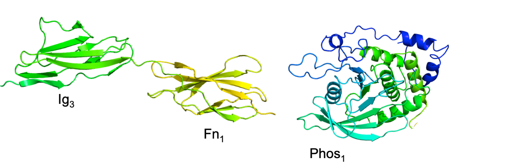
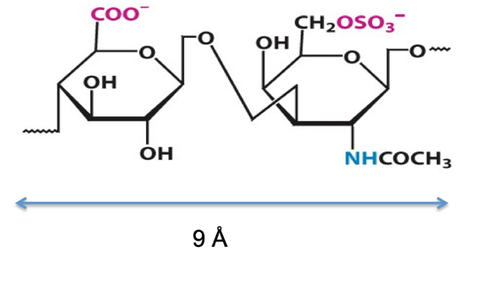
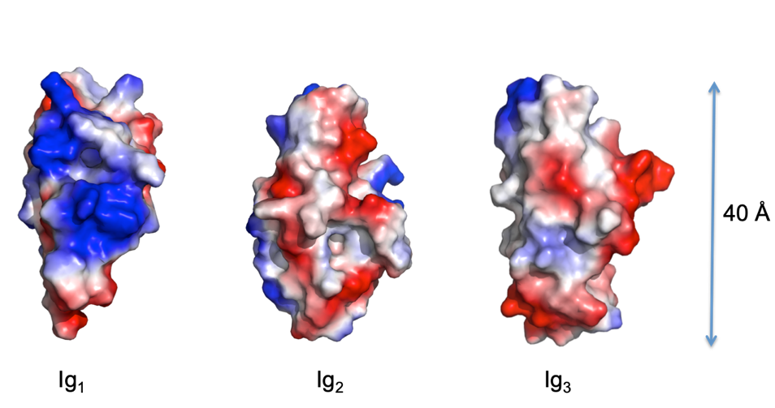
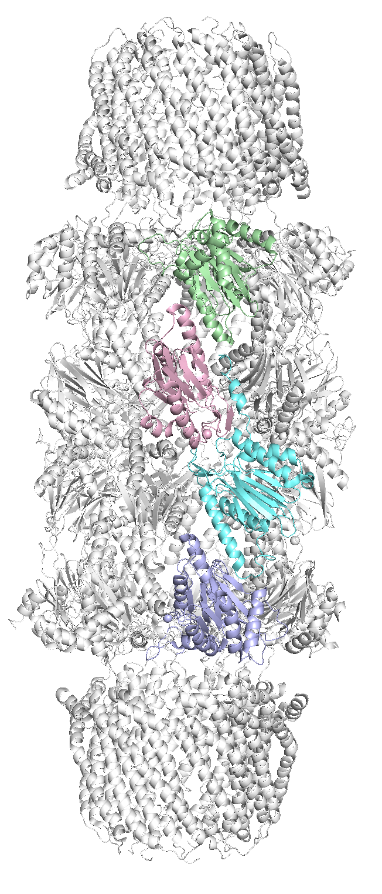
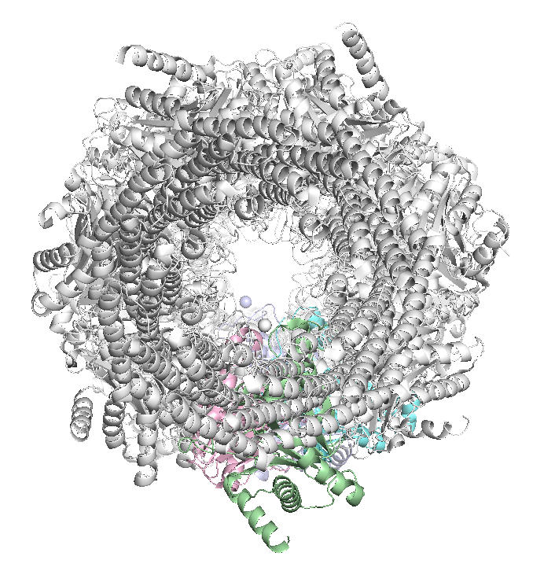
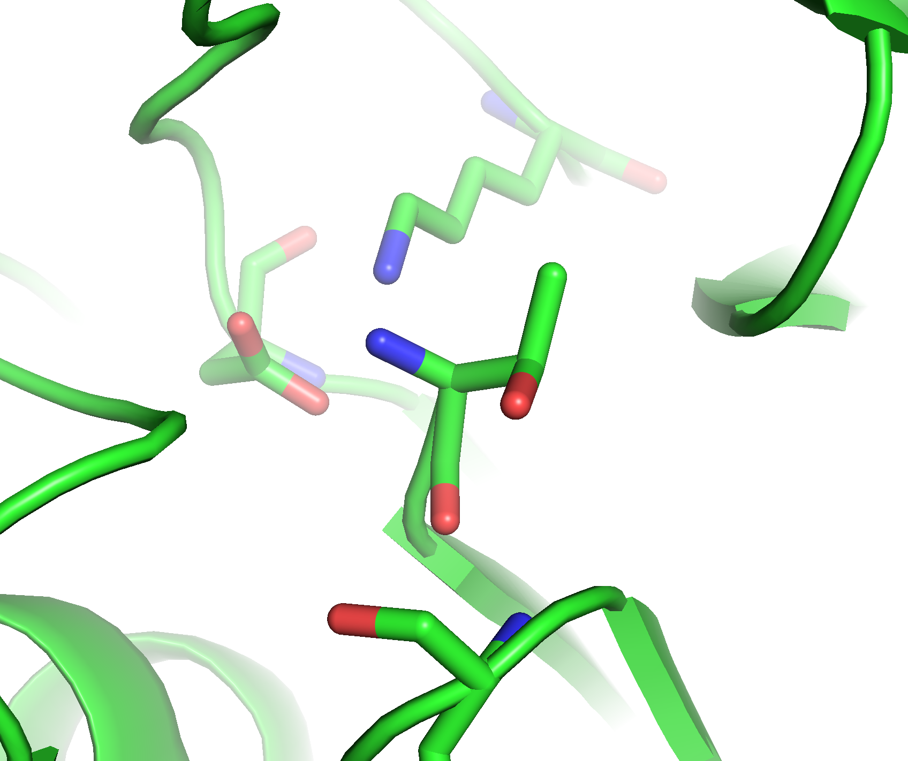
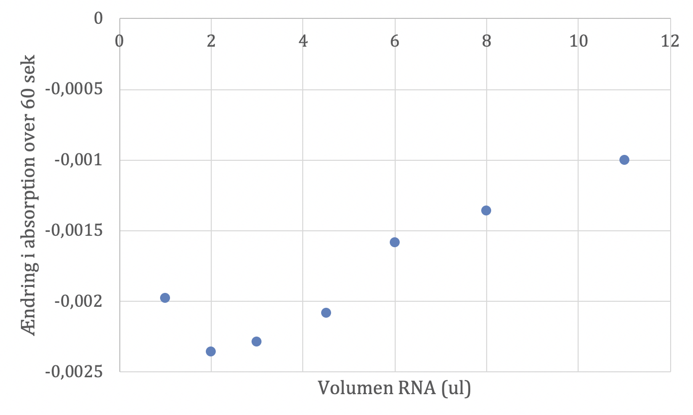
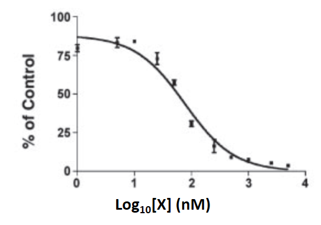
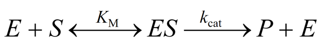

## Opgave 1

Sekvensen af proteinet PTPRδ kan findes i Uniprot:P23468

**Spørgsmål 1.** Foreslå en cellulær lokalisering af PTPRδ og begrund
dit svar med udgangspunkt i sekvensens egenskaber.

Svar: I Uniprot er PTPRδ annoteret som Single-pass type I membrane
protein. Dette kræver at der i sekvensen er et signal-peptid og en
trans-membran helix. Disse er også annoteret i uniprot med beliggenhed
henholdsvis i position 1-20 og 1266-1290. Evt. kunne disse findes vha af
SignalP eller TMHMM/Phobius. Sekvensen i PTPRδ signal peptidet opfylder
konsensus for et signalpeptid for cellemembran lokalisering: den
indeholder en positivt ladet sidekæde (arginin i PTPRδ) efterfulgt af et
antal (10 i PTPRδ ) hydrophobe aminosyre rester og kløvning sker efter
en lille aminosyre rest (alanin i PTPRδ).

PTPRδ består af 13 strukturelle domæner, 3 Ig-domæner, 8 Fn-domæner og 2
phosphatase-domæner. I figuren nedenfor er vist det tredje Ig-domæne og
det første Fn3-domæne samt det første phosphatase-domæne.

{.lightbox width="90%" fig-align="center"}

**Spørgsmål 2.** Angiv foldningsklassen for hver af de tre domænetyper
og begrund dit svar.

Svar: Ig og Fn domænerne tilhører begge 𝛽-foldningsklassen da
sekundærstrukturen udelukkende består af 𝛽-kæder. Phosphatase domænet
tilhører 𝛼𝛽 foldningsklassen idet sekundærstrukturen indeholder både
𝛼-helix og 𝛽-kæder. (Mere specifikt tilhører domænet 𝛼/𝛽-klassen da det
er en parallel 𝛽-plade med helix på begge sider).

{.lightbox width="90%" fig-align="center"}PTPRδ binder chondroitin sulfat proteoglycaner.
Chondroitin sulfat består af repeterende enheder af et modificeret
disaccharid vist i figuren til højre.

**Spørgsmål 3.** Angiv de to hexoser der indgår i disaccharidet og typen
af glycosidbinding mellem dem.

Svar: Hexosen til højre (N-acetyl-galactosamin-6-sulfat) er afledt af
galactose og den til venstre (glucoronic acid) er afledt af glucose. De
to enheder er forbundet med en 𝛽-1-3 glycosidbinding. (Bemærk: I teksten
til figur 11.19 i lærebogen er det nævnt at hexosen til højre er afledt
af glucosamine hvilket er en fejl. Glucose bør derfor også godtages som
korrekt svar).

Ved at udtrykke et fragment af PTPRδ fandt man at fragmentet bestående
af de tre Ig-domæner besad affinitet for chondroitin sulfat (CS).
Desuden viste måling af affinitet at disaccharidet bandt med den højeste
Kd, tetrasaccharidet bandt med lavere Kd og hexasaccharidet med endnu
lavere Kd. Længere oligomerer havde stort set samme Kd som
hexasaccharidet. I figuren nedenfor er vist ladningsfordelingen på
overfladen af de tre Ig-domæner. Røde områder er negativt ladede og blå
områder positivt ladede.

{.lightbox width="90%" fig-align="center"}

**Spørgsmål 4.** Foreslå hvilket af Ig-domænerne der binder CS og
begrund dit svar.

Svar: Ig1 binder CS fordi dette domæne har en overvejende positiv
ladning på overfladen, der kan binde den negativt ladede CS. Yderligere
stemmer observationerne af affinitet overens med udstrækningen (25-30Å)
af det positivt ladede område. Hexasaccharidet vil have en udstrækning
på ca. 25Å, da hvert disaccharid er 9Å langt.

## Opgave 2

I et forsøg med *co-immunoprecipitation* identificeres et ukendt protein
som en interaktionspartner for et enzym og efterfølgende testes
interaktionen med *isotermisk titreringskalorimetri* (*ITC*).

Spørgsmål 1. Forklar forskellen på den type af information man kan
udlede om en protein-interaktion ud fra henholdsvis
*co-immunoprecipitation* og *ITC*.

Svar: Co-immunoprecipitation er en ikke kvantitativ teknik, der giver et
Ja/Nej svar. ITC er en kvantitativ teknik som giver en affinitet.

Der fremstilles nu et antal proteinfragmenter af det ukendte protein,
der har i alt 419 aminosyrerester. Fragmenterne testes herefter
individuelt for bindingen til enzymet ved hjælp af ovenstående
teknikker, og resultaterne findes i nedenstående tabel, hvor + angiver
en målbar interaktion og - ingen målbar interaktion.

  ----------------------------------------------------------------------
  **Proteinfragment**   ***K~d~*\           **Interaktion\
                        (ITC)**             (co-immunoprecipitation)**
  --------------------- ------------------- ----------------------------
  1-419                 11,0 ± 1 nM         \+

  1-300                 10,8 ± 1 nM         \+

  1-250                 1,0 ± 0.1 μM        \+

  1-200                 1,1 ± 0.1 μM        \+

  1-150                 3,0 ± 0.5 mM        \-

  150-419               11,4 ± 1 nM         \+

  200-419               975 ± 91 nM         \+

  250-419               1,0 ± 0.1 μM        \+

  300 - 419             Ingen binding       \-
  ----------------------------------------------------------------------

**Spørgsmål 2.** Forklar de opnåede resultater, herunder hvorfor der i
to tilfælde ikke ses binding vha. co-immunoprecipitation.

Svar: Konstruktet indeholdende 1-150 binder med en lav affinitet (3mM).
Det er sandsynligt at det falder under den ikke nærmere definerede nedre
grænse for hvor svage interaktioner man kan måle med et pull-down
eksperiment, da interaktionsparterne vil dissociere under vasketrinnet.

**Spørgsmål 3.** Hvilke dele af det ukendte protein er vigtige for
bindingen til enzymet? Begrund dit svar.

Svar:\
Der er ingen forskel på affiniteten af 1-300 og 1-419. Dermed bidrager
301-419 ikke.

Der er ingen forskel på affiniteten af 1-200 og 1-250. Dermed bidrager
200-250 ikke.

Der sker et stort tab af affinitet imellem 1-250 og 1-300. Dermed
bidrager regionen 250-300.

Der sker et stort tab af affinitet imellem 1-150 og 1-200. Dermed
bidrager regionen 150-200.

Ligeledes er der et mindre bidrag imellem 1-150.

Alle disse er under antagelse af at trunkeringerne ikke påvirker
proteinets foldning. (Ikke nødvendigt for at opnå fulde point)

Interaktionspartneren viser sig senere at være en inhibitor af enzymet,
der er helt inaktivt når inhibitoren er bundet.

**Spørgsmål 4.** Hvor stor enzymaktivitet (angivet i %) ville man måle i
tilstedeværelse af 100 nM fuldlængde-inhibitor (1-419)? Det kan antages
at enzymkoncentrationen er 1 nM.

Svar: Kd er 11 nM. Da enzymkoncentrationen er meget lavere (1 nM) end
inhibitorens koncentration (100nM) kan vi antage at at den fri
koncentration af inhibitor svarer til den totale koncentration.

Mængden af enzym frit enzym kan beregnes ud fra følgende formel:

F(bundet) = c(I)/(Kd+c(I)) = 100 nM/(11 nM + 100 nM) = 0,90

Da 90% er bundet af inhibitoren, er der 10% residuel aktivitet.

Der gives 5 point for at svare (ikke-kvantitativt), at aktiviteten er
lav da inhibitorkoncentrationen er \>\> Kd.

## Opgave 3 (2018-ordning)

Proteasomet er en central, molekylær maskine i eukaryoter, der deltager
i nedbrydning af både fejlfoldede og normale proteiner. Det centrale
element i proteasomet er en tøndestruktur også kaldet 20S efter dens
sedimentationskonstant.

**Spørgsmål 1.** Beskriv opbygningen af proteasomets tøndestruktur,
herunder antallet af subunits af de to forskellige hovedtyper i hvert
lag. Beskriv forskelle mellem de enkelte subunits i hvert lag.

Svar: Proteasomets tønde består af 4 heptamere (7-mere) ringe oven på
hinanden. Inderst findes to ringe af β-subunits og uden på disse to
ringe af α-subunits. De enkelte subunits har proteaseaktivitet
(hovedsageligt i β-ringene) med forskellig specificitet, kaldet de
caspase, chymotrypsin- eller trypsin-lignende aktiviteter.

PDB-koden 1FNT indeholder strukturen af 20S proteasomet fra organismen
*Trypanosoma brucei* bundet til to 11S \"caps\".

**Spørgsmål 2.** Hent strukturen i PyMOL og fremstil en figur, hvor hele
strukturen er vist med \"cartoon\" og én af hver af de forskellige
hovedtyper af subunits i \"tønden\" er vist med forskellige farver.
Svaret til denne opgave består af en figur fra PyMOL med angivelse af
hvilke farver, der svarer til hvilke subunits.

{.lightbox width="90%" fig-align="center"}Svar: I figuren til venstre er subunits
fra α-ringene farvet grøn og blå og subunits fra β-ringene lyserød og
cyan. Spørgsmålet kan også forstås som at man skal farve én af hver af
de forskellige proteasetyper (specificitetstyper), så dette antages også
som korrekt svar

**Spørgsmål 3.** Betragt strukturen fra enden ned gennem tønden. Vil du
forvente at denne konformation af proteasomet er aktiv eller ikke aktiv?
Forklar dit svar. Er dette anderledes end for den isolerede 20S
tøndestruktur? Hvorfor/hvorfor ikke?

Svar: Der er en relativt tydelig åbning ned gennem tønden, hvorfor denne
må forventes at tillade adgang af substrat og dermed være aktiv. Det er
anderledes end for det isolerede 20S proteasom, hvor terminale haler på
α-enhederne blokerer for adgangen.

{.lightbox width="90%" fig-align="center"}Figuren til venstre er blot til
illustration, og kræves ikke for korrekt svar.

Kør følgende script i PyMOL for at få et blik ind i ét af de mange
aktive sites i proteasomet:

show sticks, (chain W and (resi 1 or resi 17 or resi 33 or resi 129))\
set_view (\\\
    -0.658701837,   -0.096288756,   -0.746209145,\\\
    -0.383666188,    0.896128416,    0.223046184,\\\
     0.647224486,    0.433221072,   -0.627228618,\\\
     0.000000000,    0.000000000,  -40.691257477,\\\
   127.386566162,   27.496431351,   13.149142265,\\\
    30.810295105,   50.572162628,  -20.000000000 )

Reaktionsmekanismen for proteasomets subunits involverer den allerførste
aminosyre, Thr1, der her er vist sammen med andre, nærliggende
sidekæder. Man har tidligere ment, at proteinets N-terminale
NH~2~-gruppe fungerer som generel base i denne reaktion, men dette kan
ikke forklare hvordan proteasomets subunits kan kløve sig selv fra en
precursor-form, hvor Thr1 ikke udgør N-terminalen.

**Spørgsmål 4.** Forklar, hvordan en Thr kan fungere i det aktive site
af en protease på nogenlunde samme måde som Ser i serinproteaserne samt
hvilken rolle aminoterminalen spiller. Kom desuden med et forslag til
hvilket gruppe, der kunne tænkes at erstatte aminoterminalen under
kløvning af precursoren.

Svar: Threonins sidekæde -OH-gruppe kan deprotoneres under dannelse af
en alkoxidion på samme måde som serine og dermed fungere som nukleofil i
kløvningsreaktionens første trin. Aminoterminalen kan i denne sammenhæng
fungere som generel base, der abstraherer protonen fra -OH. I
precursoren er aminoterminalen ikke tilgængelig, da den er koblet i den
videre peptidkæde, så i dette tilfælde må en anden gruppe fungere som
generel base. Det kunne være enten Asp eller Lys som vist på figuren,
afhængig af lokale pKa-forhold. Figuren nedenfor er til illustration og
ikke en del af svaret.

{.lightbox width="90%" fig-align="center"}

## Opgave 3 (2019-ordning)

Til måling af aktiviteten af RNase A kan benyttes et spektrofotometrisk
assay, hvor hastigheden hvormed et RNA-substrat nedbrydes kan måles ved
af følge absorptionen ved 688 nm efter tilsætning af stoffet
methylenblåt.

**Spørgsmål 1.** Forklar kort princippet i detektionsmetoden, herunder
hvordan blandingen af methylenblåt og RNA giver anledning til en
absorption ved 688 nm samt hvorledes denne absorption ændres over tid
når RNA nedbrydes.

Svar: Methylenblåt indeholder poly- og heteroaromatiske grupper, der
absorberer lys i det synlige område. Spektret forskubbes når stoffet
interkalerer i struktureret DNA/RNA på en sådan måde at absorptionen ved
688 nm stiger. Ved nedbrydning af polynukleotiderne brydes denne
interaktion og methylenblåt vender tilbage til monomer/dimer form,
hvorved absorptionen ved 688 nm falder. Dette kan omsættes til en
tilsvarende enzymaktivitet af RNasen.

I et forsøg ønskede man at optimere mængden af RNA, der tilsættes under
forsøget ved gradvist at sænke den tilsatte mængde. Ved forskellige
lavere koncentrationer af RNA målte man derfor absorptionen ved 688 nm
over tid efter tilsætning af methylenblåt og RNase A.

**Spørgsmål 2.** Beskriv din forventning til forsøget, herunder hvordan
du forventer ændringen i absorption over tid vil påvirkes af en lavere
RNA-koncentration.

Svar: Forventningen vil være at når der er mindre RNA tilstede, så vil
mindre methylenblåt kunne interkalere og dermed bør vi opnå en lavere
start-absorption inden det enzymatiske forsøg igangsættes. Man vil
derfor a priori forvente et svagere signal, dvs. en mindre ændring i
absorptionen over tid, når enzymet tilsættes.

Nedenfor findes en tabel med A~688~-målinger fra et sådan forsøg. Disse
data kan også findes vedhæftet i Excel-format (RNase A.xlsx).

  ------------------------------------------------------------------------
  **Methylenblåt   1000    1000    1000    1000    1000    1000    1000
  (μl)**                                                           
  ---------------- ------- ------- ------- ------- ------- ------- -------
  **Tris-NaCl      50      53      55      56.5    58      59      60
  (μl)**                                                           

  **RNA (μl)**     11      8       6       4.5     3       2       1

  **RNase A (μl)** 50      50      50      50      50      50      50

  **Tid                                                            
  (sekunder)**                                                     

  **0**            1.258   1.186   1.135   1.061   0.973   0.860   0.724

  **5**            1.257   1.185   1.133   1.059   0.970   0.858   0.722

  **10**           1.256   1.184   1.131   1.057   0.967   0.856   0.719

  **15**           1.255   1.182   1.130   1.054   0.965   0.854   0.717

  **20**           1.254   1.181   1.128   1.052   0.962   0.851   0.715

  **25**           1.253   1.180   1.127   1.050   0.960   0.848   0.713

  **30**           1.252   1.178   1.125   1.048   0.959   0.845   0.711

  **35**           1.251   1.177   1.123   1.046   0.957   0.843   0.709

  **40**           1.250   1.176   1.122   1.044   0.954   0.841   0.707

  **45**           1.249   1.174   1.120   1.042   0.951   0.839   0.705

  **50**           1.248   1.173   1.119   1.040   0.949   0.837   0.704

  **55**           1.247   1.171   1.117   1.038   0.947   0.835   0.702

  **60**           1.246   1.170   1.116   1.036   0.945   0.832   0.700
  ------------------------------------------------------------------------

**Spørgsmål 3.** Opstil en grafisk afbildning af de opnåede resultater,
der sætter dig i stand til at vurdere effekten af den varierende
RNA-mængde. Inkludér afbildningen i dit svar og beskriv hvad du
observerer.

Svar: Det mest naturlige er at plotte ændringen i absorption over tid
som funktion af den tilsatte mængde RNA. Dette kan f.eks. gøres vha.
LINEST-funktionen i Excel, som vi har brugt ved laboratorieøvelserne:

{.lightbox width="90%" fig-align="center"}

Ved dette ses at der er et optimum ved 2 ul tilsat RNA, hvor
absorptionsændringen absolut set er størst.

**Spørgsmål 4.** Findes der en optimal RNA-mængde indenfor det testede
interval? Kom med et forslag til hvorfor dette er/ikke er tilfældet.

Svar: Ja, der er en optimal mængde RNA svarende til 2 ul tilsat, hvor vi
får det største signal. Dette kan skyldes at methylenblåt mættes med
mere RNA eller at enzymet inhiberes af den høje mængde substrat. Dette
er specielt relevant for polymere substrater som RNA/DNA, der kan have
en tendens til at sekvestrere enzymet.

## Opgave 4

Trans-aktiverings-respons-regionen (TAR) i HIV-1 er en 59-nukleotid RNA
stem-loop struktur i den 5\'-ikke-kodende region af alle HIV-1 mRNA, der
spiller en vigtig rolle i regulering af HIV genekspression. TAR-regionen
interagerer med det virale Tat protein, der aktiverer viral
genekspression og er nødvendig for virusreplikation. Nedenfor ses
sekvens og sekundær struktur af TAR hairpin, hvor \"bulge\"- og
\"loop\"-regioner er markeret i grå:

5\'-GGGU[C]{.mark}UCUCUGGUUAG[A]{.mark}CCAGA[UCU]{.mark}GAGC[CUG]{.mark}╮

┊┊┊┊ ┊┊┊┊┊┊┊┊┊┊┊ ┊┊┊┊┊ ┊┊┊┊ │

3\'-CCCA─AGGGAUCAAUC─GGUCU───CUCG[AGG]{.mark}╯

Nedenfor ses et alignment af TAR-sekvenser fra forskellige subtyper af
HIV, igen med \"bulge\"- og \"loop\"-regioner er markeret i grå:

\>HIV1-A\
GGGU[C]{.mark}UCUCUUGUUAG[A]{.mark}CCAGG[UC-]{.mark}GAGC[CCGGGA]{.mark}GCUCUCUGGCUAGCAAGGGAACCC

\>HIV1-B\
GGGU[C]{.mark}UCUCUGGUUAG[A]{.mark}CCAGA[UCU]{.mark}GAGC[CUGGGA]{.mark}GCUCUCUGGCUAACUAGGGAACCC\
\>HIV1-N\
GGGU[C]{.mark}UCUCUUGCUGG[A]{.mark}CCAGA[UUA]{.mark}GAGC[CUGGGA]{.mark}GCUCUCUGGCUAGC-AGGGAACCC\
\>HIV1-O\
GGGU[C]{.mark}UUAGUUAGAGG[A]{.mark}CCAGG[UCU]{.mark}GAGC[CCGGGA]{.mark}GCUCCCUGGCCUCUAGCUGAACCC

**Spørgsmål 1.** Beskriv kort sekvensbevarelsen af \"bulge\"- og
\"loop\"-regionerne. Brug dernæst RNAalifold-serveren til at bestemme en
konsensus-struktur for TAR (sekvensen findes også i filen TAR.fasta).
Hvor mange basepar findes i to forskellige typer på samme position? Hvor
mange basepar findes i tre forskellige typer på samme position?

Link: <http://rna.tbi.univie.ac.at/cgi-bin/RNAWebSuite/RNAalifold.cgi>

Svar: 1 base bulges er fuldt bevarede, 3 base bulge har
sekvensvariation, loop position 2 varierer mellem C og U. Der er 6
basepar med to typer, og 2 basepar med tre typer.

Strukturen af TAR-hairpin i kompleks med Tat-peptidet er blevet løst med
NMR (PDB 6MCE) og nedenfor er angivet hvilken del af RNA\'et, der er med
i strukturen (linjen \"6MCE\").

HIV1-B
GGGU[C]{.mark}UCUCUGGUUAG[A]{.mark}CCAGA[UCU]{.mark}GAGC[CUGGGA]{.mark}GCUCUCUGGCUAACUAGGGAACCC\
6MCE
\-\-\-\-\-\-\-\-\-\-\-\-\-\--GGGCAGA[U-U]{.mark}GAGC[CUGGGA]{.mark}GCUCUCUGCCC\-\-\-\-\-\-\-\-\-\-\-\--

**Spørgsmål 2.** Åben 6MCE i PyMOL og beskriv hvilke basepar og
stacking-interaktioner, der findes i CUGGGA-loopet. Hint: Vis de
relevante baser som sticks og find polære kontakter mellem dem.

Svar: C30 og G34 danner et WC basepar. Dette resulterer i at A35 bliver
loopet ud som en bulge. U31 stacker på C30.

**Spørgsmål 3.** Beskriv den strukturelle konformation af UU-bulge
herunder triple-base-interaktionen og hvilke basekanter, der er
involveret i denne. Hint: Vis de relevante baser som sticks og find
polære kontakter mellem dem.

Svar: U23 er loopet ind og interagerer med A-U WC basepar (A27-U38 cWW)
i major groove (Hoogsteen-side). Interaktionen mellem U23 og A27 er cWH
dvs. U23 interagerer med sin WC-side og A27 interagerer med sin
Hoogsteen-siden. U25 er loopet ud som en bulge.

Tat-peptidet har følgende sekvens: GISYGRKKRRQRRRAHQ

**Spørgsmål 4.** Til hvilken groove i TAR RNA binder Tat-peptidet?
Beskriv hvilke baser R49 interagerer med.

Svar: Major groove. R49 interagerer med Hoogsteen-siden af G28. R49
interagerer med sukker for U23.

## Opgave 5

{.lightbox width="90%" fig-align="center"}Forskere har udviklet et stof X, som kan binde til
og inhibere en bestemt klasse af proteaser. Dette er illustreret i
figuren til højre, der viser hvordan X interagerer med enzymets
S~1~^\'^- og S~2~^\'^-bindingssteder. På figuren befinder X sig indenfor
den røde prikkede kurve, mens alt udenfor denne kurve er en del af
enzymet.

Spørgsmål 1. Hvilken type protease er der tale om? Beskriv de
forskellige interaktioner mellem stof X og enzymet.

Svar: En metalloprotease (Zn^2+^ ion). X koordinerer til Zn^2+^ via hhv.
hydroxamat og carbonyl ilt. Den brint-binder til en H-gruppe (muligvis
en amid H). Derudover hydrofobe interaktioner i S~1~\' og S~2~\'
lommerne.

Proteasen kløver et hexapeptid. Vi betegner sekvensen som
aa~1~-aa~2~-aa~3~-aa~4~-aa~5~-aa~6~, hvor aa angiver en aminosyre, og
kløvningen finder sted mellem aa~3~ og aa~4~.

**Spørgsmål 2.** Hvilke af disse seks aminosyrepositioner kan du
identificere ud fra strukturen af X og hvilke aminosyrerester er der
tale om? Giv et bud på hvorfor dette stof er så god en inhibitor af
proteasen, herunder hvorfor det ikke bliver nedbrudt.

Svar: S~1~\' og S~2~\' svarer til aa~4~-aa~5~, altså hhv. Leu og Trp.
Stoffet X blokerer det aktive sæde (binder Zn^2+^, H og to
bindingslommer) og kan ikke nedbrydes (den er jo på den anden side af
kløvningssitet og har i øvrigt ingen peptidbindinger!).

**Spørgsmål 3.** X fungerer som en kompetitiv inhibitor af proteasen i
den normale Michaelis-Menten formalisme, som skitseret nedenfor. Angiv
hvor X indgår i denne mekanisme og beskrive hvilke enzymatiske
parametre, der ændres ved tilsætning af X.

{.lightbox width="90%" fig-align="center"}

Svar: Klassisk mekanisme: E:I ⬄ I + E (med *K*~I~) sammen med E + S ⬄E:S
(med *K*~M~) ⬄ E + P (med *k*~cat~).

Vi måler nu hvordan X reducerer aktiviteten af proteasen og får kurven
nedenfor.

{.lightbox width="90%" fig-align="center"}

**Spørgsmål 4.** Hvilken enzymatisk parameter får man ud af sådan et
plot? Hvilken omtrentlig værdi har denne parameter?

Svar: Det er strengt taget en IC~50~ (som de studerende nok ikke kender)
men det svarer til *K*~I~ (hvor ½ af enzymet er hæmmet fordi det er
bundet til inhibitor) og har en værdi på ca. 10^2^ nM altså 100 nM.
(Eksakt værdi: 76 nM men det kræver digitalisering og er slet ikke
påkrævet).
