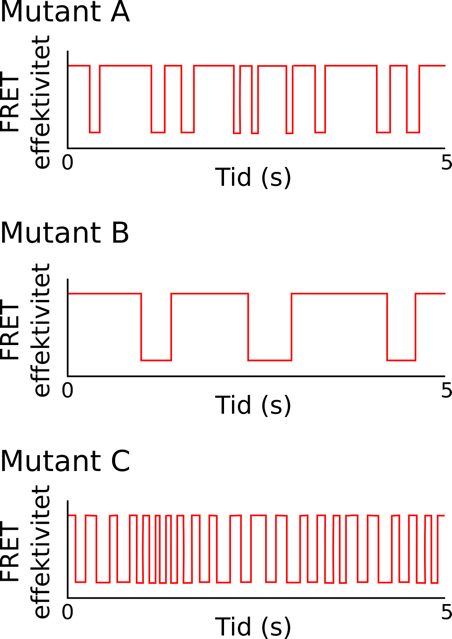
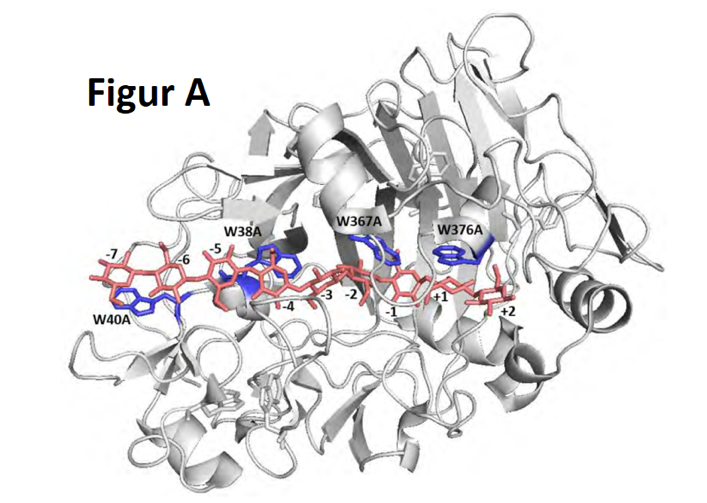
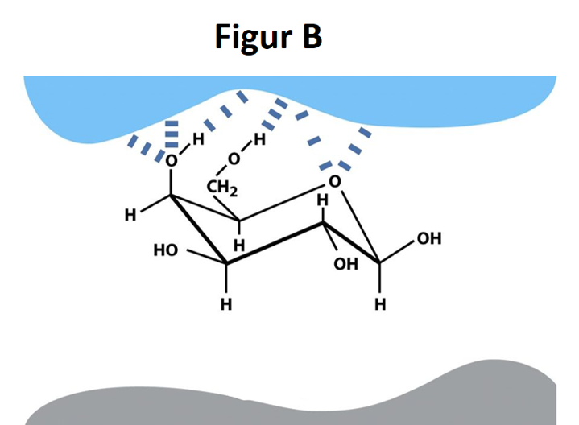
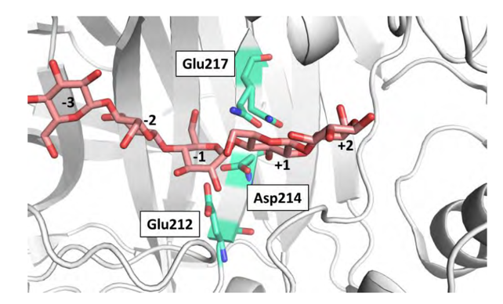
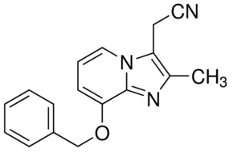
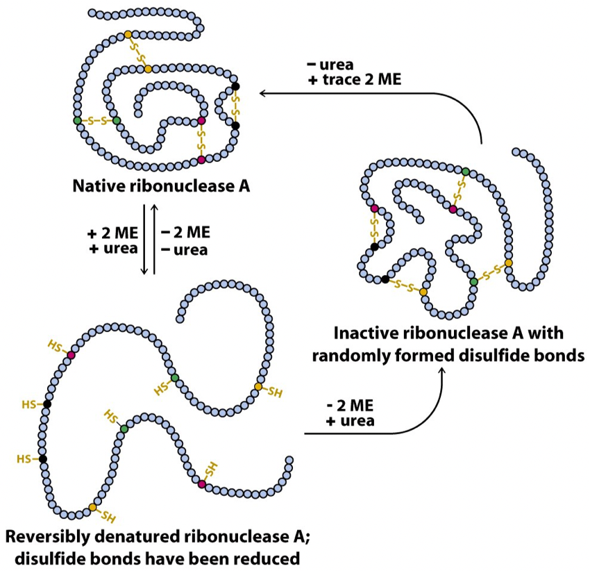

## Opgave 1 (udenfor pensum)

Et enzym findes i ligevægt imellem to konformationer, en åben tilstand
og en lukket tilstand. Enzymets ligevægt kan beskrives ved hjælp af
parametrene, k~1~, k~-1~ og K som er givet som vist nedenfor.

{.lightbox width="90%" fig-align="center"}

Vha. enkelt-molekyle FRET-spektroskopi, hvor den åbne tilstand har en
lav FRET-effektivitet og den lukkede har en høj FRET-effektivitet, opnås
ovenstående kurve, der viser et repræsentative data for et enkelt
molekyle af wild type-enzymet. For tre mutanter af enzymet opnås
nedenstående data.

{.lightbox width="90%" fig-align="center"}

**Spørgsmål 1.** Hvordan er k~1~, k~-1~ og K ændret for Mutant A
relativt til wild type-enzymet? Der forventes en begrundelse, men ikke
et numerisk svar.

Svar:\
k~1~ er uændret: Det tager lige så længe for enzymet at overgå til den
åbne tilstand som WT.

k~-1~ er øget: Enzymet bliver væsentligt kortere tid i den åbne tilstand
end WT.

K er mindsket, da ligevægten er forskubbet imod den åbne lukkede
tilstand.

**Spørgsmål 2.** Hvordan er k~1~, k~-1~ og K ændret for Mutant B
relativt til wild type-enzymet? Der forventes en begrundelse, men ikke
et numerisk svar.

Svar:

k~1~ er mindsket: Det tager længere for enzymet at overgå til den åbne
tilstand end WT.

k~-1~ er uændret: Det tager lige så længe for enzymet at lukke som WT.

K er mindsket, da ligevægten er forskubbet imod den åbne lukkede
tilstand.

**Spørgsmål 3.** Hvordan er k~1~, k~-1~ og K ændret for Mutant C
relativt til wild type-enzymet? Der forventes en begrundelse, men ikke
et numerisk svar.

Svar:

k~1~ er øget: Enzymet bliver væsentligt kortere tid i den lukkede
tilstand end WT.

k~-1~ er øget: Enzymet bliver væsentligt kortere tid i den åbne tilstand
end WT.

K er uændret, da forøgelsen i k~1~ og k~-1~ ca. opvejer hinanden.

**Spørgsmål 4.** Forklar hvorfor det er vigtigt for enzymers funktion at
kunne skifte imellem flere forskellige konformationer.

Svar: Enzymer har ofte brug for en åben konformation for at kunne binde
deres substrat, og senere frigive produktet. Ofte vil dannelsen af et
katalytisk aktivt site kræve en mere lukket konformation.

## Opgave 2

Cellulaser nedbryder cellulose, der består af gentagne enheder af
disaccharidet cellobiose, to glucose-molekyler forbundet med en β-1,4
glycosid-binding. Figur A viser hvordan et substratmolekyle binder til
en sådan cellulase, mens Figur B viser mere generelt hvordan den enkelte
glukosering vekselvirker med enzymet.

{.lightbox width="90%" fig-align="center"}

{.lightbox width="90%" fig-align="center"}

**Spørgsmål 1.** Hvor mange glukose-molekyler indgår i substratet i
Figur A? Beskriv ud fra figurerne (A og B) hvilke forskellige typer af
interaktioner der findes mellem substrat og enzym.

Svar: Der er ni (cellononaose). Det ses at glukose-ringene har både en
hydrofob og en hydrofil side, så den hydrofobe side er god til at pakke
mod de hydrofobe Trp ringe, mens den hydrofile side formodentlig har en
masse H-bindinger til proteinets polære grupper.

{.lightbox width="90%" fig-align="center"}Der findes tre katalytisk vigtige aminosyrerester
i cellulasen, som angivet i Figur C. Af disse har Asp214 en
stabiliserende funktion, mens de to Glu-sidekæder reagerer direkte med
substratet. I forbindelse med strukturbestemmelse er Glu217 i dette
tilfælde muteret til en Gln for at undgå substratkløvning og vist i to
alternative konformationer på figuren.

{.lightbox width="90%" fig-align="center"}**Spørgsmål 2.** Angiv med reaktionspile
hvordan Glu212 og Glu217 samarbejder om at nedbryde cellobiose. Hvilke
katalytiske roller har de to sidekæder?

(*Tip:* Beskriv dem med begreber fra kemisk katalyse).

Svar: Det følger flg. mekanisme: Her er Glu212 en nukleofil katalysator
mens Glu217 er en generel syre/base.

{.lightbox width="90%" fig-align="center"}

**Spørgsmål 3.** Hvorfor er det nødvendigt for enzymet at påvirke
pK~a~-værdien af Glu217 og i hvilken retning ændres den?

Svar: Glu har normalt en pKa på omkring 4 så den er ikke protoneret i
nævneværdig grad ved neutralt pH. Dens pKa skal derfor øges til omkring
7 for at sikre at den er god til både at optage og afgive protoner ved
neutralt pH.

Cellulasen er processiv, dvs. den laver flere "hug" i det bundne
substrat (som jo består af meget lange cellulosekæder). Udfordringen er
i dette tilfælde at forhindre substratet i at forlade enzymet efter
hvert "hug".

**Spørgsmål 4.** Giv et bud på hvordan cellulasen løser dette problem.

Svar: Processiv kløvning kræver at man fastholder substratet/produktet
efter hvert hug. Det vil sige at substratet skal bevæge sig gennem
enzymet snarere end at ligge ovenpå. Enzymet vil derfor typisk have et
låg (løkker) til at fastholde substratet og "made" det gennem enzymets
katalytiske tunnel.

## Opgave 3

Bakterier elsker sukker, men kan benytte andre energikilder, hvis der
ikke er sukker tilstede. Når glucose-niveauet falder, bliver
celleoverflade-enzymet *adenylate cyclase* aktiveret, hvilket leder til
produktion af *cyclisk AMP* (cAMP). Denne aktiverer *catabolite
activator protein* (CAP), der en trans-agerende transkriptionsfaktor,
der igen stimulerer syntesen af enzymer, der nedbryder de alternative
carbonkilder. CAP binder som en homodimer til følgende DNA-sekvens, der
indeholder et brudt-palindrom (markeret i grå):

5\'-A[TGTGAG]{.mark}TTAG[CTCACA]{.mark}CA-3\'

┊┊┊┊┊┊┊┊┊┊┊┊┊┊┊┊┊┊┊

3\'-T[ACACTC]{.mark}AATC[GAGTGT]{.mark}GT-5\'

**Spørgsmål 1.** Beskriv ud fra det strukturelle perspektiv hvordan en
protein homodimer genkender en palindromsekvens. Hvad fordelen ved at
binde som dimer ift. den hastighed, hvormed sekvensgenkendelsen foregår?

Svar: Homodimeren kan binde med 2-fold rotations-symmetri. Homodimer gør
at protein kan binde fra samme side af DNA over et længere område.
Desuden øges hastighed for sekvens-søgning, hvis de to monomerer binder
sekventielt, eller hvis dimeren har en fleksibel linker. Dette medfører
at berøringsflade for et dehydreret \"transition state\" er halvt så
stort og dermed er bindingen meget mere end dobbelt så hurtig som en
ufleksibel dimer. Står beskrevet i Williamson side 114.

cAMP-binding leder til en konformationsændring i CAP, der aktiverer
DNA-bindingen. Kør scriptet CAP.pml i PyMOL og tryk F1 og F2 for at se
strukturer af apo-CAP og cAMP-CAP.

**Spørgsmål 2.** Hvad er afstanden mellem de to DNA-genkendelseshelicer
i hhv. apo-CAP og cAMP-CAP og hvad svarer denne afstand til? *Hint:*
Brug afstands-funktionen i PyMOL menuen Wizard/Measurement. Hvordan
adskiller den ligand-inducerede konformationsændring i CAP sig fra den
tilsvarende ændring i Trp repressor?

Svar: Målingerne laves via Wizard/Measurement/Distance i PyMOL og giver
ca. 30.8 Å (hvis man måler samme sted på alpha helicen), hvilket ca.
svarer til full-turn på 10\*3,4 Å (Liljas, Textbook of Structural
Biology, Table 5.1). cAMP-CAP genkendelseshelicer har afstand så de
passer i hosliggende major grooves på DNA dobbelthelix. Trp repressor
har intern konformationsændring af genkendelseshelix. CAP har
konformationsændring i dimer-interface.

Binding af CAP til DNA fører til bøjning af DNA dobbelthelicen. Tryk F3
for at se strukturen af CAP-DNA-komplekset og F4 for at zoome ind på den
bøjede DNA-helix.

**Spørgsmål 3.** Hvilken/hvilke DNA-grooves er i kontakt med CAP og
hvilken standard parameter til beskrivelse af DNA-geometri beskriver
bedst bøjningen?

Svar: Man skal finde heliske akse i hver ende af DNA\'et og se med
hvilken vinkel disse akser mødes. CAP binder både major og minor groove.
DNA helix bøjes via roll parameter over både major og minor groove.

Tryk F5 i PyMOL for at se sidekæderne på genkendelseshelicen.

**Spørgsmål 4.** Skriv et PyMOL-script (én kommando), der viser de
polære kontakter mellem genkendelses-helicen (residues 180-192) og
DNA-dobbelthelicen, og angiv kommandoen i dit svar. Beskriv desuden
hvilke aminosyrerester der danner hydrogenbindinger med hvilke DNA-baser
(angiv residue-numre for hver interaktion).

Svar:\
dist HB-CAP, DNA\*, CAP & resi 180-192, mode=2

R180-G540

E181-C505

R185-T504

R185-G542

## Opgave 4

Membranen i mavesækken indeholder en høj koncentration af et protein,
der er i stand til at hydrolysere ATP når der er K^+^ tilstede. Målinger
på det isolerede protein i vesikler viser, at det kan sænke pH flere
enheder.

**Spørgsmål 1**. Hvilken type protein er isoleret, hvilke molekyler
transporterer det og hvorfor hydrolyseres ATP kun når K^+^ er tilstede?

Svar: Proteinet er en pumpe (højst sandsynligt en P-type ATPase), der
transporterer K^+^/H^+^. ATP-hydrolyse er koblet til transport (vigtig
så ATP [kun]{.underline} bruges når pumpen transporterer).

**Spørgsmål 2**. I mavesækken er pH 0,8 mens der inde i cellerne
fastholdes pH 7,4 med en elektrisk potentialeforskel på -50 mV over
cellemembranen. Beregn Gibbs\' frie energi (i kJ/mol) for transport af
én H^+^ fra cytoplasma til mavesækken ved 37°C.

Svar:

Δ𝐺(H^+^) = 8,3145 ⋅ 10^−3^ (𝑘𝐽/𝑚𝑜𝑙⋅K) ⋅ 310,15𝐾 ⋅ ln
(10^−0,8^/10^−7,4^) + 1 ⋅ 96,5 (𝑘𝐽/𝑚𝑜𝑙⋅𝑉) ⋅ (0.05𝑉)

= 44,01 𝑘𝐽/𝑚𝑜𝑙

Mutation of aminosyre 386 ødelægger proteinets transportfunktion, men
bevarer dets foldning. I et forsøg inkuberes enten \"Mutant (386)\"
eller wild-type \"WT\" proteiner med \[^32^P\]-ATP og K^+^ i 30
minutter, hvorefter prøverne separeres med SDS-PAGE og visualiseres med
auto-radiografi (vist nedenfor).

{.lightbox width="90%" fig-align="center"}

**Spørgsmål 3**. Hvilken type aminosyrerest er 386 højst sandsynligt og
hvorfor er den vigtig for transportfunktionen?

Svar: Aminosyren 386 er en aspartat som er vigtig for dannelsen af
phosphoaspartate intermediat under reaktionscyklen. (Alternativt er 386
en aminosyre der påvirker phosphoryleringen af den konserverede
aspartate som danner phosphoaspartate intermediatet under
reaktionscyklen).

**Spørgsmål 4**. Stoffet SCH28080 binder selektivt til E2-P stadiet og
bliver brugt som lægemiddel mod halsbrand. Foreslå en mulig
inhiberingsmekanisme og forklar hvordan stoffet kan fungere som
lægemiddel.

{.lightbox width="90%" fig-align="center"}

SCH28080

Svar: SCH28080 er en inhibitor som ødelægger pumpe-funktionen ved at
binde E2-P stadiet (og hindre hydrolyse af phosphoaspartaten). Når
SCH28080 inhiberer pumpefunktionen stiger pH i mavesækken som derved
giver mindre mavesyre/halsbrand.

## Opgave 5

Anfinsens dogme dikterer at et proteins primære struktur (rækkefølgen af
aminosyrer) bestemmer den tredimensionelle fold. For at teste dette
princip, udførte Christian Anfinsen et klassisk proteinkemisk
eksperiment med ribonuclease A (RNase A), som er illustreret nedenfor. I
dette forsøg blev RNase A først behandlet med reduktionsmiddel
(β-mercaptoethanol, \"2 ME\") og et denaturerende stof (urea), hvorefter
prøven blev delt i to portioner. For den ene portion fjernede man
samtidig igen både urea og β-mercaptoethanol, mens man for den anden
først fjernede β-mercaptoethanol og herefter urea.

{.lightbox width="90%" fig-align="center"}

RNase A er et meget stabilt enzym, der udskilles af bugspytkirtlen
(pancreas) hos mange dyr, hvor det deltager i fordøjelsen af fødevarer.

**Spørgsmål 1.** Forklar hvilken egenskab ved RNase A, der gør enzymet
specielt stabilt, og hvorledes denne egenskab relaterer sig til det
miljø, proteinet befinder sig i.

Svar: RNase A er et ekstracellulært protein, der indeholder en del
svovlbroer. Dette er (sammen med en meget kompakt, tertiær struktur) med
til at gøre enzymet ekstremt stabilt. RNase A produceres i pancreas i
pattedyr og udskilles i tolvfingertarmen, hvor miljøet er meget surt.

**Spørgsmål 2.** Forklar hvorfor det er nødvendigt både at benytte
reduktionsmiddel (β-mercaptoethanol) og denaturant (urea) i Anfinsens
eksperiment for at inaktivere proteinet fuldstændig. Hvad ville der ske,
hvis man alene benyttede denaturant (urea)?

Svar: Det er tilstedeværelsen af de mange S-S broer, der kræver at man
både reducerer og denaturerer for at udfolde proteinet. Hvis man alene
denaturerer med urea vil proteinet ikke kunne folde helt ud pga.
svovlbroerne, og fastholde en vis aktivitet.

Fjerner man denaturant og reduktionsmiddel igen på samme tid, opnås et
aktivt enzym. Fjerner man derimod reduktionsmidlet først og herefter
denaturant, fås et inaktivt enzym.

**Spørgsmål 3.** Forklar hvad der sker med enzymet i de to tilfælde,
herunder hvorfor det ikke er aktivt i den sidste situation.

Svar: I det første tilfælde folder proteinet korrekt og de korrekte
svovlbroer gendannes. I det andet tilfælde dannes forkerte svovlbroer
når det stadigt denaturerede protein oxideres og den korrekte fold kan
ikke opnås når denaturanten fjernes efterfølgende.

**Spørgsmål 4.** Forklar hvorledes eksperimentet understøtter hypotesen
om at rækkefølgen af aminosyrer bestemmer et proteins tredimensionelle
fold.

Forsøget viser at et protein (enzym) bestående af at enkelte domæne
indeholder informationen til at folde korrekt og danne de korrekte
svovlbroer. Denne information må derfor være indeholdt i den primære
sekvens, altså aminosyrerækkefølgen.
