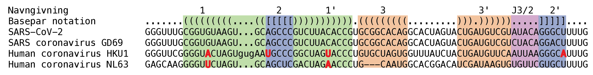
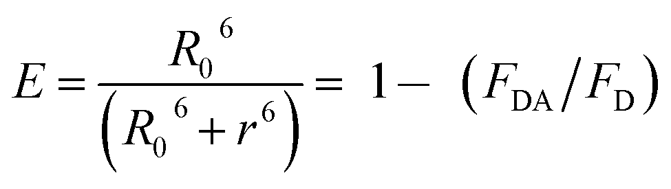
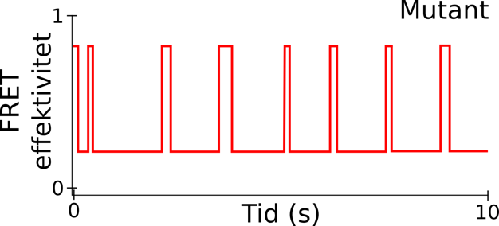
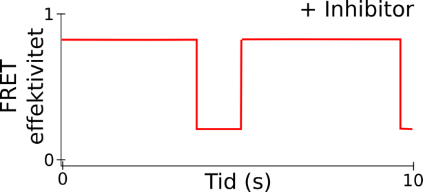
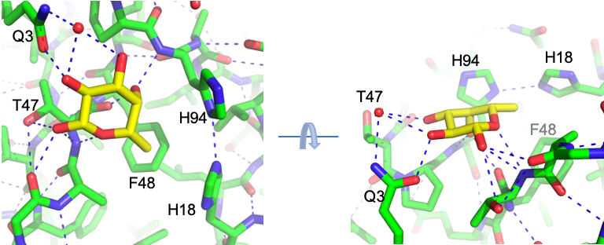
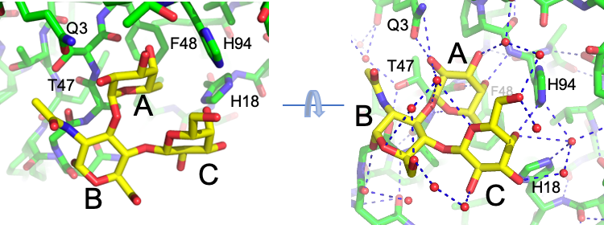
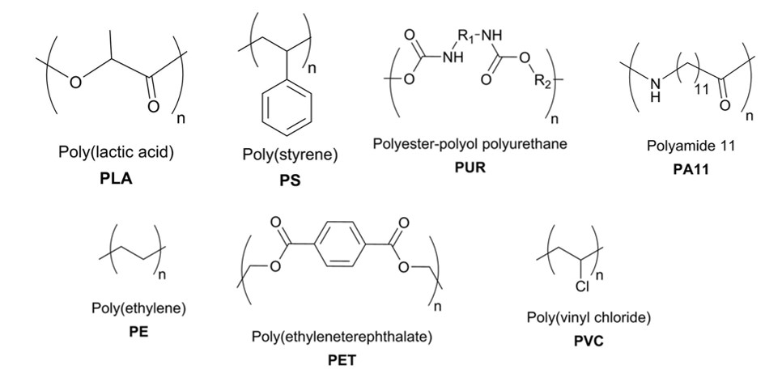
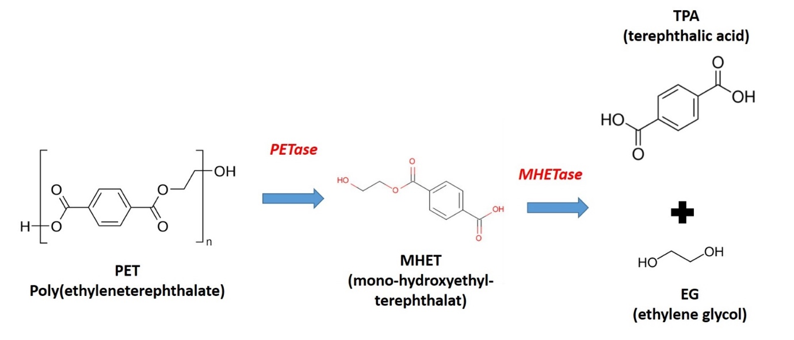
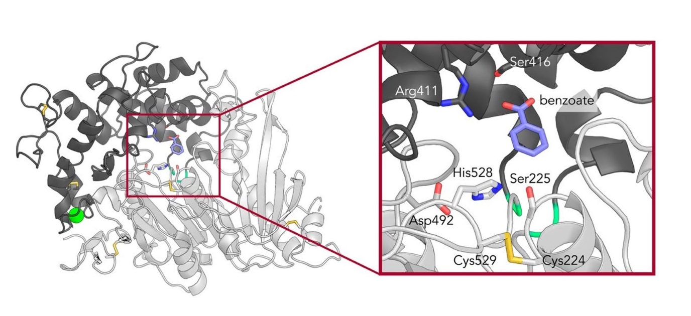
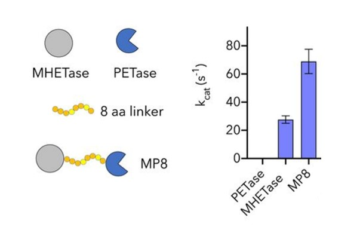

## Opgave 1

To forskellige, spontane mutationer i kinase-domænet af EGFR (G719S og
L858R) kan forårsage lungekræft. Tabellen nedenfor viser resultatet af
kinetiske målinger af aktiviteten af EGFR for vildtype (WT) og de to
mutanter.

  -------------------------
  EGFR-variant   *k*~cat~
                 (s^-1^)
  -------------- ----------
  WT             0.026

  G719S          0.280

  L858R          1.335
  -------------------------

**Spørgsmål 1**. Forklar med afsæt i funktionen af EGFR og
aktivitetsmålingerne hvorfor mutationerne kan forårsage kræft.

Svar: G719S og L858R er henholdsvis 10 og 51 gange mere aktive end WT.
Når EGFR-kinasen er mere aktiv vil man derfor forvente mere signalering
og mere celledeling/kræft.

Når EGFR-receptoren aktiveres, rekrutteres proteinet Grb2, hvilket kan
analyseres *in vitro* via et pull down-eksperiment med varianter af
receptorerne fra lungeceller fra raske personer (WT) samt personer med
lungekræft (L858R).

Spørgsmål 2. Forklar hvorfor L858R er i stand til at trække meget Grb2
med ned mens WT kun trækker en lille mængde Grb2 ned.

Svar: EGRF-signalering forårsager flere fosforyleringer på C-terminalen
på EGFR, der fungerer som docking sites for Grb2 (via SH2 domæner). Da
L858R er mere aktiv vil C-terminalen være mere phosphoryleret så L858R
kan interagere med Grb2. WT kinasen er ikke phosphoryleret og kan dermed
ikke så effektivt trække Grb2 med ned.

For at forstå hvordan L858R-mutationen ændrer kinase-aktiviteten
bestemmes krystalstrukturer til høj opløsning.

Spørgsmål 3. Hent strukturerne af WT (2ITX) og L858R (2ITV)
kinase-varianterne i PyMOL og foretag en strukturel overlejring. Hvor
ses den største strukturelle forskel og kan denne forklare hvorfor L858R
er mere aktiv?

Svar: De to strukturer er meget ens, men dog forskellige i
aktiveringsloopet. Aktiveringsloopets konformation er vigtig for
aktiviteten af kinaser generelt, så en sandsynlig forklaring er at L858R
findes på en mere aktiveret form (hvilket er korrekt).

Tabellen nedenfor viser affinitetsmålinger mellem EFGR-varianterne og
lægemidlet *Gefitinib*, der benyttes i behandlingen af visse typer
lungekræft.

  --------------------------
  EFGR-variant   K~D~ (nM)
  -------------- -----------
  WT             53.5

  G719S          123.6

  L858R          2.6
  --------------------------

Spørgsmål 4. Forklar hvorfor patienter med L858R-mutationen, men ikke
patienter med G719S-mutationen responderer positivt på behandlingen med
Gefitinib.

Svar: Gefitinib binder mere end 20 gange stærkere til L858R end WT og
vil dermed inhibere celledeling i kræftvæv med denne mutation. Gefitinib
binder svagere til G719S end til WT og vil dermed inhibere celledeling i
WT væv før den inhiberer celledeling i kræftvæv med denne mutant.

## Opgave 2

Umiddelbart efter coronavirus trænger ind i en celle translateres to
tredjedele af RNA-genomet til polyproteinerne **pp1a** og **pp1ab**, der
indeholder to proteaser. Proteaserne kløver pp1a og pp1ab til 16
ikke-strukturelle proteiner. Det er lykkedes forskere at udvikle
ligander, der hæmmer den primære protease. Brug følgende kommandoer til
at hente den biologiske enhed af den primære protease i PyMOL:

fetch 6M0K, type=pdb1, async=0

split_states 6M0K

**Spørgsmål 1**. Udbyg dette til et script, der farver protein hvidt,
fremhæver liganden i spacefill, viser active site rester som sticks
(Cys145, His41 og Glu166) og farver dem gule. Hæmmer liganden proteasens
aktivitet via binding til det aktive site eller dimer interface?

Svar:\
reinit

fetch 6M0K, type=pdb1, async=0

split_states 6M0K

color white, 6M0K\*

remove solvent

sele resn FJC

show spheres, sele

sele resi 145+41+166

show sticks, sele

color yellow, sele

Active site. FJC har hydrogen bindinger til Cys145 og Glu166.

Polyproteinet pp1ab translateres som en forlængelse af pp1a, hvor en
RNA-struktur (*frameshift stimulation element*, FSE) bremser ribosomet
og i visse tilfælde fører til et -1 skifte i læserammen, så ribosomet
undgår et stopkodon og kan fortsætte translationen af det længere
protein. I figuren herunder vises: (a) RNA-strukturdiagram for
SARS-CoV-2 FSE vist med stem farver, 3D-struktur vist som cartoon med
(b) stem-farver og (c) regnbue-farver fra 5\' (blå) til 3\' (rød).

**5\'**

**3\'**

**J3/2**

**Stem 3**

**Stem 1**

**Stem 2**

**Spørgsmål 2**. Beskriv RNA-strukturen af elementerne Stem1, Stem2,
Stem3 og J3/2.

Svar: Stem 1 er en hairpin med U bulge, Stem 2 er en pseudoknude, Stem 3
er en hairpin med A bulge. J3/2 er en joining region mellem stem 2 og 3.

3D-strukturen i panel b og c ovenfor giver en mulig forklaring på
hvordan ribosomet bremses og foretager et -1 skifte i læserammen.
Strukturen kan studeres nærmere i PyMOL ved at hente PDB-filen 6XRZ og
følge RNA-kædens forløb.

**Spørgsmål 3**. Hvilke strukturelementer danner en \"ring\" omkring 5\'
enden? Foreslå en mekanisme hvormed FSE blokerer og skubber ribosomet én
position tilbage i læserammen.

Svar: Man kan se at 5\' enden går ind gennem en \"ring\" i midten af
strukturen. Ringen dannes af stem 1, pseudoknude-interaktionen (stem 2),
J3/2 og hairpin (stem 3). Ribosomet har nok svært ved at trække 5\'
enden igennem denne pseudoknude - specielt hvis pseudoknuden er presset
op mod ribosomet. Hvis den strukturelle blokering samtidig passer med at
den glatte sekvens er placeret i ribosomet kan hele sekvensen blive
skubbet en position baglæns.

Nedenfor ses et sekvens-alignment af FSE-elementet fra SARS-CoV2 med
sekvenser fra lignende vira med eksempler på co-varierende baseændringer
i Stem1 og Stem2 markeret med røde og fede bogstaver:

{.lightbox width="90%" fig-align="center"}

**Spørgsmål 4**. Hvor mange forskellige typer co-varierende
baseændringer er der på de markerede positioner i Stem1 og Stem2?
Hvorfor ses typisk deletioner/indsættelser på 3 baser i denne
RNA-struktur?

Svar: I den markerede kolonne i Stem 1 ses 3 typer af co-varierende
baseændringer (GC, AU, UA). I den markerede kolonne i Stem 2 ses 2 typer
af co-varierende baseændringer (AU, UA). Da denne struktur er placeret i
kodende region, kan der ikke være 1 eller 2 base
deletioner/indsættelser, da det vil bryde læserammen.

## Opgave 3 (udenfor pensum)

Studier med enkelt-molekyle FRET af et protein indeholdende et
fluorofor-par (FRET-par) med en Förster-afstand på R~0~ = 60 Å viser at
enzymet skifter imellem to konformationelle tilstande med
FRET-effektiviteter på henholdsvis 0,2 og 0,8. Tilstanden med
FRET-effektivitet 0,2 betegnes Enz~1~ mens tilstanden med
FRET-effektivitet 0,8 betegnes Enz~2~, hvorved hastigheds- og
ligevægtskonstanter defineres som følger:

{.lightbox width="90%" fig-align="center"}

**Spørgsmål 1.** Hvor stor forskel er der på afstanden imellem donor og
acceptor mellem Enz~1~ og Enz~2~?

Svar: FRET-effektiviteten er givet ved:

{.lightbox width="90%" fig-align="center"}

Vi isolerer r:

E\*R\^6+ E\*r\^6 = R\^6

E\*r\^6 = R\^6- E\*R\^6 = R\^6(1-E)

r = (R\^6(1-E)/E))\^(1/6)

For 0.2 giver det

r = ((6nm)\^6(1-0.2)/0.2))\^(1/6) = 7.55nm

For 0.8 giver det

r = ((6nm)\^6(1-0.8)/0.8))\^(1/6) = 4.76nm

Forskellen er dermed: 7.55nm -- 4.76 nm = 2,8 nm = 28 Å

Nedenfor ses et repræsentativt enkelt-molekyle FRET-eksperiment for
systemet.

{.lightbox width="90%" fig-align="center"}

**Spørgsmål 2.** Giv et begrundet estimat for K.

Svar: Ligevægtskonstanten er defineret ud fra den tid som molekylet
tilbringer i det to tilstande. Den er ca. dobbelt så meget tid i Enz~1~
med lav FRET. Der for er K = 1/2

Eksperimentet gentages nu for en mutant af enzymet, hvilket giver
nedenstående resultat.

{.lightbox width="90%" fig-align="center"}

**Spørgsmål 3.** Angiv ud fra dette om k~1~, k~-1~ og K hver især er
*større*, *mindre* eller *omtrent uændret* for mutanten relativt til
vildtype-enzymet. Begrund dit svar.

Svar: Det observeres at intervallerne som molekylet tilbringer i Enz~2~
er kortere, hvorimod intervallerne i Enz~1~ har samme længde. Dermed er
k~1~ uændret, k~-1~ er øget og K er mindre.

Eksperimentet gentages nu for vildtype-enzymet i tilstedeværelse af en
inhibitor, som vist nedenfor.

{.lightbox width="90%" fig-align="center"}

**Spørgsmål 4.** Giv med udgangspunkt i disse data en forklaring på
hvordan inhibitoren virker.

Svar: Den lukkede tilstand Enz2 har en meget længere levetid. Det viser
at inhibitoren binder og stabiliserer den lukkede form af enzymet.

## Opgave 4

Et bakterielt toksin binder til receptorer i tarmvæggen hvorefter det
endocyteres. Toksinet katalyserer ADP-ribosylering af G-protein-koblede
receptorers S-subunit, hvilket medfører en overproduktion af cyklisk AMP
(cAMP), som igen leder til udskillelse af klorid-ioner, bikarbonat og
vand. Strukturen af toksinet viste at det er en oligomer, der er vist
sammen med monomeren nedenfor.

**C**

**N**

**Spørgsmål 1.** Angiv toksinets foldningsklasse og beskriv den
oligomere tilstand.

Svar: Toksinet tilhører αβ-foldningsklassen (mere specifikt α+β).
Oligomeren består af 5 kopier af monomeren og er således en pentamer.

Toksinet binder til specifikke saccharider på den glykosylerede
endocytose-receptor. Figuren herunder viser strukturen af toksinet med
et bundet monosaccharid fra to synsvinkler. Kulstofatomer i toksinet og
saccharidet er vist i henholdsvis grønt og gult og hydrogenbindinger er
vist som blå stiplede linjer.

{.lightbox width="90%" fig-align="center"}

**Spørgsmål 2.** Angivet hvilket specifikt monosaccharid, der er bundet
til receptoren, herunder konfigurationen omkring det anomere kulstof.

Svar: Det bundne saccharid er fucose, hvilket ses af methylgruppen i
position 6. Konfigurationen om det anomere carbon er β, idet
hydroxyl-gruppen i position 1 er på samme side af ringen som ved
position 6.

Strukturen af toksinet er også bestemt i kompleks med et trisaccharid
som vist nedenfor, hvor de tre saccharider er mærket henholdsvis A, B og
C.

{.lightbox width="90%" fig-align="center"}

**Spørgsmål 3.** Beskriv glycosidbindingerne mellem A og B samt mellem B
og C med angivelse af de indgående kulstofatomer og konfigurationen.

Svar: A-B er α-1,3 og C-B er β-1,4.

Figuren ovenfor til højre viser bindingen af trisaccharidet inklusive de
omgivende vandmolekyler (røde kugler) og hydrogenbindinger (blå stiplede
linjer). I et forsøg blev der designet to mutanter med henholdsvis en
enkelt mutation (H18A) og en dobbeltmutation (H18A / H94A), hvorefter
dissociationskonstanten for binding til trisaccharidet blev målt.

  ------------------------------
  Toksinvariant   Målt K~D~
  --------------- --------------
  Vildtype        10 mM

  H18A            \> 50 mM

  H18A / H94A     ingen binding
  ------------------------------

**Spørgsmål 4.** Forklar de observerede bindingskonstanter.

Svar: Der er ingen direkte vekselvirkning mellem trisaccharidet og
Histidin 18, men H18 positionerer vandmolekyler der danner
hydrogenbindinger til C-saccharidet. Ved fravær af H18 vil disse
vekselvirkninger være fraværende og dermed destabilisere bindingen.

H94 danner en hydrogenbinding til O-4 i C-saccharidet. Når også H94 er
muteret vil den i forvejen svage binding være helt fraværende.

## Opgave 5

Gennem de sidste ca. 50-70 år er der sket en kolossal ophobning af
syntetisk fremstillet plastik som affald i naturen. Dette nedbrydes
meget langsomt, i visse tilfælde af enzymdrevne processer. Strukturerne
af de mest udbredte klasser af plastik er vist nedenunder.

{.lightbox width="90%" fig-align="center"}

**Spørgsmål 1.** Hvorfor er det en udfordring for enzymer at nedbryde
disse stoffer ud fra et kemisk perspektiv? Hvilke stofgrupper må
forventes at være hhv. sværest og lettest at nedbryde og hvorfor?

Svar: Plastik repræsenterer nye former for makromolekyler som ikke har
eksisteret før. Derfor har der heller ikke været et evolutionært behov
for at udvikle enzymer til at nedbryde dem. Enzymer skal typisk have en
funktionel gruppe at angribe, f.eks. via hydrolyse. De tre grupper PE,
PVC og PS mangler helt sådanne angrebspunkter og må derfor være sværest
at nedbryde. De andre repræsenterer funktionelle grupper som estre (PLA,
PA11 og PET) og amider (PUR) som skulle kunne give et vist udgangspunkt,
men jo er langtfra naturlige substrater.

Der er ikke desto mindre identificeret forskellige enzymer der (om end
langsomt) nedbryder forskellige typer plastik. Nogle af disse produceres
af mikroorganismer der vokser på en losseplads med primært PET-plastik.
Ét sådant enzym (en PETase) nedbryder PET til MHET, mens et andet (en
MHETase) nedbryder MHET til PTA og EG, som vist nedenfor.

{.lightbox width="90%" fig-align="center"}

Strukturen af MHETase er bestemt i nærvær af stoffet benzoat (se
nedenfor). MHETase kan deles op i to domæner, en lysegrå del, som er
næsten identisk med PETase og en mørkegrå del der ikke findes i PETase.
Dvs. MHETase kan beskrives som PETase (lysegrå) med låg (mørkegrå).

{.lightbox width="90%" fig-align="center"}

**Spørgsmål 2.** Hvorfor kan benzoat binde til det aktive site i
MHETase? Hvilken enzymklasse forbindes sidekæderne i det aktive site
normalt med og hvorfor findes de i MHETase?

Svar: Benzoatgruppen findes også i TPA (den mangler bare en
carboxylgruppe). MHETasen minder om en serinprotease (med katalytisk
triade Asp492, His528 og Ser 225). Esterbindingen er ækvivalent med en
peptid binding hvad angår hydrolytisk mekanisme.

**Spørgsmål 3.** MHETase har en meget lav *k*~cat~. Forklar hvorfor det
giver mening at MHETasen har et låg-domæne i modsætning til PETasen.

Svar: PETasen arbejder med uopløseligt materiale så det behøver ikke
indkapsles. Derimod er MHET lille og skal tilbageholdes i det aktive
site eftersom den langsomme reaktionsrate gør MHET tilbøjelig til at
diffundere væk før det når at blive nedbrudt.

{.lightbox width="90%" fig-align="center"}

Man fremstiller nu et hybridenzym bestående af en MHETase og en PETase
forbundet med en 8-aminosyrerest linker. Dets evne til at danne TPA
måles og sammenlignes med de isolerede enzymer med følgende resultat.

**Spørgsmål 4.** Forklar de tre enzymers forskellige aktivitetsniveauer
ud fra disse data.

Svar: PETase er "død" da den danner MHET, ikke TPA. Hybridenzymet virker
bedre end MHETase fordi der er tale om koblede nedbrydningsveje (PTA =\>
MHET =\> TPA) så man øger den effektive koncentration af MHETase ved at
have det tæt på stedet hvor MHET dannes af PETasen.
