## Opgave 1

Protein G udtrykkes på overfladen af visse sygdomsfremkaldende arter af
*Streptococcus* og udgør en særlig udfordring for immunsystemet, da det
binder på en utraditionel måde til immunoglobulin G (IgG). Strukturen af
et IgG F~ab~-fragment i kompleks med et domæne fra Protein G har
PDB-koden 1IGC.

**Spørgsmål 1.** Åbn strukturen i PyMOL og angiv hvilke proteiner, de
tre kæder A, H og L udgør. Indsæt en simpel figur, der viser kæderne og
placeringen af de seks komplementaritetsbestemmende områder (CDR) med
forskellige farver.

Svar: F~ab~-fragmentet består af two IgG-domæner fra den tunge kæde (H,
cyan) og to fra den lette kæde (L, magenta). Protein G har kæde A
(grøn). Nedenfor er CDR markeret med rødt, men det er OK blot med en
angivelse (cirkel el. lign.).

CDR

Forskere har målt affiniteten mellem human IgG og Protein G vha. et
*competition assay*, hvor man undersøger hvor godt ikke-radioaktivt
Protein G er i stand til at udkonkurrere bindingen af radioaktivt mærket
Protein G til IgG. Man fandt at K~D~ var mellem 0,05 og 0,5 nM.

**Spørgsmål 2.** Udgør dette en stærk eller svag binding ift. hvad du
ved omkring typiske antistof:antigen-interaktioner? Forklar ud fra
strukturen hvordan de to domæner (IgG og protein G) interagerer,
herunder hvilke typer af interaktioner, der er fremherskende.

Svar: Antistof:antigen-interaktioner (via CDR) varierer bredt mellem pM
og flere hundrede nM, i Stryer er der et eksempel på en affinitet
omkring 20 nM. Derfor er dette en ret stærk interaktion, selv om den
ikke involverer CDR. Affiniteten er drevet af stor
overfladekomplementaritet og mange H-bindinger, herunder at β
foldepladen i Protein G forlænger det tilsvarende i det bageste
IgG-domæne i H-kæden med fire strenge.

Efterfølgende målte man affiniteten mellem fuldlængde Protein G fra tre
forskellige bakteriestammer, G148, C40 og G43 til både human IgG og
serumalbumin (HSA), et almindeligt forekommende protein i blodbanen, der
binder mange forskellige proteiner:

  --------------------------------------
  Variant   K~D~ IgG (nM) K~D~ HSA (nM)
  --------- ------------- --------------
  G148      0,05          1,0

  C40       0,5           1,3

  G43       0,5           Ingen binding
  --------------------------------------

Sekvensanalyse afslører, at de tre Protein G-varianter ikke indeholder
samme elementer:

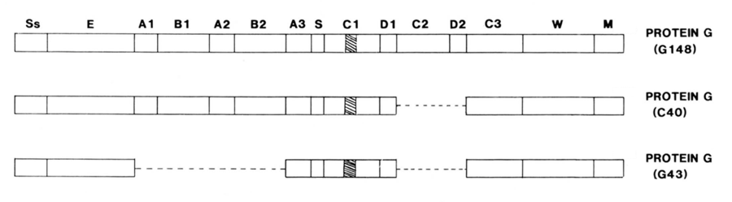{.lightbox width="90%" fig-align="center"}

**Spørgsmål 3.** Forklar ud fra disse data hvilke områder i Protein G,
der bidrager væsentlig til binding af henholdsvis IgG og HSA.

Svar: Vi kan se at affiniteten for IgG falder 10 gange i C40 og G43, der
mangler elementerne C2 og D2, dermed må disse repræsentere bindingen af
IgG. Ligeledes mistes binding til HSA i G43, hvor A1-B2-elementer
mangler, hvormed disse må stå for bindingen til HSA.

**Spørgsmål 4.** Binder Protein G til de konstante eller variable dele
af IgG? Forklar hvorfor Protein G kan være en udfordring for
immunsystemet.

Svar: Protein G binder meget stærkt til den konstante del af den tunge
kæde (heavy chain), hvor med antistoffer sættes ud af spil uden at
immunsystemet aktiveres.

## Opgave 2

Enzymet threonin deaminase (TD) omdanner aminosyren Thr til
2-ketobutyrate, hvilket udgør 1. trin i syntesen af aminosyren Ile. Ile
reducerer enzymets aktivitet, mens aminosyren Val (som dannes via et
ubeslægtet sæt af metaboliske reaktioner) øger aktiviteten.

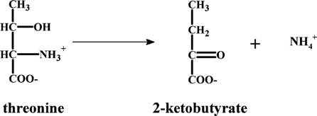{.lightbox width="90%" fig-align="center"}

**Spørgsmål 1.** Fordel de tre begreber *heterotrop allosterisk
aktivering*, *heterotrop allosterisk inhibering* eller *homotrop
kooperativitet* i tabellen nedenfor og forklar den fysiologiske relevans
af de tre effekter.

  --------------------------------------------------
  **Aminosyre**   **Effekt på TD**
  --------------- ----------------------------------
  Thr             Homotrop kooperativitet

  Ile             Heterotrop inhibering

  Val             Heterotrop allosterisk aktivering
  --------------------------------------------------

Svar: TD viser homotrop kooperativitet mht Thr, heterotrop kooperativ
aktivering/inhibering mht Val/Ile. Thr er substrat så det skal gerne
aktivere proteinet. Ile er slut produkt så det skal give negativ
feedback, mens Val skal give positiv feedback da der nok er brug for Ile
når der er brug for Val.

TD danner en tetramer, hvor hver monomer består af hhv. et katalytisk og
et regulatorisk domæne. Enzymaktiviteten som funktion af \[Thr\]
analyseres nu med to ligninger:

$V = V_{\max}\frac{{\lbrack S\rbrack}^{n}}{{\lbrack S\rbrack}^{n} + K^{n}}$
(1) $V = V_{\max}\frac{\lbrack S\rbrack}{\lbrack S\rbrack + K}$ (2)

På figuren nedenfor (A) er data tilpasset enten ligning 1 ( ) eller
ligning 2 ( ). Den indsatte figur fokuserer på de laveste \[Thr\]
værdier.

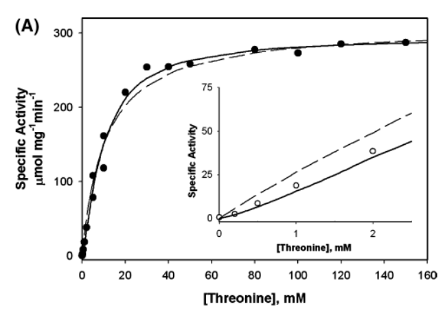{.lightbox width="90%" fig-align="center"}

**Spørgsmål 2.** Hvilken ligning passer bedst og hvad fortæller det om
reaktionen? Tilpasning til ligning 1 giver *n* = 1,27 ± 0,10 og *K* =
9,6 ± 0,7 mM. Er *n*-værdien højere eller lavere end hvad proteinets
kvarternære struktur giver mulighed for?

Svar: Ligning 1 passer bedst. Ligning 1 er ligningen for en kooperativ
proces men der er tale om meget svag kooperativitet (ikke stor forskel
til MM ligningen i ligning 2). Man ville forvente en *n*-værdi på op til
4 (jf. 2.8 for hæmoglobin som også er en tetramer).

I et andet forsøg tilsættes stoffet α-aminobutyrat (αAB). Dette udløser
en strukturændring i enzymet, der kan måles som en ændring i proteinets
fluorescens som vist nedenfor (B). Data tilpasses et funktionsudtryk
(ligning 1b) der minder om ligning 1, men angiver binding i stedet for
reaktionshastighed. Δ*F*/*F*~max~ antager værdier mellem 0 og 1 og
*K*~D~ er en dissociationskonstant. Ved tilpasning til 1b fås *n* = 1,31
± 0,03 og *K*~D~ = 52,3 ± 2,9 mM.

$\frac{\mathrm{\Delta}F}{F_{\max}} = \frac{{\lbrack\alpha AB\rbrack}^{n}}{{\lbrack\alpha AB\rbrack}^{n} + {K_{D}}^{n}}$
(1b)

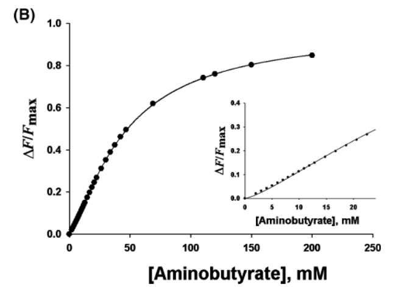{.lightbox width="90%" fig-align="center"}

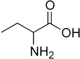{.lightbox width="90%" fig-align="center"}

**Spørgsmål 3.** Hvad minder αAB mest om, substrat eller produkt?
Forklar ud fra (A) og (B) ligheder og forskelle i hvordan αAB og Thr
binder til enzymet.

Svar: α-aminobutyrat er tæt på substratet Thr; der er kun en forskel i
enden fjernest fra COOH-gruppen (OH=\>CH~3~). K~D~ er øget fordi der
trods alt er en molekylær forskel mellem αAB og Thr, men den kooperative
evne er bibeholdt da *n* er uændret.

Endelig undersøges hvordan Val og Ile påvirker enzymet. Først gentages
forsøget ovenfor med 0,1 mM Ile (C). Derefter måles aktiviteten som
funktion af \[Val\] ved forskellige faste koncentrationer af Ile (D).
Der kan ses bort fra nedgangen i aktivitet ved høj \[Val\] og antages at
aktivitet er konstant.

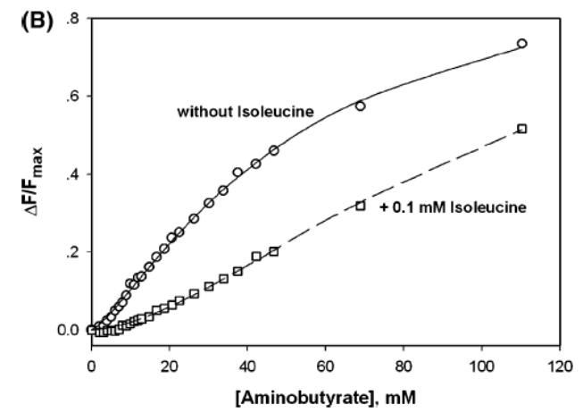{.lightbox width="90%" fig-align="center"}

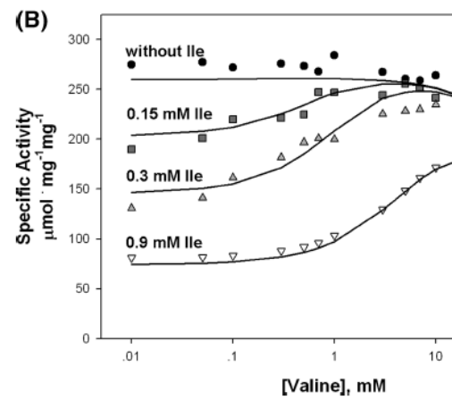{.lightbox width="90%" fig-align="center"}

**Spørgsmål 4.** Estimér den nye værdi for *K*~D~ ud fra data i (C) og
forklar ud fra din viden om enzymet hvorfor Ile har denne effekt på
affiniteten. Forklar dernæst ud fra (D) hvorfor Val påvirker effekten af
Ile. Hvad fortæller det om de to stoffers bindingssteder?

Svar: Ile er en allosterisk inhibitor som reducerer aktiviteten ved at
reducere affiniteten af "pseudosubstratet" α-aminobutyrat for TD (*K*~D~
stiger fra ca. 50 til ca. 105 mM). Val modvirker dette som allosterisk
aktivator. Ile og Val konkurrerer om det samme bindingssted. Jo højere
\[Ile\], jo mere Val skal der til for at modvirke Ile.

## Opgave 3

Ionkanalen KV1.2 er opbygget af 6 helicer (S1, S2, S3, S4, S5 og S6).
Det isoelektriske punkt (pI) for helix S4 er 10,2 hvor imod de andre
helicer har pI på mellem 6,7 og 7,9.

**Spørgsmål 1.** Hvilket fortegn har ladning af S4 have under
fysiologiske betingelser og hvorfor er det vigtigt at S4 har en høj
pI-værdi?

Svar: S4 vil være positivt ladet ved fysiologiske betingelser (ca. pH
7.4). S4 er en positiv ladet helix som gør kanalen spændingstyret. S4 er
en del af kanal padlerne som skifter konformation når membranen
depolariseres og åbner kanalen.

**Spørgsmål 2**. De første 60 aminosyrer i N-terminalen af KV1.2 er ikke
synlige i krystalstrukturen, men når disse trunkeres (KV1.2-delta60)
lukker kanalen ikke som normalt. Hvad kan være forklaringen på at de
første 60 aminosyrer ikke ses, og hvad er funktionen af disse aminosyrer
i kanalen?

Svar: De N-terminal 60 aminosyrer udgør "ball-and-chain" delen af
kanalen som er fleksibel og derfor ikke synlige i krystalstrukturen.
Denne del af er i stand til at inaktivere kanalen og lukke for
iontransporten.

Hent strukturen af ionkanalen (PDB 2A79) i PyMOL og udfør kommandoen:

symexp sym, 2A79, (2A79), 50

**Spørgsmål 3**. Angiv som dit svar en PyMOL-figur, der viser de kæder,
der udgør en funktionel kanal og angiv den kvaternære struktur.

Svar: KV1.2 har 4 identiske kæder (tetramer).

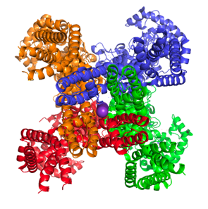{.lightbox width="90%" fig-align="center"}

**Spørgsmål 4**. Analyser strukturen, identificér og opskriv de
aminosyrer som binder kalium. Hvilken rolle har disse aminosyrer for
kanalens funktion?

Svar: Disse aminosyere udgør selektivitetsfilter (TVGYG) som gør kanalen
selektiv for kun kalium.

## Opgave 4

Ceramider består af *sphingosine* kovalent bundet til en fedtsyre via en
amidbinding. Der findes således forskellige ceramider, der betegnes
efter den indgående fedtsyre f.x. N-stearyl-ceramid. Ceramider
syntetiseres i ER og transporteres af proteinet CERT gennem cytosolen
til membraner i andre organeller eller til plasmamembranen. Nedenfor ses
den generelle struktur af ceramider og krystalstrukturen af det
ceramid-bindende domæne i CERT med N-stearyl-ceramid bundet.

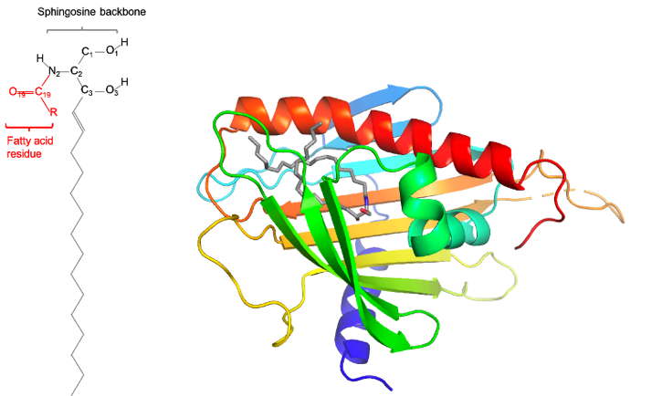{.lightbox width="90%" fig-align="center"}

**Spørgsmål 1.** Anslå hvor mange aminosyrerester, der indgår i den
lange α-helix (orange) og herfra dens længde målt i Å.

Svar: Der tælles 7 fulde omdrejninger i helixen. Hver omdrejning svarer
til 3.6 aminosyrerester, altså 25 aminosyrerester i alt. Hver omdrejning
svarer til 5.4 Å eller 1.5 Å pr aminosyrerest.

Længden af helixen må derfor være 37,8Å.

Nedenfor ses den polære ende af ceramidet bundet til CERT med
hydrogenbindinger som stiplede linjer og sidekæder med grøn
énbogstavskode og sekvensnummer. Atomer i ceramidet er angivet med sort
skrift.

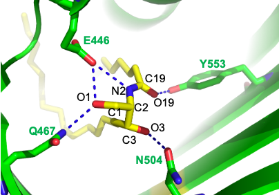{.lightbox width="90%" fig-align="center"}

**Spørgsmål 2.** Beskriv hvorledes den polære del af ceramidet genkendes
af CERT, og angiv hvor muligt hvilke atomer der er donorer / acceptorer
for hydrogenbindingerne.

Svar: Ceramidets polære del genkendes via hydrogen bindinger af fire
sidekæder; E446, Q467, N504 og Y553.

E446 er acceptor i hydrogen binding til N2, nitrogen i en sekundære
amin, og samtidig til O1 i hydroxyl gruppen. Ved neutralt pH kan E446
kun optræde som acceptor da den er deprotoneret.

Nitrogen i Q467 er donor til hydrogenbinding til O1 hydroxylgruppen.

Oxygen i N504 er acceptor i hydrogenbinding til O3. Oxygen i amid
gruppen kan kun være acceptor.

Oxygen i Y553 er donor i hydrogenbinding til O19, der kun kan være
acceptor, da det er et carbonyl oxygen.

Nedenfor er vist hvorledes de alifatiske hydrofobe kæder er placeret i
bindingslommen på proteinet med sphingosine-delen i blå-grøn og
fedtsyredelen i gul-rød. Søjlediagrammet viser binding af ceramider med
forskellig fedtsyrelængde til CERT.

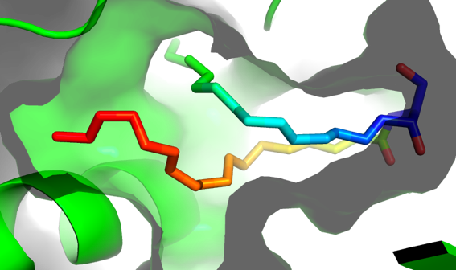{.lightbox width="90%" fig-align="center"}

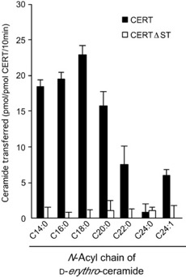{.lightbox width="90%" fig-align="center"}

**Spørgsmål 3.** Giv en sandsynlig forklaring på variationen i
affiniteten som funktion af fedtsyrekædelængde.

Svar: I N-stearyl-ceramide indgår stearinsyre som er en C18:0 fedtsyre.
Vi ser at netop for C18:0 har den højeste affinitet. For kortere
fedtsyre er der en svagt faldende affinitet, hvilket skyldes at den
hydrophobe lomme ikke fyldes helt ud. For længere fedtsyre ses et brat
fald i affinitet hvilket skyldes sterisk hindring; der er ikke plads i
bindingslommen til den længere fedtsyre. Den lidt højere affinitet af
C24:1 sammenlignet med C24:0 kan muligvis skyldes at dobbelbindingen
giver en struktur på fedtsyrekæden der udnytter pladsen i bindingslommen
bedre.

I et andet forsøg målte man binding af N-stearyl ceramide til CERT under
tilstedeværelse af fire punktmutationer i CERT (E446A, Q467A, N504A,
Y553F).

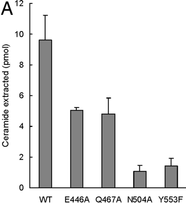{.lightbox width="90%" fig-align="center"}

**Spørgsmål 4.** Forklar hvorfor bindingen er reduceret for de fire
mutationer og foreslå hvorfor binding til N504A og Y553F er væsentligt
lavere end for de to andre mutanter.

Svar: Vi ser en reduceret affinitet for liganden for hver af de fire
mutationer, hvilket skyldes at H-bindings potentialet for ceramidets
polære del ikke bliver opfyldt.

En mulig forklaring på hvorfor mutation af N504 og Y553 har en større
effekt på affiniteten kan være at de medvirker til at fiksere starten af
de to lange alifatiske carbon-kæder.

**\**

## Opgave 5

Spike-proteinet fra ny coronavirus (SARS-CoV-2) består af to dele, S1 og
S2, hvoraf S1 udgør proteinets hovede og S2 rummer fusionsmaskineriet.
På figuren herunder er de enkelte aminosyrer farvelagt ud fra deres
variation mellem et betydeligt antal forskellige Spike-sekvenser:

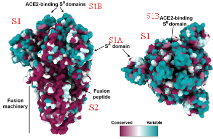{.lightbox width="90%" fig-align="center"}

**Spørgsmål 1.** Forklar hvad skalaen fra \"Conserved\" til \"Variable\"
betyder og hvorfor S1 domænet er mest variabelt?

Svar:

3 point for at beskrive at skalaen angiver sekvens-bevarelse i en
sekvens-alignment af Spike proteiner. Conserved har ens aminosyrer på
denne position, mens variable har meget forskellige aminosyrer på denne
position.

2 point for at nævne at bevarelse vurderes via similaritets-score, der
beregnes via Blosum-62 substitutions-matrice. Den samlede
similaritets-score for en kolonne er et mål for hvor bevaret denne
position er.

3 point for at beskrive at S1 domænerne er mest variable, da det er her
virussen skal tilpasse sig til at binde til forskellige receptorer. S2
(fusions-maskineriet) er til gengæld en generel mekanisme, der er
bevaret.

2 points for at nævne at antistoffer genkender denne del og at den
derfor ændrer sig.

S1 domænet indeholder ACE2-bindingsdomænet. Herunder vises Clustal O
sekvensalignment af receptor-bindingsmotivet (RBM) for SARS-CoV,
SARS-CoV-2 og en tæt beslægtet coronavirus fra flagermus:

CLUSTAL O(1.2.4) multiple sequence alignment

SARS-CoV NTRNIDATSTGNYNYKYRYLRHGKLRPFERDISNVPFSPDGKPCT-PPALNCYWPLNDYG 59

SARS-CoV-2 NSNNLDSKVGGNYNYLYRLFRKSNLKPFERDISTEIYQAGSTPCNGVEGFNCYFPLQSYG
60

bat-SL-RaTG13
NSKHIDAKEGGNFNYLYRLFRKANLKPFERDISTEIYQAGSKPCNGQTGLNCYYPLYRYG 60

\*:.::\*:. \*\*:\*\* \*\* :\*:.:\*:\*\*\*\*\*\*\*. :. \...\*\*.
.:\*\*\*:\*\* \*\*

SARS-CoV FYTTTGIGYQPY 71

SARS-CoV-2 FQPTNGVGYQPY 72

bat-SL-RaTG13 FYPTDGVGHQPY 72

\* \* \*:\*:\*\*\*

\# Percent Identity Matrix - created by Clustal2.1

1: SARS-CoV 100.00 50.70 53.52

2: SARS-CoV-2 50.70 100.00 76.39

3: bat-SL-RaTG13 53.52 76.39 100.00

**Spørgsmål 2.** Hvad betyder symbolerne \* : og . angivet under
sekvenserne? Hvilken similaritets-score har en S til T og en I til L
mutation ifølge Blosum62 substitutionsmatricen?

Svar:

5 points for at \* betyder identisk, : betyder høj similaritet, .
betyder middel similaritet.

3 points for S til T substitution = +1 score

2 points for I til L substitution = +2 score

Kør følgende script for at kigge på RBM-domænets interaktion med ACE2
receptoren:

reinit\
fetch 6vxx, async=0\
fetch 6vsb , async=0\
align 6vsb, 6vxx\
set_view (\\\
    -0.943680167,    0.046812125,   -0.327529669,\\\
    -0.330630779,   -0.170001134,    0.928319812,\\\
    -0.012226451,    0.984330058,    0.175904989,\\\
     0.000143678,    0.000455528, -565.865234375,\\\
   216.740447998,  198.277236938,  199.891937256,\\\
   443.839630127,  687.539184570,  -20.000000000 )\
hide everything, 6vsb

scene F1, store

hide everything, 6vxx

show cartoon, 6vsb

scene F2, store\
fetch 6m17, async=0\
align 6m17 & chain F, 6vsb & chain A\
set_view (\\\
    -0.943680167,    0.046812125,   -0.327529669,\\\
    -0.330630779,   -0.170001134,    0.928319812,\\\
    -0.012226451,    0.984330058,    0.175904989,\\\
    -0.000154376,    0.000198960, -1146.631835938,\\\
   196.597061157,  176.100280762,  279.889526367,\\\
  1024.687866211, 1268.387695312,  -20.000000000 )\
sele 6m17 & chain F

color cyan, sele

scene F3, store

hide everything, 6vsb

zoom sele

scene F4, store

scene F1

Scene F1 viser Spike med RBM-domæne i lukket form (PDB 6vxx), F2 Spike
hvor et af RBM-domænerne er åbnet (PDB 6vsb), F3 viser binding af RBM
til ACE2 (PDB 6m17), og endelig zoomer F4 ind på RBM-domænet.

I den såkaldte engelske variant af SARS-CoV-2 (B.1.1.7) findes følgende
ændringer: H69-V70 deletion, Y144-145 deletion, N501Y, A570D, P681H,
T716I, S982A, og D1118H og specielt N501Y menes at være specielt vigtig
for at B.1.1.7 er mere smitsom.

**Spørgsmål 3.** Hvor er N501Y placeret i den ikke-bundne (F1) hhv.
bundne form (F3/F4) af Spike? Hvordan kan Tyr-substitutionen resultere i
mere effektiv binding?

Svar:

5 points for at mutation sidder i bindingssite for RBD.

5 points for at Tyrosin er aromatisk og kan stabilisere interaktion både
ved hydrofob interaktion og hydrogenbindinger.

**Spørgsmål 4.** Hvordan kan D1118H-mutationen påvirke Spike-proteinets
evne til at inficere en celle?

Svar:

10 points for at deletionen kan påvirke konformationen af Spike domænet
generelt og f.eks. påvirke ligevægten mellem den lukkede og åbne
konformation.
