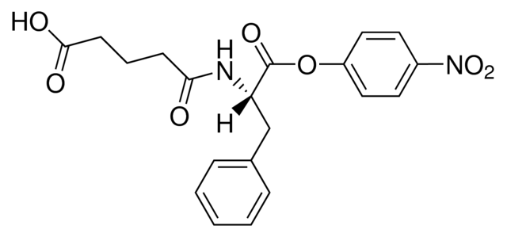
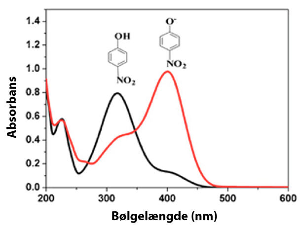
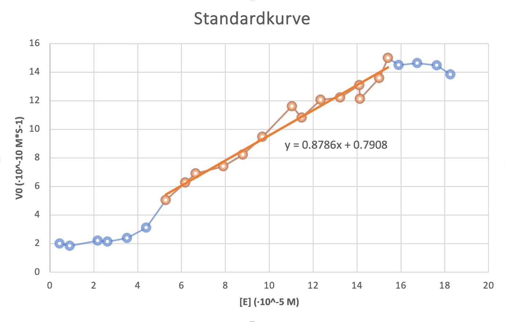
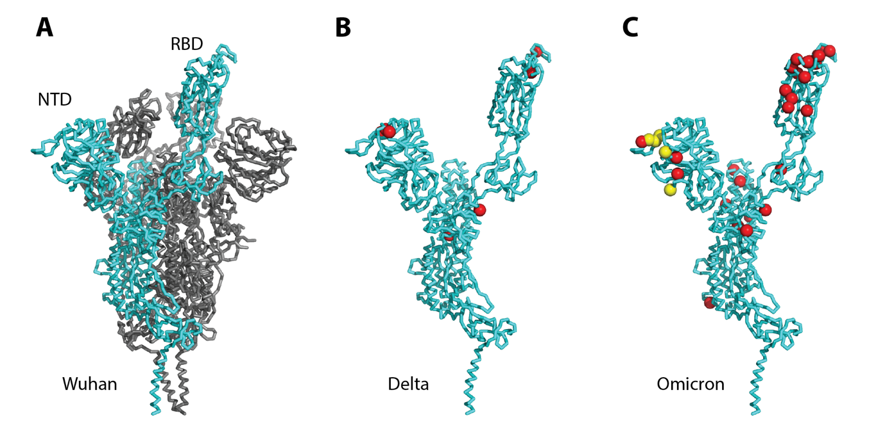
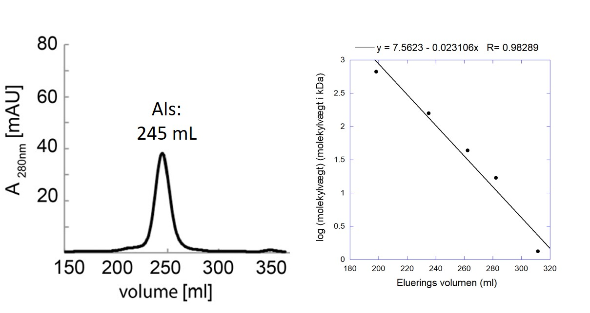
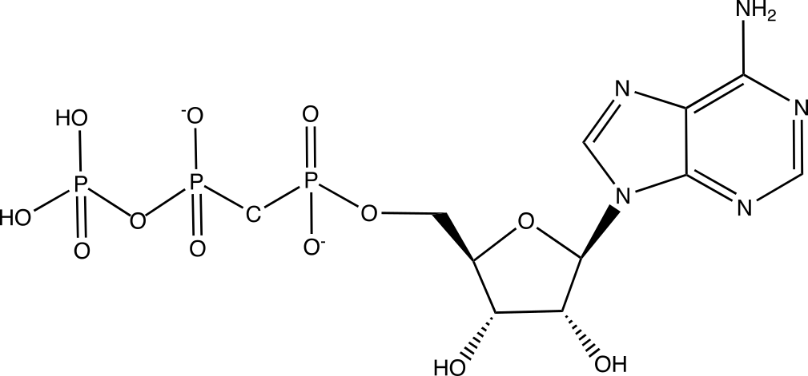
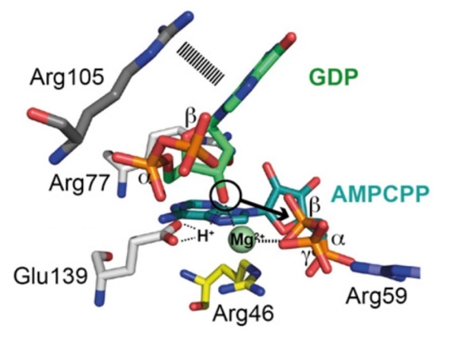
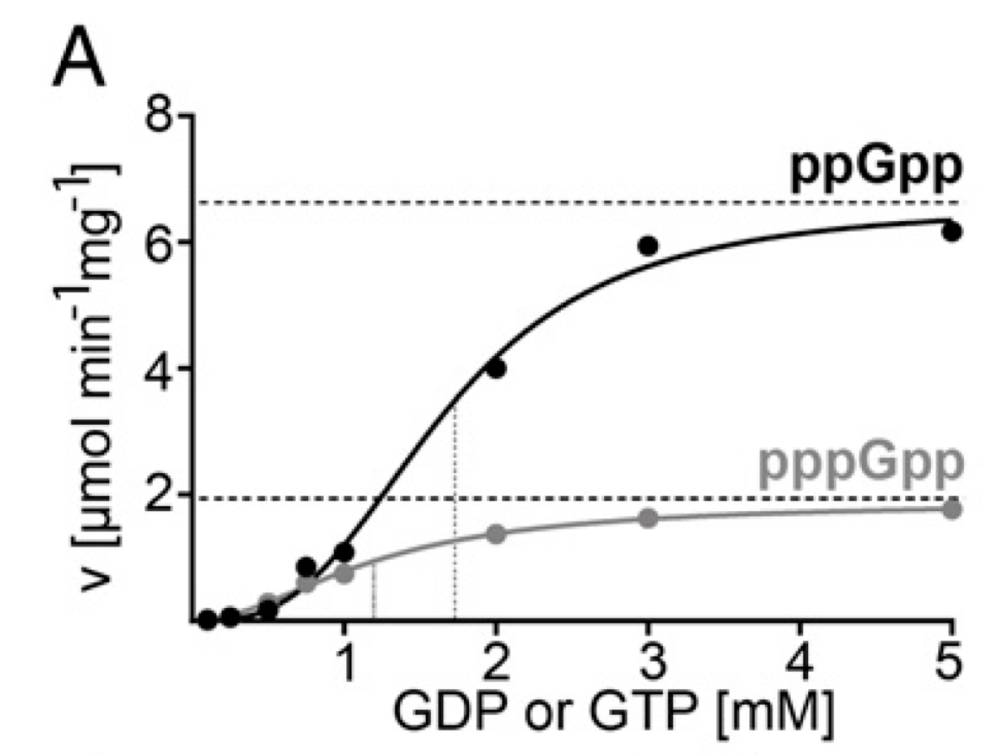
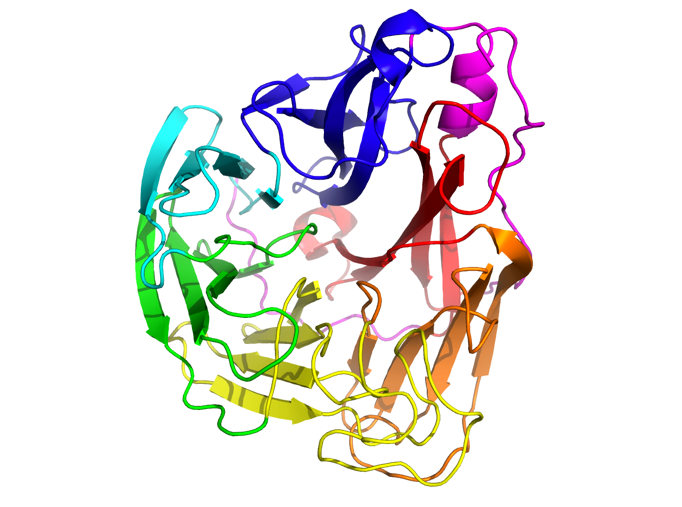
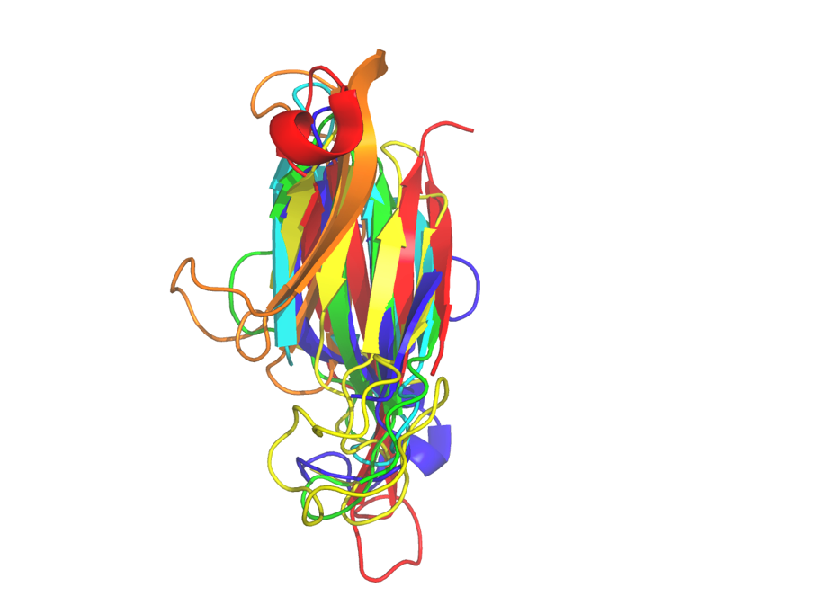

## Opgave 1

Stoffet *N*-glutaryl-*L*-phenylalanine-*p*-nitrophenol (GPN) kan
benyttes som såkaldt [kromogent substrat]{.underline} for proteasen
chymotrypsin.

{.lightbox width="90%" fig-align="center"}*\
N*-glutaryl-*L*-phenylalanine *p*-nitrophenol

Spørgsmål 1. Beskriv hvad der forstås ved et \"kromogent substrat\",
herunder hvilke egenskaber ved GPN, der gør at det kan bruges som
substrat for chymotrypsin.

Svar: \"Kromogen\" betyder \"danner farve\", hvilket bruges om
substrater, der ved enzymatisk omdannelse danner et andet stof, der
absorberer ved en specifik bølgelængde. Her p-nitrophenol. Substratet
kan fungere for chymotrypsin, da det har ligheder med et peptid.
Bindingen, der kløves er dog en ester.

Ved den enzymatiske reaktion dannes stoffet ***p*-nitrophenol**, der er
en svag syre med en pK~a~-værdi på 7,15. Nedenfor ses absorptionskurver
for stoffets to protoneringsformer.

{.lightbox width="90%" fig-align="center"}

**Spørgsmål 2.** Angiv i punktform de eksperimentelle trin, du vil tage
for at opstille en standardkurve for aktiviteten af chymotrypsin overfor
GPN målt ved spektroskopi. Standardkurven skal vise initialhastighed som
funktion af enzymkoncentration. Angiv valg af pH-værdi og bølgelængde
samt forslag til andre komponenter i reaktionsopløsningen.

Svar: Vælger pH 8 (deprotoneret form af p-nitrophenol) og dermed
bølgelængde 400 nm til at følge reaktionen. Der kan derudover være
f.eks. 50 mM Tris-Cl, pH 8 og 100 mM KCl i opløsningen.

Eksperimentelle trin:

1.  Fast mængde substrat + buffer blandes i f.eks. 10 rør med stigende
    mængde enzym.

2.  Herefter måles udviklingen i A400 over ca. 120 sek umiddelbart efter
    tilsætning af enzym. Initialhastigheden beregnes ud fra hældning af
    kurven.

3.  Hastigheden plottes som funktion af koncentrationen af enzym.

**Spørgsmål 3.** Den vedhæftede Excel-fil \"Chymotrypsin data.xlsx\"
indeholder et sæt datapunkter for en sådan standardkurve målt i vandig
buffer ved 25°C. Opstil standardkurven og angiv og argumentér valg af
konfidensinterval.

Svar: Data plottes i Excel:

{.lightbox width="90%" fig-align="center"}

Konfidensinterval vurderes til 5-15 \* 10^-5^ M enzym (som vist med
orange + bedste, rette linje).

I et andet forsøg foretages en gradvis denaturering chymotrypsin ved
opvarmning af enzymet til forskellige temperaturer. Efter opvarmning
sættes enzymet på is og aktiviteten måles som ovenfor:

  -----------------------------------------
  \[E\] (·10^-5^ 10,0     10,0     10,0
  M)                               
  -------------- -------- -------- --------
  Temperatur     40       45       50
  (°C)                             

  v~0~ (·10^-10^ 7,2736   5,7122   3,8821
  M·s^-1^)                         
  -----------------------------------------

**Spørgsmål. 4.** Forklar hvordan ovenstående data kan relateres til
standardkurven og angiv i hvert tilfælde den relative aktivitet (i %) af
enzymet.

Svar: For de denaturerede enzymer måles en hastighed, der aflæses på
standardkurven og modsvarer en koncentration af upåvirket enzym. Her kan
også bedste rette linje benyttes.

40°C. vo = 7.2736, svarer til 7.36\*10^-5^ M, enzymet er 7.36/10 = 74%
aktivt.

45°C. vo = 5.7122, svarer til 5.60\*10^-5^ M, enzymet er 5.60/10 = 56%
aktivt.

50°C. vo = 3.8821, svarer til 3.52\*10^-5^ M, enzymet er 3.52/10 = 35%
aktivt.

## Opgave 2

Omicron-varianten af SARS-CoV2, der er opstået i Sydafrika, adskiller
sig meget fra tidligere varianter og har f.eks. 36 mutationer i
Spike-proteinet. Nedenstående figur viser Spike-trimer fra den
oprindelige Wuhan-virus, hvor monomer i åben konformation er vist i cyan
(A). Monomer for Delta-variant (B) og Omicron-variant (C) er vist ved
siden af med mutationer vist for substitutioner (rød) og
inserts/deletions (gul).

{.lightbox width="90%" fig-align="center"}

**Spørgsmål 1.** Forklar hvordan mutationer opstår i SARS-CoV2, hvorfor
de bevares i varianterne under naturlig selektion, og hvad der kan
forårsage de mange mutationer observeret i Omicron-varianten.

Svar:

3 point for at forklare at mutationer opstår under kopiering af RdRp
(RNA dependent RNA polymerase).

3 point for at forklare at mutationer, der enten neutrale eller
forbedrer Spike proteinets egenskaber vil blive bevaret i varianterne
under naturlig selektion. Derimod vil mutationer der forværrer Spike
proteinets egenskaber forsvinde.

4 point for at forklare at virus skal replikere i en stor population for
at mutationer opstår. Evt. en kronisk infektion i individ med nedsat
immunforsvar.

En af de mest almindelige mutationer er D614G, som menes at øge
fleksibiliteten af S1-domænet. En anden almindelig mutation er P681H i
et fleksibelt loop, der kløves af den cellulære protease furin.

**Spørgsmål 2.** Brug BLOSUM62-matricen til at vurdere om disse
mutationer har høj eller lav similaritet og hvilken positiv effekt disse
mutationer kan have for infektion af cellen.

Svar:

4 point for at begge mutationer har lav similaritet hhv. -1 og -2.

3 point for at forklare at øget flexibilitet kan gøre det lettere at
binde til flere ACE2 receptorer.

3 point for at forklare at bedre furin kløvning frigør S2 fusionsdomæne,
så fusion sker lettere.

Det vedhæftede PyMOL-script \"**Omicron-spike.pml**\" viser alle 36
mutationer i Omicron-varianten plottet på en model af Spike-proteinet
(**F1**) samt interaktion med ACE2-receptor (**F2**) og antistof
(**F3**). RBD, der interagerer med ACE2-receptor har følgende
mutationer: G339D, S371L, S373P, S375F, K417N, N440K, G446S, S477N,
T478K, E484A, Q493R, G496S, Q498R, N501Y, Y505H.

**Spørgsmål 3.** Hvilke af disse mutationer sker i området, der er i tæt
kontakt med ACE2-receptoren? Undersøg om disse mutationer har negativ
eller positiv similaritets-score og forklar hvad det kan betyde for
bevarelse af bindingssitet.

Svar:

5 point for ca. 8 mutationer i RBD-ACE2 interaktion.

5 point for at forklare at nogle af disse mutationer har positive
similaritetsscores og derved potentielt bevarer interaktionen med ACE2:
G446S=0, N501Y=-2, Q498R=1, G496S=0, Q493R=1, S477N=1, T478K=-1,
E484A=-1.

**Spørgsmål** **4.** Hvor mange og hvilke mutationer findes i området,
der interagerer med antistof? Hvilken type af områder på Spike proteinet
genkendes af antistoffer og hvilken type modifikationer kan hæmme
antistofbinding?

Svar:

5 point for 4 mutationer i NTD. Deletioner: G142-, V143-, Y144-, og
Y145D.

5 point for tilgængelig protein struktur på Spike proteinet genkendes,
men glykosylering gemmer visse områder, så de ikke genkendes.

## Opgave 3

Nukleotiderne GTP og GDP kan i mikroorganismer omdannes til hhv. pppGpp
og ppGpp ved at overføre en difosfatgruppe fra ATP til 3\'-OH. pppGpp og
ppGpp betegnes *alarmoner*, og er vigtige for at hjælpe bakterier til at
adaptere til ændringer i deres omgivelser. De to alarmoner syntetiseres
af alarmonsynthetasen Als, som består af 185 aminosyrer og binder både
ATP og GTP/GDP. På en gel filtreringskolonne i en vandig buffer pH 7,4
eluerer Als som vist på nedenstående figur til venstre. Til højre ses en
kalibreringskurve for samme kolonne hvor man har bestemt
elueringsvolumen for proteiner med kendte molekylemasser. Ligningen
ovenfor grafen angiver den bedste rette linje.

{.lightbox width="90%" fig-align="center"}

**Spørgsmål 1.** Hvor mange subunits består Als af under disse
betingelser? Forklar hvordan du når frem til dit svar.

Svar: Følger man ligningen i grafen til højre, har Als (der eluerer ved
245 ml) en MW på 78 kDa. Med 185 aa har den en monomermasse på ca 20
kDa, dvs. proteinet er en tetramer.

Det er lykkedes at krystallisere Als i kompleks med stoffet AMPCPP (vist
nedenfor til venstre) og GDP. Figuren til højre viser området omkring
det aktive site, hvor den angivne H^+^ stammer fra 3\'-OH-gruppen på
GDP.

{.lightbox width="90%" fig-align="center"}
{.lightbox width="90%" fig-align="center"}

**Spørgsmål 2.** Hvordan adskiller AMPCPP sig fra ATP og hvad kan være
grunden til at det benyttes ved strukturbestemmelsen?

Svar: AMPCPP kan ikke hydrolyseres mellem α- og β-fosfatgrupperne så
pyrofosfatgruppen kan ikke overføres til GDP/GTP. Det tillader at man
fanger strukturen i en præ-katalytisk tilstand.

**Spørgsmål 3.** Beskriv de interaktioner, der binder nukleotiderne til
Als og kom med et bud på den rolle, som den divalente metalion spiller i
den katalytiske mekanisme. Sammenlign med *carbonic anhydrase*.

Svar: Arg46, Arg 59 og Arg77 laver elektrostatiske kontakter til
fosfatgrupperne, mens Arg105 laver en π-kation kontakt til GDP. Mg^2+^
er med til at polarisere 3'OH gruppen til angreb på AMPCPP så
pyrofosfatgruppen kan angribes (dog ikke hydrolyseres i AMPCPP's
tilfælde). Mg^2+^'s rolle minder om Zn^2+^ i CA som også polariserer en
polær gruppe (i CA's tilfælde vand) til nukleofilt angreb.

Man måler nu hvordan GDP og GTP påvirker aktiviteten af Als, dvs.
produktionen af hhv. ppGpp (fra GDP) og pppGpp (fra GTP). Herfra
bestemmes V~max~ (stiplede linjer) til hhv. 6.60 (GDP) og 1.93 (GTP)
µmol min^-1^ mg^-1^. *v*~0~*-*værdierne for de enkelte punkter er
angivet nedenfor.

  -----------------------------------------
  GXP      *v*~0~ (GDP)\   *v*~0~ (GTP)\
  \[mM\]   \[µmol min^-1^  \[µmol min^-1^
           mg^-1^\]        mg^-1^\]
  -------- --------------- ----------------
  0.10     0.0104          0.0145

  0.25     0.0690          0.0677

  0.50     0.2752          0.3276

  0.75     0.8448          0.5517

  1.0      1.0862          0.7241

  2.0      4.0345          1.3793

  3.0      5.3300          1.6207

  5.0      6.1379          1.7759
  -----------------------------------------

{.lightbox width="90%" fig-align="center"}

**Spørgsmål 4.** Beregn og kommentér graden af kooperativitet i
aktiviteten overfor hhv. GDP og GTP. Benyt hæmoglobins binding til ilt
som model og husk at ved *v*~max~ er enzymet 100% mættet med substrat.
Husk at aktiviteten er proportional med hvor meget af enzymet der er
bundet.

Svar: Der beregnes følgende tabel i Excel, hvor *Y* = *v*/*v*~max~.
v-enhed er µmol min^-1^ mg^-1^.

  ----------------------------------------------------------------------------------------------------
  \[GXP\](mM)   v (GDP) v(GTP)   Y(GDP)   Y(GTP)   Y/(1-Y)   Y/(1-Y)   log         log       log
                                                   GDP       GTP       (\[GXP\])   Y/(1-Y)   Y/(1-Y)
                                                                                   GDP       GTP
  ------------- ------- -------- -------- -------- --------- --------- ----------- --------- ---------
  0.10          0.01    0.01     0.00     0.01     0.00      0.01      -1.00       -2.80     -2.12

  0.25          0.07    0.07     0.01     0.04     0.01      0.04      -0.60       -1.98     -1.44

  0.50          0.28    0.33     0.04     0.17     0.04      0.20      -0.30       -1.36     -0.69

  0.75          0.84    0.55     0.13     0.29     0.15      0.40      -0.12       -0.83     -0.40

  1.00          1.09    0.72     0.16     0.38     0.20      0.60      0.00        -0.71     -0.22

  1.99          4.03    1.38     0.61     0.71     1.57      2.50      0.30        0.20      0.40

  3.01          5.33    1.62     0.81     0.84     4.20      5.24      0.48        0.62      0.72

  5.01          6.14    1.78     0.93     0.92     13.28     11.52     0.70        1.12      1.06
  ----------------------------------------------------------------------------------------------------

Dette giver flg. Excel plot:

Der er altså en kooperativitet på ca. 2 for både GDP og GTP, altså mere
end ingen kooperativitet (hældning på 1) men ikke fuld kooperativitet i
betragtning af at det er en tetramer (hældning på 4).

## Opgave 4 (udenfor pensum)

Et enzym mærkes med to fluoroforer, der udgør et FRET-par med R~0~ = 54
Å og analyseres med FRET-spektroskopi. I fravær af ligand måles en
konstant FRET-effektivitet på E = 0.2.

**Spørgsmål 1.** Hvad er afstanden imellem de to fluoroforer?

Svar: Regnes ud ved at indsætte i følgende formel:

r = 68 Å

Efter tilsætning af substratet observeres følgende FRET-effektivitet (E)
som funktion af tiden for et repræsentativt enzymmolekyle. Nedenfor
vises resultatet af to eksperimenter udført hhv. med (sort) og uden
(rød) substrat.

{.lightbox width="90%" fig-align="center"}

**Spørgsmål 2.** Beskriv substratets effekt på enzymets struktur og
dynamik ud fra ovenstående graf.

Svar: Vi ser at tilsætning af substratet tilføjer en ekstra tilstand med
høj FRET. Dvs. at binding af substratet gør at enzymet lukker til en
kompakt konformation.

Enzymets dynamik kan fortolkes ud fra en model med to tilstande, S1 og
S2, hvor S1 har lav og S2 har høj FRET-effektivitet.

{.lightbox width="90%" fig-align="center"}

For en mutant af enzymet fås nu følgende data.

{.lightbox width="90%" fig-align="center"}

**Spørgsmål 3.** Hvordan påvirker mutation (øger eller sænker) k~1~,
k~-1~, og K~eq~ under tilstedeværelse af substrat? Begrund dit svar.

Svar: Hastighedskonstanter vurderes ud fra dwell-times: k~1~ er
transitionen ud af S~1~ som er \~konstant. k~-1~ er øget pga. kortere
dwell-time. Ligevægten er forskud imod lav FRET-tilstanden, S~1~. Altså
er K~eq~ mindre.

**Spørgsmål 4.** For en lang række forskellige substrater har enzymet
samme k~cat~. Forklar denne observation med udgangspunkt i hvad du ved
om enzymets dynamik.

Svar: Et oplagt svar er at katalyse hastigheden er begrænset af en
åbne-lukke bevægelse, hvis hastighed er uafhængig af substratet.

## Opgave 5

Influenzavirus har på overfladen to proteiner, hemagglutinin (H) og
neuramidase (N), som danner spikes på samme måde som kendes fra ny
coronavirus. Der findes flere forskellige subtyper af hver af de to
proteiner, således at forskellige influenzastammer betegnes med
kombinationen af hemagglutinin og neuramidase, fx H1N1 eller H2N9.

Strukturen af forskellige neuramidaser er blevet bestemt ved
røntgenkrystallografi. PDB-filen 5nzn indeholder den biologisk relevante
oligomer af neuramidase fra H1N1 i kompleks med lægemidlet Ozeltamivir.

**Spørgsmål 1.** Beskriv N1 oligomerens sammensætning og symmetri.

Svar: Oligomeren består af 4 protomerer og er således en tetramer. I den
rette orientering ses at en 90° rotation vil føre en protomer over i
nabo protomeren og hele tetrameren over i sig selv. Der er derfor
firtals symmetri.

N1-monomeren er opbygget af et repeterende strukturelt motiv (kaldet
supersekundær struktur), der forekommer 6 gange:

Motiv 1: /5nzn/A/A/114-178

Motiv 2: /5nzn/A/A/179-221

Motiv 3: /5nzn/A/A/222-273

Motiv 4: /5nzn/A/A/274-344

Motiv 5: /5nzn/A/A/345-399

Motiv 6: /5nzn/A/A/95-103+400-450

Den sidste forekomst er irregulær, da den består af en kombination af
proteinets N-terminale og C-terminale del.

**Spørgsmål 2.** Skriv et PyMOL-script der viser en monomer af N1 hvor
hver forekomst af det strukturelle motiv er vist med hver sin farve.
Besvarelsen skal indeholde både script og tilhørende billede.

Svar:

{.lightbox width="90%" fig-align="center"}reinitialize

fetch 5nzn

disable all

bg_color white

create 5nznA, /5nzn/A/A

enable 5nznA

show cartoon, 5nznA

color magenta, 5nznA

color blue, /5nznA/A/A/114-178

color cyan, /5nznA/A/A/179-221

color green, /5nznA/A/A/222-273

color yellow, /5nznA/A/A/274-344

color orange, /5nznA/A/A/345-399

color red, /5nznA/A/A/95-103+400-450

**Spørgsmål 3.** Beskriv motivet og foldningsklassen for N1.

Svar: Motivet er en 4 strenget up'n'down β-plade hvor alle β-kæder er
anti-parallelle. N1 tilhører β foldningsklassen.

**Spørgsmål 4.** Skriv et PyMOL-script, der overlejrer Motiv 2,3,4,5 og
6 på Motiv 1 vha. kommandoen 'super'. Besvarelsen skal indeholde både
script og tilhørende billede af de overlejrede motiver.

Svar:

reinitialize

fetch 5nzn

disable all

bg_color white

create 5nznA, /5nzn/A/A

enable 5nznA

{.lightbox width="90%" fig-align="center"}show cartoon, 5nznA

color magenta, 5nznA

color blue, /5nznA/A/A/114-178

color cyan, /5nznA/A/A/179-221

color green, /5nznA/A/A/222-273

color yellow, /5nznA/A/A/274-344

color orange, /5nznA/A/A/345-399

color red, /5nznA/A/A/95-103+400-450

create bl1, /5nznA/A/A/114-178

create bl2, /5nznA/A/A/179-221

create bl3, /5nznA/A/A/222-273

create bl4, /5nznA/A/A/274-344

create bl5, /5nznA/A/A/345-399

create bl6, /5nznA/A/A/95-103+400-450

disable 5nznA

super bl2, bl1

super bl3, bl1

super bl4, bl1

super bl5, bl1

super bl6, bl1
