## Opgave 1

Planten *Thapsia gargancia* (også kendt som giftig gulerod) har været
kendt siden oldtiden for sine urtemedicinske egenskaber. Stoffet
thapsigargin blev isoleret fra *Thapsia gargancia* i 1970'erne.

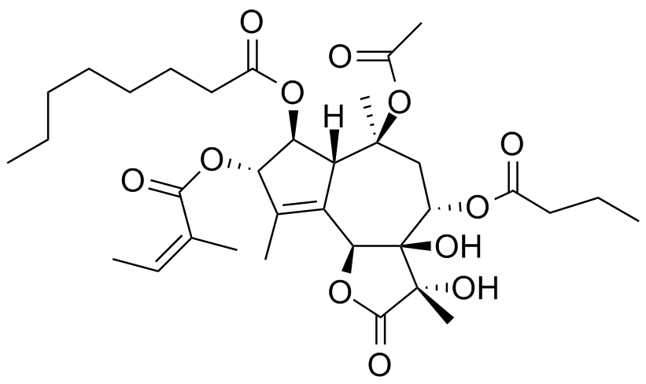{.lightbox width="90%" fig-align="center"}*Thapsigargin*

Spørgsmål 1. Forklar ud fra thapsigargins kemiske struktur hvordan du
forventer stoffet passerer cellemembranen. Begrund dit svar.

Svar: Thapsigargin er et lipofilt molekyle som relativt nemt passere den
hydrofobe cellemembranen via passiv diffusion.

**Spørgsmål 2.** Når humane celler behandles med thapsigargin observeres
at Ca^2+^-ATPasen forefindes fosforyleret i langt større grad end hvis
cellerne er ubehandlede. Forklar ud fra denne information hvilke(n)
funktionelle stadie(r) af pumpen, thapsigargin kan tænkes at inhibere
samt hvad karakteriserer disse stadier. Begrund dit svar.

Svar: Det må enten være E1-P eller E2-P stadiet som er karakteriserede
ved at være de eneste to stadier hvor Asp 351 er phosphoryleret.

**Spørgsmål 3.** Behandling med thapsigargin medfører blandt andet
kraftigere muskelsammetrækning. Forklar ud fra denne information de
cellulære konsekvenser af thapsigargin på muskelfunktionen.

Svar: Thapsigargin hæmmer Ca^2+^-ATPases (SERCA) som står for import af
Ca^2+^ til det sarkoplasmatiske reticulum (SR). Dermed stiger den
cytoplasmatiske koncentration of Ca^2+^ hvilket medfører at aktin-myosin
filamenterne i musklerne vil være sammentrukne i længere tid (=
kraftigere muskelsammentrækning).

**Spørgsmål 4.** Da krystalstrukturen af Ca^2+^-ATPasen i kompleks med
thapsigargin blev løst viste den at binding af stoffet er uforeneligt
med koordinering af Ca^2+^. Hvilket stadie af pumpens reaktionscyklus
inhiberer thapsigargin og forventer du at observere et nukleotid i denne
struktur? Begrund dit svar.

Svar: Thapsigargin må inhibere E2-P. E2-P stadiet er karakteriseret ved
at Ca^2+^ er dissocieret og det vides fra spørgsmål 2 at thapsigargin
stabiliserer et phosphoryleret stadie (så det kan kun være E2-P). Man
forventer ikke at se nukleotid/ADP i E2-P stadiet som dissocierer
ligesom Ca^2+^ i E2-P.

## Opgave 2 (udenfor pensum)

Du studerer et protein ved hjælp af et kuvette-baseret fluorimeter.
Proteinet er mærket med to fluoroforer, der tilsammen udgør et FRET-par
med R~0~ = 58 Å. I fluorimetret måler du en FRET-effektivitet på E =
0.3.

**Spørgsmål 1.** Hvad er den gennemsnitlige afstand imellem de to
fluoroforer?

Svar: Afstanden beregnes ved at indsætte i følgende formel:

Hvilket omdannes til:

$$r^{6} = \frac{R_{0}^{6}(1 - E)}{E}$$

R=66.8Å

Herefter studerer du proteinet med enkelt-molekyle FRET-spektroskopi og
får følgende FRET-effektivitet (E) som funktion af tiden for et
repræsentativt enzymmolekyle.

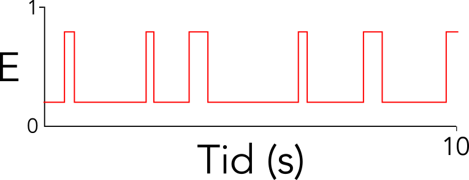{.lightbox width="90%" fig-align="center"}

**Spørgsmål 2.** Forklar sammenhængen imellem den kuvette-baserede
måling og enkelt-molekylemålingen. Er der overensstemmelse imellem de
to?

Svar: Den kuvette-baserede måling er et gennemsnit over tid og ensemble.
I enkelt-molekyle målingen ser vi at der er to tilstande, en med E
omkring 0.2 og en med E omkring 0.8. Det tilstanden med lav FRET er
klart mest almindelig, så gennemsnittet passer fint med en værdi omkring
0.3. Dermed er der fin overensstemmelse imellem de to målinger.

Du tilsætter nu proteinets ligand og laver følgende enkelt molekyle
måling:

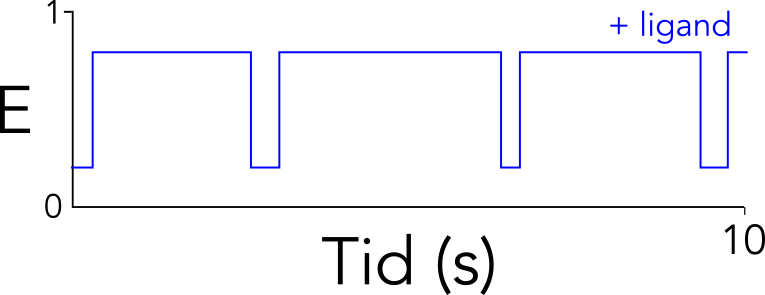{.lightbox width="90%" fig-align="center"}

**Spørgsmål 3.** Hvordan påvirker liganden proteinets struktur og
dynamik?

Svar: Liganden stabiliserer tilstanden med høj FRET-effektivitet,
sandsynligvis en lukket konformation. Proteinet er ikke låst, men åbner
meget mere sjældent end i *apo*-tilstanden.

Du fortolker proteins dynamik ud fra en model med to tilstande, S1 og
S2, hvor S1 har lav RET effektivitet, og S2 har høj FRET-effektivitet.

{.lightbox width="90%" fig-align="center"}

Du studerer nu en mutant af proteinet og får følgende data (uden
ligand):

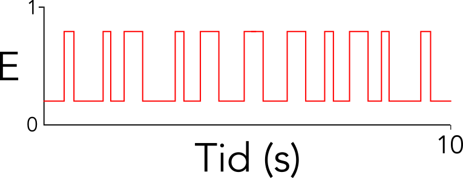{.lightbox width="90%" fig-align="center"}

**Spørgsmål 4.** Hvordan påvirker mutation (øger eller sænker) k~1~,
k~-1~, og K~eq~? (begrund dit svar)

Svar: Hastighedskonstanter vurderes ud fra dwell times: k~1~ er
transitionen ud af S1 som er øget (kortere dwell time). k~-1~ er ca.
konstant da S2 dwell time har ca. samme længde. Ligevægten er forskud
imod høj FRET-tilstanden, S2. Altså er K~eq~ større.

## Opgave 3

Stoffet methylenblåt kan bruges til at bestemme koncentrationen af RNA i
en opløsning.

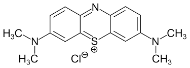{.lightbox width="90%" fig-align="center"}

*Methylenblåt (chloridsalt)*

Spørgsmål 1. Beskriv hvordan methylenblåt interagerer med RNA, herunder
hvilke typer af kemiske interaktioner, der finder sted samt hvilke
strukturelle egenskaber ved RNA, der danner grundlag for binding af
stoffet.

Svar: Methylenblåt er et polyaromatisk, kationisk farvestof, der binder
til strukturerede nukleinsyrer gennem [interkalation mellem
baser]{.underline}. Der kræves altså baser, der stacker (men formentlig
ikke basepar) for binding. Interaktionerne er derfor
[stacking/hydrofobe]{.underline}, og til dels [ioniske]{.underline} i
det kationen neutraliserer nukleinsyreres negative ladning.

I et forsøg undersøgte forskere interaktionen mellem methylenblåt og
transfer RNA (tRNA) ved at måle absorptionsspektre ved forskellige
forhold mellem phosphat i RNA (P) og methylenblåt (M). Resultatet ses i
figuren nedenfor hvor (1) er methylenblåt alene, (2) er ved et
P/M-forhold på 4,7 og (3) ved et P/M-forhold på 35,2.

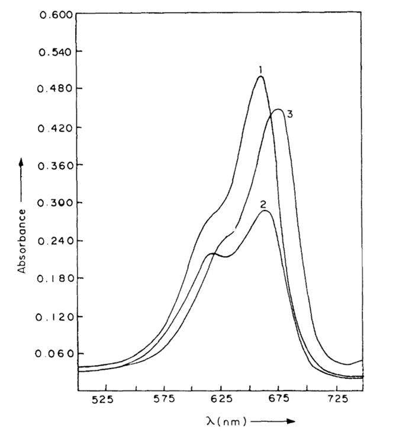{.lightbox width="90%" fig-align="center"}

**Spørgsmål 2.** Beregn hvor mange molekyler methylenblåt, der i
gennemsnit er bundet til hvert tRNA-molekyle i (2) og (3), når det
oplyses at tRNA består af 76 ribonukleotider.

Svar: 76 ribonukleotider = 76 phosphatgrupper, dvs. at der er 76/4,7 =
16 methylenblåt bundet i (2) og 76/35,2 = 2 methylenblåt i (3).

I et forsøg ønsker du at måle RNase-nedbrydning af tRNA vha.
absorptionen af methylenblåt.

**Spørgsmål 3.** Forklar hvilket af ovenstående P/M-forhold, der vil
fungere bedst til formålet samt ved hvilken bølgelængde, du vil foretage
målingen. Forklar dit svar.

Svar: Vi kigger efter den største ændring i absorption ved en målbar
bølgelængde, hvilket opnås mellem (1) og (2). Derfor giver P/M-forholdet
4,7 det bedste resultat. Bølgelængden vælges til ca. 660 nm, hvor der er
det største skift.

Forsøget består af følgende trin, her listet i tilfældig rækkefølge:

\(1\) En stigende mængde RNase tilsættes

\(2\) En fast mængde tRNA tilsættes

\(3\) Prøven blandes grundigt

\(4\) Buffer tilsættes

\(5\) Absorptionen af prøven måles hvert 10 sek. over 1 min.

\(6\) Spektrofotometeret nulstilles på buffer

\(7\) En fast mængde methylenblåt tilsættes

\(8\) Prøven blandes grundigt

**Spørgsmål 4.** Angiv den rækkefølge af trinnene ovenfor, du ville
vælge til eksperimentet.

Svar: 6, 7, 4, 2, 3/8, 1, 8/3, 5

Data fra:

Antony, T., Atreyi, M., Rao, M. V. (1995) Interaction of methylene blue
with transfer RNA\--a spectroscopic study. 97(3):199-214. doi:
10.1016/0009-2797(95)03616-t.

PMID: 7671338

## Opgave 4

{.lightbox width="90%" fig-align="center"}Lipaser er enzymer der nedbryder
fedtstoffer såsom triglycerider gennem hydrolyse. På figuren til højre
er vist et triglycerid med kløvningsstederne angivet med røde streger.

**Spørgsmål 1.** Angiv hvilken type af bindinger i fedtstoffet der kan
kløves af lipasen.

Svar: Det er esterbindingerne. Bemærk af det skal være mellem O og C(O)
gruppen, ikke O og CH eller C(O) og Cα.

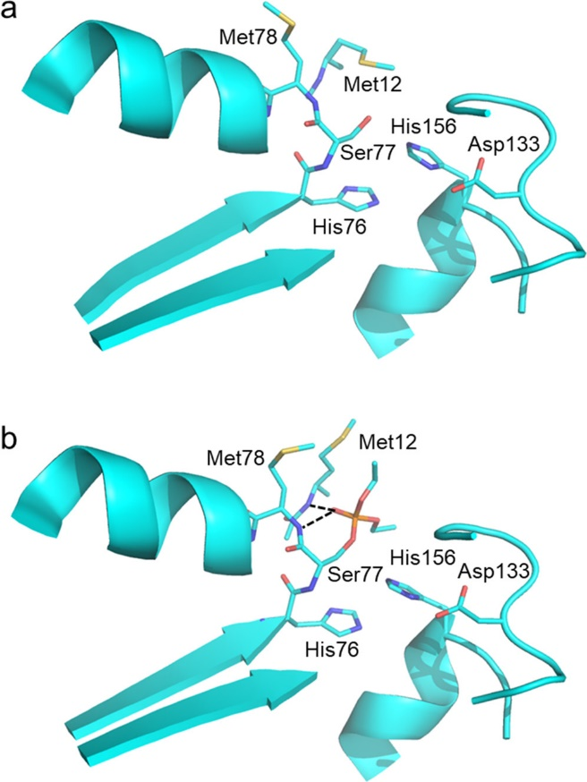{.lightbox width="90%" fig-align="center"}I figuren til højre ses en del af
strukturen af en lipase omkring dens aktive site.

**Spørgsmål 2.** Angiv navn og nummer på de [tre]{.underline} sidekæder
der indgår direkte i den katalytiske mekanisme og forklar hvordan de
hver især bidrager. Bemærk at der er to His-sidekæder og to
Met-sidekæder.

Svar: Ser77, His156, Asp133. Ser angriber C(O) når den er blevet
deprotoneret af His hvis protonerede tilstand stabiliseres af
deprotoneret Asp. Det er her His156 og ikke His76 da Asp133 skal være
nær His for at stabilisere dens positive ladning.

Som modelsubstrat til at undersøge lipaseaktivitet anvendes ONPG, se
figur nedenfor.

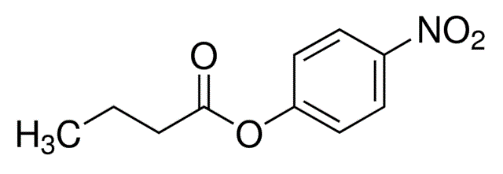{.lightbox width="90%" fig-align="center"}

O*-nitrophenolbutyrat (ONPG)*

**Spørgsmål 3.** Angiv de molekylære trin involveret i hydrolyse af
dette substrat, herunder de katalytisk aktive sidekæder. Hvilken del af
substratet frigives først og hvordan måles det?

Svar: Se nedenfor. ONPH frigives først; den er gul i ONP- formen (måles
ved absorbans).

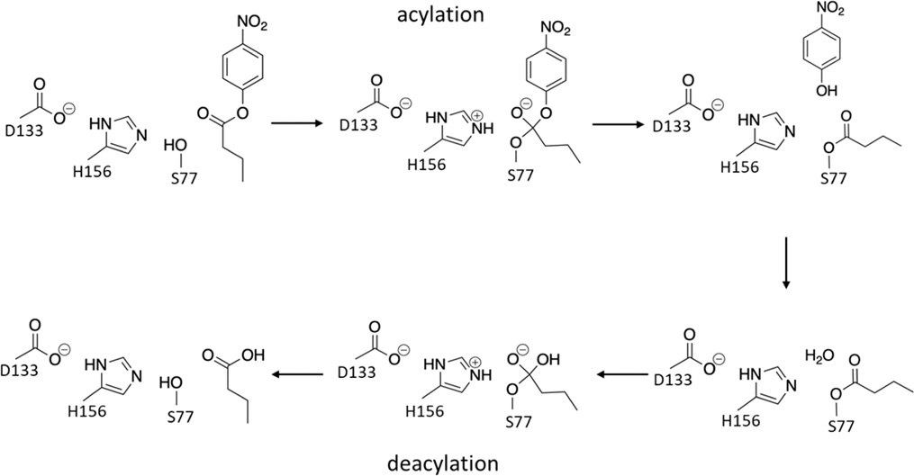{.lightbox width="90%" fig-align="center"}

Nu udføres der et stopped-flow forsøg med lipasen hvor stoffet MUB (se
nedenfor) anvendes som substrat. Her bliver methylumbelliferyl-gruppen
mere fluorescerende når MUB kløves. Resultatet af disse forsøg ses i
figuren til højre.

|                                                               |                                                               |
|:-------------------------------------------------------------:|:-------------------------------------------------------------:|
| 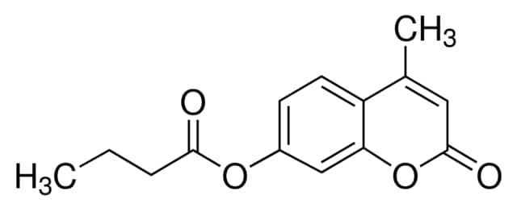{.lightbox width="90%" fig-align="center"}                         | 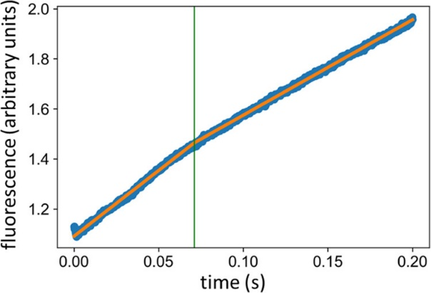{.lightbox width="90%" fig-align="center"}                         |
| *methyl-umbelliferyl butyrate (MUB)*                          |                                                               |

**Spørgsmål 4.** Forklar den molekylære basis for udseendet af grafen
med særligt henblik på hvad der sker på hver side af den grønne linje.

Svar: Signalet stiger fordi MU frigives fra MUB gruppen. Der er et
"knæk" omkring 0.07s som er udtryk for "burst-phase" kinetik. Dvs. det
første trin (acylering af Ser77 med frigivelse af MU) er hurtigere end
det andet trin (deacylering af Ser77 med frigivelse af butyrat gruppen),
så hele enzym populationen når at blive acyleret hurtigt (burst phase \<
0.07s), men skal derefter vente på den noget langsommere deacylering
(\>0.07s) før enzymerne kan frigives for at starte en ny runde
hydrolyse.

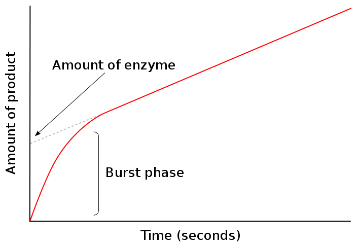{.lightbox width="90%" fig-align="center"}Bonus svar: Det kaldes "active site titration". Jo
mere aktivt protein (altså protein som faktisk reagerer med substratet),
jo større forskel mellem nul-punkts-ekstrapoleringerne fra steady-state
tilstanden og burst-phase tilstanden (se skitse).

## Opgave 5

Galactose UDP-galactose 4-epimerase (GALE) er et enzym der katalyserer
omlejringen af galactose til glucose:

GALE:NAD^+^ + UDP-galactose → GALE:NADH + UDP-glucose

**Spørgsmål 1.** Beskriv forskellene mellem galactose og glucose i
kemisk struktur og konfiguration.

Svar: Galactose og glucose er begge hexo-aldoser. De er hinandens
epimerer idet de kun adskiller sig ved at have modsat konfiguration
omkring carbon nr. 4.

Krystalstrukturen af human GALE med den bundne kofaktor NAD+ er
deponeret i PDB med koden **1EK5**. Åbn PyMol og vis strukturen som
'cartoon'.

**Spørgsmål 2.** Hvor mange domæner består GALE af og hvilke(n)
foldningsklasse tilhører de(t)? Forklar dine svar.

Svar: GALE består af 2 domæner der begge tilhører αβ-foldningsklassen.
Mere specifikt er det N-terminale domæne et α/β-domæne, medens det andet
domæne er et α+β domæne.

Brug nu PyMOLs menu (A → Find → Polar Contacts → To Other Atoms In
Object) til at vise polære interaktioner mellem adenindelen af NAD^+^ og
GALE.

**Spørgsmål 3.** Beskriv hvilke aminosyrerester der interagerer med
adenin og, hvis muligt, om de indgår som hydrogenbindings donorer eller
acceptorer.

Svar: Ile67 hovedkæde N er H-donor i hydrogenbinding med adenin N1,
Asp66 OD1 er H-acceptor i hydrogenbinding med adenin N6, Asn34 hovedkæde
N er H-donor i hydrogenbinding med adenin N3.

Krystalstrukturen af GALE:NADH:UDP-Glucose findes også i PDB med koden
**1EK6**.

**Spørgsmål 4.** Udform et script til PyMOL, der først overlejrer 1EK5
og 1EK6. Derefter skal de to strukturer vises i 'cartoon' repræsentation
og liganderne vises som sticks. 1EK5 farves grøn og liganden cyan medens
1EK6 farves orange og liganderne gule. Besvarelsen skal indeholde script
og tilhørende billede.

Svar:

fetch 1EK5

fetch 1EK6

super 1EK5, 1EK6

hide everything

show cartoon, 1EK5 + 1EK6

color green, 1EK5

show sticks, 1EK5 and resn NAD

color cyan, 1EK5 and resn NAD

color orange, 1EK6

show sticks, 1EK6 and (resn NAI or resn UPG or resn TMA or resn MG)

color yellow, 1EK6 and (resn NAI or resn UPG or resn TMA or resn MG)

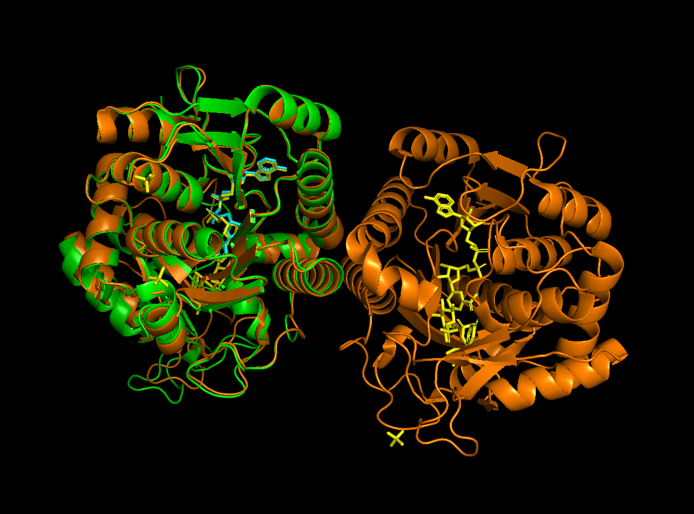{.lightbox width="90%" fig-align="center"}
