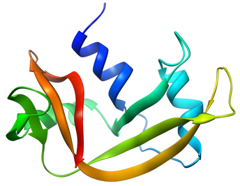
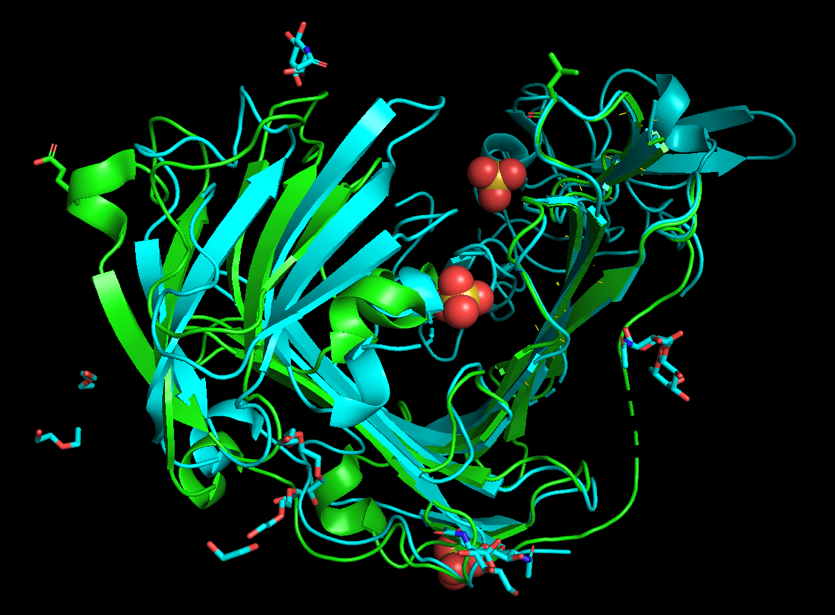
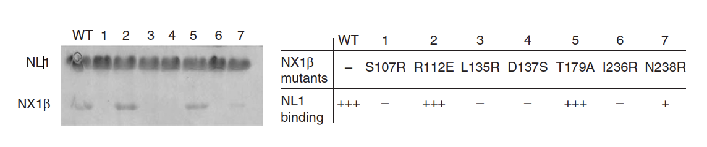

## Opgave 1

Bovin RNase A er et vigtigt enzym, der er relativt let at oprense fra
pancreas og derfor har været brugt til en lang række biokemiske
eksperimenter gennem tiden. RNase A er desuden et usædvanligt stabilt
enzym.

{.lightbox width="90%" fig-align="center"}**Spørgsmål 1.** Beskriv domænestruktur og
foldningsklasse af RNase A, herunder hvilke biokemiske egenskaber, der
gør enzymet så stabilt.

Svar: RNase A består af et enkelt domæne (124 aa, 13,7 kDa), foldet som
en blandet αβ-fold (foldningsklasse α+β) bestående af et 3- og et
4-strenget anti-parallelt β-sheet og 3 helicer. Der er 4 S-S bindinger,
der stabiliserer strukturen og ret usædvanligt er der ikke rigtig nogen
hydrofob kerne.

RNase A kan kløves enzymatisk med subtilisin, hvorved der dannes RNase
S.

**Spørgsmål 2.** Forklar hvordan RNase S adskiller sig fra RNase A,
herunder hvorfor det stadig er et aktivt enzym. Hvilke bånd og med
hvilken størrelse ville du forvente at se på en SDS-PAGE gel fra fuldt
kløvet RNase S under henholdsvis reducerende og ikke-reducerende
betingelser? Forklar dit svar.

Svar: Subtilisin kløver mellem aminosyre 20 og 21 i peptidkæden, hvilket
betyder at den N-terminale helix frigøres. N-terminalen indeholder
His12, der er vigtig for den katalytiske reaktion, men idet S-peptidet
stadig sidder fast på proteinet forbliver (delvist) aktivt. Den er ikke
bundet af S-S broer, men holdes fast af ikke-kovalente interaktioner,
der gør at de to dele (S-proteinet og S-peptidet) binder hinanden meget
stærkt (30 pM). Af denne grund vil forventes to bånd ca. 2 kDa og 11 kDa
på en SDS-gel, uafhængig af om der er reduktant til stede.

Immunoglobulin G (IgG) fungerer i det adaptive immunforsvar ved at
genkende fremmede stoffer i kroppen.

**Spørgsmål 3.** Hvor mange bånd og med hvilken størrelse vil du
forvente at se på en SDS-PAGE gel fra oprenset IgG under henholdsvis
reducerende og ikke-reducerende betingelser? Forklar dit svar.

Svar: Immunoglobulin G (IgG) består af to tunge kæder på hver ca. 50 kDa
(4 IgG-domæner hver) samt to lette kæder på hver ca. 25 kDa (2
IgG-domæner hver), så samlet er massen ca. 150 kDa. Da de to tunge kæder
er forbundet til hinanden via en S-S bro og hver især med en S-S bro til
de lette kæder vil man forvente ét bånd på 150 kDa (hele igG) på en ikke
reducerende gel, men to bånd på 50 kDa (de to tunge kæder hver for sig)
og 25 kDa (de to lette kæder hver for sig) på en reducerende gel.

Hent strukturen af intakt IgG i PyMOL (PDB-kode 1IGY).

**Spørgsmål 4.** Hvor mange immunoglobulindomæner findes der i det
intakte antistof? Antistoffet indeholder to kæder, der ikke er protein.
Beskriv kort opbygningen af disse kæder, herunder hvordan de er koblet
til proteinet.

Svar: Der er 12 igG-domæner i alt (4 på hver af de tunge kæder og 2 på
hver af de lette kæder). De to kæder, der ikke er protein, er glykaner,
der er koblet på Asn 314 på hver af de to tunge kæder. Hver glykan
består af 9 enheder i en dobbelt forgrenet struktur.

## Opgave 2 (udenfor pensum)

Proteasen uPA bliver koncentreret på overfladen af visse celler ved at
binde til receptoren uPAR. Strukturen af uPAR er løst vha.
røntgenkrystallografi i kompleks med en peptidagonist (PDB-kode 1YWH) og
i kompleks med de receptorbindende domæner af uPA og et Fab fragment
(PDB-kode 2FD6, uPAR=kæde U).

**Spørgsmål 1.** Overlejr de to strukturer af uPAR på domæne 1 (rester
1-81), vis dem begge som cartoon med to forskellige farver og vedlæg
billedet i dit svar. Beskriv kortfattet den overordnede strukturelle
forskel på de to konformationer af receptoren.

Svar:

{.lightbox width="90%" fig-align="center"}

Domænerne lukker sammen omkring uPA, så 2FD6 er mere lukket end 1YWH med
peptid-antagonisten.

Til forsøg med enkeltmolekyle-fluorescens har man introduceret
cysteinrester på positionerne L19 og E209, der efterfølgende mærkes med
fluorophorer. Det kan antages at afstanden imellem fluorophorerne svarer
til afstanden imellem Cβ-atomerne for de to positioner.

**Spørgsmål 2.** Hvor stor er [ændringen]{.underline} i afstand imellem
disse to positioner målt mellem de to strukturer ovenfor?

Svar:\
Igen er der lidt forskel på afstandene imellem de forskellige modeller,
men der ligger indenfor ca. 1-2 Å i afstand. Værdierne nedenfor referer
til den første uPAR-kæde i hver fil.

Afstande:\
1YWH: 39 Å\
2FD6: 30,5 Å\
Forskel: 8,5 Å

**Spørgsmål 3.** Hvilke FRET-effektiviteter ville et FRET-par med en
Förster-radius på 54 Å give for disse to tilstande?

Svar: FRET-effektiviteten er givet ved:
$E = \ \frac{R^{6}}{R^{6} + r^{6}}$, så

E(1YWH) = 54^6^/(54^6^+41.9^6^) = 0.82\
E(2FD6) = 0.94

Nedenfor ser du resultatet af et enkelt-molekyle FRET-eksperiment for
uPAR med ovenstående mærkning i fravær af nogen ligander.

{.lightbox width="90%" fig-align="center"}

Ligevægtskonstanten K for den strukturelle omlejring er defineret for
reaktionen:

uPAR~1YWH~ ⇌ uPAR~2FD6~

**Spørgsmål 4.** Estimér ligevægtskonstanten K og hastighedskonstanten
for overgangen fra uPAR~2FD6~ til uPAR~1YWH~. Begrund dit svar.

Svar: Ligevægtskonstanten bestemmes ud fra den tid proteinet tilbringer
i de to tilstande og er altså ca. 5. Fulde point gives for rigtig
begrundelse og værdier fra ca. 3-7. Hastighedskonstanten bestemmes ud
fra antallet af overgange fra E2FD6 til E1YWH. Vi ser 5 overgange i en
samlet periode på omkring 0,8 s, hvilket giver en hastighedskonstant på
omkring 6 s-1. Der er ret stor tolerance her hvis argumentet er rigtigt.

## Opgave 3

Dopaminreceptor D1 (DRD1) er et eksempel på en G-protein-koblet
receptor, der er vigtig for mange funktioner i hjernen.

**Spørgsmål 1.** Den kemiske struktur af **dopamin** er vist nedenfor.
Forventer du at stoffet kan passere cellemembranen? Begrund dit svar.

{.lightbox width="90%" fig-align="center"}

{.lightbox width="90%" fig-align="center"}

**dopamin** **doxanthrine**

Svar: De hydrofile grupper på Dopamin gør molekylet polært og dermed vil
Dopamin ikke passivt passere den hydrofobe cellemembranen.

**Spørgsmål 2.** Når humane celler, der udtrykker DRD1 behandles med
dopamin observeres det at den cytoplasmatiske cAMP-koncentration stiger.
Forklar hvordan denne effekt opstår.

Svar: Når Dopamin binder til DRD1 aktiveres receptoren som derved
aktiverer det trimeriske G-protein. G-proteinet (alfa subunit) binder
derefter til GTP og denne form vil aktivere adenylate cyclase, som
danner cAMP i cytoplasma.

Det syntetiske stof **doxanthrine** (se figuren ovenfor) får ligeledes
den cytoplasmatiske koncentration af cAMP til at stige, når det
tilsættes celler. Fjerner man derimod OH-grupperne på stoffet, ses ingen
ændring af cAMP-koncentrationen.

**Spørgsmål 3.** Sammenlign strukturerne af dopamin og doxanthrine og
forklar hvorfor de har samme virkningsmekanisme. Hvad kalder man
stoffer, der fungerer på samme måde som doxanthrine?

Svar: Dele af strukturen af doxanthrine og især placering af OH-grupper
er identisk med dopamin. Både dopamin og doxanthrine kan binde og
aktivere DRD1 og dermed øges den cytoplasmatiske cAMP koncentration. Da
doxanthrine har samme virkemekanisme som dopamin betegnes det som en
agonist.

**Spørgsmål 4.** Lipidsammensætningen i cellemembranen har betydning for
signalering fra DRD1, og det observeres, at denne er kraftigere i
situationer, hvor cellemembranen indeholder mere kolesterol. Forklar
hvilken effekt, kolesterol generelt har på cellemembranen og foreslå en
mekanisme for aktivering af DRD1, når mængden af kolesterol stiger.

Svar: Kolesterol sænker cellemembranens smeltepunkt og øger fluiditeten.
Man vil derfor forvente at membranproteinerne (DRD1, G-proteinerne og
adenylate cyclase) diffunderer hurtigere i membranen (fluid mosaic
model), hvilket kunne tænkes at lede til øget aktivering af
G-proteinerne eller at flere G-proteiner kan aktivere flere adenylate
cyclase og dermed at graden af DRD1-afhængig signalering stiger. Der
gives også point for andre begrundede forslag.

## Opgave 4

"Pepper" er en RNA-aptamer, der blev udviklet vha. SELEX-metoden til at
binde specifikt til flere forskellige fluorophorer.

**Spørgsmål 1.** Forklar kort de enkelte trin i et SELEX-eksperiment.
Hvor mange mulige RNA-sekvenser får man, hvis man bruger en randomiseret
region, der er 20 nukleotider lang?

Svar: RNA-transskription, selektion, revers transskription,
PCR-amplificering, gentag. 4\^20 = 1.1⋅10^12^ forskellige sekvenser.

**c**

**grøn**

**rød**

**blå**

**orange**

**lilla**

**magenta**

**cyan**

**Spørgsmål 2:** Nævn hvilke fire forskellige typer af sekundære
struktur-elementer i Pepper, de navngivne elementer tilhører: P1, P2,
P3, J3/2, J1/2, J2/1 og L3.

Svar: P1, P2, P3 stems, J3/2 er asymmetrisk bulge, J2/1, J1/2 er
symmetrisk bulge, L3 er tetraloop.

Krystal-strukturen af Pepper viste at J3/2 interagerer med både J2/1 og
J1/2 og danner et bindingssted for HBC. RNA-strukturen for Pepper har
PDB-kode 7EOP.

**Spørgsmål 3.** Hent strukturen i PyMOL. Hvilken nukleotid i J3/2
interagerer med både J2/1 og J1/2? Hvilken type non-Watson-Crick basepar
observeres mellem G41 og U42 og hvordan interagerer disse baser med HBC?

Svar: C33, cis-Sugar-Högsteen (cSH), stacker på HBC.

Ved at integrere Pepper som del af en større RNA-origami har man med
cryo-EM kunnet studere aptameren både alene (\"Apo\") og bundet til HBC
(\"Bound\").

Cryo-EM-kort for disse eksperimenter er vist i panel (c) ovenfor, hvor
farven fra rød til blå viser den lokale opløsning som angivet til højre
(i Ångstrøm). De tre J3/2, J1/2 og J2/1-loops er angivet med hhv. blå,
rød og grøn på cartoon-repræsentationen.

**Spørgsmål 4.** Kom med et forslag til hvorfor cryo-EM-tætheden er
mindre veldefineret for "Apo" end for "Bound"-formen? Dette skyldes en
almindelig bindingsmekanisme, hvilken?

Svar: Apo-formen er flexibel, mens Bound-formen er struktureret.
Bindings-mekanismen er induced fit.

## Opgave 5

Neuroners synapser stabiliseres ved at membranbundne proteiner danner et
kompleks på tværs af cellerne. De humane proteiner **neuroligin** (NL1)
og **neurexin-1beta** (NX1β) udgør sådan et par. Krystalstrukturen af
komplekset af de ekstracellulære domæner af de to proteiner er blevet
bestemt til 2.4 Å og har PDB-koden 3B3Q. De to domæner udgøres af
resterne 52-635 i NL1 og 73-291 i NX1β.

**Spørgsmål 1.** Hent strukturen i PyMOL. Hvilke foldningsklasser
tilhører de to proteiner?

Svar: NL1 tilhører α/β-klassen medens NX1β tilhører β-klassen.

I strukturen fandt man at der var to muligheder for interaktion: Den ene
mulighed ses direkte i PDB-filen, mens den anden kræver at man genererer
de symmetri-relaterede molekyler. Nedenfor ses de to mulige positioner
af NX1β i gult og grønt overfor NL1 i cyan. Desuden er der vist
placeringen af et antal punktmutationer, der blev konstrueret for at
afgøre hvilken af de to muligheder der er fysiologisk relevant.

**gul**

**cyan**

**grøn**

Med mutanterne udførtes pull-down forsøg hvor affinitets-tagget NL1 blev
bundet til en søjle, hvorefter binding af NX1β kunne vurderes via en
SDS-gel. Resultatet af forsøgene er vist i figuren nedenfor.

{.lightbox width="90%" fig-align="center"}\
**Spørgsmål 2.** Forklar baseret på strukturen og disse resultater,
hvilken af de to muligheder for kompleksdannelse, der er den fysiologisk
relevante.

Svar: Den gule position af NX1β vil være den fysiologisk relevante. Det
ses ved at mutation af R112E og T179A ikke har nogen effekt på dannelsen
af komplekset, hvilket ville være at forvente hvis den grønne position
var det relevante kompleks -- den grønne position af NX1β er derfor
meget usandsynlig. Derimod ser man at fire ud af fem mutationer tæt på
eller i vekselvirkningsfladen mellem NL1 og den gule position af NX1β
fuldstændig eliminerer kompleksdannelse, medens den femte mutation,
N238R, giver en svag kompleksdannelse. Dette understøtter at den gule
position er den fysiologisk relevante.

Funktionen af NX1β vides at være calciumafhængig og i strukturen i 3B3Q
ses da også en Ca^2+^-ion bundet til NX1β. Hent strukturen i PyMOL og
lokalisér den bundne Ca^2+^-ion.

**Spørgsmål 3.** Brug strukturen til at identificere hvilke atomer i
NX1β, der indgår i bindingen af Ca^2+^-ionen. Angiv aminosyrerester og
atomnavne i dit svar.

Svar: Val154 O, Ile236 O, Asp137 OD1 og OD2, Asn238 OD1. Derudover er
Ca^2+^-ionen koordineret af to vandmolekyler, de er dog ikke en del af
besvarelsen.

Krystalstrukturen af det ekstracellulære domæne af NX1β fra rotter er
også blevet bestemt eksperimentelt under betingelser, hvor der ikke var
Ca^2+^ til stede (PDB-kode: 1C4R). Denne struktur indeholder hele otte
kopier af NX1β, der har kædebetegnelser fra A til H.

**Spørgsmål 4.** Udfør en strukturel overlejring af 1C4R kæde A på 3B3Q
kæde E. Angiv din PyMOL-kommando samt rmsd-værdien for overlejringen
(kun Cα-atomer) som svar. Vil du forvente at proteinet fra rotter også
binder Ca^2+^? Forklar dit svar.

Svar:\
super 1c4r and chain A and name CA, 3b3q and chain E\
\
I stedet for 'super' kan anvendes 'align' og man kan også anvende
følgende syntax:\
\
super /1c4r//A//CA, /3b3q//E

rmsd=0.411 Å

Ja, det forventes at rotte NX1β også binder Ca^2+^, da de to sidekæder,
Asp137 og Asn238, der binder Ca^2+^ i human NX1β er bevaret i
rotteudgaven. Desuden ses det at de to carbonyloxygener, der indgår i
calciumbinding også har bevaret deres position. Mindre stærkt argument:
Alene ud fra den observerede rmsd-værdi kan man forvente høj
sekvenslighed og dermed også funktionel lighed.
