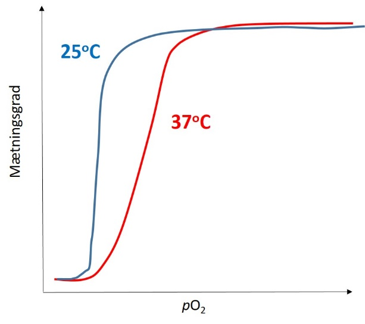
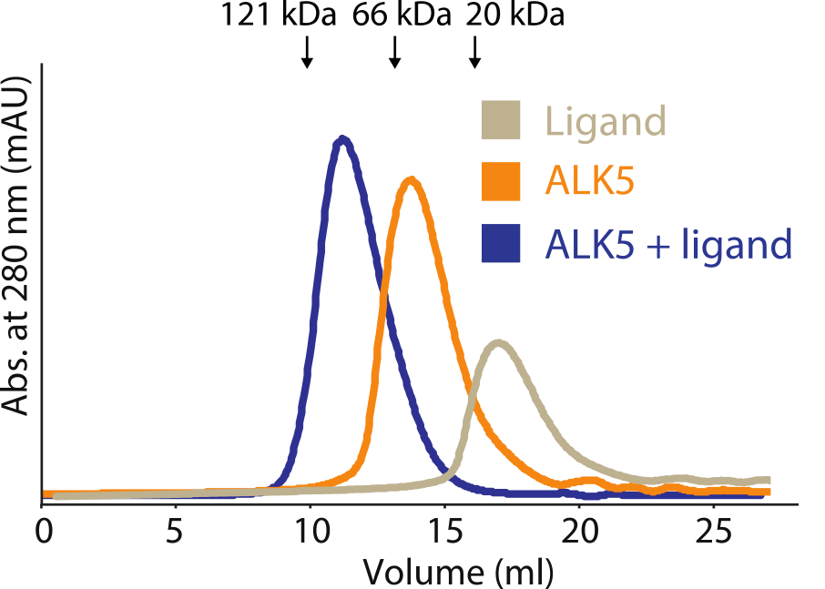
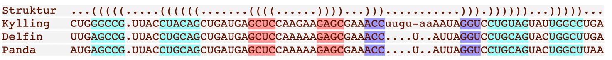
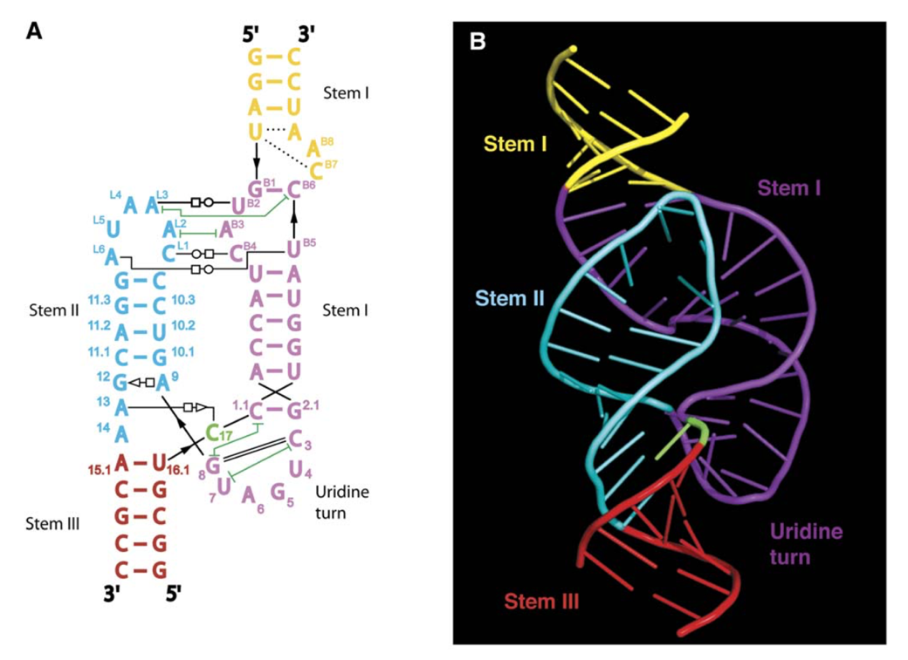
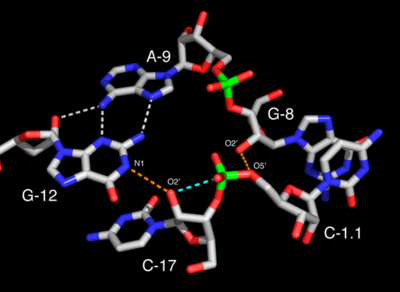
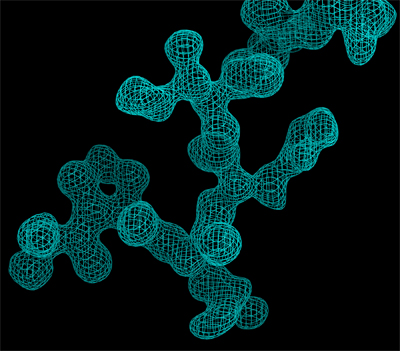
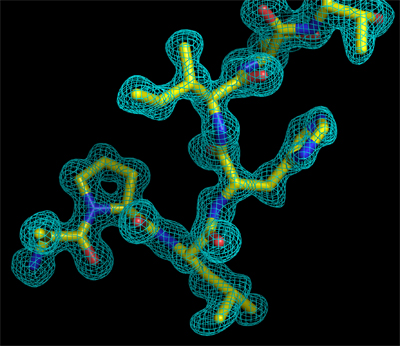
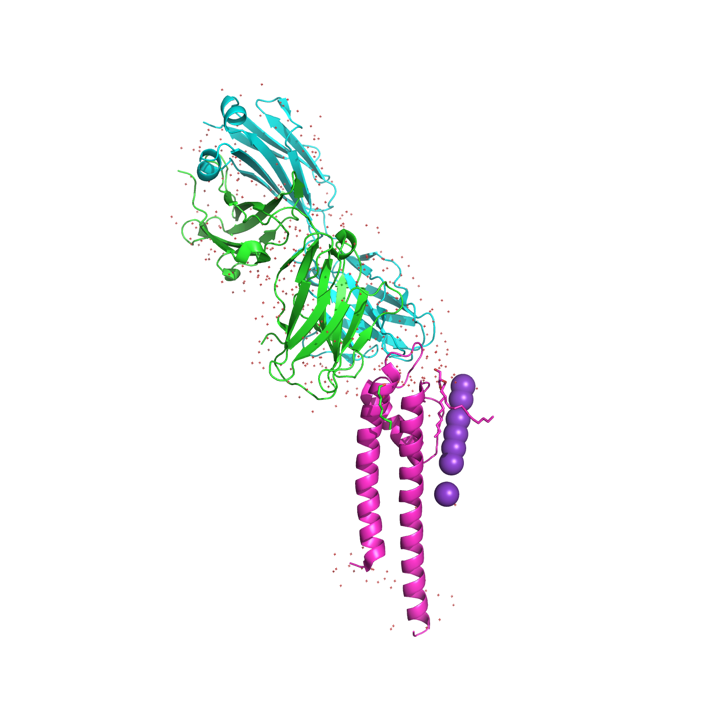
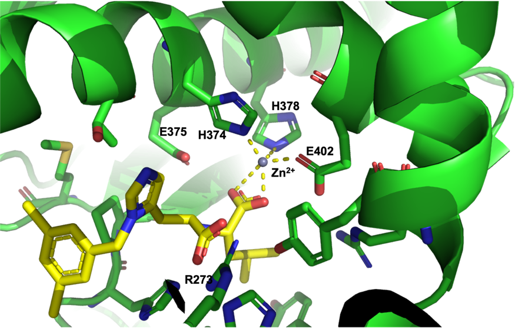
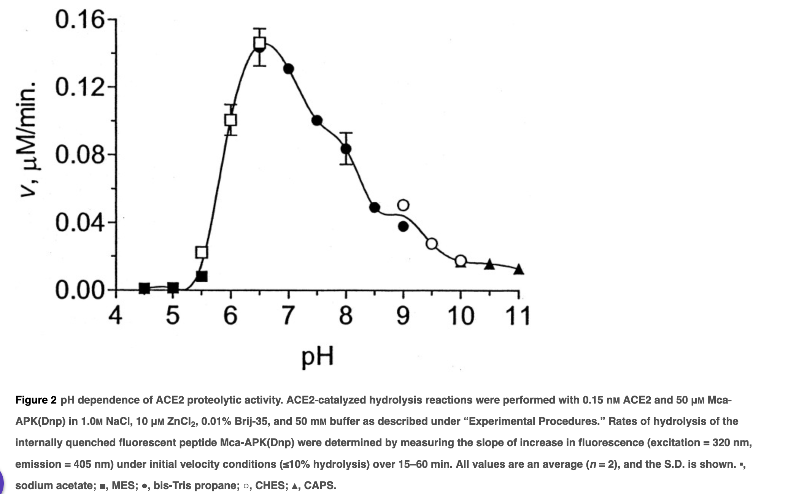

## Opgave 1

Hæmoglobin (Hb) transporterer ilt rundt i blodet, hvilket normalt
foregår ved 37°C. Når det er meget koldt, kan kropstemperaturen dog godt
falde til 25°C i fingre og fødder. Figuren nedenfor viser
iltbindingskurver for Hb ved de to forskellige temperaturer:

{.lightbox width="90%" fig-align="center"}

**Spørgsmål 1.** Beskriv forskellene på de to iltbindingskurver og
forklar baseret på hæmoglobins funktion i kroppen, hvad dette betyder
for afsætning af ilt i afkølet væv.

**Svar:** Iltbindingskurven er mere stejl ved lav temperatur og stiger
hurtigere ved en stigning i pO~2~. Kurven forskydes mod venstre ved
lavere temperatur, så proteinet ved en given iltkoncentration afgiver
mindre ilt.

**Spørgsmål 2.** Forklar hvad der må ske med den relative stabilitet af
R- og T-tilstandene for Hb ved 25°C i forhold til 37°C. Forklar desuden
hvordan kan temperaturændringen tænkes at påvirke parametrene *L* og *c*
som defineret i MWC-modellen.

**Svar:** Når kurven forskydes mod venstre ved 25°C må R-tilstanden
generelt blive mere favoriseret i forhold til T-tilstanden. L = \[T~0~\]
/ \[R~0~\] \>\>1 mens *c* = K~R~/K~T~ \<\< 1 og både L og c bidrager til
at ændre forholdet mellem T og R, da \[T~0~\] / \[R~0~\] = *c*^i^\*L.
Det er ikke til at sige på forhånd om L eller c påvirkes mest af
temperaturen men de kan begge tænkes at spille ind; det kunne finde sted
ved at L bliver lavere, og/eller at *c* bliver højere, ved lavere
temperatur.

Begrebet \"*carbon capture and storage*\" dækker over metoder til at
indfange CO~2~ fra luften og lagre det permanent i en stabil
forbindelse. Én mulighed er at anvende en opløsning af Ca^2+^-ioner, der
reagerer med opløst CO~2~ i form af carbonat (CO~3~^2-^) og danner
uopløseligt calciumcarbonat (kridt). Den samlede reaktion er som følger:

CO~2(g)~ ⇌ CO~2(aq)~

CO~2(aq)~ + H~2~O ⇌ H~2~CO~3~ ⇌ HCO~3~^-^ + H^+^ ⇌ CO~3~^2-^ + 2H^+^

Ca ^2+^ + CO~3~^2-^ ⇌ CaCO~3(s)~

Det hastighedsbegrænsende trin i denne proces er hydrering af CO~2(aq)~.

**Spørgsmål 3.** Hvilket trin gør denne proces irreversibel i praksis?
Hvilket enzym ville du anvende til at fremme dannelsen af kridt og
hvorfor er det nyttigt at anvende selvom processen er irreversibel?

**Svar:** Udfældningen af CaCO~3~ trækker ligevægten mod højre da der er
tale om en faseovergang fra vandig til fast fase. Carbonic anhydrase,
der omdanner CO~2~ til HCO~3~^-^ kan bruges til at fremme den samlede
proces; som enzym ændrer den ikke på ligevægten men den får det til at
forløbe hurtigere.

Sidekæderne Glu2 og Gln207 sidder tæt ved His64 i den rumlige struktur
af enzymet og mutationerne Glu2His og Gln207His øger aktiviteten af
enzymet betydeligt.

**Spørgsmål 4.** Hvilken egenskab ved histidin er ansvarlig for den
specielle rolle, His64 varetager i enzymet? Forklar ud fra dette hvordan
mutationerne kan bidrage til at øge enzymets aktivitet.

**Svar:** Det hastighedsbegrænsende trin for carbonic anhydrase
involverer at fjerne en proton fra vand (bundet til Zn^2+^) så den kan
reagere med CO~2~. Protonen fjernes i en "proton shuttle" ved at
overføres til His64, som så kan sende den videre til andre grupper. Den
neutrale pK~a~ (\~6) for His er vigtig for effektiviteten af denne
proces og da de to mutationer til His introducerer to yderligere
\"buffersidekæder\" kan de dermed tænkes at forøge aktiviteten ved at
tillade enzymet at komme af med protonerne mere effektivt.

## Opgave 2

ALK5 er en receptorkinase med en molekylevægt på 48 kDa. Deletion af de
sidste 35 aminosyrer i C-terminalen af ALK5 bevarer kinaseaktiviteten,
men inhiberer signalering.

**Spørgsmål 1.** Forklar hvorfor C-terminalen ikke er vigtig for
phosphoryleringsaktiviteten, men essentiel for signalfunktionen for
receptoren.

**Svar:** C-terminalen på mange receptorkinaser udgør ikke en del af
selve kinasedomænet og er dermed ikke vigtig for kinaseaktiviteten
(phosphoryleringsaktiviteten). Derimod er C-terminalen ofte et vigtigt
phosphoryleringssite som regulerer (og typisk aktiverer) signalering
nedstrøms i processen.

Overudtryk af PPP2R2A phosphatase inhiberer ALK5-signalering i humane
celler. I en cellelinje hvor ALK5 har mutation S411D inhiberer
overudtryk af PPP2R2A dog ikke ALK5 signalering.

**Spørgsmål 2.** Giv en forklaring på hvorfor overudtryk af PPP2R2A
inhiberer ALK5-signalering samt hvorfor der ikke ses inhibering i
ALK5-S411D varianten.

**Svar:** Serine 411 sidder i C-terminalen af ALK5 (48 kDa) og denne
rest er et vigtigt phosphoryleringssite som starter signalkaskaden. Når
PPP2R2A phosphatase overudtrykkes vil S411 dephosphoryleres og dermed
inhibere signalering. Mutationen som giver en aspartate i position 411
af ALK5 fungerer som en phosphor-mimic som sætter signaleringen i gang.
Det er en gain-of-function mutation og PPP2R2A phosphatase har derfor
ingen effekt.

Det lille molekyle *PepSox* inhiberer binding af ATP til ALK5.

**Spørgsmål 3.** Forklar hvorfor *PepSox* inhiberer ALK5-signalering og
hvorfor der ingen inhibering ses i cellelinjer der udtrykker ALK5-S411D
varianten.

**Svar:** PepSox blokerer ATP-binding til ALK5 kinasedomænet og
nedsætter derved phosphorylerings-aktiviteten som er essentiel for
signalering. Men da S411D allerede er aktiveret og dermed uafhængig af
ALK5 har PepSox har ingen effekt på denne variant.

Oprenset ALK5 analyseres kromatografisk via gelfiltrering. På søjlen
injiceres enten: ALK5, ligand (molekylevægt 3 kDa), eller kompleks af
ALK5 + ligand. Der injiceres ligeledes tre proteiner med kendte
molekylevægte på 20, 66 og 121 kDa som standarder for at kalibrere
søjlen.

{.lightbox width="90%" fig-align="center"}

**Spørgsmål 4.** Forklar hvad eksperimentet viser og foreslå en
aktiveringsmekanisme for ALK5 baseret på dette resultat.

**Svar:** Eksperimentet viser at ALK5 binder liganden, da ALK5+ligand
eluerer tidligere (større tilsyneladende MW) end ALK5 alene. Det store
skift kan ikke forklares med en øget vægt af på blot 3 kDa, så derfor må
liganden inducere multimerisering af ALK5. Dimerisering af receptor
kinaser er en kendt aktiveringsmekanisme og det er dermed en meget
sandsynlig del af aktiveringsmekanismen af ALK5.

## Opgave 3

Hammerhead-ribozymet er en RNA-struktur, der katalyserer kløvning af sig
selv. Det blev oprindeligt opdaget i en RNA viroider i planter, men er
siden blevet fundet i alle livets domæner. Nedenfor ses et alignment af
Hammerhead-ribozymet fra tre arter, der viser tre helix-regioner
markeret i cyan, rød og lilla:

{.lightbox width="90%" fig-align="center"}

**Spørgsmål 1.** Identificér en position i alignment, der viser
co-variation, der bevarer basepar.

**Svar:** Position 1 i cyan stem ser vi G-C og A-U basepar co-variation.
Position 8 i cyan stem ser vi G-C og A-U basepar co-variation. Ok, bare
at nævne én af ovenstående.

Strukturen af hammerhead-ribozymet er blevet løst med
røntgenkrystallografi og ses nedenfor:

{.lightbox width="90%" fig-align="center"}

**Spørgsmål 2.** Hvad man kalder interaktionen mellem loopet i stem II
og bulge i stem I og hvilke non-Watson-Crick basepar indgår i denne
interaktion? Hvad man kalder forgreningen mellem stem I, II og III og
hvilke non-Watson-Crick basepar er involveret i stabilisering af dette
motiv?

**Svar:**\
Pseudoknude (A~L3~-U~B2~ tWH, C~L1~-C~B4~ tWH, A~L6~-U~B5~ tWH).\
3-way junction (A13-C17 tHS, A9-G12 tHS).

**Spørgsmål 3.** Hent strukturen med PDB ID **3ZD5** i PyMOL og beskriv
konformationen af følgende basepar: U6-A28, C8-C26 og U13-A31. Du skal
angive hvilke kanter af baserne der interagerer og om de er i *cis-*
eller *trans*-konformation.

**Svar:**

U6-A28 tWH trans-Watson-Crick-Högsteen

C8-C26 tWW trans-Watson-Crick-Watson-Crick

U13-A31 tWH trans-Watson-Crick-Högsteen

Figuren herunder viser det aktive site i hammerhead-ribozymet.

{.lightbox width="90%" fig-align="center"}

**Spørgsmål 4.** Hvilken rolle spiller 2\'-hydroxylgruppen på C-17 for
reaktionsmekanismen? Hvor bliver RNA strengen kløvet og hvad er
produktet af reaktionen?

**Svar:** 2\'-hydroxylgruppen udfører et nukleofilt angreb på
fosforylgruppen. Kløvningen sker mellem C-17 og C-1.1. Produkterne vil
være C-17 med cyklisk fosfat og C-1.1 med 5\'-OH.

## Opgave 4

**Spørgsmål 1.** Beskriv fordele og ulemper ved røntgenkrystallografi og
cryo-elektronmikroskopi (cryo-EM) som metoder til at bestemme
proteinstrukturer.

**Svar:** Røntgenkrystallografi er velegnet til at bestemme atomare
detaljer, herunder atompositioner og bindinger, men kræver meget rent
protein og krystaller, hvilket kan være udfordrende at opnå for nogle
proteiner. Oftest opnås kun strukturen af den mest almindelige tilstand
af proteinet.

Cryo-elektronmikroskopi (cryo-EM) er velegnet til at studere store
komplekser og membranproteiner i deres naturlige tilstand. Det kræver
ikke krystallisation, men ofte skal man gennem omfattende
prøveoptimering før en struktur opnås. Cryo-EM har dog ofte en lavere
opløsning sammenlignet med røntgenkrystallografi, til gengæld kan man
nogle gange være heldig at kunne løse flere konformationer fra én
dataopsamling.

Til strukturbestemmelse af en bakteriel K^+^-kanal har forskere oprenset
og krystalliseret proteinet, derefter indsamlet røntgendiffraktionsdata
og beregnet et elektrontæthedskort, hvoraf et udsnit vises nedenfor.

{.lightbox width="90%" fig-align="center"}

**Spørgsmål 2.** Beskriv foldningen af peptidkæden, der observeres,
herunder om der ses tegn på sekundær struktur og kom med forslag til
hvilke fire aminosyrer, der ses på udsnittet. Forklar endeligt hvordan
kædens retning (N- til C-terminal) kan bestemmes ud fra tætheden.

**Svar:** Der ses ikke nogen tydelig sekundær struktur (ingen
H-bindinger mellem hovedkædens atomer. Sekvensen er Pro-Leu-His-Ile
(nede fra venstre og op mod højre), hvilket ses af sidekædetæthed og
positionen af carbonylgrupper:

{.lightbox width="90%" fig-align="center"}

For at løse strukturen har forskerne brugt et Fab-fragment til at
stabilisere K^+^-kanalen under krystallisation. Strukturen indeholdende
både Fab-fragment og K+-kanal findes i PDB med ID **1K4C**.

{.lightbox width="90%" fig-align="center"}**Spørgsmål 3.** Forklar først hvad et
Fab-fragment er og hvorfor det kan bruges til at stabilisere strukturen
af K^+^-kanalen. Hent dernæst **1K4C** i PyMOL og gør rede for hvilke
domæner Fab-fragmentet og K^+^-kanalen indeholder samt hvilke
peptidkæder, der indgår i de to molekyler.

Svar: Et Fab-fragment er den epitopbindende del af et antistof, der
binder med meget høj affinitet til target og dermed stabiliserer dette.
I figuren til højre ses Fab-fragmentet og dets to IgG-domæner øverst i
grøn og cyan (kæderne A og B) mens K+-kanalen vises nederst med dens
transmembrane helicer (magenta, kæde C) og K^+^-ioner (lilla kugler).
Solventmolekyler er vist med små, røde kugler.

Strukturen indeholdt i **1K4C** repræsenterer kun en del af en intakt
K^+^-kanal.

**Spørgsmål 4.** Forklar hvordan strukturen af den intakte K^+^-kanal
relaterer sig til **1K4C**, herunder den oligomere tilstand af
K+-kanalen. Angiv desuden en PyMOL-kommando, der kan bruges til at
generere strukturen af den komplette kanal.

**Svar:** Den intakte struktur er en tetramer med fire kopier svarende
til den i 1K4C. Man kan bruge kommandoen \"symexp\", f.eks.

symexp sym, 1k4c, all, 1

til a generere den intakte kanal. Cut-off-værdien 1 kan justeres så der
ikke kommer for mange symmetrirelaterede molekyler frem.

## Opgave 5

*Angiotensin converting enzyme II* (ACE2) er en membranbundet
carboxypeptidase med en enkelt transmembran helix, der kløver den
C-terminale aminosyre af angiotensin og andre peptidhormoner. Nedenfor
er vist sekvensen af de 105 C-terminale aminosyrerester:

710 720 730 740 750 760

EKAIRMSRSR INDAFRLNDN SLEFLGIQPT LGPPNQPPVS IWLIVFGVVM GVIVVGIVIL

770 780 790 800

IFTGIRDRKK KNKARSGENP YASIDISKGE NNPGFQNTDD VQTSF

**Spørgsmål 1.** Angiv baseret på din viden om aminosyrernes egenskaber
sekvensnummeret på første og sidste aminosyrerest i den transmembrane
helix.

**Svar:** Fra position 741 til position er 762 er alle aminosyrer enten
hydrophobe eller glycin.

Figuren nedenfor viser krystalstrukturen (PDB ID **1R4L**) af ACE2 i
kompleks med en inhibitor ved pH 7.5. ACE2 er vist som grøn cartoon og
sidekæder tættere på inhibitoren end 4 Å er vist som sticks. Inhibitoren
er gul og vist som sticks. Den grå kugle er en zinkion, som er essentiel
for aktiviteten af ACE2.

{.lightbox width="90%" fig-align="center"}

**Spørgsmål 2.** Skriv et PyMOL-script der genererer figuren (uden
labels). Besvarelsen skal indeholde scriptet og det genererede billede.

Svar:

reinitialize

fetch 1r4l

bg_color white

create ace2, /1r4l/A/A/

create inh , /1r4l//A/804

create zn , /1r4l//A/803

hide everything

show cartoon , ace2

sele site , byres ace2 within 4 of (inh or zn)

show sticks , site

show sticks , inh

color atomic , inh

color yellow , inh and (name C\*)

show nb_sphere , zn

disable site

dist d1 , zn , /ace2///374/NE2

dist d2 , zn , /ace2///378/NE2

dist d1 , zn , /ace2///402/OE1

dist d1 , zn , inh and name O3

dist d1 , zn , inh and name O1

hide label

set_view (\\

-0.511080444, 0.469967574, 0.719666958,\\

-0.268850386, 0.707856596, -0.653186321,\\

-0.816398442, -0.527315080, -0.235424638,\\

0.000431454, 0.000018352, -52.446437836,\\

41.039585114, 9.280475616, 24.158460617,\\

40.646018982, 64.242721558, -20.000000000 )

Tabellen nedenfor viser aktiviteten af ACE2 på forskellige
peptidsubstrater, hvor ↓ angiver kløvningspunkterne og kolonnen
\"Hydrolyse\" angiver N: ingen hydrolyse, P: partiel hydrolyse, K:
komplet hydrolyse.

  ---------------------------------------------------------
  **Substrat**            **Sekvens**       **Hydrolyse**
  ----------------------- ----------------- ---------------
  Angiotensin I           DRVYIHPFH↓L       P

  Angiotensin 1--9        DRVYIHPFH         N

  Angiotensin II          DRVYIHP↓F         K

  Apelin-13               QRPRLSHKGPMP↓F    K

  Bradykinin              RPPGFSPFR         N

  des-Arg^9^-bradykinin   RPPGFSP↓F         K

  Bradykinin fragment     RPPGFSP           N
  1--7                                      

  β-Casomorphin           YPFVEP↓I          K

  Dynorphin A 1--13       YGGFLRRIRPKL↓K    K

                                            

  Neurotensin 1--8        pE-LYENKP↓R       P
  ---------------------------------------------------------

**Spørgsmål 3.** Beskriv specificiteten af S1\'-sitet i ACE2.

**Svar:** I alle de tilfælde hvor der sker kløvning, enten partiel eller
fuldstændig, er den C-terminale aminosyre stor og hydrofob, eller også
er det arginin eller lysin. S1\' må derfor have en hydrofob lomme som
kan binde en stor aminosyre eller den alifatiske del af lysine og
arginine.

Figuren nedenfor viser aktiviteten af ACE2 sum funktion af pH.

{.lightbox width="90%" fig-align="center"}

**Spørgsmål 4.** Angiv den mest sandsynlige forklaring på hvorfor ACE2
mister aktivitet ved lav pH.

**Svar:** Når pH falder vil de to histidiner, H373 og H378 blive
positivt ladede pga. protonering og dermed ikke længere kunne interagere
favorabelt med den positivt ladede zinkion. Ionen mistes ved lavere pH
og dermed funktionen.
