## Opgave 1

Glucagon-like peptide-1 (GLP-1) er et peptid-hormon, der spiller en
central rolle i at regulere appetit og metabolisme. Det binder til GLP-1
receptor i plasmamembranen og aktiverer signaltransduktion via G
proteiner, som det ses på figuren herunder.

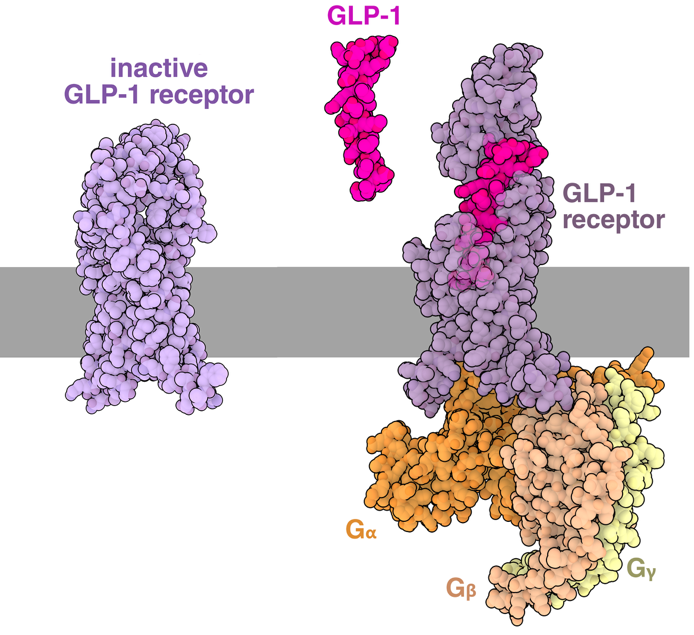{.lightbox width="90%" fig-align="center"}

**Spørgsmål 1.** Lav et PyMOL script der sammenligner inaktiv receptor
(PDB 6LN2) med GLP-1 bundet receptor (PDB 6X18) ved at lave en
strukturel alignment. Vis kun selve receptor proteinet og ligand
(gem/fjern FAB-fragment og G-proteiner) og farvelæg GLP-1 i rød. Svaret
skal indeholde script og resulterende billede.

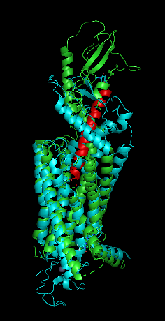{.lightbox width="90%" fig-align="center"}

Svar:

reinit

fetch 6X18

fetch 6LN2

align 6X18, 6LN2

hide everything, chain B & 6LN2

hide everything, chain C & 6LN2

hide everything, chain A & 6X18

hide everything, chain B & 6X18

hide everything, chain G & 6X18

hide everything, chain N & 6X18

color red, chain P & 6X18

**Spørgsmål 2.** Beskriv hvordan GLP-1 binder til GLP-1 receptoren både
på overordnet niveau og med inddragelse af mindst to forskellige
sidekæde-interaktioner. Hvordan fører denne binding til
konformationsændring og signaltransduktion?

Svar:

For at beskrive GLP-1s binding til GLP-1 receptor selekteres GLP-1 og
der bruges "Find polar contacts to other atoms in object". Overordnet
kan man se at GLP-1 binder med ene ende imellem 7TM alfa-helixer og med
anden ende til N-term domæne. Specifikke interaktioner er f.eks. GLP-1
N-term HIS\`7 til GLP-1 receptor GLN\`234 og GLP-1 C-term VAL\`33 til
GLP-1 receptor ARG\`121.

Beskrivelse af konformationsændring: GLP-1 binding åbner ekstracellulære
domæne og interagerer i det transmembrane domæne. Dette fører til en
konformationsændring i det intracellulære domæne, som kan tillade
binding af G-proteiner og aktivering af G protein gennem frigørelse af
GDP og binding af GTP. Det fører i anden omgang til aktivering af
adenylyl cyclase, der producerer second messenger cyclic AMP. 

GLP-1s effekt på mæthedsfølelse er midlertidig, da GLP-1 bliver nedbrudt
indenfor få minutter i kroppen af proteaser. Muligheden for at forlænge
effekten (T~1/2~=2.5 timer) blev oprindeligt opdaget i spyt fra
Gliaøglen, der udskiller Extendin-4, der er en GLP-1 receptor agonist.
Herunder vises en Clustal Omega alignment mellem de to peptider, hvor
trekant viser hvor dipeptidyl peptidase-4 (DPP-4) kløver GLP-1.

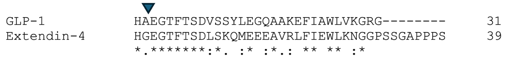{.lightbox width="90%" fig-align="center"}

**Spørgsmål 3.** Beregn identitetsscore for hele peptidet og
similaritetsscore for de første 10 positioner i alignment og diskutér
ihht. din strukturelle analyse fra spørgsmål 1, hvordan Extendin-4
forlænger effekten.

Svar:

Identitetsscore = 16/(15+16) = 52%

Tabel i figur 10.7 i Berg 10 viser Blosum-62 substitutionsmatricen, der
bruges til at finde similaritetsscore.

Similaritetsscore = 8+0+5+6+5+6+5+4+6+1 = 46

Der er en mutation i kløvningssite, hvilket medfører at Extendin-4 ikke
bliver nedbrudt af DPP-4. Som vi så i den tidligere strukturelle analyse
var N-term vigtig for binding.

Vægttabsmedicin som Wegovy (semaglutid) er baseret på GLP-1 med
substitutioner og modifikationer (se figur herunder), der gør det mere
resistent mod proteolytisk kløvning og forsinker udskillelse fra
kroppen, hvilket gør at man kun skal tage en dosis en gang om ugen.

{.lightbox width="90%" fig-align="center"}

**Semaglutid**

**Spørgsmål 4.** Undersøg semaglutid-bundet receptor (PDB 7KI0) ved at
aligne den til GLP-1-bundet receptor (PDB 6X18). Er der forskel i
bindingen til receptoren og hvilke forskelle mellem GLP-1 og semaglutid
fører til den forlængede medicinske effekt af semaglutid?

Svar: Konformationen af GLP-1-bundet receptor ændrer sig ikke
signifikant. Der er igen mutationer/modifikationer, der hæmmer DPP-4
kløvning. Der er desuden en lang sidekæde midt i peptidet (Lys-20), der
binder til blodproteinet albumin og forlænger blodcirkulation, hvilket
er beskrevet i Berg 10. udgave kapitel 32.

## Opgave 2

Ribozymet ribonuclease P (RNase P) kløver pre-tRNA for at danne en
korrekt 5' ende på tRNAet. I figur 1A herunder vises RNase P fra
bakterier, der består af et RNA (rød) og et protein (blå), der binder
til tRNA (gul). Figur 1B viser den sekundære struktur af RNase P RNA.

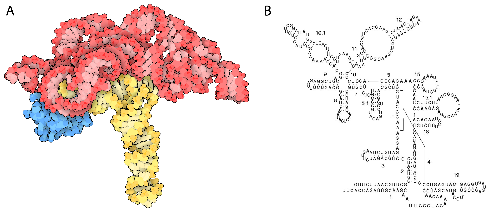{.lightbox width="90%" fig-align="center"}

**Figur 1.** (A) Kvarternær struktur af RNase P med bundet tRNA. (B)
Sekundær struktur af RNase P RNA.

**Spørgsmål 1.** Beskriv hvilke rekombinante teknikker man kan bruge til
at oprense komplekset mellem RNase P og tRNA fra *E. coli* celler. Brug
krystalstrukturen (PDB 3Q1Q) til at underbygge dit forslag.

Svar: Jeg vil umiddelbart bruge et His-tag på proteinet. Ved at kigge på
krystalstrukturen (PDB 3Q1Q) kan jeg se at C-terminal er mere
tilgængelig end N-terminal, så jeg vil sætte mit His-tag på
C-terminalen. Til affinitetsoprensning bruges Ni-NTA søjle og der
elueres med imidazol.

Alternativt kan man forlænge RNA I 3'-ende med et sekvens-tag, der så
kan oprenses på magnetiske Steptavidin-beads med bundet biotin-oligo.
Her kan ubundet RNA fjernes med magnetisk separation. RNA kan elueres
med DNA strand displacement.

Andre fornuftige forslag til oprensning godtages også.

**Spørgsmål 2.** Beskriv hvordan tRNA binder til RNase P i
krystalstrukturen (PDB 3Q1Q) og om der er tale om specifik eller
ikke-specifik binding. Hint: Hvilken interaktion er der imellem tRNA-G19
og RNase P-A112, imellem tRNA-C85 og RNase P-G263 og imellem
tRNA-G63-C71 og RNase P-A207?

Svar: Det er generelt uspecifik binding, da interaktioner er via
stacking og backbone interaktioner -- undtagen tRNA 3'-ende hvor der er
specifikke basepar.\
tRNA-G19 og RNaseP-A112 er stacking interaktion.\
tRNA-C85 og RNaseP-G263 er WCF basepar.\
tRNA-G63-C71 og RNase P-A207 er A-minor interaction.

RNase P er lige som ribosomet bevaret i hele livets træ, hvilket
understreger den vigtige rolle i dannelsen af tRNA til proteinsyntese.

**Spørgsmål 3.** Optegn stem med basepar for pseudoknuden i RNase P via
den sekundære struktur, der er vist i figur 1B, og find
basepar-bevarende kovariationer i nedenstående alignment, hvor kun
pseudoknuden er vist.

Position i 3Q1Q: 50 330

\| \|

Basepar:
\_\_\_\_\_\_\_\_\_\[\[.\[\[\[\[\[\_\_\_\_\_\_\_\_\_\]\]\]\]\]\]\]\_\_\_\_\_\_\_\_\_

Sekvens_3Q1Q:
\_\_\_\_\_\_\_\_\_AGUCCAUG\_\_\_\_\_\_\_\_\_CAUGGCU\_\_\_\_\_\_\_\_\_

Sekvens_1:
\_\_\_\_\_\_\_\_\_AGUCCGGA\_\_\_\_\_\_\_\_\_UCCGGCU\_\_\_\_\_\_\_\_\_

Sekvens_2:
\_\_\_\_\_\_\_\_\_AGUCCGGG\_\_\_\_\_\_\_\_\_CCCGGCU\_\_\_\_\_\_\_\_\_

Sekvens_3:
\_\_\_\_\_\_\_\_\_AGUCCAGG\_\_\_\_\_\_\_\_\_CCUGGCU\_\_\_\_\_\_\_\_\_

Svar:

5'-AAGUCCAUG-3'

\|\|\| \|\|\|\|\|

3'-UUC-GGUAC-5'

Kovariationer: G-A55 og C-U226, G-U56 og C-A225, A-G57 og U-C224.

RNA fra bakterie RNase P bevarer den katalytiske aktivitet og kløver
5'-ende af tRNA i fravær af protein-subunit dvs. det er et ribozym.
Desuden er U52-bulge i pseudoknot universelt bevaret og er placeret i
active site, der faciliterer kløvning at tRNA mellem position -1 og +1.

Brug følgende script til at vise pseudoknudens rolle i active site:

reinit

fetch 3Q1Q

hide everything

util.cbaw chain B

util.cbay chain C

show sticks, resi 50-57+322-330 & chain B

show sticks, resi 1-2 & chain C

show nb_spheres, resi 903

zoom visible

dist resi 903, 3q1q, mode=2

hide labels

**Spørgsmål 4.** Hvilken rolle spiller U52 i active site og hvad gør
katalysen mulig? Hvilken kemisk reaktion har ribozymet udført for at
danne den korrekte 5'-ende på tRNAet?

Svar:\
Active site indeholder Mg ion (MG903). Som i andre ribozymer må man
antage at en OH gruppe har lavet en S~N~2-type nukleofilt angreb på
fosfat-rygrad katalyseret af Mg ioner.

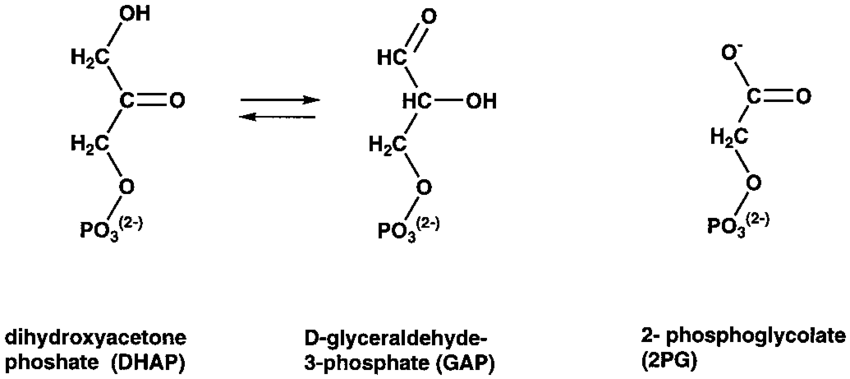{.lightbox width="90%" fig-align="center"}

## Opgave 3

Enzymet triose fosfat isomerase (TPI) katalyserer omdannelse af
glyceraldehyde 3-fosfat (GAP) til di-hydroxyacetone fosfat (DHAP)
(bemærk det står i den anden rækkefølge i skemaet til højre).

Enzymet glycerol-3-fosfat dehydrogenase (G3PDH) reducerer efterfølgende
DHAP til glycerol-3-fosfat samtidig med at cofactoren NADH omdannes til
NAD^+^.

Absorptionsspektrene for 10 mM GAP, DHAP, NADH og NAD^+^ er vist
nedenunder.

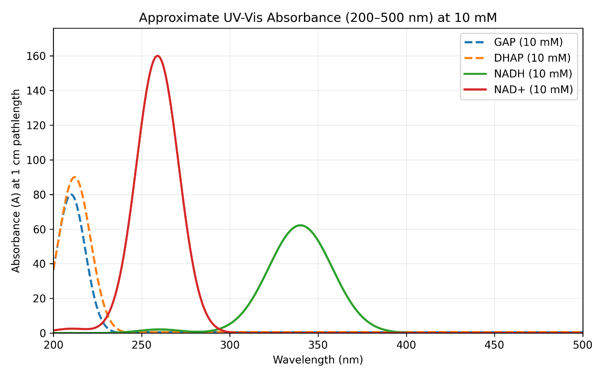{.lightbox width="90%" fig-align="center"}

**Spørgsmål 1.** Hvorfor er det nødvendigt at bruge G3PDH for at måle
TPI's aktivitet og hvilken bølgelængde ville du anvende til dine
målinger? Hvad kaldes denne type assay?

Svar: Der er ingen væsentlig ændring i absorption når GAP omdannes til
DHAP, men der er kæmpe forskel i absorptionen af NADH og NAD^+^. Der er
tale om en koblet assay. Det er bedst at måle ved omkring 260 nm, hvor
der sker en stigning i signal fra niveau nul. Ved ca. 340 nm sker der et
fald, men udgangspunktet er et højt signal; forslag om 340 nm vil dog
også blive godtaget.

**Spørgsmål 2.** TPI udfolder med et smeltepunkt omkring 40°C. Nu skal
vi udvikle TPI til at blive mere varmestabil. Vi genererer mange
forskellige varianter som vi tester i vores assay ved hhv. 50, 60 og
70°C. Flere af vores varianter giver et positivt signal i assayet ved 50
og i mindre grad 60°C, men ingen giver signal ved 70°C. Når vi oprenser
disse TPI varianter, viser det sig dog at de har et smeltepunkt omkring
80°C. Giv en mulig forklaring på det manglende signal ved 70°C og
foreslå hvordan du vil bevise det.

Svar: Eftersom det er en koblet assay, kræver det også at G3PDH er
aktiv. Det er muligt at G3PDH udfolder omkring 60°C. Det kan man
undersøge ved at måle dens struktur som funktion af temperatur på samme
måde som man følger TPIs udfoldning som funktion af temperatur. Jf. fig.
2.54 i Berg 10. udgave (dog bare med varme).

Vi bruger nu det koblede assay (ved 30°C) og screener en masse
forskellige stoffer for deres evne til at inhibere TPI. Vi identificerer
bl.a. to hits:

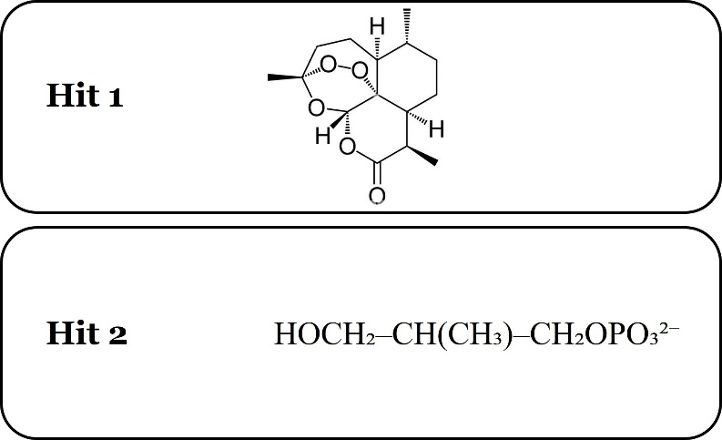{.lightbox width="90%" fig-align="center"}

**Spørgsmål 3.** Diskuter hvilken ADME profil disse to stoffer har,
d.v.s. hvordan de generelt kan tænkes at opføre sig i kroppen ved
indtag.

Svar: Det er et lidt åbent spørgsmål, men det perfekte svar vil gå ind
på nedenstående. (Men jeg vil være meget åben overfor kortere udgaver.
Som minimum skal besvarelsen dog forholde sig til Lipinskis regel og de
to stoffers forskellighed i distribution, metabolisme og udskillelse
udfra deres forskellige fysiske egenskaber.

**Forbindelse 1: HOCH₂--CH(CH₃)--CH₂OPO₃²⁻ (modificeret triosefosfat)**

- **Absorption:**\
  Denne forbindelse er meget polær på grund af fosfatgruppen og flere
  hydroxylgrupper, hvilket giver en meget lav log(P). Den overtræder
  Lipinskis regel om polaritet og hydrogenbinding (mange
  donorer/acceptorer), så oral absorption forventes at være ekstremt
  dårlig. Den vil sandsynligvis kræve aktiv transport (f.eks. via
  fosfattransportere) eller parenteral administration.

- **Distribution:**\
  På grund af sin stærke negative ladning og hydrofilicitet vil den
  forblive i vandige rum og ikke krydse lipidmembraner let. Den vil ikke
  trænge gennem blod-hjerne-barrieren og vil ikke binde sig væsentligt
  til hydrofobe plasmaproteiner som albumin.

- **Metabolisme:**\
  Forbindelsen ligner en endogent metabolit, så den kan indgå i
  glykolytiske veje frem for at gennemgå xenobiotisk metabolisme. Den
  vil sandsynligvis ikke blive oxideret af cytochrom P450-enzymer, men
  kan blive defosforyleret af fosfataser.

- **Udskillelse:**\
  Høj polaritet og lille størrelse favoriserer renal clearance. Den vil
  blive filtreret i glomeruli og hurtigt udskilt, medmindre den
  reabsorberes af specifikke transportere. Halveringstiden vil være
  kort.

**Forbindelse 2: Artemisinin (sesquiterpen-lakton med peroxidbro)**

- **Absorption:**\
  Artemisinin er relativt upolær med få
  hydrogenbindingsdonorer/-acceptorer og moderat molekylvægt (\~282 Da).
  Den opfylder Lipinskis regler, så oral absorption er god. Dens
  lipofilicitet fremmer membranpermeabilitet.

- **Distribution:**\
  Den lipofile natur fremmer bred vævsdistribution og stærk binding til
  plasmaproteiner (albumin). Den kan krydse cellemembraner og delvist
  trænge gennem blod-hjerne-barrieren, hvilket er relevant for
  behandling af cerebral malaria.

- **Metabolisme:**\
  Artemisinin gennemgår omfattende fase I-metabolisme i leveren, primært
  via cytochrom P450-enzymer (oxidation og spaltning af peroxidbroen).
  Fase II-konjugation (f.eks. glukuronidering) følger, hvilket øger
  vandopløseligheden for udskillelse.

- **Udskillelse:**\
  Metabolitter udskilles primært via urin og galde. Enterohepatisk
  recirkulation kan forekomme og forlænge halveringstiden. Moderstoffet
  er mindre polært, så metabolisme er afgørende for clearance.

Sammenligningstabel:

  ----------------------------------------------------------------------
  **Egenskab**   **HOCH₂--CH(CH₃)--CH₂OPO₃²⁻**   **Artemisinin**
  -------------- ------------------------------- -----------------------
  Absorption     Meget dårlig (polær, ladet)     God (lipofil)

  Distribution   Kun vandige rum                 Bred, proteinbundet

  Metabolisme    Minimal (defosforylering)       Omfattende
                                                 (P450-oxidation)

  Udskillelse    Hurtig renal clearance          Metabolitter via
                                                 urin/galde
  ----------------------------------------------------------------------

Nu måles Michaelis-Menten kinetik på TPI som giver flg.
reaktionshastigheder (målt i µM/s):

  ------------------------------------------
   \[S\]    v₀ (ingen    v (stof  v (stof B)
   (mM)     inhibitor)      A)    
  ------- -------------- -------- ----------
   0,05        6,23        2,54      1,56

    0,1       11,52        4,92      2,88

   0,25       23,46       11,21      5,86

    0,5       35,85       19,54      8,96

     1        48,72       31,09     12,18

     2        59,38       44,12     14,84

     4        66,67       55,83     16,67

     8        71,03       64,37     17,76

    10        71,97       66,41     17,99
  ------------------------------------------

Excel fil med data er vedhæftet.

Bemærk at stof A og stof B ikke nødvendigvis svarer til hhv. Hit1 og
Hit2!

**Spørgsmål 4.** Analysér data grafisk for at bestemme hvorvidt stof A
svarer til Hit 1 og stof B til Hit 2 eller omvendt. Begrund dit svar
omhyggeligt!

Svar: Jeg har udregnet disse tal på basis af følgende:

vmax = 76 µM/s, K~M~ = 0,56 mM, Substrat koncentrationer: 0,05-10 mM.

Stof A (hit 1): Kompetitiv inhibitor med K(I) 5 mM og koncentration 7,9
mM.

Stof B (hit 2): Nonkompetitiv inhibitor med K(I) 1 mM og koncentration 3
mM.

Stof A er kompetitiv og må være hit 2 som jo ligner substratet, hvorimod
stof B er nonkompetitiv og må derfor være hit 1 (artemisinin!) som
binder et helt andet sted.

**\**

## Opgave 4

En forskningsgruppe har bestemt strukturen af et 250 kDa proteinkompleks
med cryo-EM single particle analysis. Under 3D-klassificering opdagede
de at komplekset eksisterer i **tre forskellige konformationer.**
Partiklerne blev sorteret *in silico* i tre separate sub-datasets, hver
svarende til én konformation.

**Dataset info:**

- **Total antal partikler:** 720.000

- **Class 1:** 420.000 partikler

- **Class 2:** 215.000 partikler

- **Class 3:** 85.000 partikler

Efter 3D-rekonstruktion blev følgende Fourier Shell Correlation
(FSC)-kurver beregnet fra to uafhængige half-maps for hver konformation:

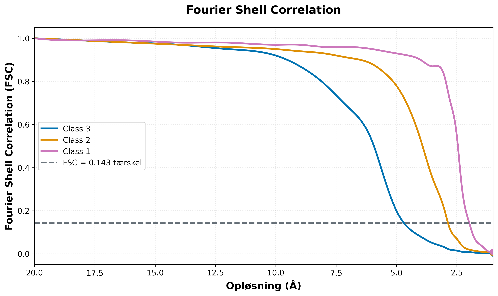{.lightbox width="90%" fig-align="center"}

**Figur 1.** FSC-kurver for de tre konformationsklasser.

**Spørgsmål 1.** Aflæs de tre circa opløsninger fra FSC-kurverne (Class
1, 2, og 3). Beskriv sammenhængen mellem antal partikler og opløsning
for de tre klasser i dette eksempel.

Svar:

**a) Opløsninger: FSC kurverne krydser 0,143 cutoff ca. ved:**

- Class 1: \~2,0 Å

- Class 2: \~2,9 Å

- Class 3: \~4,7 Å

**b) Sammenhæng:** Der er en klar sammenhæng mellem antal partikler og
opløsning i dette eksempel. Class 1 med flest partikler (420.000) opnår
den bedste opløsning, mens Class 3 med færrest partikler (85.000) har
den dårligste opløsning. Dette skyldes at flere partikler giver et bedre
signal-to-noise ratio, hvilket forbedrer kvaliteten af den endelige
3D-rekonstruktion.

Det er dog vigtigt at understrege at opløsningen ikke udelukkende
bestemmes af antallet af partikler. Andre faktorer spiller også en
rolle. For eksempel kan Class 3 repræsentere en mere fleksibel eller
heterogen konformation af komplekset, hvilket ville gøre det sværere at
opnå høj opløsning selv med flere partikler. Preferred orientation
problemer, hvor partiklerne foretrækker at ligge i bestemte
orienteringer på grid\'et, kan også begrænse opløsningen. Derudover kan
nogle konformationer simpelthen være mere strukturelt uordnede end
andre.

**Spørgsmål 2.**

a\) 3D kort fra de tre rekonstruktioner er vist i figur 2 nedenfor.
Beskriv for hvert 3D kort (A, B, C) hvilken strukturel information
kortet tillader at modellere. Den viste struktur er ens i figur 2, men
opløsningen af densitetskortene er forskellig.

b\) Tilorden de tre kort (A, B, C) til de tre konformationsklasser
(Class 1, 2, 3) fra Figur 1. Begrund dit valg.

Svar:

a\) I kort A ses kun den overordnede helical form som en svag, diffus
\"rør\" af density. Backbonen kan dårligt nok ses, og der er ingen
information om sidekæder. Dette er karakteristisk for lav opløsning hvor
kun den groveste strukturelle information er tilgængelig.

I kort B er både backbone og sidekæder meget skarpt definerede. Man kan
tydeligt se individuelle sidekæder stikke ud fra backbonen, og selv små
features som carbonyl-oxygen atomer (de små udkrængninger vinkelret på
helix-aksen) er synlige, hvilket er karakteristisk for høj opløsning.

Kort C viser tydeligt backbonen som en spiral struktur, hvilket viser at
sekundærstruktur er synlig og kan tilordnes med stor sikkerhed. Man kan
se densitet for de fleste sidekæder, men carbonyler og vandmolekyler har
ikke klart defineret densitet, hvilket er karakteristisk for ca 3Å
opløsning.

b\) Kort B matcher Class 1, kort C matcher Class 2, og kort A matcher
Class 3.

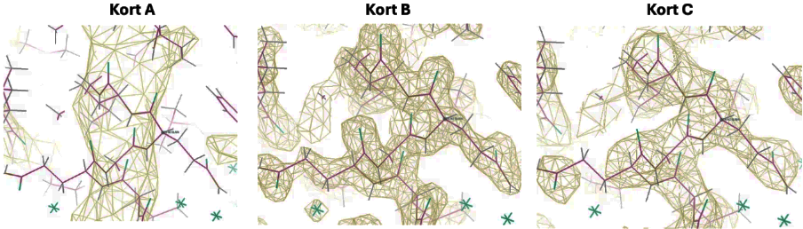{.lightbox width="90%" fig-align="center"}

**Figur 2.** 3D density maps (vist i gul) fra de tre cryo-EM
rekonstruktioner ved forskellig opløsning som givet ved FSC i Figur 1.
Kortene viser den samme region, hvor strukturen af de tre konformationer
er ens. Rækkefølgen af kort A, B, C svarer ikke nødvendigvis til
rækkefølgen af klasserne.

**Spørgsmål 3.** Dette 250 kDa proteinkompleks blev karakteriseret med
cryo-EM. Forklar hvorfor cryo-EM var en velegnet metode til at opdage og
karakterisere strukturen af de tre forskellige konformationer af
komplekset.

Svar:

Cryo-EM var en særligt velegnet metode til at opdage og karakterisere de
tre forskellige konformationer af dette kompleks fordi metoden ikke
kræver krystallisation. Når proteinkomplekset er frit i opløsning kan
det eksistere i forskellige konformationelle tilstande samtidig, og
disse kan efterfølgende sorteres computationelt under data-processering
gennem 3D-klassificering. Dette gør cryo-EM ideel til at studere
dynamiske proteiner og fange forskellige funktionelle tilstande af samme
molekyle.

**Spørgsmål 4.** Hvis man i stedet havde brugt røntgenkrystallografi,
hvordan ville det have påvirket muligheden for at identificere de tre
konformationer?

Svar:

Hvis man i stedet havde brugt røntgenkrystallografi ville det have været
langt mere udfordrende at identificere de tre konformationer. Når et
protein krystalliseres bliver det typisk \"låst\" i én konformation -
den som er mest stabil eller som krystalpakningen favoriserer. Fleksible
regioner eller alternative konformationer ville ofte være uordnede i
krystallen og derfor ikke synlige i elektrontæthedskortet. For at
observere alle tre konformationer med krystallografi skulle man
sandsynligvis krystallisere proteinet under forskellige betingelser
eller med forskellige ligander, i håbet om at fange hver konformation
separat. Dette ville være både tidskrævende og usikkert, da
krystalpakning også kan påtvinge kunstige konformationer som ikke er
fysiologisk relevante.

**\**

## Opgave 5

Fugu (kuglefisk) er kendt for at kunne være dødelig giftig, hvis den
ikke tilberedes korrekt. Dette skyldes tilstedeværelsen af tetrodotoksin
(TTX) - et lavmolekylært neurotoksin, som hæmmer den spændingsstyrede
natriumkanal (Na~V~1.4). Strukturen af TTX er vist nedenfor.

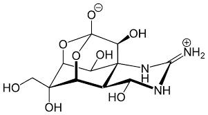{.lightbox width="90%" fig-align="center"}

**Tetrodotoksin (TTX)**

**Spørgsmål 1.** Ud fra TTXs kemiske struktur, forventer du, at stoffet
passerer cellemembranen? Begrund dit svar.

Svar: TXX er et polært molekyle med mange hydroxy- og guanidin-grupper,
hvilket gør det stærkt hydrofilt. Derfor forventes det ikke at kunne
passere den hydrofobe lipidmembran via passiv diffusion.

**Spørgsmål 2.** Ligevægtspotentialet er vigtigt for at forstå, hvordan
Na⁺ bevæger sig over membranen. Beregn ligevægtspotentialet for Na⁺ i
menneskets nerveceller med en koncentration af Na⁺ inde i cellen på 15
mM og udenfor cellen på 145 mM.

Svar:

{.lightbox width="90%" fig-align="center"}

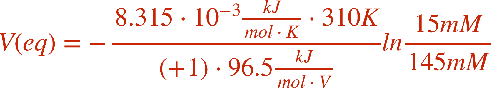{.lightbox width="90%" fig-align="center"}

Eₙₐ = 60.6 mV, (ved 37 °C = 310 K, z = +1)

**Spørgsmål 3.** Brug ligevægtspotentiale for Na⁺, du beregnede i
spørgsmål 2, til at forklare, hvordan TTXs blokering af Na~V~1.4-kanalen
påvirker neuronens evne til at depolarisere membranpotentialet, og
hvilken konsekvens det har for aktionspotentialet.

Svar: TTX blokerer Na~V~1.4-kanalens pore og forhindrer Na⁺-influx.
Neuronen kan derfor ikke bevæge membranpotentialet i retning af Na⁺'s
ligevægtspotentiale, som normalt driver depolariseringen. Uden denne
depolarisering kan aktionspotentialets opadgående fase ikke opstå, og
cellen mister elektrisk excitabilitet, hvilket fører til lammelse.

Kuglefisken, som producerer TTX, er selv resistent over for toksinet.
Mutationer i dens Na⁺-kanaler gør den markant mindre følsom over for
TTX, men kanalen skal samtidig bevare normal Na⁺-ledning.

**Spørgsmål 4.** Hvilken type strukturel ændring i kanalens
ekstracellulære pore-region kan give denne resistens, og hvordan kan
ændringen samtidig bevare normal ionledning?

Svar: Resistens opstår typisk ved punktmutationer i den ekstracellulære
pore del, hvor TTX binder. Hvis en negativt ladet aminosyre (fx Glu
eller Asp) udskiftes med en mere neutral rest (fx Gln eller Asn),
reduceres de elektrostatiske interaktioner og hydrogenbindinger til
TTX's guanidingruppe. Affiniteten for TTX falder dermed kraftigt.

Normal Na⁺-ledning bevares, fordi iontransporten gennem kanalen primært
afhænger af backbone-geometri og dybere poreelementer i
selektivitetsfilteret, som ikke påvirkes af denne overfladenære
sidekædeændring. Resultatet er TTX-resistens uden funktionstab.
