## Opgave 1

Forskere har brugt komparativ sekvensanalyse til at opdage nye
ikke-kodende RNA i bakterie- og bakteriofag-genomer. Blandt nyopdagede
RNA\'er er OLE (Ornate Large Extremophilic), ROOL (Rumen-Originating,
Ornate, Large) og GOLLD (Giant, Ornate, Lake- and
Lactobacillales-Derived). Strukturen af disse blev bestemt ved cryo-EM
og viste sig at danne hhv. dimer, 8-mer og 14-mer (med PDB-ID 9LCR,
9MDS, 9MEE). Strukturerne er vist på nedenstående figur.

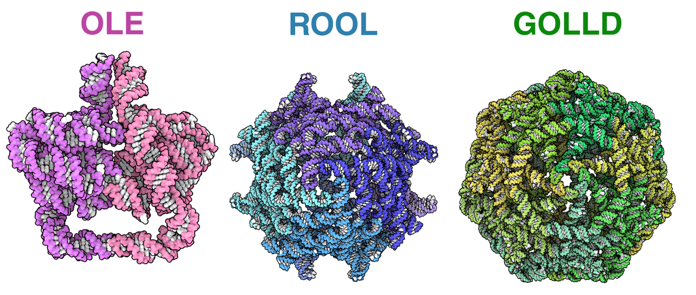{.lightbox width="90%" fig-align="center"}

**Spørgsmål 1:** Lav et PyMOL script, der åbner OLE og favelægger de to
monomerer i forskellige farver. Farvelæg desuden strukturen med B-faktor
og svar på hvilke helicer, der har høj B-faktor, og hvad det betyder.

Svar:

reinit

fetch 9LCR

color red, chain A

color blue, chain B

scene F1, store

spectrum b, blue_white_red, minimum=20, maximum=50

scene F2, store

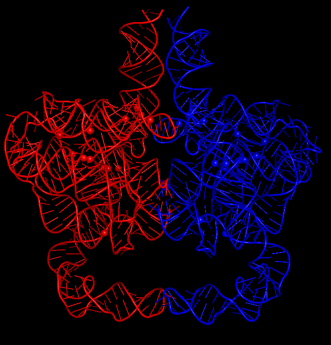{.lightbox width="90%" fig-align="center"}

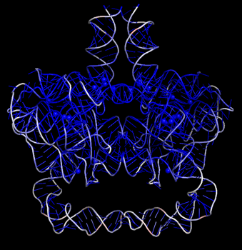{.lightbox width="90%" fig-align="center"}

De nederste helicer har høj B-faktor, hvilket betyder at de er flexible.

**Spørgsmål 2:** Bestem non-Watson-Crick basepar interaktionen (ifgl.
Leontis-Westhof annotation) for det intramolekylære basepar G71-A176 og
det intermolekylære basepar C99-G146.

Svar: G71-A176 er trans-HS. C99-G146 er cis-WW

Følgende viser sekvens-alignment af hairpin 5 og hairpin 6 i OLE RNA
strukturen med basepar vist som dot-bracket annotation og annoteret med
stem (P) og loop (L) interaktioner. L5 til L6\' er intermolekylære
basepar.

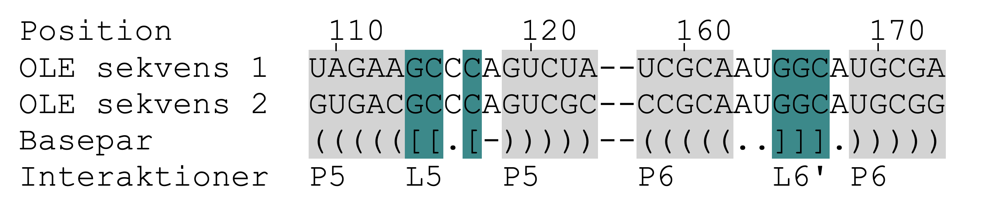{.lightbox width="90%" fig-align="center"}

**Spørgsmål 3:** Beskriv strukturbevarelse i de intra- og
intermolekylære basepar interaktioner?

Svar:\
Der er strukturbevarelse af intramolekylære basepar interaktioner på
position:

- 109-123 (UA-GC) kompenserende base ændring bevarer basepar.

- 110-122 (AU-UG) kompenserende base ændring bevarer basepar via G-U
  wobble.

- 113-119 (AG-CG) mismatch, men AG er muligt noncanonical basepar,
  kompenserende base ændring til CG.

- 158-173 (UA-CG) kompenserende base ændring bevarer basepar.

Der er ikke ændringer af intermolekylære basepar interaktioner.

Funktionerne af OLE, ROOL og GOLLD er stadig ukendte. OLE binder et
membran protein, hvilket medfører at OLE RNA går igennem cellemembranen,
mens ROOL og GOLLD er RNA kapsler med indre volumener, som det ses
herunder.

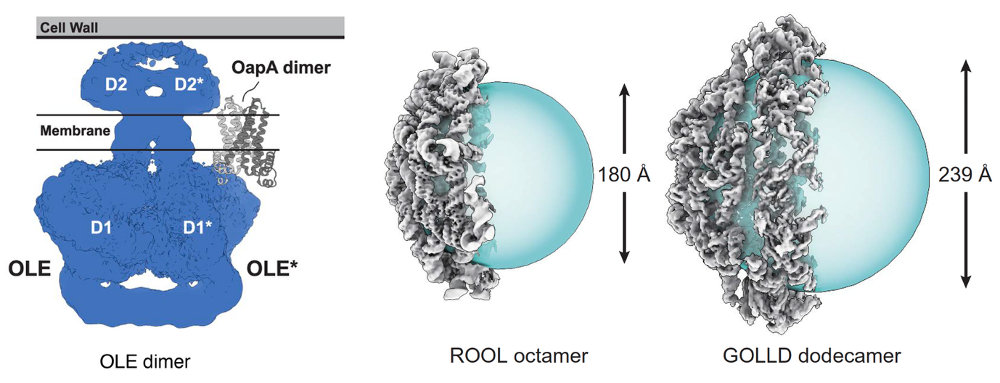{.lightbox width="90%" fig-align="center"}

**Spørgsmål 4:** Foreslå mulige funktioner af OLE, ROOL og GOLLD ud fra
din viden om transmembrane proteiner og protein kapsler.

Svar:

OLE er formodentlig en form for kanal til transport. Eller en receptor,
der binder noget på ydersiden og transducerer signal til indersiden.

ROOL og GOLLD har store interne volumener, der må antages at indkapsle
andre komponenter. Protein kapsler bruges ofte til at indkapsle virus
DNA/RNA eller som jern storage ved Ferritin eller som enzymer.

**\**

## Opgave 2

Lac-repressoren findes i bakterier, hvor den styrer produktionen af tre
proteiner, der er involveret i metabolismen af laktose. Når
Lac-repressor er bundet, blokerer den produktionen af proteinerne. Men
når den binder sig til laktose og lignende sukkerarter, ændrer den form
og kan ikke længere binde sig til DNA\'et. Derefter er RNA-polymerase
fri til at transskribere genet, og proteinerne dannes. På figuren
herunder ses Lac-repressor tetramer (grøn), der binder to steder på en
DNA streng (rød), og DNA-sekvensen der bindes.

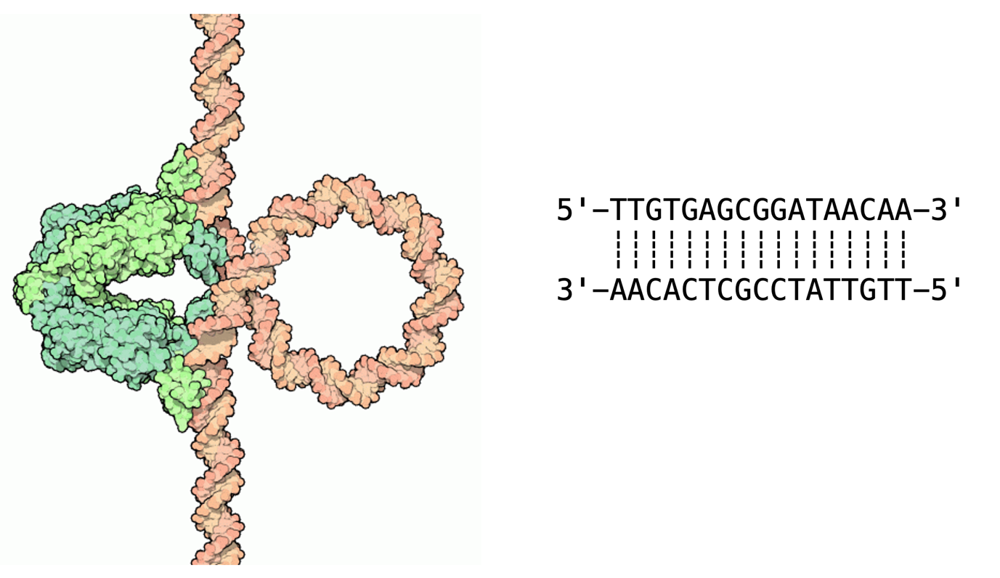{.lightbox width="90%" fig-align="center"}

**Spørgsmål 1:** Beskriv hvilken type DNA-sekvens-motiv som
Lac-repressor binder til og forklar hvorfor man mener at DNAet danner et
loop.

Svar: Sekvens-motivet er et afbrudt palindrom (eller inverted repeat)
med 9 bp imellem, 13 imellem lignende positioner i palindromerne.

TTGTGAGCGGATAACAA-TTGTTATCCGCTCACAA

((((\...\...\...))))-((((\...\...\...))))

Normalt vil der være 10,5 bp imellem de to palindromer, så det passer
med et fuldt turn af en DNA helix, så homodimer binder i major groove på
samme side. Det vil derfor føre til en bøjning af helicen. Som det ses
på billedet binder tetramer til to afbrudte palindromer, der ligger
langt fra hinanden og derved dannes loopet.

Åben strukturen for homodimer af Lac-repressor med PDB-ID = 1EFA i
PyMOL. Strukturen indeholder to 2-nitrophenyl beta-D-fucopyranoside
(NPF) ligander.

**Spørgsmål 2:** Skriv et PyMOL script, der fjerner chain C, farvelægger
chain A,B,D,E i forskellige farver, og viser liganderne som spheres.
Svar skal indeholde script og billede fra PyMOL.

Svar:\
reinit\
fetch 1EFA\
remove chain C\
color red, chain A\
color green, chain B\
color blue, chain D\
color yellow, chain E\
show spheres, resn NPF

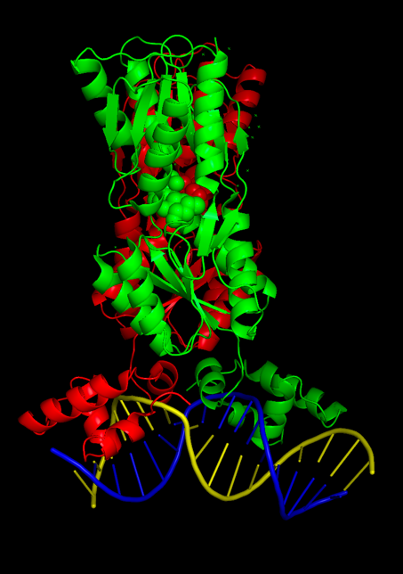{.lightbox width="90%" fig-align="center"}
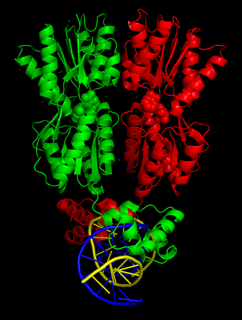{.lightbox width="90%" fig-align="center"}

**Spørgsmål 3:** Hvilken type protein-bindings-motiv er der tale om,
hvilken groove af DNA\'et bindes, og hvordan påvirkes DNA helixen?

Svar: Helix-turn-helix. Binder i major groove. DNA helix bøjer.\
Der er også to helixer, der binder i minor groove, men dette er ikke
kendt motiv.

**Spørgsmål 4:** Find specifikke interaktioner mellem liganden og
Lac-repressor. Hvilke aminosyrer interagerer med liganden?

Svar:\
Tryk på ligand og brug \"Find polar contacts to other atoms in
object\".\
Med fordel ændres ligand til sticks og protein til lines, som det ses
her:\
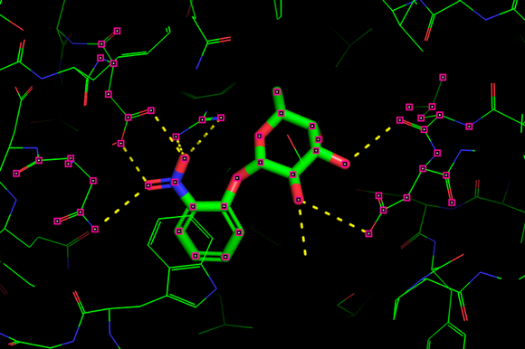{.lightbox width="90%" fig-align="center"}\
Nu kan man finde de relevante aminosyrer:\
Leu148\
Asp149\
Arg197\
Asn246\
Asp274

Forskel på om man kigger på den ene eller anden ligand. Leu149 mangler i
den ene.**\**

## Opgave 3

Vi har en receptor, som i fri tilstand har et spektroskopisk signal på
7,5, og når den er bundet til et ligand, falder signalet til 3,3. Vi
tilsætter et ligand L og får følgende resultat:

  -------------------
   \[L\]     Signal
    (µM)   
  -------- ----------
     0        7,5

     1        7,03

    2,5       6,49

     5        5,87

     10       5,16

     15       4,75

     20       4,49

     25       4,31

     30       4,17

     40       3,99
  -------------------

**Spørgsmål 1:** Bestem den (omtrentlige) K~D~.

Svar:

Tallene er beregnet ud fra en K~D~ på 7,9 µM og det ses at ved 7,9 µM er
vi omtrent halvvejs mellem start (7,5) og slut (3,3). Der er det lille
benspænd at signalet falder ved ligand binding.

**Spørgsmål 2:** Nu tilfører vi en konkurrerende ligand M, som når den
er bundet til receptoren, giver et signal på 12. Det viser sig at M har
en K~D~, som er 10 gange højere end L. Skitsér hvordan signalet udvikler
sig, hvis man først tilfører 10 µM L (i trin af 2 µM, dvs. 0-2-4-6-8-10
µM) og derefter tilfører M til 100 µM i trin af 10 µM. Kom med en
omtrentlig vurdering af slutniveauet af signalet ved 100 µM M.

Svar:

Signalet falder som i tabellen til 5,16 og vil så langsomt stige mod 12
men vil ikke nå i mål. Ved 100 µM M er der 10 gange så meget M som L men
L er 10 gange så stærk til at binde så receptoren vil være bundet lige
meget til hver, dvs. signalet vil være gennemsnittet af 3,3 og 12, altså
ca. 7,6 (som det startede med!).

**Spørgsmål 3:** Et protein har følgende sekvens:

MQLSAKTVREWNYGAPHDLCRSVQETKAMGIPRLDFGHTQWVFSNARLDYQKPTMSTWGHQLTAREGNASPYLCQAHRD

Hvilket peptid herfra vil blive fremvist af MHC proteinet HLA-A2?

Svar:

Motivet er LX~7~V, altså LDFGHTQWV.

**Spørgsmål 4:** Vi har en mutant af hæmoglobin hvor Lys82 erstattes af
Leu i β1 kæden. Skitser grafisk hvilken indflydelse det har på
iltbindingskurven? Hvilke konsekvenser har det mere generelt? Begrund
dit svar.

Svar:

Lys82 er involveret i at binde BPG via elektrostatiske interaktioner
mellem Lys' positivt ladede aminogruppe og BPG's negativt ladede
fosfatgrupper, hvilket stabiliserer T-tilstanden. Hvis Lys erstattes af
Leu, vil BPG ikke binde så godt og T tilstanden vil derfor ikke
stabiliseres så meget, dvs. R kan lettere "dominere" og overtage
iltbinding. Den oprindelige kurve (blå nedenunder) forskubbes altså mod
en stejlere kurve (rød/lilla nedenunder) med lavere p~O2~^50%^. Det
betyder at der ikke kan leveres så meget ilt til de forskellige væv, så
man kommer til at lide af åndedrætsbesvær og generel anoxi. Ikke godt!

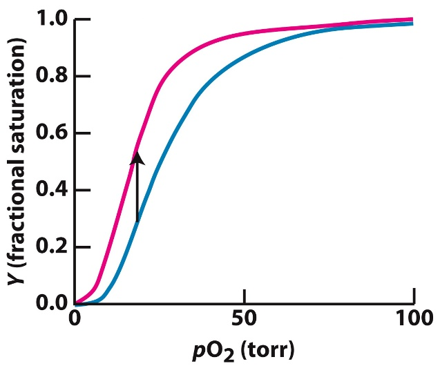{.lightbox width="90%" fig-align="center"}

**\**

## Opgave 4

En forskningsgruppe har krystalliseret et enzym på 45 kDa og ønsker at
bestemme strukturen ved røntgenkrystallografi. Tre forskellige
krystaller blev testet ved en synkrotron. Diffraktionsbilleder blev
indsamlet under identiske betingelser: samme røntgen-bølgelængde (λ =
1.0 Å) og samme krystal-til-detektor afstand (200 mm).

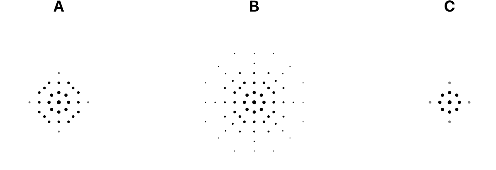{.lightbox width="90%" fig-align="center"}**Figur 1:** Diffraktionsmønstrene fra de
tre krystaller:

**Spørgsmål 1:** Hvilket af de tre diffraktionsmønstre (A, B, eller C)
indikerer at krystallen diffrakterer til højeste opløsning? Begrund dit
svar.

Svar: Mønster B indikerer højeste opløsning fordi reflektionerne
strækker sig længst ud fra centrum. I krystallografi gælder at høj
opløsning (små d-værdier) svarer til store diffraktionsvinkler, hvilket
betyder at reflektionerne placeres langt fra centrum på detektoren.
Mønster C har kun reflektioner tæt på centrum, hvilket svarer til lav
opløsning.

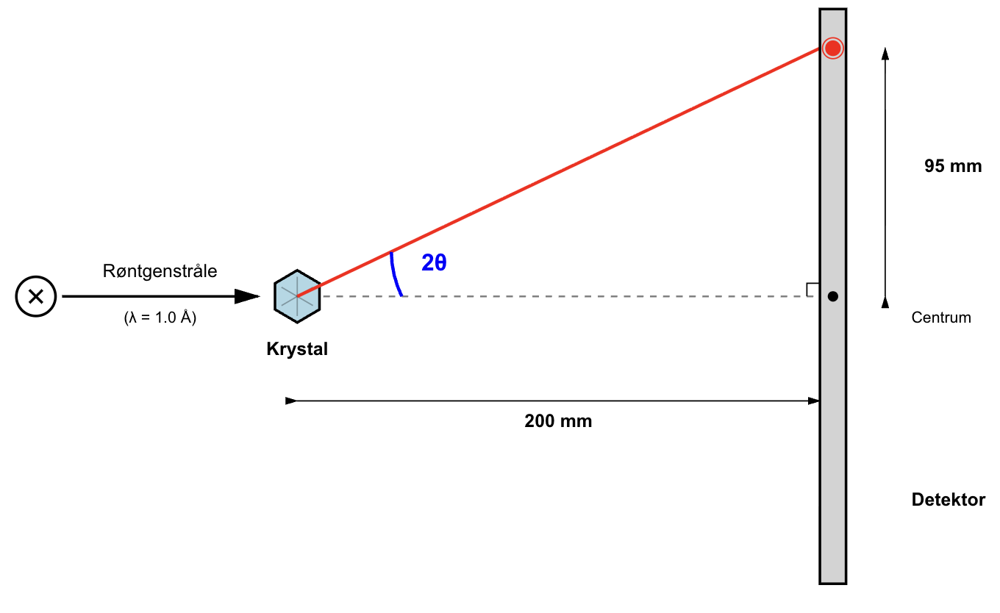{.lightbox width="90%" fig-align="center"}

**Figur 2:** Den geometriske opstilling ved et
røntgendiffraktionseksperiment.

**Spørgsmål 2:** I diffraktionsbilledet vist i figur 1B befinder den
yderste synlige reflektion sig 95 mm fra centrum af
diffraktionsmønstret.

a\) Bestem diffraktionsvinklen 2θ for denne reflektion ud fra geometrien
i figur 2.

b\) Beregn den højeste opløsning (mindste d-værdi) for datasættet,
bestemt af denne yderste synlige reflektion.

Svar:\
a) tan(2θ) = 95 mm / 200 mm = 0.475 2θ = 25.4°\
b) θ = 25.4° / 2 = 12.7°\
Fra Bragg's lov:\
2d·sin(12.7°) = 1.0 Å d = 1.0 / (2 × 0.220) = 2.27 Å\
Altså en opløsning på cirka 2.3 Å.

**Spørgsmål 3:** En struktur af human tyrosine-protein kinase C-SRC
(PDB: 1FMK) er blevet bestemt ved røntgenkrystallografi til 1,7 Å
opløsning. Proteinet består af flere domæner.

a\) Download strukturen i PyMOL og visualisér B-faktorerne. Identificer
hvilke typer af strukturelle elementer, der har henholdsvis lav og høj
B-faktor. Hvad fortæller B-faktorerne om disse regioners struktur og
dynamik?

Svar: I PyMOL:

- **Lav B-faktor (blå):** De strukturerede domæner (SH3, SH2, kinase)
  med tætpakkede sekundære strukturer. Disse regioner er rigide og
  velordnede med minimal termisk bevægelse (B \~20-40 Å^2^).

- **Høj B-faktor (gul/orange/rød):** Surface loops og fleksible
  linker-regioner. Høj termisk bevægelse eller strukturel heterogenitet
  (B \>60-80 Å^2^).

B-faktoren kvantificerer atomernes termiske bevægelser og positionel
usikkerhed. Høje værdier indikerer fleksibilitet eller at regionen kan
indtage flere konformationer i krystallet.

b\) Figur 3 nedenfor viser pLDDT-profilen fra en AlphaFold forudsigelse
af samme protein. pLDDT (predicted Local Distance Difference Test) er
AlphaFolds mål for den lokale modelkvalitet. Sammenlign pLDDT-profilen
med B-faktorerne du observerede i PyMOL. Er der korrelation mellem
regioner med høj B-faktor og lav pLDDT? Hvad fortæller denne sammenhæng
om proteinets struktur og dynamik?

Svar: Ja, tydelig **omvendt korrelation;** Lav B-faktor → høj pLDDT
(\>90), hvorimod Høj B-faktor → lav pLDDT (\<70). Regioner der er
fleksible i krystaller (høj B-faktor) mangler også stærke
co-evolutionære signaler, hvilket AlphaFold detekterer som lav konfidens
(lav pLDDT). Begge metoder er enige om proteinets dynamiske egenskaber.
AlphaFolds pLDDT kan forudsige hvilke regioner der vil have høj
B-faktor.

c\) Hvad er sammenhængen mellem de manglede residues i krystal
strukturen og pLDDT værdierne fra AlphaFold strukturforudsigelsen?

Svar:

**Manglende regioner i krystal:**

- N-terminus: residue 1-81 (pLDDT \~10-50)

- Loop: residue \~410-423 (pLDDT \~30-50)

- C-terminus: residue \~534-543 (pLDDT \~20-50)

**Forklaring:** Disse regioner mangler fordi de er intrinsisk uordnede
eller meget fleksible. Lav pLDDT betyder at AlphaFold ikke kan forudsige
én stabil konformation da regionen er strukturelt heterogen. I
krystaller giver sådanne regioner ingen veldefineret elektrontæthed, da
atomerne indtager mange forskellige positioner og kan derfor ikke
modelleres.

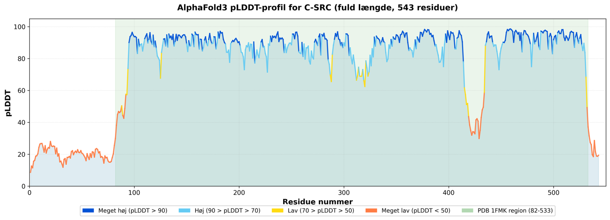{.lightbox width="90%" fig-align="center"}

**Figur 3:** pLDDT plot for AlphaFold3 model for tyrosine-protein kinase
C-SRC.

**Spørgsmål 4: PAE analyse af C-SRC strukturen**

Figur 4 viser PAE (Predicted Aligned Error) plottet fra AlphaFold for
C-SRC.

**a)** Hvad fortæller PAE plottet om sikkerheden i den forudsagte
relative position af de foldede domæner i C-SRC?

Svar: Det mørke grønne kvadrat (residue \~90-450): PAE \~5 Å → AlphaFold
er meget sikker på den relative orientering af disse strukturerede
domæner. De har veldefineret indbyrdes position.

**b)** Hvad viser PAE-plottet om de første ca. 90 rester (N-terminalen)?
Beskriv både PAE inden for denne region og PAE mellem denne region og
resten af proteinet. Hvad betyder dette for N-terminalens struktur og
den relative position i forhold til de foldede domæner?

Svar: Kun diagonalen er mørkegrøn (lav PAE hvor hvert residue til sig
selv), hvorimod resten af regionen 1-90 har høj PAE og også høj PAE i
forhold til resten af proteinet. N-terminalen er intrisically disordered
og har ingen velbestemt struktur eller veldefineret position i forhold
til protein domænerne.

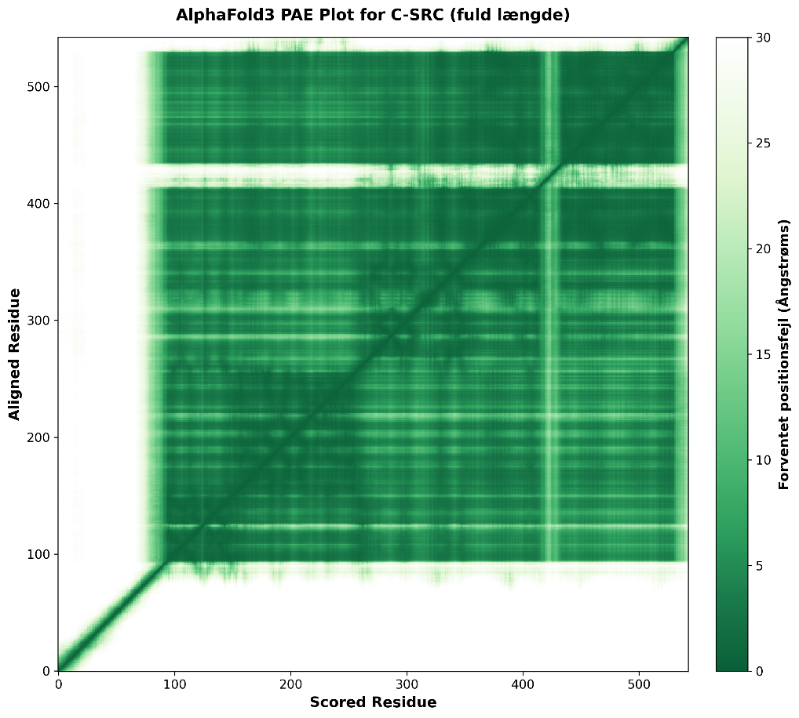{.lightbox width="90%" fig-align="center"}

**Figur 4:** PAE plot for AlphaFold3 model for C-SRC.

**\**

## Opgave 5

Erythropoietin er et hormon, der stimulerer dannelsen af røde
blodlegemer i knoglemarven. Sekvensen af det aktive hormon er vist
nedenfor og består af 165 aminosyrer og har en teoretisk molekylvægt på
18,2 kDa.

APPRLICDSRVLERYLLEAKEAENITTGCAEHCSLNENITVPDTKVNFYAWKRMEVGQQAVEVWQGLALLSEAVLRGQALLVNSSQPWEPLQLHVDKAVSGLRSLTTLLRALGAQKEAISPPDAASAAPLRTITADTFRKLFRVYSNFLRGKLKLYTGEACRTGD

**Spørgsmål 1:** Angiv de mulige N-glykosyleringssite i sekvensen.

Svar: Signaturesequence for N-glycosyleringer: [N]{.underline}-X-S/T,
hvor X ≠ Prolin

APPRLICDSRVLERYLLEAKEAE**[N]{.underline}IT**TGCAEHCSLNE**[N]{.underline}IT**VPDTKVNFYAWKRMEVGQQAVEVWQGLALLSEAVLRGQALLV**[N]{.underline}SS**QPWEPLQLHVDKAVSGLRSLTTLLRALGAQKEAISPPDAASAAPLRTITADTFRKLFRVYSNFLRGKLKLYTGEACRTGD

N24, N38, N83

Forskere oprensede Erythropoietin fra en patient og analyserede det på
en SDS-PAGE efter de har tilsat enzymet X med forskellige
inkubationstider (se nedenfor).

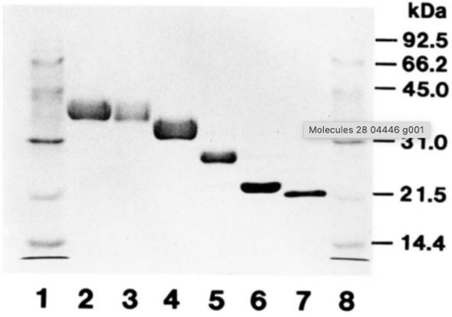{.lightbox width="90%" fig-align="center"}

**Lane 1**: Proteinmarkør

**Lane 2**: Erythropoietin

**Lane 3-7**: Erythropoietin + enzym X (0, 1, 2, 5, 24 timer)

**Lane 8**: Protein markør

**Spørgsmål 2:** Forklar forskellene i migration for Erythropoietin på
SDS-PAGE, og angiv hvilken type enzym X er.

Svar: Erythropoietin er et glykoprotein, som migrerer langsommere på
SDS-PAGE end den teoretiske molekylvægt på 18,2 kDa, fordi
kulhydratkæderne øger den apparente størrelse. Enzymet X er et
deglykosylerende enzym, der gradvist fjerner glykosyleringerne, så
Erythropoietin efter længere inkubationstid nærmer sig sin teoretiske
molekylvægt.

Erythropoietin produceres naturligt i nyrerne, men oprenses også
rekombinant og anvendes som lægemiddel til behandling af anæmi.

**Spørgsmål 3:** Rekombinant Erythropoietin produceres i pattedyrsceller
(f.eks. CHO-celler), men ikke i *E. coli*. Forklar hvorfor bakterier
ikke egner sig til produktion af funktionelt Erythropoietin.

Svar: Bakterier mangler det endoplasmatiske retikulum og
Golgi-apparatet, hvor N- og O-glykosylering foregår. De kan derfor ikke
danne de komplekse kulhydratstrukturer, som er nødvendige for
Erythropoietin stabilitet og aktivitet.

For at oprense og krystallisere Erythropoietin var forskerne nødt til at
lave aminosyre ændringer i glykosyleringssites i Erythropoietin.

**Spørgsmål 4:** Brug PyMOL til at analysere strukturen af
Erythropoietin bundet til dets receptor (PDB: 1EER). Er
N-glykosyleringerne i Erythropoietin involveret i receptorbinding?
Begrund dit svar og lav en figur, der viser strukturen og de
modificerede glykosyleringssites.

Svar: Erythropoietin har tre N-glycosyleringer (N24, N38, N83), disse er
dog muteret til K i strukturen. I PDB 1EER overlapper eller indgår disse
ikke i de aminosyrekontakter, der medieres mod receptoren; derfor er
N-glykanerne ikke direkte nødvendige for receptorbinding. Glykanerne
påvirker dog proteinets stabilitet og halveringstid i plasma.

Receptor (blå), Erythropoietin (grøn), N-glycosyleringerne (K24, K38,
K83) (rød)

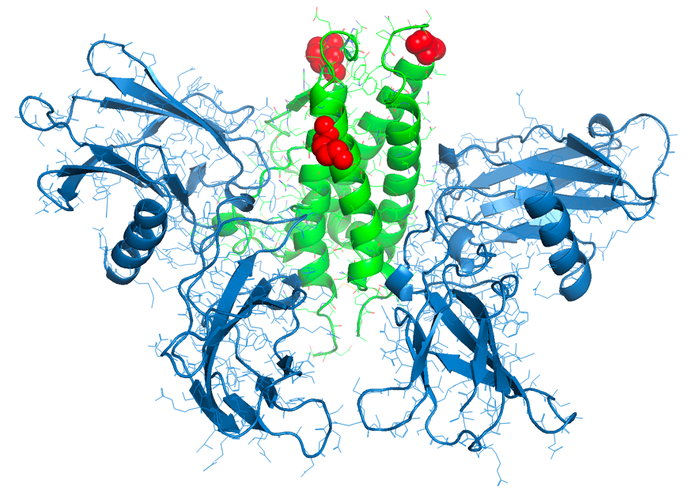{.lightbox width="90%" fig-align="center"}
