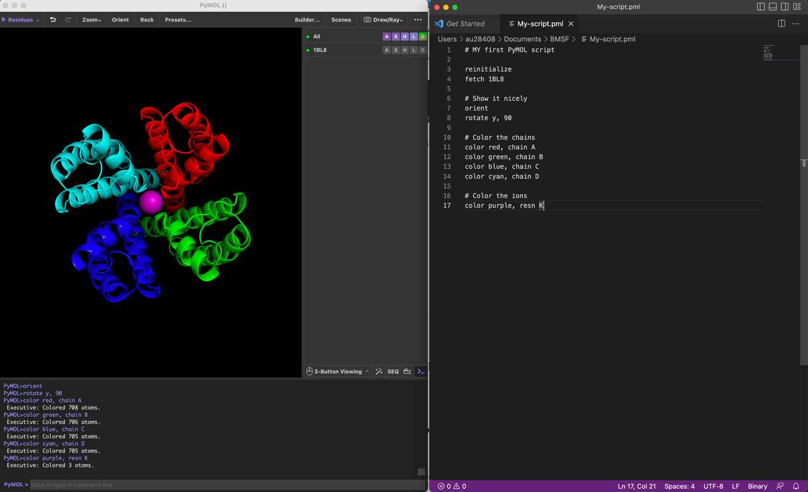

I dette TØ sæt skal I arbejde på at få installeret og afprøvet software som skal bruges på kurset. Vi håber desuden at lære jer nogle gode arbejdsgange, som kan gøre arbejdet med TØ opgaverne mere effektivt.

Det er vigtigt at I alle får sat PyMOL-programmet op på samme måde, da det så er lettere at hjælpe jer i det tilfælde at I oplever problemer - følg derfor [PyMOL installations guiden](../other_notes/installation_pymol.qmd) og [VS Code installations guiden](../other_notes/installation_vscode.qmd).

## Opgave 1. I gang med PyMOL

PyMOL er et fantastisk værktøj til analyse af biologiske molekyler, både til hurtige kig og mere dybdegående analyse. I denne opgave skal vi benytte nogle enkle værktøjer til at kigge på en struktur og se hvordan man kan ændre den grafiske repræsentation. Opgaven behandler mange af de samme ting I har set i videoen "Introduktion til PyMOL".

Inden du går i gang, skal du naturligvis have installeret PyMOL på din computer (enten Mac eller PC) ligesom det er vigtigt, at benytte en mus med både højre og venstre knap samt hjul i midten. Hjulet skal også have en knap-funktion, når man trykker på det (3-button mouse). Hvis du ikke har sådan en mus, anbefales det kraftigt at få fat på én, da det er meget svært at styre PyMOL fra en laptop pegeplade, specielt på Mac. Sådanne USB-mus koster typisk under 100 kr (f.eks. [**denne**](https://www.pc-lager.dk/da/p/logitech-b100-optisk-kabling-hvid-95308)).

### Hent K^+^-kanalen 1BL8

Hent strukturen af K^+^-kanalen fra *Streptomyces lividans* bestemt med krystallografi med PDB-kode 1BL8 ved at skrive kommandoen `fetch 1BL8`.

Den højre side af Viewer-vinduet viser den hentede PDB-fil som et PyMOL **objekt** med samme navn som PDB-filen. Disse kendes på, at navnet ikke står i parentes. Senere skal vi se på **selektioner**, der kendes ved at deres navn står i parentes. Forskellen på de to typer er, at hvor objekter selv indeholder molekylekoordinater, så er en selektion blot et udvalg af atomer i et objekt, en selektion indeholder ikke selv atomerne. Det svarer lidt til at vælge noget tekst i Word med musen. Der skal altså være et objekt før man kan lave en selektion. Objekter kan tændes og slukkes ved at klikke på navnet.

Øverst findes altid et globalt objekt `all`, der dækker alle objekter og selektioner i PyMOL. Dvs. laver man en ændring her vil det påvirke alle objekter nedenfor.

For strukturer bestemt med NMR vil man typisk opleve at et antal af de laveste energitilstande deponeres, hvorfor der vil være flere tilstande.

### Hent PAS-domænet fra HERG 2L0W

Hent strukturen af PAS-domænet fra HERG K^+^-kanalen bestemt med NMR via PDB-kode 2L0W. Efter objektnavnet står der `1/20`, hvilket betyder at vi kigger på tilstand 1 ud af i alt 20 tilstande af strukturen.

### Skift mellem NMR-tilstande

Prøv at skifte mellem visning af de forskellige tilstande vha. knapperne i bunden af vinduet:

{width="1.4444444444444444in" height="0.28888888888888886in"}

Ud for hvert objekt eller selektion ses 5 menuer angivet med bogstaverne **A** (Action), **S** (Show), **H** (Hide), **L** (Label) og **C** (Color). Disse kan bruges til at styre hvordan objektet/selektionen fremstår visuelt samt udføre forskellige beregninger på dem.

Under **A** (Action) menuen er de vigtigste funktioner:

- **orient**: Flytter objektet/sektionen ind midt i synsfeltet
- **center**: Sætter rotationscentrum til selektionen/objektet
- **find**:Finder bl.a. polære interaktioner fra en selektion/objekt
- **align**: Foretager strukturelt alignment af selektionen/objektet
- **rename**: Omdøber objektet/selektionen
- **delete**: Sletter objektet/selektionen
- **remove waters**: Fjerner vandmolekyler for bedre overblik

Ovenstående actions vil alle blive gennemgået i løbet af kurset.

### Slet NMR-strukturen og centrér 1BL8

Brug Action-menuen til at slette NMR-strukturen igen og derefter til at flytte 1BL8 ind midt i synsfeltet med center-action.

Menuen **S** (Show) bruges til at vise objekter/selektioner med forskellige grafiske repræsentationer, hvor af de vigtigste er:

- **(wire) lines**: Viser alle bindinger som tynde linjer med atomfarver i hjørnerne.
- **(licorice) sticks**: Som lines, men med tykkere stave.
- **ribbon**: Viser et Cα-trace, dvs. en tyk linje med et Cα-atom i hvert hjørne. Dette er godt til at få overblik over sekundær struktur og sammenligne foldninger.
- **cartoon**: Viser en flot præsentation af strukturen med α-helicer som bånd og β-strands som pile. God til artikler og opgaver.
- **spheres**: Viser hvert atom som en kugle med korrekt Van der Waals-radius.
- **surface**: Viser en overflade baseret på atomernes Van der Waals-radii.

Bemærk at et objekt/selektion kan have flere repræsentationer samtidig, hvorfor det er nødvendigt at skjule eksisterende repræsentationer når andre vælges (medmindre man selvfølgelig ønsker begge samtidig). Dette gøres vha. Hide-menuen. I version 3 af PyMOL vises alle nye strukturer, der åbnes, som en flot cartoon-repræsentation med ligander i sticks og ioner i spheres.

### Skjul alle repræsentationer

Benyt Hide-menuen udfor det globale `all`-objekt til at fjerne alt (H->Hide: everything).

### Eksperimentér med repræsentationer

Eksperimentér med de forskellige repræsentationer af 1BL8 vha. Show-menuen. Brug Hide-menuen til at fjerne en repræsentation før en ny vises.

Color-menuen bruges som navnet antyder til at sætte en farve for et objekt eller en selektion. Dette er mest anvendeligt når man har lavet under-selektioner af strukturen, som vi skal se senere. De vigtigste funktioner er:

- **by element**: Farv et objekt/selektion efter atomtype, der er flere forskellige, hvor af den klassiske har carbon i gult. Fungerer bedst med sticks/spheres repræsentation, da cartoon/ribbon kun viser C-atomer.
- **by chain**: Farv et objekt/selektion efter kæde, dvs. hvis der er flere peptidkæder, så får de hver sin farve.
- **by ss**: Farv et objekt/selektion efter sekundær struktur.
- **spectrum rainbow**: Farv et objekt/selektion fra blå i N-terminalen til rød i C-terminalen.

### Vis 1BL8 i sticks med atomfarver

Brug menuerne til at vise 1BL8 kun i sticks og vælg atomfarver med carbon i gult.

### Udforsk cartoon-repræsentation og farvning

Brug menuerne til at vise 1BL8 kun i cartoon og vælg farver efter sekundær struktur, herefter rainbow. Identificér proteinets rigtige N-terminal. Hvorfor er der så mange andre "terminaler"? Brug kæde-specifik farvning til at forstå den kvarternære opbygning af K^+^-kanalen.

## Opgave 2. Kør dit første script i PyMOL.

Vi skal nu installere Visual Studio Code, der er en tekst-editor, som vi skal bruge til at skrive scripts til PyMOL, hvilket vi skal lære meget mere om i TØ3.

Hent og installer Visual Studio Code på følgende hjemmeside: <https://code.visualstudio.com/download>

Placér programmet, så det er let tilgængeligt, da du skal bruge det ofte sammen med PyMOL.

Åbn programmet og placér vinduet ved siden af PyMOL vinduet på din skærm, som det ses på screendumpet herunder:

{width="80%" fig-align="center" .lightbox}

Dette setup repræsenterer et godt setup til at arbejde med scripting i PyMOL, da du både kan se dit script og det output det giver i PyMOL vinduet.

Kopier følgende script ind i Visual Studio Code editoren:

```sh
# MY first PyMOL script

reinitialize

fetch 1BL8

# Show it nicely

orient

rotate y, 90

# Color the chains

color red, chain A

color green, chain B

color blue, chain C

color cyan, chain D

# Color the ions

color purple, resn K
```

Gem scriptet som `my_script.pml` i BMSF-folderen, hvor du startede PyMOL.

Der er nu to måder at køre dit script i PyMOL:

Copy-paste-return:

- Kopier dit PyMOL script fra Visual Studio Code vinduet.

- Paste dit PyMOL script på kommando-linjen i PyMOL vinduet.

- Tryk return for at eksekvere scriptet.

Run script:

- Gem dit PyMOL script som `my_script.pml` i BMSF folderen i Visual Studio Code.

- Skriv `@my_script.pml` på kommando-linjen i PyMOL vinduet.

- Tryk return for at eksekvere scriptet.

Disse metoder er lige gode, men sidstnævnte er den mest elegante.

På kurset kan du bygge et sæt af scripts op i din BMSF folder, som du let kan finde frem ved at skrive @ og trykke `tab` på kommando-linjen i PyMOL vinduet. Du får nu en liste over filerne i din BMSF-mappe i log-vinduet og kan så vælge den fil du gerne vil loade. Hvis du giver dine scripts systematiske navne som f.eks. TØ1_my_script.pml. Som ved alle kommandolinjer kan du bruge `tab` til at lave `auto-complete` på filnavnene og dermed hurtigt hente alle dine scripts frem f.eks. til at fremvise til TØ præsentationerne.

Husk at hver gang du skal scripte i PyMOL skal du gøre følgende:

- Åbn terminalen.

- Naviger til BMSF-folderen med cd.

- Åbn PyMOL med kommandoen: pixi run pymol

- Åbn Visual Studio Code og placer vinduerne ved siden af hinanden.

Så er du godt i gang. God vind med PyMOL opgaverne!