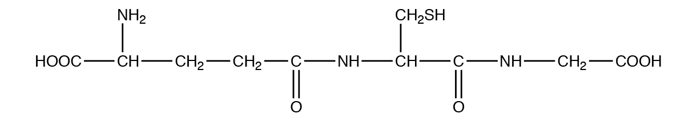
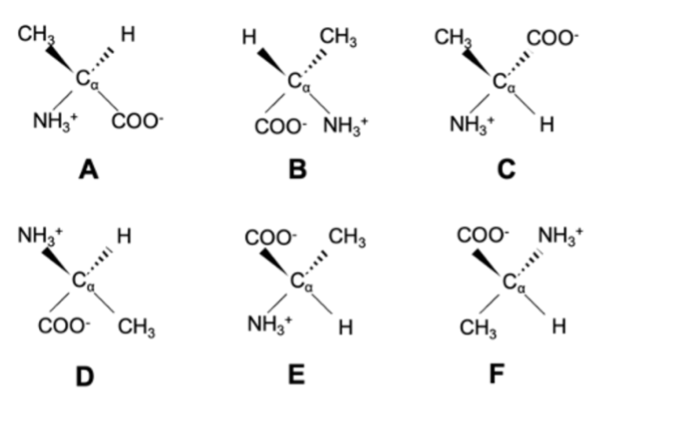
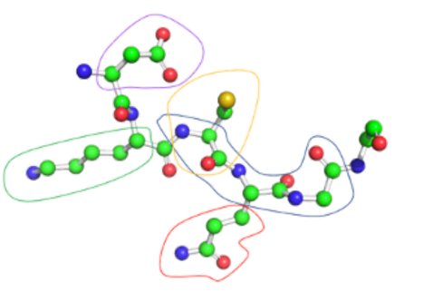
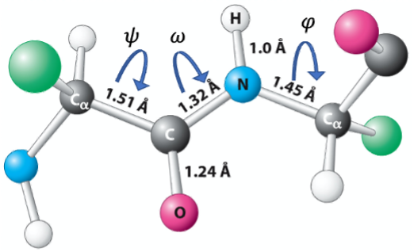
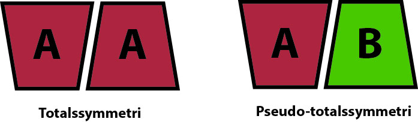

::: {.callout-note}
I dette TØ sæt arbejdes der på at blive introduceret til TØ formatet med
gruppearbejde og præsentation af løsning på opgaver. Opgaverne drejer
sig om repetition af viden fra tidligere kurser (Berg kapitel 1, 2 og 5)
samt anvendelse af PyMOL til analyse af enzym struktur. TØ opgaverne
gennemgås i grupper og præsenteres for klassen.
:::

## Opgave 1. Buffer-beregninger

Denne opgave er repetition af Berg Biochemistry kapitel 1.

En forsker forbereder en buffer af eddikesyre og natriumacetat med en pH-værdi på 5,0. Den samlede koncentration af begge komponenter i bufferen er 250 mM, og eddikesyre har en pKa-værdi på 4,75.

1. Hvad er koncentrationerne af eddikesyre og natriumacetat i bufferen?

2. Hvor mange mol eddikesyre og natriumacetat er der i 2 L af bufferen?

3. Hvor mange gram eddikesyre og natriumacetat er der i 2 L af bufferen?

::: {.callout-tip title="Hint"}
Den molære masse af eddikesyre er 60,05 g/mol; den molære masse af natriumacetat er 82,03 g/mol.
:::

::: {.callout-solution}
Berg kapitel 1 End-of-chapter problem 15. Svar findes bag i bogen eller på Achieve.
:::

## Opgave 2. Aminosyrers pKa

Denne opgave er repetition af Berg Biochemistry kapitel 2.

1. Hvad er pKa og hvordan hænger det sammen med pH?

::: {.callout-solution}
Beskrevet i Berg kapitel 1.
:::

2. Hvilke aminosyresidekæder kan almindeligvis fraspalte eller optage en proton under biologiske forhold og hvad er deres pKa-værdier?

::: {.callout-solution}
De sure sidekæder på aspartat og glutamat har en pKa på ca. 4.1 og kan dermed optage en proton herunder.

Histidin og cystein med pKa-værdier på hhv. 6.0 og 8.3 er de eneste sidekæder, der optager eller fraspalter protoner ved fysiologisk pH, men de andre aminosyrerester kan gøre det afh. af de lokale forhold.

Tyrosin og lysin har pKa tæt ved 11 og kan dermed afgive en proton herover, hvor i mod den mest basiske aminosyre, arginin, først deprotonerer ved et højere pH (pKa 12.5). 
:::

3. Hvad er ladningen af en aminosyres sidekæde ved pH-værdier hhv. under og over denne pKa?

::: {.callout-solution}
Sidekæden vil være neutral (C-terminal, Asp, Cys og Tyr) eller positivt ladet (His, N-terminal, Lys og Arg) ved pH-værdier under pKa og neutral (His, N-terminal, Lys og Arg) eller negativt ladet (C-terminal, Asp, Cys og Tyr) over denne værdi.
:::

4. Er en aminosyres pKa altid den samme? Hvis ikke, i hvilke situationer kan pKa ændres?

::: {.callout-solution}
pKa ændrer sig som følge af det lokale miljø, aminosyren befinder sig i. Hvis en aminosyre befinder sig i et miljø afskærmet fra protondonorer eller -acceptorer, som f.eks. i et proteins centrum vil det hhv. hæve og sænke pH. pKa kan også ændres grundet ladninger af andre aminosyrer i nærmiljøet. F.eks. vil en deprotoneret Asp være mindre tilbøjelig til at optage en proton, hvis der er en protoneret Arg i nærheden. Den protonerede Arg's positive ladning vil have en stabiliserende effekt på den deprotonerede Asp og protoneringen vil have en frastødende effekt på en protoneret Asp. Protoneringen er derfor ufavorabel og pKa for den Asp vil være sænket.
:::

## Opgave 3. Glutathione

Denne opgave er repetition af Berg Biochemistry kapitel 2.

Glutathione (GSH) er en antioxidant i planter, dyr, svampe og visse bakterier og archaea. Glutathione forhindrer skade på vigtige, cellulære komponenter som følge af reaktive oxygen-forbindelser som frie radikaler, peroxider og tungmetaller.

Glutathion har følgende struktur:

{width="80%" .lightbox fig-align="center"}

Hvilke af følgende udsagn om molekylet er korrekte?

1.	Hvilke aminosyrer indgår i GSH? Markér dem i figuren.

::: {.callout-solution}
Glu-Cys-Gly
:::

2.	Hvor findes en kobling mellem to aminosyrer, der adskiller sig fra den almindelige peptidbinding?

::: {.callout-solution}
Glutamyl-cysteine koblingen er via γ-carboxylgruppen og ikke α-carboxylgruppen på glutamine.
:::

3.	Hvilken gruppe er let oxidérbar?

::: {.callout-solution}
-CH2SH kan let oxideres til -CH2SO3H eller indgå i oxideret form i en disulphidbro (-CH2-S-S-CH2-).
:::

## Opgave 4. Protein quiz

Denne opgave er repetition af Berg Biochemistry kapitel 2.

1.	Hvilke af nedenstående aminosyrer er L-alanin? Marker de korrekte.

{width="80%" .lightbox fig-align="center"}

::: {.callout-solution}
A,B,E
:::

2.	Nedenfor vises et udsnit af en peptidkæde, der har sekvensen DKCQGG. Hvilke af følgende udsagn er korrekte:

    a.	Den blå streg omgiver kun hovedkæden for CQG.
    b.	Den gule stregomgiver kun cystein aminosyreresten
    c.	Den grønne stregomgiver kun lysine sidekæden
    d.	Den røde stregomgiver kun glutamin sidekæden
    e.	Den violette stregomgiver kun aspartat aminosyreresten

{width="80%" .lightbox fig-align="center"}

::: {.callout-solution}
a,b,d
:::

3.	Hvilke af følgende udsagn om hydrogenbindinger er korrekte: 

    a.	Asparagin sidekæden er altid hydrogenbindings acceptor
    b.	Afstanden mellem donor og acceptor er mellem 2.4Å og 3.2Å
    c.	Ved neutralt pH er glutamat-sidekæden altid donor
    d.	Nitrogen i peptidbindingen er donor
    e.	Oxygen i peptidbindingen er acceptor
    f.	Hydroxyl grupper i sidekæden (Ser, Thr, Tyr) kan være både donor og acceptor

::: {.callout-solution}
b,d,e,f
:::

4.	Hvilke af følgende udsagn om hydrogenbindinger er korrekte:
 
    a.	Energien for at bryde en hydrogenbinding er 1-10 kCal/mol (5-50 kJ/mol)
    b.	Donor-atomet har et elektron lonepair
    c.	I en saltbro er donor positivt ladet
    d.	Vinklen mellem donor – hydrogen – acceptor er lig med tetraedervinklen (109°)
    e.	I en saltbro er acceptor positivt ladet

::: {.callout-solution}
a,c
:::

5.	Hvilke af følgende påstande om peptidbindinger er korrekte:

    a.	Peptidbindingen har et dipol-moment.
    b.	Afstanden mellem de to Cα atomer er ca. 4.3 Å
    c.	Der findes tre resonans strukturer for peptidbindingen.
    d.	ω kan kun have værdierne 0°, 120° og 240°
    e.	Oxygen-atomet har en partiel negativ ladning

{width="80%" .lightbox fig-align="center"}

::: {.callout-solution}
a,e
:::

6.	Hvilke af følgende påstande om peptidbindinger er korrekte:

    a.	For prolin er ψ-vinklen altid -60° ±10°
    b.	Ca. 5% af peptidbindinger, hvor prolin er den C-terminale aminosyre, har cis konfiguration.
    c.	I de fleste peptidbindinger er Cα atomerne i trans konfiguration
    d.	Peptidbindinger, hvor glycin indgår, har oftere cis konfiguration
    e.	Når man betragter alle aminosyrerester under et, er φ-vinklen oftest positiv.

::: {.callout-solution}
b,c
:::

## Opgave 5. Bereging af enzymkinetik

Denne opgave er repetition af Berg Biochemistry kapitel 5.

Hydrolysen af pyrofosfat til orthofosfat driver biosyntetiske reaktioner såsom DNA-syntese. Denne hydrolytiske reaktion katalyseres i *E. coli* af en pyrofosfatase, der har en masse på 120 kDa og består af seks identiske underenheder. For dette enzym defineres en aktivitetsenhed som den mængde enzym, der hydrolyserer 10 μmol pyrofosfat på 15 minutter ved 37 °C under standard assaybetingelser. Det oprensede enzym har et $V_\mathrm{max}$ på 2800 enheder pr. milligram enzym.

1. Hvor mange mikromol substrat hydrolyseres pr. sekund pr. milligram enzym, når substratkoncentrationen er meget større end $K_M$? Med andre ord, hvad er $V_\mathrm{max}$ for den katalyserede reaktion? Angiv mængde hydrolyseret substrat i μmol.

2. Hvor mange mikromol active sites er der i 1 mg enzym? Antag, at hver underenhed har ét active site. Angives i μmol.

3. Hvad er enzymets omsætningstal i $s^{-1}$?

::: {.callout-solution}
Berg kapitel 5 End-of-chapter problem 13. Svar findes bag i bogen eller på Achieve.
:::

## Opgave 6. Analyse af Chymotrypsin i PyMOL

I denne opgave skal vi bruge PyMOL til at kigge på strukturen af chymotrypsin, som beskrives på s. 223-226 i Berg Biochemistry 10. udgave. Åbn filen `chymotrypsin.pse`.



::: {.callout-tip title="PyMOL hint"}
Pse-filer er PyMOL session filer, som du kan dobbeltklikke på for at åbne filen i PyMOL såfremt programmet er installeret.Denne pse-fil indeholder "Scener", der er udvalgte views af strukturen. I PyMOL 3 findes disse scener under "Scenes" knappen øverst til højre. Scenerne har her fået navnene F1-F4, hvilket gør at man også kan trykke dem frem med Funktions-tasterne F1 på dit tastatur. OBS: Mac-brugere skal **holde *fn*-tasten nede** når de trykker på F1, F2, F3 osv, da disse taster også bruges til at styre skærmens lysstyrke etc. på MacBooks.
:::

1.	Tryk på **F1**, hvor det ses at chymotrypsin består af to β-barrels kaldet domæne 1 og 2 vist med henholdsvis blåt og rødt. Lokalisér de to domæner og prøv at tænde og slukke for dem med knapperne `Domain 1` og `Domain 2` i listen til højre. Kan du finde β-barrel ved at navigere med musen? Hvad karakteriserer en β-barrel?

::: {.callout-solution}
En β-barrel er et kurvet β-sheet, der folder rundt således at den sidste strand hydrogenbinder til den første.
:::

2.	Den katalytiske triade bestående af Ser195, His57 og Asp102 befinder sig i området mellem de to domæner og er vist med grønne streger (sticks) i objektet `Triad`. Tryk **F2** for at se disse aminosyrer tæt på. Hvilken rolle spiller disse for enzymet?

::: {.callout-solution}
De tre aminosyrer er vigtige for den enzymatiske reaktion. Kort fortalt hjælper Asp og His med til at Ser bliver deprotoneret og danner en alkoxidion, der kan angribe peptidbindingen under kløvningsreaktionen (se Fig. 9.8, Berg et al. 10. udgave, s. 279).
:::

3.	De to domæner ligner meget hinanden og er arrangeret med en såkaldt "pseudo-2-talssymmetri". Tryk **F1** på keyboardet for at se ned langs denne akse og **F3** og **F4** for at se ned langs hvert β-barrel domæne. Hvad tror du en "pseudo-2-talssymmetri" er?

::: {.callout-solution}
En "pseudo-symmetri" er en ikke helt streng symmetri, dvs. vil to forskellige proteiner, der har lignende fold og er arrangeret 180 grader i forhold til hinanden kunne siges at have "pseudo-totalssymmetri", mens det ville være en egentlig totalssymmetri, hvis det drejede sig om to helt ens molekyler:
{.lightbox width="90%" fig-align="center"}
:::

4.	Når chymotrypsinogen aktiveres til chymotrypsin så bliver molekylet kløvet to steder for at producere kæderne, der her hedder A, B og C (se figur 7.17, s. 224 i Berg 10. udgave). Stykket, der forsvinder mellem kæde B og C er vist med prikker i objektet `Loop` og er ikke så vigtigt for aktivering. Derimod er skæringen ved residue 16 kritisk. Find residue 16 og forklar hvorfor denne aminosyre er vigtig for aktivering af chymotrypsin (se figur 7.18, s. 224 i Berg 10. udgave).

::: {.callout-tip title="PyMOL hint"}
Sekvens-panel kan åbnes med "SEQ" knappen, nederst til højre, hvilket kan hjælpe dig med at identificere residue 16.
:::

::: {.callout-solution}
Den nye aminoterminal (N-terminal), der dannes ved aminosyre 16 når peptidbindingen mellem 15 og 16 kløves bevæger sig ind i det aktive site og er med til at danne det såkaldte "oxyanionhul".
:::