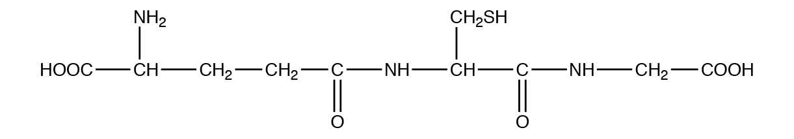
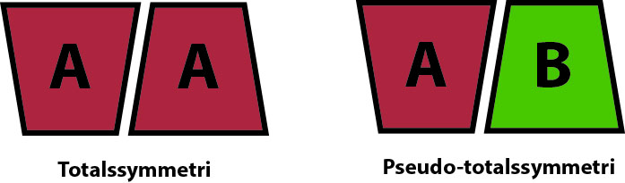



I dette TØ sæt arbejdes der på at blive introduceret til TØ formatet med gruppearbejde og præsentation af løsning på opgaver. Opgaverne drejer sig mest om repetition af viden fra tidligere kurser (Berg kapitel 1, 2 og 5) samt anvendelse af PyMOL til analyse af enzym struktur og Excel til analyse af enzym funktion.



## Opgave 1. Buffer-beregninger

Denne opgave er repetition af Berg Biochemistry kapitel 1.

En forsker forbereder en buffer af eddikesyre og natriumacetat med en pH-værdi på 5,0. Den samlede koncentration af begge komponenter i bufferen er 250 mM, og eddikesyre har en pKa-værdi på 4,75.

### Beregn bufferkomponenternes koncentrationer

Hvad er koncentrationerne af eddikesyre og natriumacetat i bufferen?

### Beregn molmængder i bufferen

Hvor mange mol eddikesyre og natriumacetat er der i 2 L af bufferen?

### Beregn gram af komponenterne

Hvor mange gram eddikesyre og natriumacetat er der i 2 L af bufferen?

Den molære masse af eddikesyre er 60,05 g/mol; den molære masse af natriumacetat er 82,03 g/mol.

::: {.callout-solution}
Berg kapitel 1 End-of-chapter problem 15. Svar findes bag i bogen eller på Achieve.
:::



## Opgave 2. Aminosyrers pKa

Denne opgave er repetition af Berg Biochemistry kapitel 2.

### Identificer ioniserbare aminosyresidekæder

Hvilke aminosyresidekæder kan almindeligvis fraspalte eller optage en proton under biologiske forhold og hvad er deres pKa-værdier?

::: {.callout-solution}
De sure sidekæder på aspartat og glutamat har en pKa på ca. 4.1 og kan dermed optage en proton herunder.

Histidin og cystein med pKa-værdier på hhv. 6.0 og 8.3 er de eneste sidekæder, der optager eller fraspalter protoner ved fysiologisk pH, men de andre aminosyrerester kan gøre det afh. af de lokale forhold.

Tyrosin og lysin har pKa tæt ved 11 og kan dermed afgive en proton herover, hvor i mod den mest basiske aminosyre, arginin, først deprotonerer ved et højere pH (pKa 12.5). 
:::

### Bestem sidekædeladning over og under pKa

Hvad er ladningen af en aminosyres sidekæde ved pH-værdier hhv. under og over denne pKa?

::: {.callout-solution}
Sidekæden vil være neutral (C-terminal, Asp, Cys og Tyr) eller positivt ladet (His, N-terminal, Lys og Arg) ved pH-værdier under pKa og neutral (His, N-terminal, Lys og Arg) eller negativt ladet (C-terminal, Asp, Cys og Tyr) over denne værdi.
:::

### Diskuter variation af aminosyre pKa

Er en aminosyres pKa altid den samme? Hvis ikke, i hvilke situationer kan pKa ændres?

::: {.callout-solution}

pKa ændrer sig som følge af det lokale miljø, aminosyren befinder sig i. Hvis en aminosyre befinder sig i et miljø afskærmet fra protondonorer eller -acceptorer, som f.eks. i et proteins centrum vil det hhv. hæve og sænke pH. pKa kan også ændres grundet ladninger af andre aminosyrer i nærmiljøet. F.eks. vil en deprotoneret Asp være mindre tilbøjelig til at optage en proton, hvis der er en protoneret Arg i nærheden. Den protonerede Arg's positive ladning vil have en stabiliserende effekt på den deprotonerede Asp og protoneringen vil have en frastødende effekt på en protoneret Asp. Protoneringen er derfor ufavorabel og pKa for den Asp vil være sænket.
:::



## Opgave 3. Glutathione

Denne opgave er repetition af Berg Biochemistry kapitel 2.

Glutathione (GSH) er en antioxidant i planter, dyr, svampe og visse bakterier og archaea. Glutathione forhindrer skade på vigtige, cellulære komponenter som følge af reaktive oxygen-forbindelser som frie radikaler, peroxider og tungmetaller.

Glutathion har følgende struktur:

{width="80%" .lightbox fig-align="center"}

Hvilke af følgende udsagn om molekylet er korrekte?

### Vurder tilstedeværelse af α-aminogruppe

Det indeholder en $\alpha$-aminogruppe.

::: {.callout-solution}

Korrekt, denne ses øverst til venstre i strukturen.

:::

### Vurder atypisk peptidbinding

Der findes en kobling mellem to aminosyrer, der adskiller sig fra den almindelige peptidbinding.

::: {.callout-solution}

Korrekt, glutamyl-cysteine koblingen er via γ-carboxylgruppen og ikke α-carboxylgruppen på glutamine.
:::

### Vurder let oxidérbar gruppe

Der findes en let oxidérbar gruppe.

::: {.callout-solution}

-CH~2~SH kan let oxideres til -CH~2~SO~3~H eller indgå i oxideret form i en disulphidbro (-CH~2~-S-S-CH~2~-).

:::

### Vurder tilstedeværelse af sekundær aminogruppe

Der findes to sekundære aminogrupper.

::: {.callout-solution}

Forkert, NH-grupperne i kæden er begge koblet til C=O grupper og er derfor *amid*grupper, ikke *amin*grupper. 
:::

### Vurder alternativ nomenklatur

Man kunne også beskrive stoffet som Glu-Cys-Gly.

Bemærk at der kan være mere end ét rigtigt svar. Argumentér for hvert af de 5 tilfælde, både dem, du mener er korrekte og dem, du mener er forkerte.

::: {.callout-solution}

Se svaret til 2.
:::


## Opgave 4. Bereging af enzymkinetik

Denne opgave er repetition af Berg Biochemistry kapitel 5.

Hydrolysen af pyrofosfat til orthofosfat driver biosyntetiske reaktioner såsom DNA-syntese. Denne hydrolytiske reaktion katalyseres i E. coli af en pyrofosfatase, der har en masse på 120 kDa og består af seks identiske underenheder. For dette enzym defineres en aktivitetsenhed som den mængde enzym, der hydrolyserer 10 μmol pyrofosfat på 15 minutter ved 37 °C under standard assaybetingelser. Det oprensede enzym har et 𝑉max på 2800 enheder pr. milligram enzym.

### Beregn $V_\mathrm{max}$ i mikromol per sekund

Hvor mange mikromol substrat hydrolyseres pr. sekund pr. milligram enzym, når substratkoncentrationen er meget større end $K_M$? Med andre ord, hvad er $V_\mathrm{max}$ for den katalyserede reaktion? Angiv mængde hydrolyseret substrat i μmol.

### Beregn antal active sites per milligram

Hvor mange mikromol active sites er der i 1 mg enzym? Antag, at hver underenhed har ét active site. Angives i μmol.

### Beregn enzymets omsætningstal

Hvad er enzymets omsætningstal i $s^{-1}$?

::: {.callout-solution}

Berg kapitel 5 End-of-chapter problem 13. Svar findes bag i bogen eller på Achieve.
:::



## Opgave 5. Analyse af Chymotrypsin i PyMOL



I denne opgave skal vi bruge PyMOL til at kigge på strukturen af chymotrypsin, som beskrives på s. 223-226 i Berg Biochemistry 10. udgave. Åbn filen `chymotrypsin.pse`, pse-filer er PyMOL session filer, som du kan dobbeltklikke på for at åbne filen i PyMOL såfremt programmet er installeret.

### Lokalisér β-barrel domænerne

Chymotrypsin består af to β-barrels kaldet domæne 1 og 2 vist med henholdsvis blåt og rødt. Lokalisér de to domæner og prøv at tænde og slukke for dem med knapperne *Domain 1* og *Domain 2* i listen til højre. Hvad karakteriserer en β-barrel?

### Undersøg den katalytiske triade

Den katalytiske triade bestående af Ser195, His57 og Asp102 befinder sig i området mellem de to domæner og er vist med grønne streger (sticks) i objektet *Triad*. Tryk F2 for at se disse aminosyrer tæt på. Hvilken rolle spiller disse for enzymet? Prøv også at identificere andre elementer i strukturen ved at tænde og slukke for dem.

### Forklar pseudo-2-talssymmetri

De to domæner ligner meget hinanden og er arrangeret med en såkaldt `pseudo-2-talssymmetri`. Tryk F1 på keyboardet for at se ned langs denne akse og F3 og F4 for at se ned langs hvert domæne. Hvad tror du en `pseudo-2-talssymmetri` er?

### Find aktiveringsskæringen ved residue 16

Når chymotrypsinogen aktiveres til chymotrypsin så bliver molekylet kløvet to steder for at producere kæderne, der her hedder A, B og C (se figur 7.17, s. 224 i Berg Biochemistry 10. udgave). Stykket, der forsvinder mellem kæde B og C er vist med prikker i strukturen (*Loop*) og er ikke så vigtigt for aktivering. Derimod er skæringen ved residue 16 kritisk. Find residue 16 og forklar hvorfor denne aminosyre er vigtig for aktivering af chymotrypsin.

OBS: Mac-brugere skal **holde *fn*-tasten nede** når de trykker på F1, F2, F3 osv, da disse taster også bruges til at styre skærmens lysstyrke etc. på MacBooks.

::: {.callout-solution}

**1.** En β-barrel er et kurvet β-sheet, der folder rundt således at den sidste strand hydrogenbinder til den første.

**2.**  De tre aminosyrer er vigtige for den enzymatiske reaktion. Kort fortalt hjælper Asp og His med til at Ser bliver deprotoneret og danner en alkoxidion, der kan angribe peptidbindingen under kløvningsreaktionen (se Fig. 9.8, Berg et al. 10. udgave, s. 279).

**3.**  En `pseudo-symmetri` er en ikke helt streng symmetri, dvs. vil to forskellige proteiner, der har lignende fold og er arrangeret 180 grader i forhold til hinanden kunne siges at have `pseudo-totalssymmetri`, mens det ville være en egentlig totalssymmetri, hvis det drejede sig om to helt ens molekyler:

{width="5.28125in" height="1.5625in"}

**4.** Den nye aminoterminal (N-terminal), der dannes ved aminosyre 16 når peptidbindingen mellem 15 og 16 kløves bevæger sig ind i det aktive site og er med til at danne det såkaldte "oxyanionhul".
:::