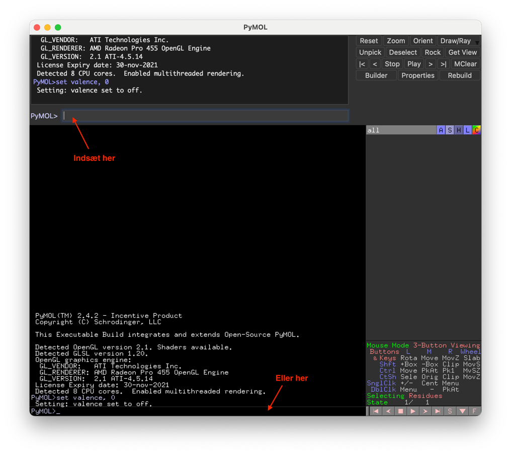
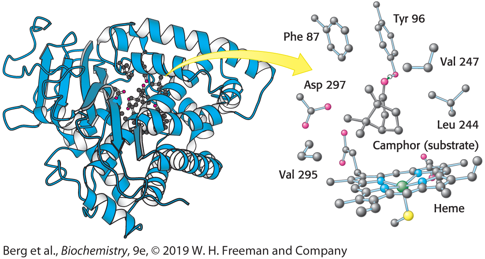

## Opgave 1. Selektioner og objekter i PyMOL

Formålet med denne opgave er at forstå forskellen på selektioner og objekter i PyMOL, hvilket er meget vigtigt for at kunne bruge programmet effektivt.

Basalt set er,

- **objekt**: En struktur eller gruppe af atomer inkl. deres position, atomtype, okkupans og temperaturfaktor. Du kan tænke på et objekt som selve strukturen eller PDB-filen. Et objekt dannes vha. kommandoen `create`.

- **selektion**: Et udvalg af atomer eller kæder i et objekt. Det er vigtigt at forstå at en selektion ikke selv indeholder strukturen, men kun er et udvalg af atomer i et andet objekt. En selektion dannes vha. kommandoen `select`

Et objekt kan altså godt eksistere uden en selektion, men en selektion kan ikke findes uden et objekt (i hvert fald ikke med indhold).

### Hent K^+^-kanalstrukturen 1BL8

Hent strukturen af K+-kanalen fra Streptomyces fra forrige opgave med kommandoen `fetch 1BL8`. Kommandoer kan enten tastes øverst eller nederst i vinduet hvor der står "PyMOL>". I denne og følgende opgaver på kurset vil følgende angive en kommando, der skal skrives i PyMOL (eller stå i et script):

```default
fetch 1BL8
```

::: {.solution-callout}
Log fra PyMOL:

```default
PyMOL>fetch 1BL8
TITLE     POTASSIUM CHANNEL (KCSA) FROM STREPTOMYCES LIVIDANS\
ExecutiveLoad-Detail: Detected mmCIF\
CmdLoad: loaded as `1BL8`.
```
:::


### Dan en selektion af kæde A

Dan en ny selection bestående af kæde A i strukturen:\

```default
select select_A, chain A
```

Her er `select_A` navnet på den nye selektion mens "chain A" fortæller PyMOL at selektionen skal bestå af kæde A. Bemærk at der kommer en ny selektion i listen til højre og at navnet står i parentes, hvilket angiver en selektion. PyMOL viser også selektionen med "selection handles" for hvert atom (små firkanter på strukturen). En selektion fungerer lidt som i andre programmer, du kender, f.eks. forsvinder "selection handles", hvis man klikker udenfor selektionen. De kommer tilbage ved at klikke på selektionens navn `(select_A)`. Man kan altså hhv. vælge og ikke vælge atomerne ved at klikke på navnet.

::: {.solution-callout}
Log fra PyMOL:

```default
PyMOL>select select_A, chain A
Selector: selection `select_A` defined with 708 atoms.
```
:::

### Test selektion- og objektsynlighed

Prøv at vælge selektionen så de små selection handles vises. Sluk nu for hovedobjektet `1BL8` og bemærk at hele strukturen forsvinder, mens selektionen stadig vises. Der er ingen atomer i selektionen, så hvis man slukker for hovedobjektet, ses strukturen ikke.

### Dan et nyt objekt af kæde A

Dan nu et nyt objekt bestående af kæde A i strukturen:\

```default
create object_A, chain A
```

Her er `objekt_A` navnet på det nye objekt mens "chain A" fortæller PyMOL at objektet skal bestå af kæde A. Bemærk at der kommer et nyt objekt i listen til højre og at navnet står uden parentes (og har en 1/1 state), hvilket angiver et objekt. PyMOL centrerer også synsfeltet på det nye objekt.

::: {.solution-callout}

Log fra PyMOL:

```default
PyMOL>create object_A, chain A
Selector: found 708 atoms.
Executive: object `object_A` created.
```
:::

### Sammenlign objekt og selektion

Ved at oprette et nyt objekt har vi i praksis lavet en kopi af en del af strukturen (atompositioner etc.), så vi nu har to kæde A. Prøv at skjule det oprindelige objekt 1BL8 (klik på objektnavnet) og se at vi stadig kan se den ene kæde i chain_A. Vi har nu to strukturer af kæde A.

Forskellen på objekter og selektioner kan virke pedantisk og unødvendig, men det er vigtigt at du forstår ovenstående og er helt klar på forskellen mellem de to typer i PyMOL. Her er nogle eksempler på hvad de kan bruges til:

selektioner - bruges ofte til at vælge en del af strukturen med henblik på at vise den i en anden repræsentation eller farve.\
objekter - bruges til at arbejde uafhængigt med en del af stukturen samt i visse tilfælde hvor man vil vise en struktur i flere repræsentationer samtidig.

### Farv selektion og objekt forskelligt

Prøv at farve selektionen select_A rød og objektet object_A blåt. Tænd og sluk nu for 1BL8 og object_A for at se hvad der er sket. Vi har nu de to kopier af kæde A i to forskellige farver. De er naturligvis perfekt overlejrede, så afhængig af hvilken der sidst har været vist, ses kæden enten som rød eller blå. Vi kan arbejde med de to kopier uafhængigt af hinanden, f.eks. overlejre object_A på en anden struktur, uden at det påvirker 1BL8. Overlejrer vi derimod selektionen select_A vil hele strukturen 1BL8 blive flyttet. Mere om det senere. 

Læs mere om selektioner i PyMOL [**[her]{.underline}**](https://pymolwiki.org/index.php/Selection_Algebra).


## Opgave 2. Kæder, residues og atomer i PyMOL

Nu hvor du forstår forskellen på selektioner og objekter, skal vi tale om PyMOL's generelle selektion kaldet **sele**. Denne opstår når man klikker med musen på en struktur eller vælger en del af sekvensen ud. 

### Hent 1BL8 og ryd PyMOL

Hent strukturen af Streptomyces K+-kanalen som i de forrige opgaver (fetch 1BL8). Har man allerede startet PyMOL og vil slette alt, kan man skrive kommandoen reinit (reinitialize), eller vælge File->Reinitialize->Everything fra menuen.

### Vis 1BL8 som sticks med atomfarver

Vis 1BL8 som sticks og zoom lidt ind med musen (huske at skjule cartoon-repræsentationen først). Farv den med atomfarver med carbon i gult.

### Identificer Phe103 ved museklik

Midt i kanalen findes en stor hydrofob aminosyre, Phe 103, nær en kavitet. Phenylringen er rimelig tydelig. Klik med musen for at identificere aminosyren og vælge den i sele. Hvis du rammer forkert, klik da udenfor strukturen for at slette selektionen igen. Når man klikker på et atom, skriver PyMOL:

> You clicked /1BL8/A/A/PHE\`103/CG\
> Selector: selection `sele` defined with 11 atoms.\
    
Informationen fortæller os at i objektet 1BL8, segment A, kæde A klikkede vi på residue Phe103 og atomet CG (Cγ). I praksis er segment ID altid lig med kæde ID, så derfor står der A to gange. PDB-formatet understøtter ikke græske tegn, så derfor er atomnavnene oversat til latinske bogstaver:

  ---------------------
   Atomnavn   PDB-navn
  ---------- ----------
      α          A

      β          B

      γ          G

      δ          D

      ε          E

      ζ          Z

      η          H
  ---------------------

### Forstå PDB-atomnomenklatur

Cα hedder altså CA, Oγ hedder OG og så fremdeles. Nogle gange (f.eks. i Asp) kan der være to ens atomer på samme position, hvorved de navngives 1 og 2, f.eks. hedder de to carboxylatatomer i Asp OD1 og OD2.

### Skift selektionsmode og navngiv selektion

Bemærk at selektionen vælger hele residuet (11 atomer) når man klikker på ét atom. Dette styres i menuen Mouse > Selection Mode. Skift selection mode til "Chains" og brug dette til at vælge hele kæde A. Nu kan vi omdøbe den generelle selektion til noget andet, så vælge "rename selection" i Action-menuen for sele og navngiv den `select_A`. Skift tilbage til selection mode `Residues` og vælg Phe103 i kæde A igen. Bemærk at der nu kommer en ny sele-selektion. På denne måde kan man opbygge selektioner uden brug af kommandoer.

### Dan selektioner med PyMOL-nomenklatur

Vi kan også bruge nomenklaturen ovenfor til at danne en selektion med CG-atomet fra Phe 103:\

```default
select 103CG, /1BL8/A/A/PHE\`103/CG
```

Det lille `backquote` (\`) kan godt drille, men det behøves heldigvis heller ikke:\

```default
select 103CG, /1BL8/A/A/103/CG
```

Man behøver heller ikke give alle felterne, hvis de ikke er nødvendige, f.eks. i dette tilfælde er der kun én struktur, så vi kan nøjes med\

```default
select 103CG, A/103/CG
```

Når du laver selektioner, så husk at tjekke at det forventede antal atomer vælges ved at se hvad PyMOL skriver:

> Selector: selection `103CG` defined with 1 atoms.

### Anvend delvise selektionsstier

Hvis man kun benytter en del af felterne er reglen at hvis udsagnet starter med / så skal man have alt med fra venstre men må godt stoppe halvvejs. Starter udsagnet ikke med / fortolkes det som at starte fra højre. Eksempler:\
\
Vælg hele kæde A (fra venstre):\

```default
select chain_A, /1BL8/A/A
```

Vælg hele residue 103 i kæde A (fra venstre):\

```default
select A103, /1BL8/A/A/103
```

Vælg kun CG i residue 103 (fra højre):\

```default
select 103CG, 103/CG
```

Hvor mange atomer vælges i dette tilfælde? Hvorfor?

### Vælg residues med udeladt information

En anden nyttig regel er at man kan udelade noget af informationen for at vælge alt, f.eks. vil \

```default
select res103, /1BL8///103
```

vælge alle residues i strukturen 1BL8 med residuenummer 103. Hvor mange atomer/residues er det?\

Da der kun er ét objekt, kunne vi endda bare sige,

```default
select res103, ////103
```

### Vælg residues i et interval

Man kan også angive en range af residues vha. en bindestreg, f.eks. vil\

```default
select A103-105, /1BL8//A/103-105
```

vælge residues 103-105 i kæde A.

### Vælg residues fra proteinsekvensen

Endelig kan man vælge residues i proteinsekvensen. Vælg Display->Sequence fra menuen og træk fra residue Arg27-Leu36 i sekvensen for at vælge det. Find selv ud af hvordan man vælger i de andre kæder (Hint: Sæt først kæderne til forskellige farver, da de vises i sekvensen).

### Lav specifikke navngivne selektioner

Brug nu select-statements og nomenklaturen ovenfor til at lave følgende selektioner. Brug forskellige, fornuftige navne til dem alle:

- Residues 110-120 i kæde B.
- Alle residues i kæde D.
- Alle Cα-atomer i kæde A.
- Residue Trp87 i kæde D.
- Atomet Nε1 i Trp87 i kæde D.
- Alle Phe-residues i strukturen.

### Visualiser strukturen med selektioner

Brug dine selektioner til at vise hele strukturen i cartoon med en lys grøn farve, farv kæde D mørkegrøn, farv alle Phe-residues i strukturen røde, vis Trp87 i kæde D med sticks og atomet Nε1 med en blå sphere. Vis alle Cα-atomer i kæde A med røde spheres. Farv området 110-120 i kæde B gult.

### Diskuter farveændring ved Cα-farve

Hvad skete der med cartoon-farven i kæde A, da du ændrede farven på Cα-atomerne? Diskutér.

Læs mere om selektioner i PyMOL [**[her]{.underline}**](https://pymolwiki.org/index.php/Selection_Algebra).

::: {.solution-callout}

**1.**  Log fra PyMOL:

```default
PyMOL>fetch 1BL8\
TITLE     POTASSIUM CHANNEL (KCSA) FROM STREPTOMYCES LIVIDANS\
ExecutiveLoad-Detail: Detected mmCIF\
CmdLoad: loaded as `1BL8`.
```

**2.** Log fra PyMOL:

```default
PyMOL>show sticks, 1BL8
PyMOL>color yellow, 1BL8
Executive: Colored 2824 atoms and 1 object.
PyMOL>util.cnc 1BL8
Executive: Colored 948 atoms.
```

**3.**  \-

**4.**  \-

**5.**  Log fra PyMOL:

```default
Setting: mouse_selection_mode set to 2.
You clicked /1BL8/A/A/VAL\`97/CB
Selector: selection `sele` defined with 705 atoms.
```

**6.**  \-

**7.** Log fra PyMOL:

```default
PyMOL>select chain_A, /1BL8/A/A
Selector: selection "chain_A" defined with 705 atoms.

PyMOL>select A103, /1BL8/A/A/103
Selector: selection `A103` defined with 11 atoms.

PyMOL>select 103CG, 103/CG
Selector: selection `103CG` defined with 4 atoms.
```

4 atomer, ét CG-atom på residue 103 i hver af de fire kæder.    

**8.** Log fra PyMOL:

```default
PyMOL>select res103, /1BL8///103
Selector: selection `res103` defined with 44 atoms.
```
44 atomer
```default
PyMOL>select res103, ////103
Selector: selection `res103` defined with 44 atoms.
```

**9.** Log fra PyMOL:

```default
PyMOL>select A103-105, /1BL8//A/103-105
Selector: selection `A103-105` defined with 23 atoms.
```

**10.** Kæderne vises efter hinanden i sekvensen. Sætter man farver på kæderne følger sekvensen efter med samme farve. 

**11.** 

```default
select resiB110-120, ///B/110-120
```

```default
select chainD, ///D
```

```default
select chainA_CA, ///A//CA
```

```default
select TrpD87, ///D/87
```

```default
select TrpD87NE1, ///D/87/NE1
```

```default
select Phe, ////Phe
```

**12.** Log fra PyMOL:

```default
PyMOL>hide all
PyMOL>show cartoon, 1BL8
PyMOL>color limegreen, 1BL8
 Executive: Colored 2824 atoms and 1 object.
PyMOL>color forest, chainD
 Executive: Colored 705 atoms.
PyMOL>color red, Phe
 Executive: Colored 88 atoms.
PyMOL>show sticks, TrpD87
PyMOL>show nb_spheres, TrpD87NE1
PyMOL>color tv_blue, TrpD87NE1
 Executive: Colored 1 atom.
PyMOL>show nb_spheres, chainA_CA
PyMOL>color red, chainA_CA
 Executive: Colored 97 atoms.
PyMOL>color yellow, resiB110-120
 Executive: Colored 82 atoms.
```

**13.** Cartoon-farven styres af CA-atomerne, så hvis man farver dem ændrer cartoonen også farve. Løsningen, hvis man vil vise CA og sidekæde i én farve og cartoon i en anden, er at oprettet et nyt objekt (ikke en selektion) med de udvalgte residues. Dette trick benyttes meget ofte til figurer.

:::


## Opgave 3. Avancerede selektioner og boolsk algebra i PyMOL

Nomenklaturen for atom-selektion, som vi arbejdede med i forrige opgave, er nyttig men bliver hurtigt kompleks og svær at læse. Derfor kan man opnå det samme i PyMOL med mere letlæselige kommandoer, hvoraf de vigtigste er,

**chain** - vælger en kæde\
**resi** - vælger residues efter deres nummer\
**resn** - vælger residues efter deres navn (aminosyre trebogstavkode)\
**name** - vælger atom efter navn

Disse kan kombineres med de boolske operatorer OR, AND og NOT, hvor OR giver foreningsmængden af to selektioner og AND fællesmængden. 

### Hent 1BL8 og lav kædeselektioner

Start PyMOL og hent strukturen af Streptomyces K+-kanalen i 1BL8. Lav en selektion af kæde A, som vi gjorde i opgave 1,\

```default
select chainA, chain A
```

Lav en anden selection med Trp87 i kæde D vha. AND-operatoren:\

```default
select D87, chain D and resi 87
```

Bemærk at "chain D" vælger alle atomer i kæde D mens `resi 87` vælger alle atomer med residuenummer 87. AND giver fællesmængden, hvilket er alle atomer, der både er i kæde D og i residue 87.\
\
Husk som altid at tjekke at du får det forventede antal atomer. PyMOL skriver,\

```default
Selector: selection `D87` defined with 14 atoms.
```

14 atomer er som forventet antallet i én Trp. Fint.

### Sammenlign AND og OR operatorer

Mange begyndere bliver ofte usikre på om de skal bruge AND eller OR. Hvad ville resultatet være ved at skrive,\

```default
select D87, chain D or resi 87
```

Prøv det og forklar resultatet. 

### Vælg atomer med name og resn

På samme måde kan man vælge atomer efter navn (se forrige opgave) med "name" og residues efter navn (f.eks. Trp) vha. "resn". Skriv nu kommandoer til at lave selektionerne fra før og giv dem fornuftige navne,
   
- Residues 110-120 i kæde B.
- Alle residues i kæde D.
- Alle Cα-atomer i kæde A.
- Residue Trp87 i kæde D.
- Atomet Nε1 i Trp87 i kæde D.
- Alle Phe-residues i strukturen.

### Kombiner selektioner med OR-operatoren

Foreningsmængde-operatoren OR benyttes når man skal vælge mere end én ting, f.eks. vælges både kæde A og B således,

```default
select chainsAB, chain A or chain B
```

Skal man kombinere AND or OR bliver det vigtigt at benytte parenteser, f.eks. vil udsagnet\

```default
select my_res, (chain A and resi 87) or (chain B and resi 110-120)
```

vælge både residue 87 i kæde A og residues 110-120 i kæde B i én selektion.

### Generer specifikke selektioner

Brug nu ovenstående viden til at generere følgende selektioner,

- Residues 10-30 i kæde A og kæde B.
- Atomet Cα i residue 87 i kæde A samt samme atom i residue 86 i kæde B.
- Alle Cys-residues i kæde A og alle Met-residues in kæde B.

### Identificer og farv den lange helix

Vis strukturen som ribbon for at lette identifikationen af Cα-atomer. Identificér start og slut residues for den lange, yderste helix i strukturen, der er én i hver kæde, så det er lige meget hvilken du bruger.\
\
Lav en selektion, der indeholder hele den lange helix i alle kæder og farv dem røde. 

### Farv strukturen undtagen N-terminalen

Hvis man vil vælge det hele, men undlade en lille del, kan negationsoperatoren NOT være nyttig. F.eks. vil,\

```default
select noNterm, 1BL8 and not resi 1-30
```

vælge hele strukturen pånær de N-terminale residues 1-30. Prøv at farve alt undtagen N-terminalen blå.

### Vælg kæde A uden Cys-residues

Lav en selection, der vælger alle residues i kæde A, undtagen Cys-residues.

Læs mere om selektioner i PyMOL [**[her]{.underline}**](https://pymolwiki.org/index.php/Selection_Algebra).


::: {.solution-callout}

**1.**  \-

**2.**  Vi ville vælge både hele kæde D og residue 87. 

**3.**  

```default
select resiB110-120, chain B and resi 110-120\

select chainD, chain D

select chainA_CA, chain A and name CA

select TrpD87, chain D and resi 87 (and resn Trp)

select TrpD87NE1, chain D and resi 87 and name NE1

select Phe, resn Phe
```

**4.**  \-

**5.**

```default
select ResAB1030, (chain A or chain B) and resi 10-30
select A87CaB86Ca, (chain A or chain B) and (resi 87 and name CA)
select ACysBMet, (chain A and resn cys) or (chain B and resi Met)
```

**6.**  Cirka residues 23-51:

```default
select helix, resi 23-51\
color red, helix
```

**7.**  

```default
hide all
show ribbon
select longhelix, resi 24-50
color red, longhelix
```

**8.**  

```default
select notAcys, (chain A and not resn cys)
```

::: 

## Opgave 4. Scripting i PyMOL

Scripting dækker over en form for programmering, hvor de enkelte kommandoer fortolkes løbende uden at kildekoden først skal oversættes til en binær fil af en compiler. Det kan også kaldes macro-programmering, da vi skaber et lille program ved at sammensætte en række kommandoer, der udføres én ad gangen.

PyMOL-scripts kan indeholde PyMOL-kommandoer som dem vi har set indtil nu (select, create, show, hide) eller Python-instruktioner, der giver mulighed for meget avancerede scripts med loops, if-then-else statements osv. Python-programmering i PyMOL dækker vi senere på dette kursus, hvor vi inddrager det, I lærer om Python på Bioinformatik-kurset direkte i scripts i PyMOL.

Et PyMOL-script består af en tekstfil med enten .pml (Python macro language) eller .py (python) efternavn. Det anbefales, at du opretter en folder til dine scripts, så du senere kan finde dem frem igen. Scripts kan kaldes direkte inde fra PyMOL vha `@`-funktionen, men her vil vi starte med at kopiere scriptet og indsætte det på PyMOL's kommandolinje.

Til redigering af scripts skal du bruge en plain text-editor, som [VS Code](../other_notes/installation_vscode.qmd). 

PyMOL-scripts er typisk opbygget på følgende måde:

1. Først initialiseres og generelle indstillinger sættes
2. PDB-filer indlæses
3. Objekter og selektioner defineres
4. Evt. alignments udføres
5. Visualiseringer sættes op
6. Orienteringen (synsvinklen) sættes

Gør nu følgende

### Opret scriptet k-channel.pml

Opret et nyt script i din editor og gem det som `k-channel.pml`.

### Initialisér scriptet

Start scriptet med at reinitialisere. Dette er rart, da man næsten altid kører scriptet mange gange under udviklingen og gerne vil have en "ren tavle" uden at genstarte PyMOL:
```default
reinitialize
```

### Hent PDB-filen i scriptet

Skriv nu kommandoen til at hente PDB-filen:

```default
fetch 1BL8, kchannel, async=0
```

Her vælger vi at omdøbe objektet med det samme, så det hedder "kchannel` i stedet for `1BL8". Det er en god idé, når man har mange strukturer og svært ved at huske dem fra hinanden. "async=0" sikrer at scriptet ikke kører videre før PDB-filen er helt indlæst.

### Skjul standardvisning

Vi ved at PDB-filen kommer ind som cartoon som standard, så lad os fjerne det hele, så vi kan starte på en frisk:

```default
hide all
```

### Opret selektioner for kæder

Skriv kommandoer til oprettelse af selektioner for hver kæde kaldet "chainA`, `chainB`, `chainC` og `chainD".

### Farv kæderne med color-kommandoen

Skriv kommandoer til at farve kæderne i forskellige farver vha. selektionerne, hertil benyttes kommandoen `color`, f.eks. vil

```default
color tv_blue, my_selection
```

farve selektionen my_selection blå. Du kan få inspiration til farver i Color-menuen, eller [**på denne side**](https://pymolwiki.org/index.php/Color_Values). Det er en god regel ikke at bruge de primære farver (red, blue, green, yellow, magenta, cyan), da de ikke kan repræsenteres korrekt på både skærm og papir. Det ser også mere professionelt ud at vælge nogle mere raffinerede farver, som f.eks. `beryllium` eller "gadolinium". Du kan finde alle farver registret i PyMOL på følgende link; <https://pymolwiki.org/index.php/Color_Values>.

### Vis strukturen som ribbon

Lad os nu vise hele strukturen som ribbon:

```default
show ribbon, kchannel
```

Bemærk at kommandoerne `show` og `hide` benyttes til at gribe ned i menuerne til højre uden at klikke på dem.

### Hent og indsæt set_view

Orientér nu strukturen som du gerne vil have den skal se ud (zoom, centrering, rotation). Brug venstre museknap til at rotere,  højre museknap til at zoome og tryk på hjulet for at centrere. Skriv nu kommandoen (på kommandolinjen, ikke i scriptet):

```default
get_view
```

PyMOL giver os nu en 3x6 matrix, der fuldstændig definerer synsvinklen, som det output der er vist nedenfor. Kopiér følgende,
```default
set_view (\
    0.649728715,   -0.607225955,    0.457305670,\
    -0.557611287,    0.028152177,    0.829624295,\
    -0.516643345,   -0.794027805,   -0.320305407,\
    0.000000000,    0.000000000, -203.462997437,\
    72.186561584,   26.599575043,   19.889984131,\
164.716903687,  242.209091187,  -20.000000000 )
```
fra PyMOL og indsæt det nederst i dit script. 

### Fjern resterende selektion

Afhængig af hvordan, du har skrevet scriptet vil du muligvis opleve, at der vises en resterende selektion, når scriptet er kørt. For at undgå dette og fjerne den sidst valgte gruppe af atomer, indsæt kommandoen:

```default
deselect
```

Ifm. TØ kan det være smart at gemme flere forskellige views eller repræsentationer af strukturen i såkaldte "scenes", som let kan frembringes ved at klikke på knapperne nederst til venstre i PyMOL eller trykke F1, F2, F3\...\
For at gemme det nuværende view som en scene, bruges følgende kommando, som indsættes efter set_view-matricen ovenfor:

```default
scene overview, store
```

Dette gemmer den nuværende visning i en scene kaldet `overview`. Bemærk at man ikke kan bruge F-tasterne for at frembringe denne scene, da den er navngivet noget andet end F`-`. Man kan derfor i stedet enten trykke på den lille firkant med navnet `overview` i nedre venstre hjørne eller man kan skrive kommandoen; scene overview, recall.

### Kør og test scriptet

Du har nu et komplet PyMOL-script, der først initialiserer, så henter PDB-filen, definerer selektioner og bruger dem og endelig sætter repræsentation og view. Test scriptet ved at kopiere hele teksten og indsætte den ind på PyMOL's kommandolinje, enten øverst eller nederst, som angivet nedenfor. Tryk Enter/Return for at køre scriptet.
{width="80%" fig-align="center"}

### Orienter molekylet og test

Prøv at orientere molekylet på en anden måde og tjek at du kommer tilbage til start ved at klikke `overview` nederst.

### Opret K^+^-ion selektion

Nu skal vi oprette et nyt view, der viser detaljer i K^+^-kanalens såkaldte selektivitetsfilter, der er med til at sikre, at kun K^+^-ioner kan passere. Denne del af scriptet skrives efter ovenstående og vil blive gemt i en ny scene. Opret først en ny selection med ionerne:\

```default
select k_ions, elem K
```

Dette udvælger alle atomer med grundstof K.

### Vis ionerne som nb_spheres

Vis ionerne som non-bonded spheres (nb_spheres), der er mindre end alm. `spheres`, der viser VDW-radius:\

```default
show nb_spheres, k_ions
```

Sæt også en passende farve på objektet efter frit valg.

### Opret selektivitetsfilter selektion

Opret nu en selektion med kanalens selektivitetsfilter. Dette ligger i residues 75-78 i alle kæder, så vi kan nøjes med at skrive:\

```default
select filter, resi 75-78
```

Vis filteret som `sticks` og find en god orientering, der viser filteret og ionerne oppefra. Indsæt orienteringen i scriptet.

### Gem filter-scenen

Gem slutteligt den nye visning i scenen `filter`.

### Hent overview-scenen igen

Scriptet skal vise `overview` først, så afslut af med at hente den ind igen:

```default
scene overview, recall
```

### Kør og verificer scriptet

Kør det samlede script i PyMOL og check at der er to views, som man hurtigt kan skifte i mellem.

::: {.solution-callout}

Eksempel på færdigt script:

```default
reinitialize

fetch 1BL8, kchannel, async=0

hide all

select chainA, chain A
select chainB, chain B
select chainC, chain C
select chainD, chain D

color tv_blue, chainA
color tv_orange, chainB
color magenta, chainC
color yellow, chainD

show ribbon, kchannel

set_view (\
0.649728715, -0.607225955, 0.457305670,\
-0.557611287, 0.028152177, 0.829624295,\
-0.516643345, -0.794027805, -0.320305407,\
0.000000000, 0.000000000, -203.462997437,\
72.186561584, 26.599575043, 19.889984131,\
164.716903687, 242.209091187, -20.000000000 )

deselect

scene overview, store

select kions, elem K

show nb_spheres, kions

color palegreen, kions

select filter, resi 75-78

show sticks, filter

set_view (\
0.888863146, 0.193117291, -0.415483952,\
0.192342117, -0.980332971, -0.044177610,\
-0.415844947, -0.040646739, -0.908524752,\
0.000000000, 0.000000000, -61.653659821,\
67.867996216, 26.594999313, 9.017000198,\
45.950794220, 77.356529236, -20.000000000 )

deselect

scene filter, store

scene overview, recall
```
:::

## Opgave 5. Strukturel analyse i PyMOL

***PyMOL scripting opgave:** I vil i denne opgave blive introduceret for PyMOL-værktøjet Wizard measurement, som i senere vil kunne bruge til analyse af interaktioner.*

Et vigtigt element i strukturel analyse er at kunne analysere interaktioner og detaljer i det aktive site eller mellem proteiner i et kompleks.

I denne opgave skal vi kigge på et eksempel, der er nævnt i kapitel 8 i Stryer, strukturen af cytochrome P450 bundet til substratet camphor (Fig. 8.5):

{width="60%"  fig-align="center"}

Vi vil gerne lave et PyMOL-script, der sætter os i stand til at foretage en grundig, strukturel analyse af hvordan camphor binder til proteiner, herunder hvilke typer af interaktioner (H-bindinger, Van der Waals- og hydrofobe interaktioner), der findes.

### Hent og initialiser P450 scriptet

Start et ny PyMOL-script i VS Code med at reinitialisere og hent dernæst strukturen ovenfor via PDB-koden 2CPP, kald objektet cytochrome og skjul alle repræsentationer:

```default
reinitialize
fetch 2CPP, cytochrome, async=0
hide all
```

### Vis strukturen som lyseblå cartoon

Vis hele strukturen i lyseblå cartoon (som ovenfor):

```default
show cartoon, cytochrome
color skyblue, cytochrome
```

### Lav selektioner for hæm og camphor

Nu skal vi lave en selection med substratet, men vi ved ikke hvad det er kaldet i PDB-filen. Et godt tip til at finde ud af dette er at slå strukturen op på RCSB: [https://www.rcsb.org/structure/2cpp](https://www.rcsb.org/structure/2cpp). Under `Small molecules` kan man se at der både findes en hæme prostetisk gruppe (kaldet HEM) og liganden camphor (CAM). Disse tre-bogstavsforkortelse henviser til det, der står ud for "residue name" i PDB-filen, dvs. at vi skal bruge kommandoen "resn" til at vælge dem:

```default
select heme, resn HEM
select camphor, resn CAM
```

### Lav selektion for active site

Vi vil også gerne have en selektion med alle de sidekæder, der interagerer med substratet, hvilket kan ses af figuren fra lærebogen:

```default
select activesite, resi 87+96+297+247+244+295
```

### Vis selektioner som sticks

Nu viser vi alle tre selektioner som sticks:

```default
show sticks, heme or camphor or activesite
```

Bemærk brugen af den boolske operator OR her, som betyder at vi ønsker foreningsmængden af de tre selektioner, altså alle atomer, der ENTEN er i heme, i camphor, eller activesite.

### Verificer aminosyrenummerering

Klik på et par af de udvalgte aminosyrerester for at forsikre dig at nummereringen i strukturen passer med lærebogen.

### Tilpas activesite-selektionen

Kig nærmere på det aktive site, der er helt blåt. Bemærk at udover sidekæderne i det aktive site vises også hver aminosyres hovedkæde, hvilket vi ikke ønsker, da det forstyrrer når kun sidekæderne interagerer. For at fjerne disse må vi tilpasse udtrykket for activesite-selektionen. Ret derfor linjen ovenfor startende med `select` i dit script til følgende.

```default
select activesite, resi 87+96+297+247+244+295 and (sidechain or name CA)
```

Det tilføjede siger at vi ønsker alle atomer der opfylder at de befinder sig i de nævnte residues OG enten er sidekæde eller C-alpha (CA). PyMOL regner CA med til hovedkæden, så hvis vi ikke ønsker at sidekæderne skal flyve i fri luft er den en god idé at have det med.

Kør scriptet igen og tjek at alt fungerer som ønsket nu.

### Farv hæm og camphor i scriptet

Nu vil vi gerne kigge på interaktioner, men de er lidt svære at se når alle atomer er blå. Vi kan dog ændre farverne for hæme og camphor samt benytte utility-funktionen CNC (Color Not Carbon), der farver alle atomer (pånær carbon) efter almindelige atomfarver. Den ligger i util-modulet og skal derfor kaldes på denne måde:

```default
color palegreen, camphor
color firebrick, heme
util.cnc
```

Bemærk at kommandoen ikke ændrede farven på carbon-atomerne i objektet og disse dermed bibeholder deres oprindelige farve.

### Find passende view til active site

Indsæt nu en kommando så ingen atomer er valgt og find et passende view, der sætter dig i stand til at analysere interaktionerne i det aktive site. Husk at du kan bruge midterste museknap til at centrere, f.eks. på camphor, og hjulet til at skjule ikke-relevante dele af proteinet.

### Gem oversigt og active site scener

Find også en god oversigtsorientering og gem de to som scener under `overview` og `active site`.


::: {.callout-note}

## PyMOL info

PyMOL er udstyret med en funktion til interaktivt at måle afstanden mellem to atomer i strukturen. Under fanebladet "Wizard" ligger værktøjet "Measurement", der tillader brugeren at finde afstanden mellem to atomer i 3D-strukturen blot ved at klikke på først det ene og så det andet atom. Når der klikkes på et atom, anføres dette i logbogen øverst og et objekt ved navn measure## i objektoversigten til højre (hvor \## er nummeret på målingen). For at afslutte brugen af værktøjet klikkes på "Done" i nederste højre hjørne.*
:::

### Analysér interaktioner i active site

Brug nu `active site`-scenen til at analysere interaktionerne mellem cytochrome P450 og camphor/heme. Hvilke typer interaktioner findes der? Hint: Brug `Wizard -> Measurement` til at måle afstande. 

::: {.solution-callout}

1-10.

```default
reinitialize

fetch 2CPP, cytochrome, async=0

hide all

show cartoon, cytochrome

color skyblue, cytochrome

select heme, resn HEM

select camphor, resn CAM

select activesite, resi 87+96+297+247+244+295 and (sidechain or name CA)

show sticks, heme or camphor or activesite

color palegreen, camphor

color firebrick, heme

util.cnc

deselect

set_view (\\

-0.990387917, -0.044599514, -0.130925521,\\

-0.081105977, 0.954023838, 0.288548470,\\

0.112036534, 0.296393573, -0.948471248,\\

0.000098392, -0.000049323, -214.542510986,\\

49.716114044, 42.711597443, 11.393342018,\\

195.598297119, 233.486724854, -20.000000000 )

scene overview, store

set_view (\\

-0.248216569, -0.520525157, -0.816970468,\\

-0.620001614, 0.733363092, -0.278882563,\\

0.744302213, 0.437299609, -0.504759789,\\

0.000000000, 0.000000000, -54.386898041,\\

45.986999512, 44.433998108, 12.432000160,\\

35.442684174, 73.331115723, -20.000000000 )

scene active_site, store

scene overview, recall
```

11\. 2.7 Å H-binding mellem camphors carbonylgruppe og OH-gruppen på Tyr96, hydrofobe interaktioner mellem Leu244, Val247 og den hydrofobe ring i camphor, 2.7 Å H-binding mellem den ene carboxylgruppe på heme og Asp297.

:::

## Opgave 6. Mission Impossible i PyMOL

***PyMOL scripting opgave:** I denne opgave vil i få repeteret den scripting og de kommandoer i burde være bekendt med nu.*

Denne sidste opgave er jeres svendeprøve i PyMOL-brug, de kommandoer I har lært samt scripting, inden I bliver sluppet løs på kurset. Hen ad vejen vil vi udbygge den viden, der er opbygget i denne indledende TØ, men lige nu er det vigtigt at få prøvet nogle af de ting af, du har lært. Det anbefales at opgaven laves i teams, hvor man diskuterer undervejs så alle forstår hvorfor scriptet skrues sammen som det gør.

Enzymet lysozyme (PDB-ID: 148L) findes i mange organismer, hvor det bruges til at angribe bakterier ved at kløve sukkerstoffer i deres cellevæg. Til opgaven skal I bruge strukturen af lysozyme kovalent bundet til et fragtment af cellevæggen i *E. coli*.

### Slå lysozym op og identificer interaktioner

Slå strukturen op på [**www.rcsb.org**](http://www.rcsb.org) og hent den ind i PyMOL.

1.  Brug den indledende visning til at finde ud af hvilke kædenavne, der er brugt for lysozym og de to substratfragmenter. Tjek dette med hjemmesiden for at se om det stemmer overens.

2.  Vælg **H->water** og **S->lines** for at vise detaljer for hele strukturen og skjule vand. Brug dette til at identificere (og nedskrive) en liste af aminosyrerester, der interagerer med substraterne.

### Opret PyMOL-script til lysozym

Opret et PyMOL-script, der gør følgende:

1.  Initialiserer og henter strukturen ind i programmet som `148L`.

2.  Skjuler alt.

3.  Opretter selektioner for lysozym og de to substrater.

4.  Viser lysozym som cartoon i `violetpurple`.

5.  Viser substraterne som sticks i to forskellige farver for kulstof og atomfarver for de andre atomer.

6.  Opretter selektion for de rester, der interagerer og viser sidekæder for interaktionerne i violetpurple med atomfarver for andre end carbon.

7.  Sørger for at ingen atomer er valgt.

8.  Gemmer både en oversigts- og to detaljevisninger i tre scenes, `overview` samt `cell wall` og `sugar`, der fokuserer hhv. på de to substratdele.

### Analysér interaktioner med substraterne

Brug dit script til at analysere interaktionerne mellem lysozym og de to substrater. Hvilke typer interaktioner findes der? Hvilken aminosyrerest er kovalent forbundet til substrat?


::: {.solution-callout}

**1.**  Interaktionerne er ikke meget specifikke, så der er flere muligheder. Et svar kunne være resterne 104, 70, 11, 145, 106, 26, 35, 166, 114 og 137.

**2.**  Eksempel på script:

```default
reinitialize

fetch 148L, async=0

hide all

select lysozyme, chain E

select cellwall, chain S

select sugar, chain A

select interactions, chain E and resi 104+70+11+145+106+26+35+166+114+137

deselect

show cartoon, lysozyme

color violetpurple, lysozyme

show sticks, cellwall or sugar

color forestgreen, cellwall

color skyblue, sugar

util.cnc cellwall or sugar

show sticks, interactions and (sidechain or name CA)

util.cnc interactions

set_view (\\

     0.639346004,   -0.096025124,    0.762897432,\\\
    -0.083554909,    0.977618158,    0.193075478,\\\
    -0.764362395,   -0.187186167,    0.617013752,\\\
     0.000135008,   -0.000186734, -141.474243164,\\    
**8.**011938095,   44.962886810,   35.425373077,\\   
    107.768066406,  175.175033569,  -20.000000000 )

scene overview, store

set_view (\\

-0.040578593, -0.737068772, -0.674594223,\\\
-0.199193776, -0.655631781, 0.728331447,\\\
-0.979117155, 0.163928986, -0.120214708,\\\
0.000133797, 0.000027474, -56.231159210,\\\
**8.**382658005, 51.830959320, 37.187347412,\\\
44.880794525, 67.567932129, -20.000000000 )

scene sugar, store

set_view (\\

0.253545463, -0.673543334, -0.694297254,\\\
-0.243994251, -0.739075541, 0.627878845,\\\
-0.936041951, 0.010208250, -0.351730138,\\\
0.000015126, 0.000006150, -55.671298981,\\\
14.349269867, 52.413158417, 25.758239746,\\\
44.326564789, 67.013702393, -20.000000000 )

scene cellwall, store
```


**3.** Adskillige både hydrofobe og H-bindingsinteraktioner. Glu26 binder kovalent til sukkerdelen.
:::
