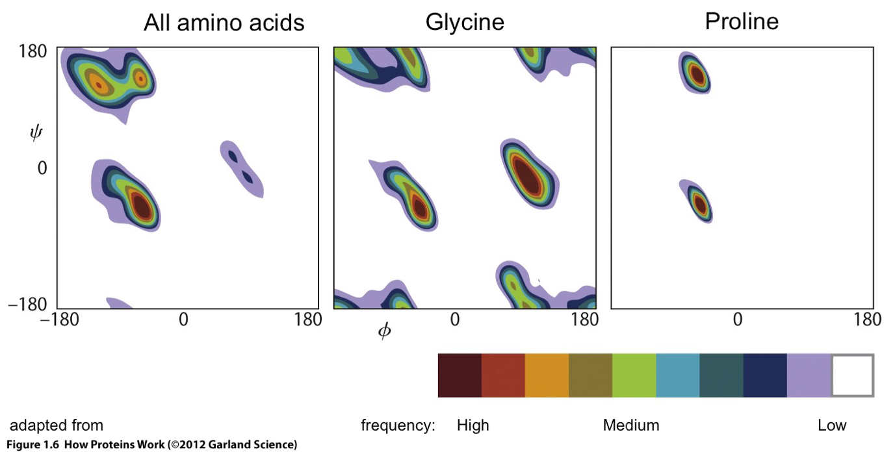
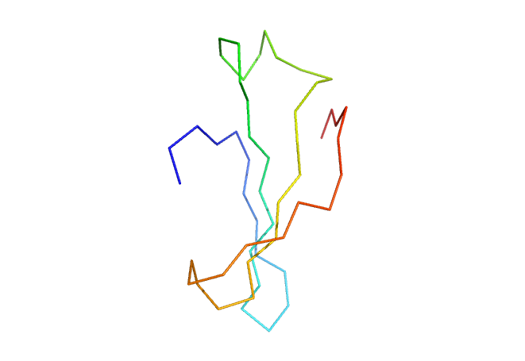
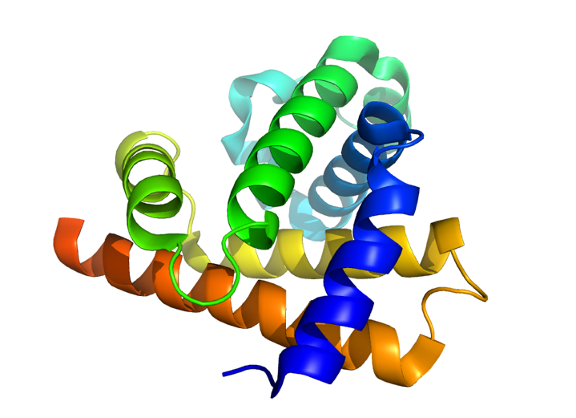
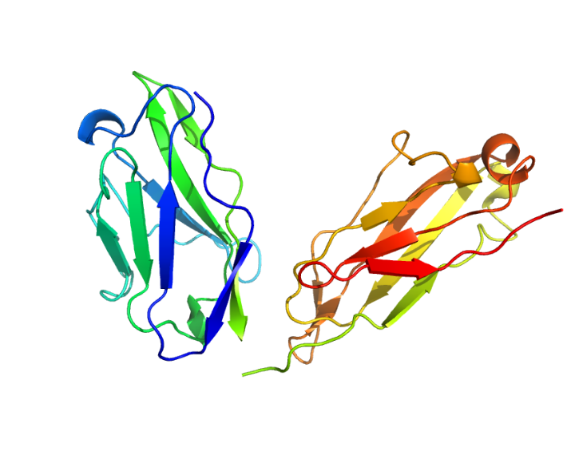
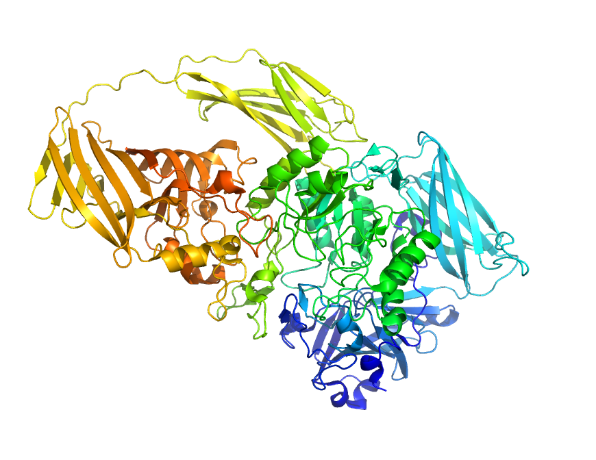
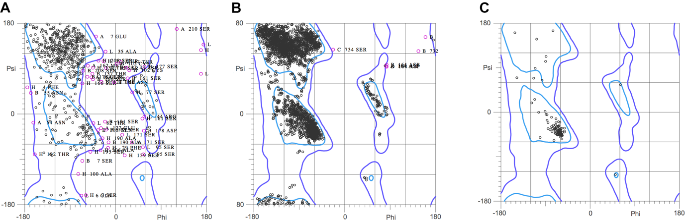
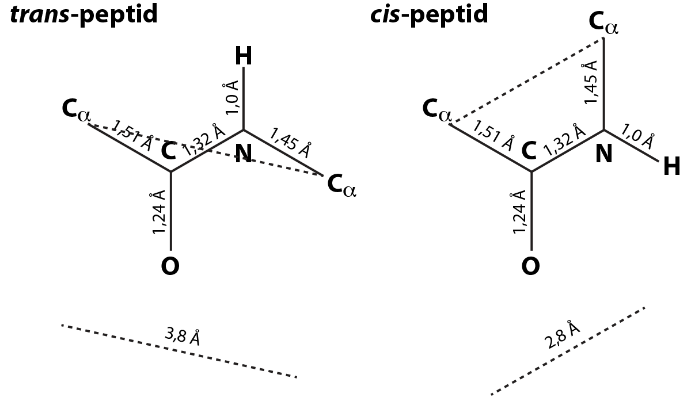
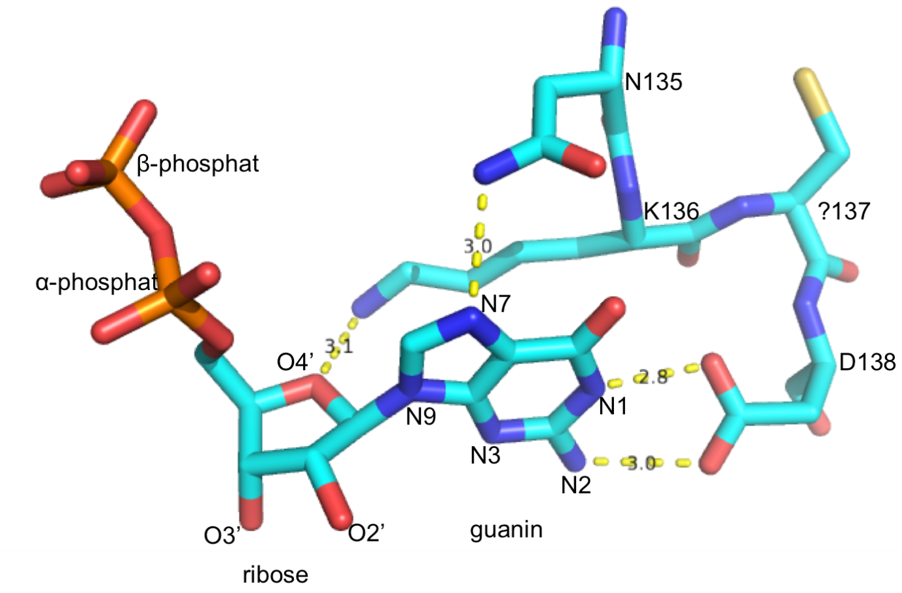
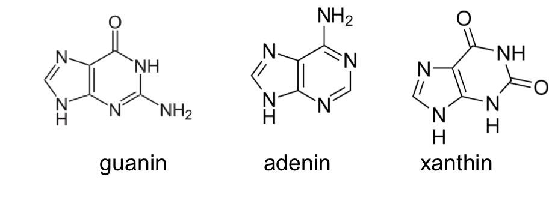
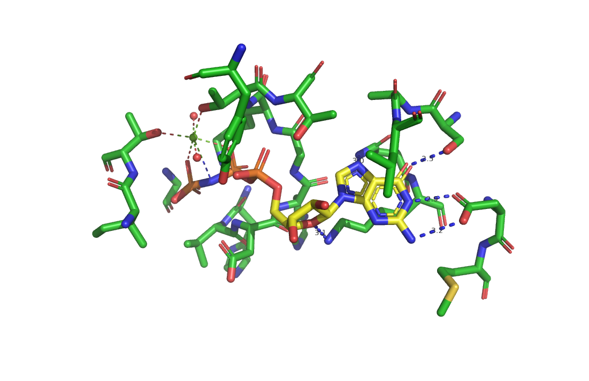

## Opgave 1. UniProt-databasen - Chymotrypsin

UniProt ([**www.uniprot.org**](http://www.uniprot.org)) er en database over kendte proteinsekvenser. Hver enkelt sekvens i databasen er i vidt omfang annoteret og krydsrefereret til andre databaser.

Gå til UniProt og søg efter "bovine chymotrypsinogen A".

Klik på det øverste hit på listen (P00766). Til venstre på siden ses nu en kolonne, der kontrollerer visningen på højre del af siden. Som default er de alle vinget af. Klik på "Sequence" eller rul ned på siden til du kommer til overskriften "Sequence".

Til højre på siden er der information om sekvenslængde og molekylevægt. Desuden er der mulighed for yderligere beregninger ved at vælge fra dropdown-menuen til venstre for GO knappen.

### Tæl aminosyrerester i chymotrypsinogen

Hvor mange aminosyrerester er der i sekvensen?

### Find molekylvægt af chymotrypsinogen

Hvad er molekylvægten ($M_w$) for den viste sekvens?

Den viste sekvens er for chymotrypsinogen, som efter aktivering ved proteolytisk kløvning danner det aktive α-chymotrypsin (se Stryer, Fig. 10.18, s. 324).

### Find molekylvægt af α-chymotrypsin

Hvad er Mw for α-chymotrypsin?

(Hint: Brug "ProtParam" fra dropdown-menuen i "Sequence"-afsnittet af UniProt til at beregne molekylvægten for hver af de tre kæder i aktivt α-chymotrypsin.)

ProtParam beregner også aminosyresammensætning for sekvensen.

### Find de tre største aminosyreafvigelser

Hvad er de tre største afvigelser mellem chymotrypsinogens aminosyresammensætning og sammensætningen for gennemsnittet af proteiner ([**https://web.expasy.org/docs/relnotes/relstat.html**](https://web.expasy.org/docs/relnotes/relstat.html) nederst på siden)? Kan nogle af disse forskelle forklares udfra dit kendskab til enzymet?

(Hint. Her er det nødvendigt at oprette et "fragment", der dækker hele chymotrypsinogens sekvens nederst på ProtParam-siden).

### Tæl helixer i α-chymotrypsin

Hvor mange helixer er der i α-Chymotrypsin?

(Hint. Klik på "Structure" til venstre på UniProt-siden)


::: {.solution-callout}

**1.**  245 aminosyrer.

**2.**  25666 Da (25,7 kDa).

**3.**  
Kæde A, resterne 1-13, Mw 1253,52 Da\
Kæde B, resterne 16-146, Mw 13923,63 Da\
Kæde C, resterne 149-245, Mw 10066,52 Da\
I alt = 25243,67 Da (25,2 kDa)

**4.**  
For fragmentet 1-245: Der er et lavt antal af Arg (1.6% mod 5.5%), stort antal Cys (4.1% mod 1.3%), lavt antal Glu (2.0% mod 6.7%), lavt antal Met (0.8% mod 2.4%), højt antal Ser (11.4% mod 6.6%), højt antal Thr (9,4% mod 5.3%).\
Højt antal Cys skyldes at det er et ekstracellulært, kløvet enzym, der holdes sammen af disulphidbroer. De andre kan være svære at forklare, men der er også et ret lille antal aminosyrer at vurdere det på.

**5.**  Der er 5 helicer. Den første mellem 12 og 15 findes ikke i det modne enzym.
:::

## Opgave 2. Ramachandran-plottet

På figuren nedenfor er vist fordelingen af phi $\phi$ og psi $\psi$ vinkler for aminosyrerester i kendte protein strukturer [(Hovmöller et al., *Acta Cryst D*, **58**, p.768-776, 2002)](https://journals.iucr.org/paper?S0907444902003359). Til venstre er vist den generelle fordeling for alle aminosyrer, dernæst for glycin rester og længst til højre for prolin rester.

### Forklar Pro og Gly i Ramachandran-plottet

Hvilke strukturelle egenskaber for Pro og Gly forklarer deres placeringer i Ramachandran-plottet? 

### Identificer tre områder med høj forekomst

På figuren for alle aminosyrer er der tre områder med høj forekomst af aminosyrerester. Hvor finder man typisk disse områder i proteiners sekundærstruktur

{width="80%" fig-align="center" .lightbox}


::: {.solution-callout}

**1.**  Glycin har ikke en sidekæde og er derfor underlagt færre steriske hindringer. Med andre ord er mængden af mulige kombinationer af ψ- og φ-vinkler væsentlige større. Prolins sidekæde er ringsluttet med hovedkæden og dets φ-vinkel er derfor bundet omkring -65°.

**2.**  Området omkring (φ, ψ) = (-60,-40) svarer til konformationen i α-helixer. Området omkring (φ, ψ) = (-120,+130) svarer til konformationene i β-kæder (β-strands), medens det nærliggende område svarer til en generelt udstrakt konformation af peptidkæden. Det tyndtbefolkede område omkring (φ, ψ) = (+60,+60) optræder i forbindelse med såkaldte "turns". 
:::

## Opgave 3. C-alpha diagram

Nedenfor er vist et Cα-diagram for en struktur farvekodet efter de sædvanlige konventioner. Strukturen indeholder en β-plade bestående af fire β-kæder og proteinet har følgende sekvens:

```
HKAVCLAKWGSDNTIFFTTYANGSCKADLGALLELWRTSDLGKSFKTIGVKIYS
```

{width="80%" fig-align="center" .lightbox}

### Afmærk N- og C-terminus i diagrammet

Afmærk positionen af N- og C-terminus og forklar hvordan dette kan ses.

### Afmærk de to valin-rester

Afmærk positionen af de to valin-rester i sekvensen og forklar hvordan dette kan ses.

### Angiv β-kædernes position og retning

Angiv den omtrentlige position af β-kæderne og deres retning. Forklar dit svar.

### Bestem β-kædernes parallelitet

Er β-kæderne parallelle eller anti-parallelle?

::: {.solution-callout}

**1.**  Strukturen er vist i alm. regnbuefarver, for hvilke N-terminalen angives med blåt (nitrogen i NH3 vises ofte med blåt) og C-terminalen med rødt (COOH indholder mange oxygener, der ofte vises røde).

**2.**  De to valinrester findes hhv. som 4. første og 5. sidste rest. Da strukturen er vist som α-carbon trace (ét `hak` for hver aminosyrerest) kan vi derfor tælle os frem og finde de to valinrester som hhv. 4. `hak` fra den blå N-terminus og 5. hak fra den røde C-terminus.

**3.**  Kæde 1: Rest 5-10\
    Kæde 2: Rest 14-20\
    Kæde 3: Rest 31-38\
    Kæde 4: Rest 42-50

**4.**  Kæderne er antiparallelle da nabo kæder er modsat rettede. Det ses også af at de loops, der findes mellem kæderne, ikke krydser tilbage hen forbi β-pladen.
:::

## Opgave 4. Cartoons

```{=css}
#app-1MBN {
  width: 40%;
}
```








Strukturerne af proteinet myoglobin, et immunoglobulin Fab-fragment samt β-galactosidase er vist nedenfor som cartoons.

::: {#fig-elephants layout-ncol=3}

{.lightbox width="100%"}

{.lightbox width="100%"}

{.lightbox width="100%"}

:::

Ramachandran-plot for de tre strukturer er mærket A, B, og C og vist herunder.

{width="90%" .lightbox}

Hvilken struktur hører til hvilket plot?

Forklar dit svar.


::: {.solution-callout}

A er Fab-fragmentet

B er β-galactosidase

C er myoglobin

Dette ses bl.a. ved at myoglobin kun indeholder α-helixer og Fab-fragmentet næsten kun består af β-plader mens β-galactosidase er blandet. Man kan også kigge på antallet af rester og få en idé udfra det (β-galactosidase er et meget stort protein).

Bemærk de mange `outliers` for Fab-fragmentet (er angivet med aminosyrens navn og nummer), der antyder at strukturen kan være dårligt forfinet. 
:::

## Opgave 5. Afstand mellem C-alpha atomer

### Tegn trans-peptidbinding med mål

Tegn en *trans*-peptidbinding med korrekte bindingslængder (se Berg, 10. udgave, s. 44) i en fast målestok (f.eks. 1 Å : 2 cm). Brug 120° som bindingsvinkel mellem alle tre bindinger til C (carbonyl-kulstof) og N (amid-nitrogen), da begge er *sp^2^*-hybridiserede (dvs. det er plane grupper).

### Tegn cis-peptidbinding med mål

Gentag ovenstående øvelse for en *cis*-peptidbinding.

### Mål Cα-afstand i trans-peptid

Hvad er afstanden mellem de to Cα-atomer i et *trans*-peptid?

### Mål Cα-afstand i cis-peptid

Hvad er afstanden mellem de to Cα-atomer i et *cis*-peptid?

::: {.solution-callout}

**1.**  {width="5.761013779527559in" height="3.375165135608049in"}

**2.**  \-

**3.**  \~3.8 Å

**4.**  \~2.8 Å
:::

## Opgave 6. Binding af guanine

Alle GDP-bindende proteiner indeholder et bestemt sekvensmotiv, Asn-Lys-X-Asp (NKXD), og i strukturer af GDP-bindende proteiner finder man at sidekæderne i motivet er ansvarlige for genkendelse af selve guaninbasen. I figuren nedenfor ses et udsnit af det GDP-bindende protein EF-Tu (Elongeringsfaktor Tu), som viser bindingen af guanin- og ribose-delen af GDP (carbon - turkis, nitrogen -- blå, oxygen - rød, svovl -- gul, phosphor - orange, stiplede gule linjer viser hydrogenbindinger med angivelse af donor-acceptor afstand).

{width="80%" .lightbox fig-align="center"}

### Find X i NKXD-motivet

Hvilken aminosyrerest svarer til X i NKXD motivet i dette tilfælde?

### Analysér hydrogenbindinger til guanin

Analysér hydrogenbindingerne mellem sidekæderne og guanin og udfyld tabellen

------------------------------------------------------------------------------
Aminosyrerest\      Atom\       GDP atom\                H-donor\
    (e.g. N135)     (e.g. Nζ)     (e.g. O3')     (p for protein, G for guanin)
----------------- ----------- ---------------- -------------------------------
                                                               

                                                               

                                                               

                                                               
------------------------------------------------------------------------------

EF-Tu er specifik for binding af GDP og binder således hverken nukleotiderne ADP (adenosine diphosphate) eller XDP (xantosine diphosphate). De tilsvarende tre baser er vist nedenfor.

{width="80%" .lightbox fig-align="center"}

### Forklar EF-Tu's nukleotidspecificitet

Forklar hvordan denne specificitet opnås.

En mutation af aspartat til asparagin i sekvensmotivet for guaninbinding medfører at det muterede protein binder XDP og ikke GDP.

### Forklar mutantens ændrede specificitet

Kom med en biokemisk forklaring på mutantens ændrede specificitet.

::: {.solution-callout}

**1.**  Cys137

**2.**  Bemærk at det ikke er muligt at skelne mellem Oδ~1~ og Oδ~2~, da de er identiske.

  ------------------------------------------------------------------------------
  Aminosyrerest\    Atom\       GDP atom\        H-donor\
  (e.g. N135)       (e.g. Nζ)   (e.g. O3')       (p for protein, G for guanin)
  ----------------- ----------- ---------------- -------------------------------
   N135              Nδ          N7              p 

   K136              Nζ          O4'             p

   D138             Oδ1         N1/N2             G

  D138              Oδ2         N1/N2            G
  ------------------------------------------------------------------------------

**3.**  Adenine har hverken en ekstracyklisk N2-gruppe eller i stand til at donere en H-binding fra N1, så interaktionen med D138 er ikke favorabel.\
    \
    Xanthine har godt nok N1-gruppen fra guanine, men har til gengæld modsat polaritet (H-acceptor) idet N2 er udskiftet med O, så den er heller ikke favorabel.\
    \
    D138 udgør altså hele grundlaget for denne skelnen mellem nukleotider.

**4.**  Asparagine har en amidgruppe i stedet for en carboxylsyregruppe på sin sidekæde og har derfor netop mulighed for at donere én H-binding og acceptere en anden. Dette passer perfekt med kombinationen af NH1 og O2 i xanthine.
:::

## Opgave 7. Nukleotid binding

***PyMOL-scripting opgave**: I denne opgave skal i bruge de kommandoer I allerede kender, men også lære kommandoen "distance".*

I TØ4 mappen finder du PyMOL scriptet Elongerings Faktor Tu.pml til at lave en figur af GDP-binding til Elongerings Faktor Tu fra *E.coli* (PDB-ID: 1EFC).

Strukturen af EF-Tu med GDPNP er også blevet bestemt (PDB-ID: 1EFT). I 1EFT er det EF-Tu fra den thermophile bakterie *T.aquaticus*. Da det er EF-Tu fra forskellige organismer er der forskel i sekvensnumrene for de sidekæder der indgår i binding af nukleotidet.

I scriptet indgår en linie:

```default
select sidechains, byres eftu within 4.0 of nucleotide
```

### Forklar PyMOL select-kommandoen

Forklar betydningen af de enkelte elementer i den pågældende linie. Hint: se [**https://pymolwiki.org/index.php/Select**](https://pymolwiki.org/index.php/Select) og [**https://pymolwiki.org/index.php/Selection_Algebra**](https://pymolwiki.org/index.php/Selection_Algebra)

---

I er tidligere blevet introduceret for Wizard-measurement funktionen i PyMOL. Det er også muligt at bruge kommandoen distance til at finde samme afstande. Distance opretter ligeledes et objekt i objektoversigten, men her udspecificeres et navn til objektet af brugeren. Brugen af distance er som følger:

```default
distance (navn på måling), (første selektion), (anden selektion)
```

Selektionerne gives i en hvilken som helst notation (herunder f.eks. /1efc/B/B/ASN\`13/CA eller tilsvarende (resi 13 and chain B and name CA)). Hvis der defineres flere atomer, finder kommandoen samtlige afstande mellem atomer i selektionen. Et tilfældigt eksempel på en afstand mellem to atomer i objektet "1efc" ved navn "d1" kunne således være:

```default
distance d1, /1efc/B/B/ASN\`13/CA, (resi 13 and chain A and name CA)
```

Denne ville altså finde afstanden mellem alfa-carbon i aminosyrerest 13 i kæde A og B.

### Skriv script for GDPNP-visning

Skriv et nyt script, der laver en visning af samme figur som før, men med GDPNP (en analog til GTP) i stedet for GDP og stadigvæk med angivelse af hydrogenbindinger. Hint: Der kan hentes meget inspiration i scriptet fra før. 


::: {.solution-callout}

**1.**

```
select sidechains , byres eftu within 4.0 of nucleotide 
```

`select` kommando til at definere en selektion

`sidechains` er navnet på selektionen

`,` er nødvendigt for at adskille navnet fra definitionen - pymol rapporterer fejl, hvis det mangler

`byres` angiver, at vi ønsker at selektionen expanderet til hele aminosyrerester

`eftu` er navnet på det objekt/selection vi vælger fra

`within 4.0 of` vi vælger de atomer der ligger inden for 4.0 Å fra den selektion der angives efterfølgende

`nucleotide` et objekt/selektion der blev defineret i linie 6 i scriptet.

**2.**

```default
reinitialize
bg_color white
fetch 1eft , async=0
create eftu , /1eft//A                       
hide everything

select nucleotide , /eftu///GNP or /eftu///MG
select sidechains , byres eftu within 4.0 of nucleotide
show sticks , nucleotide sidechains
color yellow , (nucleotide and name C\*)
center nucleotide

distance dist1 ,(nucleotide and name O6) , /eftu///174/OG
distance dist2 ,(nucleotide and name N1) , /eftu///139/OD1
distance dist3 ,(nucleotide and name N2) , /eftu///139/OD2
distance dist4 ,(nucleotide and name N7) , /eftu///136/ND2
distance dist5 ,(nucleotide and name O4') , /eftu///137/NZ


color blue , dist\*

set_view (\
     0.191412523,   -0.859790862,   -0.473412633,\
     0.693364501,   -0.222936183,    0.685232103,\
    -0.694701493,   -0.459409922,    0.553474486,\
     0.000000000,    0.000000000,  -64.049102783,\
   105.326667786,    6.069516182,   37.496429443,\
    21.348415375,  106.749801636,  -20.000000000 )
```

{width="80%" .lightbox}
:::
