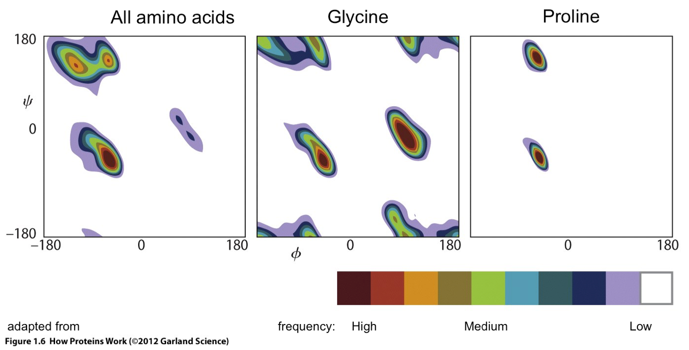
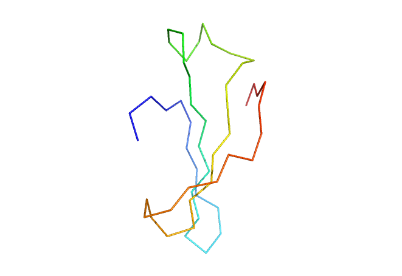
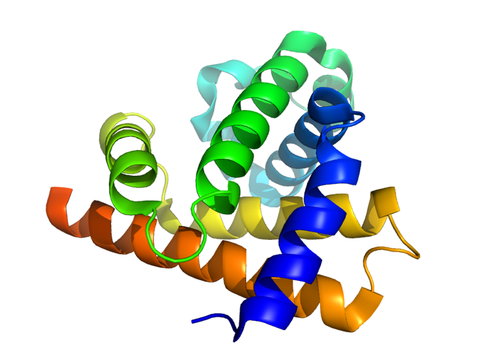
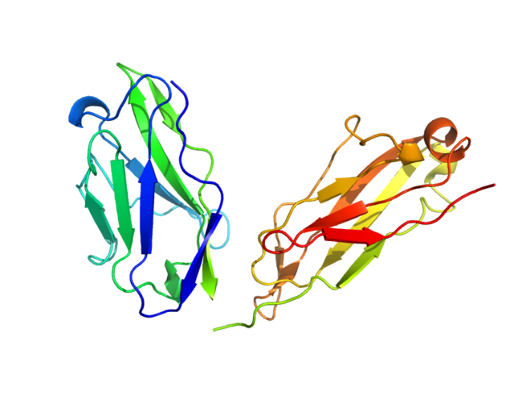
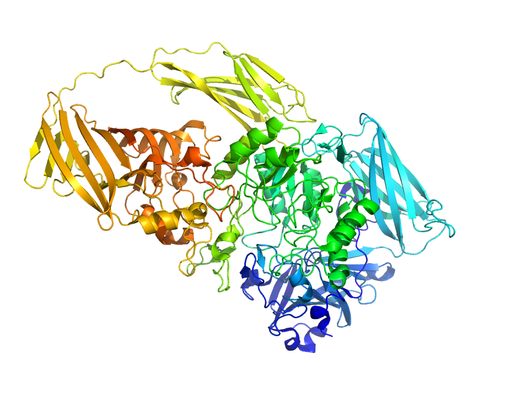
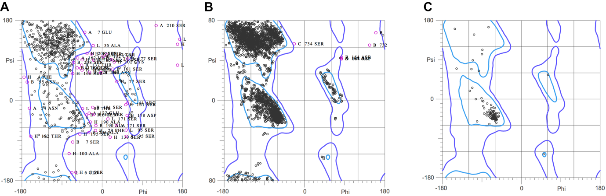
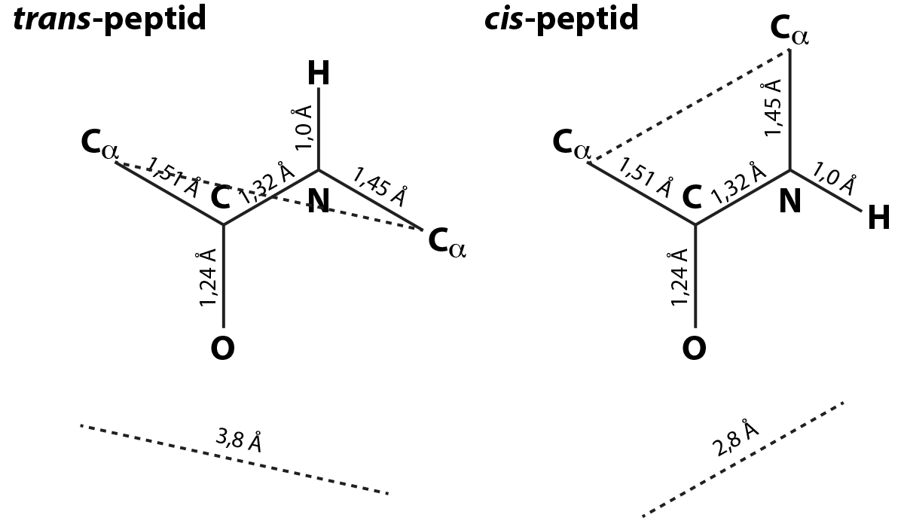
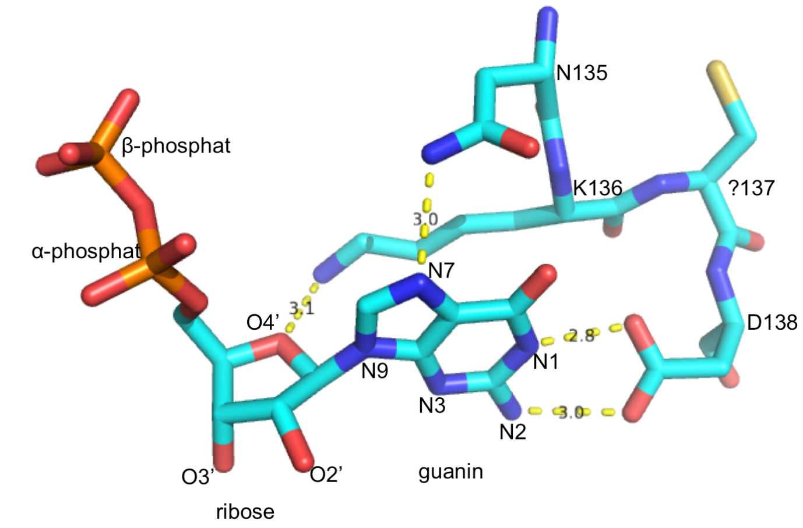
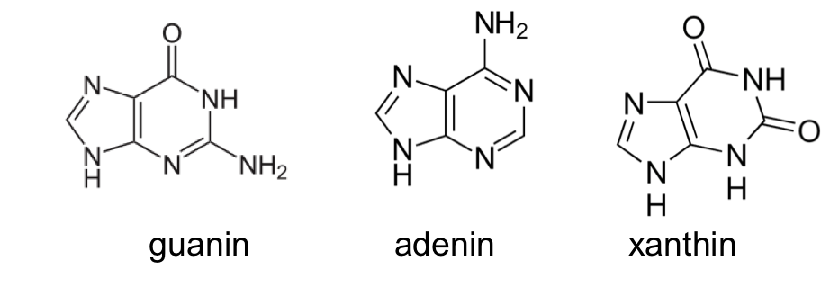
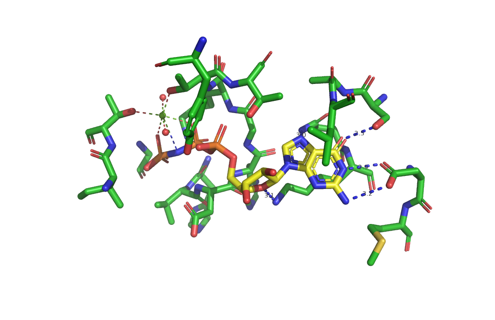

::: {.callout-note}
TØ opgaverne gennemgås i grupper og præsenteres for klassen.
:::



## Opgave 1. Protein quiz

1.	Hvilke af følgende udsagn om **sekundær struktur** er korrekte: 

    a.	Φ-vinklen i β-kæder er mellem 90° og 120°.
    b.	I en α-helix er der 5,4 aminosyrerester pr. omdrejning.
    c.	Alle proteiner indeholder α-helixer.
    d.	Middel afstanden mellem Cα atomer i en β-kæde er ca 3,4 Å.
    e.	En β-plade skal bestå af mindst 2 β-kæder.
    f.	I en α-helix er der en stigning på 1,5 Å for hver aminosyrerest.

::: {.callout-solution}
b,d,e,f
:::

2.	Hvilke af følgende udsagn om **aminosyrerester** og **sekundær struktur** er korrekte:

    a.	Glycine optræder oftest i α-helix.
    b.	Cys er oftest i β-kæder.
    c.	Asp er oftest i α-helix.
    d.	Leu har tilbøjelighed for at være i α-helix og β-kæde.
    e.	Glu foretrækker Φ,Ψ værdier tæt ved (-60,-30).

::: {.callout-solution}
d,e
:::

3.	Hvilke af følgende udsagn om **foldningsmotiver** (supersekundær struktur) er korrekte:

    a.	HTH optræder ofte i proteaser.
    b.	Leucine zipper optræder ofte i DNA-bindende proteiner.
    c.	HTH er et køkkenfirma.
    d.	Helixer i et "four helix bundle" danner en vinkel på ca. 20° med hinanden.
    e.	Vinklen mellem to helixer bestemmes af antallet af positivt ladede sidekæder.

::: {.callout-solution}
b,d
:::



## Opgave 2. UniProt-databasen - Chymotrypsin

UniProt ([**www.uniprot.org**](http://www.uniprot.org)) er en database over kendte proteinsekvenser. Hver enkelt sekvens i databasen er i vidt omfang annoteret og krydsrefereret til andre databaser.

Gå til UniProt og søg efter "bovine chymotrypsinogen A".

Klik på det øverste hit på listen (P00766). Til venstre på siden ses nu en kolonne, der kontrollerer visningen på højre del af siden. Som default er de alle vinget af. Klik på "Sequence" eller rul ned på siden til du kommer til overskriften "Sequence".

På siden er der information om sekvenslængde og molekylevægt. Desuden er der mulighed for yderligere beregninger ved at vælge fra dropdown-menuen til venstre for GO knappen.

1. Hvor mange aminosyrerester er der i sekvensen?

::: {.callout-solution}
245 aminosyrer.
:::

2. Hvad er molekylvægten ($M_w$) for den viste sekvens?

::: {.callout-solution}
25666 Da (25,7 kDa).
:::

Den viste sekvens er for chymotrypsinogen, som efter aktivering ved proteolytisk kløvning danner det aktive α-chymotrypsin (se Berg, 10. udgave, Fig. 7.17).

3.	Hvad er $M_w$ for α-chymotrypsin?

::: {.callout-tip}
Hint: Brug ”ProtParam” fra dropdown-menuen "Tools" i "Sequence"-afsnittet af UniProt til at beregne molekylvægten for hver af de tre kæder i aktivt α-chymotrypsin. Alternativt kan du kopiere sekvensen direkte ind i ProtParam (https://web.expasy.org/protparam/).
:::

::: {.callout-solution}
Kæde A, resterne 1-13, Mw 1253,52 Da\
Kæde B, resterne 16-146, Mw 13923,63 Da\
Kæde C, resterne 149-245, Mw 10066,52 Da\
I alt = 25243,67 Da (25,2 kDa)
:::

ProtParam beregner også aminosyresammensætning for sekvensen.

4. Hvad er de tre største afvigelser mellem chymotrypsinogens aminosyresammensætning og sammensætningen for gennemsnittet af proteiner ([**https://web.expasy.org/docs/relnotes/relstat.html**](https://web.expasy.org/docs/relnotes/relstat.html) nederst på siden)? Kan nogle af disse forskelle forklares udfra dit kendskab til enzymet?

::: {.callout-tip}
Her er det nødvendigt at oprette et "fragment", der dækker hele chymotrypsinogens sekvens nederst på ProtParam-siden.
:::

::: {.callout-solution}
For fragmentet 1-245: Der er et lavt antal af Arg (1.6% mod 5.5%), stort antal Cys (4.1% mod 1.3%), lavt antal Glu (2.0% mod 6.7%), lavt antal Met (0.8% mod 2.4%), højt antal Ser (11.4% mod 6.6%), højt antal Thr (9,4% mod 5.3%).\
Højt antal Cys skyldes at det er et ekstracellulært, kløvet enzym, der holdes sammen af disulphidbroer. De andre kan være svære at forklare, men der er også et ret lille antal aminosyrer at vurdere det på.
:::

5.	Hvor mange α-helixer er der i α-Chymotrypsin? Hvilke aminosyre-rester er i disse helixer?

::: {.callout-tip}
Klik på ”Structure” til venstre på UniProt-siden og find PDB ID. Åben strukturen i PyMOL, aktiver `C > by ss > Helix Sheet Loop` og brug Sequence viewer til at finde helix regionerne. Alternativt kan man finde helix annotationen på RCSB under "Sequence" tab.

Sekundær-strukturen der vises i PyMOL og på RCSB er baseret på annotation af forskerne, der løste strukturen af α-Chymotrypsin. 
:::

::: {.callout-tip}
PyMOL hint: Med kommandoen `dss` kan du få PyMOL til at vise sekundær struktur, der kun er baseret på geometriske parametre (Φ,Ψ).
:::

::: {.callout-solution}
Kæde A, resterne 1-13, Mw 1253,52 Da\
Kæde B, resterne 16-146, Mw 13923,63 Da\
Kæde C, resterne 149-245, Mw 10066,52 Da\
I alt = 25243,67 Da (25,2 kDa)
:::

6. Brug kommandoen `dss` i PyMOL til at vise sekundær struktur. Hvor mange helixer vises nu? Hvilke aminosyre-rester er i disse helixer?

::: {.callout-solution}
Der er 3 helixer:
Helix 1: Kæde B, resterne 56-58
Helix 2: Kæde C, resterne 165-172
Helix 3: Kæde C, resterne 231-244
:::

7. Hvilken metode til at vise sekundær-struktur synes du er mest korrekt ihht. definitionen af en α-helix og et β-plade?

::: {.callout-solution}
Sekundær-struktur er både defineret ud fra geometri og hydrogen-bindings-mønster:
α-helix: Φ ≈ -57°, Ψ ≈ -47°. Hydrogen binding fra i til i+4, 
β-plade (parallel): Φ ≈ -119°, Ψ ≈ 113°. β-plade (anti-parallel): Φ ≈ -139°, Ψ ≈ 135°. Hydrogen binding på hver position mellem beta-strenge.
Man bør både kigge på backbone vinkler og hydrogen-bindings-mønster. Og hvilken opløsning som strukturen er blevet løst ved for at vurdere hvor sikker forskerne er på geometrien af de enkelte aminosyrer.
:::



## Opgave 3. Ramachandran-plottet

På figuren nedenfor er vist fordelingen af phi $\phi$ og psi $\psi$ vinkler for aminosyrerester i kendte protein strukturer [(Hovmöller et al., *Acta Cryst D*, **58**, p.768-776, 2002)](https://journals.iucr.org/paper?S0907444902003359). Til venstre er vist den generelle fordeling for alle aminosyrer, dernæst for glycin rester og længst til højre for prolin rester.

1. Hvilke strukturelle egenskaber for Pro og Gly forklarer deres placeringer i Ramachandran-plottet? 

::: {.callout-solution}
Glycin har ikke en sidekæde og er derfor underlagt færre steriske hindringer. Med andre ord er mængden af mulige kombinationer af ψ- og φ-vinkler væsentlige større. Prolins sidekæde er ringsluttet med hovedkæden og dets φ-vinkel er derfor bundet omkring -65°.
:::

2. På figuren for alle aminosyrer er der tre områder med høj forekomst af aminosyrerester. Hvor finder man typisk disse områder i proteiners sekundærstruktur

{width="100%" fig-align="center" .lightbox}

::: {.callout-solution}
Området omkring (φ, ψ) = (-60,-40) svarer til konformationen i α-helixer. Området omkring (φ, ψ) = (-120,+130) svarer til konformationene i β-kæder (β-strands), medens det nærliggende område svarer til en generelt udstrakt konformation af peptidkæden. Det tyndtbefolkede område omkring (φ, ψ) = (+60,+60) optræder i forbindelse med såkaldte "turns". 
:::



## Opgave 4. C-alpha diagram

Nedenfor er vist et Cα-diagram for en struktur farvekodet efter de sædvanlige konventioner. Strukturen indeholder en β-plade bestående af fire β-kæder og proteinet har følgende sekvens:

```default
HKAVCLAKWGSDNTIFFTTYANGSCKADLGALLELWRTSDLGKSFKTIGVKIYS
```

{width="80%" fig-align="center" .lightbox}

1. Afmærk positionen af N- og C-terminus og forklar hvordan dette kan ses.

::: {.callout-solution}
Strukturen er vist i alm. regnbuefarver, for hvilke N-terminalen angives med blåt (nitrogen i NH3 vises ofte med blåt) og C-terminalen med rødt (COOH indholder mange oxygener, der ofte vises røde).
:::

2. Afmærk positionen af de to valin-rester i sekvensen og forklar hvordan dette kan ses.

::: {.callout-solution}
De to valinrester findes hhv. som 4. første og 5. sidste rest. Da strukturen er vist som α-carbon trace (ét "hak" for hver aminosyrerest) kan vi derfor tælle os frem og finde de to valinrester som hhv. 4. "hak" fra den blå N-terminus og 5. hak fra den røde C-terminus.
:::

3. Angiv den omtrentlige position af β-kæderne og deres retning. Forklar dit svar.

::: {.callout-solution}
Kæde 1: Rest 5-10\
Kæde 2: Rest 14-20\
Kæde 3: Rest 31-38\
Kæde 4: Rest 42-50
:::

4. Er β-kæderne parallelle eller anti-parallelle?

::: {.callout-solution}
Kæderne er antiparallelle da nabo kæder er modsat rettede. Det ses også af at de loops, der findes mellem kæderne, ikke krydser tilbage hen forbi β-pladen.
:::



## Opgave 5. Cartoons
Strukturerne af proteinet myoglobin, et immunoglobulin Fab-fragment samt β-galactosidase er vist nedenfor i Figur 1 som cartoons. Tryk på billederne for at se dem i større størrelse.

::: {#fig-elephants layout-ncol=3}

{.lightbox width="100%"}

{.lightbox width="100%"}

{.lightbox width="100%"}

:::

Ramachandran-plot for de tre strukturer er mærket A, B, og C og vist herunder.

{width="90%" .lightbox}

Hvilken struktur hører til hvilket plot?

Forklar dit svar.

::: {.callout-solution}
A er Fab-fragmentet\
B er β-galactosidase\
C er myoglobin\

Dette ses bl.a. ved at myoglobin kun indeholder α-helixer og Fab-fragmentet næsten kun består af β-plader mens β-galactosidase er blandet. Man kan også kigge på antallet af rester og få en idé udfra det (β-galactosidase er et meget stort protein).

Bemærk de mange "outliers" for Fab-fragmentet (er angivet med aminosyrens navn og nummer), der antyder at strukturen kan være dårligt forfinet. 
:::



## Opgave 6. Afstand mellem C-alpha atomer

1. Tegn en *trans*-peptidbinding med korrekte bindingslængder (se Berg, 10. udgave, s. 44) i en fast målestok (f.eks. 1 Å : 2 cm). Brug 120° som bindingsvinkel mellem alle tre bindinger til C (carbonyl-kulstof) og N (amid-nitrogen), da begge er *sp^2^*-hybridiserede (dvs. det er plane grupper).

2. Gentag ovenstående øvelse for en *cis*-peptidbinding.

::: {.callout-solution}
{width="60%" fig-align="center" .lightbox}
:::

3. Hvad er afstanden mellem de to Cα-atomer i et *trans*-peptid?

::: {.callout-solution}
~3.8 Å
:::

4. Hvad er afstanden mellem de to Cα-atomer i et *cis*-peptid?

::: {.callout-solution}
~2.8 Å
:::



## Opgave 6. Binding af guanine

Alle GDP-bindende proteiner indeholder et bestemt sekvensmotiv, Asn-Lys-X-Asp (NKXD), og i strukturer af GDP-bindende proteiner finder man at sidekæderne i motivet er ansvarlige for genkendelse af selve guaninbasen. I figuren nedenfor ses et udsnit af det GDP-bindende protein EF-Tu (Elongeringsfaktor Tu), som viser bindingen af guanin- og ribose-delen af GDP (carbon - turkis, nitrogen -- blå, oxygen - rød, svovl -- gul, phosphor - orange, stiplede gule linjer viser hydrogenbindinger med angivelse af donor-acceptor afstand).

{width="80%" .lightbox fig-align="center"}

1. Hvilken aminosyrerest svarer til X i NKXD motivet i dette tilfælde?

::: {.callout-solution}
Cys137
:::

2. Analysér hydrogenbindingerne mellem sidekæderne og guanin og udfyld en tabel som den vist nedenfor

------------------------------------------------------------------------------
Aminosyrerest\      Atom\       GDP atom\                H-donor\
    (e.g. N135)     (e.g. Nζ)     (e.g. O3')     (p for protein, G for guanin)
----------------- ----------- ---------------- -------------------------------
                                                               

                                                               

                                                               

                                                               
------------------------------------------------------------------------------

::: {.callout-solution}
Bemærk at det ikke er muligt at skelne mellem Oδ~1~ og Oδ~2~, da de er identiske.

------------------------------------------------------------------------------
Aminosyrerest\    Atom\       GDP atom\        H-donor\
(e.g. N135)       (e.g. Nζ)   (e.g. O3')       (p for protein, G for guanin)
----------------- ----------- ---------------- -------------------------------
 N135              Nδ          N7              p 

 K136              Nζ          O4'             p

 D138             Oδ1         N1/N2            G

 D138             Oδ2         N1/N2            G
------------------------------------------------------------------------------
:::

EF-Tu er specifik for binding af GDP og binder således hverken nukleotiderne ADP (adenosine diphosphate) eller XDP (xantosine diphosphate). De tilsvarende tre baser er vist nedenfor.

{width="80%" .lightbox fig-align="center"}

3. Forklar hvordan denne specificitet opnås.

::: {.callout-solution}
Adenine har hverken en ekstracyklisk N2-gruppe eller i stand til at donere en H-binding fra N1, så interaktionen med D138 er ikke favorabel.

Xanthine har godt nok N1-gruppen fra guanine, men har til gengæld modsat polaritet (H-acceptor) idet N2 er udskiftet med O, så den er heller ikke favorabel.

D138 udgør altså hele grundlaget for denne skelnen mellem nukleotider.
:::

En mutation af aspartat til asparagin i sekvensmotivet for guaninbinding medfører at det muterede protein binder XDP og ikke GDP.

4. Kom med en biokemisk forklaring på mutantens ændrede specificitet.

::: {.callout-solution}
Asparagine har en amidgruppe i stedet for en carboxylsyregruppe på sin sidekæde og har derfor netop mulighed for at donere én H-binding og acceptere en anden. Dette passer perfekt med kombinationen af NH1 og O2 i xanthine.
:::



## Opgave 8. Nukleotid binding

::: {.callout-note}
**PyMOL-scripting opgave**: I denne opgave skal i bruge de kommandoer I allerede kender, men også lære kommandoen `distance`.
:::

I denne opgave skal vi kigge på nukleotid binding af Elongerings Faktor Tu (EF-Tu) og sammenligne GDP-binding til EF-Tu fra *E. coli* (PDB-ID: 1EFC) med GDPNP-binding til EF-Tu fra den termofile bakterie *T. aquaticus* (PDB-ID: 1EFT).

1.	Åben de to strukturer i PyMOL, fjern vand med `remove solvent`, slet kæde B med `remove chain B` og align strukturerne med `align 1efc, 1eft` kommando. Hvad er RMSD mellem de to proteiner?

::: {.callout-solution}
RMSD = 9,4.
:::

2.	Align nu nukleotidbindings-domænet med `align 1efc & resi 1-201, 1eft & resi 1-211` kommando. Hvad er RMSD mellem de to domæner?

::: {.callout-solution}
RMSD = 0,5.
:::

Selvom EF-Tu fra forskellige organismer, har deres nukleotid-bindings-domæne meget ens struktur, men der forskel i sekvensnumrene for de sidekæder, der indgår i binding af nukleotidet. 

Vi skal nu kigge specifikt på bindings-stedet. Her under finder du PyMOL scriptet `Elongerings Faktor Tu.pml` til at lave en figur af GDP-binding til Elongerings Faktor Tu fra *E. coli* (PDB-ID: 1EFC).



I scriptet indgår en linje: 

```default
select sidechains, byres eftu within 4.0 of nucleotide`
```

3. Forklar betydningen af de enkelte elementer i den pågældende linie. 

::: {.callout-tip}
Se [**https://pymolwiki.org/index.php/Select**](https://pymolwiki.org/index.php/Select) og [**https://pymolwiki.org/index.php/Selection_Algebra**](https://pymolwiki.org/index.php/Selection_Algebra)
:::

::: {.callout-solution}

```default
select sidechains , byres eftu within 4.0 of nucleotide 
```

`select` kommando til at definere en selektion

`sidechains` er navnet på selektionen

`,` er nødvendigt for at adskille navnet fra definitionen - pymol rapporterer fejl, hvis det mangler

`byres` angiver, at vi ønsker at selektionen expanderet til hele aminosyrerester

`eftu` er navnet på det objekt/selection vi vælger fra

`within 4.0 of` vi vælger de atomer der ligger inden for 4.0 Å fra den selektion der angives efterfølgende

`nucleotide` et objekt/selektion der blev defineret i linie 6 i scriptet.
:::

I er tidligere blevet introduceret for Wizard-measurement funktionen i PyMOL. Det er også muligt at bruge kommandoen distance til at finde samme afstande. Distance opretter ligeledes et objekt i objektoversigten, men her udspecificeres et navn til objektet af brugeren. Brugen af distance er som følger:

```default
distance (navn på måling), (første selektion), (anden selektion)
```

Selektionerne gives i en hvilken som helst notation (herunder f.eks. /1efc/B/B/ASN\`13/CA eller tilsvarende (resi 13 and chain B and name CA)). Hvis der defineres flere atomer, finder kommandoen samtlige afstande mellem atomer i selektionen. Et tilfældigt eksempel på en afstand mellem to atomer i objektet "1efc" ved navn "d1" kunne således være:

```default
distance d1, /1efc/B/B/ASN\`13/CA, (resi 13 and chain A and name CA)
```

Denne ville altså finde afstanden mellem alfa-carbon i aminosyrerest 13 i kæde A og B.

I `Elongerings Faktor Tu.pml` scriptet bruger vi distance-kommandoen til angivelse af hydrogenbindinger.

4. Skriv et nyt script, der laver en visning af samme figur som før, men med GDPNP (en analog til GTP) i stedet for GDP og stadigvæk med angivelse af hydrogenbindinger. Hint: Der kan hentes meget inspiration i scriptet fra før. 

::: {.callout-solution}

```default

```

{width="80%" .lightbox}
:::

5.	Angiv sekvensnumrene for de sidekæder, der indgår i binding af nukleotidet ihhv. EF-Tu fra *E. coli* og *T. aquaticus*. Hvor forskellige er sekvensnumrene? 

::: {.callout-solution}
EF-Tu fra E. coli (PDB-ID: 1EFC) \
Asn135\
Lys136\
Asp138\
Ser173\

EF-Tu fra T. aquaticus (PDB-ID: 1EFT)\
Asn136\
Lys137\
Asp139\
Ser174\

Sekvensnumrene er rykket +1.
:::