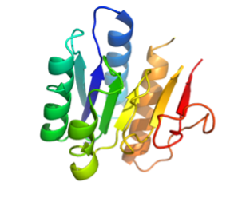
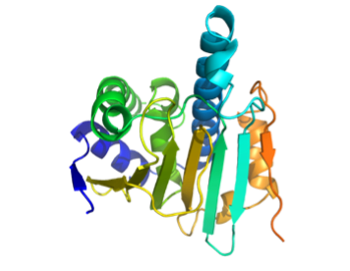
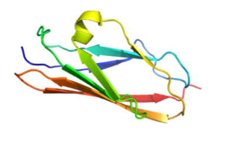
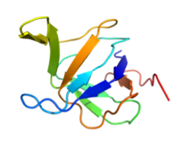
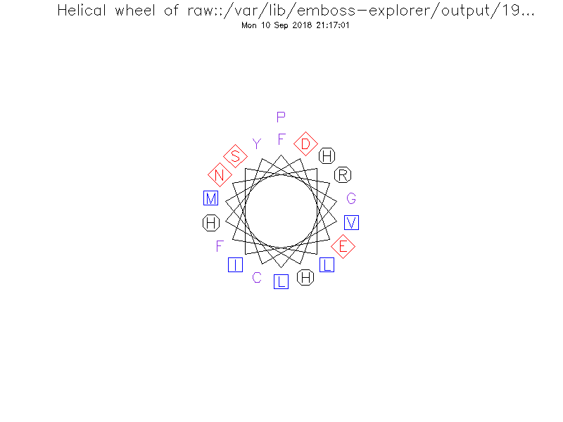
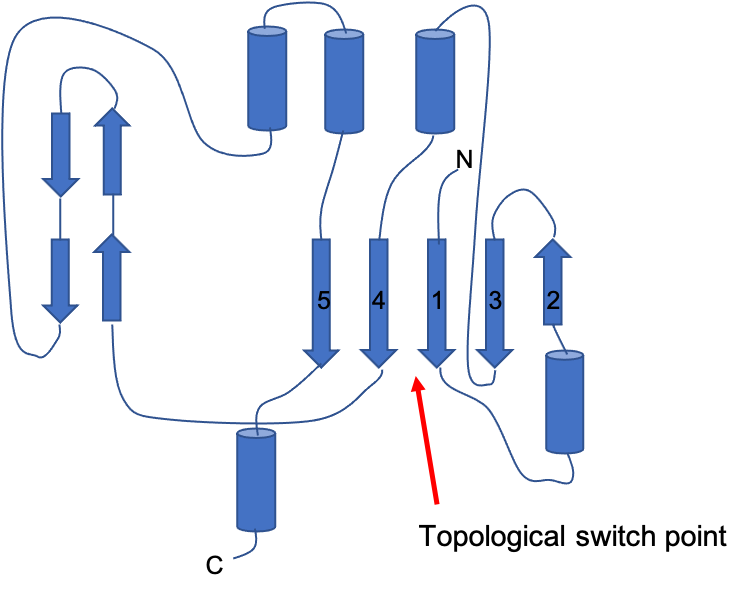
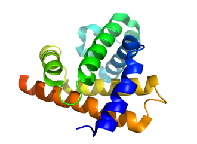
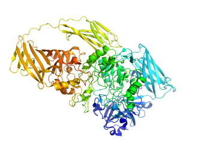

## Opgave 1. Protein qiuz

1.  Hvilke af følgende udsagn om **foldningsmotiver** (supersekundær
    struktur) er korrekte:

    a.  HTH optræder ofte i proteaser.
    b.  Leucine zipper optræder ofte i DNA-bindende proteiner.
    c.  HTH er et køkkenfirma.
    d.  Helixer i et \"four helix bundle\" danner en vinkel på ca. 20° med hinanden.
    e.  Vinklen mellem to helixer bestemmes af antallet af positivt ladede sidekæder.

::: {.callout-solution}
b,c,d
:::

2.  Hvilke af følgende udsagn om **foldningsmotiver** (supersekundær
    struktur) er korrekte:

    a.  Der er 3 hairpins i et up\'n\'down sheet.
    b.  Der er 2 hairpins i en β-meander (greek key).
    c.  En β-meander (greek key) indeholder 6 β-kæder.
    d.  β-kæde 1 og 3 er naboer i et up\'n\'down sheet.
    e.  β-kæde 1 og 4 er naboer i en β-meander (greek key).
    f.  β-kæde 2 og 3 er parallelle i et up\'n\'down sheet.

::: {.callout-solution}
a,b,e
:::

3.  Hvilke af følgende udsagn om **foldningsmotiver** (supersekundær
    struktur) er korrekte:

    a.  I β-α-β motivet er β-kæderne antiparallelle.
    b.  Betragt et β-α-β motiv, så β-kæderne peger mod dig og den første β-kæde er til højre, så ligger α-helixen over β-kæderne.
    c.  En β-kæde kan indgå i to β-α-β motiver.
    d.  Forbindelsen mellem de to β-kæder er altid højrehåndet.
    e.  En α-helix kan indgå i to β-α-β motiver.

::: {.callout-solution}
b,c,d
:::

4.  Hvilke af følgende udsagn om **domæner** er korrekte:

    a.  Den N-terminale sekvens i et domæne er altid Asn-X-Ser/Thr.
    b.  Et domæne skal bestå af mindst 100 aminosyrerester.
    c.  Et protein består af et eller flere domæner.
    d.  Et domæne kan betegnes som en selvstændig foldningsenhed.
    e.  Et domæne kan bestå af flere proteiner.
    f.  Et domæne kan indeholde flere forskellige foldningsmotiver.

::: {.callout-solution}
c,d,f
:::

5.  Hvilke af følgende udsagn er korrekte?

    a.  To proteiner med over 30% kan forventes at have lignende funktion.
    b.  Kun ca. 30% af hovedkædens mulige hydrogen bindings donor-acceptor par er opfyldt i den hydrofobe kerne.
    c.  Polære sidekæder befinder sig hovedsageligt på proteinets overflade.
    d.  To proteiner med under 30% identiske sekvens positioner har forskellig foldning.
    e.  Sekvensen bestemmer strukturen.
    f.  Aromatiske sidekæder befinder sig hovedsageligt på proteinets overflade.

::: {.callout-solution}
a,c,e
:::

6.  Angiv foldningsklassen for **domænestrukturerne** vist nedenfor.

    a.  α
    b.  β
    c.  α+β
    d.  α/β

::: {layout-ncol=4}
{.lightbox width="100%"}

{.lightbox width="100%"}

{.lightbox width="100%"}

{.lightbox width="100%"}
:::

::: {.callout-solution}
a=A, b=C+D, c=B, d=A
:::

7.  Hvilke af følgende udsagn om **foldningsklasser** er korrekte?

    a.  I α+β klassen er β-pladen hovedsageligt antiparallel.
    b.  β-klassen kan indeholde en α-helix.
    c.  α-klassen indeholder Rossman-folds.
    d.  I α/β klassen skal hovedkæden krydse over β-pladen.
    e.  β-klassen indeholder altid en hovedsageligt parallel β-plade.

::: {.callout-solution}
a,b,d (d refererer til Ringe Fig. 1-60).
:::

8.  Hvilke af følgende udsagn om **foldningsmotiver** er korrekte:

    a.  TIM-barrel består af 8 antiparallelle β-kæder.
    b.  Immunoglobulin indeholder 1 β-plade med 4-kæder.
    c.  TIM-barrel består af 7 β-α-β motiver.
    d.  Rossman foldninger tilhører α/β klassen.
    e.  En propel-struktur består af β-plader med β-meander motivet.

::: {.callout-solution}
b,c,d
:::

9.  Hvilke af følgende udsagn er korrekte:

    a.  Et modul er et domæne der forekommer i forskellige sammenhænge.
    b.  Databasen SCOP klassificerer domæner efter sekvenslængde.
    c.  Databasen pFam klassificerer moduler efter sekvenslighed.
    d.  Databasen CATH klassificerer domæner efter deres foldning.
    e.  Domænefoldninger klassificeres som enten α eller β.

::: {.callout-solution}
a,c,d
:::

10. Hvilke af følgende udsagn om **kvartinær struktur** er korrekte?

    a.  Hemoglobin er en pseudosymmetrisk tetramer.
    b.  En pseudo-symmetrisk oligomer indeholder to forskellige men næsten ens protomerer.
    c.  En hetero-tetramer består af fire forskellige proteiner.
    d.  Fordeling af hydrogenbindings donor og acceptorer er komplementær i vekselvirkningsfladen.
    e.  En oligomer med 222-symmetri består af seks subenheder.

::: {.callout-solution}
a,b,d
:::

11. Hvilke af følgende udsagn om **protein-protein vekselvirkning** er
    korrekte?

    a.  Vekselvirkningsfladen mellem to proteiner har ofte et højt antal proliner.
    b.  Formen på to proteiner i en oligomer er komplementær.
    c.  Frekvensen af sidekæder i en vekselvirkningsflade mellem to proteiner adskiller sig ikke væsentligt fra den generelle protein-overflade.
    d.  Vekselvirkningsfladen er hovedsageligt hydrofob.

::: {.callout-solution}
b,c
:::



## Opgave 2. Cis-peptider

Højtopløste strukturer i Protein Data Bank blev gennemsøgt for *cis*-peptidbindinger. Her fandt man at det gennemsnitlige protein består af 270 aminosyrer samt at frekvensen af prolinrester er 4.8%. Man fandt desuden at frekvensen af *cis* Xaa-Pro (altså forekomsten af et *cis*-peptid lige før prolin ud af alle aminosyrer) er 5.2% og at frekvensen af *cis-*peptider for andre (ikke-proline) rester er 0.029%.

1. Baseret på ovenstående, hvor mange *cis *Xaa-Pro bindinger vil du i gennemsnit forvente at finde i hvert protein? Hvis mindre end én, hvor mange proteiner ville man skulle kigge i gennem før man fandt én *cis* Xaa-Pro?

::: {.callout-solution}
Den forventede frekvens af cis Xaa-Pro er én i hver 0.048 x 0.052 = 2.5\*10-3. Derfor vil et protein med 270 aa indeholde 270 x 2.5\*10-3 eller ca. 0.7 af disse. Med andre ord, ca. 2/3 af alle proteiner vil forventes at indeholde én cis Xaa-Pro binding.
:::

2. Hvordan ser det ud for andre *cis*-peptider (altså ikke involverende proline)?

::: {.callout-solution}
Den tilsvarende beregning for alle aminosyrer er 2.9\*10-4 eller (2.9\*10-4 x 0.952, hvis du fraregner prolinerne), så frekvensen per 270-aa protein er altså 2.9\*10-4 x 0.952 x 270 = 0.075 eller én cis-peptidbinding per 13 proteiner.

Bonusinfo: I artiklen [(A. Jabs et al. \[J. Mol. Biol. 286:291-- 304, 1999\])](https://www.sciencedirect.com/science/article/pii/S0022283698924597?via%3Dihub), der beskriver dette angives det er frekvensen i virkeligheden formentlig er lidt højere, da strukturbestemmelsesmetoder antager trans-peptider som standard med mindre der er gode data for det modsatte. Da mange (specielt gamle) strukturer er løst ved lav opløsning er det derfor ret sandsynligt at der er flere cis-bindinger i virkeligheden end databasen antyder.
:::



## Opgave 3. CATH

Der findes flere forskellige klassifikationer af observerede proteinstrukturer:

CATH ([**http://www.cathdb.info/**](http://www.cathdb.info/))

SCOP ([**http://scop2.mrc-lmb.cam.ac.uk/**](http://scop2.mrc-lmb.cam.ac.uk/))

DALI ([**http://ekhidna2.biocenter.helsinki.fi/dali/**](http://ekhidna2.biocenter.helsinki.fi/dali/)) 

I denne opgave vil vi bruge CATH, der klassificerer domæner i fire niveauer: Foldningsklasse (**C**lass), **A**rkitektur, **T**opology og **H**omology.

Gå til CATH hjemmesiden og vælg "Browse" i øverste linie.

1. Hvilken af de fire klasser indeholder flest domæner? Diskutér.

::: {.callout-solution}
Gruppen af blandede αβ-proteiner indeholder (måske ikke overraskende) flest domæner. Det er uvidst hvorfor det forholder sig sådan, men man kan betragte det ud fra flere vinkler: Rent kombinatorisk giver det måske mening, at et stort domæne vil have lidt af hvert og måske er blandede αβ-domæner mere stabile? Endelig kan der være en bias i de eksperimentelle data hvis det f.eks. viser sig generelt at være lettere at krystallisere domæner med blandet αβ-indhold.
:::

Expandér klasserne og kig efter arkitekturer der betegnes som "barrel".

2. I hvor mange klasser og i hvilke klasser findes der barrel-arkitekturer?

::: {.callout-solution}
Barrels findes (måske overraskende) blandt både de rene α-domæner, de rene β-domæner men og også de blandede αβ-domæner.
:::

3. Hvilken barrel-arkitektur indeholder flest domæner? 

::: {.callout-solution}
Den klassiske β-barrel indeholder flest domæner (>20.000) efterfulgt af de blandede αβ-domæner (\~13.000) og de rene α-barrels (\~760 domæner).
:::

4. Beskriv foldningen i den klassiske β-barrel.

::: {.callout-tip}
Se figur 1.58 i Petsko & Ringe.
:::

::: {.callout-solution}
Den klassiske β-barrel består af en række β-kæder, der folder sammen så den første hydrogenbinder til den sidste og de dermed danner en tønde-struktur. β-kæderne er antiparallelle og kræver derfor ikke helixer ind i mellem.
:::

5. Hvilke typer barrels tilhører foldningerne CATH:3.20.20 og CATH:2.40.10? Beskriv forskellen mellem de to foldninger.

::: {.callout-solution}
CATH:3.20.20 er en såkaldt `TIM-barrel` (først observeret i Triose IsoMerase) mens CATH:2.40.10 ("Thrombin, subunit H") er en helt klassisk β-barrel. TIM-barrel adskiller sig ved at have parallelle β-strands og helixes, der forbinder dem, mens den klassiske β-barrel er antiparallel.
:::



## Opgave 4. Proteinfoldning 

I denne opgave skal vi bruge PyMOL til at kigge på strukturen af elongeringsfaktor EF-Tu.

Kig på filen `EF-Tu-folding.pml`. 



Nogle linier nede i scriptet vil du finde linjen; `dss /1eft`

1. Hvilken funktion har kommandoen `dss` (Hint: se [**https://pymolwiki.org/index.php/Category:Commands**](https://pymolwiki.org/index.php/Category:Commands))

::: {.callout-solution}
> "dss defines secondary structure based on backbone geometry and hydrogen bonding patterns." - (PyMOLwiki)
:::

Copy/Paste scriptet fra `EF-Tu-folding.pml` ind i PyMOL.

Tryk **F1** for at få et overblik over strukturen.

2. Hvor mange domæner består proteinet af? Forklar hvordan det ses.

::: {.callout-solution}
Strukturen indeholder 3 domæner, hvilket ses ved at de er individuelle, globulære enheder forbundet med en kort linker.
:::

3. Angiv foldningsklasse for hvert enkelt domæne.

::: {.callout-solution}
Der er to β-domæner (β-barrels i orange og gult) samt et blandet αβ-domæne (blåt/grønt).
:::

4. Tryk **F2** for at undersøge domæne 1. Hvor mange β-α-β motiver består domæne 1 af?

::: {.callout-solution}
Domænet indeholder 3 β-α-β motiver, men i flere tilfælde er der ekstra indsatte helixer.
:::

5. Tryk **F3** for at undersøge domæne 2. Hvor mange β-hairpins findes der i domæne 2?

::: {.callout-solution}
Der er 2 β-hairpins, de andre β-strenge er ikke i hairpin-strukturer.
:::

6. Tryk **F4** for at undersøge domæne 3. Beskriv foldningen af domæne 3.

::: {.callout-solution}
Det indeholder en β-barrel.
:::

7. Hvilket domæne vil du forvente binder nukleotid? Begrund dit svar.

::: {.callout-solution}
Domæne 1, da det typisk kræver en αβ-fold (Rossmann-fold).
:::



## Opgave 5. Sekvens og struktur

::: {.callout-note}
**PyMOL-scripting opgave**: I denne opgave skal i lære at bruge surface visualiseringen til strukturel analyse.
:::

Visse hormoner af peptidtypen har en pyroglutamylrest som N-terminal, hvorved hormonet er beskyttet mod nedbrydning af sædvanlige aminopeptidaser. Pyroglutamyl peptidase I (PGP-I) er en protease der kan spalte peptidbindingen efter en N-terminal pyroglutamyl rest. PGP-I er således væsentlig for kontrollen af disse hormonsignaler. Enzymet findes dog også hos bakterier. Formålet hos bakterier er ukendt, men det er blevet foreslået at det skulle være del af en forsvarsstrategi mod nedbrydning af bakterien i fordøjelsessystemet hos dyr. Gastrin, der stimulerer udskillelse af fordøjelsesenzymer, er netop et hormon af peptidtypen med en N-terminal pyroglutamylrest. Cystein proteaser har en katalytisk triade bestående af Cys, His og i dette tilfælde Glu, men i andre cysteine proteaser ses i nogen tilfælde en Asp i stedet for Glu. I PGP-I fra *Bacillus amyloliquefaciens* har de tre aminosyrerester sekvensnumrene E81, C144 og H168.

Strukturen af *B.amyloliquefaciens* PGP-I (PDB-ID: 1AUG) kan findes i Protein Data Bank.

1. Hvilken foldningsklasse tilhører PGP-I og hvor mange domæner består protomeren af.

::: {.callout-solution}
Protomeren har kun et domæne. Domænet tilhører αβ klassen.
:::

2. Beskriv PGP-I's kvaternære struktur og beskriv hvilke(n) symmetri(er) der er mellem de enkelte protomerer. (Hint: Petsko og Ringe, side 40-45)

::: {.callout-solution}
Den kvaternære struktur består af fire protomere og er dermed en tetramer. De fire protomere ligger i et fælles plan. Ser man vinkelret på denne plan ( brug 'orient' funktionen i Pymol) og farver hver protomer 'rainbow' ses det, at en 180° rotation ( en to-tals rotation) vinkelret på planen vil føre tetrameren over i sig selv. Hvis man nu ser tetrameren fra siden (rotate x, 90) kan man se at der igen er en to-tals rotation der bringer tetrameren over i sig selv. Endelig kan man rotere tetrameren igen så man ser den vinkel ret på orienteringen fra før (rotate y , 90) . Igen ser man en to-tals akse der bringer tetrameren over i sg selv. Alt i alt har vi tre to-tals akser vinkelret på hinanden som danner en lukket punktgruppe, som betegnes 222.
:::

Cysteine fra den katalytiske triade i PGP-I er N-terminal i en helix som har sekvensen

```default
FVCNHLFYGLMDEISRHHP
```

Anvend EMBOSS ( f.eks. på [**http://emboss.bioinformatics.nl/cgi-bin/emboss/pepwheel**](http://emboss.bioinformatics.nl/cgi-bin/emboss/pepwheel)) til at tegne et helix hjul.

3. Diskuter fordelingen af aminosyrer på hjulet med hensyn til deres fysisk/kemiske egenskaber.

::: {.callout-solution}
{width="80%" fig-align="center" .lightbox}

På hjulet ses at der fra kl 10-16 hoved sageligt er polære sidekæder, mens der overvejende er hydrophobe sidekæder på resten af hjulet.
:::

4. Hvilken side af helixen forventer du vender ind mod kernen af proteinet?

::: {.callout-solution}
Da kernen af proteinet er hydrophob vil man forvente at den hydrophobe side af helixen vender ind mod kernen.
:::

::: {.callout-note title="PyMOL Info"}
Surface kommandoen bruges ofte i situationer, hvor man vil vise pasform interaktioner mellem ligand og protein. Funktionen viser Connelly overfladen, også kaldet den tilgængelige overflade, som viser alle de teoretisk mulige steder vand kan befinde sig omkring proteinet. Da afgrænsningen sættes ved vandets oxygenatoms centrum, vil det sige, at der godt kan ske overlap mellem ligandens og proteinets Connelly overflade, men kun svarende til oxygens radius. I kan læse mere om surface funktionen og Connelly overfladen på; [**https://en.wikipedia.org/wiki/Accessible_surface_area**](https://en.wikipedia.org/wiki/Accessible_surface_area).
:::

Lokaliser helixen i strukturen og vis kun den i surface repræsentation og farvelæg efter atom type. Du vil bemærke, at hvis du har lavet en selektion, der omfatter helixen, er det stadigvæk kun overfladen mod solventet, der bliver vist. For at få vist overfladen af hele helixen er du nødt til at definere et nyt object kun bestående af helixen.

5. Lav et script, der definerer helicen som et nyt objekt, lav en passende visualisering og gem scenen som F1. Se nu på overfladen af helixen (show surface) og undersøg hvordan overfladen ind mod kernen af proteinet adskiller sig fra den side der vender mod solvent og sammenlign med helix hjulet fra tidligere. Vender helixen som forventet jvf spørgsmål 4?

::: {.callout-solution}
Ja, den vender som forventet
:::

6. Tegn et topologisk foldningsdiagram og lokaliser "switch point" (jvf P&R side 38-39). Lokaliser også switchpoint i PyMOL og lav en scene kaldet F2, der visualiserer dette. 

::: {.callout-tip}
Brug `spectrum` kommandoen (spectrum count, rainbow, 1AUG) på én af kæderne.
:::

::: {.callout-solution}
Topologisk foldningsdiagram for PGP-I:

{width="80%" fig-align="center" .lightbox}
:::

7. Diskuter placeringen af den katalytiske triade i forhold til "switch point" og det forventede substrat bindingssite. Lav en ny scene, F3, som viser active site og dens placering ift. Switchpoint.

::: {.callout-solution}
Vi ser at Cys 144 peger mod det topologiske switchpoint mens histidin og glutamat ligger over mod β-kæde 4. Substratbindingsite befinder sig derfor i switchpoint hvor genkendelse formentlig sker ved interaktion med løkken der forbinder β-kæde 1 med den første helix.

PyMOL script:

```default

```
:::



## Opgave 6. Skattejagt

Vi har i en tidligere opgave stiftet bekendtskab med følgende to proteiner:

::: {#fig-proteins layout-ncol=2}

{width="100%" .lightbox}

{width="100%" .lightbox}

De to proteiner
:::

Brug dit kendskab til online databaser til at besvare følgende spørgsmål

1. Hvad er funktionen af de to proteiner i cellen og i hvilke sammenhænge optræder de?

::: {.callout-solution}
Der søges efter "human myoglobin" i Uniprot databasen.

Under overskriften "Function" ses:

> "Serves as a reserve supply of oxygen and facilitates the movement of oxygen within muscles."

På samme made søges efter "beta galactosidase `e coli`":

> "Hydrolysis of terminal non-reducing beta-D-galactose residues in beta-D-galactosides."
:::

2. Hvad er molekylevægten af β-galactosidase og hvor mange kæder består det aktive enzym af?

::: {.callout-solution}
Under overskriften Sequence ses at sekvensen svarer til en molekylvægt på 116 kDa. Under overskriften "Interaction" står der at b-galactosidase er en homotetramer og altså består af 4 kæder.
:::

3. Hvilken PDB-kode (struktur) og accessionsnummer er registreret for myoglobin?

::: {.callout-solution}
Under Structure i Uniprot ses at der kun er en struktur deponeret i PDB: 3RGK.
:::

4. Hvilken subcellulære position findes myoglobin i?

::: {.callout-solution}
Ses under `Subcellular structure`. Myoglobin findes cytosolen og i det ekstracellulære domæne.
:::

5. Benævn chromosompositionen for proteinerne. Forklar hvorfor β-galactosidase er lidt anderledes.

::: {.callout-solution}
Ses under "Names & Taxonomy". Myogloblin findes på chromosom 22. β-galactosidase findes på `chromosom` fordi E. Coli udelukkende har ét chromosom.
:::

6. Beskriv de to proteiners posttranscriptionelle modifikationer.

::: {.callout-solution}
Myoglobin kan phosphoryleres på Ser4 og Thr68. β-galactosidase har ingen posttranskriptionelle modifikationer.
:::

7. Hvad er $K_M$-værdien for β-galactosidase overfor det stærkest bindende substrat, man har målt? Hvad er $V_\mathrm{max}$ for enzymet med dette substrat?

::: {.callout-solution}
Under overskriften "Function" ses:

> KM=34 µM for p-nitrophenyl beta-D-galactoside (with magnesium as cofactor and 30 degrees Celsius)

> Vmax=59.7 µmol/min/mg enzyme with p-nitrophenyl beta-D-galactoside as substrate (with magnesium as cofactor and 30 degrees Celsius)
:::

8. Find aminosyrerne der er den del af active site for begge proteiner.

::: {.callout-solution}
Ses under "Funktion". For β-galactosidase er det aminosyreresterne 462 og 538. Under "Sequence" kan man se at dette er hhv. E og E. Myoglobin er et carrier protein uden enzymatiske egenskaber, så den har intet active site.
:::

9. Hvad er det isoelektriske punkt ($pI$) for henholdsvis myoglobin og beta-galactosidase?

::: {.callout-solution}
Under 'Sequence' vælges ude til højre ved Go-knappen "Compute pI/Mw". 

Myoglobin: $pI=7.14$.

beta-galactosidase: $pI = 5.28$.

Man kan også indsætte sekvensen i Protparam, hvilket giver samme resultat.
:::

10. Hvor mange sekvenser i Uniprot har mere end 50 % sekvens lighed med beta-galactosidase?

::: {.callout-solution}
6512 lignende sekvenser - Under "Similar Proteins" klikkes på fanen "50% identity"
:::

11. Find allosteriske effektorer af expression for β-galactosidase.

::: {.callout-solution}
Ses under "Expression". Ekspressionen af β-galactosidase induceres af allolactose.
:::