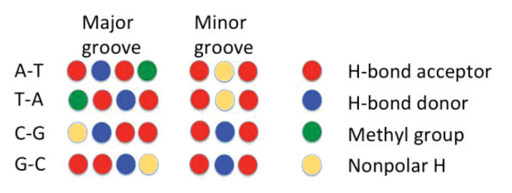
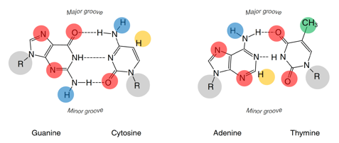
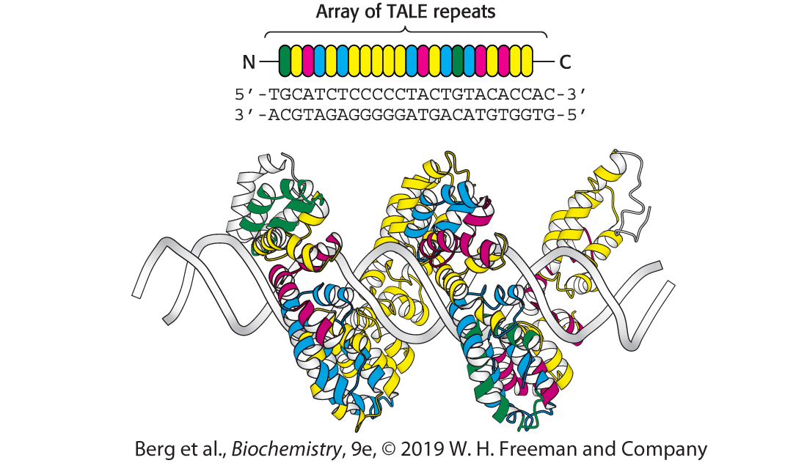

## Opgave 1. Kærlighed ved første blik

<a href="../files/TE6-DNA-groove.pml" download="DNA-groove.pml">
  📥 Click to download PyMOL script.
</a>

<a href="../files/TE6-DNA-groove-colorblind.pml" download="DNA-groove-colorblind.pml">
  📥 Click to download PyMOL script (Colorblind mode).
</a>


I denne opgave skal I lære hvordan proteiner genkender DNA (eller omvendt) for at kunne indgå i en specifik ("romantisk") binding til hinanden. Hemmeligheden bag denne genkendelse kan findes i Liljas "Textbook of Structural Biology" afsnit 10.2, hvor den specifikke interaktion mellem aminosyrer og DNA-baser beskrives. Aminosyrerne kan genkende både major og minor groove via den såkaldte "groove code", der er vist i Liljas figur 10.18. Som det ses i figuren herunder er der eksponerede H-bindings-donorer og acceptorer i både major og minor groove og det er disse, som aminosyrerne kan genkende og binde til:

::: {layout-ncol=1}
{width="80%" fig-align="center"}

{width="80%" fig-align="center"}
:::

### Forklar specificitet i major groove

Forklar hvorfor der er mere specificitet i binding til major groove end til minor groove.

::: {.callout-solution}
Major groove har flere grupper eksponeret (4 i forhold til 3). Desuden kan man se forskel på A-T/T-A og C-G/G-C, hvilket man ikke kan i minor groove. Desuden er der mere plads i major groove.
:::

### Identificer aminosyrer til sekvensspecifik genkendelse

Hvilke aminosyrer vil du tro ofte bruges til sekvensspecifik genkendelse og hvorfor?

::: {.callout-solution}
Aminosyrer der indeholder H-bindings-donorer og acceptorer f.eks. Lys, Arg, Asn, Gln, Asp, Glu, His.
:::

### Undersøg groove-mønster for 1BNA

Groove-koden kan være lidt svært at få øje på når man analyserer en DNA dobbelthelix i PyMOL, men med den rette repræsentation bliver den mere tydelig: **DNA-groove.pml** scriptet, som findes under denne uge på Brightspace, viser DNA-dobbelthelixen som en kuglemodel (spheres), hvor H-bindingsacceptorer er farvet røde, H-bindingsdonorer blå, metylgrupper grønne og ikke-polære hydrogenatomer gule.

***PyMOL info**: Sphere-repræsentationen viser Van der Waals-radius af atomer og giver dermed et billede af molekylets realistiske form og fylde. Farvning af atomerne ses tydeligere pga. deres størrelse. Til gengæld er det ikke let at aflæse den kemisk sammensætning (som man ser det med sticks) eller den sekundære struktur (som man ser det med cartoon).*

Åben DNA dobbelthelix med PDB-ID: 1BNA i PyMOL og fjern vand-molekyler med PyMOL kommandoen "remove solvent". Brug nu **DNA-groove.pml** script til at ændre på repræsentationen og farvelægge donorer- og acceptorer i grooves. Rotér molekylet, så du ser ned i major groove (så symmetrien bliver tydelig).

Hvad er specielt ved groove-kode-mønstret for denne DNA dobbelthelix?

::: {.callout-solution}
Groove-kode-mønstret er symmetrisk, hvilket skyldes at sekvensen i DNA dobbelthelixen er et palindrom.
:::

## Opgave 2. Der skal to til tango

Det er vigtigt for DNA-bindende proteiner at kunne gribe fat om DNA-dobbelthelixen og interagere med specifikke base-sekvenser. DNA-molekylet bindes ofte af homodimeriske DNA-bindende proteiner i områder med såkaldte "basepar-palindromer".

### Giv eksempel på et basepar-palindrom

Giv et eksempel på et "basepar-palindrom" og forklar hvilke geometriske egenskaber det har og hvorfor homodimeriske proteiner kan lide at binde der.

::: {.callout-solution}

- `5'-GCGCGCGC-3'` 
- `3'-CGCGCGCG-5'`

Palindrom læses ens forfra og bagfra. Basepar-palindrom er symmetrisk om central 2-fold symmetriakse, hvilket medfører et symmetrisk mønster af H-bindings-donorer og -acceptorer i store og minor groove. Homodimer proteiner har ligeledes en 2-fold symmetriakse, hvilket gør det lettere at udvikle et symmetrisk mønster af H-bindings-donorer og -acceptorer, der kan genkende det symmetriske DNA mønster.

:::

### Beskriv DNA-bindingsdomæner

Som det ses i Tabel 10.1 i Liljas "*Textbook of Structural Biology*" findes der flere forskellige familier/typer af DNA-bindende proteiner, der via forskellige DNA-bindingsdomæner interagerer med DNA dobbelthelixen.

Beskriv hovedtyperne af DNA-bindingsdomæner og hvordan de interagerer med DNA.

::: {.callout-solution}

**Leucine zipper:** Dimeriseringsmotiv for to alfahelicer. Motivet forlænges ofte med to DNA-bindende basiske alfahelicer, der binder DNA major groove, hvor sidekæder interagerer med baserne. Symmetrisk binding. Liljas Fig. 10.10.

**Helix-loop-helix:** Motiv på en leucine zipper, der ændrer vinklen på DNA-bindende helicer i DNA major groove. Liljas Fig. 10.11.

**Helix-turn-helix:** Helix 2 binder i major groove. Sidekæder interagerer med baserne. Kan indgå i symmetrisk binding, men kan også binde som monomer/heterodimer. Liljas Fig. 10.12.

**Zn finger:** 2His-2Cys binder Zn. Binder i major groove. Helix-ende and loop-rester binder specifikt til baser. Liljas Fig. 10.15.

:::

### Diskuter fordele ved heterodimer-binding

DNA-bindende proteiner har en vigtig rolle som gen-specifikke transskriptionsfaktorer, der kan aktivere eller hæmme mRNA syntese. I eukaryoter findes der flere heterodimeriske transkriptionsfaktorer.

Hvad er de mulige fordele ved DNA-binding af en heterodimer?

::: {.callout-solution}
Giver flere muligheder for bindingssites, da sekvensen nu ikke behøver være en palindrom-sekvens. Desuden giver det mulighed for regulering ved at begge proteiner skal være udtrykt på samme tid for at bindingen kan forekomme.
:::

### Beskriv ligand-binding regulering af DNA

Binding af en ligand til et DNA-bindende protein kan regulere DNA-bindingen.

Hvad er mekanismen hvormed ligand-binding kan påvirke proteinets evne til at binde DNA? Nævn et par eksempler på regulering med denne mekanisme.

::: {.callout-solution}
Mekanismen er at ligand-binding påvirker konformationen af proteinet, så det f.eks. går fra en konformation hvor det ikke kan binde til en anden konformation hvor det kan binde. Det kan f.eks. være at afstanden mellem to genkendelses-helicer justeres så de passer i afstand til binding i major groove (eksempel er Trp repressor der binder Trp, CAP-protein der binder cAMP, og *lac* repressor, der binder allolactose).
:::

## Opgave 3. TATA-box

<a href="../files/TE6-TATA.pml" download="TATA.pml">
  📥 Click to download PyMOL script.
</a>

Det TATA-box bindende protein (TBP) er involveret i promoter-genkendelse mht. at starte RNA polymerase transskription. TATA-boksen er en 8-basepar del af promoteren, der normalt er lokaliseret 30 nukleotider før transskription start site (TSS). Konsensus-sekvensen er `TATA(A/T)A(A/T)(G/A)`.

Åben `TATA.pml` scriptet i PyMOL. **F1** viser bindingen af TBP langs den heliske akse for DNA-dobbelthelix.

### Find TBP-bindingsgroove

I hvilken groove af DNA-dobbelthelix binder TBP?

::: {.callout-tip title="PyMOL Hint"}
Groove kan identificeres ved at zoome ind på basepar og identificere Högsteen- og sukker-side. Vis f.eks. et basepar med kommandoen `show sticks, resi 7+23` og zoom ind for at undersøge dette med kommandoerne `zoom resi 7+23` og juster dybden med musehjulet, så der fokuseres på baseparret. Rotér derefter så du ser baseparret fra siden. Tryk **F2** for at vise den ønskede visning.*
:::

::: {.callout-solution}
Minor groove.
:::

### Beskriv groove-mønstret ved TBP-bindingssted

Tryk **F1** og brug groove-kode scriptet (`DNA-groove.pml`) til at vise DNA-dobbelthelixen som kuglemodel, hvor H-bindingsacceptorer er farvet røde, H-bindingsdonorer blå, metylgrupper grønne og ikke-polære hydrogenatomer gule. Skjul TBP for bedre at kunne se groove-mønster.

Hvad karakteriserer mønsteret i groove, hvor TBP binder? 

::: {.callout-solution}
Mønsteret består af H-bindingsacceptorer (røde) og ikke-polære hydrogenatomer (gule), hvilket opstår i minor groove for AT basepar.
:::

### Beskriv TBPs sekundære DNA-bindingsstruktur

Hvad karakteriserer TBPs sekundære struktur, der binder til DNA groove? 

::: {.callout-solution}
Beta sheets interagerer med minor groove.
:::

### Undersøg phenylalanin-interkalering

Tryk **F3/F4** for at se et vigtigt element i DNA-protein bindingen, hvor to phenylalaniner interkalerer mellem to basepar. 

Hvordan er de to basepar påvirket af interaktionen med de to phenylalaniner? Hvilken standardparameter for den relative orientation af baser (Textbook of Structural Biology, figur 5.16) beskriver bedst konformationen af disse to basepar?

::: {.callout-solution}
Phenylalaninerne indsætter sig mellem basepar og hjælper til at forankre TBP i minor groove. Roll parameter.
:::

## Opgave 4. Mad-Max

<a href="../files/TE6-Mad-Max.pml" download="Mad-Max.pml">
  📥 Click to download PyMOL script.
</a>

Max-Myc-Mad er et heterodimerisk transkriptionsfaktor system, der binder specifikt til DNA segmentet CACGTG som tre forskellige komplekser: Myc-Max, Max-Max og Mad-Max. Ifølge forfatterne til den oprindelige artikel om Max-Myc-Mad systemet har navngivningen af Mad (det andet protein i Mad-Max heterodimer) ikke noget at gøre med filmen af samme navn ([**Youtube link**](https://youtu.be/hEJnMQG9ev8)), men kommer fra forkortelsen af "Max dimerization". Hent PyMOL-scriptet `Mad-Max.pml` og kør det i PyMOL. Tryk **F1** for at se Myc-Max komplekset, tryk **F2** for at se Max-Max komplekset, og **F3** for at se Mad-Max komplekset.

### Beskriv dimeriseringsdomænet

Beskriv sammensætningen af dimeriseringsdomænet og hvilken egenskab α-helicerne, der binder DNA, har.

::: {.callout-solution}
Dimeriseringsdomænet består af en leucine-zipper og et helix-loop-helix. α-helicerne, der binder til DNA, er basiske.
:::

### Find bindingsgroove for de tre komplekser

I hvilken groove binder Myc-Max, Max-Max og Mad-Max?

::: {.callout-solution}
Major groove.
:::

### Beskriv mønster af H-bindings-donor-acceptorer

Orientér molekylet i PyMOL, så du ser ned langs pseudosymmetri aksen af Myc-Max og gem derefter Myc-Max, så kun DNA-dobbelthelixen er synlig. Brug groove-kode scriptet (`DNA-groove.pml`) til at vise helixgroove-mønsteret.

Hvad er karakteristisk ved mønsteret af H-bindings-donor og -acceptorer?

::: {.callout-solution}
Mønsteret er rotations-symmetrisk, hvilket skyldes den palindrome sekvens CACGTG.
:::

### Beskriv hydrogenbindinger for aminosyrerne

Tryk **F4** for at se hvordan genkendelses-helixer i Myc-Max interagerer med DNA segmentet.

Tryk **F5** for at se hvordan genkendelses-helixer i Max-Max interagerer med DNA segmentet.

Tryk **F6** for at se hvordan genkendelses-helixer i Mad-Max interagerer med DNA segmentet.

Beskriv hydrogen-bindingerne for de tre aminosyrer (His, Glu, Arg) i genkendelses-helixer i Myc-Max ved at specificere hvilke baser og hvilke atomer på baserne, der indgår i bindingen. Er der andre interaktioner end med baserne? Er interaktionerne symmetriske i Myc-Max, Max-Max og Mad-Max og hvorfor?

::: {.callout-tip title="PyMOL Hint"}
Brug menuen "Mouse > Selection mode > Atoms", så du bedre kan identificere de individuelle atomer, der indgår i hydrogen-bindingerne.*
:::

::: {.callout-solution}
For Myc-Max interagerer Arg914 med backbone P og N7 på G311 base. Glu910 interagerer med N6 på A109. Glu910 interagerer med N4 på C108. His906 interagerer med O6 på G313. Der er også interaktion med P backbone.
Myc-Max og Mad-Max H-bindingerne er ikke helt ens, hvilket skyldes at de er heterodimer og dermed er protein-sekvenserne lidt forskellige, hvilket giver små forskelle i konformation. Max-Max H-bindinger er symmetriske, da det er homodimer.
:::

## Opgave 5. At TALE med DNA

<a href="../files/TE6-TALE.pml" download="TALE.pml">
  📥 Click to download PyMOL script.
</a>

Transskriptionsfaktor-lignende effector nukleaser (TALENs) binder specifikke DNA-sekvenser vha. en række DNA-bindende domæner kaldet TALE-repeats. TALEN-proteiner kan designes til at genkende og kløve specifikke DNA-sekvenser og kan dermed anvendes til genom-redigering (genome editing). TALE-proteiner er omtalt i Berg Biochemistry, udgave 10, side 292, og opbygningen kan ses i figur 9.37 (se nedenstående figur).

{width="80%" fig-align="center" .lightbox}

### Find TALE-proteinets bindingsgroove

Download og åben scriptet `TALE.pml` i PyMOL. Tryk **F1** og **F2** for at se DNA-protein komplekset hhv. fra siden og langs helix aksen. Tryk **F3** for at se sphere-repræsentation, hvor man lettere kan se repeat-strukturen. Tryk **F4** for at se en specifik interaktion mellem protein og DNA. 

I hvilken groove af DNA-dobbelthelixen binder TALE-proteinet? Forklar hvordan du observerer dette.

::: {.callout-solution}
Major groove. Man kan observere major groove på afstanden mellem beta-glykosid bindingerne. Alternativt ved at se på DNA-dobbelthelixen alene og observere, at det er i den major groove proteinet binder - dette kan man dog ikke være helt sikker på, da protein-bindingen kan have deformeret DNA-dobbelthelixen.
:::

### Beskriv TALE-repeat genkendelse af nukleotider

Hvert TALE-repeat indeholder 34 aminosyrer og to alfa-helicer, men kun to aminosyre-rester er ansvarlige for unik genkendelse af et enkelt nukleotid i DNA-dobbelthelixen.

Tryk **F4-F7** for at se hvordan TALE-repeats genkender specifikke nukleotider. Beskriv hvilke aminosyrer, der interagerer med hvilke baser og hvilken type interaktion der er tale om. Hvilken kant af baserne er involveret i interaktionen og hvilken af DNA-strengene genkendes?

::: {.callout-solution}
Fire par og deres interaktionstype: Asparaginsyre-Cytosin (H-bond), Glycin-Thymin (ingen sterisk hindring), Asparagin-Guanin (H-bond), Isoleucin-Adenin (hydrofob). Det er Hoogsteen-siden af basen, der interageres med, da interaktionen foregår i major groove. TALE genkender chain B, hvilket man kan se i PyMOL (5'-3' retningen af strengen genkendes af N-term til C-term rækkefølge af TALE-repeats).
:::

### Forslå protein-funktionaliteter for TALE

Man kan designe TALE-proteiner, så de binder til unikke DNA-sekvenser, ved at organisere rækkefølgen af TALE-repeats ihht. DNA-sekvensen.

Forslå hvilke protein-funktionaliteter man kan sætte i enden af et TALE-proteindomæne og beskriv hvilke biologiske effekter det kan have og/eller hvilke teknologiske muligheder det kan give.

::: {.callout-solution}
Nuklease-domæne giver specifik kløvning af DNA, hvilket kan bruges til genom-redigering. Transkriptionsfaktor-domæne kan aktivere RNA polymerase ved promoter. Der er flere andre muligheder.
:::

## Opgave 6. Trp trap træsko 

<a href="../files/TE6-Trp.pml" download="Trp.pml">
  📥 Click to download PyMOL script.
</a>

I *E. coli* binder Trp-repressor en specifik DNA-sekvens under tilstedeværelse af aminosyren tryptofan (Trp) og hæmmer dermed udtryk af fem gener i *trp-*operon. Trp-repressor danner en homodimer, der binder til DNA-dobbelthelix via to alpha-helicer (kaldet "genkendelseshelicer"). Åben PyMOL-scriptet `Trp.pml` i PyMOL, der laver en strukturel alignment af Trp-repressor (bundet til Trp og DNA) med *apo*-formen af proteinet (ikke bundet til Trp eller DNA). **F1** viser denne alignment.

### Bestem Trp-repressors bindingsgroove

I hvilken groove af DNA binder Trp-repressor med de to genkendelseshelicer? Mål afstanden mellem de to genkendelseshelicer i 1TRO. Hvilken DNA-helix-parameter svarer denne afstand til og hvorfor observeres denne afstand typisk for transkriptionsfaktorer?

::: {.callout-solution}
Major groove. Ca. 31,6 Å, hvilket ca. svarer til pitch (afstand for fuldt turn = 10.44 bp/turn x 3.4 Å rise/bp) = 35,5 Å. Transskriptionsfaktorer er ofte homodimerer, der binder symmetrisk i major groove.
:::

### Undersøg Trp-bindings effekt på repressor

Hvilken del af proteinet påvirkes mest af binding til Tryptofan? Mål afstanden mellem de to genkendelseshelicer for *apo*-repressoren og beskriv hvilken effekt ændringen må forventes at have på binding af DNA.

::: {.callout-solution}
Genkendelses-helicernes position ændres mest. Afstanden mellem genkendelseshelicerne er nu 24.5 Å. Det ser ud til at genkendelses-helicerne kommer for tæt på DNA rygrad og derfor ikke kan binde i major groove.
:::

### Beskriv groove-mønstret for Trp-repressor

Brug groove-kode scriptet (`DNA-groove.pml`) til at vise DNA-dobbelthelixen som kuglemodel, hvor H-bindingsacceptorer er farvet røde, H-bindingsdonorer blå, metylgrupper grønne og ikke-polære hydrogenatomer gule. Skjul Trp repressor, så kun DNA dobbelthelix ses.

Hvad er karakteristisk ved mønsteret af H-bindingsdonorer og -acceptorer og hvad fortæller det om bindingen af Trp repressor?

::: {.callout-solution}
De to major grooves har samme mønster, der er rotationssymmetrisk omkring symmetriaksen. Det fortæller at Trp er homodimer, hvor hver monomer binder samme DNA-sekvens.
:::

### Identificer Arg69's base-interaktion

Tryk **F2** for kun at se polære kontakter mellem genkendelseshelicer og DNA-dobbelthelix. Hvilken kant af basen interagerer Arginin-69 med? Hvilke typer af interaktioner ser man typisk bidrage til bindingsspecificitet mellem DNA og protein?

::: {.callout-solution}
Arginin-69 interagerer med Högsteen-siden af Guanin-2. DNA-sekvensen bliver også genkendt via form-komplementaritet og hydrofobe interaktioner.
:::

## Opgave 7. Arc repressor 

***PyMOL-scripting opgave**: I denne opgave skal I analysere DNA-protein binding i PyMOL. I vil lære hvordan man farver proteiner efter sekundær struktur og hvordan man finder polære bindinger mellem to selektioner.*

Arc-repressor (PDB-ID: 1BDT) er en transskriptionsfaktor fra bakteriofag P22, der hæmmer dets eget gen *arc*. Arc-repressor binder kooperativt som to dimerer til et 21-basepar operator site. DNA operator-sekvensen er vist herunder, hvor TAGA-sekvensen er farvet grå. Det brudte palindroms pseudosymmetri-akse går igennem det centrale G-C basepar.

- `5'-ATAGTAGAGTGCTTCTATCAT-3'`
- `3'-TATCATCTCACGAAGATAGTA-5'`

### Lav script til Arc-repressor-analyse

Lav et script, der gør følgende:

a. Henter Arc-repressoren og viser DNA-protein komplekset med pseudosymmetri-akse langs PyMOLs y-akse. Gem scenen med navnet **F1** (scene F1, store).

b. Lav en scene kaldet **F2**, der farver sekundær struktur (se nedenstående PyMOL info).

c. Lav en scene kaldet **F3**, der viser afstanden mellem de to bindingselementer. Hint: Brug distance-funktionen mellem to atom selektioner på aminosyrer i bindingselementerne og brug mode=0, se nedenstående PyMOL info.

d. Lav en scene kaldet **F4**, der viser DNAs interaktion med proteinet. Vis genkendelses-element (rest 8-14) og DNA (chain E+F) som sticks med element farver. Find nu hydrogenbindinger mellem genkendelses-element (rest 8-14) og DNA. Hint: Brug distance-funktionen mellem genkendelses-element og DNA med mode=2, se nedenstående PyMOL info.

::: {.callout-note title="PyMOL Info: Sæt farve på sekundærstruktur"}
Når man farver proteiner efter sekundær struktur er der ikke en samlet kommando, der gør det. Man er nødsaget til at farve hver type, altså alphahelicer, betastrands og loops, enkeltvis. Loops indeholder alle sekundære strukturer, der ikke er betastrands eller alphahelicer. I har tidligere lært at property selektoren for sekundær struktur er `ss`. PyMOLs navn for alphahelicer, betastrands og loops er hhv. `h`, `s` og `l+""`. Man ville altså farve loops hvide med kommandoen: `color white, ss l+""`.
:::

::: {.callout-note title="PyMOL Info: Distance funktionens mode"}
Distance funktionen kan tage et ekstra argument kaldet mode, som har flere indstillinger, men de vigtigste er `mode=0` og `mode=2`. Med `mode` kan man bestemme hvilken type interaktioner man vil medtage. `mode=0` er default og er bare afstanden mellem alle punkter i de to selektioner. `mode=2` viser udelukkende de polære bindinger mellem to selektioner. [Læs mere her](https://pymolwiki.org/index.php/Distance).
:::

::: {.callout-solution}
PyMOL script:

```default

```
:::

Brug nu dit script til at svare på de følgende spørgsmål.

### Beskriv DNA-bøjning ved Arc-binding

Tryk **F1**. Bindingen af Arc-repressor påvirker DNA-dobbelthelixen og fører til en bøjning. Hvilken basestak-parameter (Liljas figur 5.16) beskriver bedst bøjning?

::: {.callout-solution}
Roll-parameter beskriver typisk helix bøjning over major eller minor groove. Dette blev nævnt til forelæsningen og var også et svar i opgave 3. Det kan være svært at se på de enkelte basestakke, men ses bedre hvis man sammenligner vinklen på baserne i enden af helixen, hvor man kan se den samlede effekt.
:::

### Beskriv sekundær struktur i DNA-binding

Tryk **F2**. Beskriv bindingen af Arc-proteinet til DNA. Hvilken type protein-sekundær struktur binder til hvilken groove på DNA dobbelthelixen? Beskriv hvordan du observerer hvilken groove der bindes.

::: {.callout-solution}
Anti-parallel beta sheet. Major groove. Man kigger på basepar i groove og observerer hvilken side af basepar der bindes af proteinet. Det er specielt vigtigt at gå ind og se på baseparret, da man pga. helix-bøjning kan have svært ved at se hvad der er major/minor groove ihht. Watson-Crick-skiløber-reglen.
:::

### Find DNA-helixparameter for afstanden

Tryk **F3**. Hvilken DNA-helix parameter svarer denne afstand til?

::: {.callout-solution}
Ca. 3,4 nm. Afstand for fuldt turn = 10.44 bp/turn x 3.4 Å rise/bp = 35,5 Å. Helix parameter kaldes `pitch`.
:::

### Identificer H-bindingspartnere i active site

Tryk **F4**. Hvilke aminosyrer hydrogenbinder til baserne? Hvilke andre typer af interaktioner bidrager til bindingsspecificitet?

::: {.callout-solution}
Asn11 og Gln9. DNA-sekvensen bliver også genkendt via form-komplementaritet og hydrofobe interaktioner.
:::
