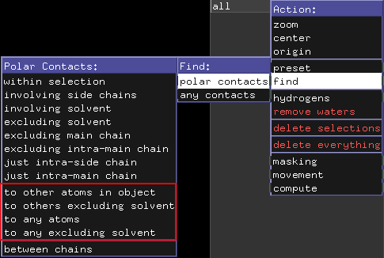
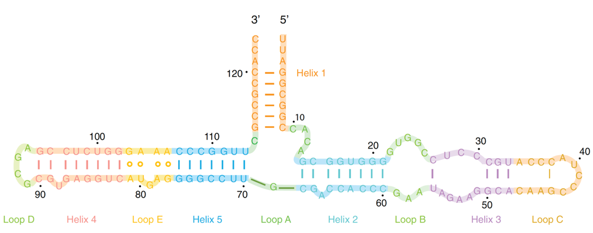
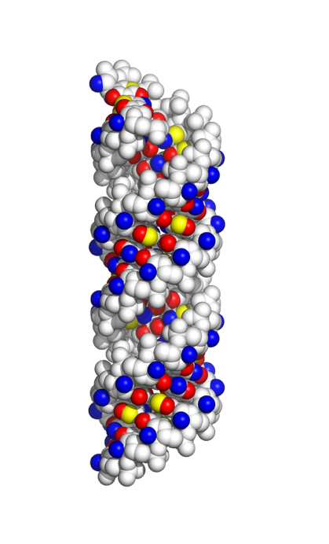

## Opgave 1. RNA-protein binding



Strukturelle RNA motiver bruges ofte til specifik binding af proteiner. Hent og åben pml filen `RNA-protein.pml`. Tryk **F1** for at se TAR hårnål og **F2** for at se binding til Tat proteinet. Tryk **F3** for at se kink-turn motivet og **F4** for at se binding til L7 proteinet.

### Beskriv basepar i TAR hårnål

Tryk **F1**. Beskriv udfra Leontis-Westhof basepar klassifikationen (Liljas tabel 5.2) de basepar interaktioner, der er markeret med grøn på TAR hairpin.

::: {.callout-solution}
AU cWW, UA cWH
:::

### Find groove for Tat-binding

Tryk **F2**. Bestem hvilken groove (deep eller shallow) af TAR hårnål som Tat proteinet binder i.

::: {.callout-solution}
Tat proteinet binder i deep groove på TAR hårnål.
:::

### Beskriv basepar i kink-turn motivet

Tryk **F3**. Beskriv udfra Leontis-Westhof basepar klassifikationen de non-Watson-Crick basepar, der er markeret med grøn på kink-turn motivet.

::: {.callout-solution}
A20-G6 tHS, A7-G19 tHS
:::

### Find groove for L7-binding

Tryk **F4**. Bestem hvilken groove (deep eller shallow) af kink-turn motivet som L7 proteinet binder i.

::: {.callout-tip title="PyMOL hint"}
For at identificere deep eller shallow groove af en RNA-dobbelthelix selekteres et WC-basepar med henblik på nærmere undersøgelse. For at zoome ind på et basepar vælges det først med musen og herefter bruges kommandoen **[zoom](https://www.pymolwiki.org/index.php/Zoom)** f.eks. zoom sele. Dernæst kan andre elementer fjernes med hide (not sele). Alternativt kan du bruge musehjul til at justere clipping plane omkring din selektion. Deep eller shallow groove kan nu identificeres på baseparret vha. placeringen af beta-glykosid-bindingerne. Du kan så trykke funktionstast for at komme tilbage til udgangspunktet.
:::

::: {.callout-solution}
L7 proteinet binder i deep groove på kink-turn motivet.
:::

## Opgave 2. tRNA og syntetase



tRNA har en kompleks tertiær struktur med mange non-Watson-Crick basepar. Her skal vi kigge på et par af disse non-Watson-Crick basepar og hvordan tRNA bindes af sin syntetase. Åben pml scriptet `tRNA.pml` i PyMOL. **F1** viser tRNA-molekylet i cartoon-repræsentation med bundne Mg^2+^ og Mn^2+^ ioner.

### Beskriv basepar i T-loop

**F2** viser et basepar i T-loop. Hvordan beskrives denne type basepar interaktion ifgl. Leontis-Westhof basepar klassifikationen?

::: {.callout-solution}
tWH
:::

### Beskriv pseudoknot baseparret G19-C56

**F3** viser pseudoknot baseparret G19-C56. Hvilke standard parametre for den relative orientation af baser (Liljas Fig. 5.16) beskriver bedst dette basepar?

::: {.callout-solution}
Propeller & buckle
:::

### Beskriv base triple og G46 modifikation

**F4** viser en base triple af C13:G22/G46. Hvilken interaktion dannes mellem de to G baser (brug Leontis-Westhof)? Hvordan er G46 modificeret?

::: {.callout-solution}
tWH (kig evt. på backbone retning, der er anti-parallel). Methyleret på position 7.
:::

### Find base-specifikke interaktioner med syntetasen

**F5** viser tRNA-Gln syntetase (PDB-ID: 1GTR). Hvilke dele af tRNAet interagerer base-specifikt med syntetasen? Brug nedenstående PyMOL info til at finde interaktioner mellem tRNA og syntetasen. Vis DNA helix som "lines" og undersøg nu hvor baser er involveret i hydrogenbindinger til proteinet.

::: {.callout-note title="PyMOL Info"}
Under Actions findes en funktion kaldet "find", der gør det muligt at finde interaktioner mellem objekter og/eller selektioner. Funktionen har to undermenuer, men vi vil fokusere på undermenuen "polar contacts". Under "polar contacts" er der mange forskellige muligheder for at inkludere eller ekskludere interaktioner med f.eks. solvent, sidekæder og mainchain. De vigtigste at kende er dem markeret med en rød firkant på billedet forneden. I nogle situationer vil andre dog være bedre, så man må prøve sig frem, for at finde ud af hvilken funktion, der er bedst i den givne situation. Dette er den manuelle måde at gøre det samme, som det man kan med distance-kommandoen.

{width="80%" fig-align="center" .lightbox}
:::

::: {.callout-solution}
Hovedsageligt acceptor stem og anticodon loop.
:::

### Identificer aminosyrer der binder position 35

Identificer aminosyrer der binder til midterste position i anticodon (position 35). 

::: {.callout-tip title="PyMOL Hint"}
Selektér residue U35 og brug den "find"-funktion, der bedst viser interaktionerne mellem base og protein. 

Alternativt bruges dist funktionen, der blev introduceret i TØ6 opgave 7. Identificer nu interaktions-partnere. Gøres lettest ved at vise protein som "lines" og zoome ind på U35.
:::

::: {.callout-solution}
Menuen "to other atoms in object" fremhæver H-bindingerne. Q517, R341 og R520.
:::

### Forklar ATP-molekylets rolle

Hvad tror du er rollen for ATP-molekylet, der er bundet tæt ved CCA enden?

::: {.callout-solution}
Energi til Gln charging.
:::

## Opgave 3. 5S rRNA og L25





5S ribosomalt RNA (5S rRNA) er ca. 120 nukleotider-langt og er en funktionel komponent af den store subunit af ribosomet. Herunder vises den sekundære struktur med angivelse af enkelte non-Watson-Crick basepar (markeret med åbne cirkler). Interne loops i RNA struktur er beskrevet i afsnit 5.3.7.2 (side 135) i Liljas *Textbook of Structural Biology*.

{width="90%" fig-align="center" .lightbox}

### Beskriv sekundærstrukturelementerne i 5S rRNA

Beskriv de navngivne elementer i den sekundære struktur for 5S rRNA med angivelse af bulge-, loop- og junction-typer.

::: {.callout-solution}
- Helix 1,2,3,4,5 er stammer med buler eller interne loops. 
- Loop C er hairpin med 13-nt loop.
- Loop D er hairpin med tetra loop. 
- Loop B og E er et asymmetrisk internt loop. 
- Loop A er 3-stamme krydsning.
:::


### Beskriv L25-protein interaktion med RNA

Loop E-motivet bindes af det ribosomale protein L25 og strukturen af komplekset er blevet bestemt med NMR. Åben scriptet `LoopE-L25.pml` i PyMOL. **F1** viser komplekset vist i cartoon-repræsentation, hvor et udvidet loop E-motiv er markeret i gul.

Beskriv hvilke protein-strukturelementer i L25, der interagerer med RNA-dobbelthelicen og i hvilke grooves. Hint: For at finde grooves skal man ikke kigge på loop E motivet (markeret i gul), men derimod på den mere regulære helix (markeret i blå), så man kan se hvad der er deep og shallow groove inde i loop E motivet.

::: {.callout-solution}
- Beta-sheet interagerer med shallow groove.
- Alfa-helix interagerer med deep groove.
:::


### Beskriv tre non-Watson-Crick basepar

**F2-F8 **viser de 7 non-Watson-Crick basepar i Loop E motivet.

Beskriv de tre non-Watson-Crick basepar der vises i **F2**, **F3** og **F8 **ihht. Leontis-Westhof-basepar klassifikationen.

::: {.callout-solution}
- F2: AG tHS
- F3: UA tWH
- F8: GA tSH
:::


### Sammenlign groove med normal A-form RNA

Tryk **F9** for at se RNA-dobbelthelixen vist som kuglemodel, hvor H-bindingsacceptorer farvet røde, H-bindingsdonorer blå, metylgrupper grønne og ikke-polære hydrogenatomer gule. Proteinet kan fjernes ved at trykke **F10**.

{width="90%" fig-align="center" .lightbox}

Hvordan ser deep og shallow groove ud ved protein-bindingsstedet i forhold til en normal A-form RNA helix (se ovenstående billede)? Hvordan adskiller mønsteret af H-bindingsdonorer og -acceptorer ved bindingsstedet i shallow groove fra en normal A-form RNA helix (farvekode: blå=donor, rød=acceptor, gul=non-bindende H)?

::: {.callout-solution}
Deep groove er meget smal. Shallow groove er større end normalt.
Loop E motivet har et meget mere komplekst mønster af H-bond donorer og acceptorer end der normalt er i shallow groove.
:::

### Beskriv H-bindinger fra L25 aminosyrer

**F11** viser de L25 aminosyrer i beta sheet, der H-binder til et centralt non-Watson-Crick basepar (G275-A301) i shallow groove af loop E. **F12** viser de L25 aminosyrer i alfa-helix, der H-binder til et centralt Watson-Crick basepar (G279-C297) i deep groove.

Beskriv H-bindingerne mellem L25 aminosyrerne og baseparrene, der ses i **F11** og **F12**. Svaret skal indeholde angivelse af interaktioner til specifikke atomer på baseparret. Hvilke interaktioner bidrager generelt til sekvensspecifik binding af RNA-bindende proteiner?

::: {.callout-solution}
**F11**:

- Lys10 binder OP1 på fosfat af G275
- His88 binder 2'OH af G275
- Asp76 og Asp 90 binder begge N2 på G275

**F12**:

- Gly15 binder OP2 på fosfat af C297
- Lys14 binder O6 på Hogsteen side af G279
- Sekvens-specifik binding opnås via H-bindinger, form komplementaritet og hydrofobe interaktioner.
:::

## Opgave 4. CRISPR-Cas9 



Cas9-proteinet binder til et guide RNA, som dirigerer komplekset til binding af komplementær DNA-sekvens, der kløves. Vi skal her se nærmere på opbygning og funktion af dette multifunktionelle RNA-bindende protein. Guide RNA blev oprindeligt designet ved at sammenkoble 3′-enden af crRNA med 5′-enden af tracrRNA med et GAAA tetraloop ([**Jinek-2012**](https://science.sciencemag.org/content/337/6096/816)). Opgaven baserer sig på informationer fra oprindelig artikel om Cas9 krystalstruktur ([**Nishimasu 2014**](https://www.sciencedirect.com/science/article/pii/S0092867414001561?via%3Dihub#undfig1)). Du kan læse mere om CRISPR-Cas9 i Berg Biochemistry, udgave 10, side 293-294.

Åben scriptet `CRISPR.pml` i PyMOL og svar på følgende spørgsmål.

### Find guide RNA hairpins og helixtype

Tryk **F1** for at se guide RNAet. Hvor mange hairpins er der? Hvilken helix type danner DNA-RNA-hybriden?

::: {.callout-solution}
4 hairpins. A-form, da RNA-strengen inducerer A-form pga. 2'OH og C3'-endo konformation.
:::

### Find domæner i kontakt med hairpin

**F2** viser proteinet, hvor RuvC-domænet er cyan, REC-domænet grå, HNH-domænet lyserød, PI-domænet brun, og DNA-strengen rød. Beskriv hvilke protein-domæner der er i kontakt med hairpinet, der involverer nukleotiderne 82-96.

::: {.callout-solution}
RuvC og PI.
:::

### Identificer basepar ved nukleotid 33-36

**F3** zoomer ind på det kunstigt indsatte GAAA tetra-loop og viser H-bindinger mellem residue 33 og 36. Hvilken type non-Watson-Crick basepar dannes af nukleotid 33 og 36?

::: {.callout-solution}
tHS.
:::

### Beskriv REC-domænets hydrogenbindinger

**F4** viser den del af recognition (REC) domænet, der binder til RNA hairpin. **F5** viser RECs interaktion med baser i deep groove og **F6** viser RECs interaktion med baser i shallow groove af RNA helix. Beskriv de specifikke hydrogenbindings-interaktioner mellem baser og aminosyrer.

::: {.callout-solution}
**F5**: Phe351 og Asp364 interagerer med G43, der er uparret base.\
**F6**: Ser104 og Phe105 interagerer med U24 og A47 i minor groove.
:::

## Opgave 5. Argonaut 

***PyMOL scripting opgave**: I denne opgave skal I analysere en RNA-protein binding i PyMOL og dokumentere jeres analyse med scripting af scener (som I blev introduceret til i TØ 2).*

Ago (PDB-ID: 3HK2) er en kerne-komponent i RNA-induceret silencing kompleks (RISC) og har en essentiel rolle i guide-streng-medieret target RNA genkendelse, kløvning og produkt-frigørelse. Ago består af domænerne PAZ, Mid og PIWI. PIWI-domænet har RNase-aktivitet, Mid-domænet binder 5'-fosfat af guide-streng, mens PAZ-domænet genkender et 2-nukleotid overhæng i 3'-enden af guide-strengen. Opgaven er baseret på informationer fra den oprindelige artikel ([**Wang-2009**](https://www.nature.com/articles/nature08434)). Se desuden Berg Biochemistry, udgave 10, side 294-295 for en beskrivelse af RNA interferens og side 971-972 for en beskrivelse af Ago.

### Lav PyMOL-script til Ago-analyse

Lav et PyMOL script der gør følgende:

a.  Henter Ago. Hint: Brug `fetch 3HK2, type=pdb1, async=0` for at hente *the biological assembly*. Læs mere [her](https://pdb101.rcsb.org/learn/guide-to-understanding-pdb-data/biological-assemblies).

b.  Farver, RNA, DNA, og Ago's 4 domæner (N-domæne: rest 1-100, PAZ-domæne: rest 177-272, Mid-domæne: rest 338-464, PIWI-domæne: rest 464-685) i forskellige farver. Gem det som scene **F1**. Hint: Find DNA strengen ved at finde strengen, der indeholder T.

c.  Lav en ny scene, der viser interaktionerne mellem Ago og 5'-T på DNA-strengen. Gem det som scene **F2**.

d.  Lav en ny scene, der viser hydrogenbindinger mellem Ago og DNA/RNA-strengen. Gem det som scene **F3**.

Brug nu dit script til at svare på følgende spørgsmål:

::: {.callout-solution}
Se scriptet nedenfor

```default

```
:::


### Find domæne der binder 5'-T

Tryk **F1**. Hvilket domæne binder 5'-T på DNA-strengen?

::: {.callout-solution}
Mid domænet.
:::


### Bestem DNA-RNA helix konformation

Er konformationen af DNA-RNA dobbelthelicen A- eller B-form?

::: {.callout-solution}
Konformationen er A-form som det kan ses på C3'-endo sugar pucker. Man kan se det ved at zoome ind på nukleotid og se på sukkerens konformation.
:::


### Beskriv hydrogenbindinger til 5'-nukleotider

Tryk **F2**. Beskriv hydrogen-bindinger til de første nukleotider på DNA-strengen. Hvilken rolle spiller Mg^2+^-ion?

::: {.callout-solution}
T1-base H-binder til Met413. G2-base H-binder til Asn449. Mg^2+ ^koordinerer fosfater i backbone.
:::


### Undersøg bindingsdomæner og specificitet

Tryk **F3**. Undersøg hydrogen-bindinger til resten af DNA- og RNA-strengene. Hvilke domæner er involveret i bindingen? Er interaktionerne med baserne eller backbone og hvad fortæller det om bindingen?

::: {.callout-solution}
Ago H-binder til sukker-fosfat-rygrad af DNA og RNA streng, hvilket betyder at det er en sekvens-uspecifik binding. Alle domæner er involveret i binding.
:::
