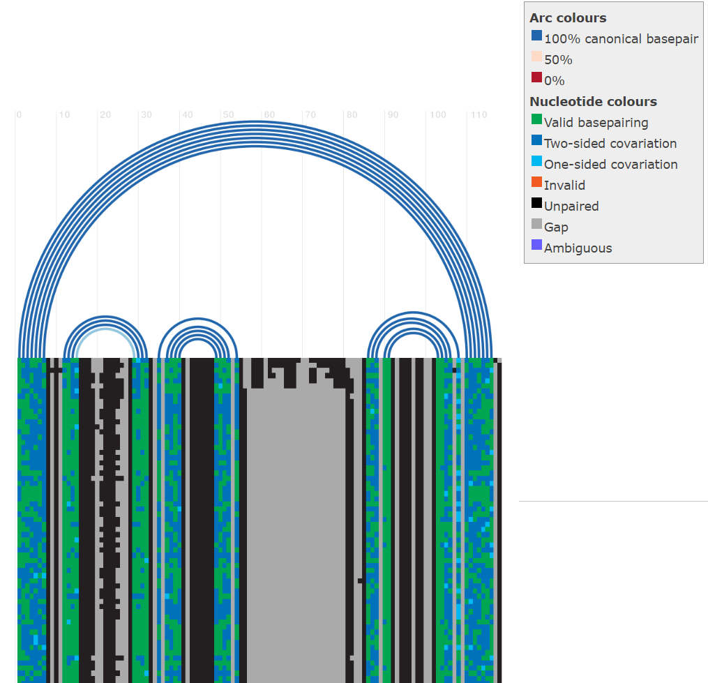
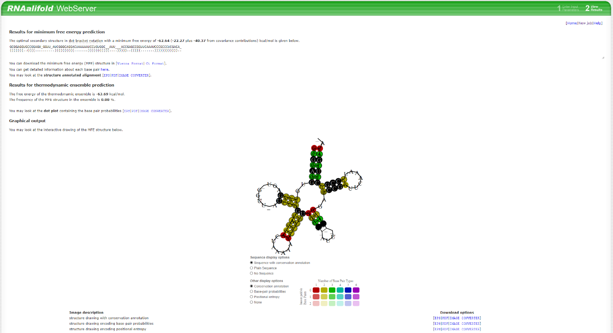
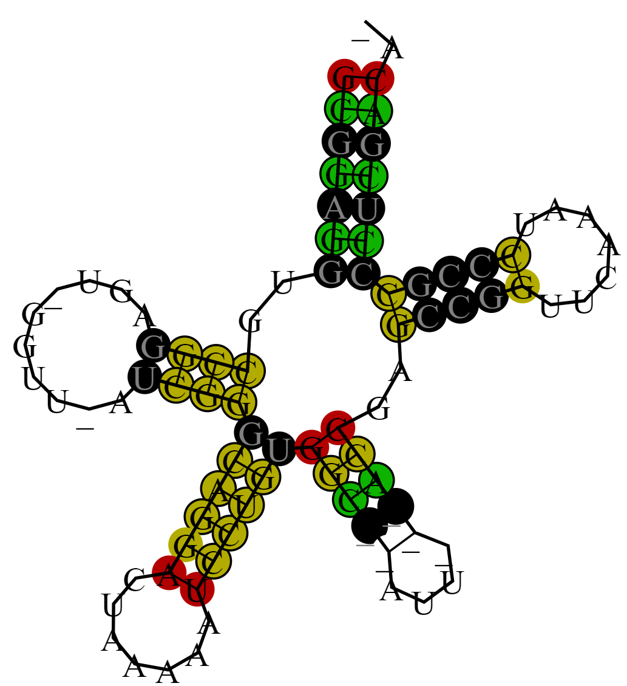
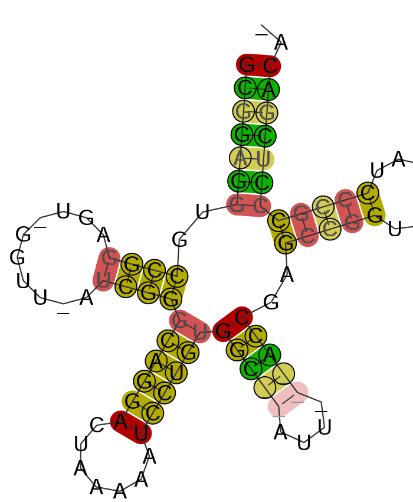
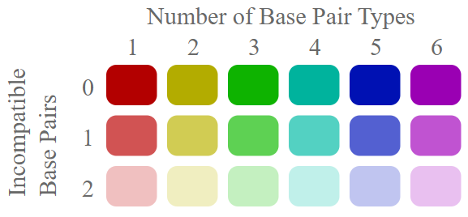
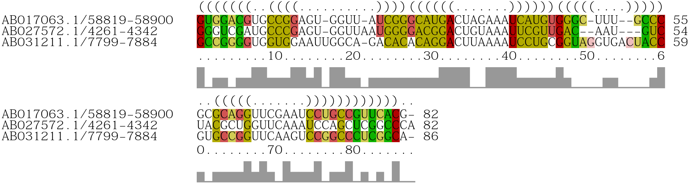
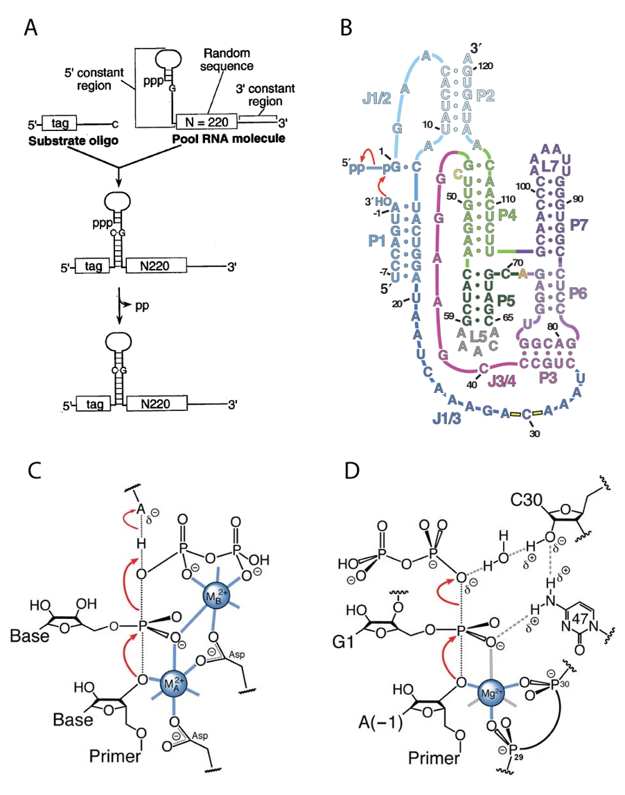
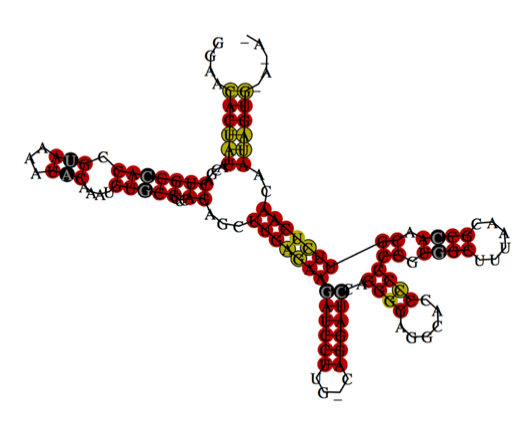

## Opgave 1. tRNAs familiealbum

Vi skal nu kigge på den bredere evolution af tRNA ved at finde en alignment af alle kendte tRNA-sekvenser i RNA familie-databasen ([**Rfam**](http://rfam.xfam.org)).

### Undersøg tRNA-bevarelse i Rfam

Gå til Rfam-databasen og søg efter "tRNA". Tryk på "Secondary structure" under tRNA-familien. Klik på "seqcons" (sekvensbevarelse) og bpcons (baseparbevarelse). Hvad er mest bevaret, struktur eller sekvens? 

::: {.callout-tip title="Hint"}
I nedre venstre hjørne ses et farvespektrum fra ikke bevaret (0) til stærkt bevaret (1).
:::

::: {.solution-callout}
Struktur er mere bevaret end sekvens.
:::

### Analyser Rchie-plot for tRNA

Kig nu på "Rchie" plottet, der vises i boksen herunder. Plottet viser sekvenser (blok med farver, hvor hver vandrette linje repræsenterer en sekvens) og deres sekundær struktur (buer vist på toppen, der forbinder baser der danner basepar). Hvilke stems indeholder mest covariation? Kig ned gennem alignmenten -- hvad adskiller nogle tRNA sekvenser fra andre? 

::: {.solution-callout}
Stem 1 og 3 (talt fra 5' ende)\
Nogle tRNA sekvenser har insert mellem stem 3 og 4.
:::

Læs om Rchie plots i boksen herunder.

::: {.callout-note title="Rchie-plots"}

Om de forskellige nukleotidfarver som skrevet i Rchie plots (fra [e-RNA.org](https://www.e-rna.org/r-chie/faq.cgi))

{width="65%" fig-align="center"} 

**Covariation** (correlated variation): refererer til ethvert validt basepar (A:U, G:C, G:U) som adskiller sig fra det mest gængse observerede valide basepar. Det vil sige at der er kompensatoriske baseparændringer (mutationer), som stadig muliggør baseparring samt sekundær struktur.

- **One-sided covariation:** Den ene base i baseparret skifter, men baseparret kan stadig dannes, hvilket er muligt grundet GU wobble. Altså vi har en ændring fra G:C til G:U, fra A:U til G:U eller vice versa.

- **Two-sided covariation:** Begge baser i baseparret adskiller sig fra det mest gængse observerede basepar på denne position. Her er der mange muligheder. Kan både være transitioner og transversioner.

**Invalid:** alle basepar der ikke er enten A:U, G:C eller G:U

**Ambiguous:** Enhver base, som ikke er A, C, G, T eller U.

**Unpaired:** De uparrede. Loops eller bulges.

:::

Vi skal nu undersøge de tRNA sekvenser der adskiller sig. Følgende tRNA-sekvenser er downloadet fra Rfam: 

```default
>AB017063.1/58819-58900
GUGGACGUGCCGGAGU-GGUU-AUCGGGCAUGACUAGAAAUCAUGUGGGC-UUU--GCCCG-CGCAGGUUCGAAUCCUGCCGUUCACG
>AB027572.1/4261-4342
GGGUCGAUGCCCGAGU-GGUUAAUGGGGACGGACUGUAAAUUCGUUGAC--AAU---GUCUACGCUGGUUCAAAUCCAGCUCGGCCCA
>AB031211.1/7799-7884
GCCGGGGUGGUGGAAUUGGCA-GACACACAGGACUUAAAAUCCUGCGGUAGGUGACUACCG-UGCCGGUUCAAGUCCGGCCCUCGGCA
```

### Fold atypiske sekvenser med RNAalifold

Prøv at folde dem i [**RNAalifold server**](http://rna.tbi.univie.ac.at/cgi-bin/RNAWebSuite/RNAalifold.cgi). Hvordan adskiller strukturen sig fra tRNA? Er denne struktur understøttet af co-variationer? 


::: {.callout-tip title=Hint}
Der ses en masse undermenuer, hvor man kan vælge foldningsalgoritme mm. Disse skal bare ignoreres. De sorte basepar betyder mismatches i alle sekvenser.
:::

::: {.solution-callout}
Har extra stem mellem stem 3 og 4.\
Ja, der er covariationer i stem.
:::

Læs om RNAalifold output i boksen herunder.

::: {.callout-note title="RNAalifold output"}

Én ting der her er værd at bemærke, er at sekvensen, der vises i sekundærstrukturen, er et gennemsnit af de tre alignede, hvor den mest forekomne base typisk er den der vises.\
Dette er også grunden til at der ses nogle atypiske basepar (f.eks. C:A, G:G og C:C), men se bort fra det.

```default
>seq1 GUGGACGUGCCGGAGU-GGUU-AUCGGGCAUGACUAGAAAUCAUGUGGGC-UUU--GCCCGCGCAGGUUCGAAUCCUGCCGUUCACG-
>seq2 GGGUCGAUGCCCGAGU-GGUUAAUGGGGACGGACUGUAAAUUCGUUGAC--AAU---GUCUACGCUGGUUCAAAUCCAGCUCGGCCCA
>seq3 GCCGGGGUGGUGGAAUUGGCA-GACACACAGGACUUAAAAUCCUGCGGUAGGUGACUACCGUGCCGGUUCAAGUCCGGCCCUCGGCA-
>output GCGGAGGUGCCGGAGU-GGUU-AUCGGGCAGGACUAAAAAUCCUGUGGC--AUU---ACCGAGCCGGUUCAAAUCCCGCCCUCGACA-
(((((((..((((..........))))((((((.......))))))(((((....)))))..(((((.......))))))))))))..
```

{width="95%" fig-align="center" .lightbox}

De sorte basepar på strukturen vist under **Graphical output**, betyder at der kan forekomme inkompatible basepar (mismatches) på denne position i mindst én af sekvenserne og ikke nødvendigvis at der er mismatches i alle sekvenserne.

{width="45%" fig-align="center" .lightbox}

En bedre og mere detaljeret præsentation af tRNA-femkløveren kan ses ved at vælge PDF under **Download options** ud for '*structure drawing with conservation annotation'* under **Image description**, som det ses herunder:

{width="45%" fig-align="center" .lightbox}

{width="65%" fig-align="center" .lightbox}

Herved fås en repræsentation med farvning efter antal af forskellige basepar på hver position samt en graduering i gennemsigtighed efter antallet af inkompatible basepar.

Denne kan ydermere akkompagneres med alignment i samme farvekodning og dot-bracket notation ved at vælge PDF ud for **structure annotated alignment**.

{width="95%" fig-align="center" .lightbox}

:::

### Sammenlign selenocysteine tRNA-struktur

Selenocysteine tRNA har en lignende struktur. Kig på `tRNA-Sec` familie på Rfam og sammenlign R-chie plottet. Undersøg nu hvordan den 3-dimensionelle struktur af dette tRNA ser ud. Klik på "Structures" menu-punktet og klik på en af PDB ID'erne (f.eks. 3a3a), der tager dig til PDB. Åben strukturen i PyMOL med `fetch 3a3a`. Hvor sidder den extra hairpin på den klassiske L-form af tRNA?

::: {.solution-callout}
Hairpin er indsat mellem anticodon loop og T-psi-C loop.
:::

## Opgave 2. Den forsvundne RNA replikase

For at sandsynliggøre "RNA world" hypotesen prøvede forskere omkring 1993 at skabe et RNA polymerase ribozym ([**Bartel & Szostak, 1993**](https://www.ncbi.nlm.nih.gov/pubmed/7690155)) ved at bruge en selektionsmetode, hvor man laver et bibliotek af sekvenser og selekterer for funktion (se Berg, udgave 10, afsnit 10.4). Ved at selektere for ligeringsaktivitet fandt de en RNA ligase, der senere er blevet udviklet til at syntetisere længere RNA-sekvenser ([**Horning & Joyce, 2016**](https://www.ncbi.nlm.nih.gov/pubmed/27528667)). Til selektionseksperimentet blev der indsat en tilfældig sekvens (et bibliotek) på 220 nukleotider, der syntetiseres kemisk ved tilfældigt at indsætte en af de fire baser på hver af 220 positioner. Figur A viser en oversigt over dette eksperiment, hvor den tilfældige sekvens er annoteret som N220.

{width="65%" fig-align="center" .lightbox}

### Beregn RNA-biblioteksstørrelse og masse

Hvor meget RNA skal du have i gram hvis biblioteket skal have mindst et molekyle med hver sin sekvens? I det oprindelige eksperiment blev der brugt et bibliotek med 1,6 \* 10^15^ forskellige sekvenser. Hvor mange gram skal bruges til dette bibliotek? Hvad betyder det at de fandt en RNA ligase med dette bibliotek for sandsynligheden for at RNA ligaser kan udvikles?

::: {.callout-tip title=Hint}
Den gennemsnitlige molekylevægt for et nukleotid er 330 g/mol og Avogadros tal er 6,0221415 \* 10^23^ mol^-1^.
:::

::: {.solution-callout}
4^N^ = 4^220^ mulige sekvenser. \ 
M(ribonukleotid) = 330 g/mol. \
M(RNA) = 220 nt \* 330 g/(mol\*nt) = 72.600 g/mol. N~A~ =  6,022140857 \* 10^23^ /mol. \

m(bibliotek 1) = n \* M = (antal/N~A~) \* 72.600 g/mol = 3,42 \* 10^113^ g\
m(bibliotek 2) = n \* M = (antal/N~A~) \* 72.600 g/mol = 194 μg\

Det betyder at det ikke er særlig svært at finde en RNA ligaseaktivitet, da den allerede kunne findes med et relativt lille bibliotek.
:::

### Forudsig konsensus sekundær struktur

Efter ti runder af selektion og amplifikation blev biblioteket sekventeret og der blev fundet flere forskellige familier af sekvenser med ligaseaktivitet. En af familierne (klasse I), der havde god ligeringsaktivitet, er vist herunder som en sekvensaligment. 

```default
>b1-10
GGAACACUAUCCGACUGGCACCGUAGAAUACAAAUGUGCCCUCAGAGCUUGGGAAGAUCCUUGCAGGAUCCAGGGGAGGCACCCCCCGGUGGCUUUAACGCCAACGUUCUCAACAAUAGUGGA---
>b1-105
GGAACACUCUACGACUGGAACCGAAAAAUACAAAUGUGCCCUUAGAGCUUGAUAAGAUCCUCGCAGGAUCCAGGGGAGGCACCUCCCGGUGGCUUUAACGCCAACGUUAUCAACAAGAGUGAGAAU
>b1-116
GGAAGACCAUACGACUGGCACCGUACAAUACAAAUGUGCCCUCAGAGCUUGAGAAGAUCCUUGCAGGAUAAAGGGGAGGCACCCCCCGGUAGCUUAAAAGCCAACGUUCUCAACAAUGGUC-ACAA
```

Brug [**RNAalifold**](http://rna.tbi.univie.ac.at/cgi-bin/RNAWebSuite/RNAalifold.cgi) webserver til at forudsige konsensus sekundær struktur for RNA ligase klasse I. Sammenlign den forudsagte sekundær struktur med strukturen som forskerne kom frem til (Figur B). Hvilke stem-regioner (P) er forudsagt korrekt? Hvorfor tror du pseudoknuden P3 ikke er forudsagt?

::: {.solution-callout}
Den sekundære struktur består af 4 hairpins og 2 stems, der er arrangeret i en 3-way junction og en 4-way junction.

{width="80%" fig-align="center" .lightbox}
:::


### Identificer kompenserende baseændringer

Hvilke kompenserende baseændringer bliver observeret og hvilke stem-regioner understøtter de? Hvilke stem-regioner modsiges af inkompatible basepar?

::: {.solution-callout}
P2,4,6 støttes af kompenserende baseændringer.\
PX har 2 mismatches. P5 og P7 har 1 mismatch (sortfarvede basepar).
:::

### Bestem hvilke stems stacker i PyMOL

<a href="../files/TE8-RNA-ligase.pml" download="RNA-ligase.pml">
  📥 Click to download PyMOL script.
</a>

I 2009 blev strukturen af RNA ligase klasse I i "post-ligation-state" bestemt med røntgen krystallografi ([**Shechner *et al.,* 2009**](https://www.ncbi.nlm.nih.gov/pubmed/19965478)) og i 2011 blev den bestemt i "pre-ligation-state" ([**Shechner & Bartel, 2011**](https://www.nature.com/articles/nsmb.2107)). Åben scriptet `RNA-ligase.pml` i PyMOL. **F1** viser RNA strukturen med samme farver som vist i nedenstående figur i panel B - dog er pseudoknuden P3 markeret i rød i PyMOL.

Hvilke stems stacker på hinanden? Hint: To stems kan tilsammen danne en længere helix ved at stacke på hinanden (som det ses f.eks. for P6 og P7 i Figur B).

::: {.solution-callout}
P2,4,5,6,7 forudsagt. I fravær af P1 og P3 er der forudsagt en anden hairpin, som vi kan kalde PX.\
RNAalifold kan ikke forudsige pseudoknots, da programmet baserer sig på algoritme, der kun kan forudsige sekundær struktur.
:::

### Analyser aktive site i pre- og post-ligation

**F2** viser active site i "pre-ligation-state` og **F3** `post-ligation-state". Mellem hvilke nukleotider dannes den nye binding? Hvorfor er C47 mon udskiftet med U47 i "pre-ligation-state"? Hvad er C47s rolle i katalysen og hvilken interaktion har C47 med C30?.

::: {.callout-tip title="Hint"}
Se Figur D
:::

::: {.solution-callout}
C47 binder stabiliserer GTP1 så ligeringsreaktionen kan foregå.
:::

### Sammenlign reaktionsmekanismer RNA og protein

Active site for RNA polymerase proteinet (Figur C) ligner meget active site for RNA ligasen (Figur D). Hvilken reaktionsmekanisme sker når to nukelotider hæftes sammen? Hvilken rolle spiller Mg^2+^-ion, C30, C47 og vand-molekylet?

## Opgave 3. Globin sekvensalignment 

Hæmoglobin alpha (HGA) og Myoglobin (MYG) fra menneske og Leghæmoglobin-1 (LHG) fra blomsten [**Lupin**](https://en.wikipedia.org/wiki/Lupinus) er fremhævet som eksempel i Berg `Biochemistry`, udgave 10, kapitel 10. Følgende sekvenser er hentet fra UniProt i fasta-format.  

```default
>HGA
VLSPADKTNVKAAWGKVGAHAGEYGAEALERMFLSFPTTKTYFPHFDLSHGSAQVKGHGKKVADALTNAV
AHVDDMPNALSALSDLHAHKLRVDPVNFKLLSHCLLVTLAAHLPAEFTPAVHASLDKFLASVSTVLTSKY
R
>MYG
MGLSDGEWQLVLNVWGKVEADIPGHGQEVLIRLFKGHPETLEKFDKFKHLKSEDEMKASEDLKKHGATVL
TALGGILKKKGHHEAEIKPLAQSHATKHKIPVKYLEFISECIIQVLQSKHPGDFGADAQGAMNKALELFR
KDMASNYKELGFQG
>LHG
MGVLTDVQVALVKSSFEEFNANIPKNTHRFFTLVLEIAPGAKDLFSFLKGSSEVPQNNPDLQAHAGKVFK
LTYEAAIQLQVNGAVASDATLKSLGSVHVSKGVVDAHFPVVKEAILKTIKEVVGDKWSEELNTAWTIAYD
ELAIIIKKEMKDAA
```

### Aligner globiner med ClustalO

Brug [**ClustalO**](https://www.ebi.ac.uk/jdispatcher/msa/clustalo) til at lave en sekvensalignment af Hæmoglobin, Myoglobin og Leghæmoglobin. Hvor mange identiteter er der mellem de tre sekvenser i den forudsagte sekvensalignment?

### Aligner globiner med MUSCLE

Brug [**MUSCLE**](https://www.ebi.ac.uk/jdispatcher/msa/muscle) til at lave en sekvensalignment af Hæmoglobin, Myoglobin og Leghæmoglobin. Hvor mange identiteter er der mellem de tre sekvenser i den forudsagte sekvensalignment?

### Sammenlign ClustalO og MUSCLE-resultater

Sammenlign ClustalO og MUSCLE. Hvilke forskelle i alignment viser de?

### Find tættest beslægtede globinsekvenser

Klik på "Result Files" og på "Percent Identity Matrix". Hvilke to af de tre sekvenser er tættest beslægtet og med hvilken identitetsprocent?

Protein alignment programmer som MUSCLE bruger Blossum-62 matricen til at score sekvensalignment. Blossum-62 matricen er vist i grafisk repræsentation i Berg `Biochemistry`, udgave 10, kapitel 10, figur 10.7.

### Beregn BLOSUM-62-score for alignment

Brug figur 10.7 til at beregne score for de første (fra N-term) af hver slags ændring hhv. "conserved" (markeret med \* tegn), "conservative" (markeret med : tegn) og "semi-conservative" (markeret med . tegn) i MUSCLE alignment af Hæmoglobin, Myoglobin og Leghæmoglobin. 

::: {.callout-tip title="Hint"}
For tre sekvenser summeres scores for alle sammenlignings-kombinationer.
:::

### Identificer aminosyreegenskaber i BLOSUM-62

Hvilke aminosyreegenskaber er involveret i Blossum-62 score?

::: {.solution-callout}

Denne opgave skal lære jer at man skal vælge algoritme med omhu og ikke bare stole på det første resultat man får. Svaret afhænger af de valgte sekvenser!

**1.**  11

**2.**  11

**3.**  MUSCLE, da den finder extra similariteter og laver ikke stort insert til sidst i alignment.

**4.**  Hæmoglobin og Myoglobin med 27%

**5.**  Blossum scores:\
    Kolonne 4 = 3\*4 (L-L) =12\
    Kolonne 18 = 2\*1 (T-S) + 4 (S-S) = 6\
    Kolonne 19 = 2\*-1 (F-V) + 4 (V-V) = 2

**6.**  Aminosyrer er opdelt i: 1) ladede, 2) polære, 3) store og hydrofobe, 4) andre.

ClustalO output:

```default
CLUSTAL O(1.2.4) multiple sequence alignment

LHG MGVLTDVQVALVKSSFEEFNANIPKNTHRFFTLVLEIAPGAKDLFSF---LKGSSEVPQN 57
HGA --VLSPADKTNVKAAWGKVGAHAGEYGAEALERMFLSFPTTKTYFPHFDLSHG------- 51
MYG -MGLSDGEWQLVLNVWGKVEADIPGHGQEVLIRLFKGHPETLEKFDKFKHLKSEDEM-KA 58
*: : * : :. *. . : :: * : * :.

LHG NPDLQAHAGKVFKLTYEAAIQLQVNGAVASDATLKSLGSVHVSKGVVDA-HFPVVKEAIL 116
HGA SAQVKGHGKKVADALTN-----AVAHVDDMPNALSALSDLHAHKLRVDPVNFKLLSHCLL 106
MYG SEDLKKHGATVLTALGG-----ILKKKGHHEAEIKPLAQSHATKHKIPVKYLEFISECII 113
. ::: *. .* : :. *.. *. * : : .:...::

LHG KTIKEVVGDKWSEE-----------LNTAWTIAYDELAIIIKKEMKDAA 154
HGA VTLAAHLPAEFTPAVHASLDKFLASVSTVLTSKYR-------------- 141
MYG QVLQSKHPGDFGADAQGAMNKALELFRKDMASNYKELGFQG-------- 154
.: .: . . : *
```
MUSCLE output:

```default
CLUSTAL multiple sequence alignment by MUSCLE (3.8)

LHG MGVLTDVQVALVKSSFEEFNANIPKNTHRFFTLVLEIAPGAKDLFSFLK--GSSEVPQNN
HGA --VLSPADKTNVKAAWGKVGAHAGEYGAEALERMFLSFPTTKTYFPHF------DLSHGS
MYG -MGLSDGEWQLVLNVWGKVEADIPGHGQEVLIRLFKGHPETLEKFDKFKHLKSEDEMKAS
*: : * : :. * : :: * : * : : : .

LHG PDLQAHAGKVFKLTYEAAIQLQVNGAVASDATLKSLGSVHVSKGVVDA-HFPVVKEAILK
HGA AQVKGHGKKVA-----DALTNAVAHVDDMPNALSALSDLHAHKLRVDPVNFKLLSHCLLV
MYG EDLKKHGATVL-----TALGGILKKKGHHEAEIKPLAQSHATKHKIPVKYLEFISECIIQ
::: *. .* *: : :..*.. *. * : : .:. .::

LHG TIKEVVGDKWSEELNTAWTIAYDELAIIIKKEMKDAA---
HGA TLAAHLPAEFTPAVHASLDKFLASVSTVLTSKYR------
MYG VLQSKHPGDFGADAQGAMNKALELFRKDMASNYKELGFQG
.: .: : : . : .: .
```
ClustalO identitetsmatrix:

```default
1: LHG 100.00 19.84 18.71
2: HGA 19.84 100.00 26.24
3: MYG 18.71 26.24 100.00
```

MUSCLE identitetsmatrix:

```default
1: LHG 100.00 15.71 17.57
2: HGA 15.71 100.00 26.95
3: MYG 17.57 26.95 100.00
```
:::

## Opgave 4. Globin strukturalignment

***PyMOL-scripting opgave**: I denne opgave skal i lære at bruge kommandoerne align og super.*

Åben nu pml filen**Globin.pml** i PyMOL, hvor **F1** viser en strukturel alignment af Hæmoglobin alfa kæde (PDB-ID: 1HBB), Myoglobin (PDB-ID: 1MBD) og Leghæmoglobin (PDB-ID: 1GDJ).

### Beregn RMSD med super-kommando

Forklar hvordan PyMOLs **[super](https://pymolwiki.org/index.php/Super)** kommando fungerer og brug funktionen til at udregne root mean square deviation ([**RMSD**](https://en.wikipedia.org/wiki/Root-mean-square_deviation_of_atomic_positions)) mellem 1HBB, 1MBD og 1GDJ.

### Beregn RMSD med align-kommando

Forklar hvordan PyMOLs [**align**](https://pymolwiki.org/index.php/Align) kommando fungerer og brug funktionen til at udregne root mean square deviation ([**RMSD**](https://en.wikipedia.org/wiki/Root-mean-square_deviation_of_atomic_positions)) mellem 1HBB, 1MBD og 1GDJ.

### Sammenlign super og align-kommandoer

I hvilke tilfælde fungerer super og align bedst? Stemmer RMSD generelt overens med "percent identity" fra forrige opgave?

**F2** viser identiteter fra forrige opgave i grøn og hæmgruppe i rød. 

### Beskriv placering af bevarede aminosyrer

Beskriv overordnet hvor de bevarede aminosyrer er placeret i globin-strukturen som vist i **F2**. Hvad er afstanden af bindingen mellem Histidin-87 og jern-atomet? Hvorfor vises denne vigtige binding ikke i PyMOL? Hvordan passer denne længde med en kovalent binding overfor en hydrogen-binding?

::: {.solution-callout}

**1.**  Super aligner udelukkende på grundlag af struktur.\
    Super RMSD beregnes med kommandoerne:\
    super 1gdj, 1mbd RMSD = 1.618\
    super 1hbb_A, 1mbd RMSD = 1.401\
    super 1hbb_A, 1gdj RMSD = 2.762

**2.**  Align laver først en sekvens alignment og bruger denne til at aligne struktur.\
    Align RMSD beregnes med kommandoerne:\
    align 1gdj, 1mbd RMSD = 3.062\
    align 1hbb_A, 1mbd RMSD = 1.328\
    align 1hbb_A, 1gdj RMSD = 3.446

**3.**  Super fungerer godt når der ikke er stor sekvensbevarelse. Align fungerer bedst når der er god sekvensbevarelse. Det ses at 1gdj er mest forskellig fra de andre. Hvilket passer med at det også er 1gdj der har færrest identiteter med de andre.

**4.**  De fleste bevarede aminosyrer er placeret omkring bindingsstedet for hæmgruppen og generelt vender de indad i proteinet. His-87 binder til jern-atom i hæmgruppen med en afstand på 2.2 Å. Bindingen mellem proximal histidine og jern-atomet vises ikke da det er længere end normale kovalente bindinger (se Berg Biochemistry, udgave 10, figur 3.11, og standard bindingslængder bagerst i bogen).
:::

## Opgave 5. Globin strukturbevarelse

***PyMOL-scripting opgave**: I denne PyMOL opgave skal I lære at plotte sekvensbevarelse på protein struktur vha. et Python script, der hedder colCons.py.*

Programmet colCons tager en alignment i fasta-format og en atomar struktur som input, beregner sekvensbevarelse ihht. BLOSSUM-62-matricen, og farvelægger hver aminosyre efter en farveskala. Download følgende zip-fil der indeholder colCons Python-programmet: **colCons.zip**, der ligger under denne TØ's mappe på Brightspace. Beskrivelse af hvordan programmet fungerer kan læses i toppen af Python-scriptet. allSorts.inp indeholder PyMOL-kommandoer til at køre programmet på to medfølgende eksempler: EFTU og Sortilin.

I denne opgave bruger vi alignment af Hæmoglobin, Myoglobin og Leghæmoglobin fra opgave 5 som eksempel.

- Download **globin-aln-fasta.txt** og placér filen i colCons mappen.

- Åben nu PyMOL, navigér til colCons mappen, sæt PyMOL-parametre, og aktivér colCons.py scriptet:

```default
reinitialize
cd [inset folder path]

bg_color white
set opaque_background, off
run colCons.py 
```
***PyMOL info**: `cd`-kommandoen står for "change directory". Når man bruger cd-kommandoen skal man være opmærksom på hvor i computeren man er på et givent tidspunkt. Man kan tjekke hvor man er med kommandoen `pwd`, der vil give den nuværende sti til PyMOL sessionen. Brug `ls`-kommandoen for at opliste indholdet af den nuværende mappe. For at komme ind i den rigtige mappe kan man starte sin folder path med `cd /`, hvilket fører dig til root directory. Herefter indsættes vejen gennem foldere til filen. Man kan se filens folder path ved at højreklikke på filen og trykke "get info` på mac eller `properties`/`egenskaber" på windows. Det kunne f.eks. se sådan ud; cd /: Users/JensJensen/Desktop/BioMolStrFunk/TØ/TØ7.*

- Hent nu Myoglobin og brug colCons til at farvelægge sekvensbevarelse i "rainbow" farveskala fra blå (sat til 50% sekvensbevarelse) til rød (sat til 100% sekvensbevarelse) ihht. globin-aln.fasta:

```default
fetch 1mbd
color_cons('1mbd','globin-aln-fasta.txt',1,1,0.5,1.0,'rain','yellow','red','BLOSUM62',True)
```
- Vis proteinet med "cartoon`- og `stick"-repræsentation og svar på følgende spørgsmål:

### Identificer bevarede aminosyrer ved hæmgruppen

Hvilke 100% bevarede aminosyrer binder til hæmgruppen? Hvilke aminosyrer kontakter det centrale Fe atom i hæmgruppen? Hvilken aminosyre er "proximal histidine" og hvilken er "distal histidine" (svar på spørgsmål ud fra information i Berg, udgave 10, afsnit 3.2)? Hint: Find finder ikke interaktion med Fe, så brug i stedet "distance" funktionen.

- Vis proteinet med `sphere`-repræsentation og svar på følgende spørgsmål:

### Analyser overfladebevarelse i myoglobin

Hvordan er aminosyrer på overfladen af myoglobin bevaret? Hvordan ser bevarelsen ud omkring bindingssite for hæmgruppen?

- Åben nu alle globinerne og farvelæg dem med colCons:

```default
reinit
fetch 1hbb 1gdj 1mbd, async=0
remove solvent
remove not(chain A)
align 1hbb, 1mbd
align 1gdj, 1mbd
reset
color_cons('1hbb','globin-aln-fasta.txt',3,1,0.5,1.0,'rain','yellow','red','BLOSUM62',True)
color_cons('1mbd','globin-aln-fasta.txt',1,1,0.5,1.0,'rain','yellow','red','BLOSUM62',True)
color_cons('1gdj','globin-aln-fasta.txt',2,1,0.5,1.0,'rain','yellow','red','BLOSUM62',True)
```
- Vis proteinerne med "cartoon`- og `stick"-repræsentation og svar på følgende spørgsmål:

### Sammenlign 3D-placering af bevarede rester

Er 3D placeringen af de 100% bevarede aminosyrer helt ens imellem de tre globiner?

### Find myoglobins strukturelle insert

Myoglobin har et insert på position 57-61 i forhold til Hæmoglobin. Hvilken sekundær struktur har dette insert og hvilken ligand er bundet til denne struktur?

### Sammenlign myoglobin og hæmoglobin strukturelt

Hvad er den største strukturelle forskel mellem Hæmoglobin (1HHB) og Myoglobin (1MBD)?

### Sammenlign hæmoglobin og leghæmoglobin

Hvad er den største strukturelle forskel mellem Hæmoglobin (1HHB) og Leghæmoglobin (1GDJ)?

::: {.solution-callout}

**1.**  De binder hæmgruppe på hver sin side og kontakter hæmgruppen med sidekæde.

**2.**  Overfladen er blå (dvs. under 50% bevaret). Der er mange røde residues omkring hæmgruppen.

**3.**  Ja, de fleste røde aminosyrer har ca. den samme 3D orientering.

**4.**  Bøjning af alfa-helix. Ligand er SO~4~^2-^.

**5.**  Alfa helix er indsat mellem helix 3 og 4 (talt fra N-term).

**6.**  Alfa helix 4 er forlænget i C-terminal.
:::

## Opgave 6. Heat shock protein 70 evolution

***PyMOL scripting opgave**: I denne PyMOL opgave skal I lave en strukturel alignment imellem homologe proteiner og bruge informationer fra Interpro databasen til at analysere evolutionære forskelle.*

70 kilodalton heat shock proteiner (Hsp70 eller DnaK) og proteiner med lignende struktur eksisterer i stort set alle levende organismer. Hsp70 er en vigtig del af cellens proteinfoldningsmaskineri og hjælper med at beskytte celler mod stress. Start med at finde Hsp70 familien i [**InterPro databasen**](https://www.ebi.ac.uk/interpro/).

### Sammenlign HSP74 og HSP7F i alignment

Kig på alignment (klik på "Alignments`, vælg derefter `seed") og sammenlign HSP74 fra menneske og HSP7F fra gær. Hvad er den største forskel mellem dem?

### Skriv PyMOL-script til strukturalignment

Lav et PyMOL-script, der gør følgende:

- Åben HSP7F med PDB-ID: 2QXL. Hint: Sørg for kun at vise én monomer. Gem som F1.

- Åben DNAK fra E. coli med PDB-ID: 4B9Q. Hint: Sørg for kun at vise én monomer.

- Align HSP7F og DNAK. Gem som F2.

- Åben HSP med PDB-ID: 1ATR.

- Åben Actin fra E. coli med PDB-ID: 1ATN.

- Align HSP og Actin.

- Gem som F3.

### Lokalisér insert i HSP7F-struktur

Tryk på **F1** og identificer positionen for insertet FKKVTKTVKKDDLTIVAHTFGLDAKKLNE (rest 521-549) i HSP7F fra gær. I hvilken sekundær struktur sidder dette insert? Foreslå evolutionær mekanisme hvormed dette insert er blevet dannet.

### Beskriv strukturforskelle i HSP7F og DnaK

Tryk på **F2** for at se strukturel alignment af HSP7F og DNAK. Hvilke strukturelle forskelle er der på disse strukturer?

### Beskriv domænestruktur i HSP og actin

Tryk på **F3** for at se strukturel alignment af HSP og Actin og beskriv den overordnede struktur af domæner med beta sheets og alfa helices. Er actin og Hsp70 homologe proteiner når de har en forskellig funktion?

::: {.solution-callout}

**1.**  Stort insert omkring position 550.

**2.**  Script:

```default
## Script til opgave 6. Heat shock protein 70 evolution

reinit

fetch 2qxl, async=0

remove solvent

remove not chain A

color red, ss h

color yellow, ss s

color green, ss l+''

zoom 2qxl

set_view (\
0.199747995, 0.212087438, 0.956618607,\
0.376789302, 0.884598374, -0.274796277,\
-0.904504299, 0.415335208, 0.096784934,\
0.000000000, 0.000000000, -305.530761719,\
78.327835083, 88.848686218, -11.949821472,\
240.882781982, 370.178741455, -20.000000000 )

scene F1, store

fetch 4b9q, async=0

remove solvent

remove not chain A

align 4b9q, 2qxl

reset

color red, ss h

color yellow, ss s

color green, ss l+''

zoom 2qxl

set_view (\
0.199747995, 0.212087438, 0.956618607,\
0.376789302, 0.884598374, -0.274796277,\
-0.904504299, 0.415335208, 0.096784934,\
0.000000000, 0.000000000, -305.530761719,\
78.327835083, 88.848686218, -11.949821472,\
240.882781982, 370.178741455, -20.000000000 )

scene F2, store

# Sammenlign HSP og actin

hide everything

fetch 1atn 1atr, async=0

remove solvent

remove not chain A

align 1atr, 1atn

reset

color red, ss h

color yellow, ss s

color green, ss l+''

zoom 1atr

set_view (\
0.958695173, -0.196217537, 0.205921307,\
-0.060286976, 0.567336917, 0.821276307,\
-0.277975500, -0.799767375, 0.532072842,\
0.000000000, 0.000000000, -204.769836426,\
94.304534912, 50.986602783, 71.455520630,\
161.442108154, 248.097564697, -20.000000000 )

scene F3, store

scene F1
```
**3.**  Insert sidder i dobbelt lag antiparallelt beta-sheet del og tilføjer én extra beta strand, der leder hen til lang alfa helix. Insert kan være dannet ved duplikation under kopiering.

**4.**  Beta sandwich har flyttet position. Lange alfa helicer i C-term har flyttet position.

**5.**  Strukturen består af alternerende domæner af alfa helix og beta sheet, der danner en kløft hvor ATP er bundet.\
    Actin og Hsp70 er paraloge proteiner, da de eksisterer i samme organisme og må være udviklet fra det samme oprindelige protein, da det er usandsynligt at det vil kunne udvikles ved konvergent evolution.
:::
