## Opgave 1. Evolution quiz

1.  Hvad kaldes homologe biomolekyler med samme funktion i forskellige organismer?

    a. Divergent
    b. Analoger
    c. Ortologer
    d. Paraloger

::: {.callout-solution}
c
:::

2.  Hvorfor er den 3-dimensionelle struktur af biomolekyler mere evolutionært bevaret end sekvens?

    a. Fordi samme 3D struktur kan dannes med forskellige sekvenser.
    b. Fordi struktur ikke er en vigtig for funktion.
    c. Fordi funktion ikke afhænger af sekvens.
    d. Fordi 3D struktur bestemmer funktion.

::: {.callout-solution}
a
:::

3.  Hvad kaldes evolution af ikke-homologe biomolekyler med samme funktion?

    a.	Analog
    b.	Divergent
    c.	Homolog
    d.	Konvergent

::: {.callout-solution}
d
:::

4.  Match følgende algoritmer med deres beskrivelser:

    A.	BLAST
    B.	Clustal Omega
    C.	Foldalign
    D.	RNAalifold
    E.	HotKnots
    F.	Alphafold
    
    a.	Aligner RNA-sekvenser med bevaret sekundær struktur.	
    b.	Søger efter lignende sekvenser i database.
    c.	Forudsiger RNA struktur ud fra multipel sekvens alignment.
    d.	Laver en multipel sekvens alignment.
    e.	Forudsiger RNA struktur med pseudoknuder.
    f.	Forudsiger protein-struktur ud fra given sekvens.

::: {.callout-solution}
A=b, B=d, C=a, D=c, E=e, F=f
:::

5.  Hvad er betydningen af en E-score i en BLAST-søgning?

    a.	Similaritet beregnet udfra BLOSSUM matricen i forhold til tilfældige sekvenser i databasen.
    b.	Antal sekvenser med dette niveau af similaritet, der er forventet at være i databasen ved en tilfældighed.
    c.	Sandsynlighed for at søgningen er korrekt givet størrelsen af databasen.
    d.	Antal sekvenser der findes i databasen med samme sekvens.

::: {.callout-solution}
b
:::

6. Du har brugt Clustal Omega til at aligne Hæmoglobin (HGA), leghemoglobin (LHG) og myoglobin (MYG) og har fået følgende procent identity matrix. 

    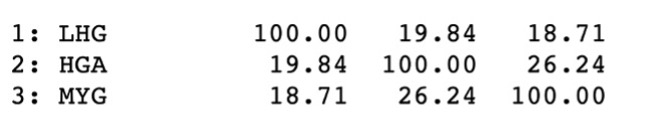{width="60%" fig-align="center" .lightbox}

    Hvilke af følgende statements er sande?

    a.	Leghemoglobin er den mest divergente.
    b.	Hæmoglobin og myoglobin er tættest beslægtede.
    c.	Leghemoglobin er tættere beslægtet med myoglobin end hemoglobin.
    d.	Hæmoglobin og leghemoglobin er tættest beslægtede.

::: {.callout-solution}
a,b
:::

7.  Du har brugt programmet Foldalign til at aligne to RNA-sekvenser, der ikke kunne alignes med Clustal Omega pga. lav sekvens-similaritet og har fået følgende sekvens-struktur-alignment: 

    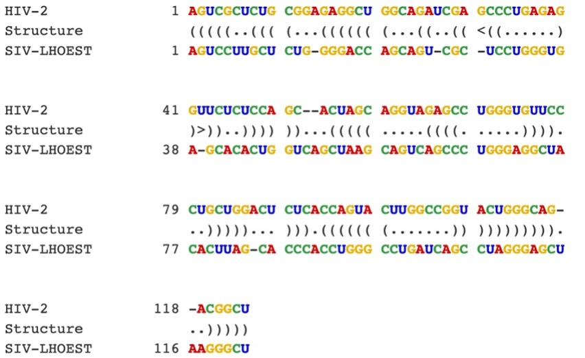{width=100%" fig-align="center" .lightbox}
    
    Hvilken basepar-ændring, der bevarer struktur, observeres i stem, der dannes af position 1-5 og 120-124 for HIV-2?
    
    a.	G-U til G-C
    b.	G-C til A-U
    c.	A-U til G-U
    d.	A-U til U-A
    e.	G-C til C-G

::: {.callout-solution}
e
:::

8.  Du har forudsagt RNA struktur udfra tre tRNA sekvenser med programmet RNAalifold og har fået følgende resultat:
 
    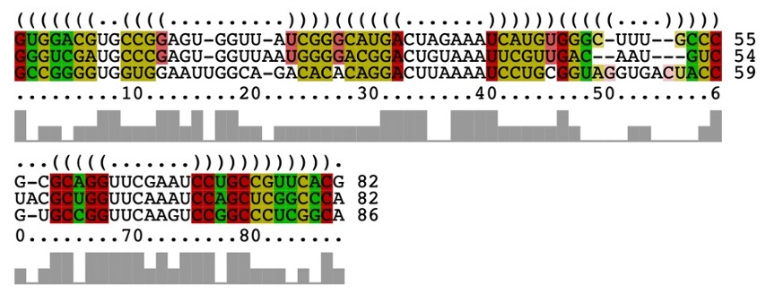{width="100%" fig-align="center" .lightbox}
    
    Hvilken bevarende basepar-ændring findes på position 10 og 27?
    
    a.	A-U til G-U
    b.	A-U til U-A
    c.	G-U til G-C
    d.	G-C til A-U
    e.	G-C til C-G

::: {.callout-solution}
e
:::

9.  AlphaFold forudsiger protein struktur fra sekvens ved at bruge en multipel sekvensalignment. Hvilken evolutionær information bruges til at forudsige 3D strukturen?

    a.	Bevarelse af sekvenser hjælper med foldingen.
    b.	Evolutionære matricer med scores for aminosyre-aminosyre kontakter.
    c.	Similaritets-scores fra BLOSSUM matricen.
    d.	Områder uden sekvensbevarelse kan udelades fra beregningen.
    
::: {.callout-solution}
b
:::

10.  Hvad er rækkefølgen i et RNA evolutions-eksperiment med SELEX-metoden når man starter med et DNA-bibliotek?

     a.	RNA-syntese
     b.	PCR-amplifikation
     c.	Gentag
     d.	Selektion for binding
     e.	Revers-transskription

::: {.callout-solution}
a,d,e,b,c
:::



## Opgave 2. tRNAs familiealbum

Vi skal nu kigge på den bredere evolution af tRNA ved at finde en alignment af alle kendte tRNA-sekvenser i RNA familie-databasen ([**Rfam**](http://rfam.xfam.org)).

1. Gå til Rfam-databasen og søg efter "tRNA". Tryk på "Secondary structure" under tRNA-familien. Klik på "seqcons" (sekvensbevarelse) og bpcons (baseparbevarelse). Hvad er mest bevaret, struktur eller sekvens? 

::: {.callout-tip title="Hint"}
I nedre venstre hjørne ses et farvespektrum fra ikke bevaret (0) til stærkt bevaret (1).
:::

::: {.callout-solution}
Struktur er mere bevaret end sekvens.
:::

2. Kig nu på "Rchie" plottet, der vises i boksen herunder. Plottet viser sekvenser (blok med farver, hvor hver vandrette linje repræsenterer en sekvens) og deres sekundær struktur (buer vist på toppen, der forbinder baser der danner basepar). Hvilke stems indeholder mest covariation? Kig ned gennem alignmenten -- hvad adskiller nogle tRNA sekvenser fra andre? 

::: {.callout-solution}
Stem 1 og 3 (talt fra 5' ende).\
Nogle tRNA sekvenser har insert mellem stem 3 og 4.
:::

Læs om Rchie plots i boksen herunder.

::: {.callout-note title="Rchie-plots"}

Om de forskellige nukleotidfarver der bruges i Rchie plots (fra [e-RNA.org](https://www.e-rna.org/r-chie/faq.cgi))

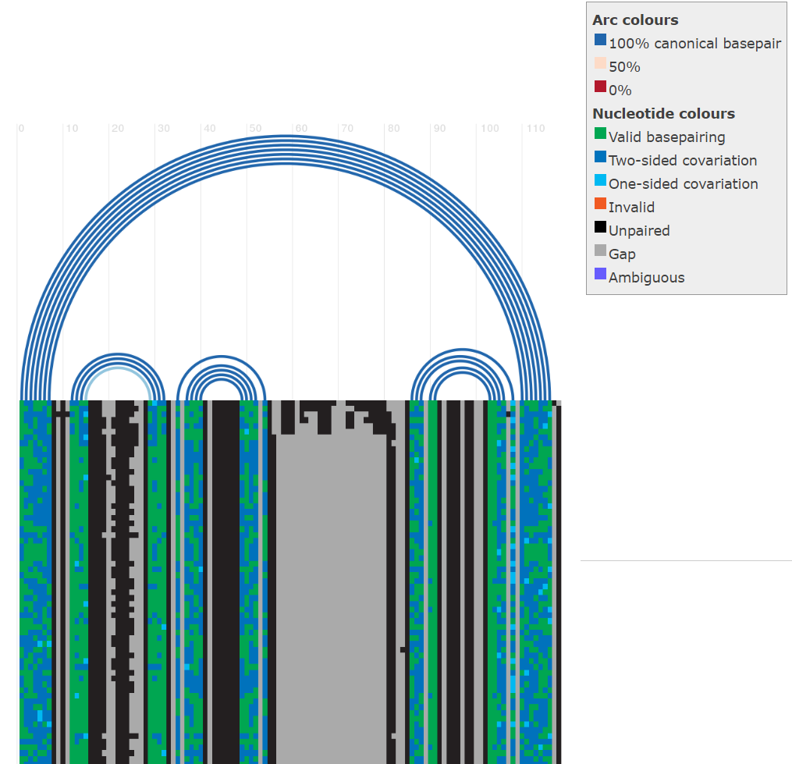{width="65%" fig-align="center"} 

- **Covariation** (correlated variation): refererer til ethvert validt basepar (A:U, G:C, G:U) som adskiller sig fra det mest gængse observerede valide basepar. Det vil sige at der er kompensatoriske baseparændringer (mutationer), som stadig muliggør baseparring samt sekundær struktur.

- **One-sided covariation:** Den ene base i baseparret skifter, men baseparret kan stadig dannes, hvilket er muligt grundet GU wobble. Altså vi har en ændring fra G:C til G:U, fra A:U til G:U eller vice versa.

- **Two-sided covariation:** Begge baser i baseparret adskiller sig fra det mest gængse observerede basepar på denne position. Her er der mange muligheder. Kan både være transitioner og transversioner.

- **Invalid:** alle basepar der ikke er enten A:U, G:C eller G:U

- **Ambiguous:** Enhver base, som ikke er A, C, G, T eller U.

- **Unpaired:** De uparrede. Loops eller bulges.

:::

Vi skal nu undersøge de tRNA sekvenser, der adskiller sig. Følgende tRNA-sekvenser er downloadet fra Rfam: 

```default
>AB017063.1/58819-58900
GUGGACGUGCCGGAGU-GGUU-AUCGGGCAUGACUAGAAAUCAUGUGGGC-UUU--GCCCG-CGCAGGUUCGAAUCCUGCCGUUCACG
>AB027572.1/4261-4342
GGGUCGAUGCCCGAGU-GGUUAAUGGGGACGGACUGUAAAUUCGUUGAC--AAU---GUCUACGCUGGUUCAAAUCCAGCUCGGCCCA
>AB031211.1/7799-7884
GCCGGGGUGGUGGAAUUGGCA-GACACACAGGACUUAAAAUCCUGCGGUAGGUGACUACCG-UGCCGGUUCAAGUCCGGCCCUCGGCA
```

Prøv at folde dem med [**RNAalifold server**](http://rna.tbi.univie.ac.at/cgi-bin/RNAWebSuite/RNAalifold.cgi). 

3. Hvordan adskiller strukturen sig fra tRNA? Er denne struktur understøttet af co-variationer? 

::: {.callout-tip title=Hint}
Der ses en masse undermenuer, hvor man kan vælge foldningsalgoritme mm. Disse skal bare ignoreres. De sorte basepar betyder mismatches i alle sekvenser.
:::

::: {.callout-solution}
Har extra stem mellem stem 3 og 4.\
Ja, der er covariationer i stem.
:::

Læs om RNAalifold output i boksen herunder.

::: {.callout-note title="RNAalifold output"}

Én ting der her er værd at bemærke, er at sekvensen, der vises i sekundærstrukturen, er et gennemsnit af de tre alignede, hvor den mest forekomne base typisk er den der vises.\
Dette er også grunden til at der ses nogle atypiske basepar (f.eks. C:A, G:G og C:C), men se bort fra det.

```default
>seq1   GUGGACGUGCCGGAGU-GGUU-AUCGGGCAUGACUAGAAAUCAUGUGGGC-UUU--GCCCGCGCAGGUUCGAAUCCUGCCGUUCACG-
>seq2   GGGUCGAUGCCCGAGU-GGUUAAUGGGGACGGACUGUAAAUUCGUUGAC--AAU---GUCUACGCUGGUUCAAAUCCAGCUCGGCCCA
>seq3   GCCGGGGUGGUGGAAUUGGCA-GACACACAGGACUUAAAAUCCUGCGGUAGGUGACUACCGUGCCGGUUCAAGUCCGGCCCUCGGCA-
>output GCGGAGGUGCCGGAGU-GGUU-AUCGGGCAGGACUAAAAAUCCUGUGGC--AUU---ACCGAGCCGGUUCAAAUCCCGCCCUCGACA-
        (((((((..((((..........))))((((((.......))))))(((((....)))))..(((((.......))))))))))))..
```

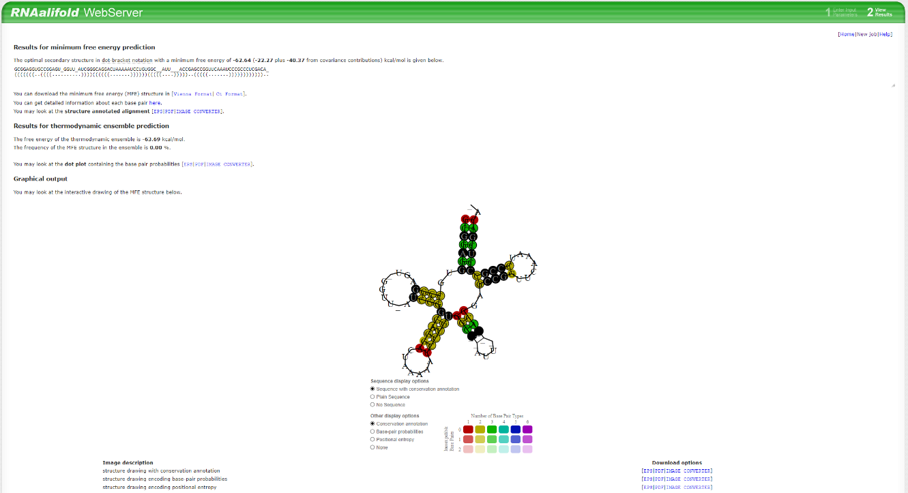{width="95%" fig-align="center" .lightbox}

De sorte basepar på strukturen vist under **Graphical output**, betyder at der kan forekomme inkompatible basepar (mismatches) på denne position i mindst én af sekvenserne og ikke nødvendigvis at der er mismatches i alle sekvenserne.

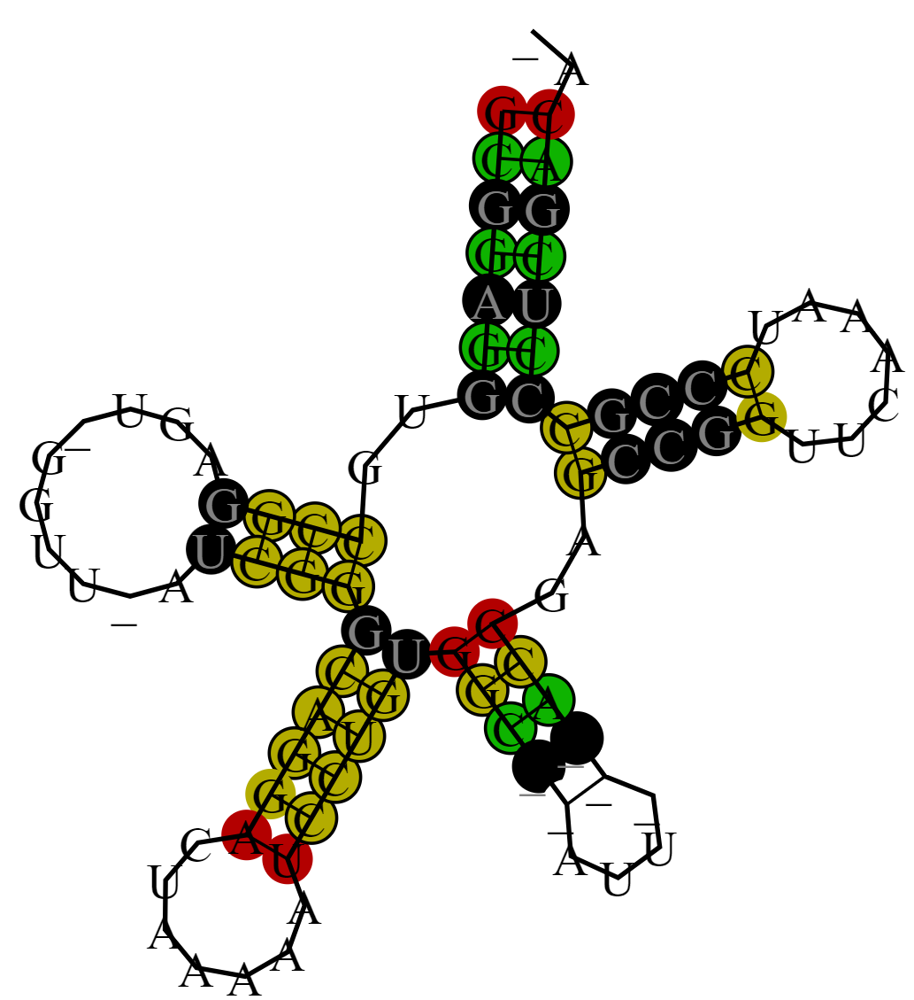{width="45%" fig-align="center" .lightbox}

En bedre og mere detaljeret præsentation af tRNA-femkløveren kan ses ved at vælge PDF under **Download options** ud for '*structure drawing with conservation annotation'* under **Image description**, som det ses herunder:

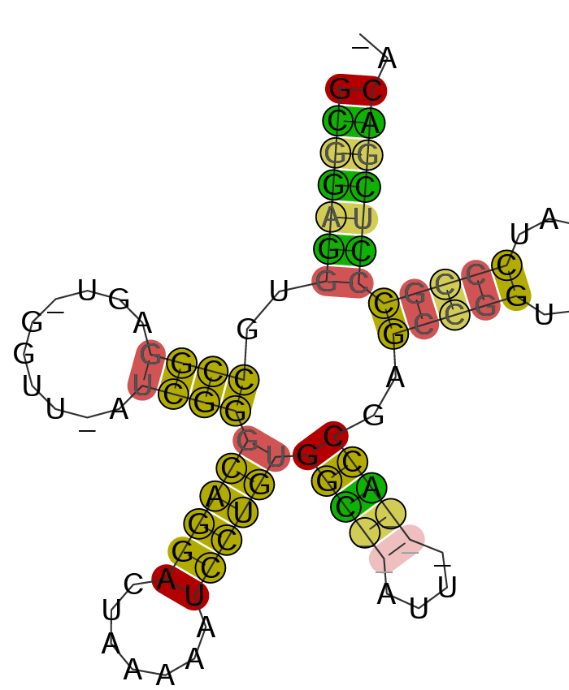{width="45%" fig-align="center" .lightbox}

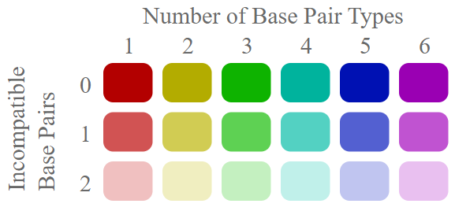{width="65%" fig-align="center" .lightbox}

Herved fås en repræsentation med farvning efter antal af forskellige basepar på hver position samt en graduering i gennemsigtighed efter antallet af inkompatible basepar.

Denne kan ydermere akkompagneres med alignment i samme farvekodning og dot-bracket notation ved at vælge PDF ud for **structure annotated alignment**.

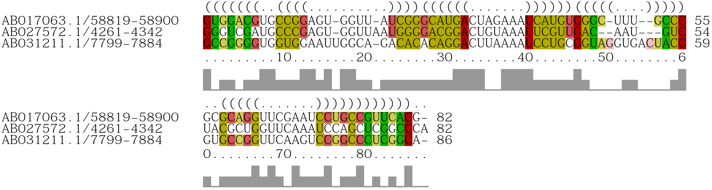{width="95%" fig-align="center" .lightbox}
:::

4. Selenocysteine tRNA har en lignende struktur. Kig på `tRNA-Sec` familie på Rfam og sammenlign R-chie plottet. Undersøg nu hvordan den 3-dimensionelle struktur af dette tRNA ser ud. Klik på "Structures" menu-punktet og klik på en af PDB ID'erne (f.eks. 3a3a), der tager dig til PDB. Åben strukturen i PyMOL med `fetch 3a3a`. Hvor sidder den extra hairpin på den klassiske L-form af tRNA?

::: {.callout-solution}
Hairpin er indsat mellem anticodon loop og T-psi-C loop.
:::



## Opgave 3. Den forsvundne RNA replikase

"RNA world" hypotesen foreslår at livets oprindelse startede med at et RNA molekyle begyndte at kopiere sig selv.
For at sandsynliggøre "RNA world" hypotesen forsøgte forskere omkring 1993 at skabe et RNA polymerase ribozym ([**Bartel & Szostak, 1993**](https://www.ncbi.nlm.nih.gov/pubmed/7690155)) ved at bruge *in vitro* selektion (også kaldet SELEX). Med denne metode laver man et DNA bibliotek af sekvenser ved at tilfældigt at indsætte en af de fire baser på hver position under kemisk DNA syntese. DNA biblioteket afskrives så til RNA, hvorefter man selekterer for RNA funktion (se Berg, udgave 10, afsnit 10.4). Ved at selektere for ligeringsaktivitet fandt de en RNA ligase, der senere er blevet udviklet til at syntetisere længere RNA-sekvenser ([**Horning & Joyce, 2016**](https://www.ncbi.nlm.nih.gov/pubmed/27528667)). Til selektionseksperimentet blev der indsat et bibliotek på 220 nukleotider (N220). Figuren herunder viser en oversigt over selektions-eksperiment.

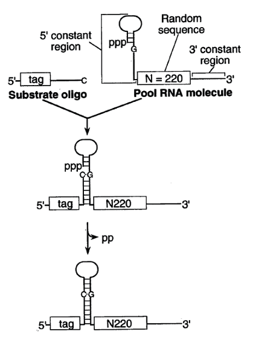{width="50%" fig-align="center" .lightbox}

1. Hvor meget RNA skal du have i gram, hvis biblioteket skal have mindst et molekyle med hver sin sekvens? I det oprindelige eksperiment blev der brugt et bibliotek med 1,6 \* 10^15^ forskellige sekvenser. Hvor mange gram skal bruges til dette bibliotek? Hvad betyder det, at de fandt en RNA ligase med dette bibliotek, for sandsynligheden for at RNA ligaser kan udvikles?

::: {.callout-tip title=Hint}
Den gennemsnitlige molekylevægt for et nukleotid er 330 g/mol og Avogadros tal er 6,0221415 \* 10^23^ mol^-1^.
:::

::: {.callout-solution}
4^N^ = 4^220^ mulige sekvenser. \ 
M(ribonukleotid) = 330 g/mol. \
M(RNA) = 220 nt \* 330 g/(mol\*nt) = 72.600 g/mol. N~A~ =  6,022140857 \* 10^23^ /mol. \

m(bibliotek 1) = n \* M = (antal/N~A~) \* 72.600 g/mol = 3,42 \* 10^113^ g\
m(bibliotek 2) = n \* M = (antal/N~A~) \* 72.600 g/mol = 194 μg\

Det betyder at det ikke er særlig svært at finde en RNA ligaseaktivitet, da den allerede kunne findes med et relativt lille bibliotek.
:::

Efter ti runder af selektion og amplifikation blev biblioteket sekventeret og der blev fundet flere forskellige familier af sekvenser med ligaseaktivitet. En af familierne (klasse I), der havde god ligeringsaktivitet, er vist herunder som en sekvensaligment. 

```default
>b1-10
GGAACACUAUCCGACUGGCACCGUAGAAUACAAAUGUGCCCUCAGAGCUUGGGAAGAUCCUUGCAGGAUCCAGGGGAGGCACCCCCCGGUGGCUUUAACGCCAACGUUCUCAACAAUAGUGGA---
>b1-105
GGAACACUCUACGACUGGAACCGAAAAAUACAAAUGUGCCCUUAGAGCUUGAUAAGAUCCUCGCAGGAUCCAGGGGAGGCACCUCCCGGUGGCUUUAACGCCAACGUUAUCAACAAGAGUGAGAAU
>b1-116
GGAAGACCAUACGACUGGCACCGUACAAUACAAAUGUGCCCUCAGAGCUUGAGAAGAUCCUUGCAGGAUAAAGGGGAGGCACCCCCCGGUAGCUUAAAAGCCAACGUUCUCAACAAUGGUC-ACAA
```

2. Brug [**RNAalifold**](http://rna.tbi.univie.ac.at/cgi-bin/RNAWebSuite/RNAalifold.cgi) webserver til at forudsige konsensus sekundær struktur for RNA ligase klasse I. 
Beskriv den sekundære struktur.

::: {.callout-solution}
Den sekundære struktur består af 4 hairpins og 2 stems, der er arrangeret i en 3-way junction og en 4-way junction.

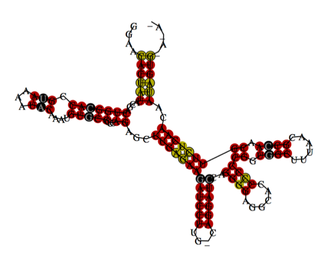{width="50%" fig-align="center" .lightbox}
:::

3. Hvilke kompenserende baseændringer bliver observeret og hvilke stem-regioner understøtter de? Hvilke stem-regioner modsiges af inkompatible basepar?

::: {.callout-solution}
P2,4,6 støttes af kompenserende baseændringer.\
PX har 2 mismatches. P5 og P7 har 1 mismatch (sortfarvede basepar).
:::

I 2009 blev strukturen af RNA ligase klasse I i "post-ligation-state" bestemt med røntgen krystallografi ([**Shechner *et al.,* 2009**](https://www.ncbi.nlm.nih.gov/pubmed/19965478)) og i 2011 blev den bestemt i "pre-ligation-state" ([**Shechner & Bartel, 2011**](https://www.nature.com/articles/nsmb.2107)). Åben scriptet `RNA-ligase.pml` i PyMOL. **F1** viser RNA strukturen med samme farver som vist i nedenstående figur - dog er pseudoknuden P3 markeret i rød i PyMOL.



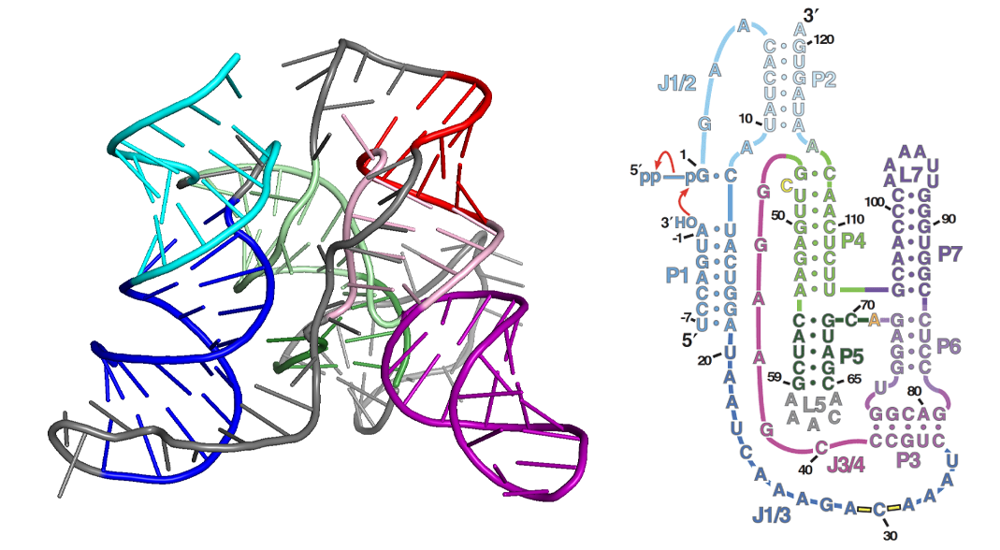{width="90%" fig-align="center" .lightbox}

4. Hvilke stems stacker på hinanden? Hint: To stems kan tilsammen danne en længere helix ved at stacke på hinanden (som det ses f.eks. for P6 og P7 i ovenstående figur).

::: {.callout-solution}
P1 stacker med P2

P4 stacker med P5

P3 stacker med P6 som stacker med P7
:::

**F2** viser active site i "pre-ligation-state" og **F3** "post-ligation-state". 

5. Mellem hvilke nukleotider dannes den nye binding? Hvorfor er C47 mon udskiftet med U47 i "pre-ligation-state"?
Hvad er C47s rolle i katalysen? Hvilken interaktion har C47 med C30?

::: {.callout-tip title="Hint"}
Denne figur viser skematisk udgave af active site.

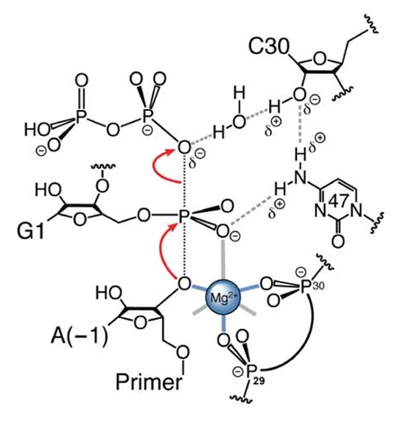{width="50%" fig-align="center" .lightbox}
:::

::: {.callout-solution}
Den nye binding dannes mellem A-1 og GTP.

C47 er udskiftet med U47 for at hæmme ligerings-reaktionen, så man kan fange ribozymet i et "pre-ligation-state".

C47 rolle er at stabilisere GTP så ligeringsreaktionen kan foregå. 

C30-C47 interaktionen er både h-bindinger og base stacking - dette positionerer formentlig C47 til katalyse.
:::

6. Active site for RNA polymerase proteinet (se venstre del af figur herunder) ligner meget active site for RNA ligasen (se højre del af figur herunder). Hvilken reaktionsmekanisme sker når to nukelotider hæftes sammen? Hvilken rolle spiller Mg^2+^-ion, C30, C47 og vand-molekylet?

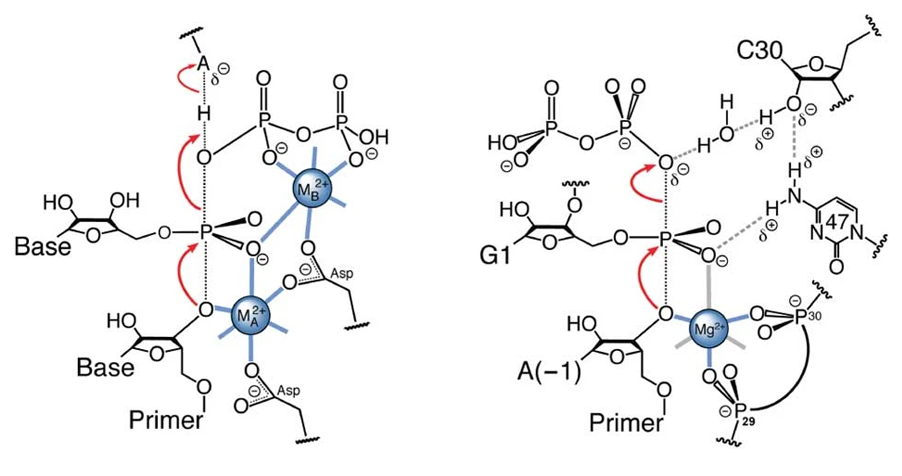{width="90%" fig-align="center" .lightbox}

::: {.callout-solution}
Kondensations-reaktion. Dannelse af en phosphodiester binding ved fraspaltning af pyrofosfat.

Mg ion koordinerer de negativt ladede grupper - særligt fosforyl-grupperne så der kan ske et nukleofilt angreb. C30 koordinerer et vand-molekyle, som bidrager til at positionerer O atomet på alfa phosphat gruppen. C47 erstatter en Mg ion, da den har en delvis positiv ladning og koordinerer  alfa phosphat gruppen og C30.
:::



## Opgave 4. Globin sekvensalignment 

Hæmoglobin alpha (HGA) og Myoglobin (MYG) fra menneske og Leghæmoglobin-1 (LHG) fra blomsten [**Lupin**](https://en.wikipedia.org/wiki/Lupinus) er fremhævet som eksempel i Berg Biochemistry, udgave 10, kapitel 10. Følgende sekvenser er hentet fra UniProt i fasta-format.  

```default
>HGA
VLSPADKTNVKAAWGKVGAHAGEYGAEALERMFLSFPTTKTYFPHFDLSHGSAQVKGHGKKVADALTNAV
AHVDDMPNALSALSDLHAHKLRVDPVNFKLLSHCLLVTLAAHLPAEFTPAVHASLDKFLASVSTVLTSKY
R
>MYG
MGLSDGEWQLVLNVWGKVEADIPGHGQEVLIRLFKGHPETLEKFDKFKHLKSEDEMKASEDLKKHGATVL
TALGGILKKKGHHEAEIKPLAQSHATKHKIPVKYLEFISECIIQVLQSKHPGDFGADAQGAMNKALELFR
KDMASNYKELGFQG
>LHG
MGVLTDVQVALVKSSFEEFNANIPKNTHRFFTLVLEIAPGAKDLFSFLKGSSEVPQNNPDLQAHAGKVFK
LTYEAAIQLQVNGAVASDATLKSLGSVHVSKGVVDAHFPVVKEAILKTIKEVVGDKWSEELNTAWTIAYD
ELAIIIKKEMKDAA
```

1. Brug [**ClustalO**](https://www.ebi.ac.uk/jdispatcher/msa/clustalo) til at lave en sekvensalignment af Hæmoglobin, Myoglobin og Leghæmoglobin. Hvor mange identiteter (*) og stærke similariteter (:) er der mellem de tre sekvenser i den forudsagte sekvensalignment?

::: {.callout-solution}
11 identiteter\
22 stærke similariteter

ClustalO output:

```default
CLUSTAL O(1.2.4) multiple sequence alignment


LHG      MGVLTDVQVALVKSSFEEFNANIPKNTHRFFTLVLEIAPGAKDLFSF---LKGSSEVPQN	57
HGA      --VLSPADKTNVKAAWGKVGAHAGEYGAEALERMFLSFPTTKTYFPHFDLSHG-------	51
MYG      -MGLSDGEWQLVLNVWGKVEADIPGHGQEVLIRLFKGHPETLEKFDKFKHLKSEDEM-KA	58
            *:  :   *   : :. *.      . :  ::   * :   *      :.       

LHG      NPDLQAHAGKVFKLTYEAAIQLQVNGAVASDATLKSLGSVHVSKGVVDA-HFPVVKEAIL	116
HGA      SAQVKGHGKKVADALTN-----AVAHVDDMPNALSALSDLHAHKLRVDPVNFKLLSHCLL	106
MYG      SEDLKKHGATVLTALGG-----ILKKKGHHEAEIKPLAQSHATKHKIPVKYLEFISECII	113
         . ::: *. .*            :         :. *.. *. *  :    : .:...::

LHG      KTIKEVVGDKWSEE-----------LNTAWTIAYDELAIIIKKEMKDAA	154
HGA      VTLAAHLPAEFTPAVHASLDKFLASVSTVLTSKYR--------------	141
MYG      QVLQSKHPGDFGADAQGAMNKALELFRKDMASNYKELGFQG--------	154
          .:      .:              . .  :  *               
```

ClustalO identitetsmatrix:

```default
1: LHG 100.00 19.84 18.71
2: HGA 19.84 100.00 26.24
3: MYG 18.71 26.24 100.00
```
:::

2. Brug [**MUSCLE**](https://www.ebi.ac.uk/jdispatcher/msa/muscle) til at lave en sekvensalignment af Hæmoglobin, Myoglobin og Leghæmoglobin. Hvor mange identiteter (*) og stærke similariteter (:) er der mellem de tre sekvenser i den forudsagte sekvensalignment? 

::: {.callout-solution}
11 identiteter\
27 stærke similariteter

```default
CLUSTAL multiple sequence alignment by MUSCLE (3.8)


LHG             MGVLTDVQVALVKSSFEEFNANIPKNTHRFFTLVLEIAPGAKDLFSFLK--GSSEVPQNN
HGA             --VLSPADKTNVKAAWGKVGAHAGEYGAEALERMFLSFPTTKTYFPHF------DLSHGS
MYG             -MGLSDGEWQLVLNVWGKVEADIPGHGQEVLIRLFKGHPETLEKFDKFKHLKSEDEMKAS
                   *:  :   *   : :. *         :  ::   * :   *  :      :  : .

LHG             PDLQAHAGKVFKLTYEAAIQLQVNGAVASDATLKSLGSVHVSKGVVDA-HFPVVKEAILK
HGA             AQVKGHGKKVA-----DALTNAVAHVDDMPNALSALSDLHAHKLRVDPVNFKLLSHCLLV
MYG             EDLKKHGATVL-----TALGGILKKKGHHEAEIKPLAQSHATKHKIPVKYLEFISECIIQ
                 ::: *. .*       *:   :         :..*.. *. *  :    : .:. .:: 

LHG             TIKEVVGDKWSEELNTAWTIAYDELAIIIKKEMKDAA---
HGA             TLAAHLPAEFTPAVHASLDKFLASVSTVLTSKYR------
MYG             VLQSKHPGDFGADAQGAMNKALELFRKDMASNYKELGFQG
                .:      .:    : :       .   : .: .      
```
:::

3. Sammenlign ClustalO og MUSCLE resultaterne. Hvilken algoritme tror du mest på? Hvilke forskelle i alignment viser de?

::: {.callout-solution}
Jeg tror mest på MUSCLE-resultatet, da den finder extra similariteter. 

ClustalO har stort insert til sidst i alignment, som ikke ser ud til at være nødvendigt.
:::

4. Vælg nu resultatet fra din favorit algoritme. Klik på "Result Files" og på "Percent Identity Matrix". Hvilke to af de tre sekvenser er tættest beslægtet og med hvilken identitetsprocent?

::: {.callout-solution}
MUSCLE identitetsmatrix:

```default
1: LHG 100.00 15.71 17.57
2: HGA 15.71 100.00 26.95
3: MYG 17.57 26.95 100.00
```

Hæmoglobin og Myoglobin med ca. 27%
:::

Protein alignment programmer som MUSCLE bruger Blossum-62 matricen til at score sekvensalignment. Blossum-62 matricen er vist i grafisk repræsentation i Berg Biochemistry, udgave 10, kapitel 10, figur 10.7 (s. 306).

5. Brug figur 10.7 til at beregne score for de første (fra N-term) af hver slags ændring hhv. "fuldt bevaret" (markeret med \* tegn), "stærkt bevaret" (markeret med : tegn) og "svagt bevaret" (markeret med . tegn) i MUSCLE alignment af Hæmoglobin, Myoglobin og Leghæmoglobin. 

::: {.callout-tip title="Hint"}
For tre sekvenser summeres scores for alle sammenlignings-kombinationer.
:::

::: {.callout-solution}

Udklip af N-term fra MUSCLE alignment:
```default
LHG             MGVLTDVQVALVKSSFEEFNA
HGA             --VLSPADKTNVKAAWGKVGA
MYG             -MGLSDGEWQLVLNVWGKVEA
                   *:  :   *   : :. *
```

Blossum scores:\
```default
Fuldt bevaret (*):        Kolonne 4 = 3*4 (L-L) = 12
Stærkt bevaret (:):       Kolonne 5 = 2*1 (T-S) + 4 (S-S) = 6
Svagt bevaret (.):        Kolonne 19 = 2*-1 (F-V) + 4 (V-V) = 2
```
:::



## Opgave 5. Globin strukturalignment

::: {.callout-note}
**PyMOL-scripting opgave**: I denne opgave skal i lære at bruge kommandoerne `align` og `super`.
:::

I denne opgave skal vi aligne strukturer (i stedet for sekvenser). Når man aligner strukturer bruges Root Mean Square Deviation (RMSD) målet, der er beskrevet [**her**](https://en.wikipedia.org/wiki/Root-mean-square_deviation_of_atomic_positions). RMSD måler middel-afstanden i mellem atomer af to overlejrede molekyler og kan derfor bruges til at vurdere hvor ens to strukturer er.

Åben pml filen `Globin.pml` i PyMOL, hvor **F1** viser en strukturel alignment af Hæmoglobin alfa kæde (PDB-ID: `1HBB`), Myoglobin (PDB-ID: `1MBD`) og Leghæmoglobin (PDB-ID: `1GDJ`).



1. Læs om PyMOLs `super` kommando [her](https://pymolwiki.org/index.php/Super) og forklar hvordan den fungerer. 
Brug nu `super` til at udregne RMSD mellem alle tre kombinationer af `1HBB`, `1MBD` og `1GDJ`.

::: {.callout-solution}
Super aligner udelukkende på grundlag af struktur.

Super RMSD beregnes med kommandoerne:\
`super 1gdj, 1mbd` $\rightarrow$ RMSD = 1.618\
`super 1hbb_A, 1mbd` $\rightarrow$ RMSD = 1.401\
`super 1hbb_A, 1gdj` $\rightarrow$ RMSD = 2.762
:::

2. Læs om PyMOLs `align` kommando [her](https://pymolwiki.org/index.php/Align) og forklar hvordan den fungerer.
Brug nu `align` til at udregne RMSD mellem alle tre kombinationer af `1HBB`, `1MBD` og `1GDJ`.

::: {.callout-solution}
Align laver først en sekvens alignment og bruger denne til at aligne struktur.

Align RMSD beregnes med kommandoerne:\
`align 1gdj, 1mbd` $\rightarrow$ RMSD = 3.062\
`align 1hbb_A, 1mbd` $\rightarrow$ RMSD = 1.328\
`align 1hbb_A, 1gdj` $\rightarrow$ RMSD = 3.446
:::

3. I hvilke tilfælde fungerer `super` og `align` bedst? Hvilken algoritme tror du mest på til alignment af globiner? Stemmer RMSD generelt overens med "percent identity" fra forrige opgave?

::: {.callout-solution}
Super fungerer godt når der ikke er stor sekvensbevarelse. Align fungerer bedst når der er god sekvensbevarelse. 

Align er formodentlig bedst, da der er god sekvens-bevarelse mellem de tre globiner.

RMSD analyse viser at 1gdj er mest forskellig fra de andre strukturer, hvilket passer med at 1gdj færrest identiteter med de andre sekvenser.
:::

**F2** viser identiteter fra forrige opgave i grøn og hæmgruppe i rød. 

4. Beskriv overordnet hvor de bevarede aminosyrer er placeret i globin-strukturen som vist i **F2**. Hvad er afstanden af bindingen mellem Histidin-87 og jern-atomet? Hvorfor vises denne vigtige binding ikke i PyMOL? Hvordan passer denne længde med en kovalent binding overfor en hydrogen-binding?

::: {.callout-solution}
De fleste bevarede aminosyrer er placeret omkring bindingsstedet for hæmgruppen og generelt vender de indad i proteinet. 

His-87 binder til jern-atom i hæmgruppen med en afstand på 2.2 Å. 

Bindingen mellem proximal histidine og jern-atomet vises ikke da det er længere end normale kovalente bindinger (se Berg Biochemistry, udgave 10, figur 3.11, og standard bindingslængder bagerst i bogen).
:::


## Opgave 6. Globin strukturbevarelse

::: {.callout-note}
**PyMOL-scripting opgave**: I denne PyMOL opgave skal I lære at plotte sekvensbevarelse på protein struktur vha. et Python script, der hedder `colCons.py`.
:::

Programmet `colCons` tager en alignment i fasta-format og en atomar struktur som input, beregner sekvensbevarelse ihht. BLOSSUM-62-matricen, og farvelægger hver aminosyre efter en farveskala.

- Download følgende zip-fil der indeholder colCons Python-programmet: `colCons.zip`. Beskrivelse af hvordan programmet fungerer kan læses i toppen af Python-scriptet. `allSorts.inp` indeholder PyMOL-kommandoer til at køre programmet på to medfølgende eksempler: EFTU og Sortilin.



I denne opgave bruger vi alignment af Hæmoglobin, Myoglobin og Leghæmoglobin fra opgave 4 som eksempel.

- Download `globin-aln-fasta.txt` og placér filen i colCons mappen.



- Åben nu PyMOL, navigér til colCons mappen, sæt PyMOL-parametre, og aktivér colCons.py scriptet:

```default
reinitialize
cd [inset folder path]

bg_color white
set opaque_background, off
run colCons.py 
```

::: {.callout-note title="PyMOL Info"}
`cd`-kommandoen står for "change directory". Når man bruger `cd`-kommandoen skal man være opmærksom på hvor på computeren man er på et givent tidspunkt. Man kan tjekke hvor man er med kommandoen `pwd` (*print working directory*), der vil give den nuværende sti til PyMOL sessionen. Brug `ls`-kommandoen for at opliste indholdet af den nuværende mappe. For at komme ind i den rigtige mappe kan man starte sin folder path med `cd /`, hvilket fører dig til root directory. Herefter indsættes vejen gennem foldere til filen. Man kan se filens folder path ved at højreklikke på filen og trykke "get info" på mac eller "properties"/"egenskaber" på windows. Det kunne f.eks. se sådan ud:\
`cd /Users/JensJensen/STRBIO/TØ8/`
:::

- Hent nu Myoglobin og brug `colCons` til at farvelægge sekvensbevarelse i "rainbow" farveskala fra blå (sat til 50% sekvensbevarelse) til rød (sat til 100% sekvensbevarelse) ihht. globin-aln.fasta:

```default
fetch 1mbd
color_cons('1mbd','globin-aln-fasta.txt',1,1,0.5,1.0,'rain','yellow','red','BLOSUM62',True)
```

Vis proteinet med `cartoon`- og `stick`-repræsentation og svar på følgende spørgsmål.

1. Hvilke 100% bevarede aminosyrer binder til hæmgruppen? Hvilke aminosyrer kontakter det centrale Fe atom i hæmgruppen? Hvilken aminosyre er "proximal histidine" og hvilken er "distal histidine" (svar på spørgsmål ud fra information i Berg, udgave 10, afsnit 3.2)? 

::: {.callout-tip title=Hint}
`find` finder ikke interaktion med Fe, så brug i stedet `distance` funktionen.
:::

::: {.callout-solution}
Vi finder hydrogenbindinger til Hæmgruppen ved at selektere den og bruge `(sele)>A>find>polar contacts>to other atoms in object`.

His97 og Ser92 og Arg 45 har hydrogenbindinger til Hæmgruppen. Der er alle ca. 50% bevarede, da de er blå.

His93 kontakter det centrale jern atom. 100% bevaret, da den er rød.

Proximal histidine: His93\
Distal histidine: His64

Se vedhæftede fil:

:::

Vis proteinet med `sphere`-repræsentation og svar på følgende spørgsmål.

2. Hvordan er aminosyrer på overfladen af myoglobin bevaret? Hvordan ser bevarelsen ud omkring bindingssite for hæmgruppen?

::: {.callout-solution}
Overfladen er blå (dvs. <= 50% bevaret). Der er mange røde residues omkring hæmgruppen (dvs. <= 100% bevaret).
:::

Åben nu alle globinerne og farvelæg dem med colCons:

```default
reinit
fetch 1hbb 1gdj 1mbd, async=0
remove solvent
remove not(chain A)
align 1hbb, 1mbd
align 1gdj, 1mbd
reset
color_cons('1hbb','globin-aln-fasta.txt',3,1,0.5,1.0,'rain','yellow','red','BLOSUM62',True)
color_cons('1mbd','globin-aln-fasta.txt',1,1,0.5,1.0,'rain','yellow','red','BLOSUM62',True)
color_cons('1gdj','globin-aln-fasta.txt',2,1,0.5,1.0,'rain','yellow','red','BLOSUM62',True)
```

Vis proteinerne med `cartoon`- og `stick`-repræsentation og svar på følgende spørgsmål.

3. Er 3D placeringen af de 100% bevarede aminosyrer helt ens imellem de tre globiner?

::: {.callout-solution}
Ja, de fleste røde aminosyrer har ca. den samme 3D orientering.
:::

4. Myoglobin har et insert på position 57-61 i forhold til Hæmoglobin. Hvilken sekundær struktur har dette insert og hvilken ligand er bundet til denne struktur?

::: {.callout-solution}
Bøjning af alfa-helix. Ligand er SO~4~^2-^.
:::

5. Hvad er den største strukturelle forskel mellem Hæmoglobin (1HHB) og Myoglobin (1MBD)?

::: {.callout-solution}
Alfa helix er indsat mellem helix 3 og 4 (talt fra N-term).
:::

6. Hvad er den største strukturelle forskel mellem Hæmoglobin (1HHB) og Leghæmoglobin (1GDJ)?

::: {.callout-solution}
Alfa helix 4 er forlænget i C-terminal.
:::



## Opgave 7. Heat shock protein 70 evolution

::: {.callout-note}
**PyMOL scripting opgave**: I denne PyMOL opgave skal I lave en strukturel alignment imellem homologe proteiner og bruge informationer fra Interpro databasen til at analysere evolutionære forskelle.
:::

70 kilodalton heat shock proteiner (Hsp70 eller DnaK) og proteiner med lignende struktur eksisterer i stort set alle levende organismer. Hsp70 er en vigtig del af cellens proteinfoldningsmaskineri og hjælper med at beskytte celler mod stress. Start med at finde Hsp70 familien i [**InterPro databasen**](https://www.ebi.ac.uk/interpro/).

1. Kig på alignment (klik på `Alignments`, vælg derefter `seed`) og sammenlign HSP74 fra menneske og HSP7F fra gær. Hvad er den største forskel mellem dem?

::: {.callout-solution}
Stort insert omkring position 550.
:::

2. Lav et PyMOL-script, der gør følgende:

- Åben HSP7F med PDB-ID: 2QXL. Hint: Sørg for kun at vise én monomer. Gem som F1.
- Åben DNAK fra E. coli med PDB-ID: 4B9Q. Hint: Sørg for kun at vise én monomer.
- Align HSP7F og DNAK. Gem som F2.
- Åben HSP med PDB-ID: 1ATR.
- Åben Actin fra E. coli med PDB-ID: 1ATN.
- Align HSP og Actin.
- Gem som F3.

::: {.callout-solution}
```default

```
:::

3. Tryk på **F1** og identificér positionen for insertet `FKKVTKTVKKDDLTIVAHTFGLDAKKLNE` (rest 521-549) i HSP7F fra gær. I hvilken sekundær struktur sidder dette insert? Foreslå evolutionær mekanisme hvormed dette insert er blevet dannet.

::: {.callout-solution}
Insert sidder i dobbelt lag antiparallelt beta-sheet del og tilføjer én extra beta strand, der leder hen til lang alfa helix. Insert kan være dannet ved duplikation under kopiering.
:::

4. Tryk på **F2** for at se struktur-alignment af HSP7F og DNAK. Hvilke strukturelle forskelle er der på disse strukturer?

::: {.callout-solution}
Beta sandwich har flyttet position. Lange alfa helicer i C-term har flyttet pos
:::

5. Tryk på **F3** for at se struktur-alignment af HSP og Actin og beskriv den overordnede struktur af domæner med beta sheets og alfa helices. Er actin og Hsp70 homologe proteiner når de har en forskellig funktion?

::: {.callout-solution}
Strukturen består af alternerende domæner af alfa helix og beta sheet, der danner en kløft hvor ATP er bundet.

Actin og Hsp70 er paraloge proteiner, da de eksisterer i samme organisme og må være udviklet fra det samme oprindelige protein, da det er usandsynligt at det vil kunne udvikles ved konvergent evolution.
:::
