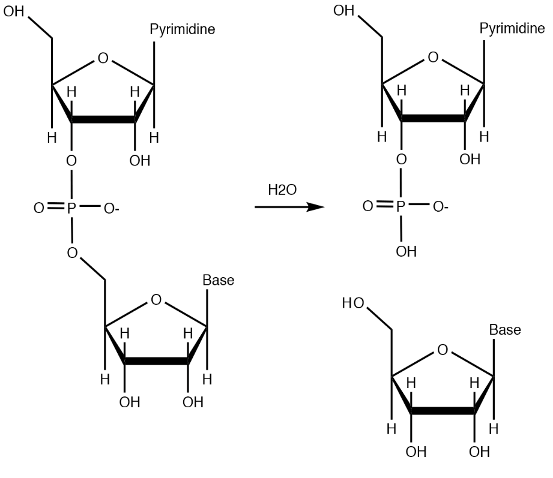
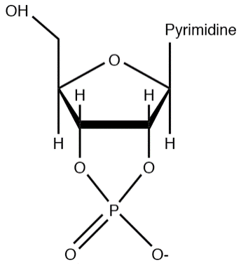
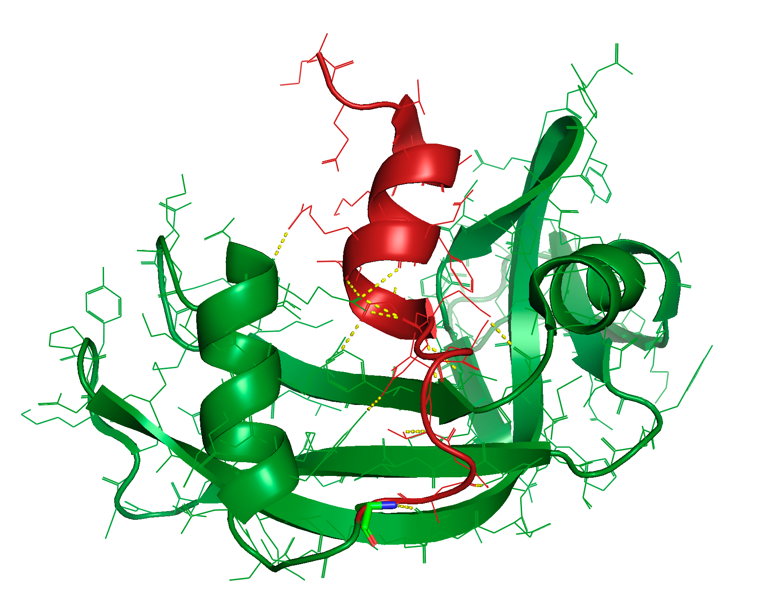

## Opgave 1. Reaktionsmekanismen for RNase A

RNase A er et fordøjelsesenzym, der udskilles af bugspytkirtlen. Det er et lille (13.7 kDa, 124 residues) meget stabilt enzym, der findes i store mængder, hvilket har betydet at det har været studeret i mange år som model for enzymkatalyse.

RNase A katalyserer hydrolyse af phosphodiesterbindinger i RNA-kæder, mellem phosphoratomet og 5'-oxygenatomet. Efter reaktionen har den ene af de to termini en fri 5'-OH gruppe.

### Opskriv RNase A-reaktionen

Opskriv den reaktion, RNase A katalyserer. Start med at tegne et dinukleotid bestående af to 2'-oxy-riboseenheder koblet sammen med en phosphatgruppe. Baserne behøves ikke tegnet på, da de ikke indgår i reaktionen.

Reaktionen foregår gennem et 2'-3'-cyklisk intermediat, dvs. at phosphatgruppen i intermediatet er bundet til både 2'- og 3'- gruppen på ene riboseenhed.

### Tegn det cykliske intermediat

Tegn strukturformelen for det 2'-3'-cykliske intermediat. Hvilket oxygenatom må nødvendigvis agere som nukleofil i reaktionen for at dette kan opstå?

### Beskriv dannelse af produktet

Hvad skal der ske for at danne produktet udfra det cykliske intermediat? Hint: Der indgår et meget almindeligt andet stof i 2. trin af reaktionen.

### Forklar reversibilitet af delreaktioner

Af de to delreaktioner er den ene reversibel mens den anden i praksis er irreversibel. Forklar dette.

### Forklar isolation af reaktionsintermediat

På trods af dette er det muligt at isolere intermediatet til kemisk analyse. Forklar hvordan dette kan lade sig gøre. Hint: Det har noget med reaktionshastigheder at gøre.

RNase A kræver at nukleotidet, der sidder 5' (opstrøms) for kløvningsstedet, er en pyrimidine (C eller U), da bindingslommen ikke har plads til puriner. For resten af RNA-kæden er enzymet ligeglad med sekvensen.

### Foreslå interaktioner med RNA-kæden

Foreslå hvilken typer af interaktioner, der fastholder resten af RNA-kæden, herunder hvilke typer aminosyrer, der formentlig er involveret.

### Forklar hvorfor DNA ikke kløves

Enkeltstrenget DNA binder også til RNase A, men kløves ikke. Forklar dette.

::: {.solution-callout}

1.  {width="4.1875in" height="3.625in"}

2.  2'-OH-gruppen agerer som nukleofil.\
    \
    {width="1.5625in" height="1.71875in"}

3.  Et vandmolekyle opløser det cykliske intermediat ved at lave et nukleofilt angreb på phosphatatomet. Samme reaktion som i 1. trin, blot med vand som nukleofil.

4.  Den første delreaktion er reversibel, den anden (hvor vand hydrolyserer) er irreversibel. Dette skyldes at der blot flyttes rundt på bindingerne i en phosphat diester i første trin, hvorved energien bevares. I andet trin foretages en hydrolyse, der frigiver den bundne energi i diesteren. Den store forskel i fri energi gør i praksis reaktionen irreversibel.

5.  Hydrolysen foregår meget langsomt mens det nukleofile angreb af 2'-OH-gruppen er hurtigt (den sidder på det rigtige sted).

6.  Uspecifikke, ioniske interaktioner med det negativt ladede RNA-backbone. Der er en række af 9 Lys/Arg residues, der tilsammen skaber dette positive miljø.

7.  ssDNA binder, men kløves ikke da det ikke indeholder en 2'-OH-gruppe.
:::

## Opgave 2. Strukturen af RNase A

I denne opgave skal vi kigge nærmere på strukturen af RNase A.

### Skriv PyMOL-script til RNase A-struktur

Skriv et PyMOL-script, der henter strukturen af den bovine RNase A bundet til en substratanalog (CPA) (PDB-ID: 1RPG), viser strukturen som cartoon uden vandmolekyler samt viser liganden og sidekæderne 12, 41 og 119 som sticks. Til dette skal du oprette et objekt med sidekæderne og en selektion med substratet. Gem visualiseringen som scenen **F1**. Hvilken funktion har disse aminosyrer? Hint: kig på [RCSB](https://www.rcsb.org/).

***PyMOL info**: Du kan sætte en titel og/eller beskrivelse på din scene ved at skrive scene F1, store, `titel/beskrivelse`.*

### Analyser substratanalog CPA i PyMOL

Lav en scene, kaldet **F2**, som fokuser på substratanalogen CPA. Kig på CPA og forklar først hvorfor det er muligt at binde dette molekyle til enzymet uden at det kløves. Hint: Der mangler en vigtig funktionel gruppe.

### Identificer His12's rolle i katalyse

Forestil dig at gruppen stadig sidder på substratet og fokusér nu på residue 12. Hvilken sidekæde er dette og hvilken funktion tror du den har i reaktionen? Hint: Dette residue er ansvarligt for dannelse af en stærk nukleofil, der skal bruges i 1. reaktionstrin.

### Beskriv pentavalent transition state

Efter det nukleofile angreb findes enzym-substrate-komplekset på et transition state, hvor phosphoratomet kortvarigt er bundet til 5 andre atomer, et såkaldt pentavalent transition state. Hvilke 5 atomer er der tale om?

### Analyser Lys41's rolle i stabilisering

Residue 41 spiller en vigtig rolle i stabiliseringen af dette transition state, forklar hvordan. Hvorfor tror du, at der er vist to sidekæder for denne residue?

### Bestem His119's rolle i katalyse

Den sidste involverede residue er 119, der fungerer i det næste trin, hvor det pentavalente transition state opløses og phosphoratomet igen er bundet til 4 andre atomer. Hvilken binding brydes og hvad kunne tænkes at være denne residues rolle?

### Forklar RNase A's pH-afhængighed

Forklar til sidst hvorfor RNase A udviser en klokkeformet pH-afhængighed med maksimal aktivitet omkring pH 7.

::: {.solution-callout}

1.  Se det færdige script her under. Sidekæderne 12, 41 og 119 er en del af RNase's active site.

\## Script til opgave 2. Strukturen af RNase A

reinit

fetch 1RPG, RNaseA

fetch 2RNS, RNaseS

remove solvent

hide everything, RNaseS

create activesite, resi 12+41+119 and (sidechain or name CA) and RNaseA

select CPA, resn CPA

show sticks, activesite

util.cbaw CPA

hide everything, resn MPD

deselect

set_view (\\

0.303110957, 0.520497024, 0.798252702,\\

-0.245664865, 0.852026463, -0.462277800,\\

-0.920745254, -0.055982031, 0.386126637,\\

0.000000000, 0.000000000, -156.364730835,\\

28.547067642, 16.383316040, 12.520156860,\\

112.685844421, 200.043609619, -20.000000000 )

scene F1, store, RNase A bundet til substratanalogen CPA

set_view (\\

0.093746915, -0.654989600, 0.749797225,\\

-0.726988196, -0.559585333, -0.397933364,\\

0.680218101, -0.507791102, -0.528629780,\\

0.000021785, 0.000056613, -49.808483124,\\

29.844451904, 17.151058197, 6.305857658,\\

43.160091400, 56.437580109, -20.000000000 )

scene F2, store, substratanalogen CPA

2.  Det er et deoxy-dinukleotid, så begge 2'-OH-grupper mangler. Disse er vigtige for reaktionsmekanismen, da den ene fungerer som nukleofil.

3.  Det er en His, der fungerer som general base ved at deprotonere (og dermed aktivere 2'-OH-gruppen).

4.  2 phosphatoxygenatomer, 2'-OH, 3'-OH og 5'-OH fra det næste nukleotid.

5.  Dette er en Lys, der er positivt ladet og både strukturelt og ladningsmæssigt stabiliserer det negative transition state. Sidekæden er uordnet og ses i to konformationer, hvilket måske skyldes at 2'-OH-grupperne mangler.

6.  Dette er også en His, der fungerer som generel syre ved at protonere leavinggruppen (5'-OH på det næste nukleotid).

7.  Dette skyldes de to His i det aktive site, der skal være hhv. deprotoneret (His19) og protoneret (His119) for at enzymet er aktivt.
:::

## Opgave 3. Disulfidbroer i RNase A

I denne opgave skal vi kigge på den tertiære struktur af RNase A.

### Visualiser disulfidbroer i PyMOL

Tag udgangspunkt i scriptet fra forrige opgave. Lav en ny scene, kaldet **F3**, hvor der fokuseres på RNase A's svovlbroer. Hint: Lav en selektion med Cys-sidekæderne. Hvilken rolle spiller Cys-resterne for proteinets tertiære struktur? Kommentér på sidekædernes oxidationstilstand i forhold til proteinets lokalisering i kroppen. Hvorfor tror du enzymet har udviklet denne struktur?

### Opskriv Cys-Cys interaktioner

Opskriv interaktionerne mellem Cys-resterne (hvilke rester interagerer med hinanden).

### Diskutér disulfidbros effekt på stabilitet

Diskutér hvordan du tror enzymet påvirkes af Cys-resternes interaktioner ift. termisk og kemisk denaturering. Hvad tror du der vil ske, hvis enzymet denatureres ved høj temperatur (under stadigt oxiderede betingelser) og herefter køles af igen?

### Forklar Anfinsens refolding-forsøg

Hvad ville der ske, hvis man denaturerede proteinet under reducerende betingelser og fjernede reduktanten før proteinet blev refoldet (ved afkøling eller fjernelse af denaturant)? Forklar Anfinsens forsøg.

::: {.solution-callout}

1.  Se det færdige script på brightspace. De 8 Cys-rester i RNase A danner 4 disulfidbroer og bidrager dermed til kraftig stabilisering af proteinet. Cys-resterne er alle oxiderede (-S-S-, i modsætning til -SH), hvilket stemmer overens med enzymets ekstracellulære lokalisering. Den kraftige stabilisering er nødvendig fordi enzymet findes i maven, hvor der er ekstrem pH.

\## Script til opgave 3. Disulfidbroer i RNase A

hide everything, CPA

hide everything, activesite

select Cys, resn Cys and (sidechain or name CA)

show sticks, Cys

util.cbay Cys

set_view (\\

-0.627556205, 0.274161220, 0.728703380,\\

0.286348760, 0.951623321, -0.111428984,\\

-0.724001348, 0.138734385, -0.675702929,\\

0.000000000, 0.000000000, -156.364730835,\\

28.547067642, 16.383316040, 12.520156860,\\

112.685844421, 200.043609619, -20.000000000 )

scene F3, store, RNase A's svovlbroer

2.  Disulfidbroerne involverer resterne 26-84, 40-95, 58-110 og 65-72.

3.  RNase A er ekstremt stabilt overfor både kemisk og termisk denaturering. Selv om enzymet denatureres ved høj temperatur, så genopstår aktiviteten når det køles af. Dette skyldes i høj grad den stabile tertiære struktur og disulfidbroerne.

4.  Hvis proteinet denatureres under reducerende betingelser brydes disulfidbroerne. Lader man derefter disse oxidere før man fjerner denaturant eller sænker temperaturen vil der dannes forkerte S-S bindinger og proteinet vil ikke kunne refoldes korrekt. Dette var essensen i Anfinsens forsøg, hvor han fandt at denne proces kun gav ca. 1% aktivt enzym, omtrent svarende til den statistiske sandsynlighed for at disulfidbroerne dannes korrekt. Lader man der i mod enzymet refolde samtidig med at det oxideres, finder alle de rette S-S broer sted og man får >90% aktivt enzym.
:::

## Opgave 4. Delvis proteolyse af RNase A

Selv om RNase A i dets native konformation er relativt bestandigt overfor proteolyse, så kan det kløves af den bakterielle protease *subtilisin* (fra *Bacillus subtilis*). Subtilisins substratspecificitet er ret bred, så det er ret interessant at enzymet i første omgang blot kløver RNase A ét enkelt sted nær aminosyre 20. Subtilisins præference for at kløve netop her er så stor at det er muligt at foretage en komplet fordøjelse af RNase A og stoppe reaktionen inden der kløves på sekundære steder. Ved denne proces opdeles RNase A i to fragmenter, det såkaldte `S-peptid` (residues 1-20) og "S-protein" (residues 21-124).

### Visualiser S-peptid og kløvningssite

Lav en scene, kaldet **F4**, hvor du viser S-peptidet i en anden farve og aminosyrerest 20 som sticks. Hint: lav separate selektioner for S-peptid og S-protein. Diskutér placeringen af kløvningssitet i relation til aminosyrespecificitet (S1-lommen af subtilisin) og generel placering i substratproteinet.

### Find polære interaktioner i PyMOL

Lav en scene, kaldet **F5**, der viser de polære interaktioner mellem S-peptidet og S-proteinet. Studér interaktionerne og foreslå hvad der sker med enzymets tertiære struktur efter kløvning. Det kløvede RNase A betegnes RNase S. Hint: Brug find-funktionen til at finde bindingerne og brug så distance-kommandoen til at få dem ind i scriptet. Du skulle gerne finde 13 bindinger. Vis sidekæderne, der er involveret i interaktioner med lines-repræsentationen.

### Analyser S-peptidets rolle i aktivt site

Lav nu en scene, kaldet **F6**, der viser både S-protein og S-peptid i relation til active site. Inkluder også substratanalogen. Brug strukturel analyse til at afgøre hvilken rolle S-peptidet spiller for enzymets aktivitet? Tror du RNase S er aktivt som enzym? Hvad med det isolerede S-protein (eller for den sags skyld, S-peptid)?

***PyMOL info**: Du kan hurtigt gemme alle objekter med interaktioner ved at skrive hide everything, dist\*. "\*" er et wildcard, der gør at den vælger alle objekter, der starter med ordet dist, ligegyldigt hvad der står efter.*

### Visualiser disulfidbroer i RNase S

Lav en ny scene kaldet **F7**, hvor du inkluderer visualisering af svovlbroerne, som i den tidligere opgave. Hvilken rolle spiller disse i interaktionen mellem S-protein og S-peptid? Foreslå hvordan S-peptid og S-protein kan adskilles.

Vi vil undersøge aktiviteten af RNase A, RNase S, S-peptid samt S-protein samt hvordan S-protein og S-peptid kan adskilles og bringes sammen igen ved laboratorieøvelserne.

::: {.solution-callout}

1.  Se det færdige script på brightspace. Subtilisin kløver efter en Ala (residue 20), hvilket er usædvanligt, at proteasen normalt foretrækker store hydrofobe sidekæder i S1-lommen. Alanin er dog stadig hydrofob og da den er lille kan den stadig passe ind i subtilisins specificitetslomme. Kløvningssitet sidder yderligt på RNase A i et loop, der formentlig giver god adgang for proteasen. Det er dog bemærkelsesværdigt at subsilisin ikke kløver efter Ala19, der sidder lige før og er eksponeret på samme måde. Dette fremhæver hvor svært det kan være at forudsige proteasers kløvningssites, da de afhænger meget af den præcise strukturelle og sekvensmæssige kontekst, hvori den genkendte aminosyre indgår.

2.  Der er flere kraftige, ikke-kovalente interaktioner mellem det røde S-peptid og det grønne S-protein og desuden er S-peptidets helix kilet fast mellem to dele af S-proteinet. Det er derfor sandsynligt at de to dele forbliver sammen efter kløvning, da S-peptidet i langt højere grad holdes fast af ikke-kovalente interaktioner end den enkelte kobling af hovedkæden efter residue 20.\
    {width="3.46875in" height="2.78125in"}

3.  Se det færdige script her under. S-peptidet indeholder His12, som vi ved er central for enzymets aktivitet. Derfor vil hverken S-peptid eller S-protein være aktivt i isoleret form, da ingen af dem indeholder et komplet aktivt site. Det kløvede RNase A, kaldet RNase S, er til gengæld ganske aktivt på trods af at det består af to kæder. 

\## Script til opgave 4. Delvis proteolyse af RNase A

util.cbag RNaseA

hide sticks, Cys

select S_peptide, resi 1-20

select S_protein, resi 21-124

util.cbak S_peptide

show sticks, resi 20

set_view (\\

-0.648273945, -0.288409412, -0.704667628,\\

-0.366290778, -0.693220079, 0.620701849,\\

-0.667508245, 0.660502911, 0.343756974,\\

0.000000000, 0.000000000, -156.364730835,\\

28.547067642, 16.383316040, 12.520156860,\\

112.685844421, 200.043609619, -20.000000000 )

scene F4, store, S-protein og S-peptid

dist /RNaseA/A/A/ARG\`33/O, /RNaseA/A/A/ARG\`10/NH1

dist /RNaseA/A/A/ARG\`33/NH2, /RNaseA/A/A/MET\`13/O

dist /RNaseA/A/A/ARG\`33/NH1, /RNaseA/A/A/MET\`13/O

dist /RNaseA/A/A/ARG\`33/NH1, /RNaseA/A/A/ARG\`10/O

dist /RNaseA/A/A/ARG\`33/NH1, /RNaseA/A/A/GLU\`9/O

dist /RNaseA/A/A/ASN\`44/ND2, /RNaseA/A/A/GLN\`11/O

dist /RNaseA/A/A/VAL\`47/N, /RNaseA/A/A/HIS\`12/O

dist /RNaseA/A/A/ASP\`14/N, /RNaseA/A/A/VAL\`47/O

dist /RNaseA/A/A/TYR\`25/OH, /RNaseA/A/A/ASP\`14/OD2

dist /RNaseA/A/A/SER\`15/OG, /RNaseA/A/A/GLU\`49/O

dist /RNaseA/A/A/THR\`17/OG1, /RNaseA/A/A/HIS\`48/ND1

dist /RNaseA/A/A/SER\`18/O, /RNaseA/A/A/SER\`80/OG

dist /RNaseA/A/A/ALA\`20/N, /RNaseA/A/A/GLN\`101/OE1

show lines, resi 9+10+11+12+13+14+15+17+18+20+25+33+44+47+48+49+80+101

set_view (\\

0.460875005, -0.372947097, -0.805292666,\\

0.803464770, -0.209988013, 0.557082653,\\

-0.376871556, -0.903775334, 0.202874109,\\

-0.000312543, 0.000317402, -103.821166992,\\

28.407684326, 16.305458069, 12.184547424,\\

60.143058777, 147.500854492, -20.000000000 )

scene F5, store, Polære interaktioner mellem S-protein og S-peptid

hide everything, dist\*

hide lines

show sticks, activesite

show sticks, CPA

util.cbaw CPA

set_view (\\

-0.365412027, -0.903083563, -0.225626320,\\

-0.828131378, 0.426078677, -0.364209205,\\

0.425051451, 0.053764187, -0.903569579,\\

0.000200946, 0.000080444, -57.560470581,\\

31.498510361, 17.040517807, 9.424989700,\\

49.280014038, 65.876670837, -20.000000000 )

scene F6, store, Active site i relation til S-protein og S-peptid

show sticks, Cys

util.cbay Cys

set_view (\\

-0.478853226, -0.825026035, 0.300040573,\\

-0.877890766, 0.449734479, -0.164436758,\\

0.000729462, -0.342144370, -0.939645767,\\

0.000209872, 0.000192933, -116.423637390,\\

27.392753601, 15.477828979, 9.524092674,\\

100.755264282, 132.136856079, -20.000000000 )

scene F7, store, Active site og svovlbroer i relation til S-protein og S-peptid

4.  Alle disulfidbroer sidder internt i S-proteinet, så der er ingen kovalente koblinger til S-peptidet. Dvs. at de to dele af RNase S vil kunne adskilles uden brug af reduktionsmiddel. Formentlig kan de adskilles vha. termisk denaturering efterfulgt af separation vha. søjlekromatografi.
:::

## Opgave 5. Rekombinant RNase S fusionsprotein

De stærke ikke-kovalente interaktioner mellem S-proteinet og S-peptidet i RNase S har været udnyttet til mange eksperimenter indenfor protein engineering helt op til 20 år før genetisk manipulation var opfundet, specielt fordi S-peptidet er lille nok til at kunne syntetiseres ved klassisk, kemisk peptidsyntese. Man har ligeledes været i stand til at løse krystalstrukturen af RNase S (PDB-ID: 2RNS). Gennem disse eksperimenter har man bl.a. identificeret et S-peptidfragment svarende til residues 1-15, der binder stabilt til S-proteinet.

### Overlejr RNase S og RNase A i PyMOL

Lav en scene, kaldet **F8**, som henter RNase S og overlejrer den med RNase A. Vis det med ribbon-repræsentation. Hint: Sæt `fetch`-kommandoen for RNaseS helt oppe i starten af scriptet og gem med hide everything indtil du skal bruge den. Husk align- og super-kommandoerne introduceret i en tidligere TØ. Beskriv forskelle og ligheder mellem de to strukturer og forklar hvorfor det rekombinante RNase S med S-peptidfragmentet 1-15 stadig er aktivt.

Senere fandt man ud af at det er muligt at sammenføje S-peptidfragmentet 1-15 til næsten ethvert andet protein som et fusionsprotein og at dette fint kan substituere for det naturlige S-peptid, dvs. at det binder med høj specificitet til S-proteinet og leder til en aktiv nuklease. Dette kan benyttes som et bioteknologisk værktøj til oprensning af S-protein vha. affinitetskromatografi.

### Foreslå affinitetsoprensningstrategi

Foreslå hvorledes man kan oprense S-protein via affinitetskromatografi vha. et rekombinant S-peptidfragment og herefter benytte et biokemisk assay til at analysere om eksperimentet har virket.

Ved kursets laboratorieøvelser vil I få udleveret et råt ekstrakt fra *E. coli*-celler, der er blevet modificerede til at udtrykke store mængder af et 3-komponent fusionsprotein bestående af et oligo-His affinitetstag (et såkaldt `His-tag`) sammenføjet med N-terminalen af proteinet ubiquitin efterfulgt af et 15-residue S-peptidderivat. Fusionsproteinet benævnes `H6-Ubi-S15`. Vi vil foretage en 1-trinsoprensning af H6-Ubi-S15 vha. en Ni^2+^-søjle, der binder stærkt til His-tagget og undersøge dannelsen af hybrid RNase S-enzym. Vi vil også undersøge en mutant af fusionsproteinet kaldet H6-Ubi-S15 F8G, hvor residue Phe8 er udskiftet med Gly.

Skriv et PyMOL-script baseret på strukturen af RNase S i 2RNS til at foretage strukturel analyse med henblik på at finde ud af hvordan mutationen F8G kunne tænkes at påvirke enzymets aktivitet. 

### Skriv script til strukturanalyse af RNase S

Lav et sidste script, kaldet **F9**, som gør det muligt at lave en strukturel analyse af RNaseS med henblik på at finde ud af hvordan mutationen F8G kunne tænkes at påvirke enzymets aktivitet.

::: {.solution-callout}

1.  Se det færdige script her under. De to strukturer er i hovedsagen identiske, men RNase S mangler residues 16-23. Der er mindre justeringer af loop-områder, der dog kan skyldes krystalkontakter.

\## Script til opgave 5. Recombinant RNase S fusionsprotein

hide all

show ribbon, RNaseA

show ribbon, RNaseS

util.cbag RNaseA

util.cbac RNaseS

super RNaseS, RNaseA

set_view (\\

-0.592820227, -0.707350373, 0.384981900,\\

-0.797876418, 0.450981915, -0.400002986,\\

0.109327018, -0.544299960, -0.831734955,\\

0.000209872, 0.000192933, -116.423637390,\\

27.392753601, 15.477828979, 9.524092674,\\

52.205974579, 180.686126709, -20.000000000 )

scene F8, store, Overlejring af RNaseA og RNaseS

hide all

show cartoon, RNaseS

show sticks, RNaseS and resi 8

util.cbaw (RNaseS and resi 8)

select byres RNaseS within 4 of (RNaseS and resi 8)

show sticks, sele

set_view (\\

0.985406935, -0.028306613, -0.167792141,\\

0.168972284, 0.046186265, 0.984537899,\\

-0.020122359, -0.998536408, 0.050295021,\\

-0.000501618, 0.000038867, -64.579368591,\\

29.158296585, 18.043067932, 10.423517227,\\

0.369439751, 128.849533081, -20.000000000 )

scene F9, store, F8G mutation

deselect

scene F1, recall

2.  Det rekombinante S-peptidfragment bindes først på en Ni^2+^-søjle, hvorefter det er muligt at "fange" og oprense S-protein fra en anden prøve. Det samlede RNase S-enzym kan elueres vha. imidazol og aktiviteten analyseres vha. et RNA-kløvningsassay.

3.  Se det færdige script på brightspace. Phe8 sidder i en hydrofob lomme mellem S-peptiden og S-proteinet, men indgår ikke i nogle stærke hydrofobe interaktioner. Det er muligt at mutationen har en effekt på enzymets aktivitet, men den vil formentlig ikke fuldstændig inaktivere det.
:::
