::: {.callout-note}
Dette TØ sæt relaterer sig til Berg kapitel 4 om protein metoder. I opgave 2-6 gennemgås eksempler på virtuel protein oprensning, der er baseret på programmet "Protein purification" udviklet af Andrew Booth. Disse opgaver gør det muligt at illustrere nogle pointer om serielle oprensningsmetoder. I opgave 7 kigger vi så på strukturbestemmelses-data fra X-ray krystallografi, cryo-elektron mikroskopi og nuklear magnetisk resonans.
:::

## Opgave 1. Metode quiz

1.  Vælg de sande udsagn om SDS-PAGE, en metode til at adskille proteiner. Antag, at SDS-PAGE udføres under reducerende betingelser. 

    a.	Proteiner visualiseres ved hjælp af et farvestof, der binder til gelmatrixen, men ikke til proteiner.
    b.	Mindre proteiner migrerer hurtigere gennem polyacrylamid-gelen.
    c.	Natriumdodecylsulfat binder proteiner, hvilket resulterer i SDS–protein-komplekser, der er lignende i størrelse.
    d.	Protein-SDS-komplekser har lignende masse-til-ladningsforhold; derfor er adskillelsen baseret på størrelse.
    e.	Proteiner adskilles i en polyacrylamid-gelmatrix.
    f.	Protein-SDS-komplekser migrerer mod den negative elektrode.

::: {.callout-solution}
b,d,e
:::

2.  Fuldfør tabellen over værdier, der kvantificerer et proteinrensningseksperiment.

    -----------------------------------------------------------------------------
    Purification     Total       Total       Specific      Purification   Yield
    procedure        protein     activity    activity      level          (%)
                     (mg)        (units)     (units/mg)                   
    ---------------- ----------- ----------- ------------- -------------- -------
    Crude extract    20,000      4,000,000                 1              100

    Ammonium sulfate 5000        3,000,000                                
    precipitation                                                         

    DEAE‑cellulose   1500        1,000,000                                
    chromatography                                                        

    Gel‑filtration   500         750,000                                  
    chromatography                                                        

    Affinity         45          675,000                                  
    chromatography                                                        
    -----------------------------------------------------------------------------

::: {.callout-solution}
Specific activity: 200,600,667,1500,15000\
Purification level: 3,3.3,7.5,75\
Yield: 75,25,19,17
:::

3.  Et oprenset protein er i en bufferopløsning ved pH 7 med 600 mM NaCl. En 1 mL prøve af proteinopløsningen placeres i en dialysemembran og dialyseres mod 2,0 L af samme buffer med 0 mM NaCl. Små molekyler og ioner, såsom Na, Cl og bufferen, kan diffundere over dialysemembranen, men proteinet kan ikke.

    a.	Når dialysen er kommet i ligevægt, hvad er så koncentrationen af NaCl i proteinprøven (forudsat ingen ændring i volumen inde i membranen)?
    b.	Hvis den oprindelige 1 mL prøve blev dialyseret to gange, i rækkefølge, mod 200 mL af samme buffer i 0 mM NaCl, hvad ville så den endelige NaCl-koncentration i prøven være?

::: {.callout-solution}
[NaCl]=0.30\
[NaCl]=0.015
:::

4.  Antag, at du får en blanding af proteiner, hvis egenskaber er angivet i tabellen.

    ------------------------------------------------------------------
                 **Isoelectric point     **Molecular weight (in kDa)**
                 (pI)**                  
    ------------ ----------------------- -----------------------------
    Protein A    4.1                     80

    Protein B    9.0                     81

    Protein C    8.8                     37

    Protein D    3.9                     172
    ------------------------------------------------------------------

    Vælg én kombination af teknikker, der kan bruges til at isolere Protein B fra Proteinerne A, C og D.

    a.	Ionbytningskromatografi og gelfiltreringskromatografi
    b.	Dialyse og ultracentrifugering
    c.	Gelfiltreringskromatografi og ultracentrifugering
    d.	Dialyse og ionbytningskromatografi

::: {.callout-solution}
a
:::

5.  Amidhydrogenatomerne i peptidbindinger i proteiner kan udveksles med protoner i et opløsningsmiddel. Generelt udveksles amidhydrogenatomer i begravede områder af proteiner og proteinkomplekser langsommere end dem på den tilgængelige opløsningsmiddeloverflade. Ved at bestemme disse udvekslingsrater kan vi undersøge proteinfoldningsreaktioner, undersøge tertiærstrukturen af proteiner og identificere områderne med protein–protein-grænseflader. Vi kan undersøge disse udvekslingsreaktioner ved at studere proteinets adfærd i opløsningsmiddel, der er mærket med deuterium, 2H, en stabil isotop af hydrogen.

    Vælg de metoder, der let kan anvendes til studiet af hydrogen–deuterium-udvekslingsrater i proteiner:

    a.	Enzymforbundet immunabsorberende assay (ELISA)
    b.	Røntgenkrystallografi
    c.	Massespektrometri (MS)
    d.	Nuklear magnetisk resonans (NMR) spektroskopi

::: {.callout-solution}
c,d
:::

6.  Koimmunopræcipitation er en metode til at identificere bindingspartnere til et protein af interesse. En enklere variation af denne metode kan også bruges til at isolere proteiner med lav forekomst i en kompleks blanding.

    Omarranger trinene i sekventiel rækkefølge for at bruge denne teknik til dette formål.

    a.	Antistoffet binder sig til det ønskede protein.
    b.	Et monoklonalt antistof mod det ønskede protein tilsættes blandingen.
    c.	Proteinblandingen centrifugeres, supernatanten fjernes, og pelleten vaskes.
    d.	Antistof-protein-komplekserne bliver uopløselige.
    e.	Protein A-beads tilsættes blandingen.

::: {.callout-solution}
b,a,e,d,c
:::



## Opgave 2. Gelfiltrering

Du er blevet ansat i et firma, hvor du har fået til opgave at oprense et
enzym. Du får udleveret en protein-prøve på 30 mg, som er en blanding af
flere proteiner. Du får at vide at den enzymatiske aktivitet er stabil
over flere timer ved temperaturer op til 40 °C og ved pH værdier mellem
2,5 and 11,5. Enzym aktiviteten måles til 2000 units.

Du starter med at køre en 1D og 2D PAGE og får følgende resultater:

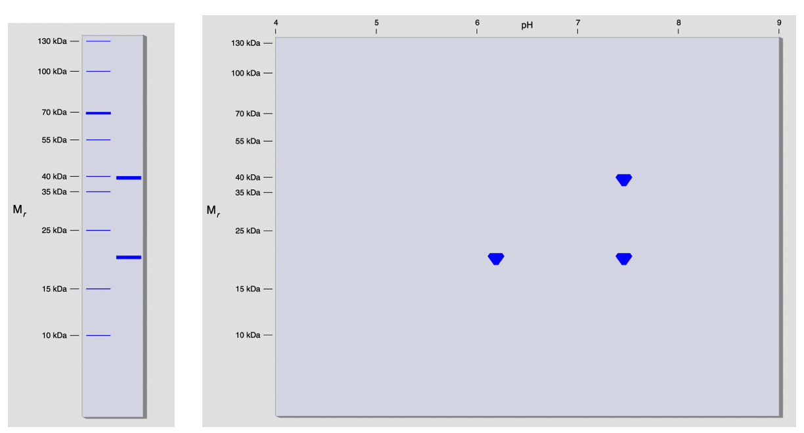{width="100%" fig-align="center"} 

1. Brug resultaterne til at estimere MW og pI for hvert af de tre
proteiner i blandingen. Gelerne giver også en indikation af de
relative mængder. Hvad kan man konkludere her?

::: {.callout-solution}
Vi observerer to lige tykke bånd ved ca. 20 og ca. 40 kDa på SDS-PAGE samt tre lige store spots på 2D-PAGE, to med en masse på ca. 20 kDa og pI-værdier på 6 og 7.5 samt én med en masse på ca. 40 kDa og pI ca. 7.5. Der lader til at være lige mængder af de tre proteiner på 2D-PAGE selv om dette ikke afspejles på SDS-PAGE.
:::

I næste omgang vil du køre en gelfiltrering af proteinblandingen. Du har
følgende muligheder for at vælge gelfiltrerings-medie til din søjle:

  ---------------------------------------------------------------------
  Matrix name      Bead type                Approximate fractionation
                                            range for peptides and
                                            globular proteins
                                            (molecular weight)
  ---------------- ------------------------ ---------------------------
  Sephadex G-50¹   dextran                  1500 - 30000

  Sephadex G-100¹  dextran                  4000 - 150000

  Sephacryl S-200  dextran/acrylamide       5000 - 250000
  HR¹                                       

  Ultrogel AcA 54² polyacrylamide/agarose   6000 - 70000

  Ultrogel AcA 44² polyacrylamide/agarose   12000 - 130000

  Ultrogel AcA 34² polyacrylamide/agarose   20000 - 400000

  Bio-Gel P-60³    polyacrylamide           3000 - 60000

  Bio Gel P-150³   polyacrylamide           15000 - 150000

  Bio-Gel P-300³   polyacrylamide           60000 - 400000
  ---------------------------------------------------------------------

¹ Sephadex^®^ and Sephacryl^®^ are registered trademarks of GE
Healthcare Bio-Sciences AB.\
² Ultrogel^®^ is a registered trademark of BF Biotechnics, Inc.\
³ Bio Gel^®^ is a registered trademark of Bio-Rad Laboratories, Inc.

2. Vælg det medium, hvis separationsområde passer bedst med det område,
de tre proteiner ligger indenfor. Hvad skal man være specielt
opmærksom på ifm. multimere proteiner?

::: {.callout-solution}
Vi har tre proteiner med forventet MW på ca. 20 kDa og ca. 40 kDa, så Ultrogel AcA 54 eller Bio-Gel P-60 passer umiddelbart bedst. Her skal man være opmærksom på at proteinernes evt. oligomere tilstand (dimer, trimer, tetramer, etc.) ikke ses SDS-PAGE eller 2D-PAGE, da prøverne denatureres i begge tilfælde. Man kunne derfor vælge et materiale, der også ville tillade separation af f.eks. en dimer af 40 kDa, hvis man mistænker dette, f.eks. Sephadex G-100.
:::

Du kører nu din gelfiltreringssøjle og får følgende kromatogram:

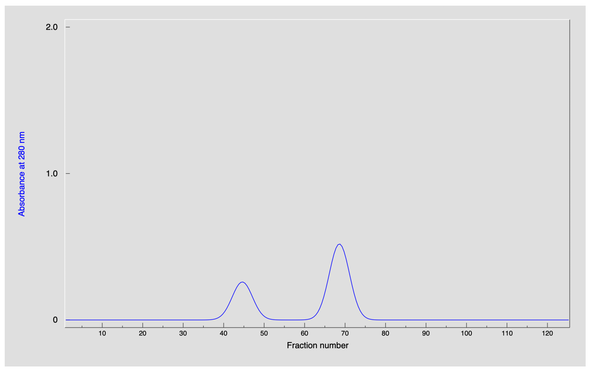{width="100%" fig-align="center"} 

3. Kromatogrammet angiver absorbans ved 280 nm som funktion af
fraktionsnummeret. Hvad repræsenterer absorbansen og hvordan bruges
kromatogrammet i praksis?

::: {.callout-solution}
De aromatiske sidekæder tryptofan og tyrosin absorberer UV-lys ved 280 nm, så vi kan med kurven følge hvor proteiner eluerer fra søjlen. Så vi kan altså ikke identificere de enkelte proteiner udfra kurven. Så med mindre man har en specifik kromofor i sit protein, der giver et fingerprint ved en anden bølgelængde er man derfor nødt til at køre geler af hver top for at finde ud af hvilke proteiner, der eluerer hvor.
:::

4. Hvor mange toppe er der i kromatogrammet? Bemærk deres indbyrdes højde.

::: {.callout-solution}
Vi observerer to toppe, hvoraf den sidst eluerede er ca. dobbelt så stor som den første. Når vi taler om toppenes størrelse er det arealet under kurven, der modsvarer mængden af protein, så vi kan sige at arealet under den sidste top er dobbelt så stort som under den første.
:::

5. Sammenlign nu toppenes placering med proteinernes MW fra før. Kan disse data fortolkes på mere end én måde? Hvorfor?

::: {.callout-solution}
Vi vil forvente at store proteiner eluerer før mindre proteiner under gelfiltrering. Da vi forventer to proteiner med en MW på ca. 20 kDa passer dette altså fint med at de eluerer sammen til sidst med 40 kDa-proteinet før det. Men i princippet kunne nogle af proteinerne også danne multimerer, hvorved fortolkningen af kromatogrammet kompliceres.
:::

Du analyserer nu indholdet i de to toppe ved at udtage fraktion 45 og 68. 
Du kører SDS-PAGE på begge fraktioner og 2D-PAGE på fraktion 68 og
får følgende resultater:

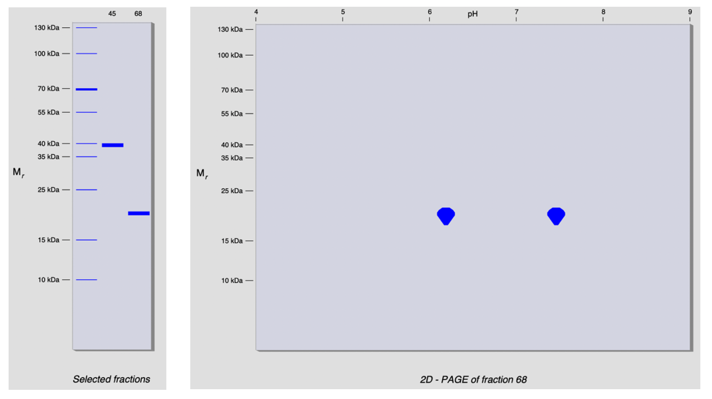{width="100%" fig-align="center"} 

6. Kan kromatogrammet nu forklares éntydigt?

::: {.callout-solution}
Vi et bånd ved ca. 40 kDa for den første top (ca. fraktion 44 på Ultrogel AcA 54) og et bånd ved ca. 20 kDa for den anden top (fraktion 68). Vi kan nu sige med en vis sikkerhed at de tre proteiner ikke danner multimerer og eluerer som forventet. Der er dog en teoretisk mulighed for at de alle tre danner f.eks. dimerer, så det vi faktisk ser er én top svarende til 80 kDa og to proteiner svarende til 40 kDa. For at afklare dette er man nødt til at kalibrere sin søjle med kendte proteiner (se senere opgave).
:::

Du tester nu enzym aktiviteten i fraktion 45 og 68 og finder ud af at
den er i fraktion 68. Så det har ikke lykkedes at oprense dit enzym. Du
har nu spildt 30 mg af den værdifulde protein-prøve og din chef er meget
utilfreds og truer med at du vil blive fyret. Efter at have besindet
sig, får du dog en chance til med en ny protein prøve og nogle ekstra
dage til at fixe det (se opgave 3).



## Opgave 3. Ionbyttekromatografi

Du vil nu forsøge dig igen med at oprense enzymet fra protein-prøven og
vælger i denne omgang ionbyttekromatografi. Du vælger at benytte mediet
DEAE-cellulose, der står for diethylaminoethyl-, en tertiær aminogruppe,
der har en positiv ladning undtaget ved meget basiske pH-værdier. Mediet
vil altså være positivt ladet og binde proteiner, der har en negativ
nettoladning. Det er derfor nyttigt at overveje hvilken pI-værdi,
proteinerne i blandingen har sammenholdt med bufferens pH.

1. Hvilken nettoladning har et protein når pH \< pI? 

::: {.callout-solution}
Proteiner vil være overvejende positivt ladede (eller i hvert fald
have en positiv nettoladning) når pH \< pI.
:::

Du kigger til tilbage på din 2D-PAGE gel (fra opgave 2) og noterer pI
værdi for de 3 proteiner i prøven.

2. Hvis denne blanding blev kørt på en DEAE-søjle ved pH 7, hvilke(t)
protein(er) ville så binde? Hvad så ved pH 6 og pH 8?

::: {.callout-solution}
Vi har altså ét protein på ca. 40 kDa med pI \~7.5, samt to
proteiner med MW ca. 20 kDa, ét med pI lige over 6 og et andet med
pI \~7.5. Ved pH 7.0 vil proteinet med pI \~6 altså være negativt
ladet mens de to andre vil være positivt ladede. Det er altså kun
det første protein, vi vil forvente binder til søjlen (da den også
er positivt ladet). Ved pH 6 vil alle tre proteiner være positivt
ladede og ingen af dem vil binde, mens ved de ved pH 8 alle vil være
negativt ladede og dermed binde søjlematerialet.
:::

Du opsætter nu din søjle med \"DEAE-sepharose\" og eluering med en
saltgradient. Bufferens pH-værdi sættes til 7.0 og gradienten til at
køre fra 0.0 - 0.5 M salt. Eksperimentet giver dig følgende kromatogram
med absorptionen ved 280 nm i blåt og gradienten i pink:

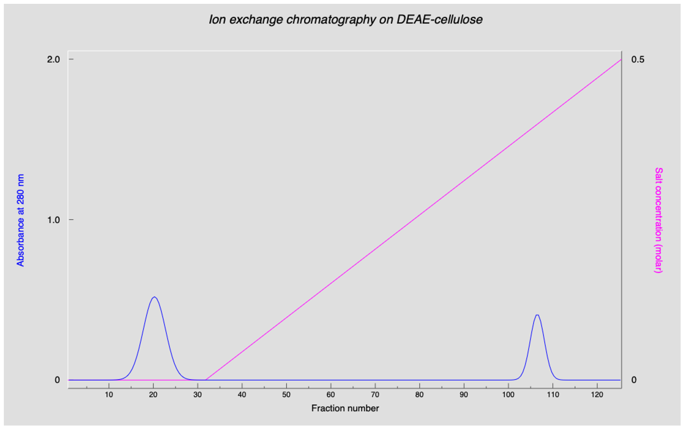{width="100%" fig-align="center"} 

3. Hvorfor eluerer de bundne proteiner når saltkoncentrationen hæves?
Hvad kan man sige om de proteiner, der eluerer før gradienten? Hvor
mange toppe er der ved pH 7.0?

::: {.callout-solution}
Når saltkoncentrationen stiger vil de små ioner efterhåndne
udkonkurere proteinerne fra materialet, hvorved de slipper og
eluerer. Området før gradienten kalder man populært for \"vasken\",
da det er det område, hvor ubundne proteiner eluerer.
:::

Du analyserer nu de to toppe ved at udtage fraktion 20 og 107 og kører
begge på 1D SDS-PAGE og fraktion 20 på 2D SDS-PAGE. Du får følgende
resultat:

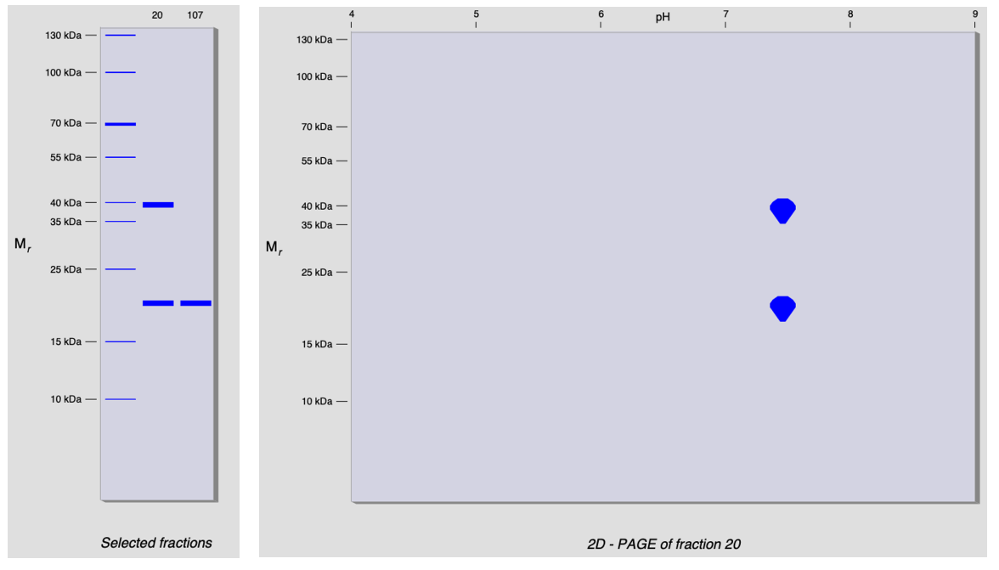{width="100%" fig-align="center"} 

4. Hvilke proteiner er i hvilke toppe? Er det som forventet?

::: {.callout-solution}
Vi observerer to toppe ved pH 7.0, én i vasken og én sentgradienten. I den første top (vask, fraktion 20) observerer vi proteiner ved 20 og 40 kDa, mens vi fra toppen i gradient(fraktion 106) kun ser et protein ved 20 kDa. Dette er sforventet, da to proteiner ikke skulle binde ved pH 7.0. Vi haltså fået separeret de to proteiner ved 20 kDa på baggrund af derforskellige pI-værdier, hvilket ikke var muligt med gelfiltrering.
:::

Du måler enzym aktiviteten i fraktion 20 og 107 og finder at enzymet er
i fraktion 20, der jo har to proteiner. Du forsøger nu i desperation at
køre søjlen ved både pH 6 og pH 8 for at se om du kan adskille
proteinerne. Du får følgende resultater:

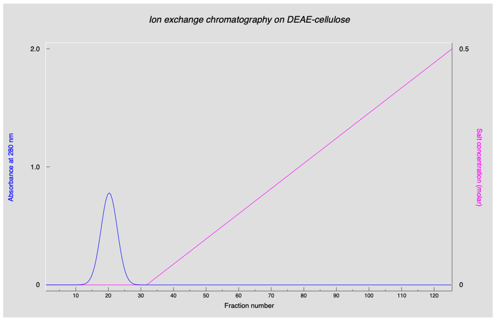{width="100%" fig-align="center"} 

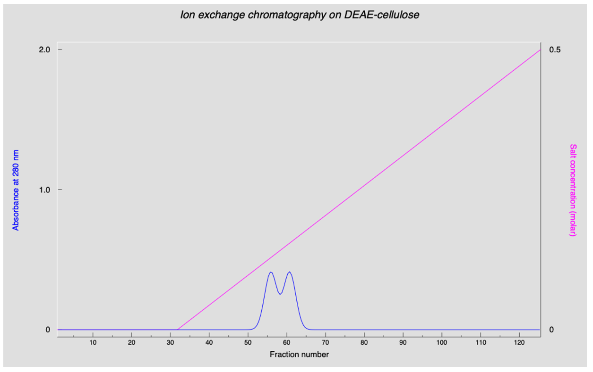{width="100%" fig-align="center"} 

5. Hvordan ændrer kromatogrammet sig når pH varierer og kan du forklare
forskellene? Diskutér hvordan man kan optimere sin oprensning ved at
justere pH under ionbyttekromatografi.

::: {.callout-solution}
Ved pH 6.0 observerer vi kun én top i vasken med alle tre proteiner.
Som forventet binder ingen af dem ved denne pH-værdi. Ved pH 8.0 ser
vi to overlappende toppe, hvor det ene af de to 20 kDa-proteiner
eluerer i den første (ca. fraktion 56) mens 40 kDa-proteinet findes
i den sidste (ca. fraktion 61). Diskutér hvor det andet 20
kDa-protein eluerer. Dette er altså ikke en optimal separation.
Bufferens pH-værdi har stor betydning for hvordan en ionbyttesøjle
kører, og et vigtigt led i udvikling og optimering af en
oprensningsprotokol.
:::

Du har igen fejlet, har ikke fået oprenset dit enzym og har brugt hele
den dyrebare prøve. Din projekt-økonom er frustreret og siger at firmaet
ikke længere kan betale for dit ineffektive arbejde og vil have dig
fyret. Din chef støtter dig dog under den betingelse af du forsikre dem
om at du vil gøre en ekstra indsats (se opgave 4).



## Opgave 4. En sekventiel proces

Efter at have sovet på det, er du klar til en ny dag på arbejdet. På
nuværende tidspunkt er det nok gået op for dig at du ikke kan oprense
enzymet i ét trin ved enten gelfiltrering eller ionbyttekromatografi, da
du nu har fundet ud af at to proteiner har samme MW og to har samme
isoelektriske punkt. Men ved at benytte de to teknikker efter hinanden,
i en sekventiel oprensning, kan det derimod godt lade sig gøre. **Dette
er et centralt princip indenfor proteinoprensning: Med flere på hinanden
følgende oprensningstrin søger man at kombinere komplementære
separationsprincipper for at opnå adskillelse af proteiner med lignende
egenskaber.** Benyt nu det, du har lært i de to foregående opgaver til
at oprense enzymet fra den tredje protein-prøve som du har fået
udleveret af chefen.

1.  Du starter med at studere 2D-gelen med alle tre proteiner igen. Hvad
    er pI for de to proteiner, der har samme pI hhv. MW for de to, der
    har samme MW? Hvilket protein må så være enzymet?

::: {.callout-solution}
pI er ca. 7.4 for de to proteiner, der har samme pI (6.1 for det
    andet protein). MW er ca. 20 kDa for de to proteiner, der har samme
    MW (og ca. 40 kDa for det andet). Protein 2 må derfor have MW 20 kDa
    og pI 7.4, så det overlapper med begge de to andre på én parameter.
:::

2.  Du kører gelfiltreringssøjlen igen og satser ved at loade hele din
    30 mg protein-prøve. Hvordan kan du kende den top, der indeholder
    enzymet? Hint: Vi ved at der er to proteiner med samme MW.

::: {.callout-solution}
Vi kan se af 2D-gelen at der er ca. lige meget af hvert protein, så
    det må være den største top, der indeholder to forskellige
    proteiner.
:::

3.  Du pooler nu alle fraktionerne 62-75 fra den valgte top. Hvor mange
    mg protein er der teoretisk set i denne top?

::: {.callout-solution}
Der er 20 mg protein tilbage efter pooling.
:::

Du måler protein koncentration og enzymaktivitet:

    Total protein: 19.9 mg\
    Total enzyme: 1989.9 Units\
    Enrichment: 1.5\
    Yield: 99.5%\
    Cost: 0.251 hours/100 Units

4.  Brug nu resultatet fra spørgsmål 2 til at regne ud, hvilket af de to
    resterende proteiner, der vil binde til DEAE-søjlen ved pH 7.

::: {.callout-solution}
Proteinet med pI 6.1 vil være negativt ladet ved pH 7 og dermed
    binde til DEAE-søjlen (anionbytter). Proteinet med pI 7.4 vil løbe
    igennem.
:::

Du kører nu DEAE-søjlen og får følgende resultat:

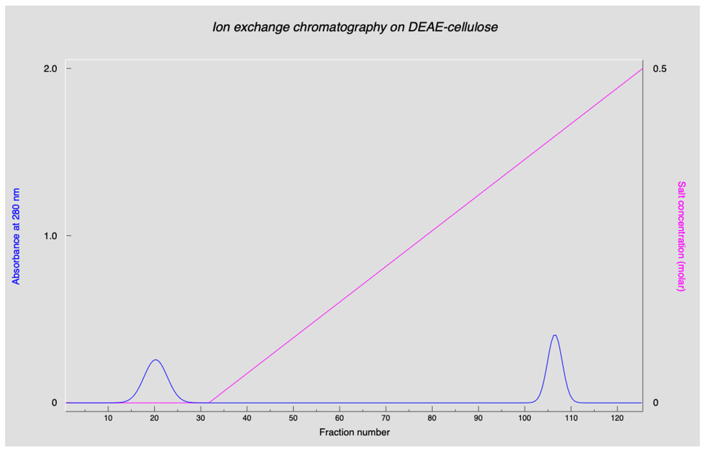{width="100%" fig-align="center"} 

5.  Ser kromatogrammet anderledes ud end da du kørte søjlen med alle tre
    proteiner? Hvor mange mg protein kan du oprense?

::: {.callout-solution}
Ja, der er nu to toppe af samme størrelse, hvor der før var én stor
    og én lille top. Der er 10 mg protein tilbage (der var oprindeligt
    10 mg af hvert protein).
:::

Du pooler nu alle fraktionerne 10-30 fra den valgte top og måler protein
koncentration of enzymaktivitet:

Total protein: 9.9 mg\
Total enzyme: 1989.8 Units\
Enrichment: 3.0\
Yield: 99.5%\
Cost: 0.503 hours/100 Units

Til slut kører du en SDS-PAGE for at bekræfte at der kun er ét bånd på
gelen.

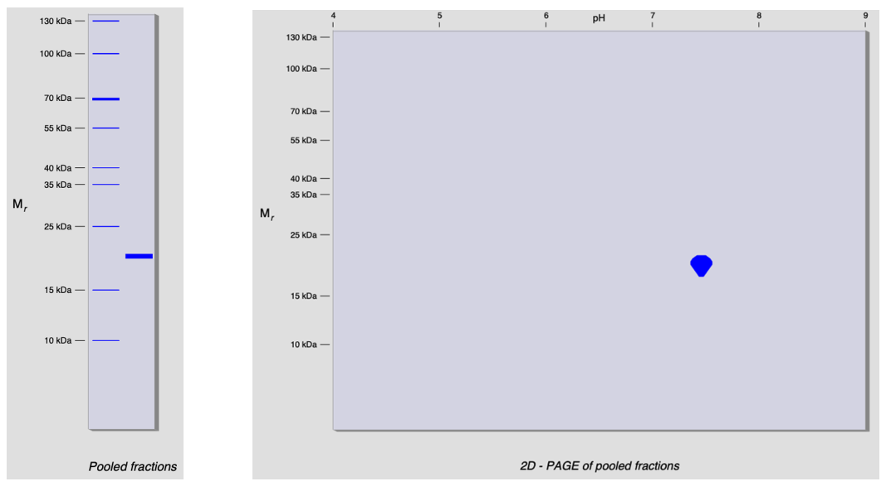{width="100%" fig-align="center"} 

Det er endelig lykkedes - og chefen roser dit gode arbejde og
vedholdenhed - lover lønforhøjelse - og han har forresten flere opgaver
til dig (se opgave 5 og 6).



## Opgave 5. Kalibrering af gelfiltrering

Din næste er at kalibrere en gelfiltreringssøjle, hvilket gøres ved at
analysere en blanding af proteiner med kendte masser. Dette et meget
vigtigt eksperiment i et hvert proteinbiokemisk laboratorium, da man
ikke på forhånd kan vide hvilket elueringsvolumen, der svarer til
hvilken MW for en ukendt søjle. Som nævnt i en tidligere opgave kunne vi
f.eks. ikke være sikre på om vi havde to monomere proteiner på 20 kDa og
ét på 40 kDa eller f.eks. to dimerer på hhv. 2\*20 kDa og 2\*40 kDa.

Du får udleveret en \"GF Calibration Mixture\", der indeholder 6
proteiner med forskellige MW, der alle er på monomer form:

  -----------------------
  **protein**   **MW
                (Da)**
  ------------- ---------
  1             200.000

  2             100.000

  3             50.000

  4             25.000

  5             12.500

  6             7.400
  -----------------------

Denne type standardproteiner er kommercielt tilgængelige netop med det
formål at kunne kalibrere gelfiltreringssøjler.

1.  Hvilket af de tilgængelige gelfiltreringsmedier (der blev listet i
    opgave 2) vil bedst være i stand til at separere alle 6 proteiner?

::: {.callout-solution}
Gel viser de 6 proteiner.
:::

Du kører nu din valgte gelfiltreringssøjle og får følgende resultat:

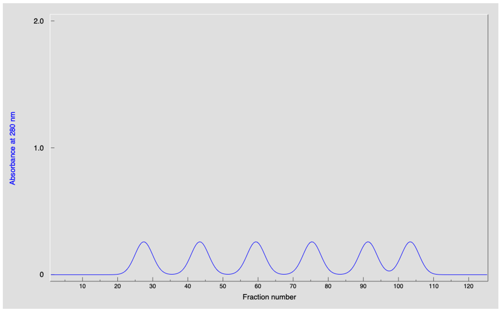{width="100%" fig-align="center"} 

2.  Notér elueringsvolumenet (fraktionsnummeret) for hvert top (midten
    af peaken).

::: {.callout-solution}
Sephacryl S-200 HR er det eneste materiale, der kan separere hele
    vejen fra 5000-250.000 kDa. Her antager vi at alle proteinerne er
    monomerer eller i hvert fald har en oligomer-MW, der svarer til det
    angivne.
:::

3.  Tilordn hver top til den korrekte MW og brug Excel til at plotte
    elueringsvolumenet som funktion af log(MW). Får du en ret linje?\
    Hint: Husk på hvilke proteiner (store/små), der kommer hhv. først og
    sidst i gennem en gelfiltreringssøjle.

::: {.callout-solution}
Vi observerer 6 toppe ved ca. 27, 43, 59, 75, 92 og 103 ml (eller fraktionsnummer).\
Vi antager at proteinerne eluerer efter størrelse med det største først:

  -------------------------------------
  protein   MW (Da)   Fraktionsnummer
  --------- --------- -----------------
  1         200.000   27

  2         100.000   43

  3         50.000    59

  4         25.000    75

  5         12.500    92

  6         7.400     103
  -------------------------------------

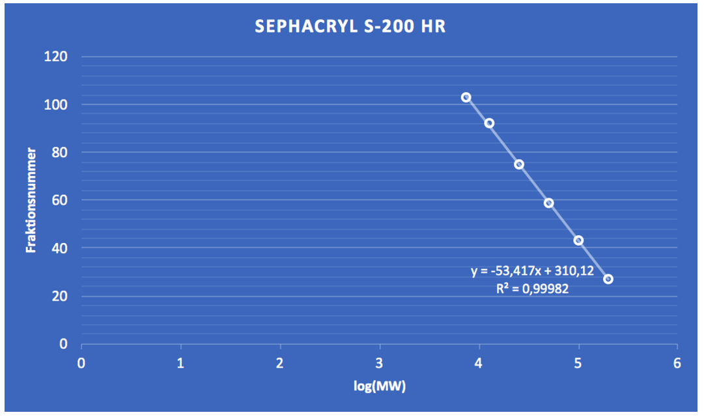{width="100%" fig-align="center"} 
:::

Du analyserer nu en ny prøve kaldet \"GF Test Mixture\" med samme
gelfiltreringssøjle:

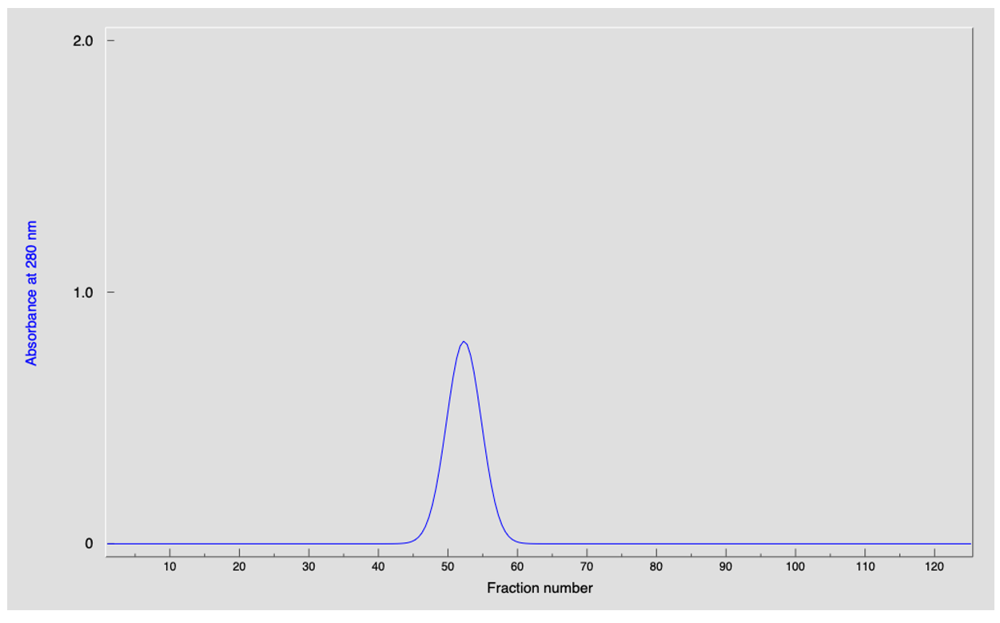{width="100%" fig-align="center"} 

4.  Brug fittet fra Excel til at estimere den native MW af det ukendte
    protein.\
    Hint: Bestem elueringsvolumenet og via plottet log(MW).

::: {.callout-solution}
Det ukendte protein eluerer ved fraktion 52. Da vi har log(MW) = (fraktionsnummer-310.12)/-53.417), får vi log(MW) = 4.83, eller MW = 68 kDa.
:::

5.  Du kører til sidst en SDS-PAGE af fraktion 53 for at bestemme
    monomermassen af proteinet. Hvor mange forskellige subunits består
    dette protein af?

::: {.callout-solution}
Proteinet har en masse baseret på SDS-PAGE på 18-20 kDa og må derfor
være en trimer bestående af 3 subunits på hver denne masse.
:::

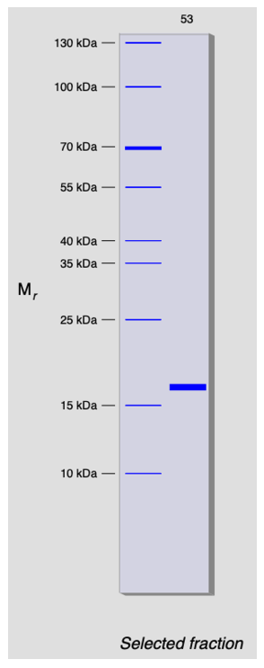{width="30%" fig-align="center"} 



## Opgave 6. Oprensning af ukendt protein

Du har fået en ny opgave af cheffen om at oprense et ukendt protein fra
en kompleks blanding af 20 proteiner. Du får at vide at proteinet er det
største i prøven. Det er vigtigt at oprensningen både giver en fornuftig
mængde protein samt at proteinet er så rent som muligt!

Du starter med at køre en 2D SDS-PAGE gel:

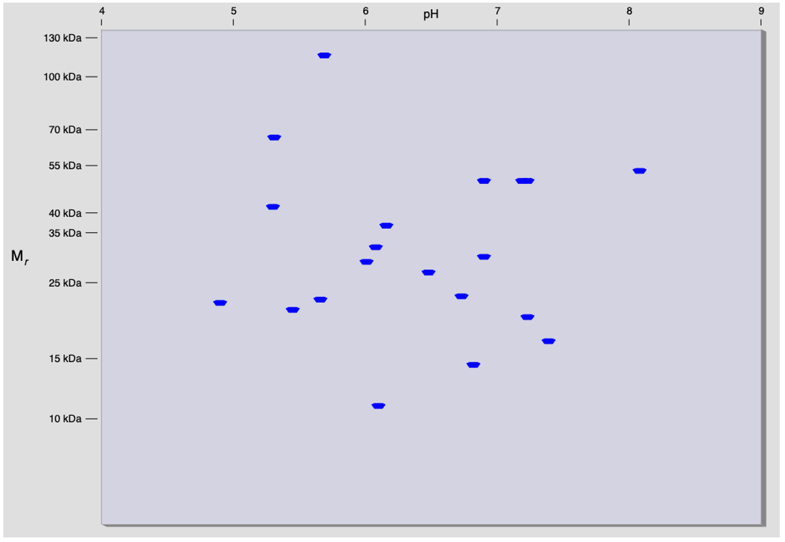{width="100%" fig-align="center"} 

1.  Identificer proteinet på gelen og noter dets MW og pI.

::: {.callout-solution}
MW = 116 kDa, pI = 5.3.
:::

2.  Brug informationerne fra 2D-gelen til at designe et udkast til en
    oprensningsprotokol baseret på hvad du har lært indtil nu. Hvad er
    den smarteste måde at oprense proteinet på? Vær systematisk og tænk
    på at i laboratoriet tager hvert trin tid og koster din chef penge.

::: {.callout-solution}
Pga. den høje masse kan det være smart at starte med en
    gelfiltrering. Baseret på søjlematerialernes egenskaber virker
    Ultrogel AcA-34 som et godt valg. Man får dog ikke fuldstændig
    separation, men må poole den første (største MW) peak så godt som
    muligt.
:::

3.  Det kan oplyses at der fra start er 50 mg af det ukendte protein i
    blandingen. Hvor stort udbytte (i %) forventer du at opnå?

::: {.callout-solution}
Der vil mistes protein for hver oprensnings-søjle. Med erfaring fra
    tidligere opgave mister vi nok nogle procent per søjle og ender med
    ca. 45 mg.
:::

> Hint: Selv med denne komplekse proteinblanding er det muligt at
> oprense enzymet i to trin, hvis det gøres med omhu!

Du starter med en gelfiltrering med det valgte søjle materiale og får
følgende kromatogram:

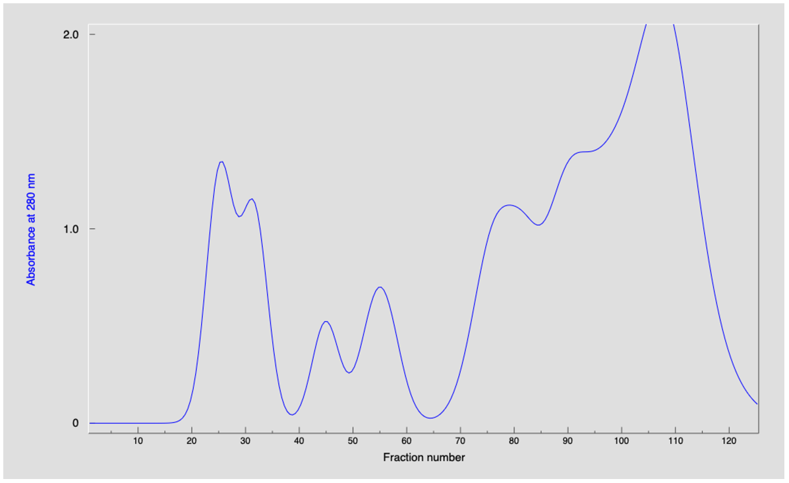{width="100%" fig-align="center"} 

4.  Hvilken top og hvilke fraktioner vil du vælge at poole for at
    oprense dit ukendte protein?

::: {.callout-solution}
Vælger fraktion 15-28.
:::

Du måler nu koncentration i din poolede prøve og får følgende værdier:

Total protein: 49.7 mg\
Enrichment: 10.1\
Yield: 90.4%\
Cost: 0.022 hours/100 Units

Du kører 1D og 2D SDS-PAGE for at undersøge renheden af din prøve:

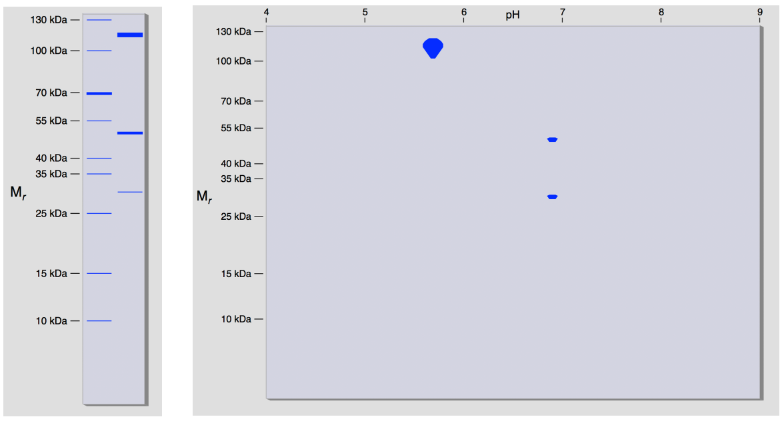{width="100%" fig-align="center"} 

5.  1D-gelen afslører at prøven er kontamineret. Hvordan kan der være
    kontaminering, når ved at alle de andre proteiner i prøven er meget
    mindre?

::: {.callout-solution}
Gel afslører at vi stadig har kontaminanter, der må stamme fra
multimere proteiner, da de har relativt små monomermasser. 2D-gelen
af samme afslører dog at disse kontaminanter har en noget højere
pI-værdi.
:::

2D-gelen viser dog at disse kontaminanter har en noget højere pI-værdi.
Det ses at vores ukendte protein (store spot) vil være negativt ladet
ved pH-værdier over 5.8 mens de to kontaminanter vil være positivt
ladede op til pH 6.8. Så hvis vi kører en anionbytter i intervallet
mellem (pH 5.8-6.8) burde det altså kun være vores protein, der binder.

Du kører nu en ionbyttekromatografi søjle med DEAE-cellulose ved pH 6.5
og får følgende resultat:

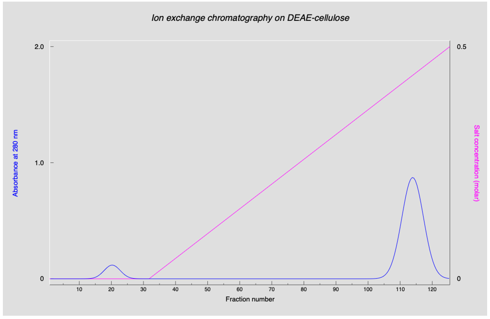{width="100%" fig-align="center"} 

6.  Hvilken top og hvilke fraktioner vil du vælge at poole for at
    oprense det ukendte protein?

::: {.callout-solution}
Vælger fraktion 102-125.
:::

Du måler nu koncentration i din poolede prøve og får følgende værdier:

Total protein: 45.2 mg\
Enrichment: 11.2\
Yield: 90.3%\
Cost: 0.044 hours/100 Units

Du kører 1D SDS-PAGE for at se om dit protein er helt rent!

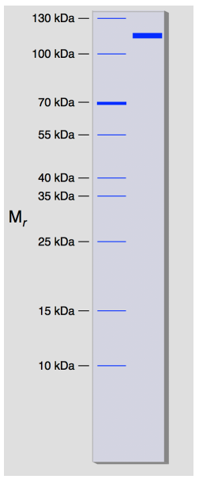{width="30%" fig-align="center"} 

7.  Er du tilfreds med resultatet? Hvad kunne du gøre for at få et endnu
    højere udbytte?

::: {.callout-solution}
Vælger fraktion 15-35 på gelfiltreringssøjlenfor at få mere af den rigtige peak med i første omgang.
:::

### Oligomer

Du kører en gelkalibrering af din søjle med proteiner med standard masse
(som i opgave 5) og estimer massen af dit nyoprensede protein til at
være 465 kDa.

8.  Hvilken oligomer form har dit oprensede protein?

::: {.callout-solution}
Tetramer.
:::



## Opgave 7. Strukturbestemmelse af det oprensede protein (PyMOL)

Du har nu endelig fået oprenset dit protein arbejder over de kommende
måneder i afdelingen for strukturbestemmelse, hvor du (med god
vejledning) står for hele processen med prøveforberedelse, X-ray
krystallografi og cryo-elektron mikroskopi, og den efterfølgende
modellering.

1.  Dit protein er blevet undersøgt med røntgenkrystallografi og en
    Denne struktur er baseret på en højopløsnings (1,5 Ångström)
    røntgenkrystallografisk undersøgelse. Åben modellen, der er blevet
    bestemt med X-ray krystallografi til 1,5 Å, i PyMOL med `fetch 1JZ8` 
    og farv kæder. Hvor mange kæder er der i proteinet?

::: {.callout-solution}
4 kæder
:::

2.  Dit protein er også blevet undersøgt ved hjælp af
    kryo-elektronmikroskopi. Et cryo-EM-kort blev bygget ud fra over
    90.000 billeder af molekylet frosset i is, som var detaljeret nok
    til at give en atommodel. Du kan åbne cryo-EM kortet med `fetch EMD-2984` 
    og modellen med `fetch 5A1A`. Hvilket område er mest flexibelt?

::: {.callout-solution}
Fleksibelt område er rødt. Områder omkring 687 og 732.
:::

3.  Du vælger at studere det fleksibele domæne nærmere med NMR. Åben
    NMR-strukturen med `fetch 5IAZ`. Hvilket område er mest flexibelt?
    Hint: Afspil de forskellige frames, der viser forskellige modeller
    der passer til NMR data, og find det mest fleksible domæne.

::: {.callout-solution}
Område 738-758 og område omkring 823.
:::

4.  Søg med en del af sekvensen med Protein BLAST
    (<https://blast.ncbi.nlm.nih.gov/>) for at finde ud af hvilket
    protein det er?

::: {.callout-solution}
Det er beta-galactosidase.
:::

Du finder ud af at proteinet du har oprenset og bestemt strukturen af er
et helt standard *E. coli* protein og ikke et nyt og interessant protein,
som din chef havde sat dig i udsigt. Nu bliver cheffen fyret fordi han
ikke har styr på de prøver han udleverer. Du bliver til gengæld hædret
for dine evner indenfor protein oprensning, X-ray, cryo-EM og NMR og får
en glorværdig karriere med løsning af nye og interessante biomolekylære
strukturer.