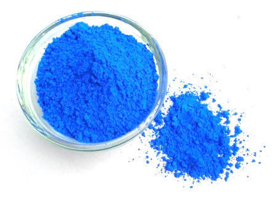
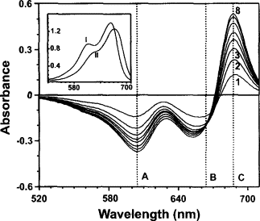

## Opgave 1. RNase-assayet

I denne opgave skal vi arbejde med teorien bag det RNase-assay, der benyttes ved laboratorieøvelserne. De fleste af den slags assays er baseret på frigivelse af radioaktivt mærkede nukleotider fra et oligonukleotid (RNA eller DNA), hvilket er det mest nøjagtige og følsomme. Kløvning af RNA kan dog også måles spektrofotometrisk vha. methylenblåt, hvilket er mindre følsomt og nøjagtigt, men tilstrækkeligt til vores formål.

Strukturen af methylenblåt samt stoffets udseende er vist nedenfor.

{width="4.125in" height="1.28125in"}            {width="3.03125in" height="2.1875in"}

 

1.  Absorberer methylenblåt i det synlige område? Forklar baseret på stoffets kemiske struktur hvorfor/hvorfor ikke. Angiv, baseret på stoffets udseende, hvor det må forventes at absorbere.

2.  Methylenblåt interagerer kraftigt med nukleinsyrer, men kun når disse er strukturerede. Forklar hvorfor og kom med et forslag til hvordan methylenblåt interagerer med RNA.

Methylenblåts absorptionsspektrum ændres markant når det binder til RNA, som vist i figuren nedenfor, hvor den lille, indsatte figur viser spektre for RNA-bundet (II) og frit methylenblåt (I) og den store figur differensspektre for forskellige koncentrationer af RNA (tallene 1-8 på graferne angiver at der er tilsat mellem 0.1 og 0.8 mg/ml):

{width="4.5in" height="3.8125in"}

 

3.  Hvad sker der med methyleneblåts absorption, når RNA tilsættes? De tre bølgelængder A, B og C viser hhv. methyleneblåt dimer, methyleneblåt monomer og interaktionen med RNA. Hvad sker der med stoffet når RNA tilsættes? 

4.  RNase-assayet er baseret på måling af ændring i absorption når RNA nedbrydes. I starten af forsøges tilsættes methyleneblåt til intakt RNA. Hvordan vil du forvente at spektret løbende ændres efter RNase A tilsættes?

5.  Hvilken bølgelænge ville du vælge til mest præcis måling af absorptionsændringen? Notér dit svar, da det skal bruges til indstilling af spektrofotometret under LØ.

:::: {.content-hidden when-profile="exercise"}
::: {.callout-important}

## Officielt svar

1.  Ja, da stoffet er farvet må det naturligvis absorbere i det synlige område. Dette skyldes den konjugerede, heteroaromatiske ringstruktur. Stoffet er blåt og det blå lys ligger ved 300-500 nm i det synlige spektrum (300-800 nm). Derfor må det transmitere 300-400 nm og altså absorbere bølgelængder over dette, i området 500-800 nm.

2.  Methylenblåt interagerer både via interkalation mellem baserne i strukturerede nukleinsyrer (dvs. RNA/DNA på helixform) på samme måde som ethidiumbromid samt elektrostatisk via den positive ladning, der interagerer uspecifikt med nukleinsyrer. Formentlig vil elektrostatisk interaktion være fremherskende ved lav ionstyrke, mens interkalation (hydrofob) interaktion vil være mere tydelig ved høj ionstyrke. Der findes dog ikke en højtopløst struktur af komplekset mellem methylenblåt og nukleinsyre, så der er tale om en vis spekulation. 

3.  Absorptionen stiger kraftigt ved C (ca. 680 nm) mens den falder ved A (600 nm). B er et såkaldt isosbektisk punkt, hvor absorptionen er konstant. Det A falder må der bliver mindre dimer, mens C stiger, hvilket betyder at monomeren (formentlig) interagerer med RNA.

4.  Først vil der være en kraftig absorption omkring 680 nm, der så aftager efterhånden som RNA nedbrydes.

5.  688 nm.
:::
::::

## Opgave 2. Støkiometriske beregninger

I Eksperiment 3 under laboratorieøvelserne skal vi arbejde med hybridformen af RNase S, der dannes ved støkiometrisk blanding af S-protein og H6-Ubi-S15 S-peptidfragmentet.

Som nævnt i LØ-vejledningens appendix er sekvenserne som følger:

**H6-Ubi-S15**

MGS[HHHHHH]{.underline}G S[QIFVKTLTG KTITLEVEPS DTIENVKAKI QDKEGIPPDQ QRLIFAGKQL EDGRTLSDYN IQKESTLHLV LRLRGG]{.underline}SM[KE TAAAKFERQH LDS]{.underline}

hvor sekvensen på blå baggrund er His-tagget, sekvensen på gul baggrund er ubiquitin og sekvensen på lyserød baggrund er S-peptidfragmentet 1-15.

**S-protein**

SSSNYCNQMM KSRNLTKDRC KPVNTFVHES LADVQAVCSQ KNVACKNGQT NCYQSYSTMS ITDCRETGSS KYPNCAYKTT QANKHIIVAC EGNPYVPVHF DASV 

1.  Beregn de præcise molekylære masser af H6-Ubi-S15 og S-proteinet, f.eks. vha. ProtParam-serveren.

2.  I eksperiment 3 skal ækvimolære mængder af S-protein og H6-Ubi-S15 blandes for at danne et hybrid RNase S-enzym. Her starter man med 10 μl af en opløsning af S-protein, der er 5 mg/ml. Omregn denne værdi til en molær koncentration og beregn herefter hvor meget H6-Ubi-S15, der skal tilsættes fra en opløsning, der også er 5 mg/ml for at proteinerne er tilstede i et 1:1 molært forhold. Dette resultat skal bruges under LØ.

3.  Beregn endelige molære koncentration af RNase aktive sites i opløsningen (dvs. den endelige molære koncentration af S-proteinet efter blanding med H6-Ubi-S15) og regn dette tilbage til en tilsvarende koncentration i mg/ml havde det været ren RNase S. I din beregning skal RNase S regnes til at bestå af S-protein + S-peptidfragmentet 1-15. På denne måde kan vi lave en fortynding af hybrid RNase S-enzymet så det kan sammenlignes med ren RNase S.

:::: {.content-hidden when-profile="exercise"}
::: {.callout-important}

## Officielt svar

1.  H6-Ubi-S15: 11607.11 Da\
    S-protein: 11541.96 Da

2.  S-protein:\
    5 mg/ml = 5 g/L\
    5 g/L / 11541.96 g/mol = 0.000433 mol/L = 0.43 mM\
    \
    H6-Ubi-S15\
    5 g/L / 11607.11 g/mol = 0.000431 mol/L = 0.43 mM\
    \
    Da koncentrationerne er næsten ens, skal vi altså tilsætte samme volumen H6-Ubi-S15 (10 μl) for at opnå 1:1 molært forhold.

3.  Da vi har blandet 10 μl S-protein med samme volumen H6-Ubi-S15 er koncentrationen af S-protein (= aktive sites) altså halveret\
    Dvs. \[S-protein\] = 0.215 mM.\
    \
    S-protein har sekvensen:\
    [KE TAAAKFERQH LDS ]{.underline}SSSNYCNQMM KSRNLTKDRC KPVNTFVHES LADVQAVCSQ KNVACKNGQT NCYQSYSTMS ITDCRETGSS KYPNCAYKTT QANKHIIVAC EGNPYVPVHF DASV\
    \
    hvor den understregede del er S15 og resten er S-proteinet.\
    Den molære masse af det samlede RNase S er derfor 13254.84 Da\
    \
    Den molære koncentration svarer altså til 0.215 mmol/L \* 13254.83 g/mol = 2.87 g/L = **2.87 mg/mL**
:::
::::

## Opgave 3. Øvelse i fortyndingsrækker

I laboratoriet er der meget ofte brug for at udregne fortyndinger af forskellige prøver, både proteinprøver og andre opløsninger. Derfor er det vigtigt at I har helt styr på hvordan man opstiller fortyndingsrækker samt i praksis hvordan man blander opløsningerne.

1.  De fleste enzymopløsninger leveres med en koncentration på 5 mg/mL ("stock-opløsningen"). Hvad er dette i μg/μL og ng/μL?

2.  Hvad er den molære koncentration af en opløsning af nativt bovine RNase A, der er 5 mg/mL? Hint: Sekvensen for bovine RNase A kan findes i LØ-manualens appendix.

3.  I laboratorieøvelsen giver det praktisk mening at arbejde med en koncentration af RNase A på 1 ng/μL. Hvor mange gange skal stock-opløsningen fortyndes for at nå denne koncentration?

4.  Du skal bruge 1 mL RNase A ved 1 ng/μL til dit forsøg. Til rådighed har du 100 μL RNase A ved 5 mg/mL samt 5 mL buffer, der er magen til den buffer, enzymet er opløst i, samt 10 mL rent vand. Efter fortyndingen skal enzymet være ved samme bufferbetingelser som før fortyndingen. Til rådighed har du 1.5 mL Eppendorfrør og Pipetman P2, P10, P200 og P1000. Beskriv hvordan du i praksis vil udføre fortyndingen af enzymet inden forsøget, herunder hvilket pipetter der skal bruges og hvordan de skal indstilles. 

5.  Overvej om der er andre måder at foretage fortyndingen på, der minimerer usikkerheden.

:::: {.content-hidden when-profile="exercise"}
::: {.callout-important}

## Officielt svar

1.  5 μg/μL og 5000 ng/μL

2.  5 mg/mL = 5 g/L\
    5 g/L / 13700 g/mol = 0.000364 M = 364 μM

3.  5000 gange

4.  Dette virker:\
    10 μL (5 mg/mL) + 490 μL buffer -\> 0.1 mg/mL = 100 μg/mL\
    10 μL (100 μg/μL) + 990 μL buffer -\>  1 μg/mL\
    \
    Dette virker også:\
    10 μL (5 mg/mL) + 990 μL buffer -\> 0.05 mg/mL = 50 μg/mL\
    10 μL (50 μg/μL) + 490 μL buffer -\> 1 μg/mL\
    \
    Dette virker ikke:\
    1 μL (5 mg/mL) + 4999 μL buffer -\> 0.001 mg/mL = 1 μg/mL

5.  Se ovenfor.
:::
::::

## Opgave 4. Opsætning af dataark til LØ

I denne opgave skal vi opstille et eksperimentelt dataark i Excel til brug i LØ. I skal bruge dette ark til indsamling og behandling af data under laboratoriekurset.

1.  Åbn en ny workbook i Excel og gem den med et beskrivende navn, f.eks. "LØ data analysis.xlsx".

2.  Opstil nu en tabel på første faneblad, der har plads til 10 absorptionsmålepunkter (nedad) for hver af 10 prøver med stigende enzymkoncentration (henad). Første søjle skal angive tidsintervallerne for de 10 målepunkter, der er 0, 5, 10\...60 sekunder og for hver prøve skal man kunne angive enzymets koncentration øverst.

3.  Download dataark for LØ, som findes under denne uge i Brightspace. Kolonnerne i excelfilen er tilsvarende koncentrationerne 0, 5, 10, 20, 30, 40, 50, 60, 80, 100 ng tilsat RNase. Kopiér absorptionsmålingerne ind i din egen excelfil for at have noget at arbejde med under opbygningen af Excel-arket:

4.  Opret nu en graf for hver af de 10 prøver, der viser absorptionen som funktion af tiden i sekunder. Hint: Brug command (Mac) eller CTRL-knappen (PC) til at vælge både x- og y-akseværdier på. Er graferne lineære? Hvad indikerer det? Hvordan er udviklingen i grafernes hældning når enzymkoncentrationen stiger? Kommentér.

5.  Brug nu Excel-funktionen LINEST (LINREGR på dansk Excel) til at beregne hældningen for bedste rette linje for hver enzymkoncentration. Brug Excels hjælpefunktion samt internettet til at finde ud af hvordan funktionen bruges. Hældningerne skal stå i rækken under sidste målepunkt for hver enzymkoncentration. Hvordan udvikler hældningerne sig med højere enzymkoncentration? Er det forventeligt og hvorfor/hvorfor ikke? Hvad er enheden for disse hældninger?

6.  Opret nu en standardkurve ved at plotte hældningen for hver enzymkoncentration som funktion af enzymkoncentrationen (antal ng enzym tilsat). Kommentér på grafen. Er den lineær og i givet fald i hvilket område? Hvad ville du vælge som konfidensinterval for måling af enzymaktivitet, hvis dette var din målte standardkurve?

7.  Forbered til sidst Excel-workbook'en til LØ ved at slette testdata for standardkurven. Disse vil blive erstattet med dine egne værdier i forsøgets eksperiment 1.

8.  Tænk slutteligt over hvordan du vil behandle data fra de ukendte prøver under forsøget. Se Appendix A i LØ-vejledningen for nogle tips til databehandling. Det kan f.eks. være en god idé at oprette ekstra tabeller til måling af de forskellige, ukendte prøver under forsøg 2-5. Studér LØ-vejledningen og opret de påkrævede tabeller. Måske kan du også finde en smart måde at aflæse den tilsvarende mængde RNase A fra standardkurven udfra hældningerne fra de ukendte prøver\...?

:::: {.content-hidden when-profile="exercise"}
::: {.callout-important}

## Officielt svar

Intet svar angivet.
:::
::::

## Opgave 5. Flowchart til LØ

Dette er en åben opgave, der tjener til forberedelse til LØ. For hvert eksperiment i LØ-vejledningen skal du tegne et flowchart, der angiver hvilke trin, der skal gennemføres og i hvilken rækkefølge samt hvilke resultater, der kommer ud. Husk at angive parallelle forsøg i dit flowchart.

1.  Eksperiment 1 - Måling af standardkurve

2.  Eksperiment 2 - Delvis proteolyse af RNase A

3.  Eksperiment 3 - Aktivitet af RNase S og varianter

4.  Eksperiment 4 - Oprensning af H6-Ubi-S15 fra crude extract samt oprensning af S-protein vha. immobiliseret H6-Ubi-S15

5.  Eksperiment 5 - Kemisk krydsbinding af RNase S

:::: {.content-hidden when-profile="exercise"}
::: {.callout-important}

## Officielt svar

Få inspiration fra LØ-vejledningens side 7:

Time Plan\
Day 1: Brief instructions followed by Experiments 1-2

Experiment 1: Determination of a dose-response curve and linearity range of the ribonuclease assay.

Experiment 2: Limited proteolysis of RNase A with subtilisin.

The instructors recommend that you start Experiment 1, then get started on Experiment 2 as soon as possible. Use some time to get to get familiar with the measurements performed in Experiment 1, but be aware that during Experiment 2 it will take at least an hour before all your samples are ready for activity measurements.

Day 2: Brief instructions followed by Experiments 3-5

Experiment 3: Determination of the activity of RNase S and several hybrid RNase S types.

Experiment 4: Isolation of H6-Ubi-S15 fusion protein and demonstration of purification by interaction with S protein on Ni-NTA.

Experiment 5: Chemical cross-linking of hybrid S protein.

The instructors recommend: As you will be busy doing three separate experiments on day 2, you should start out by focusing on Experiment 4, as collecting samples for SDS-PAGE from the columns will be the bottleneck for completing all experiments. While the columns are running, you should also start the crosslinking reactions for Experiment 5, as these also produce samples to go onto the gel. Finally, initiate Experiment 3 when the crosslinking is running, as you will have time to measure the activities of the complexes while your SDS-PAGE gel is running.
:::
::::
