## Opgave 1. Indhold af hæmoglobin

Et rødt blodlegeme har et rumfang på 87 µm^3^ og et gennemsnitligt hæmoglobin (Hb) indhold på 340 mg/ml.

1.  Hvad er massen af Hb per celle?

2.  Hvor mange Hb molekyler er der per celle? (tetrameren har en molekylvægt på 65 kDa).

3.  Hvor meget Hb ville der være per blodlegeme hvis Hb var krystallinsk pakket heri (hver molekyle en terning med 65Å lange sider).

:::: {.content-hidden when-profile="exercise"}
::: {.callout-important}

## Officielt svar

1.  Masse: 340 x 10^-3^g/10^-3^L x 87 x (10^-6^)^3^m^3^ x 10^3^L/m^3^ = 29,580 x 10^-18^ x 10^3^ g = 29,58 x 10^-12 ^g.

2.  Antal molekyler: 29,58 x 10^-12^ g/(65 x 10^3^ g/mol) x 6,02 x 10^23^ molekyler/mol = 2,73 x 10^8^ molekyler.

3.  Hvert Hb molekyle fylder (65 x 10^-10^m)^3^ = 274 x 10^-27^m. Hver celle fylder 87 x 10^-18^m^3^. Dvs. der er plads til 3,1 x 10^8^ molekyler. Det fås ikke meget tættere!
:::
::::

## Opgave 2. Jern, ilt og hæm

1.  Hvor meget jern er der i en 70kg voksen person? Antag 70 ml blod per kg kropsvægt og et Hb indhold i blod på 160 mg/ml.

2.  Menneskemuskel kan indeholde op til 8 g myoglobin (Mb) per kg mens kaskelothvalen har op til 80 g/kg. Hvor meget O~2~ kan bindes per kg menneske- og hval-muskel når Mb er mættet med ilt?

3.  Ilt koncentrationen i vævsvæske ved 37^o^C er ca. 35 µM. Hvor meget mere (eller mindre) er bundet til Mb i forhold til i vand i hhv menneske og hval?

:::: {.content-hidden when-profile="exercise"}
::: {.callout-important}

## Officielt svar

1.  70 kg =\> 4900 ml blod og et Hb indhold på 160 g/L x 4,9 L = 784 g. Molekylvægt per Hb monomer er 16.25 kDa, dvs. 784 g/16,25 x 10^3^ g/mol = 48,2 x 10^-3^ mol. Fe har en molekylvægt på 56 g/mol, dvs. 2,7 g.

2.  Myoglobin har en molekylvægt på 16.7 kDa. 8 g myoglobin svarer til 0,48 x 10^-3^ mol.  Dvs. der kan bindes 0.48 x 10^-3^ mol x 32 g/mol ilt = 15,3 x 10^-3^ g ilt per kg menneske muskel og tilsvarende 153 x 10^-3^ g ilt per kg hvalmuskel.

3.  Der er jo bundet ilt svarende til en koncentration på 0,48 x 10^-3^ mol/kg = 480 µM i menneskemuskel (ca. 14 gange mere end i vævsvædske) og yderligere 10 gange i hval. God kapacitet!
:::
::::

## Opgave 3. Kooperativitetsopgave

Fremstilling af teoretiske bindingskurver.

1.  Vi skal nu udlede og anvende en simpel matematisk funktion til at beskrive kooperativ binding, den såkaldte *Hill ligning* (ikke noget med bakker men derimod den gode *Archibald Hill*). Lad os tage udgangspunkt i en simpel binding af substrat S til protein X:

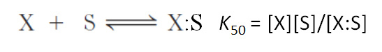{width="5.697915573053368in" height="0.78125in"}

Her gælder at mætningsgraden Y (altså hvor stor en brøkdel af X proteinerne har bundet S) kan skrives som:

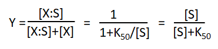{width="3.8645833333333335in" height="0.875in"}

Vi udvider nu denne simple bindingsmodel til at involvere binding af op til *n* molekyler S per X. Vi antager at hvert S kan binde uafhængigt af de andre S'ere:

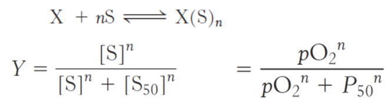{width="6.260415573053368in" height="1.65625in"}Vis hvordan dette fører til Hill-ligningen:

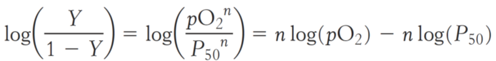{width="6.260415573053368in" height="0.7708333333333334in"}

2.  Brug Hill ligningen til at plotte en ilt-bindings kurve for et hypotetisk two-subunit hemoglobin med kooperativitstallet *n* = 1.8 og p(O~2~) = 10 torr.

Nedenstående kurve viser flere forskellige ilt-bindingskurver. Kurve 3 svarer til hemoglobin med fysiologiske koncentrationer af CO~2~ og 2,3-BPG ved pH 7.\
{width="3.1399125109361328in" height="2.7017541557305336in"}

3.  Hvilke kurver svarer til de følgende ændringer i bindingsbetingelserne:

<!-- -->

a.  Nedgang i mængden af CO~2~.

b.  Stigning i koncentrationen af 2,3-BPG.

c.  Stigning i pH.

d.  Tab af kvarternær struktur.

:::: {.content-hidden when-profile="exercise"}
::: {.callout-important}

## Officielt svar

1.  Dette følger af det simple sammenhæng 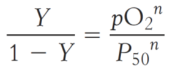{width="1.4791666666666667in" height="0.6051137357830271in"}

2.  Det udføres bedst i Excel med brug af ligningerne i appendix.\
    Hill plottet: log(*Y*/(1-*Y*)) = *n*\*log(p(O~2~)) -- n\*log(P~50~) = 1.8\*p(O~2~)-1.8\*log(10), men hvis man blot skal plotte den oprindelige ilt-bindings kurve, benyttes at *Y* = p(O~2~)*^n^*/( p(O~2~)*^n^*+ *P*~50~*^n^*). Herved fås:\
    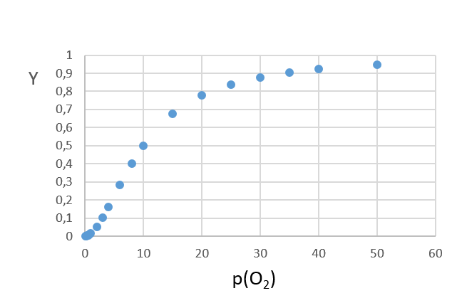{width="5.531010498687664in" height="3.1734995625546807in"}\
    Man ser godt kooperativiteten ved de lave ilt koncentrationer.

3.  Kurve 1: d. Kurve 2: a eller c. Kurve 4: b.
:::
::::

## Opgave 4. Lampret-fiskens iltbinding

Lampretfisk er primitive dyr, hvis stamfædre (og ditto mødre!) forgrenede sig væk fra fiskenes stamforældre ca. 400 millioner år siden. Lampretfisk indeholder en hemoglobin (Hb) der er beslægtet med pattedyrs Hb. Der er dog den forskel at lampret Hb er monomert i den ilt-bundne form. Tilførende data for lampret Hb ilt binding findes i TØ mappen:

  ----------------
  p(O2)   Y
  ------- --------
  0.1     0.006

  0.2     0.0124

  0.3     0.019

  0.4     0.0245

  0.5     0.0307

  0.6     0.038

  0.7     0.043

  0.8     0.0481

  0.9     0.053

  1       0.0591

  2       0.112

  3       0.17

  4       0.227

  5       0.283

  7.5     0.42

  10      0.5

  15      0.64

  20      0.721

  30      0.812

  40      0.865

  50      0.889

  60      0.905

  70      0.917

  80      0.927

  90      0.935

  100     0.941

  150     0.96

  200     0.97
  ----------------

1.  Lav en ilt-bindings kurve udfra disse data. Ved hvilket ilt tryk er Hb halvt mættet? Udfra kurvens udseende, virker ilt binding til at være kooperativ?

2.  Lave et Hill plot udfra disse data. Angiver dette plot kooperativitet? Hvad er Hill koefficienten?

3.  Yderligere studier viser at lampret Hb danner primært dimerer når det ikke er bundet til ilt. Foreslå en model til at forklare den observerede kooperativitet i lampret Hb's ilt binding.

:::: {.content-hidden when-profile="exercise"}
::: {.callout-important}

## Officielt svar

1.  Plot Y (brøken af lampret Hb der har bundet ilt) versus p(O~2~) i Excel ark:\
    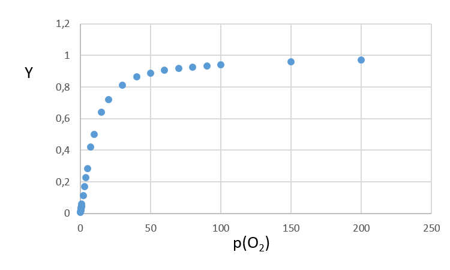{width="5.507042869641295in" height="3.3063003062117233in"}\
    Der er 50% mætning ved 10 torr ilt (det kan nu også aflæses i tabellen!).\
    Den ser tilsyneladende meget hyperbolsk ud, altså ikke kooperativ.

2.  Her skal log (Y/(1-Y)) plottes mod log (p(O~2~)) hvor hældningen giver kooperativitetskoefficienten *n*.\
     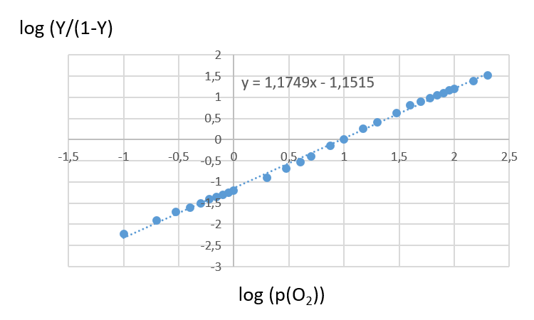{width="5.064000437445319in" height="3.0403094925634297in"}\
    Hældningen bliver 1.2 så den er svagt kooperativ!

3.  Her kan vi anvende begreberne fra T og R tilstand med den viden at monomeren binder ilt godt og dimeren ikke binder ilt så godt. Kooperativiteten opstår hvis begyndelsen er sværere end fortsættelsen. Dvs. som udgangspunkt er der mere dimer end monomer i fravær af ilt (ligevægt forskudt mod dimer). Når der øges på ilt trykket, vil det være svært at binde ilt fordi dimeren (som er den dominerende population) binder dårligt og der er ikke meget monomer. Men når ilt binder (enten til monomer eller dimer) vil det forskyde ligevægten over mod monomer, og jo mere ilt der bindes jo mere forskydes ligevægten over til monomer. Herved opstår en (svag) kooperativitet.\
    \
    \
    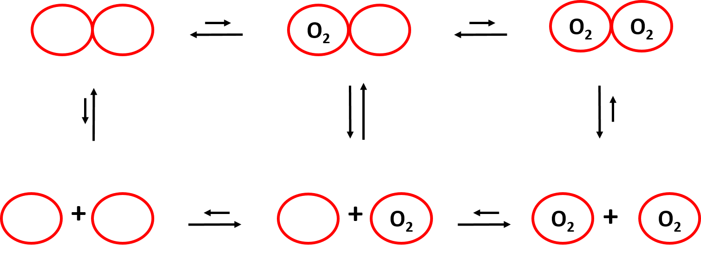{width="5.516056430446194in" height="1.9904494750656168in"}
:::
::::

## Opgave 5. Allosterispørgsmål

1.  Et allosterisk enzym, som følger MWC (concerted) modellen, har en T/R ratio på 300 i fravær af substratet. Sæt nu at en mutation vender ratioen på hovedet. Hvordan ville denne mutation påvirke forholdet mellem reaktionshastigheden og substratkoncentrationen?  

<!-- -->

2.  Nedenstående graf viser fraktionen af et allosterisk enzym i R-state (*f*~R~) samt fraktionen af aktive sites bundet til substrat (*Y*) som funktion af substratkoncentration. Hvilken model, MWC eller sekventiel, kan bedst forklare disse resultater?

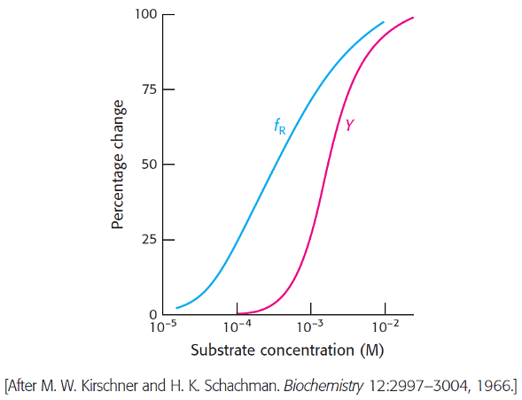{width="5.319888451443569in" height="4.081333114610674in"}

ATCase blev reageret med tetra-nitromethan (TNM) for at danne en farvet nitrotyrosin sidekæde (λ~max~ = 430 nm) i hvert af dens katalytiske peptidkæder. Absorptionen af denne reporter-gruppe afhænger af dens omkringliggende miljø. En essentiel lysin-sidekæde i hvert katalytisk site var endvidere blevet modificeret for at blokere binding af substrat til de aktive site. Katalytiske trimerer blev herefter blevet dannet ved at blande monomerer af dette dobbelt modificerede enzym og det native enzym for at danne hybridkomplekser. Absorptionen af nitrotyrosin sidekæden blev til sidst målt ved titrering af substratanalogen succinate som vist i figuren nedenfor:

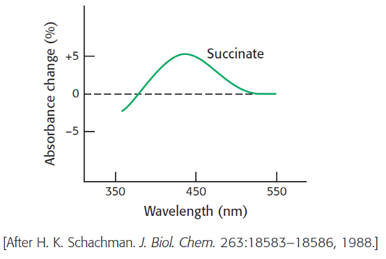{width="4.292507655293089in" height="2.8791207349081365in"}

5.  Hvad er betydningen af ændringen i 430 nm signalet?

En anden ATCase-hybrid blev lavet til at undersøge effekt af allosteriske aktivatorer og inhibitorer. Almindelige regulatoriske subunits var blandet med nitrotyrosin-indeholdende katalytiske subunits. Titrering af ATP i fravær af substrat øgede absorbansen ved 430 nm, på samme måde som succinate i forrige spørgsmål. Det modsatte observerede man for CTP, hvor titrering af stoffet i fravær af substrate forårsagede et fald i 430 nm absorption:

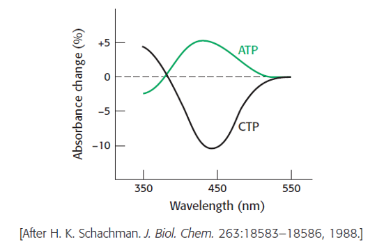{width="4.42321084864392in" height="2.9304997812773403in"}

6.  Hvad er betydningen af disse ændringer i absorbtionen af reporter-sidekæderne?

:::: {.content-hidden when-profile="exercise"}
::: {.callout-important}

## Officielt svar

1.  Hvis T/R ændres fra 300/1 til 1/300, betyder det at allerede i fravær af substrat er der nærmest ingen lav-aktivitets tilstand (T), kun høj-aktivitet (R); denne situation forstærkes bare jo mere substrat binder. Dvs. ingen allosteri, kun simpel Michaelis-menten kinetik.

2.  T/R forholdet sænkes med en faktor c for hvert ekstra substrat der bindes. Dvs. når 1 substrat molekyle er bundet, er T/R forholdet sænket med en faktor 100.

3.  Efter 4 molekylers binding, er det sænket med en faktor (100)^4^ = 10^8^. Dvs. T/R forholdet går fra 10^7^ til 10^-1^.

4.  Concerted model beskriver data bedst. Iflg. den sekventielle model er f~R~ lig med brøkdelen af bundne proteiner (da kun R-formen binder) men der er tydelig forskel på f~R~ og *Y*-kurven, så den kan udelukkes. I concerted modellen gælder dette sammenhæng ikke; man kan godt have en masse tomme R-molekyler. Modellen forklarer (i kraft af *c*=*K*~R~/*K*~T~) at ligand binding forskyder populationen kraftigt over mod R-formen på bekostning af T-formen; denne forskydning gør det efterfølgende muligt at binde endnu flere substratmolekyler.

5.  Substrat kan ikke binde til den modificerede trimer, så derfor må absorptionsændringen skyldes at binding af substrat til den ikke-modificerede trimer transmitterer en strukturel ændring til den modificerede trimer (dvs. den begynder at forskyde ligevægten over mod R tilstanden). Denne strukturelle ændring registreres af nitrotyrosin gruppen, da miljøet omkring den ændres ved at ATCasen går fra T til R.

6.  I denne ATCase er det slet ikke muligt at binde substrat (begge katalytiske trimerer er blokerede fra at binde). Men der er stadig mulighed for at allosteriske regulatorerer kan binde, da de binder til de regulatoriske subunits som jo ikke er modificerede. ATP har samme strukturtransmissionsegenskab som substrat, dvs. trækker i samme (aktiverende) retning (fra T til R), mens CTP trækker i modsatte retning (inhibitor - altså forskyder ligevægten endnu mere over mod T). Dette måles igen udfra nitrotyrosin farven som altså er følsom overfor T-til-R overgangen (uanset om det sker ved at binde noget til en katalytisk subunit eller en regulatorisk subunit).
:::
::::

## Opgave 6. PyMOL API introduktion (OPTIONAL)

***PyMOL-scripting opgave**: I denne opgave skal i lære at bruge PyMOLs Application Programming Interface (API) til at skrive jeres egne udvidelser til PyMOL.*

Denne opgave er ment som supplement til PyMOL video 6, der handler om brugen af PyMOLs API til at lave PyMOL-udvidelser. Det er derfor en god ide at se den video inden man giver sig i kast med denne opgave.

HUSK:

- Start din Python-fil med from pymol import cmd

- Før du definerer funktionen med def skrives `@cmd.extend`

- Hvis du opretter variable i din funktion, så husk at lave dem inden i et "SPACE" (en dictionary), så du ikke gemmer variable i PyMOL environment.\
  Eks: my_space={"ny_liste":\[\],"ny_variabel":22}

Skriv en ny funktion til PyMOL, count_amino_acid(amino_acid), der tæller, hvor mange af en bestemt aminosyre, der er i en selektion og printer dette til konsollen.

*Hint: Brug cmd.iterate() til at lave en liste over dem, sørg for at der ikke er duplikater i listen og find længden på listen.*

:::: {.content-hidden when-profile="exercise"}
::: {.callout-important}

## Officielt svar

Opgaven kan f.eks. løses således:

    ```python
    from pymol import cmd
    ```

`@cmd.extend`\

    ```python
    def count_amino_acid(amino_acid):
    ```

    amino_acid_space={"amino_acids":\[\]}\

    ```python
    cmd.iterate("name CA and resn {}".format(amino_acid), "amino_acids.append(resi)",space=amino_acid_space)
    ```

    return print(len(amino_acid_space\["amino_acids"\]))
:::
::::
