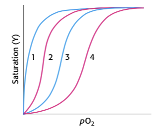

## Opgave 1. Indhold af hæmoglobin

Et rødt blodlegeme har et rumfang på 87 µm^3^ og et gennemsnitligt hæmoglobin (Hb) indhold på 340 mg/ml.

### Beregn Hb-masse per blodlegeme

Hvad er massen af Hb per celle?

::: {.callout-solution}
$$
\begin{aligned}
\mathrm{Masse} &= 340 \times \frac{10^{-3} \ \mathrm{g}}{10^{-3} \ \mathrm{L}} \times 87 \times (10^{-6})^3 \ \mathrm{m}^3 \times 10^3 \ \frac{\mathrm{L}}{\mathrm{m}^3} \\ 
&= 29.580 \times 10^{-18} \times 10^3 \ \mathrm{g} \\
&= 29.58 \times 10^{-12} \ \mathrm{g}.
\end{aligned}
$$
:::

### Beregn antal Hb-molekyler per celle

Hvor mange Hb molekyler er der per celle? (tetrameren har en molekylvægt på 65 kDa).

::: {.callout-solution}
$$
\begin{aligned}
\mathrm{Antal \ molekyler} &= \frac{29.58 \times 10^{-12} \ \mathrm{g}}{65 \times 10^3 \ \frac{\mathrm{g}}{\mathrm{mol}}} \times 6.02 \times 10^{23} \ \frac{\mathrm{molekyler}}{\mathrm{mol}} \\
&= 2.73 \times 10^8 \ \mathrm{molekyler}.
\end{aligned}
$$
:::

### Beregn krystallinsk pakket Hb-mængde

Hvor meget Hb ville der være per blodlegeme hvis Hb var krystallinsk pakket heri (hver molekyle en terning med 65Å lange sider).

::: {.callout-solution}
Hvert Hb molekyle fylder $(65 \times 10^{-10} \ \mathrm{m})^3 = 274 \times 10^{-27} \ \mathrm{m}$. Hver celle fylder $87 \times 10^{-18} \ \mathrm{m}^3$. Dvs. der er plads til $3.1 \times 10^8$ molekyler. Det fås ikke meget tættere!
:::

## Opgave 2. Jern, ilt og hæm

### Beregn jernindhold i menneskekroppen

Hvor meget jern er der i en 70kg voksen person? Antag 70 ml blod per kg kropsvægt og et Hb indhold i blod på 160 mg/ml.

::: {.callout-solution}
70 kg => 4900 ml blod og et Hb indhold på 160 g/L x 4,9 L = 784 g. Molekylvægt per Hb monomer er 16.25 kDa, dvs. 784 g/16,25 x 10^3^ g/mol = 48,2 x 10^-3^ mol. Fe har en molekylvægt på 56 g/mol, dvs. 2,7 g.
:::

### Beregn O₂-binding per kg muskel

Menneskemuskel kan indeholde op til 8 g myoglobin (Mb) per kg mens kaskelothvalen har op til 80 g/kg. Hvor meget O~2~ kan bindes per kg menneske- og hval-muskel når Mb er mættet med ilt?

::: {.callout-solution}
Myoglobin har en molekylvægt på 16.7 kDa. 8 g myoglobin svarer til 0,48 x 10^-3^ mol.  Dvs. der kan bindes 0.48 x 10^-3^ mol x 32 g/mol ilt = 15,3 x 10^-3^ g ilt per kg menneske muskel og tilsvarende 153 x 10^-3^ g ilt per kg hvalmuskel.
:::

### Sammenlign iltbinding i Mb og vand

Ilt koncentrationen i vævsvæske ved 37^o^C er ca. 35 µM. Hvor meget mere (eller mindre) er bundet til Mb i forhold til i vand i hhv menneske og hval?

::: {.callout-solution}
Der er jo bundet ilt svarende til en koncentration på 0,48 x 10^-3^ mol/kg = 480 µM i menneskemuskel (ca. 14 gange mere end i vævsvædske) og yderligere 10 gange i hval. God kapacitet!
:::

## Opgave 3. Kooperativitetsopgave

Fremstilling af teoretiske bindingskurver.

### Udled Hill-ligningen for binding

Vi skal nu udlede og anvende en simpel matematisk funktion til at beskrive kooperativ binding, den såkaldte *Hill ligning* (ikke noget med bakker men derimod den gode *Archibald Hill*). Lad os tage udgangspunkt i en simpel binding af substrat S til protein X:

{width="80%" fig-align="center"}

Her gælder at mætningsgraden Y (altså hvor stor en brøkdel af X proteinerne har bundet S) kan skrives som:

{width="80%" fig-align="center"}

Vi udvider nu denne simple bindingsmodel til at involvere binding af op til *n* molekyler S per X. Vi antager at hvert S kan binde uafhængigt af de andre S'ere:

{width="80%" fig-align="center"}

Vis hvordan dette fører til Hill-ligningen:

{width="80%" fig-align="center"}

::: {.callout-solution}

Dette følger af det simple sammenhæng 

{width="60%" fig-align="center" .lightbox}

:::

### Plot iltbindingskurve med Hill-ligning

Brug Hill ligningen til at plotte en ilt-bindings kurve for et hypotetisk two-subunit hemoglobin med kooperativitstallet *n* = 1.8 og p(O~2~) = 10 torr.

Nedenstående kurve viser flere forskellige ilt-bindingskurver. Kurve 3 svarer til hemoglobin med fysiologiske koncentrationer af CO~2~ og 2,3-BPG ved pH 7.

{width="80%" fig-align="center" .lightbox}

::: {.callout-solution}
Det udføres bedst i Python eller Excel med brug af ligningerne i appendix.

Hill plottet:
$$
\log\left(\frac{Y}{1-Y}\right) = n\log(p(O_2)) - n\log(P_{50}) = 1.8 \cdot p(O_2)-1.8 \cdot \log(10)
$$

men hvis man blot skal plotte den oprindelige ilt-bindings kurve, benyttes at

$$
Y = \frac{p(O_2)^n}{p(O_2)^n+ P_{50}^n}
$$

Herved fås

{width="80%" fig-align="center"}

Man ser godt kooperativiteten ved de lave ilt koncentrationer.

Python kode og plot

```{python}
#| fig-align: center
#| width: 60%
import numpy as np
import matplotlib.pyplot as plt

n = 1.8
P50 = 10
pO2 = np.linspace(0, 60, 30)

Y = pO2**n / ( pO2**n + P50**n )

fig, ax = plt.subplots()
ax.plot(pO2, Y, 'o')
ax.set_xlabel('p(O2)')
ax.set_ylabel('Y')
```

:::

### Identificer kurver for bindingsbetingelser

Hvilke kurver svarer til de følgende ændringer i bindingsbetingelserne:

a.  Nedgang i mængden af CO~2~.

b.  Stigning i koncentrationen af 2,3-BPG.

c.  Stigning i pH.

d.  Tab af kvarternær struktur.

::: {.callout-solution}
Kurve 1: d. Kurve 2: a eller c. Kurve 4: b.
:::

## Opgave 4. Lampret-fiskens iltbinding

***Databehandlings opgave**: I denne opgave er det en fordel at bruge Python til databehandling, f.eks. igennem [Google Colab](https://colab.research.google.com/)*

<a href="../files/lampretfisk_hb_ilt.csv" download="lampretfisk_hb_ilt.csv">
  📥 Click to download dataset.
</a>

Lampretfisk er primitive dyr, hvis stamfædre (og ditto mødre!) forgrenede sig væk fra fiskenes stamforældre ca. 400 millioner år siden. Lampretfisk indeholder en hemoglobin (Hb) der er beslægtet med pattedyrs Hb. Der er dog den forskel at lampret Hb er monomert i den ilt-bundne form. Tilførende data for lampret Hb ilt binding kan ses nedenfor eller downloades som `.csv` ovenfor 

```default

```

### Tegn iltbindingskurve for lampret Hb

Lav en ilt-bindings kurve udfra disse data. Ved hvilket ilt tryk er Hb halvt mættet? Udfra kurvens udseende, virker ilt binding til at være kooperativ?

::: {.callout-solution}
Plot Y (brøken af lampret Hb der har bundet ilt) versus p(O~2~):
```{python}
# Importer Pandas og matplotlib
import pandas as pd 
import matplotlib.pyplot as plt

# Læs filen
df = pd.read_csv('../files/lampretfisk_hb_ilt.csv') # Den givne path ville skulle skiftes til den der passer på din maskine.
```

Med datasættet loadet, f.eks. med `pd.read_csv(...)` kan et plot laves som

```{python}
fig, ax = plt.subplots()
ax.plot(df['p(O2)'], df['Y'], 'o')
ax.set_xlabel('p(O2)')
ax.set_ylabel('Y')
plt.show()
```


Der er 50% mætning ved 10 torr ilt (det kan nu også aflæses i tabellen!).

Den ser tilsyneladende meget hyperbolsk ud, altså ikke kooperativ.
:::

### Lav Hill plot for lampret Hb

Lave et Hill plot udfra disse data. Angiver dette plot kooperativitet? Hvad er Hill koefficienten?

::: {.callout-solution}
Her skal log (Y/(1-Y)) plottes mod log (p(O~2~)) hvor hældningen giver kooperativitetskoefficienten *n*.

{width="80%" fig-align="center" .lightbox}

Hældningen bliver 1.2 så den er svagt kooperativ!

Alternativt kan der laves et ikke-linært fit 

```{python}
from scipy.optimize import curve_fit

def hill_model(x, n, p50):
    return x**n / (x**n + p50**n)

popt, _ = curve_fit(hill_model, df['p(O2)'], df['Y'])

n = popt[0]
p50 = popt[1]

print(f'n = {n}')
print(f'p50 = {p50}')
```
:::


### Forklar kooperativitet via dimermodel

Yderligere studier viser at lampret Hb danner primært dimerer når det ikke er bundet til ilt. Foreslå en model til at forklare den observerede kooperativitet i lampret Hb's ilt binding.

::: {.callout-solution}
Her kan vi anvende begreberne fra T og R tilstand med den viden at monomeren binder ilt godt og dimeren ikke binder ilt så godt. Kooperativiteten opstår hvis begyndelsen er sværere end fortsættelsen. Dvs. som udgangspunkt er der mere dimer end monomer i fravær af ilt (ligevægt forskudt mod dimer). Når der øges på ilt trykket, vil det være svært at binde ilt fordi dimeren (som er den dominerende population) binder dårligt og der er ikke meget monomer. Men når ilt binder (enten til monomer eller dimer) vil det forskyde ligevægten over mod monomer, og jo mere ilt der bindes jo mere forskydes ligevægten over til monomer. Herved opstår en (svag) kooperativitet.

{width="80%" fig-align="center" .lightbox}
:::

## Opgave 5. Allosterispørgsmål

### Analyser effekt af T/R-ratio-mutation

Et allosterisk enzym, som følger MWC (concerted) modellen, har en T/R ratio på 300 i fravær af substratet. Sæt nu at en mutation vender ratioen på hovedet. Hvordan ville denne mutation påvirke forholdet mellem reaktionshastigheden og substratkoncentrationen?


::: {.callout-solution}
Hvis T/R ændres fra 300/1 til 1/300, betyder det at allerede i fravær af substrat er der nærmest ingen lav-aktivitets tilstand (T), kun høj-aktivitet (R); denne situation forstærkes bare jo mere substrat binder. Dvs. ingen allosteri, kun simpel Michaelis-menten kinetik.
:::

### Vælg model for kooperativ binding

Nedenstående graf viser fraktionen af et allosterisk enzym i R-state (*f*~R~) samt fraktionen af aktive sites bundet til substrat (*Y*) som funktion af substratkoncentration. Hvilken model, MWC eller sekventiel, kan bedst forklare disse resultater?

{width="80%" fig-align="center" .lightbox}

::: {.callout-solution}
T/R forholdet sænkes med en faktor c for hvert ekstra substrat der bindes. Dvs. når 1 substrat molekyle er bundet, er T/R forholdet sænket med en faktor 100.
:::

### Fortolk 430 nm absorptionsændring

ATCase blev reageret med tetra-nitromethan (TNM) for at danne en farvet nitrotyrosin sidekæde (λ~max~ = 430 nm) i hvert af dens katalytiske peptidkæder. Absorptionen af denne reporter-gruppe afhænger af dens omkringliggende miljø. En essentiel lysin-sidekæde i hvert katalytisk site var endvidere blevet modificeret for at blokere binding af substrat til de aktive site. Katalytiske trimerer blev herefter blevet dannet ved at blande monomerer af dette dobbelt modificerede enzym og det native enzym for at danne hybridkomplekser. Absorptionen af nitrotyrosin sidekæden blev til sidst målt ved titrering af substratanalogen succinate som vist i figuren nedenfor:

{width="80%" fig-align="center" .lightbox}

Hvad er betydningen af ændringen i 430 nm signalet?

::: {.callout-solution}
Substrat kan ikke binde til den modificerede trimer, så derfor må absorptionsændringen skyldes at binding af substrat til den ikke-modificerede trimer transmitterer en strukturel ændring til den modificerede trimer (dvs. den begynder at forskyde ligevægten over mod R tilstanden). Denne strukturelle ændring registreres af nitrotyrosin gruppen, da miljøet omkring den ændres ved at ATCasen går fra T til R.
:::

### Analyser ATP og CTP's effekt på ATCase

En anden ATCase-hybrid blev lavet til at undersøge effekt af allosteriske aktivatorer og inhibitorer. Almindelige regulatoriske subunits var blandet med nitrotyrosin-indeholdende katalytiske subunits. Titrering af ATP i fravær af substrat øgede absorbansen ved 430 nm, på samme måde som succinate i forrige spørgsmål. Det modsatte observerede man for CTP, hvor titrering af stoffet i fravær af substrate forårsagede et fald i 430 nm absorption:

{width="80%" fig-align="center" .lightbox}

Hvad er betydningen af disse ændringer i absorbtionen af reporter-sidekæderne?

::: {.callout-solution}

I denne ATCase er det slet ikke muligt at binde substrat (begge katalytiske trimerer er blokerede fra at binde). Men der er stadig mulighed for at allosteriske regulatorerer kan binde, da de binder til de regulatoriske subunits som jo ikke er modificerede. ATP har samme strukturtransmissionsegenskab som substrat, dvs. trækker i samme (aktiverende) retning (fra T til R), mens CTP trækker i modsatte retning (inhibitor - altså forskyder ligevægten endnu mere over mod T). Dette måles igen udfra nitrotyrosin farven som altså er følsom overfor T-til-R overgangen (uanset om det sker ved at binde noget til en katalytisk subunit eller en regulatorisk subunit).
:::

## Opgave 6. PyMOL API introduktion (OPTIONAL)

***PyMOL-scripting opgave**: I denne opgave skal i lære at bruge PyMOLs Application Programming Interface (API) til at skrive jeres egne udvidelser til PyMOL.*

Denne opgave er ment som supplement til PyMOL video 6, der handler om brugen af PyMOLs API til at lave PyMOL-udvidelser. Det er derfor en god ide at se den video inden man giver sig i kast med denne opgave.

HUSK:

- Start din Python-fil med from pymol import cmd

- Før du definerer funktionen med def skrives `@cmd.extend`

- Hvis du opretter variable i din funktion, så husk at lave dem inden i et "SPACE" (en dictionary), så du ikke gemmer variable i PyMOL environment.
  Eks: `my_space={"ny_liste":[ ], "ny_variabel": 22}`

Skriv en ny funktion til PyMOL, count_amino_acid(amino_acid), der tæller, hvor mange af en bestemt aminosyre, der er i en selektion og printer dette til konsollen.

::: {.callout-tip title="Hint"}
Brug `cmd.iterate()` til at lave en liste over dem, sørg for at der ikke er duplikater i listen og find længden på listen.
:::

::: {.callout-solution}

Opgaven kan f.eks. løses således:

```python

```

Og kan bruges i et script på denne måde

```default

```

Som giver 

```default
 This Executable Build integrates and extends Open-Source PyMOL.
 Detected 11 CPU cores.  Enabled multithreaded rendering.
PyMOL>reinit
PyMOL>fetch 1AUG
TITLE     CRYSTAL STRUCTURE OF THE PYROGLUTAMYL PEPTIDASE I FROM BACILLUS AMYLOLIQUEFACIENS
 ExecutiveLoad-Detail: Detected mmCIF
 CmdLoad: "./1aug.cif" loaded as "1AUG".
PyMOL>run count_amino.py
PyMOL>count_amino_acid('Tyr')
20
```

:::
