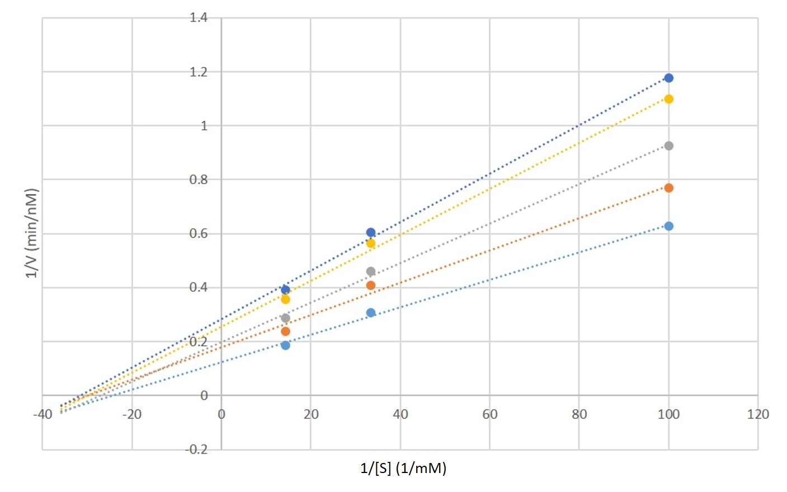
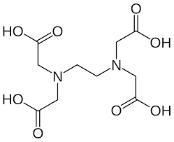
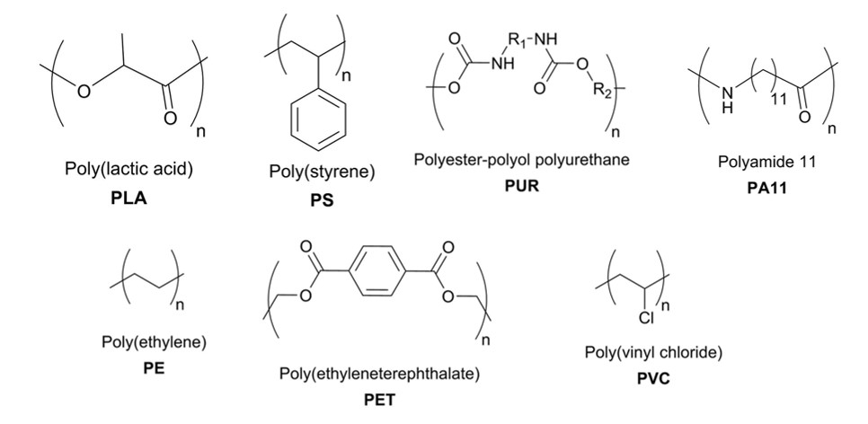
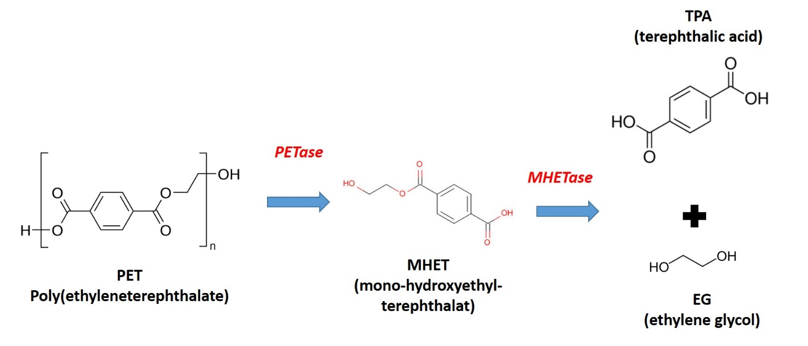
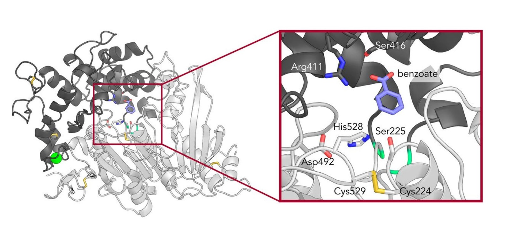
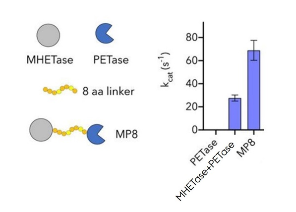

## Opgave 1. Burst phase eller ej?

Når N-acetyl-L-phenylalanine p-nitrophenyl esteren blandes med chymotrypsin, ses en burst-phase (et hurtigt omvendt-eksponentielt henfald efterfulgt af en mere rolig lineær stigning). Hvis man i stedet for en ester bruger en amid (dvs. udskifter phenol gruppen med en anilin gruppe), ses ingen burst-phase. Hvordan kan det forklares?

::: {.callout-solution}

Esteren reagerer så hurtigt med chymotrypsin, at den når at ophobe et kovalent intermediat (ved acylering) før det når at blive frigivet og starte steady-state produktion af produkt, dvs. frigivelsen er den langsomste proces og dermed flaskehalsen. Amid substratet reagerer ikke så hurtigt og man kan derfor ikke skelne mellem acylering og deacylering på samme måde.  
:::

## Opgave 2. En pind til ligkisten?

Vildtype subtilisin nedbryder de to peptider Phe-Ala-Gln-Phe (peptid A) og Phe-Ala-His-Phe (peptid B) lige hurtigt; men subtilisin mutanten His64Ala (som ellers er et meget dårligere enzym end vildtype subtilisin) kløver peptid B ca. 1000 gange hurtigere end peptid A. Hvorfor?

::: {.callout-solution}

Substratets His er placeret tilstrækkeligt godt i forhold til position 64 på subtilisin til delvist at erstatte den manglende His. Det er et eksempel på "substrate-assisted catalysis".
:::

## Opgave 3. Den mystiske inhibitor

Tabellen nedenfor angiver reaktionshastigheder for et enzym målt i nM/min for tre forskellige koncentrationer af substrat (S) og fem forskellige koncentrationer af en inhibitor (I), begge målt i mM.

+---------+---------+---------+---------+---------+---------+
| \[I\] ⇒ | 0       | 0.25    | 0.5     | 0.75    | 1       |
|         |         |         |         |         |         |
| \[S\]⇓  |         |         |         |         |         |
+:=======:+:=======:+:=======:+:=======:+:=======:+:=======:+
| 0.07    | 5.39    | 4.19    | 3.49    | 2.81    | 2.55    |
+---------+---------+---------+---------+---------+---------+
| 0.03    | 3.25    | 2.45    | 2.17    | 1.77    | 1.65    |
+---------+---------+---------+---------+---------+---------+
| 0.01    | 1.59    | 1.30    | 1.08    | 0.91    | 0.85    |
+---------+---------+---------+---------+---------+---------+

Analysér de kinetiske data via en grafisk fremstilling og angiv hvilken type inhibitor der er tale om.

::: {.callout-tip title="Hint"}
Dette er baseret på Stryer kapitel 5).
:::

::: {.callout-tip title="Python Hint"}
En Pandas dataframe kan laves ud af tabellen således 

```python
velocities = pd.DataFrame(
    [
        [5.39, 4.19, 3.49, 2.81, 2.55],
        [3.25, 2.45, 2.17, 1.77, 1.65],
        [1.59, 1.30, 1.08, 0.91, 0.85],
    ],
    index=[0.07, 0.03, 0.01],
    columns=[0.00, 0.25, 0.50, 0.75, 1.00],
)

velocities.index.name = "[S] (mM)"
velocities.columns.name = "[I] (mM)"
```
:::

::: {.callout-solution}

{width="80%" fig-align="center" .lightbox}

Skæringen med y-aksen varierer mens linjerne samles (mere eller mindre) i et punkt på den negative x-akse. Inhibitoren I er en non-kompetitiv inhibitor (variabel v~max~, uændret *K*~M~).

**Python løsning**

```{python}
#| fig-align: center
import numpy as np
import pandas as pd
import matplotlib.pyplot as plt
from scipy.optimize import curve_fit

# Definer linæer model til fitting
def linear_model(x, a, b):
    return a * x + b

# Konstruer dataframe 
velocities = pd.DataFrame(
    [
        [5.39, 4.19, 3.49, 2.81, 2.55],
        [3.25, 2.45, 2.17, 1.77, 1.65],
        [1.59, 1.30, 1.08, 0.91, 0.85],
    ],
    index=[0.07, 0.03, 0.01],
    columns=[0.00, 0.25, 0.50, 0.75, 1.00],
)

velocities.index.name = "[S] (mM)"
velocities.columns.name = "[I] (mM)"

# Udskriv dataframe så den kan checkes
print(velocities)

# Brug `.index` til at lave x-aksen (1/S)
x_data = 1 / velocities.index
x_eval = np.linspace(-40, x_data.max() + 10, 200)

# Lav figur
fig, ax = plt.subplots()

# Loop over kolonner (Sæt af 3 målinger ved en [I].)
for i, inhibitor in enumerate(velocities.columns):

    # Beregn 1/V ved at indeksere med inhibitor concentrationen
    y_data = 1 / velocities[inhibitor]

    # Plot data
    ax.plot(x_data, y_data, "o", label=f"[I] = {inhibitor:.2f} mM", color=f"C{i}")

    # Lav curve_fit og plot 
    popt, _ = curve_fit(linear_model, x_data, y_data)
    ax.plot(x_eval, linear_model(x_eval, *popt), color=f"C{i}")

ax.axhline(0, linestyle="--", color="gray")
ax.axvline(0, linestyle="--", color="gray")
ax.set_xlabel("1/[S] (1/mM)")
ax.set_ylabel("1/V (min/nM)")
ax.legend()
plt.show()
```

:::

## Opgave 4. Kan man lægge sammen?

I subtilisin medfører mutationerne Ser221Ala og His64Ala hver især en nedgang i *k*~cat~ på ca. 10^6^. Man ville derfor forvente at dobbelt-mutanten fører til en nedgang i *k*~cat~ på ca. (10^6^)^2^ = 10^12^. Eller hvad?

::: {.callout-solution}

Det ville kun være tilfældet hvis mutationerne var uafhængige af hinanden (additive snarere end synergistiske). Det er jo ikke tilfældet: "helheden er større end summen af de enkelte dele". Eftersom begge sidekæder skal bidrage for at sikre at triaden fungerer, kan man ødelægge triaden blot ved at fjerne én af sidekæderne; og man kan jo ikke slå et glas i stykker mere end én gang.
:::

## Opgave 5. Restriktionsenzymer

Restriktionsendonukleaser (RE) er temmelig sløve enzymer med en *k*~cat~ på ca. 1 s^-1^. Hvis man øgede *k*~cat~ til ca. 10^6^ s^-1^, ville de blive endnu hurtigere end methylaser.

### Vurder effekt af øget k_cat i RE

Ville det være godt eller skidt for værtscellen?

::: {.callout-solution}
Skidt! Hvis bakterierne ikke når at methylere deres DNA før RE kommer til fadet, vil deres eget DNA jo nå at blive nedbrudt før det overhovedet er transkriberet.
:::

### Forudsig effekt af ny restriktionsenzym

Hvad kunne der ske hvis et bakterium erhvervede en helt ny RE ved f.eks overførsel fra en anden bakterie art?

::: {.callout-solution}
Endnu værre. Så er der slet ingen methylase til at beskytte bakterien mod sin egen RE.
:::

## Opgave 6. Cheleringsagenter

{width="60%" fig-align="center" .lightbox}

EDTA (ethylene diamine tetra eddike syre, jf. struktur til højre) chelerer (binder kraftigt) en bestemt type molekyler. Hvilke enzymer fra Berg-Stryer's kapitel 6 ville den inhibere?

::: {.callout-solution}

Det binder divalente metal-ioner som Zn^2+^, Ca^2+^ og Mg^2+^ med meget høj affinitet (*K*~D~ ca. 10^-8^ M). Det vil derfor stjæle metal ioner fra f.eks. carbonic anhydrase, metalloproteaser, flere restriktionsenzymer og myosin.
:::

## Opgave 7. Biologisk plastik-nedbrydning

Gennem de sidste ca. 50-70 år er der sket en kolossal ophobning af syntetisk fremstillet plastik som affald i naturen. Noget af dette affald graves ned, andet brændes af. En stor del spredes dog i naturen, hvor det langsomt bliver fysisk nedbrudt til mindre partikler. Der finder meget lidt enzym-drevet nedbrydning af plastik sted. Strukturerne af de mest udbredte klasser af plastik er vist nedenunder. 

{width="90%" fig-align="center" .lightbox}

### Analyser kemiske udfordringer ved plastik-nedbrydning

Ud fra et kemisk perspektiv, hvorfor er det en udfordring for enzymer at nedbryde disse stoffer? Hvilke stofgrupper må forventes at være hhv. sværest og lettest at nedbryde og hvorfor?

Der er ikke desto mindre identificeret forskellige enzymer der (om end langsomt) nedbryder forskellige typer plastik. Nogle af disse produceres af mikroorganismer der vokser på en losseplads for primært PET-plastik. Et enzym (PETase) nedbryder PET til MHET, mens et andet enzym (en MHETase) nedbryder MHET til PTA og EG (se reaktionsskema nedenfor).

{width="90%" fig-align="center" .lightbox}

Strukturen af MHETase løses i nærvær af stoffet benzoat (se nedenfor).

{width="90%" fig-align="center" .lightbox}

Det aktive site i MHETase virker ligesom flere proteaser mm. gennem en såkaldt katalytisk triade bestående af en histidin-, en aspartat- og en serin-rest. Skriv et kort script, der henter MHETase (PDB-ID: 6QGA) og PETase (PDB-ID: 5XH3) og fjerner overskydende versioner af proteinerne. Align de to strukturer med super.

::: {.callout-solution}
Plastik repræsenterer nye former for makromolekyler som ikke har eksisteret før. Derfor har der heller ikke været evolutionært behov for at udvikle enzymer til at nedbryde dem. Enzymer skal typisk have en funktionel gruppe at angribe, f.eks. via hydrolyse. De tre grupper PE, PVC og PS mangler helt sådanne angrebspunkter og må derfor være sværest at nedbryde. De andre repræsenterer funktionelle grupper som estre (PLA, PA11 og PET) og amider (PUR) som skulle kunne give et vist udgangspunkt men det er jo langtfra naturlige substrater.
:::

### Sammenlign MHETase og PETase i PyMOL

{width="90%" fig-align="center" .lightbox}

Beskriv forskellen mellem de to strukturer, find det aktive site og kom med et bud på, hvorfor MHETasen har et domæne som PETasen ikke har, når det oplyses at MHETasen har en meget lav *k*~cat~.

Man fremstiller nu et hybridenzym bestående af en MHETase og en PETase forbundet med en 8-aminosyrerest linker. Dets evne til at danne TPA udfra PET måles og sammenlignes med (1) PETasen alene og (2) PETasen sammen med MHETasen (i forholdet 1:1). Det giver følgende resultat:

::: {.callout-solution}
MHETasen har et domæne, der fungerer som et slags låg, der omkapsler det aktive site og dermed substratet. PETasen arbejder med uopløseligt materiale så det skal ikke indkapsles. Derimod er MHET lille og skal tilbageholdes i det aktive site eftersom den langsomme reaktionsrate gør MHET tilbøjelig til at diffundere væk før det når at blive nedbrudt.
:::

### Forklar hybridenzymets aktivitetsniveauer

Forklar de tre enzymers forskellige aktivitetsniveauer.

::: {.callout-solution}
PETasen er "død" da den danner MHET, ikke TPA. Hybridenzymet virker bedre end at have MHETase og PETase til stede hver for sig, fordi der er tale om koblede nedbrydningsveje (PTA $\Rightarrow$ MHET $\Rightarrow$ TPA) så man øger den effektive koncentration af MHETase ved at have det tæt på stedet, hvor MHET dannes af PETasen.
:::

## Opgave 8. Find den katalytiske triade (PyMOL API, OPTIONAL)

***PyMOL-scripting opgave**: I denne opgave skal I bruge den viden I har fået i sidste uges TØ og video 6 om PyMOL API. OBS: Denne opgave er svær og det forventes ikke at alle kommer i mål. Det er en rigtigt god ide at alliere sig med nogle studiekammerater, som man kan løse den sammen med.*

Denne opgave går ud på at skrive en python-udvidelse af PyMOL, der finder potentielle katalytiske triader bestående af en aspartat, i en selektion. Test den på MHETase fra opgave 7. Nedenfor er anført en foreslået fremgangsmåde, der baserer sig udelukkende på afstande mellem aminosyrerne.

- Lav lister over alle asp, ser og his-rester i en selektion.

- Definér en maximal distance som de tre rester i en katalytisk triade maximalt forventes at have (7 Å viser sig at være et godt bud).

- Brug `cmd.get_distance` -kommandoen til at finde afstanden mellem alle par af Asp og His og tilføj deres numre til en liste, hvis afstanden er under den definerede tærskelværdi, således, at der fås en liste med lister af længden 2 indeholdende nummeret (resi) på en Asp og en His, der er mindre end tærskelværdien fra hinanden.

- Undersøg distancen fra hver af parrene til hver Ser. Tilføj denne til listen med det tilsvarende Asp-His-par, hvis denne også er under tærskelværdien.

- Returner alle underlister, der har længden 3.

Test jeres udvidelse på nogle strukturer I ved indeholde en katalytisk triade bestående af en aspartat, en serin og en histidin (F.eks. MHETase (PDB-ID: `6QGA`) eller subtilisin (PDB-ID:  `1SUB`)).

::: {.callout-note title="Dybdegående guide"}
PyMOL er, som du sikkert ved, et python-baseret program og derfor er det ikke overraskende, at der eksisterer en indbygget [API](https://da.wikipedia.org/wiki/Application_programming_interface) (Application Programming Interface) i PyMOL til Python. Dette gør, at man kan skrive avancerede udvidelser af PyMOL, der benytter sig af alle Pythons funktioner. Man kan køre en python-fil fra PyMOL ved at sørge for at have python-filen i *working directory.* F.eks. kan filen `python_fil.py`, der ligger i mappen `slangefiler` køres ved først at skifte directory med kommandoen: `cd users\jens_jensen\slangefiler\` og dernæst skrive: run python_fil.py i PyMOLs kommandolinje. Nedenfor er en step-by-step guide, der kan hjælpe dig igennem opgaven.
:::

### Opret Python-fil til PyMOL-udvidelse

Opret en ny python fil (`.py`), som du kan skrive i.

### Importér PyMOL API i Python

Import PyMOL-APIen til Python: `from pymol import cmd`

### Definer ny PyMOL-kommando

Lav en ny kommando til PyMOL ved hjælp af `@cmd.extend` efterfulgt af en definering af en funktion på efterfølgende linjer: 

```python
@cmd.extend
def min_pymol_funktion(selection='all'): 
```

Her indstilles ét argument (en parameter), som funktionen kaldes med, ved navn "selection". DEFAULT-argumentet indstilles ved at sætte argumentet lig en streng -- i dette tilfælde "all". Ideen er, at hvis man [ikke skriver en selektion efter kommandoen]{.underline} vil den blot lede gennem alle aminosyrer i strukturen, fordi det udeladte argument betragtes som "all".

### Opret space-dictionary i PyMOL

Som det første i funktionen bør der laves et såkaldt "space", hvor PyMOL kan tilgå data fra programmet. I praksis er dette blot et dictionary/et bibliotek. Heri kan oprettes lister, f.eks.: 

```python
my_space={'asp_list':[], 'his_list':[]} 
```

Mange af PyMOLs API funktioner kan direkte tilgå disse dictionaries, som det også ses nedenfor.

### Brug iterate til at liste aminosyrer

For at gå gennem atomer i strukturen kan PyMOL-kommandoen [iterate](https://pymolwiki.org/index.php/Iterate) benyttes. Denne kaldes i python ved at skrive: `cmd.iterate()`. Iterate funktionen itererer gennem alle atomer i strukturen og kører dernæst en kommando for alle de atomer, der er indeholdt i en selektion, som er første argument i funktionskaldet. I dette tilfælde vil vi gerne have numrene på alle Asp, His og Ser-rester **i selektionen** (`"...({})".format(selection)`), men kun én gang pr. aminosyrerest, hvorfor vi kun kigger på carbon-alpha (name CA): 

```python
cmd.iterate("resn Asp and name CA and ({})".format(selection), 
            "asp_list.append(resi)", 
            space=my_space)
```

Læg mærke til, at kommandoer fra APIen ofte kræver strenge svarende til, hvad man ville skrive i PyMOLs kommandolinje som argumenter. Dette gør pythons indbyggede .format funktion særdeles brugbar, da den tillader at indsætte variable i strenge. space viser, hvor `asp_list` findes, nemlig i vores dictionary/space.

### Find katalytiske triader med afstandsberegning

Nu skal vi finde de trioer, der er tæt nok på hinanden til potentielt at være en katalytisk triade. Fordi vi er i Python kan vi benytte et ganske almindeligt for-loop til at iterere gennem de relevante lister. Herefter kan [cmd.get_distance(...)](https://pymolwiki.org/index.php/Get_Distance) benyttes til at finde afstanden mellem to atomer i spidsen af aminosyreresterne (husk, at du kan indsætte i strenge med .format). Hvis get_distance(..) giver en distance (i Ångstrøm), der er under en tærskelværdi, tilføjes nummeret til en ny liste. Til sidst kan alle potentielle tripletter af aminosyrer returneres.

::: {.callout-solution}

Eksempelløsning. Jeres ligner måske ikke helt.

```python

```

Kan bruges i et PyMOL script f.eks.

```default

```

Outputtet fra dette er 

```default
PyMOL>fetch 6QGA
TITLE     Crystal structure of Ideonella sakaiensis MHETase bound to the non-hydrolyzable ligand MHETA
 ExecutiveLoad-Detail: Detected mmCIF
 CmdLoad: "./6qga.cif" loaded as "6QGA".
PyMOL>run catalytic_traides.py
PyMOL>SP_catalytic_triad_finder chain A
[['492', '528', '225']]
```

:::
