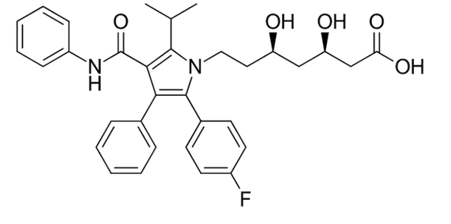
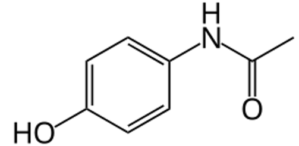
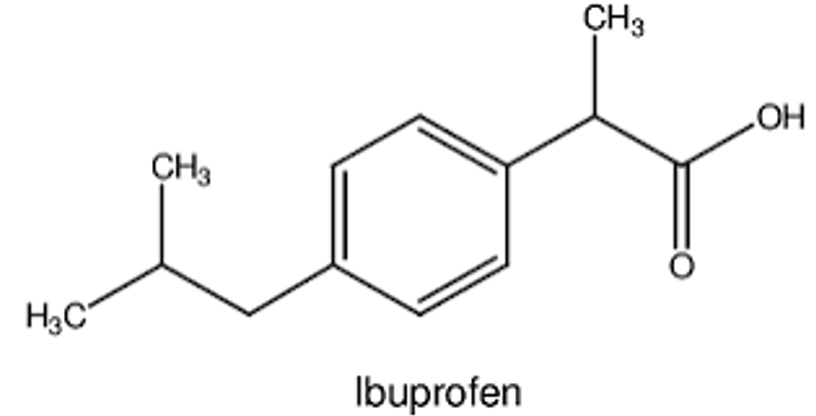
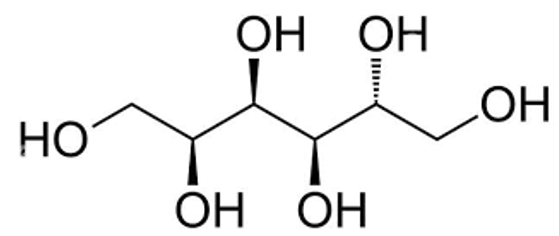
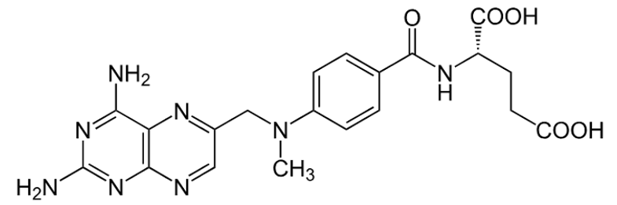
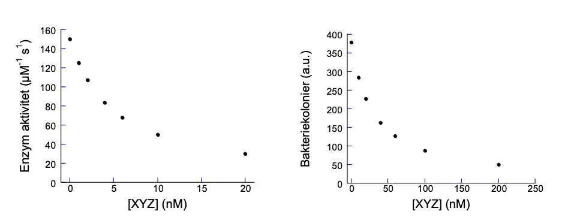



## Opgave 1. 

Udfra Berg 10, figur 32.3, foreslå en strategi til at udvikle et antibiotikum der
virker på et tidligere stadium i cellevægssyntesen end penicillin og
diskutér hvor godt den måtte virke.

::: {.callout-solution}
Penicillin hæmmer transpeptidasen der kobler D-Ala til den
voksende cellevæg. Hvis man inhiberer syntesen af D-Ala, fjerner man
substratet for cellevægsdannelse. Enzymet alanine racemase laver D-Ala
fra L-Ala og dens inhibering (ved cycloserin) bruges som antibiotika
("second line of defence") mod tuberkulose.
:::

## Opgave 2. 

For følgende 5 stoffer angives log(P). Bestem om de overholder Lipinski's regler.

  -------------------------------------------------------------------------------------------------------------------------------
  Navn            Struktur                                                                Log    Mwt   \#          \#
                                                                                          (P)          H-donorer   H-acceptorer
  --------------- ----------------------------------------------------------------------- ------ ----- ----------- --------------
  Atorvastatin    {width="100%"}                        4.1    558   4           6
  (4.1)                                                                              

  Acetaminophen   {width="50%"}                         0.5    151   2           2
  (0.5)                                                                               

  Ibuprofen (3.5) {width="80%"}                         3.5    206   1           2

  Sorbitol (-3.1) {width="60%"}                         -3.1   182   6           6

  Methotrexate    {width="100%"}                        -1.8   454   5           12
  (-1.8)                                  
  -------------------------------------------------------------------------------------------------------------------------------

::: {.callout-solution}
Lipinski: log(P) \<5, mwt \< 500 Da, \# H-donors \< 5, \#
H-acceptors \< 10. Kun acetacetaminophen og ibuprofen overholder dette.
:::

## Opgave 3. 

Stoffet XYZ hæmmer et bakteriums DNA polymerase. Vi tester XYZ's
molekylære effektivitet ved at måle enzymets aktivitet ved forskellige
XYZ-koncentrationer og en DNA-koncentration svarende til substratets
K~M~. Desuden beregner vi dets biologiske effektivitet ved at måle hvor
mange bakteriekolonier dannes ved forskellige XYZ-koncentrationer.

1.  Beregn XYZ's K~I~ værdi overfor proteasen og dens IC~50~ overfor
    bakterien udfra følgende tabel.

2.  Kommenter forskellen mellem de to værdier.

3.  Rotter behandles med en dosis på 30 mg/kg, hvilket giver en
    XYZ-koncentration på ca. 0.5 µM. Forventes det at være en effektiv
    koncentration?

+-------------+-------------+---------+--------------+
| \[XYZ\](nM) | Enzym       | \[XYZ\] | Antal        |
|             | aktivitet   |         | kolonier     |
|             |             | (nM)    |              |
|             | (µM^-1^     |         | (relative    |
|             | s^-1^)      |         | enheder)     |
+:===========:+:===========:+:=======:+:============:+
| 0           | 150.00      | 0       | 379.00       |
+-------------+-------------+---------+--------------+
| 1           | 125.00      | 10      | 284.25       |
+-------------+-------------+---------+--------------+
| 2           | 107.14      | 20      | 227.40       |
+-------------+-------------+---------+--------------+
| 4           | 83.333      | 40      | 162.43       |
+-------------+-------------+---------+--------------+
| 6           | 68.182      | 60      | 126.33       |
+-------------+-------------+---------+--------------+
| 10          | 50.000      | 100     | 87.462       |
+-------------+-------------+---------+--------------+
| 20          | 30.000      | 200     | 49.435       |
+-------------+-------------+---------+--------------+

::: {.callout-solution}
1.  Det gælder at IC~50~=K~I~\*(1+\[S\]/K~M~). Da \[S\] = K~M~ ⬄ K~I~ =
    IC~50~/2. For enzym aktiviteten, aflæses IC~50~ fra grafen til at
    være omkring en aktivitet på 75 enheder, altså ca. 5 nM, hvilket
    giver K~I~ = 2.5 nM. For bakteriehæmningen, aflæses IC~50~ (værdien
    omkring 190 a.u. kolonier; a.u. = arbitrary units) til omkring 30
    nM, altså 6 gange højere end den rene enzym aktivitet.\
    {width="100%"}

2.  En højere IC~50~ værdi er forventelig i et levende system da XYZ kan
    binde til andre biomolekyler end polymerasen.

3.  Ja, 500 nM er ca. 13 gange IC~50~ så det skulle holde bakterierne
    nede effektivt.
:::

## Opgave 4. 

Du undersøger et antal forskellige stoffer for deres evne til at hæmme
et bestemt enzyms nedbrydning af et bestemt substrat for hvilket K~M~ =
76 nM. I første omgang har du masser af substrat og kører derfor dine
assays ved 1 µM substrat, hvilket giver et bestemt sæt IC~50~ værdier.
For at validere dine resultater, vil du gentage dine forsøg men bliver
nødt til at begrænse dig til 100 nM da du ikke har meget substrat
tilbage. Til din ærgrelse finder du at det nye sæt IC~50~ værdier er ca.
6 gange lavere. Har du grund til at være vred?

::: {.callout-solution}
Nej! Eftersom IC~50~=K~I~\*(1+\[S\]/K~M~), gælder at ved hhv. 1000
og 100 nM substrat er IC~50~/K~I~ hhv. 14.1 og 2.3, dvs. det er en
simpel konsekvens af Cheng-Prusoff ligningen.
:::

## Opgave 5. 

Denne opgave fokuserer på effekten af PEGylering på halveringstiden af
et rekombinant protein

En medicinalvirksomhed er ved at udvikle et rekombinant terapeutisk
protein. Det umodificerede protein fjernes hurtigt fra blodbanen.
Forskerne kobler derfor kæder af **polyethylenglycol (PEG)** kovalent
til proteinet for at øge dets cirkulerende halveringstid. Følgende data
blev opnået for forskellige varianter af proteinet:

  --------------------------------------------------------------------
  **Protein**   **Antal      **Molekylmasse af hver  **Halveringstid
                PEGkæder**   PEG-kæde (kDa)**        (timer)**
  ------------- ------------ ----------------------- -----------------
  A             0            --                      3,7

  B             1            10                      8,3

  C             1            20                      15,6

  D             1            40                      29,8

  E             2            10                      13,9

  F             2            20                      27,4
  --------------------------------------------------------------------

Antag, at eliminationen af proteinet følger **førsteordenskinetik**.

1.  Med hvilken faktor øges proteinets halveringstid, når der kobles én
    20-kDa PEG-kæde til proteinet sammenlignet med det umodificerede
    protein?

2.  Sammenlign proteinerne B, C og D. Hvilken sammenhæng antyder dataene
    mellem PEG-kædens længde og proteinets halveringstid?

3.  Sammenlign proteinerne B og E. Hvilken effekt har det på
    halveringstiden at øge antallet af 10-kDa PEG-kæder fra én til to?

4.  Umiddelbart efter injektion er plasmakoncentrationen af protein A
    **76 µg/mL**. Beregn plasmakoncentrationen efter **12 timer**.

5.  Protein F administreres med den samme initiale plasmakoncentration
    på **76 µg/mL**. Beregn plasmakoncentrationen efter **24 timer**.

6.  Der kræves en plasmakoncentration på mindst **9,5 µg/mL** for at
    opnå en terapeutisk effekt. Hvor længe vil henholdsvis protein A og
    protein F have en plasmakoncentration på mindst 9,5 µg/mL?

7.  Forklar kort, hvorfor PEGylering kan øge den cirkulerende
    halveringstid af et rekombinant protein.

::: {.callout-solution}
> Det vides at $C_{t} = C_{0}(½)^{\frac{t}{t_{½}}}$ hvor *C* er
> koncentration og *t* er tiden.

1.  PEGylering med én 20-kDa PEG-kæde øger halveringstiden med cirka 4,2
    gange.

2.  Halveringstiden stiger, når PEG-kædens størrelse øges. Sammenhængen
    er omtrent proportional med kædestørrelsen. Større PEG-kæder øger
    proteinets hydrodynamiske størrelse og dermed reducerer clearance,
    blandt andet via nyrerne.

3.  To PEG-kæder giver en cirka 1,7 gange længere halveringstid end én
    PEG-kæde af samme størrelse. Det er værd at bemærke, at
    halveringstiden ikke fordobles. Effekten af PEGylering behøver
    derfor ikke være lineær.

4.  For protein A er plasmakoncentrationen efter 12 timer cirka 8,0
    µg/mL.

5.  For protein F er plasmakoncentrationen efter 24 timer cirka 41,4
    µg/mL.\
    \
    Det illustrerer tydeligt effekten af PEGyleringen: selv efter et
    døgn er mere end halvdelen af den oprindelige koncentration af
    protein F tilbage.

6.  Den terapeutiske minimumskoncentration er 9,5 µg/mL.
    Startkoncentrationen er 76 µg/mL. Der skal altså gå præcis tre
    halveringstider, før koncentrationen falder til 9,5 µg/mL.\
    \
    Protein A ligger derfor på eller over den terapeutiske koncentration
    i cirka 11,1 timer, mens Protein F ligger derfor på eller over den
    terapeutiske koncentration i cirka 82,2 timer, svarende til cirka
    3,4 døgn.

7.  PEGylering kan forlænge et proteins halveringstid af flere årsager.
    PEG-kæderne øger proteinets hydrodynamiske størrelse, hvilket kan
    mindske filtration og udskillelse gennem nyrerne. PEG kan samtidig
    delvist beskytte proteinets overflade mod proteolytiske enzymer og
    mod andre mekanismer, der bidrager til clearance. Resultatet er, at
    proteinet fjernes langsommere fra blodbanen, og dets cirkulerende
    halveringstid bliver længere. En vigtig farmakologisk konsekvens er,
    at et PEGyleret protein potentielt kan doseres sjældnere, samtidig
    med at den terapeutiske plasmakoncentration opretholdes i længere
    tid.
:::
