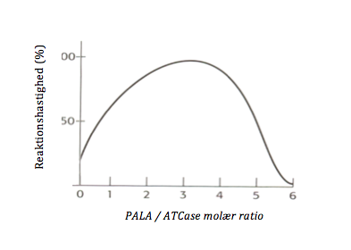
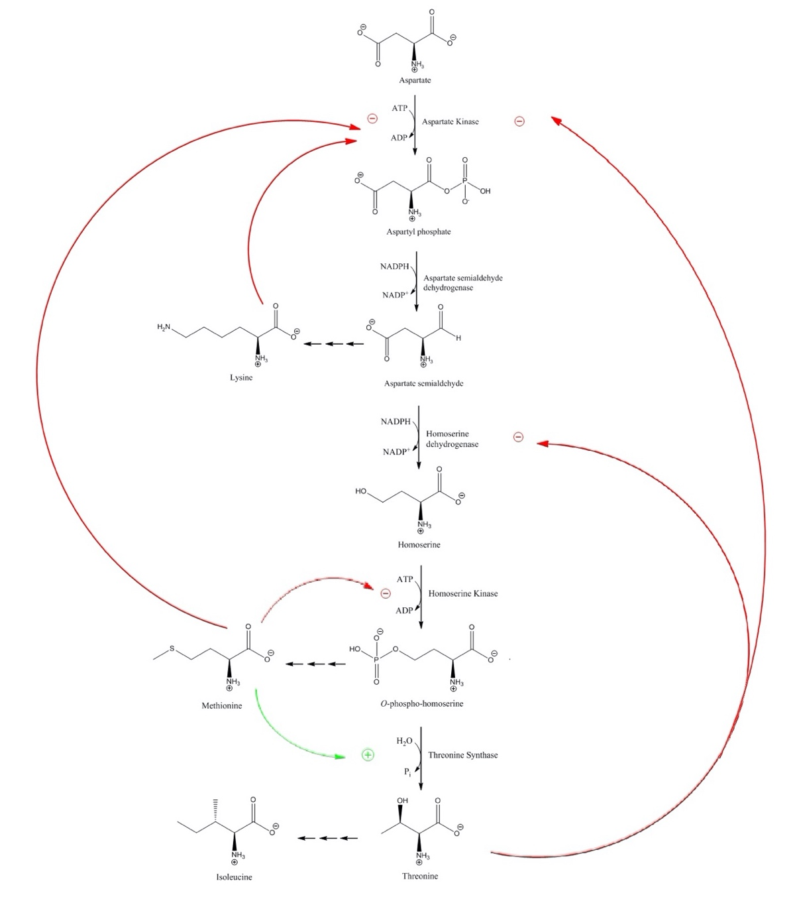
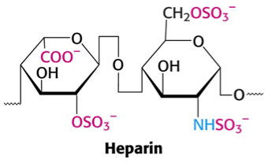
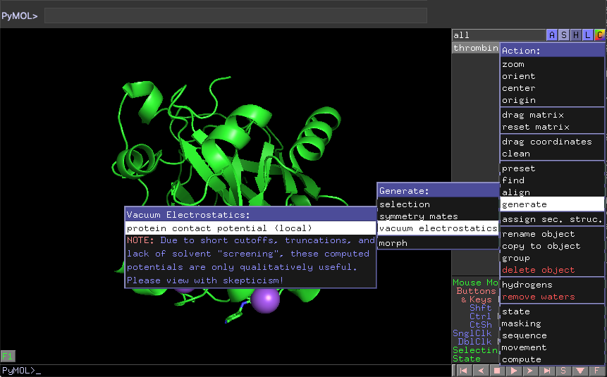
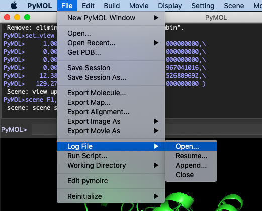
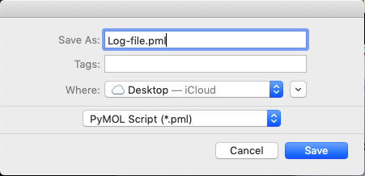
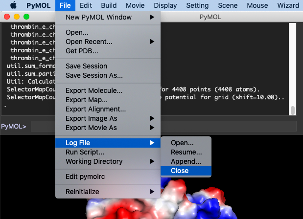
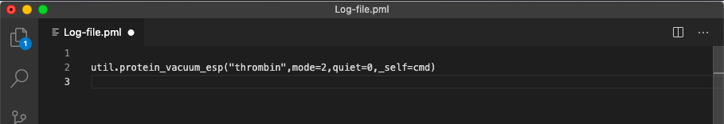
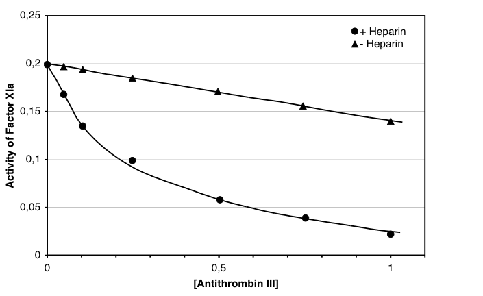

## Opgave 1. LDH-isozymer

Søg efter "LDH human" på [**www.uniprot.org**](http://www.uniprot.org).

Undersøg de relevante resultater. Se under overskriften "Sequences" og følg evt. link til Ensembl eller GeneID under overskriften "Genome Annotation Databases"

1.  Hvor mange isoformer findes for LDH i menneske?

I Stryer betegnes to former af LDH som henholdsvis H og M form.

2.  Hvordan betegnes disse to varianter i Uniprot?

3.  På hvilke kromosomer finder man generne for de to former?

4.  Hvor mange splejsningsvarianter kendes for LDH-M?

Officielt svar

1.  Der findes 3 isozymer af LDH i mennesker (A chain, B chain or C chain).

2.  "A chain" er muskelformen (M), hvilket ses under "Names and taxonomy`, `Protein names" mens "B chain" er hjerteformen (H). "C chain" er en speciel form i testes (LDH-X).

3.  Genet for LDH-M ("A chain") findes på kromosom 11 (står under "Names and taxonomy"), mens genet for LDH-H ("B chain") findes på kromosom 12.

4.  LDH-M ("A chain") udviser 5 splejsningsvarianter (`isoform 1`\...`isoform 5`). 

## Opgave 2. Aspartat

Aspartat er substrat for enzymet, aspartat transcarbamoylase (ATCase), og enzymet kan inhiberes ved tilsætning af phosphonacetyl-L-aspartat (PALA; K~i~ = 10 nM).

1.  Hvilken type inhibering udøver PALA? Er PALA en svag, medium eller stærk inhibitor?

Stimulering af ATCase-aktiviteten kan observeres under visse eksperimentelle betingelser, som vist nedenfor.\
\
{width="4.092971347331583in" height="2.341176727909011in"}

2.  Beskriv kurven og forklar hvad der foregår.

En *E. coli*-mutant indeholdende en enzymdefekt relevant for biosyntesen af threonin, isoleucin og methionin kan kun gro hvis vækstmediet suppleres med de tre aminosyrer. Selv under disse betingelse er væksten reduceret, hvilket formodentlig skyldes akkumulering af et mellemprodukt. Hvis man derimod tilsætter uracil, ses en normal vækstrate. (Hint: Læs om homoserine dehydrogenase på wikipedia)

3.  Hvilken anden pathway kunne være influeret af mutationen og hvorfor? Hint: Kig på reaktionspathwayen for threonin, isoleucin og methionin.

Officielt svar

1.  PALA er en bisubstrat analog og bør derfor inhibere [kompetitivt]{.underline}. 10 nM er en stærk binding, så PALA er en stærk inhibitor.

2.  ATCase er et multisubunit-enzym, der udviser kooperativ substratbinding. Derfor vil tilsætning af PALA i først omgang stimulere enzymets aktivitet (op til 3 per ATCase, med 6 aktive sites), da det binder til nogle aktive sites og dermed aktiverer de andre (T-R transition). Men ved højere koncentrationer bliver effekten af inhiberingen tydelig, da de aktive sites efterhånden bliver besat med PALA og ikke kan fungere.

3.  Pathway ses nedenfor. Trinnet der er blokeret i mutanten er trin C (enzymet hedder homoserine dehydrogenase). Dette medfører at aspartate semialdehyde (ASA) ophobes fordi dannelsen af lysin ikke kan aftage alt det ASA der produceres. Den overskydende ASA, ligner Asp og inhiberer derfor ATCase. ATCase varetager det første (`committede`) reaktionstrin på vej til uracil, der er precursor for både UTP og CTP. Når der tilsættes uracil til vækstmediet er ATCase reaktionen unødvendig og væksten normal.

{width="5.444444444444445in" height="6.154589895013124in"}

Stryer s. 314 (Fig. 10.8) viser det aktive site af ATCase. En lysin sidekæde (Lys-84) koordinerer carboxylsyregruppen i substratet (Asp). Hvis substratanalogen ASA er bundet vil aldehyden danne en Schiff's base med Lys-84 og dermed inaktivere enzymet irreversibelt gennem kovalent modifikation. 

## Opgave 3. ATCase

ATCase er et eksempel på et vigtigt allosterisk reguleret enzym. Åben filen ATCase.pml, der findes i mappen for denne uge i Brightspace. Knapperne T_trimer1, T_trimer2, T_dimer1, T_dimer2, and T_dimer3 kan bruges til at tænde og slukke for enkelte subunits i T-tilstanden (F1). Tryk på F2 for at skifte til R-tilstanden. F3 og F4 er side-views af hver tilstand. F5 og F6 viser backbone i T- og R-tilstanden. F7 er et overlay af T- og R-trimer backbone.

1.  Beskriv de strukturelle ændringer, der finder sted i ATCase når enzymet skifter mellem T- og R-tilstanden.

2.  T-tilstanden er bundet til ATP i denne struktur, mens R-tilstanden binder N-(phosphonacetyl)-L-aspartate (PALA). Hvilken type subunit binder ATP hhv. PALA til?

3.  Hvorfor har PALA været specielt nyttig i forhold til at forstå ATCases egenskaber?

4.  Forklar hvordan PALA kan fungere både som en aktivator og en inbitor af ATCase.

Officielt svar

1.  De katalytiske subunits roterer i forhold til hinanden og skilles ad i R-tilstanden i forhold til T-tilstanden.

2.  PALA binder til de katalytiske trimerer mens ATP binder til de regulatoriske dimerer.

3.  PALA er et bisubstrat samt transition state analog, har illustreret de konformationelle ændringer, der finder sted.

4.  PALA promoverer T til R transitionen og fungerer dermed som en aktivator af enzymet. Men PALA er også en transition state-analog, der inhiberer enzymet.

## Opgave 4. Thrombin og Antithrombin (PyMOL)

***PyMOL-opgave**: I denne opgave vil i blive introduceret for analyse af elektrostatiske overflader. I vil også få beskrevet hvordan man laver en log-file og bruger den til at bestemme kommandoer.*

Selv om thrombin har mange egenskaber til fælles med trypsin, så er omdannelsen af prothrombin til thrombin ikke autokatalytisk som set for aktiveringen af trypsin. Både thrombin og trypsin er serinproteaser, der er i stand til at kløve peptidbindingen på carboxylsiden af arginin. Thrombin er dog specifik for Arg-Gly bindinger. 

1.  Hvorfor er aktiveringen af prothrombin til thrombin ikke autokatalytisk. 

2.  Beskriv ligheder og forskelle mellem den måde de to enzymer genkender deres substrat på. 

Heparin er en højt sulfateret glycosaminoglycan polymer, der bnder til mange af proteinerne i koagulationskaskaden og påvirker aktiviteten af serpiner som antithrombin. Det bruges indenfor lægevidenskaben til at behandle bl.a. thrombose (dannelse af blodklumper i blodet) og som et additiv til donorblod, for at modvirke koagulation under oplagring. Den kemiske struktur af en heparinenhed er vist nedenfor. 

{width="3.0987653105861765in" height="1.8850174978127734in"} 

3.  Hvilken gruppe af stoffer tilhører heparin og hvilke funktionelle grupper indeholder det? 

4.  Hvilken type af sidekæder vil du forvente at heparin binder til. 

***PyMOL-info**: Vi skal nu visualisere den elektrostatiske overflade. Når man bruge PyMOL-interface tastes; A\>generate\>vacuum electrostatics\>protein contact potential (local). Se figuren forneden.*{width="6.383720472440945in" height="3.9663101487314085in"}\
\
*Men vi vil ikke bare gøre det i vores PyMOL session. Vi vil have det ind i vores script.*\
*Når man skal bestemme kommandoen for en mere kompliceret funktion vil det ofte være smart åbne en logfil. Det gør man som illustreret for neden ved at gå ind på undermenuen `File`, derefter på `Log File` og til sidst "Open\...". Så gemmer du det under det ønskede navn, f.eks. `Log-file.pml`.*

{width="3.0187193788276465in" height="2.4394575678040247in"}{width="3.2905610236220473in" height="1.590559930008749in"}

*Herefter bruger du A\>generate\>vacuum electrostatics\>protein contact potential (local) igen. Herefter går du ind og lukker logfilen som du ser i figuren forneden.*

{width="6.268055555555556in" height="4.5368055555555555in"}

*Herefter vil du kunne gå ind på log-filen og se kommandoen for den aktion du lige har udført. Denne kan bruges i dit script.*

{width="6.268055555555556in" height="1.0756944444444445in"}

*Positionen af den elektrostatiske overflade beregnes ligesom den vand-tilgængelige overflade og så farves den efter elektrostatisk potentiale. Potentialet beregnes som den tiltrækning (blå) eller frastødning (rød) en negativ punktladning vil opleve hvis den blev placeret på overfladen af proteinet. Beregningen foretages for neutralt pH. *

5.  Lav en scene, kaldet F1, som henter thrombin (PDB-ID: 3UTU). Lav så en scene, kaldet F2, som viser den elektrostatiske overflade af thrombin.\
    Foreslå et bindingsite for heparin på overfladen af thrombin.

Strukturen af thrombin i kompleks med inhibitor og et heparin fragment findes i PDB-ID: 1XMN.

6.  Lav en scene, kaldet F3, som viser heparins binding til thrombin (PDB-ID: 3UTU). Hint: Brug align og util.protein_vacuum_esp.\
    Stemmer heparins placering overens med det forventede bindingsite?

Officielt svar

\## Script til opgave 4. Thrombin og Antithrombin

reinit

fetch 3UTU, thrombin, async=0

remove solvent

set_view (\\

1.000000000, 0.000000000, 0.000000000,\\

0.000000000, 1.000000000, 0.000000000,\\

0.000000000, 0.000000000, 1.000000000,\\

0.000000000, 0.000000000, -163.967041016,\\

12.382848740, 0.178199768, 19.526809692,\\

129.272857666, 198.661224365, -20.000000000 )

scene F1, store

util.protein_vacuum_esp("thrombin",mode=2,quiet=0,\_self=cmd)

set_view (\\

0.618123710, -0.153644055, 0.770920455,\\

0.182375133, 0.981983602, 0.049481500,\\

-0.764633000, 0.110009596, 0.635006607,\\

0.000000000, 0.000000000, -201.971298218,\\

11.401651382, -1.835929394, 17.501125336,\\

159.235702515, 244.706893921, -20.000000000 )

scene F2, store

scene F2, recall

fetch 1XMN, thrombin2, async=0

remove solvent

remove resn GOL

align thrombin2, thrombin

hide everything, thrombin2 and NOT chain K

set_view (\\

0.548760533, -0.415301085, 0.725523591,\\

0.216171071, 0.908849418, 0.356734544,\\

-0.807545424, -0.038925108, 0.588519335,\\

-0.000010689, -0.000001758, -180.763671875,\\

13.773804665, -1.003994942, 25.507266998,\\

114.567161560, 246.960494995, -20.000000000 )

scene F3, store

1.  Thrombin kløver mellem Arg og Gly og aktivering af prothrombin kræver spaltning af to peptidbindinger, mellem Arg-Thr og Arg-Ile.

2.  Mindre plads i aktivt site, brug for fleksibilitet fra Gly eller S1' site specifikt for Gly.

3.  Heparin er en negativt ladet polysaccharid eller glycosaminoglycan med funktionelle O-SO~3~^-^ grupper. Fungerer som en antikoagulant ved at stabilisere serpin-protease-interaktionen.

4.  På grund af heparins mange negative ladninger binder det til basiske (positivt ladede) aminosyresidekæder i proteiner. Hexose ringen har en hydrophob flade som kan vekselvirke med hydrophobe sidekæder. Sekvensmotivet XBBXBX-motiv, hvor B er en basisk og X en hydrofob eller uladet aminosyre, ses derfor ofte at være heparin bindende.

5.  Et sammenhængende blåt område vil sandsynligvis binde heparin da de negative ladninger på heparin vil vekselvirke favorabelt med den positivt ladede overflade.

6.  Ja

## Opgave 5. Antithrombin 

En anden faktor, der deltager i koagulationskaskaden er factor XIa. Som andre proteaser i blodet reguleres factor XIa af en inhibitor, antithrombin III, der er medlem af familien af serineproteaseinhibitorer (serpiner). 

1.  Hvorfor har kroppen brug for en inhibitor som antithrombin? \
     

Figuren nedenfor viser resultaterne fra et eksperiment, hvor effekten af antithrombin III på factor XIa's proteolytiske funktion blev målt, med og uden heparin tilstede. 

{width="4.897222222222222in" height="3.0in"} 

*Effekten af antithrombin III (x-aksen, µM) på factor XIa's proteolytiske aktivitet (ved 8 nM) er angivet langs y-aksen i arbitrære enheder under tilstedeværelse samt uden heparin (0.28 µM).* 

2.  Hvordan  påvirker heparin serpinens aktivitet ? 

Mange af faktorerne i koagulationskaskaden har samme foldning. Det gælder for thrombin og factor XIa. Strukturen af et kompleks mellem antithrombin, Thrombin og en heparin-analog findes i PDB-ID: 1TB6.

3.  Fortsæt scriptet fra opgave 4. Lav en scene, kaldet F4, som nedhenter komplekset og viser antithrombin og thrombin i forskellige farver. Lav så en scene, kaldet F5, som viser heparins binding til antithrombin/thrombin-kompleksets overflade.\
    Forklarer denne struktur effekten af heparin?

Strukturen af factor XIa findes i PDB-ID: 3SOR. Lav en overlejring af 3SOR på thrombin i 1TB6.

4.  Lav en scene, kaldet F6, der viser XIa's interaktion med heparin.\
    Vil man forvente at heparin binder på samme måde til Factor XIa som til thrombin?

**Officielt svar** 

1.  Kræves for at stoppe størkningsprocessen af blod igen. Se Stryer s. 328-331.

2.  Heparin har en kraftig positiv effekt på den grad, hvormed antithrombin III er i stand til at inaktivere faktor XIa. 

3.  Ja, det gør den. Vi kan se at heparin analogen krydsbinder thrombin og antithrombin. Virkeligheden er dog lidt mere kompleks idet man også ved at heparinbinding til antithrombin inducerer konformationsændringer i antithrombin.

4.  Ikke umiddelbart da ladningsfordelingen på overfladen af faktor XIa er anderledes end på overfladen af thrombin. Vi kan dog se at der er andre mulige bindingssteder for heparin på overfladen af faktor XIa og man kan derfor forvente at heparin også kan krydsbinde de to komponenter.

\## Script til opgave 5. Antithrombin

fetch 1TB6, thrombin_antithrombin_complex, async=0

create heparin, /thrombin_antithrombin_complex/E

hide everything

show cartoon, /thrombin_antithrombin_complex/A+B+C

show sticks, heparin

color cyan, /thrombin_antithrombin_complex/A+B

color magenta, /thrombin_antithrombin_complex/C

util.cbaw heparin

set_view (\\

-0.204501018, 0.901179492, 0.382169366,\\

-0.261317968, 0.325990826, -0.908538342,\\

-0.943340302, -0.285664320, 0.168829113,\\

-0.000009358, -0.000028342, -322.122192383,\\

44.415428162, 13.843706131, 13.705366135,\\

244.209625244, 400.034790039, -20.000000000 )

scene F4, store

util.protein_vacuum_esp("thrombin_antithrombin_complex",mode=2,quiet=0,\_self=cmd)

set_view (\\

-0.204501018, 0.901179492, 0.382169366,\\

-0.261317968, 0.325990826, -0.908538342,\\

-0.943340302, -0.285664320, 0.168829113,\\

-0.000009358, -0.000028342, -322.122192383,\\

44.415428162, 13.843706131, 13.705366135,\\

244.209625244, 400.034790039, -20.000000000 )

scene F5, store

hide everything

scene F4, recall

fetch 3SOR, XIa, async=0

remove solvent

align XIa, /thrombin_antithrombin_complex/B

hide cartoon, /thrombin_antithrombin_complex/A+B+C

util.protein_vacuum_esp(`XIa`,mode=2,quiet=0,\_self=cmd)

set_view (\\

0.400016606, 0.897881269, -0.183830276,\\

-0.172334671, -0.123309925, -0.977286756,\\

-0.900158465, 0.422612637, 0.105411202,\\

0.000036344, -0.000114392, -204.280532837,\\

49.031394958, 17.063432693, 28.728443146,\\

161.061279297, 247.512329102, -20.000000000 )

scene F6, store

## Opgave 6. Kløvning af thrombin med factor Xa

Nedenfor ses aminosyresekvensen for thrombin:

10 20 30 40 50 60

MARVRGPRLP GCLALAALFS LVHSQHVFLA HQQASSLLQR ARR**ANKGFL**E EVRKGNLERE

70 80 90 100 110 120

CLEEPCSREE AFEALESLSA TDAFWAKYTA CESARNPREK LNECLEGNCA EGVGMNYRGN

130 140 150 160 170 180

VSVTRSGIEC QLWRSRYPHK PEINSTTHPG ADLRENFCRN PDGSITGPWC YTTSPTLRRE

190 200 210 220 230 240

ECSVPVCGQD RVTVEVIPRS GGSTTSQSPL LETCVPDRGR EYRGRLAVTT SGSRCLAWSS

250 260 270 280 290 300

EQAKALSKDQ DFNPAVPLAE NFCRNPDGDE EGAWCYVADQ PGDFEYCDLN YCEEPVDGDL

310 320 330 340 350 360

GDRLGEDPDP DAAIEG**R**TSE DHFQPFFNEK TFGAGEADCG LRPLFEKKQV QDQTEKELFE

370 380 390 400 410 420

SYIEG**R**IVEG QDAEVGLSPW QVMLFRKSPQ ELLCGASLIS DRWVLTAA**H**C LLYPPWDKNF

430 440 450 460 470 480

TVDDLLVRIG KHSRTRYERK VEKISMLDKI YIHPRYNWKE NLDR**D**IALLK LKRPIELSDY

490 500 510 520 530 540

IHPVCLPDKQ TAAKLLHAGF KGRVTGWGNR RETWTTSVAE VQPSVLQVVN LPLVERPVCK

550 560 570 580 590 600

ASTRIRITDN MFCAGYKPGE GKRGDACEGD **S**GGPFVMKSP YNNRWYQMGI VSWGEGCDRD

610 620

GKYGFYTHVF RLKKWIQKVI DRLGS

Factor Xa aktiverer prothombin til thrombin ved kløvning af peptidbindingerne efter Arg317 og Arg366.

1.  Hvad er factor Xa's substratspecificitet? Resterne 409, 465 og 571 er vist med fed skrift i sekvensen ovenfor. Hvilke aminosyrer er der tale om og hvilken rolle spiller de i henholdsvis prothrombin og thrombin?

2.  Skitsér hvorledes prothrombin ville løbe i en SDS polyacrylamide gel under reducerende betingelser, før og efter aktivering med factor Xa. Forestil dig, at gelen farves med Coomassie Blue og markér hvert bånd med den forventede molekylemasse.

3.  Hvordan bidrager factor XIIIa til stabilisering af en blodklump?

Officielt svar

1.  Factor Xa kløver naturligt efter peptidet IEGR. 409 er His (H), 465 er Asp (D) og 571 er Ser (S) og udgør den katalytiske triade i serinproteasen. I prothrombin er konfigurationen forkert, så det aktive site ikke er samlet.

2.  1-43 fjernes under processering, 44-317 frigøres ved aktivering men sidder stadig fast, 318-366 og 367-625 er bundet sammen af disulfidbroer. I en reducerende gel separeres de tre fragmenter i stykkerne 44-317 = 274 aa = 30 kDa, 318-366 = 49 aa = 5.4 kDa og 367-625 = 259 aa = 28.5 kDa.

3.  Stryer s. 328 mm.