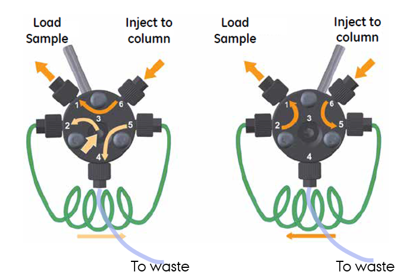
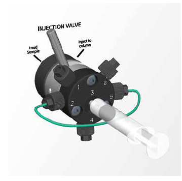
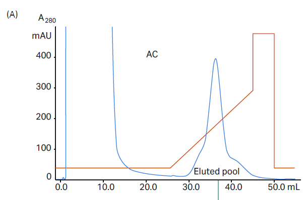





## Theoretical exercise preparing you for the laboratory exercises in week 44-45. 

During the laboratory exercise, you will become familiar with the three commonly used techniques for protein purification. The following 2h theoretical exercise will prepare you for the laboratory exercise and help you to avoid experimental problem or even failure of a given step. This is important as the program for day 2 and day 3 depend on the prior day being carried out successfully since you continue with the sample obtained the day before. In this way, the laboratory exercise gives you a realistic impression of the experimental work related to purifying a protein that you may become involved in later on in your BSc and MSc study. In all steps, the manual describes procedures that are used routinely in protein science research at MBG and similar institutions.



1)	Read the instructions to the laboratory exercise carefully. Using a chatbot of your choice, generate a graphical summary of the instructions and generate a presentation with one slide for each day. Then refine the auto-generated draft and validate that it really covers what is described in the text. Notice that you will depend on a clear flow chart to perform the lab exercise efficiently.

::: {.callout-solution}
This works quite well, but the student will probably have to add some information regarding the mechanism of imidazole elution from the IMAC, and the logic behind the gradient elution on IEX
:::

2)	On day 1, the Bradford colour assay is used to estimate the protein concentration in the crude extract. Explain why you cannot use A280 for this purpose and what class of chemical groups that are likely to contribute to A280 in the crude extract. For a pure protein, the A280/A260 is close to 2. What do you expect it to be in the crude extract? 

::: {.callout-solution}
The crude extract obtained from lysis of bacteria is full of nucleic acid and nucleotides like ATP. The bases in DNA, RNA and nucleotides absorb very strongly at 280 nm, in fact nucleic acid absorbs roughly 10x better than protein by weight at 280. In proteins, it is the aromatic systems in primarily tryptophan and tyrosine side chains that absorb at 280 nm. There is a minor contributions from disulfides in extracellular proteins. In a crude extract, the A280/A260 is far below 2, and the ratio can be used to estimate the nucleic acid/protein ratio in a sample.
:::

3)	When you want to apply a sample to a column during the laboratory exercise, you will use the injection valve on the AEKTA start instrument. Your precious sample will be in a syringe that you insert into port 3 of the injection valve. Using the figure of the injection valve flow path in your lecture notes also shown below to the left, discuss what happens if you by accident push the piston of the syringe inserted into port 3 (right figure) while the injection valve is in the “Inject to column” position in contrast to the correct procedure where you push the piston while the injection valve is in the “Load sample” position. 

::: {.callout-solution}
When the valve is in “inject”, port 3 holding the syringe is connected directly to port 4 which goes to waste (left panel). You will therefore lose your sample if you push the syringe piston to the bottom. If you do it correctly and push the piston to the bottom with the valve in “Load”, your sample will be loaded into the loop (flow-path port 3-port2-port5-port4, left panel) while the buffer in the loop will be displaced through port 4 and go to the waste. Thus, if you load more than the sample loop volume, this will also go through port 4 and be end in the waste.
::: 	 

::: {layout-ncol=2}
{width="100%" fig-align="center" .lightbox}

{width="100%" fig-align="center" .lightbox}
:::

4)	Below is displayed a chromatogram from the lecture slides for an elution from an IMAC Ni^2+^ affinity column. The red line shows the %B, the bottle containing a high concentration of imidazole. Describe the purpose of the first 26 ml where %B is constant, the gradient where %B is increasing, and 45-50 ml where %B is constant again. 

::: {.callout-solution}
In the first phase, contaminant proteins that bind weakly (and unspecifically) to the IMAC resin are eluted due to the low concentration of imidazole in the buffer competing for the immobilized Ni2+ ion. In the linear gradient phase, the increasing concentration of imidazole will displace the his-tagged target protein and strongly binding contaminants from the resin. In the 45-50 ml step with very high imidazole concentration, the column is cleaned to make sure that all bound protein has been eluted.
:::

{width="90%" fig-align="center" .lightbox}

5)	In IEX and IMAC the volume of the loop is not important as long as it is larger than the sample volume. In SEC, the loop is normally limited to 2% of the column volume. Can you explain this difference? 

::: {.callout-solution}
In IEX and IMAC, the target protein becomes bound to the resin (the stationary phase) and the column is washed to remove unbound protein in the mobile phase with a significant volume of buffer. The volume of the loop is therefore not important. In SEC, the protein remains in the mobile phase, and the best separation is therefore obtained if a small volume of sample is injected on the column. A larger injected volume will give a broader peak on the SEC whereas on the IEX and IMAC, it is the abso-lute amount of bound protein that determines the peak width.
:::

6)	Many proteins precipitate at low ionic strength (e.g. below 50 mM NaCl) due to what is known as salting-in where opposite charges on protein molecules attract each other. But a researcher considers investigating whether a protein can tolerate dialysis against a buffer of 50 mM NaCl pH 6.0 when design-ing a purification protocol involving binding of this protein to a cation IEX column like the capto-S used in the laboratory exercise. Can you explain why the researcher wants to lower the salt concentration and account for how one can transfer a protein from a high salt buffer to a low salt buffer? 

::: {.callout-solution}
In IEX, the protein is eluted with a salt gradient, and most proteins must be in a low salt buffer (i.e. below 100 mM NaCl) to bind an IEX column. Dialysis, which is used before day 2 in the lab exercise, is an efficient manner of lowering the salt concentration and at the same time adjust the pH. Additional comment: Simple dilution may also be used to lower the salt concentration but has the disadvantage of increasing the sample volume. This can make IEX loading a time-consuming next step. Dilution is therefore often not the preferred way of reducing the salt concentration.
:::

7)	Assume that you study a protein that can form homo-oligomers and that the monomer and dimer are present in your sample with 40% monomer and 60% dimer that are not in dynamic equilibrium. Whereas you will expect two peaks in a SEC chromatogram, would you expect to observe more than one peak in an IEX chromatogram for gradient elution of this protein? 

::: {.callout-solution}
In fact, you would expect to observe two peaks since the dimer will have the opportunity to interact with more opposite charged groups on the IEX resin when bound compared to the monomer. But the two peaks may not be very well separated.
:::

8)	Consider SEC chromatography for the same mixture monomer and dimer. You do a first run and pool the fractions eluting in the first of the two peaks. You then inject an aliquot of this pool onto the same SEC column. Do you expect to observe one or two peaks in this second SEC run? Sketch the two chromatograms. 

::: {.callout-solution}
As we are told in question 7 that the monomer and dimer are not in dynamic equilibrium, we expect only the same peak to appear in run #2. If monomer and dimer were in equilibrium, one would expect two peaks to appear also in the second run.
:::
