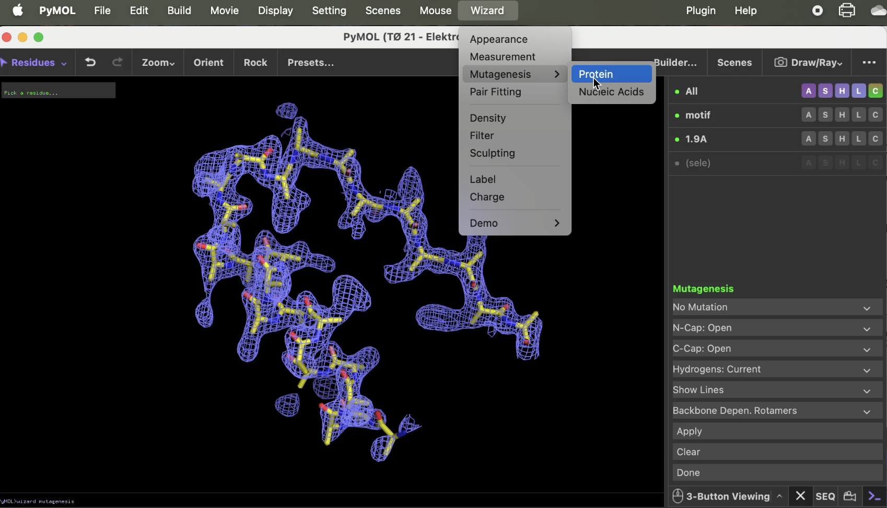

## Opgave 1. Test dig selv i PyMOL-scripting

Åbn først den vedhæftede fil `pymol_template.pml`, som findes i TØ mappen, i Visual Studio Code. Denne indeholder et template-script, der henter to strukturer af den bakterielle leucine transporter, LeuT til objekterne LeuT1 og LeuT2. Brug scriptet til at besvare opgaven ved at fylde jeres egne kommandoer ind under hvert spørgsmål som angivet i scriptet. Scriptet opretter i alt 8 scener lagret i F1...F8 svarende til hvert spørgsmål. I hvert spørgsmål bygges der videre på scriptet ovenfor, så I skal ikke "reinitialize" på noget tidspunkt. Når I afleverer scriptet skal hver F-tast vise svaret på det pågældende spørgsmål.

1.  Vis objektet [LeuT1]{.underline} som "cartoon" med farven `lime` og sæt en orientering, der viser hele strukturen.

2.  Opret en selektion med de to Na^+^-ioner med residue-numre 751 og 752 og vis de to atomer som `sphere` med farven `violetpurple`.

3.  Fremhæv resterne 112 og 179 med `sticks` og sæt farven sådan at kun carbon er `lime` mens andre atomer har deres respektive atomfarver.

4.  Angiv den korteste afstand mellem de to rester som et `measure`-objekt.

5.  Opret en anden selektion med alle atomer indenfor 6 Å af de to Na^+^-ioner. Vis disse som sticks hvor alle atomer ud over carbon farves efter deres respektive atomfarver. Sørg for at intet er selekteret efter scriptet er kørt.

6.  Vis også strukturen af [LeuT2]{.underline} som "cartoon" og foretag et strukturelt alignment af denne over på LeuT1.

7.  Vis LeuT2 med en overflade farvet efter "vacuum electrostatics".

Officielt svar

Se script i svar mappen.

## Opgave 2. Bragg's lov

1.  Forklar med dine egne ord hvorfor kun bestemte vinkler giver konstruktiv interferens. Brug Braggs lov (2d·sinθ = λ) til at understøtte din forklaring.

2.  Hvis du har to proteinkrystaller:\
    • Krystal A med større enhedscelle (d = 100 Å mellem proteinlag)\
    • Krystal B med mindre enhedscelle (d = 50 Å mellem proteinlag)\
    Hvilken krystal vil give diffraktionspletter længere fra centrum på detektoren? Forklar hvorfor.

3.  Ved en bølgelængde af røntgenstrålen λ = 1.5 Å :\
    Hvad er den mindste d-værdi (Bragg opløsning) du kan observere hvis din detektor maksimalt kan måle ved θ = 60°?

4.  Forklar hvorfor højere opløsning kræver:\
    • Enten kortere bølgelængde (λ)\
    • Eller evnen til at måle ved større vinkler (θ)

Officielt svar

1.  Når røntgenstråler rammer en krystal, bliver de spredt af elektronerne i atomerne. Man kan forestille sig, at atomerne ligger i ordnede planer med en bestemt afstand, d, imellem sig.\

    ```python
    For at et stærkt signal (en diffraktionsplet) kan måles, skal de spredte bølger forstærke hinanden. Dette kaldes konstruktiv interferens. Det sker kun, når bølgetoppe møder bølgetoppe.
    ```

    En røntgenstråle, der reflekteres fra et dybere-liggende plan i krystallen, skal rejse en længere vej end en stråle, der reflekteres fra et øvre plan. For at de to bølger skal være i fase (og dermed interferere konstruktivt), skal denne ekstra vej være præcis et helt antal bølgelængder (nλ).\
    \
    Braggs lov (2d·sinθ = λ) beskriver netop denne betingelse. 2d·sinθ er den matematiske udregning af den ekstra vej, som den nederste bølge skal tilbagelægge. Kun ved helt bestemte vinkler (θ) vil denne ekstra vej svare til en hel bølgelængde, og kun da vil vi se et diffraktionssignal. Ved alle andre vinkler vil bølgerne interferere destruktivt og udslukke hinanden.

2.  Krystal B (med den mindste enhedscelle) vil give diffraktionspletter længere fra centrum.\
    \
    Forklaringen ligger i den omvendte sammenhæng i Braggs lov. Loven kan omskrives til:\
    \
    sinθ = λ / (2d)\
    \
    Her kan vi se, at sinθ er omvendt proportionel med afstanden d. Det betyder:\
    • En lille d-værdi (lille afstand mellem planer) giver en stor sinθ-værdi, og dermed en stor spredningsvinkel (θ).\
    • En stor d-værdi (stor afstand mellem planer) giver en lille sinθ-værdi, og dermed en lille spredningsvinkel (θ).\
    \
    Da diffraktionspletterne længere fra centrum på detektoren svarer til større spredningsvinkler (θ), vil Krystal B, med den mindste d-værdi, producere disse pletter. Dette er et centralt koncept i krystallografi: Højopløst strukturel information (lille d) findes langt fra centrum i diffraktionsmønsteret.

3.  Vi bruger Braggs lov:\
    \
    2d·sinθ = λ\
    \
    Vi isolerer d:\
    \
    d = λ / (2·sinθ)\
    \
    Nu indsætter vi værdierne λ = 1.5 Å og θ = 60°\
    \
    d = (1 · 1.5 Å) / (2 · sin(60°))\
    d = 1.5 Å / (2 · 0.866)\
    d = 1.5 Å / 1.732\
    d ≈ 0.87 Å\
    \
    Den mindste d-værdi (højeste opløsning), vi kan observere, er ca. 0.87 Å.

4.  Højere opløsning betyder, at vi kan `se` finere detaljer, hvilket svarer til en mindre d-værdi. Lad os igen se på den omskrevne Bragg-lov:\
    \
    d = λ / (2·sinθ)\

    ```python
    For at få en lille d-værdi (høj opløsning), skal tælleren (λ) være så lille som muligt, og/eller nævneren (2·sinθ) skal være så stor som muligt.
    ```

    • Kortere bølgelængde (λ): Hvis λ bliver mindre, bliver tælleren i brøken mindre, og dermed bliver d også mindre. Derfor kan man opnå højere opløsning ved at bruge røntgenstråling med kortere bølgelængde (f.eks. fra en synkrotron).\
    \
    • Måle ved større vinkler (θ): Sinus-funktionen vokser fra 0 til 1 i intervallet 0° til 90°. En større vinkel θ giver altså en større sinθ-værdi. Når nævneren i brøken bliver større, bliver den samlede værdi af d mindre. Derfor er det nødvendigt at indsamle data ved høje spredningsvinkler for at opnå høj opløsning. Detektoren skal fysisk kunne placeres, så den kan opfange disse højt spredte stråler.\
    *Note: I praksis er det som regel kvaliteten af krystallen (hvor velordnet den er), der sætter græsen for opløsningen i røntgen-diffraktions-eksperimentet.*

## Opgave 3. Røntgenkrystallografi vs. Cryo-EM -- Vælg den rette metode

For hvert scenarie nedenfor skal du:

1.  **Vælge** den mest velegnede metode (Røntgenkrystallografi eller Cryo-EM).

2.  **Begrunde** dit valg ved at diskutere fordele og ulemper ved **begge** metoder i den specifikke kontekst.

**Scenarie 1: Lægemiddeludvikling mod en lille, stabil protease**

```sh
Et medicinalfirma vil udvikle en ny hæmmer mod en viral protease. Proteinet er relativt lille (35 kDa), meget stabilt og kan produceres i store mængder. Målet er at opnå en struktur med den højest mulige opløsning for at kunne se præcis, hvordan lægemiddelkandidaten binder i det aktive site, inklusiv placeringen af enkelte vandmolekyler, der medierer interaktionen.

*Hvilken metode vil du anbefale og hvorfor?*
```
**Scenarie 2: Undersøgelse af et stort, dynamisk maskineri**

```sh
En forskergruppe vil bestemme strukturen af det humane spliceosom (en kæmpe samling af proteiner og RNA på over 1.5 MDa), mens det aktivt splejser et stykke pre-mRNA. Komplekset er kendt for at være meget fleksibelt og eksistere i adskillige forskellige konformationelle tilstande under processen. Det er ekstremt svært at rense komplekset i en helt homogen tilstand.

*Hvilken metode vil du anbefale og hvorfor?*
```
**Scenarie 3: Struktur af et membranprotein i sin native membran**

```sh
Du vil forstå, hvordan en ionkanal fungerer direkte i cellemembranen, omgivet af lipider og andre membranproteiner. Du er interesseret i at se, hvordan proteinets struktur ser ud *in situ* (på sin naturlige plads i cellen), ikke som et isoleret, oprenset protein.

*Hvilken metode (eller variation af en metode) vil du anbefale og hvorfor?*
```
Officielt svar

**Scenarie 1 (Protease):**

Korrekt valg: Røntgenkrystallografi.

Begrundelse: Målet er atomar opløsning for at se lægemiddelbinding i detaljer. Dette er røntgenkrystallografiens absolutte styrke. Proteinet er lille og stabilt, hvilket øger chancen for at få gode krystaller. Cryo-EM ville have svært ved den lille størrelse (lavt signal/kontrast) og ville sandsynligvis ikke nå den samme ultra-høje opløsning, som er nødvendig for at se vandmolekyler og præcise atom-interaktioner. Ulempen er "krystal-flaskehalsen", men for dette projekt er den potentielle gevinst (atomar opløsning) risikoen værd.

**Scenarie 2 (Spliceosom):**

Korrekt valg: Cryo-EM.

Begrundelse: Dette er et `lærebogseksempel` på et problem, som cryo-EM revolutionerede. Komplekset er stort (giver godt signal i cryo-EM), fleksibelt og heterogent. Disse tre egenskaber gør det praktisk talt umuligt at krystallisere. Cryo-EM's store fordel er, at den ikke kræver krystaller og kan håndtere den konformationelle heterogenitet. Ved hjælp af computer-baseret klassificering kan forskerne sortere partikelbillederne og løse strukturer af de forskellige funktionelle tilstande fra den samme prøve.

**Scenarie 3 (Membranprotein in situ):**

Korrekt valg: En variation af Cryo-EM, nemlig Cryo-elektrontomografi (Cryo-ET).

Begrundelse: Spørgsmålet handler om at se strukturen i dens native kontekst (in situ). Hverken traditionel røntgenkrystallografi eller single-particle cryo-EM (som begge kræver oprensede prøver) kan løse denne opgave. Cryo-ET er den eneste metode, der kan producere 3D-rekonstruktioner af dele af en celle i nær-nativ tilstand. Man kan fryse hele celler, skære en ultratynd skive ud (en `lamel`) med en ionstråle (FIB-milling) og derefter optage en serie billeder i mikroskopet, som kan rekonstrueres til et 3D-tomogram. Opløsningen er lavere end i single-particle cryo-EM, men det er den eneste måde at opnå `visual proteomics` og se molekylære maskiner i deres naturlige omgivelser.

## Opgave 4. Modelbygning

I denne opgave skal vi prøve kræfter med fortolkning af et elektrontæthedskort og modelbygning. Diffraktionsdata for et lille protein på 96 aminosyrerester er blevet indsamlet til en maksimal opløsning på 1.9 Å, og man har beregnet et elektrontæthedskort.

Vi skal kigge på et lille udsnit af elektrontætheden, som kan ses ved at åbne elektrondensitet.pse som findes i TØ mappen.

Modelbygningen er påbegyndt ved at indsætte en såkaldt poly-Ala-model i tætheden, dvs. en præliminær struktur kun bestående af den mest simple aminosyrerest med en sidekæde, alanin. Modellen kan ses som en gul stick-struktur inde i elektrontæthedskortet, der er vist kontureret med et gitter i blåt.

1.  Analysér tæthedskortet og poly-Ala modellen og find peptidkædens N- og C-terminaler. Hvilke to sekundære strukturelementer er dette lille peptidmotiv opbygget af?

2.  Kig nærmere på kortet og se om du kan identificere sidekæder, carbonylgrupper og amidnitrogener i peptidet.\
    Hint: Dette er lettest at se ved de store sidekæder.

Fra det forudgående molekylærbiologiske kloningsarbejde vides det at peptidsekvensen for fragmentet er følgende:

MNYKELEKMLDVIFENSEIKEIDLFFD

Første trin i modelbygningen er at identificere de store, hydrofobe aminosyrer i sekvensen, da disse ofte er mest ordnede og derfor lettest at finde i tætheden.

3.  Hvilke store, hydrofobe aminosyrer findes i sekvensen og hvor er de placeret? Er der et motiv blandt disse, der kunne tænkes at være let at identificere i kortet?

4.  Find motivet i elektrontæthedskortet baseret på din viden om peptidkædens retning. Passer nogle af de andre aminosyresidekæder?

***PyMOL hint**: Man kan bruge wizard mutagensis for at redigere på aminosyrer i en peptidkæde. Det kan bruges f.eks. når man skal vurdere effekten af en mutation. Her er det selvfølgelig vigtigt at notere til at proteinet ikke altid vil folde sig præcis på samme måde med en mutation som i vildtypen. Det kan altså kun bruge kvalitativt.\
Man trykker på protein under Wizard \> mutagenesis, so ses på figuren forneden til venstre, hvorefter menuen på figuren forneden til højre vises. Man selekterer så en enkelt aminosyre, trykker "No mutation" og trykker så på den ønskede aminosyre. For hver aminosyre bruger man undermenuen rotamer \> backbone dependant rotamer. Man trykker så på pilene og går igennem de forskellige konformationer. Når man har fundet en der passer ift. elektrondensitetet. En rød skive indikerer sterisk clash og en grøn skive indikerer stabiliserende interaktioner. Når du har fundet den rigtige, trykker du apply. Et godt tip for at spare tid er at indsætte én aminosyretype ad gangen og at starte med større hydrophobe aminosyrer og derefter større hydrofile aminosyrer. Tryk done når du har ændret alle aminosyrer.*\
\
{width="5.936679790026247in" height="3.3984962817147855in"}

5.  Kig alle aminosyreresterne igennem og find nogle, der ikke passer så godt i tætheden. Er der en fejl i sekvensen eller hvad kan dette mon skyldes?\
    Hint: Tænk over hvilken type af aminosyrerester, disse tilhører og hvor de normalt findes i et protein. Evt. brug en log-file til at gemme dit arbejde.

Officielt svar

1.  Peptidkæden har N-terminalen nederst og C-terminalen til højre i udgangspositionen og består af en α-helix (rester 2-15) efterfulgt af et turn og en β-strand (21-27).

2.  Sidekæderne sidder hver gang der er et gult Cβ-atom, der stikker ud fra hovedkæden. Carbonylerne kendes på de små bump og er også røde i poly-Ala modellen.

3.  **MNYKELEKMLDVIFENSEIKEIDLFFD**\
    De to Phe til sidst burde kunne identificeres, da de sidder lige ved siden af hinanden.

4.  Flere af de store hydrofobe sidekæder (Met9, Phe14, Phe25 og Phe26) passer rigtig godt i tætheden.

5.  \-

6.  Flere af de lange, hydrofile sidekæder (Lys4, Lys20 og Glu21) passer ikke godt i tætheden. Dette skyldes at de hydrofile sidekæder ofte sidder på overfladen af proteinet og derfor er fleksible.