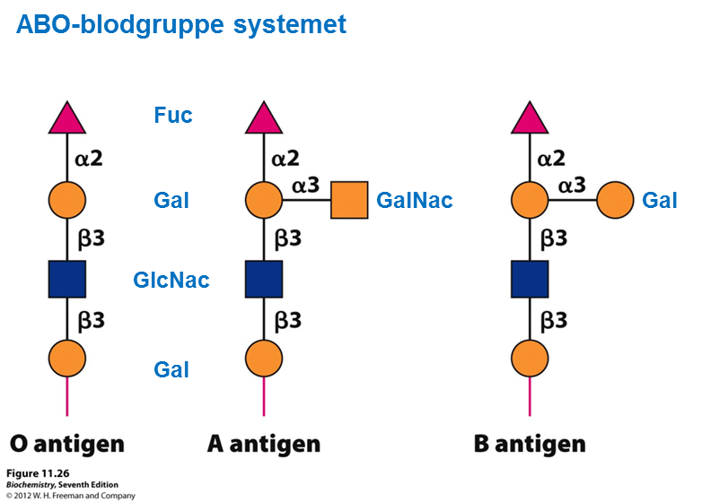
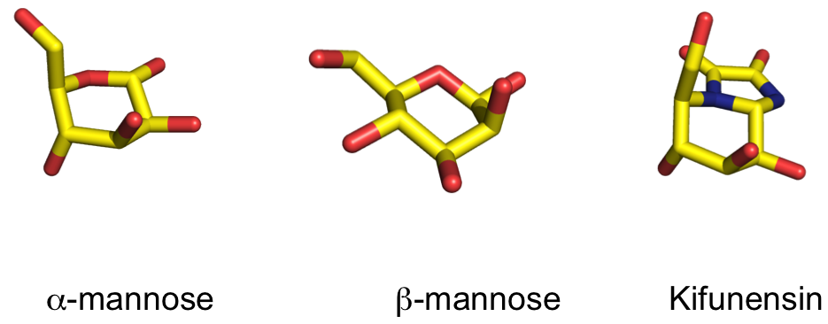
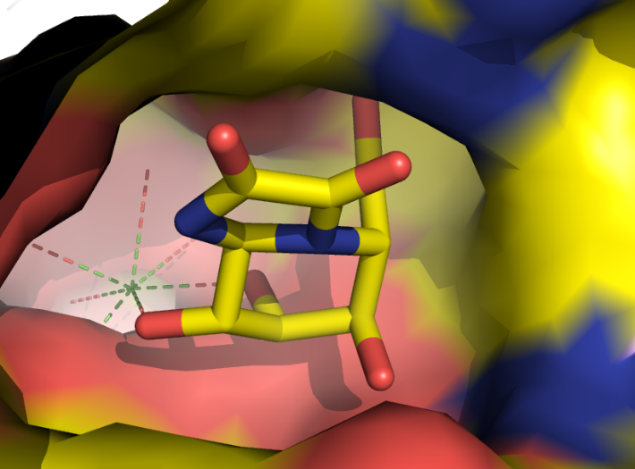
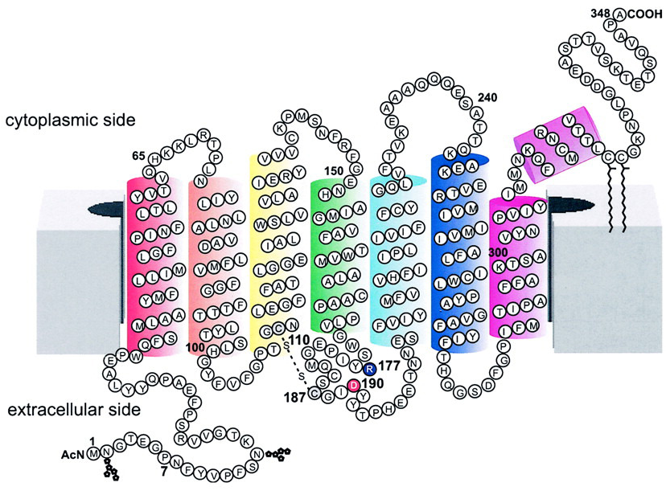
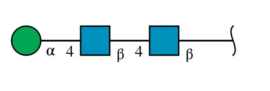
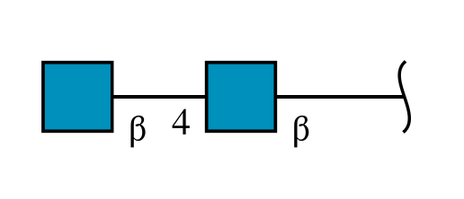
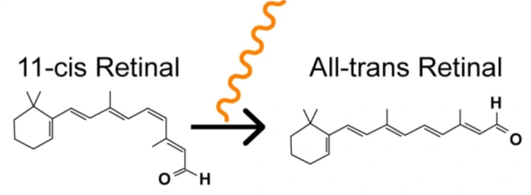

## Opgave 1. AB0-blodtypesystemet

Hos mennesket udgør en lille gruppe af O-bundne oligosaccharider, som vist på figuren, blodtypesystemet AB0, hvor man som individ kan være af typen (og dermed udtrykke antigenerne) 0, A, B eller AB.

1.  Beskriv hvordan modificerede proteiner af denne type syntetiseres. Sammenlign med biosyntesen af N-bundne oligosaccharider på glykoproteiner.

2.  Beskriv det genetiske og biokemiske grundlag for at netop disse tre varianter dannes i det konkrete tilfælde med blodsystemet?

{width="5.777777777777778in" height="4.143275371828522in"}

Erythropoeitin (EPO) er et glycoprotein der sitmulerer dannelse af røde blod legemer. EPO kan fremstilles recombinant i mammale celler hvorved man opnår et glykosyleret protein.

O- og N-glykosyleringer kan forudsiges ud fra aminosyresekvensen for et protein bl.a. via disse websites:

O-glykosyleringer: <https://services.healthtech.dtu.dk/services/NetOGlyc-4.0/>

N-glykosyleringer: <https://services.healthtech.dtu.dk/services/NetNGlyc-1.0/>

Gå til Uniprot, søg efter "human erythropoeitin" og kopier sekvensen (gå til "Sequence" , klik knappen `FASTA` og kopier sekvensen).

Undersøg sekvensen for mulige O- og N-glykosyleringer på ovenstående websites. 

3.  Hvor mange N-glykosyleringer bliver der forudsagt?

4.  Hvor mage O-glykosyleringer bliver der forudsagt?

Sammenlign resultatet med Stryer Figur 11.17 (bemærk at der er forskel i sekvensnummereringen pga. af et signalpeptid) eller Uniprot under overskriften "PTM/Processing".

5.  Hvilken type af forudsigelse (O- eller N-glykosylering) er mest nøjagtig og hvorfor?

Sammensætningen af glykosyleringer er afhængig ikke kun af den organisme proteinet udtrykkes i men også af celletypen. Man vil derfor kunne undersøge en blodprøve for forekomst af udefrakommende (exogent) EPO.

6.  Foreslå to metoder til identificering af exogent EPO og forklar hvorfor de kan anvendes.

:::: {.content-hidden when-profile="exercise"}
::: {.callout-important}

## Officielt svar

1.  Svaret skal indeholde en beskrivelse og sammenligning af syntesen af både N-bundne og O-bundne oligosaccharider, herunder information om at N-bundne molekyler dannes på bærermolekylet [dolicholphosphate]{.underline}, hvorefter det overføres som én samlet enhed til target-proteinet, der herefter modificeres. Dette står i kontrast til de O-bundne oligosaccharider, som opbygges sekventielt på target-molekylet. AB0-blodtypesystemet fremkommer som et resultat af O-bunden modifikation af proteiner og lipider på erythrocytternes overflade. O-bundne oligosaccharider findes, i modsætning til de N-bundne oligosaccharider, som modifikationer både på proteiner og på lipider.

2.  Svaret skal indeholde en beskrivelse af ABO-systemet, herunder at alle mennesker udtrykker et fælles sæt af glycosyltransferase-isoenzymer, som syntetiserer 0-antigenet i Golgi-apparatet ud fra UDP-aktiverede sukkerrester. Blodtyperne A og B fremkommer, hvis man fra sine forældre har nedarvet mindst ét funktionelt glycosyltransferase isoenzym, som kan modificere det yderste af de to galaktose-rester med henholdsvis en N-acetyl galaktosamin- eller en galaktoserest. Blodtypen AB fremkommer, hvis man har nedarvet den ene type af funktionelt isoenzym fra den ene forælder og den anden type fra den anden forælder. Hvis man kun har nedarvet ikke-funktionelle udgaver af de pågældende isoenzymer udtrykkes blodtype 0.

3.  Der forudsiges 3 N-glykosyleringer med høj konfidens.

4.  Der forudsiges 3 O-glykosyleringer med varierende konfidens.

5.  De tre N-glykosyleringer er korrekte medens kun den ene af O-glykosyleringerne er korrekt. Forskellen i kvalitet af forudsigelsen skyldes at der findes et veldefineret sekvensmotiv for N-glykosyleringer: NX(S/T) hvor X ikke må være prolin. Et sådant simpelt motiv findes ikke for O-glykosyleringer.

6.   Isoelektrisk fokusering (se Stryer) fordi der vil være forskel i masse og/eller ladning. Masse spec da der vil være forskel i masse.
:::
::::

## Opgave 2. Serine carboxypeptidase Y

En vakuolær protease fra gær, serine carboxypeptidase Y (CPY), er involveret i C-terminal forarbejdning af peptider og proteiner. Vakuoler er membranomsluttede vesikler i svampe og planter, der er vigtige for den intracellulære nedbrydning af affaldsprodukter, men CPYs præcise rolle i disse er uklar. CPY syntetiseres i en pre-pro form og bruges derfor som modelsystem for intracelullær proteinsortering i eukaryoter.

Aminosyresekvensen af pre-pro formen af CPY er vist nedenfor.

MKAFTSLLCG LGLSTTLAKA ISLQRPLGLD KDVLLQAAEK FGLDLDLDHL LKELDSNVLD \
60  \
AWAQIEHLYP NQVMSLETST KPKFPEAIKT KKDWDFVVKN DAIENYQLRV NKIKDPKILG\
120\
IDPNVTQYTG YLDVEDEDKH FFFWTFESRN DPAKDPVILW LNGGPGCSSL TGLFFELGPS\
180\
SIGPDLKPIG NPYSWNSNAT VIFLDQPVNV GFSYSGSSGV SNTVAAGKDV YNFLELFFDQ\
240\
FPEYVNKGQD FHIAGESYAG HYIPVFASEI LSHKDRNFNL TSVLIGNGLT DPLTQYNYYE\
300\
PMACGEGGEP SVLPSEECSA MEDSLERCLG LIESCYDSQS VWSCVPATIY CNNAQLAPYQ\
360\
RTGRNVYDIR KDCEGGNLCY PTLQDIDDYL NQDYVKEAVG AEVDHYESCN FDINRNFLFA\
420\
GDWMKPYHTA VTDLLNQDLP ILVYAGDKDF ICNWLGNKAW TDVLPWKYDE EFASQKVRNW\
480\
TASITDEVAG EVKSYKHFTY LRVFNGGHMV PFDVPENALS MVNEWIHGGF SL        \
532

1.  CPY indeholder fire N-glykosylerede aminosyrerester. Angiv deres position og den lokale sekvens omkring dem. 

2.  Oligosacchariderne koblet til CPY er hovedsagelig på formen Glc~3~Man~9~GlcNAc~2~, Man~8~GlcNAc~2~ og Man~5~GlcNAc~2~. Foreslå strukturer for oligosacchariderne.

3.  Hvorledes kunne man eksperimentelt analysere strukturen af oligosacchariderne koblet til CPY?

Aminosyreresterne 1-20 udgør signalsekvensen i pre-pro CPY, hvorefter 21-111 er pro-peptidet og 112-532 udgør selve enzymet. I sekvensen finder man yderligere et konsensussignal for vakuolær sortering, **QRPL**.

4.  Beskriv ud fra de givne oplysninger, hvordan modningen af CPY i cellen kunne foregå.\
     

:::: {.content-hidden when-profile="exercise"}
::: {.callout-important}

## Officielt svar

1.  N-glycosyleringer, NXT/S. N124 (NVT), N198 (NAT), N279 (NLT) og N479 (NWT).

2.  GlcNAc~2~ findes altid ved basen af oligosaccharidet og den første er koblet til Asn. Herefter følger typisk Man-rester i én, to eller tre grene (højmannose). Andre typer af sukkerstoffer, såsom Glc-resterne, sidder ofte længst ude. Der er derfor flere mulige strukturer af oligo-saccharidet.

3.  N-koblede oligosaccharider spaltes fra peptidet (proteinet) af peptide N-glycosidase F (Fig. 11.29, s. 333). Andre specifikke glycosidaser bruges til spaltning af oligosaccharidet (f.eks. spalter neuamidase ved sialsyre og b-1,4-galactosidase). Oftest kan oligosaccharide-strukturen kun bestemmes delvist.

4.  Serine carboxypeptidase Y er et glycoprotein, der syntetiseres og processeres via ER- og Golgi-membransystemerne. Den modne N-terminal (QRPL) indeholder det vakuolære sorting signal. Eventuelle O-glycosyleringer sker i Golgi ligesom de N-bundne oligosaccharider kan blive trimmet til komplekse former. Carboxypeptidasen pakkes i en vesikel i den terminale del af Golgi, hvorefter denne frigives og transporteres til vakuolen. 
:::
::::

## Opgave 3. Mannosidase I

Mannosidase I er et enzym der fjerner mannose enheder fra høj-mannose glycosyleringen der bliver tilføjet i ER. Den er således en forudsætning for at yderligere modificering af glycosyleringer senere kan foregå i Golgi. Mannosidase I er specific for α1-2 glycosid bindinger.

1.  Hvorledes vil den fælles N-glycosylerings stub se ud efter behandling med mannosidase I?

PNGase-F (peptide N-Glycosidase F) anvendes i laboratoriet ofte til at fjerne N-glycosyleringer fra proteiner idet den kløver N-glycosid bindingen mellem asparagine og N-acetylglucosamine. Denne kløvning sker imidlertid ikke hvis glykosyleringen indeholder en fucosylering.

2.  Hvor er fucosyleringen sædvanligvis placeret i en N-glycosylering ?

3.  Hvorfor kan PNGase F ikke kløve en fucosyleret glycosylering ?

Kifunensin er en inhibitor af mannosidase I. I forbindelse med udtryk af proteiner i mammale cellekulturer tilsættes kifunensin ofte til mediet.

4.  Vil det have en effekt på effektiviteten af efterfølgende PNGase-F behandling ?

Nedenfor er vist strukturen af alpha-D-mannopyranose, beta-D-mannopyranose og kifunensin.

5.  Vil du forvente at kifunensin er en kompetitiv, non-kompetitiv eller un-kompetitiv inhibitor ?

{width="6.263888888888889in" height="2.4409722222222223in"}

I billedet nedenfor er vist kifunensin bundet i en lomme i mannosidase I. Kifunensin er vist som sticks og enzymet som en overflade. Det grønne kryds er en Ca^2+ ^ion og de stiplede linier angiver interaktioner med oxygen atomer.

6.  Forklar hvorfor Mannosidase I er specifik for α-glycosid bindinger.

 {width="3.2235290901137357in" height="2.3786931321084865in"}

:::: {.content-hidden when-profile="exercise"}
::: {.callout-important}

## Officielt svar

1.  Den fælles stub er angivet med gråt i figur 11.16A i Stryer

2.  Fucosylering er sædvanligvis placeret på den første N-acetylglucosamin (figur 11.16B)

3.  PNGase F genkender N-acetylglucosamine men kun når den ikke er fucosyleret

4.  Hvis mannosidase I inhiberes vil de efterfølgende modifikationer i Golgi ikke finde sted. Glykosyleringen vil derfor fortsat være en høj-mannose form, som kan kløves med PNGaseF.

5.  Man vil forvente at kifunensin er en kompetitiv inhibitor, idet den har strukturel lighed med alpha-D-Mannose.

6.  Nitrogenet til venstre på figuren svarer til placeringen af oxygen på det anomere carbon. Hvis mannosen indgik i en beta-glycosid binding ville bindingen pege opad og der ville være sterisk hindring for binding til mannosidase I.
:::
::::

## Opgave 4. Glykosyleringer i sortilin

I forbindelse med bestemmelse af krystalstrukturen af glycoproteiner behandler man ofte proteinet med enzymet PNGase F (peptide N-Glycosidase F) inden krystallisation. 

1.  Hvad er rationalet bag denne behandling? 

Sortilin er en endocytose-receptor som er i stand til at binde et antal forskellige ekstracellulære proteiner og peptider og transportere dem til lysosomer. Ved bestemmelse af krystalstrukturen (PDB-ID: 4PO7) blev sortilin [ikke]{.underline} behandlet med PNGaseF.

2.  Lav en scene, kaldet F1, som viser cartoon repræsentation og en scene, kaldet F2, der viser sortilins overflade. Hvilke asparaginer kan ses at være glycosyleret i Sortilin?

***PyMOL-info**: Bemærk at surface-repræsentation kun ændrer proteinets repræsentation, men at solvent og glycosyleringer fortsat vises som sticks.*

Find aminosyresekvensen for humant sortilin på Uniprot. Bemærk: der er forskel på nummereringen i UNIPROT og i PDB-ID: 4PO7. 

3.  Hvor mange N-glykosyleringssites siger Uniprot der er i humant sortilin? 

4.  Hvorfor er det ikke alle N-glykosyleringssites der ses at være glycosyleret i krystalstrukturen?

Ved bestemmelse af en anden krystalstruktur af sortilin (PDB-ID: 3F6K) blev sortilin behandlet med PNGaseF inden krystallisation.

5.  Overlejr den behandlede sortilin med den ubehandlede sortilin og kald scenen F3. Lav så scener, kaldet F4, F5 og F6, som viser de 3 glycosylerede sites,\
    Hvorfor er det kun dele af glycosyleringerne, der fjernes?

6.  Beskriv opbygningen af glycosyleringen på Asn549 på den ubehandlede sortilin og lav en scene kaldet, F7, som viser denne. Hint: definer Asn og glycolysering som et objekt. Dette inkluderer karakterisering af glycosidbindingerne.

Vis nu sortilin som regnbuefarvet 'cartoon' og find polære kontakter mellem glykosyleringen på Asn549 og protein delen af sortilin.    

7.  Lav en scene, kaldet F8, der viser dette. Hvilke sidekæder danner hydrogen-bindinger med glykosyleringen?

I et forsøg på at fjerne alle glykosyleringer blev alle asparaginer, der var forudsagt til at være glycosyleret i sortilin, muteret til alanin. Imidlertid viste det sig efterfølgende at det muterede sortilin ikke blev udtrykt.  

8.  Giv en mulig forklaring på denne observation.  

:::: {.content-hidden when-profile="exercise"}
::: {.callout-important}

## Officielt svar

Script findes på Brightspace.

1.  PNGase F er det mest effektive enzym til at fjerne N-bundne oligosaccharider fra glycoproteiner. Enzymet er en amidase, der spalter mellem den inderste GlcNAc og asparaginresten i højmannose og andre komplekse oligosaccharider. Denne behandling gemmenføres ofte forud for krystallisation af glycoproteiner for at fjerne de meget store, fleksible og forgrenede sukkerstrukturer, der kan forhindre pakning af proteinerne i krystallen. I mange tilfælde er sukkergrupperne så store, at de i udstrækning minder om selve proteinets størrelse. 

2.  Asn129, Asn373 og Asn549

3.  Human sortilin har entry [**Q99523**](http://www.uniprot.org/uniprot/Q99523) i Uniprot. Sortilin har 6 forudsagte N-glycosyleringssites (står under "PTM & Processing") på positionerne 98, 162, 274, 406, 582 og 684. Bruges nummerering i pdb svarer det til positionerne 65, 129, 241, 373, 549 og 651. Forskellen i nummerering skyldes at uniprot tæller signal peptidet med.

4.  Ofte er glycosyleringer meget fleksible. Det vi ser i en krystalstruktur er middel over alle molekyler i strukturen og derfor kan vi ikke se meget fleksible dele af strukturen.

5.  Både Asn373 og Asn549 ligger i en ret dyb lomme, der ikke tillader PNGase F at komme til at kløve glycosyleringen. Derimod er Asn129 overflade-eksponeret og vi ser at glykosyleringen er fjernet på den position i 3f6k.

6.  Glycosyleringen på Asn549 består af 2 N-acetyl-glucosamine (NAG)efterfulgt af mannose (BMA). Den inderste NAG er bundet til asparaginen via en β1-N-glykosidbinding.

7.  Den inderste N-acetyl-glucosamin danner hydrogen bindinger fra O6 (acceptor) til Nζ (donor) i Lys119 . Der er også en mulig H-binding fra O6 (H donor) til hovedkæde carbonyl oxygen (acceptor) i Asp116, men afstanden er så lang (3,3Å) at man normalt ikke vil regne den medog den vises derfor heller ikke hvis man har sat cutoff til 3.2Å. Desuden er der en hydrogenbinding fra oxygen (acceptor) i acetyl-gruppen til guanidinium gruppen i Arg622 (donor).

8.  Der kan egentlig være to forklaringer. Enten kan Asn-sidekæderne selv være vigtige for proteinets foldning og mutationerne kan derfor betyde at proteinet ikke folder korrekt og dermed er uopløseligt. En anden mulighed er at glycosyleringerne er vigtige for foldning af proteinet i cellen eller for opløselighed under foldningsprocessen i Golgi/SR. Glycosyleringer tjener ofte til at forøge stabilitet og opløselighed af proteiner. I spørgsmål6 så vi at glykosyleringen på Asp549 forbandt det første β-sheet med det sidste i propelstrukturen via hydrogenbinginger.  Glykosyleringen kan derfor tænkes at være med til at stabilisere den 10-bladede propelstruktur. 
:::
::::

## Opgave 5. (Rhod-)opsin (PyMOL)

Proteinet rhodopsin er ansvarlig for omsætning af lys til et sansesignal i øjet. Strukturbestemmelse af rhodopsin har været ekstremt udfordrende, da proteinet ikke blot er et membranprotein, men heller ikke tåler lys. Derfor skal oprensningen ske i mørke.

{width="3.7303958880139985in" height="2.807217847769029in"}

1.  Lav et script, der henter krystalstrukturen af bovine rhodopsin bestemt til en opløsning af 2,2 Å (PBD-ID: 1U19) og opret et objekt, der kun indeholder kæderne A, C og D. Vis strukturen som cartoon i regnbuefarve (N=blå til C=rød), vis ioner som kugler og andre ligander med sticks. Gem dette som en scene kaldet F1. (Hint: Man kan med fordel bruge RCSB til at finde positioner for ligander / kigge på sekvensen i PyMol for residue numre/navne)

Beskriv den overordnede foldningsklasse og struktur af rhodopsin.

2.  Kæderne C og D indeholder ikke protein, men er kovalent koblede til det. Hvordan er kæderne C og D koblet til rhodopsin og hvad indeholder de? Beskriv den modulære opbygning af kæderne.

3.  Strukturen indeholder to molekyler med betegnelsen PLM. Hvilket stof er der tale om og hvorfor tror du det binder til rhodopsin?

4.  Identificér den prostetiske 11-*cis* retinal-gruppe og lav en scene kaldet F2, som tydeligt viser denne. Beskriv interaktionen mellem 11-*cis* retinal og rhodopsin. Hvordan fastholdes den protestiske gruppe? Hvor er den optisk aktive del af 11-*cis* retinal?

5.  Hent strukturen af opsin (PDB-ID: 3CAP) og på samme måde som før; dan et objekt med kæderne A, C og D. Foretag dernæst en overlejring af opsin på rhodopsin. Gem dette som scene F3. Hvad er forskellen på opbygningen af opsin og rhodopsin? Giver denne forskel anledning til strukturelle ændringer? Hvilke?

:::: {.content-hidden when-profile="exercise"}
::: {.callout-important}

## Officielt svar

1.  Brug rcsb.org for at finde ligander etc:\
    \
    reinit\
    fetch 1u19, async=0\
    create 1u19_acd, 1u19 and chain A+C+D\
    disable 1u19\
    hide all\
    show cartoon, 1u19_acd\
    util.rainbow(`1u19_acd`)\
    select ligands, 1u19_acd and (chain C+D or resn RET or resn PLM or resn HTG or resn HTO)\
    select ions, 1u19_acd and (elem HG or elem ZN)\
    select asn, 1u19_acd and (resi 2 or resi 15)\
    show sticks, ligands or asn\
    color skyblue, ligands\
    util.cnc ligands or asn\
    show sphere, ions\
    color grey50, ions\
    select none\
    \
    Foldningsklasse alpha, der er 7 transmembrane helicer (7 TM), hvor af den ene er bøjet.

2.  Det er N-glycosyleringer forankret via Asn 2 og 15.\
    \
    Kæde C\
    (alpha-D-mannopyranose-(1-4)-2-acetamido-2-deoxy-beta-D-glucopyranose-(1-4)-2-acetamido-2-deoxy-beta-D-glucopyranose):\
    \
    {width="3.34in" height="1.129352580927384in"}\
    Kæde D (2-acetamido-2-deoxy-beta-D-glucopyranose-(1-4)-2-acetamido-2-deoxy-beta-D-glucopyranose)\
    {width="2.463781714785652in" height="1.06in"}

3.  Palmitat. Binder (og stabiliserer formentlig) det transmembrane, hydrofobe område.

4.  Efter ovenstående, f.eks:\
    \
    set_view (\\\
        -0.720942974,    0.334131032,   -0.607121885,\\\
        -0.689282119,   -0.436299115,    0.578387737,\\\
        -0.071631059,    0.835463762,    0.544856608,\\\
        -0.000001192,    0.000056803, -255.603088379,\\\
        39.933383942,    5.397409439,    8.031553268,\\\
       226.496871948,  284.712615967,  -20.000000000 )\

    ```python
    scene F1, store
    ```

    set_view (\\\
        -0.720942974,    0.334131032,   -0.607121885,\\\
        -0.689282119,   -0.436299115,    0.578387737,\\\
        -0.071631059,    0.835463762,    0.544856608,\\\
         0.000003095,    0.000004799,  -88.668479919,\\\
        40.344326019,    1.528468490,   12.593762398,\\\
        75.946006775,  101.390907288,  -20.000000000 )\

    ```python
    scene F2, store
    select interact, byres (1u19_acd and chain A and resn RET around 4)
    select retinol, 1u19_acd and resn RET
    show sticks, interact or retinol
    color skyblue, retinol
    util.cnc interact or retinol
    select none
    ```

    11-*cis* retinal er kovalent koblet til Lys296 og fastholdes gennem forskellige, bl.a. hydrofobe interaktioner. Lys forårsager at 11-*cis* retinal omlejres til *trans* retinal.\
    \
    {width="4.020618985126859in" height="1.4757709973753281in"}

5.  Efter ovenstående, f.eks:\
    \
    fetch 3cap, async=0\
    create 3cap_acd, 3cap and chain A+C+D\
    disable 3cap\
    super 3cap_acd, 1u19_acd\
    orient 1u19_acd\
    \
    Opsin er selve proteinet uden den prostetiske gruppe (11-*cis* retinal). Strukturerne er nær identiske, men der er nogle små justeringer i den ene ende af de transmembrane helicer i opsin ift. rhodopsin. Det kunne godt tyde på, at det er tilstedeværelsen af 11-*cis* retinal, der forårsager ændringerne, selvom de er et stykke væk.
:::
::::
