

## Opgave 1. Membransammensætning

### Sammenlign membransmeltetemperaturer

For to membransystemer, hvor den ene er sammensat af phospholipider med mættede acylkæder på 20 kulstofatomer og den anden af kæder af samme længde men med *cis*-dobbeltbindinger på både C-5, C-8, C-11 og C-14, hvilke forskelle i smeltetemperatur vil du så forvente?

Bakterier med visse mutationer er ikke i stand til at syntetisere fedtsyrer og inkorporerer derfor fedtsyrer fra mediet i deres membraner.

::: {.callout-solution}
Jo højere antal *cis*-dobbeltbindinger, desto mindre ordnet er membranbilaget og desto mere flydende er membransystemet. Du vil derfor forvente at smeltetemperaturen for systemet med acylkæderne med de fire dobbeltbindinger er meget lavere end for systemet med de mættede kæder.
:::

### Forudsig fedtsyresammensætning ved temperatur

Antag at du har to kulturer, der hver indeholder en blanding af forskellige typer lige-kædede fedtsyrer, nogle mættede og andre umættede og med varierende kædelængde fra 10-20 kulstofatomer. Hvis den ene kultur fastholdes ved 18°C og den anden ved 40°C over flere generationer, hvilke forskelle vil du så forvente at opleve i sammensætningen af de to kulturers cellemembraner?

::: {.callout-solution}
Du ville forvente at bakterierne der har groet ved den højere temperatur har inkorporeret et større antal fedtsyrer med længere kæder og har en større andel af mættede fedtsyrekæder. På samme måde vil membranerne på bakterierne groet ved 18°C vil have flere kort-kædede fedtsyrer og flere som er umættede. Disse celler vælger fedtsyrer, der vil forblive flydende ved lavere temperatur for at undgå at deres membraner bliver for rigide. Cellerne dyrket ved højere temperatur vil derimod vælge fedtsyrer, der pakker tættere. 
:::

### Sammenlign hopanoider og kolesterol

Hopanoider er pentacykliske molekyler, der findes i bakterier og visse planter. En typisk hopanoidstruktur er vist nedenfor. Sammenlign strukturen med kolesterol.

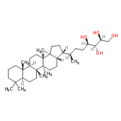{width="80%" fig-align="center"}

::: {.callout-solution}
Som kolesterol så er hopanoider polycykliske stoffer med en rigid, plade-agtig og hydrofob ringstruktur og en hydrofil ende. Den hydrofile -OH gruppe er dog i den modsatte ende af molekylet ift. kolesterol. 
:::

### Forudsig hopanoidernes membraneffekt

Hvilken effekt vil du forvente at hopanoid har på den bakterielle cellemembran?

::: {.callout-solution}
Hopanoider har samme funktion i bakteriers membran som kolesterol i vores membraner, dvs. de er med til at moderere fluiditeten ved at blokere for fedtsyrekædernes bevægelser.
:::


## Opgave 2. Helical wheel

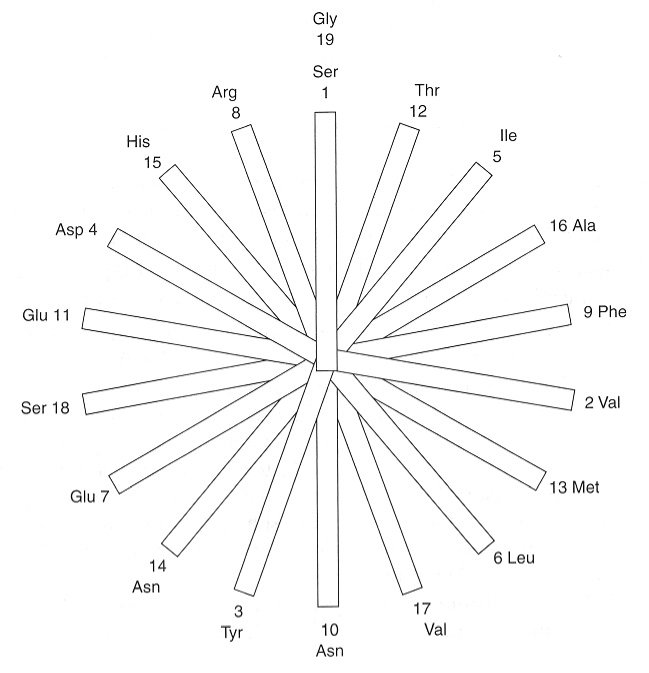{width="80%" fig-align="center" .lightbox}

Membranspændende helicer består typisk af 18 to 20 aminosyrer.

### Beregn hydrofob membranbredde

Beregn bredden af den hydrofobe del af cellemembranen baseret på dette.

::: {.callout-solution}
(18-20) \* 1.5 Å = 27 -- 30 Å.
:::


### Fortolk helical wheel-plot

Sekvensen af sådan en helix kan plottes i et såkaldt `helical wheel`, der viser positionen af hver aminosyrerest rundt om helicens akse.

Forklar hvilke egenskaber ved transmembrane helicer, der kan forudsiges på baggrund af et `helical wheel`-plot.

::: {.callout-solution}
Et helical wheel-plot kan afsløre hvis en transmembran (eller enhver anden) helix har visse egenskaber langs én af siderne, f.eks. er overvejende hydrofob.
:::


### Analysér amfipatisk helix

I eksemplet nedenfor, analysér positionen af de hydrofobe og hydrofile aminosyrerester. Hvordan stabiliseres de hydrofile sidekæder inde i membranen?

```
Ser-Val-Tyr-Asp-Ile-Leu-Glu-Arg-Phe-Asn-Glu-Thr-Met-Asn-His-Ala-Val-Ser-Gly
```

::: {.callout-solution}
De hydrofobe sidekæder vender mod højre i figuren mens de hydrofile peger mod venstre. Dvs. at helixen er amfiphatisk. 

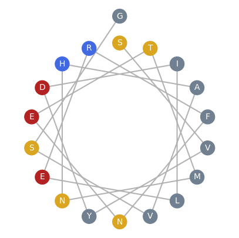{width="70%" fig-align="center"}
:::


### Vis prostaglandins ligander i PyMOL

Lav en scene, kaldet F1, der viser prostaglandin (PDB-ID: 1PTH). Hvilke ligander er bundet? Hvilke tror I findes i den native struktur og hvilke er produkt af krystalliseringsmetoden?

::: {.callout-solution}
Ligander:

- HEM: PROTOPORPHYRIN IX CONTAINING FE (Co-faktor)
- NAG: 2-acetamido-2-deoxy-beta-D-glucopyranose (N-linked glycosyleringer)
- BOG: octyl beta-D-glucopyranoside (detergent, krystallisation)
- SAL: 2-HYDROXYBENZOIC ACID (drug analog, krystallisation)
:::


### Analysér elektrostatisk membranlokalisering

Analyser den elektrostatiske overflade af prostaglandin. Lav en scene, kaldet F2, der viser dette. Hvordan er prostaglandin lokaliseret til membranen - forklar ud fra det beregnede elektrostatiske potentiale?

::: {.callout-solution}
Prostagladin er lokaliseret til membranen via det delvist integrerede (amphipatisk helix) -- som er hvide i det beregnede electrostatiske potentiale.
:::

### Analysér TM-helicernes elektrostatik

Kig nærmere på alphahelicerne mellem rest 74 og 124 og undersøg deres elektrostatiske overflade. Hint: Lav alphahelicerne et objekt. Analyser de enkelte helicers ligesom I gjorde med helix-wheel plottet. Stemmer det overens med det forventede?

::: {.callout-solution}
Helix 97-105 (2 kopier i dimeren) er meget hydrophob helix på den ydersiden (amphipatisk helix) som vil targeter prostagladin til membranen (se f. eks Stryer fig 12.23).

(Bemærk at der er en del positive ladninger (blå i beregnede electrostatiske potentiale) som sikker integrere med de negative ladede hovedgrupper på membranens lipider).
:::


## Opgave 3. Hydropatiplot

### Analyser hydropatiplot

Analysér nedenstående hydropatiplot for tilstedeværelse af transmembrane segmenter:

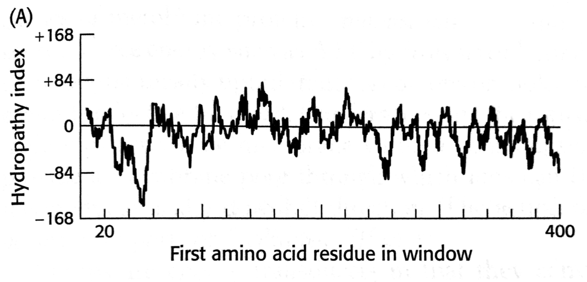{width="70%" fig-align="center" .lightbox}

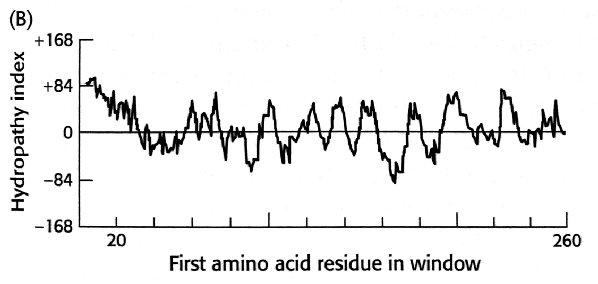{width="70%" fig-align="center" .lightbox}

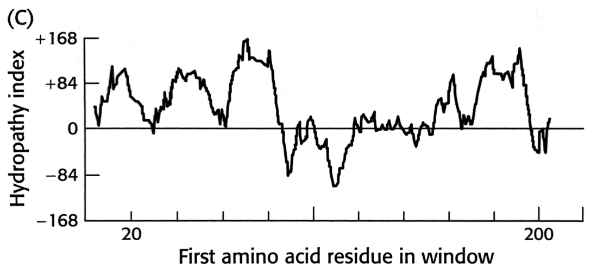{width="70%" fig-align="center" .lightbox}

::: {.callout-solution}
Proteinet i (C) har potentielle transmembrane helicer (3 i starten og 1 i slutningen). Dette ses ved at der er brede peaks, der ligger langt over støjniveauet.
:::

### Vurdér analysens usikkerheder

Hvilke usikkerheder ligger der i analysen?

::: {.callout-solution}
De andre proteiner *kan* have transmembrane segmenter, men vi kan ikke se det i hydropatiplottet. Forekommer der β-strands i membranen kan dette være næsten umuligt at se i sådan et plot. Faktisk er proteinet i (A) en porin, men dette kan ikke ses i plottet.
:::


## Opgave 4. Breast Cancer Resistance Protein (BCRP)

Kvinder med brystkræft udvikler af og til resistens mod et bredt spektrum af cytotoxiske medikamenter brugt i kemoterapien. Baggrunden for dette synes at ligge i en opregulering af ekspression af en række multidrug-resistance proteiner tilhørende gruppen af membranassocierede ABC-transportere. BCRP er en sådan transporter, hvis aminosyresekvens udledt fra cDNA er vist nedenfor.

```
1                  20                    40                    60
MSSSNVEVFI PVSQGNTNGF PATASNDLKA FTEGAVLSFH NICYRVKLKS GFLPCRKPVE
                   80                   100                   120
KEILSNINGI MKPGLNAILG PTGGGKSSLL DVLAARKDPS GLSGDVLING APRPANFKCN
                  140                   160                   180
SGYVVQDDVV MGTLTVRENL QFSAALRLAT TMTNHEKNER INRVIQELGL DKVADSKVGT
                  200                   220                   240
QFIRGVSGGE RKRTSIGMEL ITDPSILFLD EPTTGLDSST ANAVLLLLKR MSKQGRTIIF
                  260                   280                   300
SIHQPRYSIF KLFDSLTLLA SGRLMFHGPA QEALGYFESA GYHCEAYNNP ADFFLDIING
                  320                   340                   360
DSTAVALNRE EDFKATEIIE PSKQDKPLIE KLAEIYVNAS FYKETKAELH QLSGGEKKKK
                  380                   400                   420
ITVFKEISYT TSFCHQLRWV SKRSFKNLLG NPQASIAQII VTVVLGLVIG AIYFGLKNDS
                  440                   460                   480
TGIQNRAGVL FFLTTNQCFS VVSAVELFVV EKKLFIHEYI SGYYRVSSYF LGKLLSDLLP
                  500                   520                   540
MRMLPSIIFT CIVYFMLGLK PKADAFFVMM FTLMMVAYSA SSMALAIAAG QSVVSVATLL
                  560                   580                   600
MTICFVFMMI FSGLLVNLTT IASWLSWLQY FSIPRYGFTA LQHNEFLGQN FCPGLNATGN
                  620                   640
NPCNYATCTG EEYLVKQGID LSPWGLWKNH VALACMIVIF LTIAYLKLLF LKKYS
```

Hydrofobicitetsanalyse af BCRP giver desuden følgende resultat:

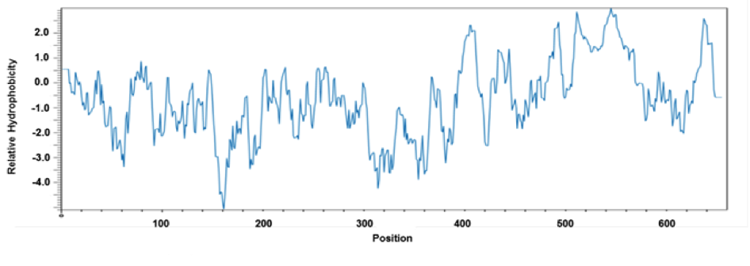{width="90%" fig-align="center" .lightbox}

### Identificér TM-helicer i BCRP-hydropatiplot

Hvilke egenskaber af hydropatiplottet understøtter idéen om at BCRP indeholder transmembrane helicer? 

::: {.callout-solution}
Flere områder med ret høje (hydrofobe) og brede peaks i plottet, specielt nær C-terminalen.
:::

### Anslå antal og placering af TM-helicer

Anslå antallet og den omtrentlige placering af de transmembrane helicer i BCRP.

::: {.callout-solution}
6 transmembrane helicer. omkring (390 -- 415), (430 -- 450), (470 -- 500), (505 -- 530), (535 -- 555) og (630 -- 640).
:::

### Find ATP-bindende kassette i sekvens

ABC-transportere indeholder en såkaldt ATP-bindende kassette og benytter energien fra ATP til selve eksportprocessen.

Foreslå hvilken del af sekvensen ovenfor, der indeholder den ATP-bindende kassette.

::: {.callout-solution}
Den N-terminale halvdel. Bonusinfo: P-loopet genfindes omkring 80-86.
:::

### Tegn BCRP-topologi i membran

For at forstå foldningen af membranproteinet indsatte man et peptid med sekvensen YPYDVPDYA på 12 forskellige positioner i BCRP-sekvensen. De resulterende konstrukter (samt vildtype BCRP og en negativ kontrol) blev herefter transfekteret i epithelceller og analyseret for evnen til at binde et radioaktivt mærket antistof rejst mod YPYDVPDYA-sekvensen. Resultatet af analysen er vist i tabellen nedenfor.

+-------------------+------------------------+-------------------------+
| **Konstrukt**     | **Substitution**       | **Radioaktiv mærkning** |
|                   |                        |                         |
|                   | **(position fra-til)** |                         |
+:=================:+:======================:+:=======================:+
| vildtype          |                        | \-                      |
+-------------------+------------------------+-------------------------+
| negativ kontrol   |                        | \-                      |
+-------------------+------------------------+-------------------------+
| N-term            | 2 - 10                 | \-                      |
+-------------------+------------------------+-------------------------+
| 1                 | 405 - 413              | \-                      |
+-------------------+------------------------+-------------------------+
| 2                 | 416 - 424              | ++                      |
+-------------------+------------------------+-------------------------+
| 3                 | 450 - 458              | \-                      |
+-------------------+------------------------+-------------------------+
| 4                 | 455 - 463              | \-                      |
+-------------------+------------------------+-------------------------+
| 5                 | 475 - 483              | \-                      |
+-------------------+------------------------+-------------------------+
| 6                 | 485 - 493              | \-                      |
+-------------------+------------------------+-------------------------+
| 7                 | 498 - 506              | \+                      |
+-------------------+------------------------+-------------------------+
| 8                 | 540 - 548              | \-                      |
+-------------------+------------------------+-------------------------+
| 9                 | 570 - 578              | ++                      |
+-------------------+------------------------+-------------------------+
| 10                | 635 - 643              | \-                      |
+-------------------+------------------------+-------------------------+
| C-term            | 655 - 663              | \-                      |
+-------------------+------------------------+-------------------------+

*Topologisk analyse af BCRP. ++ stærk, + medium og -- ingen mærkning.*

Lav en skitse af BCRP som det er indlejret i cellemembranen. Er N- og C-terminalerne placeret på samme eller modsatte side af membranen?

::: {.callout-solution}
Peptidet reagerer ikke med antistof hverken i N- eller C-terminalen, der må altså være et helt antal helicer. Position 420, 500 og 575 må desuden være udenfor membranen, idet de opmærkes.

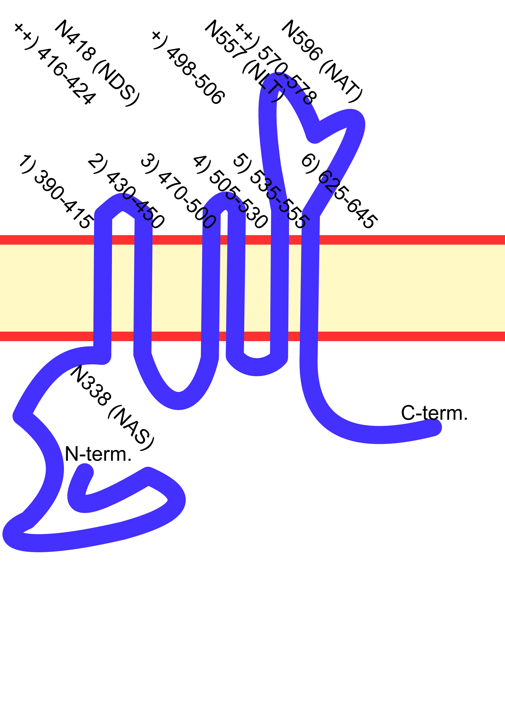{width="80%" fig-align="center" .lightbox}
:::


### Angiv mulige N-glykosyleringssites

Angiv mulige N-glykosyleringssites i sekvensen for BCRP.

::: {.callout-solution}
N338 (NAS) er et site, men formentlig ikke modificeret, da aminosyreresten ligger i cytoplasma. Der ud over findes N418 (NDS), N557 (NLT) og N596 (NAT).
:::

### Fortolk glykosyleringsanalysen

For at undersøge om BCRP er glykosyleret, muterede man desuden specifikke asparaginrester. Proteinekstrakter fra celler transfekteret med mutant BCRP blev derefter analyseret ved SDS-PAGE før og efter behandling med PNGase F. Resultatet af analysen vises nedenfor.

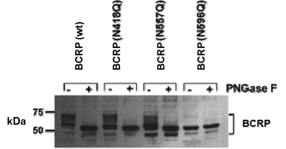{width="80%" fig-align="center" .lightbox}

Hvad fortæller analysen om glycosyleringerne i BCRP? Begrund dit svar.

::: {.callout-solution}
PNGase F spalter N-bundne oligosaccharider fra peptidkæden. N596 er glycosyleret i BCRP.
:::


## Opgave 5. 5'-Nucleotidase

Enzymet 5'-nucleotidase (5'-ribonucleotide phosphohydrolase) er et glycoprotein, der findes associeret med plasmamembranen i mange celler. Enzymet kan forholdsvis let isoleres fra placenta ved brug af detergenter og har en masse på 71 kDa som bedømt med SDS-PAGE.

### Beskriv 5'-nucleotidasens reaktion

Hvilken type reaktion antyder navnet at 5'-nucleotidase udfører?

::: {.callout-solution}
5'-nucleotidase = 5'-ribonucleotide phosphohydrolase. Navnet antyder at enzymet hydrolyserer nukleotider til nukleosider og phosphate (Fig. 25.17, s. 760).
:::

### Forklar detergentens rolle i oprensning

Ved gelfiltrering af det ekstraherede enzym på Sephacryl S-300-søjle under tilstedeværelse af 0.1% Triton X-100 (en detergent), eluerer enzymet svarende til et 150 kDa protein. Uden detergent eluerer enzymet i void-volumen som vist nedenfor.

{width="90%" fig-align="center" .lightbox}

Beskriv den rolle, detergenten spiller i oprensningen.

::: {.callout-solution}
Detergenten (amfipatisk molekyle) solubiliserer membranproteinet proteinet ved at interagere med de hydrofobe områder. Herved kan proteinet analyseres på en gelfiltreringssøjle som et opløseligt protein.
:::

### Bestem kvarternær struktur

Hvad er den mest sandsynlige kvarternære struktur af enzymet, når det er bundet til cellemembranen?

::: {.callout-solution}
Dimer.
:::

### Forklar interfaselokalisering

Aminosyresekvensen af human placental 5'-nukleotidase afledt fra cDNA er vist nedenfor. Enzymet syntetiseres med et signalpeptid på 26 rester samt et stærkt hydrofobt område umiddelbart før stopkodon.

```
1                             30                               60 
MCPRAARAPA TLLLALGAVL WPAAGAWELT ILHTNDVHSR LEQTSEDSSK CVNASRCMGG 
                               90                              120 
VARLFTKVQQ IRRAEPNVLL LDAGDQYQGT IWFTVYKGAE VAHFMNALRY DAMALGNHEF 
                             150                              180  
DNGVEGLIEP LLKEAKFPIL SANIKAKGPL ASQISGLYLP YKVLPVGDEV VGIVGYTSKE 
                             210                              240 
TPFLSNPGTN LVFEDEITAL QPEVDKLKTL NVNKIIALGH SGFEMDKLIA QKVRGVDVVV 
                             270                              300 
GGHSNTFLYT GNPPSKEVPA GKYPFIVTSD DGRKVPVVQA YAFGKYLGYL KIEFDERGNV 
                             330                              360 
ISSHGNPILL NSSIPEDPSI KADINKWRIK LDNYSTQELG KTIVYLDGSS QSCRFRECNM 
                             390                              420 
GNLICDAMIN NNLRHTDEMF WNHVSMCILN GGGIRSPIDE RNNGTITWEN LAAVLPFGGT 
                             450                              480 
FDLVQLKGST LKKAFEHSVH RYGQSTGEFL QVGGIHVVYD LSRKPGDRVV KLDVLCTKCR 
                             510                              540 
VPSYDPLKMD EVYKVILPNF LANGGDGFQM IKDELLRHDS GDQDINVVST YISKMKVIYP 
                             570 
AVEGRIKFST GSHCHGSFSL IFLSLWAVIF VLYQ
```

For at forstå enzymets associering med membranen blev det oprensede protein opløst i 45% myresyre og nedbrudt med CNBr i 20 timer, hvorefter reaktionsblandingen blev udrystet med hexan. Efter centrifugering observerede man tre lag, øverst et lag bestående af hexan, i bunden et lag af vandig myresyre og i interfasen mellem disse, et tyndt ugennemsigtigt lag. Dette tynde lag viste sig at indeholde et 3 kDa fragment, der efterfølgende blev behandlet med en endopeptidase specifik for lysinrester. Efter endnu en hexanekstraktion kunne man isolere et dipeptid fra interfasen.

Hvorfor findes 3 kDa-fragmentet og dipeptidet i interfasen mellem hexanfasen og den vandige fase?

::: {.callout-solution}
Både 3 kDa-fragmentet og dipeptidet må indeholde hydrophile og hydrophobe grupper for at blive lokaliseret i interfasen.
:::

### Lokalisér fragmenter i sekvensen

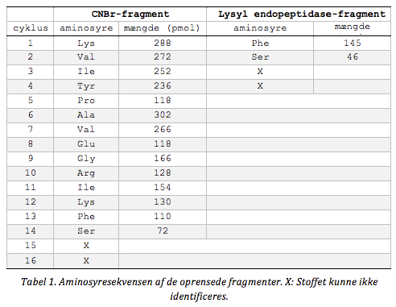{width="5.2647058180227475in" height="4.072103018372704in"}
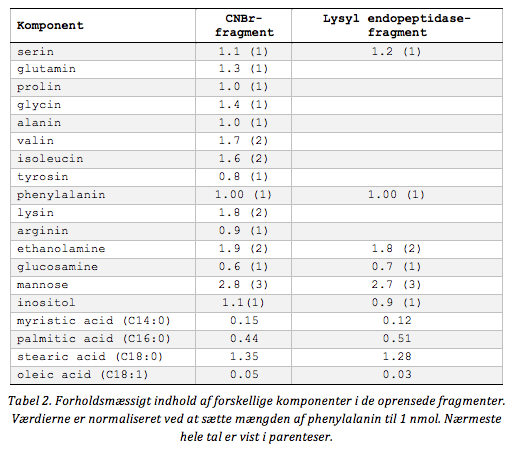{width="5.617646544181977in" height="4.956792432195975in"}

Aminosyresekvensen af CNBr-fragmentet og dipeptidet kan ses i Tabel 1 nedenfor mens sammensætningen af fragmenterne er vist i Tabel 2. Begge fragmenter indeholder et komplekst glykolipid og udover komponenterne listet i tabellerne indeholder fragmenterne også glycerol og phosphat. Glykosamine var desuden på formen N-acetyl glukosamine.

Lokalisér 3 kDa-fragmentet og dipeptidet i aminosyresekvensen. Hvilken rest udgør C-terminalen i det modne enzym?

::: {.callout-solution}
CNBr spalter efter Met. Ét CNBr fragment, 536--574, matcher aminosyresekvensen i Tabel 1, men er for stort (4.2 kDa), så man må forvente C-terminal processering. Dette understøttes af dipeptidsekvensen idet det K som kommer før i sekvenserne er det sidste K i peptidet. Derfor må S549 i cDNA sekvensen være den C-terminale rest, og noget andet må være koblet til den, enten via sidekæde --OH eller til C-teminus.
:::
 
### Find glykolipid-bindingsrest

Hvilken aminosyrerest er kovalent bundet til glykolipidet?

::: {.callout-solution}
Den C-terminale Ser 549. Tabel 2 antyder at det er et glycolipid som er koblet til proteinet. Fig. 12.25 viser eksempler på membranankre.
:::
 
### Identificér GPI-membrananker

Enzymet kan frigøres fra membranen ved behandling med en inositolspecifik phospholipase C. Hvordan kunne man forestille sig at det er forankret til membranen?

::: {.callout-solution}
GPI-anker (Fig. 12.25). Den inositol-specifikke phospholipase C frigør sukkerdelen fra glycerol-backbone.
:::
 
### Beskriv GPI-ankermodifikation

Foreslå hvordan det hydrofobe område nær C-terminalen kan være involveret modifikation af enzymet. Hvor i cellen finder denne modifikation sted?

::: {.callout-solution}
Signalpeptidet dirigerer translationsprocessen til ER, mens den hydrophobe C-terminal forbliver i ER-membranen. Efterfølgende bliver den hydrophobe ende spaltet fra og erstattet af GPI-ankeret. Herefter overføres proteinet til Golgi og sendes herefter ud af cellen.
:::

 
### Bestem enzymets membranlokalisering

På hvilken side af plasmamembranen er 5'-nucleotidase lokaliseret? Diskutér mulige, biologiske roller for enzymet.

::: {.callout-solution}
Enzymet må være placeret på ydersiden af cellen pga. den måde, det processeres på. Det fungerer ifm. næringsoptag ved at hydrolysere nukleotider til nukleosider, hvilket tillader dem at passere membranen, da de ikke længere er ladede.
:::
