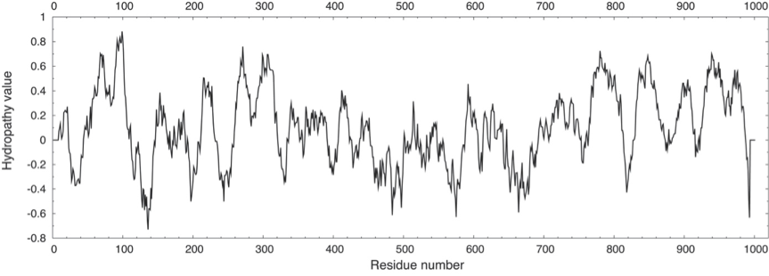
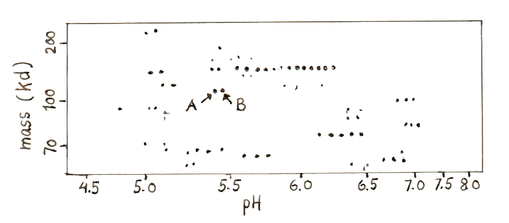

## Opgave 1. Na/K-pumpen fra skeletmuskulatur

I skeletmuskulatur hos hunde er de ekstra- og intracellulære koncentrationer af Na^+^ henholdsvis 150 mM og 12 mM, hvor de for K^+^ er 2.7 mM og 140 mM.

### Beregn fri energi for Na/K-pumpe

Beregn ændringen i fri energi når tre Na^+^ transporteres ud og to K^+^ transporteres ind via Na-K-pumpen. Antag at temperaturen er 25°C og at membranpotentialet er -60 mV.

### Vurdér ATP-hydrolysens energi

Ville hydrolyse af et enkelt ATP-molekyle til ADP frigive tilstrækkelig energi til at drive processen? Forklar.

::: {.solution-callout}

**1.**  (3 $\cdot$ Na^+^(12.05) + 2 $\cdot$ K^+^(3.99)) kJ/mol = 44.10 kJ/mol.\
    T temperatur i K (25C = 298K), R = Gas konstant (8.315 $\cdot$ 10^-3^ kJ mol^-1^ deg(K)^-1^),\
    F = Faraday constant (96.5 kJV^-1^ mol^-1^).

**2.**  Hydrolyse af én phosphodiesterbinding i ATP giver ca. 50 kJ/mol og at det dermed netop er nok til at drive processen.
:::

## Opgave 2. Calciumpumpen

De såkaldte `fast twitch`-muskelceller fra kaniner indeholder store mængder af den sarco(endo)plasmatiske reticulum calcium ATPase (SERCA).

### Forklar SERCA-modning i ER

Forklar hvorledes modningen af SERCA må forventes at forløbe for at lokalisere pumpen i den korrekte membran

```sh
(hint: Figur 30.34 i Berg).
```
Nedenfor vises et hydropatiplot for SERCA.

{width="6.268055555555556in" height="2.247916666666667in"}

### Estimér SERCA's transmembrane helicer

Estimér antallet af transmembrane helicer i SERCA og deres omtrentlige placering. Forklar hvordan du når frem til dette.

Koncentrationen af frit calcium i cytoplasma er omkring 0.15 μM, mens den inde i det sarcoplasmiske reticulum ligger på omkring 1.5 mM. Det er calcium ATPasen, der er ansvarlig for at opretholde denne gradient vha. hydrolyse af ATP. Der er derimod i praksis ingen elektrisk potentialeforskel på tværs af SR-membranen.

### Beregn energi for calciumtransport

Beregn forskellen i Gibbs frie energi (i kJ/mol) ved processen hvor to calciumioner transporteres fra cytoplasma til SR, dvs. svarende til én cyklus for SERCA.

::: {.solution-callout}

**1.**  SRP (signal recognition particle) opfanges og translationen foregår direkte ind i SR.

**2.**  Der er 5 (7) TM i N-terminalen (residues 50-350) og 5 i C-terminalen (750-1000).

**3.**  2x23.74 kJ/mol = 47.48 kJ/mol. Passer med to ioner per ATP. (Man antages at proton-koncentrationen er identisk i cytosol og i lumen af sarcoplasmic reticulum dermed bidrager H^+^ antiportering ikke til energiregnskabet ved et membran-potentiale på 0).
:::

## Opgave 3. Brodys sygdom

*Brodys sygdom* er en sjælden arvelig sygdom forårsaget af en defekt i ATP2A1-genet, der koder for den almindeligste SERCA1-isoform i det sarcoplasmiske reticulum. Tabellen nedenfor viser en række kinetiske data mål for den calciumstimulerede ATPase-aktivitet i muskelhomogenisater fra kontrolpatienter samt patienter med Brodys sygdom.

  ------------------------------------------------------------------------------------
  **Parameter**                                          **Kontrol**   **Patienter**
  ------------------------------------------------------ ------------- ---------------
  Ca2+-ATPase aktivitet (nmol/mg total protein)          43.9 ± 6.0    23.4 ± 3.5

  kcat (min-1)                                           810 ± 87      411 ± 49

  Ca2+-ATPase (mg/mg total protein)                      6.12 ± 0.75   6.11 ± 0.41

  Mængden af SERCA1 i forhold til SERCA totalt set (%)   82.8 ± 4.6    83.4 ± 3.9
  ------------------------------------------------------------------------------------

### Fortolk Brodys sygdoms kinetik

Foreslå en biokemisk fortolkning af de målte data i tabellen. Brug herefter din viden om SERCA's fysiologiske funktion i muskelfibre til at foreslå hvilke symptomer, patienter med Brodys sygdom kunne tænkes at opleve.

Et eksperiment blev udført med membranvesikler indeholdende både SERCA og membranproteinet bacteriorhodopsin. ATP blev tilsat til prøven i mørke, hvilket resulterede i målbar ATPase-aktivitet. Efter et stykke tid stoppede denne aktivitet dog selv om der stadig var ATP til stede i opløsningen. Tændte man derimod lyset, genoptoges ATPase-aktiviteten. (Hint: Når calcium flyttes, kotransporterer (antiporterer) SERCA protoner i den anden retning, og det vides at der i gennemsnit flyttes 1.5 proton per calciumion).

### Forklar bacteriorhodopsin-eksperiment

Forklar resultaterne i SERCA/bacteriorhodopsin-eksperimentet.    

::: {.solution-callout}

**1.**  Patienterne med Brody's disease har den halve Ca^2+^-ATPase aktivitet (linje 1) på trods af samme relative mængde protein (linje 3 og 4). De har også den halve kcat (turnover). Isoform 1 må simpelthen være mindre aktiv. Muskelkramper ved fysisk aktivitet.

**2.**  Med tiden vil pH blive så høj inde i vesiklerne at pumpen ikke kan fungere, på trods af tilstedeværelsen af ATP på ydersiden. Bacteriorhodopsin bruger lys til at transportere protoner fra en bakteriel celles protoplasma til ydersiden (se bla lærebogen figur 12.18). Tilførelsen af lys bevirker pumpning af protoner fra cytoplasma (udefra) og ind i vesiklerne og neutraliserer altså effekten af ATPasen.
:::

## Opgave 4. Strukturen af SERCA

Calcium-pumpen fra sarcoplasmisk reticulum (SERCA) blev oprenset af danske forskere fra kaninmuskler, hvorefter strukturer af flere forskellige konformationer blev bestemt vha. røntgenkrystallografi. Find og brug SERCA.pml i opgave-mappen.

Identificér først det transmembrane område i SERCA. Hilken ende af strukturen vender ind mod SR og hvilken ende vender mod cytoplasma? Hvorfor skal pumpen vende på denne måde? 

### Identificér SERCA-domæner

I oversigtsstrukturen (F1) er SERCAs domæner vist med forskellige farver. Identificér domænerne og angiv kort deres funktion i pumpen.

### Beskriv SERCAs konformationstilstande

Brug F1-F5 til at skifte mellem fem forskellige tilstande. Hvilke tilstande er disse? (Hint: Benyt objektnavnene til højre i vinduet) Forklar kort hvad der sker i mellem hver tilstand.

### Identificér vigtig aminosyre

Tryk F6 for at zoome ind på en vigtig aminosyre for pumpen. Hvilken aminosyre er dette og hvilken rolle spiller den? 

### Beskriv aminosyrens modifikation

Aminosyren bliver modificeret som led i enzymets funktion. Da modifikationen er ustabil har man i krystalstrukturen brugt en analog modifikation. Klik på modifikationens atomer og identifér den. Hvilken modifikation repræsenterer analogen og er det en god analog? Hvad interagerer modifikationen med og hvordan påvirker det enzymets struktur?

### Analysér dephosphoryleret tilstand

Tryk endelig F7 for at se aminosyren i en anden tilstand. Hvilken tilstand er dette og hvordan er enzymet forandret?

::: {.solution-callout}

**1.**  Det er farvet med lysegrøn, gul og lyseblå. Domænerne ovenfor binder og hydrolyserer ATP og vender derfor mod cytoplasma. SR-siden er nedad i denne orientering.

**2.**  N domain (blåt), P domain (grønt), A domain (rødt). Se lærebogens figur 13.4.

**3.**  Sammenlign med lærebogens figur 13.5: E1 svarer til `E1-(Ca2+)2` , E1P til `E1-P-(Ca2+)2(ADP)`, E2P svarer til `E2-P`, E2-P svarer til `E2-P` umiddelbart efter dephosphoryleringen og E2 svarer til `E2`.

**4.**  Asp351 phosphoryleres som led i reaktionscyklen og styrer dermed koblingen mellem ATP hydrolyse og ionpumpning.

**5.**  Aminosyren bliver phosphoryleret i `P`-tilstandene under reaktionen. I strukturen er Asp modificeret med BeF3 (beryllium fluorid), der efterligner phosphatgruppen men er mere stabil. Det er en god analog, i det den har samme tetraedriske opbygning som -PO33- og også som denne har tre elektrongative grupper. Gruppen interagerer med Lys684 (saltbro) og Thr624 (H-binding), hvilket er med til at holde pumpen i den lavaffine tilstand (ingen Ca-bindingssteder).

**6.**  Asp351 er dephosphoryleret, hvilket betyder pumpen falder tilbage i den højaffine tilstand med 2 Ca-bindingssteder.
:::

## Opgave 5. Na-K-pumpen

Na+-K+-pumpen (Na+-K+-ATPasen) findes som et integreret membranprotein i pattedyr og dets 1020-aminosyrerester lange sekvens er blevet bestemt ud fra cDNA. I et eksperiment brugte man ekstrakt fra leverceller til en proteomanalyse bestående af todimensionel gelelektroforese efterfulgt af identifikation af enkelte proteinspots ved trypsinering og massespektrometrisk analyse. En del af den todimensionelle gel er vist nedenfor.

{width="6.35294072615923in" height="2.7865387139107614in"}

Både spots A og B matchede aminosyresekvensen for Na+-K+-ATPasen, men en detaljeret analyse af massespektrene afslørede en interessant forskel: Et fragment med massen 1947.22 Da fra spot A kunne ikke genfindes blandt peptiderne i spot B. Desuden gav spot B et fragment på 1867.89 Da, der meget præcis passer med massen af peptidet NLEAVETLGSTSTICSDK i Na+-K+-ATPasen.

For at identificere fragmentet på 1947.22 Da blev det oprenset og analyseret vha. Edman-degradering, hvilket gav følgende sekvens: Asn-Leu-Glu-Ala-Val-Glu-Thr-Leu-Gly-Ser-Thr-Ser-Thr-Ile-Cys-Ser-Xaa-Lys. Xaa kunne ikke identificeres.

### Sammenlign spot A og spot B

Hvordan adskiller proteinet i spot A sig fra proteinet i spot B?

### Forklar masseforskel i peptider

Hvad skyldes masseforskellen mellem de fundne, tryptiske fragmenter?

### Identificér modificeret aminosyre

Hvilken aminosyrerest svarer Xaa i spot A til? Opskriv dens kemiske struktur.

### Beskriv phosphoryleringsrestens rolle

Hvilken rolle spiller denne rest i Na+-K+-ATPasens funktion?

::: {.solution-callout}

**1.**  De to spots, A og B, indeholder begge Na-K ATPasen, men må have en ladningsforskel.

**2.**  Vi kan se fra de to sekvenser, at det er Asp (D), der er modificeret og ikke kan læses i spot A. Denne aminosyre må være modificeret i den ene form af proteinet.

**3.**  Det er en phosphoryleret Asp med masseforskel ca. 80 Da.

**4.**  Phosphorylering af Asp er en vigtig del af P-type ATPasernes virkningsmekanisme ("P-type" netop af denne grund), der er med til at sikre at forbrænding af energi i ATP altid kobles til transport af ioner.
:::
