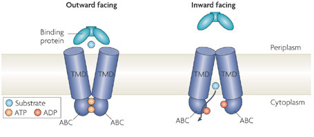
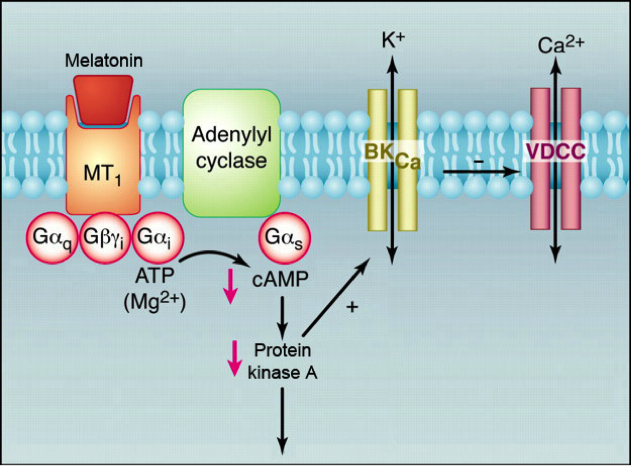
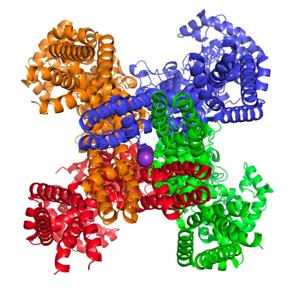
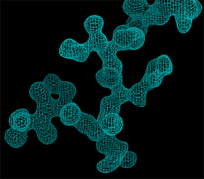
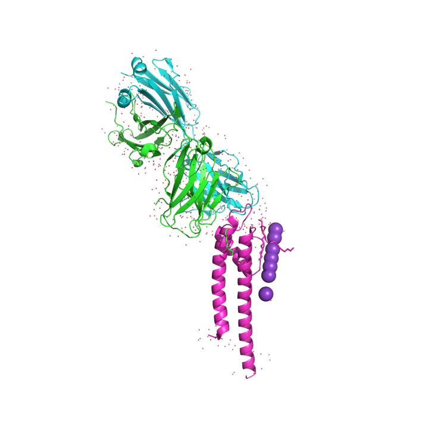

## Opgave 1. ABC-transporteren

ATP Binding Cassette (ABC)-transportere bruges til næringsimport i bakterier og generelt til eksport i eukaryoter og forbrænder ét ATP-molekyle hver gang der transporteres et substratmolekyle:

{width="6.263888888888889in" height="2.7291666666666665in"}

For at vise konformationerne af ABC-transporteren kan man bruge Multidrug resistance protein 1a MRP1a (PDB-ID: 3G5U) og Permease protein msbA (PDB-ID: 3B60).

1.  Lav to scener, kaldet F1 og F2, som viser hhv. den udadvendte og den indadvendte konformation af ABC-transporteren. Hvilken PDB-struktur viser hhv. den udadvendte og den indadvendte konformation? Hvorfor er det muligt at bruge to forskellige proteiner til at vise konformationerne?

2.  Identificér det membranspændende område(r) samt de(t) ATP-bindende domæne(r). Angiv desuden hvilken del af transporteren, der peger ud af cellen og hvilken del, der peger indad.

**PyMOL info**: I tidligere TØer blev i introduceret for hvordan i selv kunne lave API'er i PyMOL. Det er der allerede mange, der har gjort og har efterfølgende offentliggjort deres kode på bl.a. PyMOL wiki. En af disse API'er er funktionen [Findseq](https://pymolwiki.org/index.php/Findseq). Findseq er en funktion, som gør det muligt at søge objekter og selektioner igennem for visse sekvenser. Funktionen importes til PyMOL sessionen med kommandoen run og man skal sørge for at man har sessionen åbnet i den mappe som API-scriptet befinder sig i. Kan man ikke huske, hvordan man gør dette er en god idé at se video 6 om PyMOL API igen og/eller kigge på beskrivelser af pwd, ls og cd-kommandoerne. Funktionen kaldes ved at man skriver Findseq \<sekvens i etbogstavsforkortelse>, \<objekt/selektion>. Kig nærmere på [PyMOL wiki](https://pymolwiki.org/index.php/Findseq), hvis det er svært at forstå. Findseq-funktionen har den smarte funktion, at man både kan vælge at søge efter fulde sekvenser, men man kan også søge efter hvad der kaldes en "regular expression". Der er mange forskellige tegn som for eksempel`.`, som betyder at enhver base er tilladt eller \[X/Y/Z\], som betyder at aminosyre X, Y eller Z er tilladt. På den måde kan man også søge i mere uspecifikke konsensussekvenser. Brug ikke selve funktion i dit script, men i stedet brug resultaterne til at finde relevante områder, som kan fremvises i dit script.\
\
Walker-A motivet, også kaldet P-loop eller Walker loop, er et konserveret motiv som findes i mange ATP og GTP bindende proteiner og det har konsensussekvensen GxxxxGK(S/T).

3.  Brug Findseq-funktionen til at finde Walker-A motivet i begge strukturer. Lav to scener kaldet F3 og F4, som tydeligt viser de to sekvenser og deres interaktioner.\
    Hvad er sekvenserne her? Hvilket domæne befinder de sig i? Hvad er det WalkerA motivet i msbA binder til? Hvorfor tror du denne ligand ikke ses i MRP1a?

4.  Kig nærmere på Tyr351 i msbA og lav en scene kaldet F5, som viser denne. Hvilken rolle kunne denne aminosyre have?

5.  Kig igen på scenerne F3 eller F4. Hvad er specielt ved Ser i Walker-A sekvensen og hvad kunne dens rolle tænkes at være?

Walker B motivet har konsensussekvensen hhhhDE, hvor h er hydrophob.

6.  Brug Findseq til at finde Walker-B sekvensen i msbA og lav en scene kaldet F6, som viser dette. Hvilken sekvens skal sættes ind i funktionen? Hvad er sekvensen her sammenlignet med konsensus? Hvad er den næstsidste sidekæde i motivets rolle?

:::: {.content-hidden when-profile="exercise"}
::: {.callout-important}

## Officielt svar

1.  Multidrug resistance protein (MRP1a) viser den indadvendte konformation og Permease protein (msbA) viser den udadvendte konformation. De to proteiner er homologer, har samme mekanisme og kan derfor bruges til at sammenligne og forstå konformationsændringerne under transport.

2.  Der er to kæder, som danner en dimer. De ATP-bindende domæner er markeret med orange og rød, og de eksisterer på cytosol-siden af cellemembranen (det kan vi vide fordi der ikke eksisterer ATP uden for cellen). De blå og turkis domæner går genem membranen, men længden af disse er > 90 Å, så membranen udspænder kun en del af dette område.

3.  Sekvensen af Walker A-motivet i mrp1a-strukturen er: GRSGSGKS. Konsensussekvensen er GxxxxGK(S/T), hvor x angiver en hvilken som helst sidekæde. WalkerA motivet i msbA binder til ATP analogen ADPNP og da MRP1a strukturen er i den indadvendte konformation ses ingen ATP-binding.

4.  Sidekæden er tyrosin (Tyr). Den vekselvirker med basen med en *stacking*-interaktion, som f.eks. også ses i DNA. Interaktionen kaldes også for π (pi)-stacking, da den skyldes π-orbitalerne i de aromatiske carbonringe.

5.  ATP's γ-phosphat vekselvirker med hydrogenbindinger til Ser378 i Walker A-motivet, men også til Ser482 i dimer-partneren, som herved kan sanse tilstedeværelsen af en γ-phosphat.

6.  I MRP1a-strukturen er sekvensen af Walker B-motivet ILILDE. Konsensussekvensen er hhhhDE, hvor h angiver en hydrofob sidekæde. Den næstsidste sidekæde (Asp505) danner en H-binding med Ser383 i det aktive site, hvilket kan tænkes at orientere serinen (fra Walker A, konserveret) som herved binder stærkere til ATP's beta-phosphate.\
    \
    "\[A/V/I/L/M/F/Y/W\]\[A/V/I/L/M/F/Y/W\]\[A/V/I/L/M/F/Y/W\]\[A/V/I/L/M/F/Y/W\]DE"
:::
::::

## Opgave 2. Melatonin

Melatonin (5-methoxy-N-acetyl tryptamine), der også kaldes "mørkets hormon", syntetiseres af pinealkirtlen i hjernen i døgnets mørke timer og forårsager træthed. Hormonet blev opdaget i 1959, men det var først i 1987 at man fandt ud af at melatonin inhiberer den cellulære produktion af cAMP og dermed har en dybdegående indvirkning på metabolismen.

Figuren nedenfor viser samspillet mellem MT1, en G-koblet melatoninreceptor, adenylyl cyclase samt flere membranindlejrede ionkanaler. Binding af melatonin til den G-koblede receptor leder til inhibering af adenylyl cyclase via Gαs og dermed formindsket cAMP-syntese.

{width="5.84799978127734in" height="4.3131102362204725in"}

1.  cAMP påvirker Protein Kinase A (PKA). Hvilken effekt har cAMP på PKA og hvad er normalt effekten på cellens metabolisme ved aktivering af PKA?

Når PKA aktiveres påvirkes to membranbundne kanaler, den calcium-sensitive K+-kanal BKCa og den strømstyrede (voltage-gated) Ca2+-kanal VDCC. 

2.  I hvilken retning flyder K+- og Ca2+-ioner gennem BKCa og VDCC når de åbnes? Forklar.

De to kanaler er modsat regulerede, således at PKA-phosphorylering aktiverer BKCa mens aktiviteten af denne inhiberer VDCC (se figuren). Én af effekterne af frigivelsen af melatonin er vasokonstriktion, dvs. en muskelafhængig sammentrækning af blodkar.

3.  Hvad må der ske med Ca2+-koncentrationen i muskelceller under vasokonstriktion og hvordan hænger det sammen med ovenstående pathway?

:::: {.content-hidden when-profile="exercise"}
::: {.callout-important}

## Officielt svar

1.  cAMP aktiverer PKA via løsrivelse af pseudosubstratet som beskrevet i Stryer. Aktivering af PKA leder til phosphorylering af en lang række cellulære proteiner og dermed har mange forskelligartede effekter rundt i metabolismen.

2.  De normale, intracellulære koncentrationer af K^+^ og Ca^2+^ er sådan at kalium findes i en relativt høj koncentration (ca. 150 mM) mens calcium findes i meget lav koncentration (0.1 μM). Når kanalerne åbnes vil K+ derfor flyde ud og Ca2+ ind.

3.  Ca2+-koncentrationen må stige for at musklerne kan kontrahere under vasokonstriktion, dermed må VDCC være aktiv (åben). Binding til receptoren inhiberer syntesen af cAMP og dermed inaktiverer PKA (indirekte). Dette leder til at BKCaikke phosphoryleres og dermed ikke aktiveres. Da aktiviteten af BKCa har en negativ effekt på VDCC må denne derfor (indirekte) aktiveres.
:::
::::

## Opgave 3. Ionkanaler 

Ionkanalen KV1.2 er opbygget af 6 helicer (S1, S2, S3, S4, S5 og S6). Det isoelektriske punkt (pI) for helix S4 er 10,2 hvor imod de andre helicer har pI på mellem 6,7 og 7,9.

1.  Hvilket fortegn har ladning af S4 have under fysiologiske betingelser og hvorfor er det vigtigt at S4 har en høj pI-værdi?

2.  De første 60 aminosyrer i N-terminalen af KV1.2 er ikke synlige i krystalstrukturen, men når disse trunkeres (KV1.2-delta60) lukker kanalen ikke som normalt. Hvad kan være forklaringen på at de første 60 aminosyrer ikke ses, og hvad er funktionen af disse aminosyrer i kanalen?

Hent strukturen af ionkanalen (PDB-ID: 2A79) i PyMOL og udfør kommandoen: symexp sym, 2A79, (2A79), 50

3.  Angiv som dit svar en PyMOL-figur, der viser de kæder, der udgør en funktionel kanal og angiv den kvaternære struktur.

4.  Analyser strukturen, identificér og opskriv de aminosyrer som binder kalium. Hvilken rolle har disse aminosyrer for kanalens funktion?

:::: {.content-hidden when-profile="exercise"}
::: {.callout-important}

## Officielt svar

1.  S4 vil være positivt ladet ved fysiologiske betingelser (ca. pH 7.4). S4 er en positiv ladet helix som gør kanalen spændingstyret. S4 er en del af kanal padlerne som skifter konformation når membranen depolariseres og åbner kanalen.

2.  De N-terminal 60 aminosyrer udgør "ball-and-chain" delen af kanalen som er fleksibel og derfor ikke synlige i krystalstrukturen. Denne del af er i stand til at inaktivere kanalen og lukke for iontransporten.

3.  KV1.2 har 4 identiske kæder (tetramer).

{width="1.7027023184601924in" height="1.7124321959755031in"}

4.  Disse aminosyere udgør selektivitetsfilter (TVGYG) som gør kanalen selektiv for kun kalium.
:::
::::

## Opgave 4. Strukturbestemmelse af en kanal

1.  Beskriv fordele og ulemper ved røntgenkrystallografi og cryo-elektronmikroskopi (cryo-EM) som metoder til at bestemme proteinstrukturer.

Til strukturbestemmelse af en bakteriel K^+^-kanal har forskere oprenset og krystalliseret proteinet, derefter indsamlet røntgendiffraktionsdata og beregnet et elektrontæthedskort, hvoraf et udsnit vises nedenfor.

{width="2.8102187226596675in" height="2.6142672790901136in"}

2.  Beskriv foldningen af peptidkæden, der observeres, herunder om der ses tegn på sekundær struktur og kom med forslag til hvilke fire aminosyrer, der ses på udsnittet. Forklar endeligt hvordan kædens retning (N- til C-terminal) kan bestemmes ud fra tætheden.

For at løse strukturen har forskerne brugt et Fab-fragment til at stabilisere K^+^-kanalen under krystallisation. Strukturen indeholdende både Fab-fragment og K+-kanal findes i PDB med ID **1K4C**.

3.  Forklar først hvad et Fab-fragment er og hvorfor det kan bruges til at stabilisere strukturen af K^+^-kanalen. Hent dernæst **1K4C** i PyMOL og gør rede for hvilke domæner Fab-fragmentet og K^+^-kanalen indeholder samt hvilke peptidkæder, der indgår i de to molekyler.

Strukturen indeholdt i **1K4C** repræsenterer kun en del af en intakt K^+^-kanal.

4.  Forklar hvordan strukturen af den intakte K^+^-kanal relaterer sig til **1K4C**, herunder den oligomere tilstand af K+-kanalen. Angiv desuden en PyMOL-kommando, der kan bruges til at generere strukturen af den komplette kanal.

:::: {.content-hidden when-profile="exercise"}
::: {.callout-important}

## Officielt svar

1.  Røntgenkrystallografi er velegnet til at bestemme atomare detaljer, herunder atompositioner og bindinger, men kræver meget rent protein og krystaller, hvilket kan være udfordrende at opnå for nogle proteiner. Oftest opnås kun strukturen af den mest almindelige tilstand af proteinet.\
    \
    Cryo-elektronmikroskopi (cryo-EM) er velegnet til at studere store komplekser og membranproteiner i deres naturlige tilstand. Det kræver ikke krystallisation, men ofte skal man gennem omfattende prøveoptimering før en struktur opnås. Cryo-EM har dog ofte en lavere opløsning sammenlignet med røntgenkrystallografi, til gengæld kan man nogle gange være heldig at kunne løse flere konformationer fra én dataopsamling.

2.  {width="1.5798611111111112in" height="2.627083333333333in"}Der ses ikke nogen tydelig sekundær struktur (ingen H-bindinger mellem hovedkædens atomer. Sekvensen er Pro-Leu-His-Ile (nede fra venstre og op mod højre), hvilket ses af sidekædetæthed og positionen af carbonylgrupper:

3.  Svar: Et Fab-fragment er den epitopbindende del af et antistof, der binder med meget høj affinitet til target og dermed stabiliserer dette. I figuren til højre ses Fab-fragmentet og dets to IgG-domæner øverst i grøn og cyan (kæderne A og B) mens K+-kanalen vises nederst med dens transmembrane helicer (magenta, kæde C) og K^+^-ioner (lilla kugler). Solventmolekyler er vist med små, røde kugler.

4.  Den intakte struktur er en tetramer med fire kopier svarende til den i 1K4C. Man kan bruge kommandoen `symexp`, f.eks.\

    ```python
    symexp sym, 1k4c, all, 1
    ```

    til a generere den intakte kanal. Cut-off-værdien 1 kan justeres så der ikke kommer for mange symmetrirelaterede molekyler frem.
:::
::::
