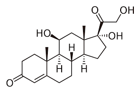
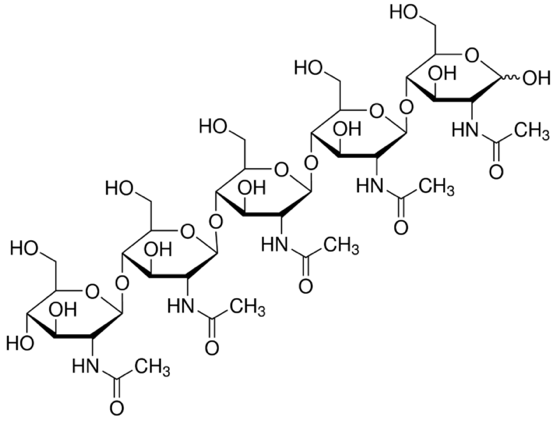
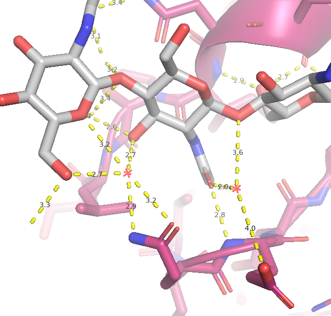
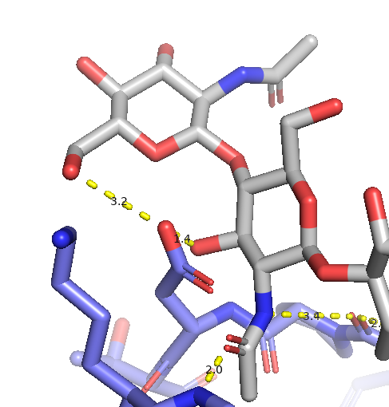
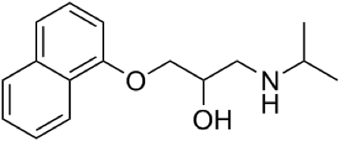

## Opgave 1. Earl W. Sutherland 

Ét af de første eksperimenter, der påviste sammenhængen mellem adrenalin og glykogen blev udført tilbage i 1950 af Earl W. Sutherland. Analysér og fortolk de eksperimenter, Earl foretog og identificér X:

1.  Da Earl tilsatte adrenalin til et homogenat af lever blev resultatet øget aktivitet af enzymet glykogen phosphorylase, men hvis homogenatet først blev centrifugeret og adrenalin og glykogen blev tilsat til supernatant-fraktionen var der ingen øget aktivitet af glykogen phosphorylase. Forklar hvordan dette kan være.

2.  Når homogenat blev behandlet med adrenalin blev stoffet X dannet. X blev oprenset og isoleret og i modsætning til adrenalin så kunne X aktivere glykogen phosphorylase, når det blev tilsat til supernatant-fraktionen af homogenatet. Forklar resultatet.

3.  Da X blev varmebehandlet beholdt det kapaciteten til at stimulere phosphorylasen. Hvordan kan det være?

:::: {.content-hidden when-profile="exercise"}
::: {.callout-important}

## Officielt svar

X er cAMP og dets produktion stimuleres af adrenalin.

1.  Centrifugeringen sedimenterer adenylate cyclase som er membranbundet og katalyserer produktionen af cAMP.

2.  Tilsætning af cAMP stimulerer glycogen phosphorylase.

3.  cAMP er varmestabilt i modsætning til et protein som normalt denaturerer ved varmebehandling.
:::
::::

## Opgave 2. Signalgenkendelse

Visse planter indgår i symbiose med nitratfikserende bakterier. Planten optager bakterier i såkaldte noduler, hvor bakterierne varetager opgaven at fiksere dinitrogen (N~2~) fra atmosfærisk luft til ammoniak (NH~4~^+^) som planten kan bruge til cellulære processer såsom aminosyresyntese. Til gengæld lever bakterierne beskyttet i nodulerne hvor de også forsynes med produkter fra plantens photosyntese som energikilde. For at planten optager bakterierne, genkendes sukkermolekyler placeret bakteriernes overflader.

1.  Hvordan genkendes disse sukkermolekyler og hvorfor er det vigtigt at denne genkendelse er specifik?

2.  Et forskerhold har identificeret nogle mulige signalmolekyler, som ses forneden - hvor er det mest sandsynligt at finde den specifikke receptor til disse to signaler og hvorfor?

{width="1.3388429571303586in" height="0.8912642169728784in"} {width="2.4786329833770777in" height="1.8716699475065617in"}\
Figur 1

Den ekstracellulære del af LysM receptorer binder kulhydrat signalmolekyler og disse ectodomæner er opbygget af tre LysM moduler adskilt af svovlbroer. Ved hjælp af røntgenkrystallografi er strukturen af CERK1 ectodomænet fra *Arabidopsis* blevet bestemt i kompleks med liganden chitin (PDB-ID: 4EBZ). 

3.  Undersøg strukturen af CERK1 i PyMOL og definer de tre bindingsdomæner (LysM1, LysM2 og LysM3) ud fra svovlbroerne og kald scenen F1. Vis svovlbroerne tydeligt. Undersøg receptoren og ligand-bindingsstedet og identificer CERK1's posttranskriptionelle modifikationer.

4.  Hvordan genkender CERK1 chitin liganden specifikt? Undersøg desuden om der er vandmolekyler, der kan tænkes at interagere med både ligand og protein. Lav en scene, kaldet F2, der viser dette. Hint: brug ikke remove solvent, da vand også er en vigtig interaktion. Evt. bruge remove solvent til H2O, der ikke er involveret i interaktion med remove solvent and not resi X+..+X

Den homologe receptor CERK6 fra planten *Lotus* er ligeledes bestemt dog uden chitin ligand (PDB: 5LS2). For at forstå om CERK6 genkender chitin på samme måde og med samme bindingsdomæne som CERK1 sammenlignes de to strukturer.

5.  Align de to receptorer og undersøg om CERK6 har plads sterisk til at binde chitin i det samme bindingsdomæne (LysM2) som CERK1. Vis dette med en scene kaldet F3.

Der laves to mutanter i CERK6 for at undersøge ligand-bindingsdomænerne. I LysM1 muteres I79W og i LysM2 muteres I141W og det observeres at kun mutationen I79W ødelægger signalering i planter.

{width="4.333421916010499in" height="1.0028794838145232in"}\
Figur 2: Aminosyrene der definerer grænserne mellem domænerne er vist. TJ=transmembrane og juxa-membrane domæner. KD = kinase domæne

6.  Forudse ud fra strukturen af CERK6 hvad effekten af de to mutationer vil have på ligandbinding og forklar hvorfor kan disse mutanter bruges til at forstå hvor liganden binder? *Bonusopgave: prøv at bruge Wizard-\>Mutagenesis-\>Protein til at undersøge punktmutationens i strukturen.*

***PyMOL hint**: Når man bruger align er det også muligt at overlejre enkelte selektioner af et objekt. På den måde bestemmer man også hvilken del af molekylet der skal overlejret mest eksakt.*

7.  Det viser sig at CERK6 bruger LysM1 til binding af chitin. Lav en ny scene, kaldet F4, der viser chitin i LysM1 for CERK6 og undersøg om der er sterisk plads til binding af chitin her. .

:::: {.content-hidden when-profile="exercise"}
::: {.callout-important}

## Officielt svar

1.  Bakterielle overflade-sukkermolekyler genkendes af plante receptorer (LysM receptorer) som sidder i cellemembranen.\
    \
    Genkendelse af disse sukkermolekyler skal være specifik for at signaltransduktionen er målrettet så der kan skelne mellem symbiotiske og ikke-symbiotiske bakterier. Hvis planten f. eks. giver adgang til patogene bakterier så risikerer den at dø, så det er vigtigt at genkendelsen er specifik.

2.  Et mindre og hydrofobt molekyle (cortisol) kan krydse cellemembranen og binde til cytoplasmatiske receptorer eller receptorer i cellekernen. Et signalmolekyle som er større og mere hydrofilt (chitin, chitopentaose) vil have svært ved at krydse membranen og man vil sandsynligvis finde dets receptor i cellemembranen.

3.  CERK1 har svovlbroer ved C29-C155, C91-C153, C25-C93 og de tre domæner er adskilt af svovlbroerne således de omtrentligt er placeret LysM1: 25-91, LysM2: 92-152 og LysM3: 153-225. Der er 5 forskellige sukkermolekyler (Chain B+C+D+E+F), hvor de første er kovalent bundet til 52+102+123+152 i en N-glykosylering. Derfor er Chain F liganden.

4.  Chitin liganden (sukkermolekylet) genkendes specifikt via mange hydrogen bindinger fra både sidekæder og hovedkæden. Vandmolekyler i interface er også involveret i bindingen - eksempelvis vanmolekylerne på position: 1052+1072 (+flere, se script)

```sh
{width="3.3348665791776027in" height="3.1793186789151355in"}.
```
5.  Der er plads til chitin liganden (sukkermolekylet) i CERK6 LysM2 dog er der et par sidekæder (Asp143) som sterisk clasher med liganden. {width="2.716385608048994in" height="2.844673009623797in"}

6.  Introduktion af en stor aminosyre som tryptophan vil blokere for chitin bindingstedet og man kan derved undersøge om det er LysM1 eller LysM2 (eller begge) som binder liganden.

7.  Der er plads til chitin liganden (sukkermolekylet) i CERK6 LysM1 og der er umiddelbart ingen steriske clashes med liganden. Brug "super" frem for "align", da der ikke er så høj sekvensbevarelse.
:::
::::

## Opgave 3. Beta-blokkere

1.  Redegør for de enkelte trin i signalleringen gennem den G-protein koblede receptorer for adrenalin og identificer de vigtige signal amplifikationer.

2.  Strukturen af 5'-guanosine-imidotriphosphate er vist nedenfor. Hvilken effekt vil man forvente stoffet har på muskelcellers respons på adrenalin?

{width="4.625in" height="2.15625in"}

3.  Lægemidlet Propranolon binder beta-adrenergicreceptoren. Hvorfor kaldes denne klasse af lægemidler populært for "beta-blokkere"?

4.  Forklar Propranolons virkningsmekanisme og forudse hvad man vil forvente der vil ske med de intracellulære niveauer af cAMP og ATP under behandling med Propranolon.

        Propranolon                                             Adrenalin

        {width="2.703999343832021in" height="1.2268143044619422in"}            {width="2.584000437445319in" height="1.429446631671041in"}

:::: {.content-hidden when-profile="exercise"}
::: {.callout-important}

## Officielt svar

1.  Adrenalin binding medfører konformationel ændring i receptoren som forplantes videre i Gα som derved mister affinitet for GDP (1. amplifikation). Gα binder nu GTP og frigøres fra Gβγ og kan nu aktivere adenylate cyclase (2. amplifikation). Adenylate cyclase katalyserer dannelsen af cAMP (3. amplifikation) som kan diffundere og aktivere PKA (4. amplifikation).

2.  G-proteinet (Gα) vil forblive på den aktiverede GTP form når det ikke-hydrolyserbare GTP analog er bundet. 5'-guanosine-imidotriphosphate forlænger dermed effekten af adrenalin på muskel cellen.

3.  Propranolon binder kompetetivt (blokerer) til beta-adrenergicreceptors (beta) og forhindrer adrenalins binding deraf navnet beta-blokker.

4.  Man vil forvente lavere koncentration af cAMP og højere koncentration af ATP da receptoren ikke kan aktivere G proteinet som derved ikke kan aktivere adenylat cyklasen (som omdanner ATP til cAMP).**\**
:::
::::

## Opgave 4. Mutationer/sygdomme 

1.  Forklar de generelle principper bag signaltransduktion fra receptorkinaser.

2.  Et forskerhold har identificeret en patient med en mutation i en meget konserveret del af selve kinasedomænet på en serine-kinasereceptor. Mutationen giver en serine til aspartate substitution og gør kinasen mere aktiv. Foreslå en sandsynlig forklaring.

3.  Aminosyren Q61 stabiliserer transition-state for GTP-hydrolyse i det lille G-protein Ras. Forklare hvorfor Q61 ofte ses muteret i mange former for kræft"?

:::: {.content-hidden when-profile="exercise"}
::: {.callout-important}

## Officielt svar

1.  Ligandbinding medfører dimerisering/oligomerisering af receptoren eller konformationelle ændringer som aktiverer intracelulære kinaser (f.eks via kryds-fosforylering).

2.  Hvis mutationen er i aktiverings-loopet på kinasen så kunne aspartat være en fosforylerings-efterligning (mimic) som holder kinasen konstitutiv aktiv.

{width="3.875in" height="2.25in"}

3.  Mutationen i Q61 som stabiliserer transition state gør Ras GTP-hydrolyse langsom. Mutationen holder derved Ras på aktiveret GTP-form og derved stimuleres celledeling ukontrolleret.
:::
::::

## Opgave 5. GPCR signallering

Ved studier af signaltransduktion via G-koblede receptorer (GPCRs) har man identificeret en receptor, GPCR-1, som binder en lille ligand og aktiverer et hetero-trimeriske G-protein.

1.  Ved måling af mængden af cAMP i cellen finder man at koncentrationen stiger når liganden tilsættes. Beskriv kort de enkelte trin i signaltransduktionen, herunder hvorfor cAMP-koncentrationen stiger.

2.  Det hetero-trimeriske G-protein har ingen transmembrane domæner men alligevel finder man at både Gα og Gβγ er membranbundne. Forklar hvad der kan ligge til grund for dette.

3.  Stoffet nedenfor mikroinjiceres dernæst i celler, som udtrykker GPCR-1 receptoren og man måler aktiviteten af Protein kinase A. Forklar hvorfor stoffet stimulerer fosforylerings-aktiviteten af Protein kinase A.

{width="4.8157895888014in" height="2.2304713473315836in"}

4.  Ved mutation af konserverede serine- og theronine-rester i den C-terminale del af GPCR-1 til alanine ses en øget og længevarende receptor-signalering. Giv en forklaring på den øgede aktivitet.

:::: {.content-hidden when-profile="exercise"}
::: {.callout-important}

## Officielt svar

1.  Et korrekt svar skal indeholde at tilsætning at ligand aktiverer GPCR-1, som aktiverer G-proteinet, som øger aktiviteten af adenylate cyclase som katalysere dannelsen af cAMP fra ATP.

2.  Et korrekt svar skal indeholde at Gα og Gβγ er forankret i lipiddobbeltlaget/membranen via. kovalent bundene fedtsyrer. Gα og Gβγ er altså membran-bundet også når de ikke interagerer med membranproteiner såsom receptorer eller adenylate cyclase.

3.  Et korrekt svar skal indeholde at strukturen viser en GTP analog (5'-guanosyl-methylene-triphosphate (GDPCP)) og at denne ikke hydrolyseres ligesom GTP. Gα vil ikke kunne hydrolysere GDPCP og dermed være aktiveret og det vil øge fosforylerings-aktiviteten af Protein kinase A via adenylate cyclase.

4.  Et korrekt svar skal indeholde at når serin/threonin aminosyerene muteres kan receptoren ikke fosforyleres og dermed ikke rekruttere arrestin som normalt vil terminere signalering (derfor den øgede og længerevarende signallering). De konserverede serin/thronin aminosyrer bliver sandsynligvis fosforyleret og dermed skaber docking-sites for arrestin binding som normalt dæmper receptor aktiviteten.
:::
::::
