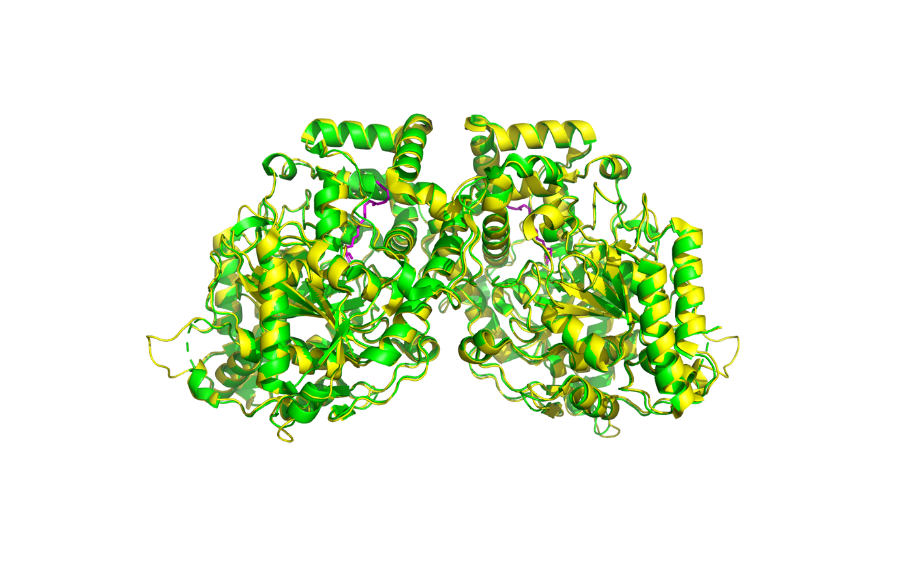
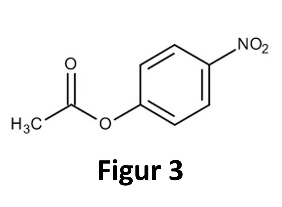
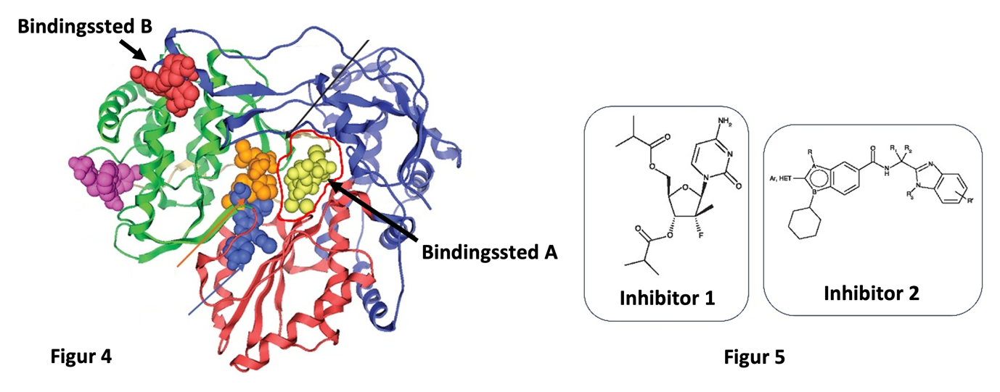
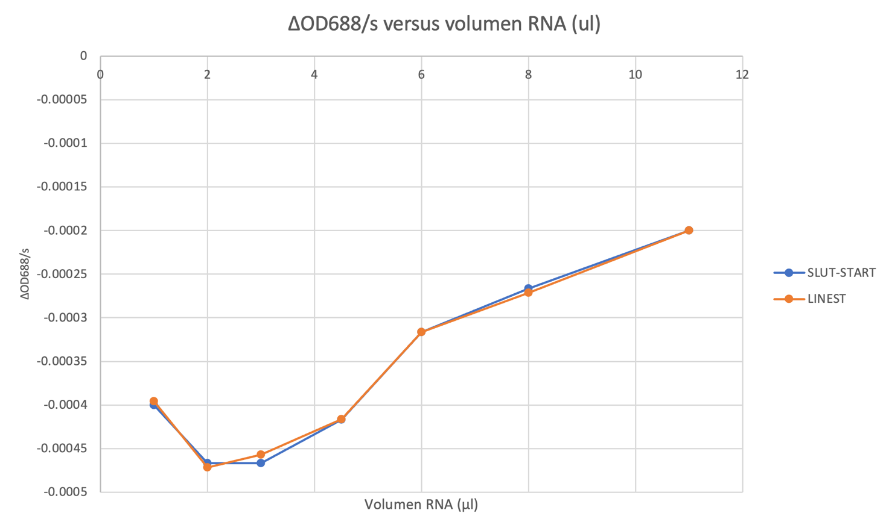
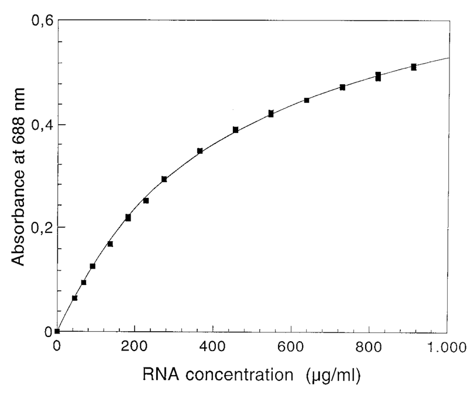

Dette er eksamensættet fra **BMSF 2023 eksamen (januar 2024).**

## Opgave 1

Amidaser er enzymer, der hydrolyserer amidbindinger. Figuren nedenfor viser en løkke nær det aktive site i en fedtsyre-hydrolyserende amidase fra *Arabidopsis thaliana* (PDB 6DHV):

**Ser281**

**Spørgsmål 1.** Beskriv peptidbindingen mellem **Gly280** og **Ser281**. Hvor hyppigt forekommer denne type af peptidbinding?

Svar: Peptidbindingen er i *cis*-konfiguration, der forekommer med en hyppighed på 0.1% af alle peptidbindinger. Dog er hyppigheden højere (\~5%), når den C-terminale aminosyre er en prolin.

Strukturen kendes også for det samme enzym med en kovalent bundet inhibitor (PDB 6DII).

**Spørgsmål 2.** Opskriv et PyMOL-script, der henter de to strukturer fra PDB, danner et objekt der kun indeholder kæderne A og B fra 6DII og overlejrer dette objekt på 6DHV med benyttelse af kun Cα-atomer og til sidst viser de to overlejrede strukturer i "cartoon" med inhibitoren i `sticks`. 6DII skal være gul, 6DHV grøn og inhibitoren magenta. Dit svar skal indeholde PyMOL-script, det endelige billede og RMSD-værdien for overlejringen.

Svar:

reinit

fetch 6dhv, async = 0

fetch 6dii, async = 0

create 6diidim , /6dii//A+B

super /6diidim//A+B//CA , /6dhv

hide everything

show cartoon ,/6diidim

show cartoon, /6dhv

color yellow, 6diidim

color green, 6dhv

show sticks ,/6diidim///700

color magenta ,/6diidim///700

orient 6diidim

{width="4.332909011373578in" height="2.43209864391951in"}RMSD =    0.464 (1076 to 1076 atoms)

Fedtsyreamidaser indeholder en katalytisk triade, der til forskel fra serinproteaser, består af 2x Ser og 1x Lys. Nedenfor ses sekvensen for en del af fedtsyreamidasen med positioner, der er fuldstændigt bevarede i et alignment af \>800 relaterede sekvenser, fremhævet i blåt:

200 - IFVTI[KD]{.mark}DID CLPHPTNGGT TWLHEDRSVE KDSAVVSKLR SCGAILLG[K]{.mark}A

250 - NMHELGMGTT GNNSNYGTTR NPHDPKRYTG GS[S]{.mark}S[G]{.mark}SAAIV AAGLCSAALG

300 - TDGGG[S]{.mark}VRI[P]{.mark} SALCGITGLK TTYGR

**Spørgsmål 3.** Angiv sekvensnumre for den katalytiske triade og begrund dit svar.

Svar: Vi vil forvente at den katalytiske triade er absolut bevaret. Derfor må de to serinrester være Ser282 og Ser305. Der er to absolut bevarede lysinrester. I strukturen er Lys205 placeret tæt ved den bundne inhibitor medens Lys 248 er langt fra inhibitoren. Derfor må den katalytiske triade udgøres af Lys205, Ser282 og Ser305.

Betragt løkken før **Ser305** i PDB 6DII. Den er ikke absolut men konservativt bevaret med konsensussekvensen **DGGG**.

**Spørgsmål 4.** Foreslå og begrund en rolle for denne løkke i den enzymatiske mekanisme.

Svar: I hydrolysen af amidbindingen vil man forvente at der under reaktionen forekommer et tetraedrisk intermediat med et negativt ladet oxygen, en oxy-anion. Ser vi på den inhibitorbundne struktur kan vi se at et oxygenatom peger mod den omtalte løkke. I løkken peger alle peptidets nitrogenatomer mod oxygenatomet. Dermed danner løkken det såkaldte oxy-anion hul, som er nødvendig for at stabilisere reaktionsintermediatet.

## Opgave 2

**Figur 1**

**Figur 2**

Nu blandes kombinationer af peptider med tre forskellige R-grupper (dvs. R~1~, R~2~ og R~3~), de får tid til at stable sig, før man tester deres evne til at hydrolysere substratet i nedenfor (Figur 3). Tabellen viser den relative aktivitet for forskellige kombinationer af peptider.

  --------------------------------------------------------
   **R~1~**   **R~2~**   **R~3~**   **Relativ aktivitet**
  ---------- ---------- ---------- -----------------------
      H          T          W               **1**

      S          Y          R               **0**

      H          S          D              **100**

      H          T          D               **3**

      H          S          E              **10**

      W          S          D             **0.01**

      H          C          N              **30**
  --------------------------------------------------------

{width="1.3881342957130358in" height="1.0161111111111112in"}

**Spørgsmål 1.** Forklar hvorfor visse kombinationer af tre aminosyresidekæder kan give hydrolyseaktivitet overfor substratet. Forklar herefter den relative aktivitet ud fra dit kendskab til enzymatisk katalyse.

Svar: Den mest aktive kombination svarer til den katalytiske triade (Ser-His-Asp). Peptidet His-Thr-Trp har en Thr der også kan (svagt) aktiveres af His (det er jo en hydroxyleret aminosyre), men mangler en Asp til at hjælpe videre -- så er det bedre med His-Thr-Asp. Uden His er Ser-Tyr-Arg inaktiv. His-Ser-Glu har en Glu i stedet for Asp som ikke er placeret helt så godt men kan stadig hjælpe. His-Cys-Asn viser at Cys er en god nukleofil, som bare skal have hjælp fra His uden at behøve en ekstra Asp (Cys-proteaser har heller ikke Asp).

Man går videre med den mest aktive kombination af tre peptider, der dog viser sig kun at have 0,01% af aktiviteten af naturlige enzymer med tilsvarende aktiv site. Man ændrer nu forsøget så substratet tilføres *mens* peptiderne stabler. Derefter fjerner man evt. substratrester ved nogle vasketrin, inden man måler aktiviteten med frisk substrat. Det viser sig at aktiviteten nu er øget til ca. 1000 relative enheder.

**Spørgsmål 2.** Forklar dette resultat og foreslå hvilken type ændringer i strukturen af substratet man kunne indføre for at øge aktiviteten yderligere.

Svar: Peptiderne må samle sig omkring substratmolekylet og efterlade et bindings-site ("imprinting") som nyt substrat efterfølgende kan binde til og blive hydrolyseret i. Eftersom enzymer stabiliserer transition (TS-)tilstanden, ville det være endnu bedre at bruge en TS-analog, f.eks. en hvor C=O-bindingen er erstattet af en C(-OH)-OH-binding (et tetravalent intermediat).

{width="6.268055555555556in" height="2.457638888888889in"}

**Spørgsmål 3.** Hvilke(n) type(r) af inhibitor tilhører inhibitor 1 og 2? Begrund dit svar. Til hvilke af de to bindingssteder i RNA polymerase (A eller B) vil du forvente inhibitorerne (1 og 2) binder?

Svar: Inhibitor 1 er tydeligvis en analog til et RNA-nukleotid med en nukleobase og nogle carboxylgrupper i stedet for fosfatgrupper, derfor mest sandsynligt en kompetitiv inhibitor, som må binde i det aktive site (bindingssted A). Inhibitor 2 minder ikke om et nukleotid, så den binder ikke i det aktive site (dvs. det er en ikke-kompetitiv eller allosterisk inhibitor), altså bindingssted B.

**Spørgsmål 4.** Hvis du skulle udvikle ny inhibitorer mod RNA polymerase, hvilken af de to typer inhibitor ville du højst sandsynligt have fundet først? Ville den type inhibitor altid være den bedste? Begrund dit svar.

Svar: Kompetitive inhibitorer er principielt meget lettere at finde frem til, da man tager udgangspunkt i et substrat og begynder at variere på det medicinalkemisk. Til gengæld kan den udkonkurreres af substrat. Ikke-kompetitive inhibitorer kan være hvad som helst -- det giver til gengæld flere muligheder hvis man har en effektiv screening-procedure til at identificere hits. Og de vil ikke blive udkonkurreret af substrat. Så der er fordele ved begge typer (og det er derfor begge typer findes).

## Opgave 3

Human Immunodeficiency Virus (HIV) er en retrovirus med et diploidt (dobbelt) RNA-genom, der dimeriserer vha. en såkaldt kissing-loop (KL)-interaktion mellem to ens RNA hairpins. Følgende alignment angiver sekvensen af den relevante RNA hairpin:

**Type 1 GGACUCGGCUUGCUGAAGCGCGCACGGCAAGAGGCGAGGG**

**Type 2 GGACUCGGCUUGCUGAAGUGCACUCGGCAAGAGGCGAGAG**

**Type 3 GGACUCGGCUUGCUGAAGUGCACUCGGCGAGAGGCGAGAG**

**Type 4 GGACUCGGCUUGCUGAAGUGUACUCGGCAAGAGGCGAGAG**

**Struktur** **\...((((.(((((((\...\...\...)))))))\...))))..**

**Spørgsmål 1.** Angiv kovariationer mellem basepar i både stem-regionen og i den palindrome sekvens i loop-regionen.

Svar: Hairpin kovariation: UA -\> UG, Palindrom kovariation: CG -\> UA, GC -\> GU

Strukturen af HIV KL-komplekset er blevet bestemt med både røntgenkrystallografi (PDB 2B8R) og NMR (PDB 2D1B).

**Spørgsmål 2.** Beskriv de strukturelle forskelle mellem de to strukturer i forhold til KL-interaktionen, herunder base stacking og non-Watson-Crick basepar.

Svar: 2B8R: A8-A9 base stack + A16 stacker mellem stem og KL-stem. 2D1B: A16-A16' base stacker i major groove + tWW A15-A23.

Forskere har brugt KL-interaktionen til at designe RNA-nanostrukturer (såkaldt RNA-origami) og bestemt strukturen med cryo-EM.

**Spørgsmål 3:** Åbn strukturen (PDB 7PTQ) i PyMOL og analysér KL-interaktion på den centrale RNA-helix. Minder cryo-EM-strukturen mest om den bestemt ved krystallografi eller NMR? Kom med en mulig forklaring på de observerede forskelle mellem strukturerne.

Svar: Det er den samme som NMR-strukturen. Årsag til anderledes X-ray struktur kan være krystalkontakter.

**Spørgsmål 4.** Hvad er sugar pucker-konformationen for adenosinrester i loop-regionen i KL på den centrale RNA-helix?

Svar: A327 C2'-endo, A328 C2'-endo, A335 C3'-endo

## Opgave 4

Aktionspotentialet er det primære signal i nerveceller og vigtig for mange funktioner i kroppen.

**Spørgsmål 1.** Under aktionspotentialet ændres permeabiliteten for både Na^+^ og K^+^ kortvarigt i nervecellens membran. Er det Na^+^ eller K^+^ der driver den første del af aktionspotentialet hvor membranen depolariseres, og i hvilken retning strømmer ionen?

Svar: Na^+^ strømmer ind.

**Spørgsmål 2.** Beregn ligevægtspotentialet for Na^+^ i menneskets nerveceller ved koncentrationer inde i cellen på 11 mM og udenfor cellen på 161 mM.

Svar:

{width="3.185751312335958in" height="0.5696369203849518in"}

{width="1.293056649168854in" height="0.1560586176727909in"}

**Spørgsmål 3.** I et laboratorieforsøg med Na^+^-kanalen fandt man en variant, L32D, som forblev permeabel overfor Na^+^ efter aktivering. I hvilket domæne af Na^+^-kanalen sidder varianten? Giv en mulig biologisk forklaring på hvorfor mutantkanalen forbliver permeabel overfor Na^+^.

Svar: Den N-terminal del (de første ca. 50 aminosyrer) og dermed L32D findes i "ball-and-chain"-domænet. Varianten L32D kan formentlig ikke længere lukke kanalen og forbliver derfor permeabel overfor Na^+^.

Nerveimpulser fra sinusknuden er vigtige for rytmen og pulsfrekvensen i hjertet, og patienter med *ventrikulær takykardi* oplever at hjertet slår hurtigere end normalt. Denne lidelse kan behandles med medikamentet *tetraethylammonium*, der blokerer K^+^-kanalen.

**Spørgsmål 4.** Forklar hvordan aktionspotentialet ændrer sig når tetraethylammonium binder K^+^-kanalen og giv et forslag til hvordan stoffet kan nedsætte hjertefrekvensen hos patienter med ventrikulær takykardi.

Svar: Depolariseringen under aktionapotentialet fortsætter i længere tid da K^+^ ikke så let kan kommen ind i nervecellen og repolarisere membranen når tetraethylammonium blokerer K^+^-kanalen. Hermed nedsættes frekvensen af nerveimpulserne og hjertet slår langsommere.

## Opgave 5

I laboratorieforsøget med RNase A benyttes methylene blue som indikator for nedbrydning af RNA.

**Spørgsmål 1.** Forklar hvordan methylene blue interagerer med RNA og hvorfor dette kan benyttes til at måle nedbrydning.

Svar: methylene blue har en polyaromatisk struktur, der dels absorberer lys, dels er i stand til at interkalere mellem basepar i ordnede nukleinsyrestrukturer. Når methylene blue binder nukleinsyrer forøges dets absorption ved 688 nm. Selv om RNA ikke består af komplementære strenge som i DNA vil der altid være sekundær struktur, der kan interageres med. Når RNA nedbrydes frigives det bundne methylene blue hvorved absorptionen falder.

{width="3.053472222222222in" height="0.9597222222222223in"} methylene blue

En gruppe studerende besluttede sig for at undersøge, hvad koncentrationen af RNA betyder for det målbare signal i eksperimentet. I en række af forsøg med fast RNase A-koncentration (50 µg) opnåede de følgende absorptionsmålinger ved 688 nm fra 0-60 sekunder for forskellige mængder RNA mellem 1 og 11 µl. Datasættet kan findes i den vedhæftede fil RNase.xlsx.

  ----------------------------------------------------------------------------------
   **Methylene blue**   1000     1000     1000     1000     1000     1000     1000
  -------------------- ------- -------- -------- -------- -------- -------- --------
     **TN buffer**       50       53       55      56.5      58       59       60

      **RNA (ul)**       11       8        6       4.5       3        2        1

    **RNase A (ug)**     50       50       50       50       50       50       50

         **0**          1.258   1.186    1.135    1.061    0.973     0.86    0.724

         **5**          1.257   1.185    1.133    1.059     0.97    0.858    0.722

         **10**         1.256   1.184    1.131    1.057    0.967    0.856    0.719

         **15**         1.255   1.182     1.13    1.054    0.965    0.854    0.717

         **20**         1.254   1.181    1.128    1.052    0.962    0.851    0.715

         **25**         1.253    1.18    1.127     1.05     0.96    0.848    0.713

         **30**         1.252   1.178    1.125    1.048    0.959    0.845    0.711

         **35**         1.251   1.177    1.123    1.046    0.957    0.843    0.709

         **40**         1.25    1.176    1.122    1.044    0.954    0.841    0.707

         **45**         1.249   1.174     1.12    1.042    0.951    0.839    0.705

         **50**         1.248   1.173    1.119     1.04    0.949    0.837    0.704

         **55**         1.247   1.171    1.117    1.038    0.947    0.835    0.702

         **60**         1.246    1.17    1.116    1.036    0.945    0.832     0.7
  ----------------------------------------------------------------------------------

**Spørgsmål 2.** Plot tidskurvernes hældning (ΔOD~680~/s) som funktion af mængden af RNA tilsat og inkludér grafen i dit svar. Beskriv kurvens forløb, herunder om der findes et maksimum eller minimum.

Svar: Kurven har et minimum ved ca. 2-3 µl tilsat RNA. Afhænger af om man beregner hældning vha. regression (LINEST) eller bare slut minus start OD:

{width="6.6930555555555555in" height="3.984722222222222in"}

**Spørgsmål 3.** Hvilken mængde RNA er optimalt at bruge i forsøget med RNase A? Forklar dit svar. Kom også med en mulig, biologisk forklaring på hvorfor det hænger sådan sammen.

Svar: Det er optimalt at benytte 3 µl RNA i forsøget, da man så får den største hældning på sine RNase A tidskurver og dermed laveste usikkerhed. Minimum kan skyldes at den frigivne mængde af methylene blue under nedbrydningen er optimal i forhold til hvor meget, der interkalerer. Ved lavere koncentration er RNA måske ikke mættet og ved højere koncentration måske uspecifik binding, der ikke frigives ved nedbrydning.

Effekten af RNA-koncentrationen på absorbansen af methylene blue blev også undersøgt af forfattere i et publiceret studie (Greiner-Stoeffele, T., Grunow, M., Hahn, U. "A general ribonuclease assay using methylene blue", Anal Biochem (1996) 240(1):24-8), hvor man tilsatte forskellige mængder af RNA til en fast mængde methylene blue og målte absorbansen:

{width="3.652645450568679in" height="3.047244094488189in"}

**Spørgsmål 4.** Beskriv hvordan ovenstående forsøg adskiller sig fra forsøget, de studerende gennemførte og kom med en mulig forklaring på forskellen i det observerede.

Svar: I dette forsøg følger man absorbancen ved 688 nm som funktion af RNA-koncentrationen, hvor de studerende kiggede på nedbrydning med RNase A. Her er der altså ikke nogen nedbrydning, og vi ser direkte på hvordan absorptionen af methylene blue afhænger af mængden af RNA. Forsøget viser, at absorptionen ved 688 nm stiger når RNA-koncentrationen stiger på en asymptotisk måde, så man efterhånden får mættet RNA med methylene blue.