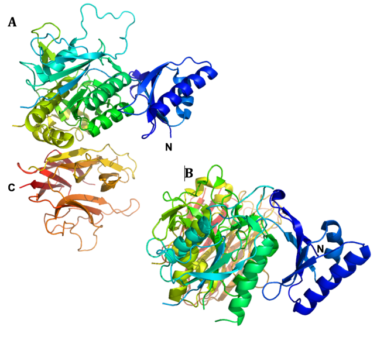
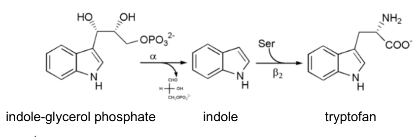
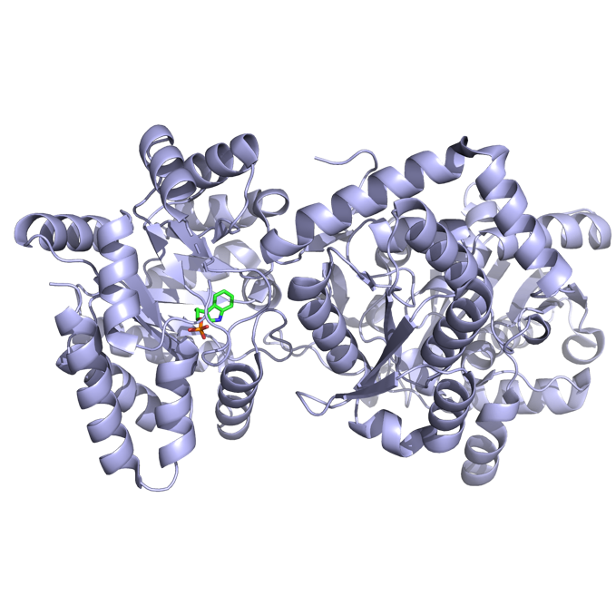

Dette er eksamensættet fra **BMSF 2023 reeksamen (maj 2024).**

## Opgave 1

**Spørgsmål 1.** Beskriv kort funktionen af hver af de tre, centrale aminosyrerester i serinproteasens katalytiske triade under kløvning af en peptidbinding.

Svar: Serin aktiveres af histidine, der fungerer som en generel base ved at abstrahere -OH protonen fra Ser, under dannelse af en alkoxidion. Histidins baseevne forbedres af den nærliggende Asp, der forøger pKa. Serin foretager det nukleofile angreb på peptidbindingens carbonylcarbon.

Et kromogent substrat med ekstinktionskoefficient, ε~460~ = 67.000 M^-1^cm^-1^ benyttes i et forsøg til at måle aktiviteten af en oprenset serinprotease. Substratet absorberer ikke ved den benyttede bølgelængde. Det vides desuden, at enzymet følger Michaelis-Menten-kinetik med k~cat~ = 50 s^-1^ og K~M~ = 41 µM.

**Spørgsmål 2.** Til forsøget startes en reaktion med 1 nM enzym og 1 mM substrat. Hvor mange sekunder vil det tage for substratkoncentrationen at falde til 95% af startkoncentrationen? For beregningen kan reaktionshastigheden antages at være uændret.

Svar: Forsøget udføres ved mættende betingelser da \[substrat\]\>\>K~M~. Derfor forløber reaktionen ved Vmax = kcat\*\[enzym\] = 50 s-1 \* 1 nM = 50 nM/s. Vi antager at reaktionshastigheden er konstant indtil \[substrat\]= 0.95 mM, dvs. at der er forbrugt 0.05 mM substrat, og reaktion vil derfor være konstant i: t = 0.05\*10^-3^ M / 50\*10^-9^ M/s = 1000 s

Absorbansen måles med et spektrofotometer med en lysvej på 1 cm, der kan måle præcise absorbanser fra 0.05 til 1.5.

**Spørgsmål 3.** Hvilken absorbans vil man måle når koncentrationen er faldet til 95% af den originale værdi? Bliver lineariteten i stigningen over tid af den målte absorbans først begrænset af manglende substrat eller spektrofotometeret?

Svar: Absorbansen af 0.05 mM produkt: A = 67000 M^-1^cm^-1^ \* 1 cm \* 0.05\*10^-3^ M = 3.35. Vi vil altså forvente at lineariteten først begrænses af spektrofotometeret.

Efterfølgende oprensede man en muteret udgave af proteasen fra en patient og målte dannelsen af produkt fra 1 nM enzym ved forskellige substratkoncentrationer. De eksperimentelle data kan findes i tabellen nedenunder.

  --------------------------
   \[S\] (mM)   v~o~ (nM/s)
  ------------ -------------
     0.025          1.2

      0.05          1.9

      0.1           4.1

      0.25          8.1

      0.5          13.5

       1           20.6

       2           24.3

       4           30.1

       8            33

       16          34.7
  --------------------------

**Spørgsmål 4.** Bestem K~M~ og k~cat~ for mutanten. Kommenter forskellene mellem patientens enzym og vildtype enzymet.

Svar: K~M~ = 583 µM, k~cat~ = 27.9 s^-1^ (se vedhæftede svar i Excel). Patientens enzym har primært lavere affinitet for substratet (K~M~ er øget \> 10 gange) mens den katalytiske aktivitet *k*~cat~ er kun faldet ca. 2 gange.

## Opgave 2

Nedenfor vises strukturen af Protein X som cartoon, farvet fra blå (N-terminalen) til rød (C-terminalen) i to forskellige orienteringer. Bemærk at flere fleksible loops ikke er vist, da de er uordnede samt at C-terminalen ikke ses i B.

{width="3.7631944444444443in" height="3.359722222222222in"}

**Spørgsmål 1.** Forklar hvordan et domæne er defineret og angiv baseret på farverne antallet og rækkefølgen af strukturelle domæner i Protein X.

Svar: Et domæne er en uafhængig foldningsenhed og der ses desuden en rumlig adskillelse af de tre domæner. Der er tre domæner. Det første N-terminale domæne er overvejende blåt, det andet centrale domæne er fra turkis til gul, og det sidste C-terminale domæne er fra gult til rødt.

**Spørgsmål 2.** Angiv hvilken foldningsklasse de enkelte domæne tilhører. Begrund dit svar.

Svar: Der er 3 klasser i CATH klassifikation (alpha, beta, alpha-beta), men i SCOP er der 4 (alpha, beta, alpha/beta, alpha+beta). Første og andet domæne er et alpha-beta domæne da de både indeholder alpha helix og beta plader. Det C-terminale domæne indeholder kun beta-plader og tilhører derfor beta-klassen.

Det vides at Protein X er N-glykosyleret. Samtlige pentapeptid-fragmenter i proteinets sekvens med asparagin i den centrale position er vist nedenfor.

```sh
1\. PWNLE 8. VINEA

2\. FENVP 9. TPNLV

3\. VLNCQ 10. AHNAF

4\. VLNAA 11. QANCS

5\. AGNFR 12. QPNQC

6\. ATNAQ 13. VDNTC

7\. GTNFG
```
**Spørgsmål 3.** Angiv hvilke(n) asparaginrest(er) der højst sandsynligt er glykosylerede. Begrund dit svar.

Svar: N-glykosyleringer kan forekomme for sekvenser af typen NX(S/T) hvor X kan være hvilken som helst aminosyre dog ikke prolin. Kun peptid 11 indeholder en sådan sekvens.

Tunicamycin inhiberer enzymet *GlcNAc phosphotransferase (GPT)*, der katalyserer overførsel af N-acetylglucosamine-1-phosphate fra UDP-N-acetylglucosamine til dolichol phosphate. Efter oprensning af Protein X fra en human cellelinje (HuH7) både med og uden tilsætning af tunicamycin, blev de to proteinpræparationer analyseret ved hjælp af massespektrometri:

med

tunicamycin

uden

tunicamycin

**Spørgsmål 4.** Forklar hvorfor tunicamycin påvirker massen af Protein X.

Svar: Glycosyleret dolichol phosphat fungerer som donor af high-mannose glycosyleringer i ER. Det er således det første trin i glycylerings processen der bliver inhiberet af tunicamycin. Derfor er massen af Protein X mindre end når det udtrykkes sammen med tunicamycin da det ikke er glykosyleret.

## Opgave 3

Biosyntesen af aminosyren tryptophan varetages af enzymer udtrykt fra den såkaldte *trp* operon, der koder for 5 polypeptider, der til sammen katalyserer 5 delreaktioner. Der er dog ikke en direkte sammenhæng mellem genprodukter og reaktioner.

**Spørgsmål 1.** Giv (med udgangspunkt i *trp* operon) to eksempler på hvordan sammenhængen mellem antal polypeptider og antal reaktioner kan varieres.

Svar: *trpE* og *trpD* koder hver for en halvdel af én enzym, anthranilate synthetase, *trpC* koder for ét enzym, der katalyserer to separate reaktioner og endelig koder *trpB* og *trpA* også for hver en halvdel af tryptophan synthetase.

*Tryptophan synthase*, der katalyserer den sidste del af processen fra intermediatet *indole 3-glycerol phosphate* til slutproduktet tryptophan, udviser fænomenet *"substrate channeling"*:

{width="3.8440365266841643in" height="1.1592016622922134in"}

**Spørgsmål 2.** Forklar kort, hvad *"substate channeling"* dækker over samt hvorfor det er nødvendigt for enzymet i dette tilfælde.

Svar: Substrate channeling dækker over det fænomen at et mellemprodukt kanaliseres inde i enzymet fra ét aktivt site til det næste. Det kan være nødvendigt hvis mellemproduktet er meget reaktivt eller giftigt for cellen. Endelig kan det være med til at effektivisere processen. I dette tilfælde er indole både meget fedtopløseligt (kan forsvinde til membranen), og reaktivt samt kan interkalere i DNA.

Nedenfor ses strukturen af tryptophan synthase bundet til en substratet indole 3-glycerol phosphate (grønt).

{width="3.0617290026246717in" height="1.9769389763779528in"}

**Spørgsmål 3.** Angiv hvor mange domæner, enzymet består af samt hvilken af enzymets to reaktioner, der katalyseres i domænet med substrat bundet. Hvad er produktet af denne reaktion og hvorledes indgår dette i "substrate channeling"?

Svar: Der er to domæner i hver af to subunits. Indole 3-glycerol phosphate er udgangsstoffet for de to reaktioner katalyseret af enzymet (jvf. ovenfor), så det må være den første reaktion, der katalyseres i det viste domæne. Produktet er indole, der beskyttes via substrate channeling under transport til det andet domæne.

Tabellen nedenfor angiver reaktionshastigheder for tryptophan synthase målt i nM/min for tre forskellige koncentrationer af indole 3-glycerol phosphate (IGP) og fem forskellige koncentrationer af indole (I), begge målt i mM.

+---------+---------+---------+---------+---------+---------+
| \[i\]   | 0       | 0.25    | 0.5     | 0.75    | 1       |
|         |         |         |         |         |         |
| \[IGP\] |         |         |         |         |         |
+:=======:+:=======:+:=======:+:=======:+:=======:+:=======:+
| 0.07    | 5.39    | 4.19    | 3.49    | 2.81    | 2.55    |
+---------+---------+---------+---------+---------+---------+
| 0.03    | 3.25    | 2.45    | 2.17    | 1.77    | 1.65    |
+---------+---------+---------+---------+---------+---------+
| 0.01    | 1.59    | 1.30    | 1.08    | 0.91    | 0.85    |
+---------+---------+---------+---------+---------+---------+

**Spørgsmål 4.** Analysér de kinetiske data via en grafisk fremstilling og angiv hvilken type inhibitor, indole udgør. Kom med en biokemisk forklaring på dette ud fra din viden om enzymet.

Svar:

Skæringen med y-aksen varierer mens linjerne samles i et punkt på den negative x-akse. Indole er en non-kompetitiv inhibitor.

## Opgave 4

**Spørgsmål 1**. En gruppe forskere har identificeret en receptor, GPCR-1, der binder en lille ligand og aktiverer et heterotrimert G-protein. Ved måling af cAMP i cellen finder man at koncentrationen stiger når liganden tilsættes. Beskriv kort de enkelte trin i signaltransduktionen, herunder hvorfor cAMP-koncentrationen stiger.

Svar: Et korrekt svar skal indeholde at tilsætning at ligand aktiverer GPCR-1, som aktiverer G-proteinet, som øger aktiviteten af Adenylate Cyclase som katalyserer dannelsen af cAMP fra ATP.

**Spørgsmål 2.** Det heterotrimeriske G-protein har ingen transmembrane domæner, men alligevel finder man at både Gα og Gβγ er membranbundne. Forklar hvad der ligger til grund for dette.

Svar: Et korrekt svar skal indeholde at Gα og Gβγ er forankret i lipiddobbeltlaget/membranen via. kovalent bundne fedtsyrer. Gα og Gβγ er altså membran-bundet også når de ikke interagerer med membranproteiner såsom GPCR-1 receptorer eller adenylate yclase.

**Spørgsmål 3.** Stoffet nedenfor mikro-injiceres (skydes ind) i celler, som udtrykker GPCR-1 receptoren, og man måler aktiviteten af Protein Kinase A. Forklar hvad der er særlige ved stoffet og forklar hvorfor stoffet stimulerer fosforyleringsaktiviteten af Protein Kinase A.

{width="3.1174475065616796in" height="1.4440824584426946in"}

Svar: Et korrekt svar skal indeholde at strukturen viser en GTP analog (5'-guanosyl-methylene-triphosphate (GDPCP)) og at denne ikke hydrolyseres ligesom GTP. Gα vil ikke kunne hydrolysere GDPCP og dermed være aktiveret længere og det vil øge fosforyleringsaktiviteten af Protein Kinase A via Adenylate Cyclase.

**Spørgsmål 4.** Ved mutation af konserverede serin- og theronin-rester i den C-terminale del af GPCR-1 til alanin ses en øget og længerevarende receptorsignalering. Giv en forklaring på den øgede aktivitet.

Svar: Et korrekt svar skal indeholde at når serin/threonin aminosyrerne muteres kan receptoren ikke fosforyleres og dermed ikke rekruttere Arrestin som normalt vil blokere signalering (derfor den øgede og længerevarende signalering). De konserverede serin/thronin aminosyrer bliver fosforyleret og skaber et docking-sites for Arrestin binding som normalt dæmper receptor aktiviteten.

## Opgave 5

Green Fluorescent Protein (GFP) bruges bla. til at markere proteiner, så de kan observeres i levende celler med fluorescensmikroskopi. I 2011 blev der udviklet en fluorescent RNA-aptamer, kaldet "Spinach", som på lignende vis kan bruges til at markere RNA molekyler. Spinach blev udviklet ved at selektere RNA-sekvenser, der binder til den kemiske forbindelse **DFHBI**, der ligner fluoroforen **HBI** i GFP. Til selektionseksperimentet blev der brugt et bibliotek bestående af ca. 5⋅10^13^ tilfældige sekvenser på 100 nukleotider.

**Spørgsmål 1.** Hvor meget RNA (målt i mikrogram) svarer dette bibliotek til? Du skal bruge den gennemsnitlige molekylevægt for et nukleotid (330 g/mol) samt Avogadros tal (6.022⋅10^23^).

Svar: M(RNA) = 100 nt \* 330 g/(mol\*nt) = 33.000 g/mol

m(bibliotek) = n \* M = (antal/N~A~) \* 33.000 g/mol = 2,7 mikrogram

Selektion og efterfølgende sekventering af de udvalgte molekyler resulterede i sekvensen 24-2, der blev opkaldt "Spinach". En termodynamisk foldningsalgoritme, *Mfold*, blev brugt til at forudsige en sekundær struktur.

**Spørgsmål 2.** Beskriv alle elementerne i den sekundære struktur vist til venstre i figuren herunder.

Svar: Strukturen består af en stem og 3 hairpins og danner en 4-way junction. De 3 hairpins har tetraloop. Hairpin 2 har G bulge. Hairpin 3 har asymmetrisk bulge med 3 nukleotider på 5' side og 2 nukleotider på 3' side.

{width="5.763888888888889in" height="2.5430555555555556in"}

Højre side af figuren herover viser resultatet af et forsøg, hvor fluorescensen fra Spinach-DFHBI komplekset måltes som funktion af Mg^2+^-koncentrationen.

**Spørgsmål 3.** Beskriv hvilken effekt Mg^2+^ har på fluorescencen målt fra Spinach-DFHBI og kom med en forklaring på hvordan denne effekt opstår.

Svar: Magnesium øger fluorescensen af DFHBI med en EC50 på ca. 0.1 mM. Magnesium påvirker foldningen af RNA struktur positivt og når RNA foldes korrekt kan det binde DFHBI.

Krystalstrukturen af Spinach blev publiceret i 2014 (PDB ID 4TS2). Hent strukturen ind i PyMol og udvælg og vis DFHBI med følgende kommandoer:

hide all

show lines

select DFHBI, resn 38E

show spheres, DFHBI

orient DFHBI

**Spørgsmål 4.** Hvilken type tertiær struktur er involveret i binding af DFHBI og hvilke basepar interaktioner består denne struktur af? Hvorfor ligner krystalstrukturen ikke *Mfold* strukturen, der er vist i figuren ovenfor?

Svar: G-quadruplex danner platform for binding af DFHBI. G-quadruplex består af G baser, der interagerer med deres Watson-Crick side og deres Hogsteen side. Termodynamisk foldnings-algoritme kan ikke forudsige tertiær struktur, men kun sekundær struktur.