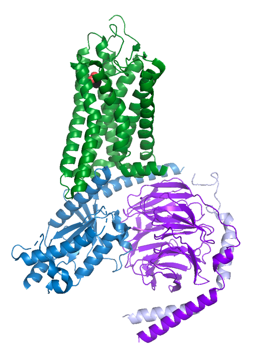
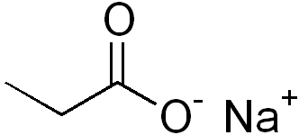
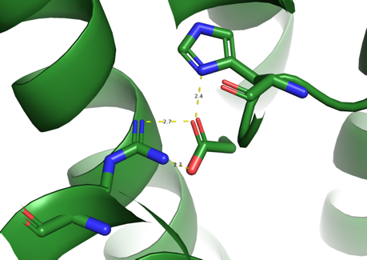
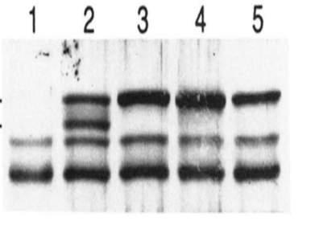
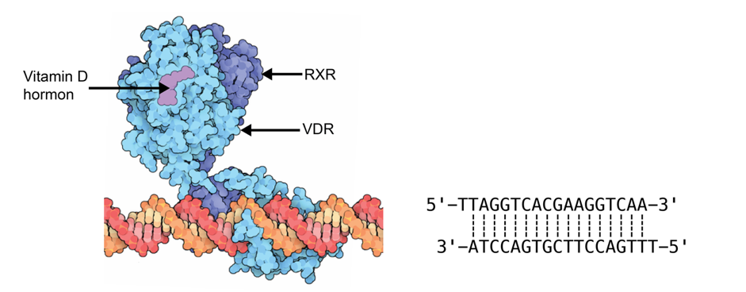
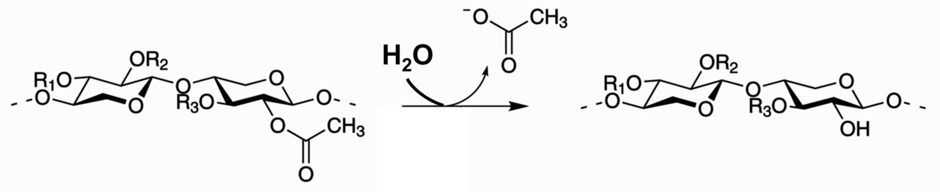
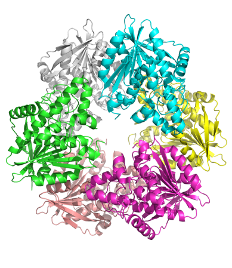
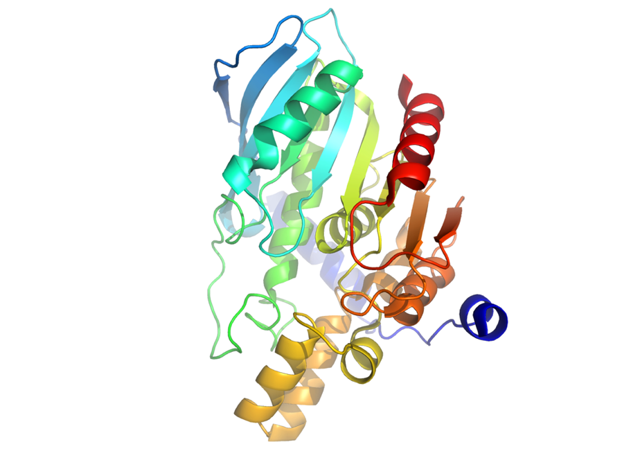
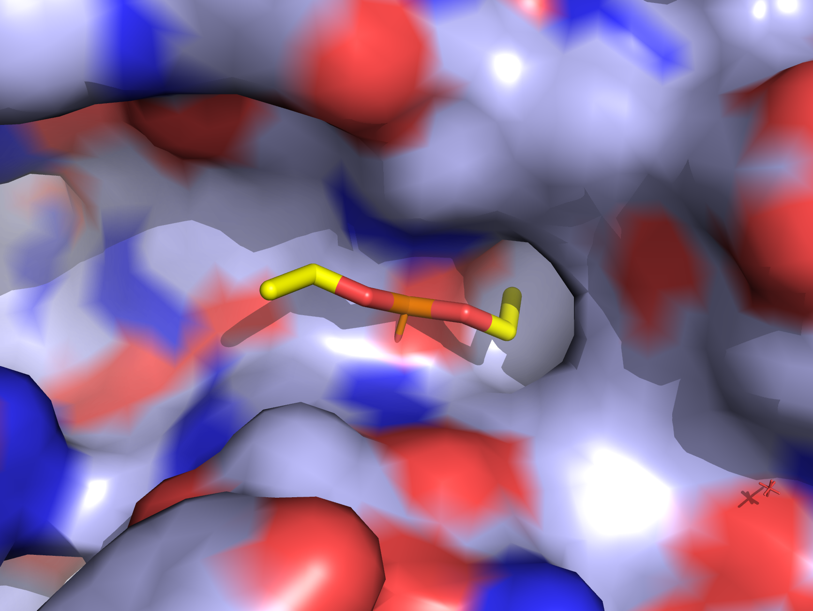

Dette er eksamensættet fra **BMSF 2024 eksamen (januar 2025).**

## Opgave 1

Odorantreceptoren tilhører klassen af G-koblede receptorer.

**Spørgsmål 1.** Foretag en sammenligning mellem signalkaskaden induceret af epinephrine (adrenalin) via β-adrenergic receptor og kaskaden induceret af odoranter. På hvilke måder ligner de to signalveje hinanden, og hvor adskiller de sig?

Svar:\
Ligheder: I begge tilfælde binder et ekstracellulært stof (epinephrine / odorant) til den membranbundne receptor og aktiverer et G-protein til at udskifte GDP med GTP og frigøre βγ subunits. I begge tilfælde aktiverer G-proteinet på GTP-form adenylate cyklase, der danner cAMP.

Forskelle: I epinephrine-signalvejen aktiverer cAMP protein kinase A (PKA) mens det i odorant-signalvejen er en cAMP-gated uspecifik ionkanal, der aktiveres, hvilket leder til et aktionspotentiale.

Hvert sanseneuron i næsen udtrykker kun én specifik odorantreceptor mens neuronerne i munden udtrykker mange forskellige bitterreceptorer.

**Spørgsmål 2.** Forklar hvordan det for mennesker er muligt at genkende millioner af duftstoffer med kun ca. 400 forskellige odorantreceptorer men har svært ved at skelne forskellige bitterstoffer.

Svar: De 400 duftreceptorer reagerer på en kombinatorisk måde overfor duftstoffer, så hvert duftstof genkendes af mange receptorer og hver receptor genkender mange duftstoffer. Dette giver et meget stort antal mulige genkendelser. Desuden samles alle nerveceller, der udtrykker samme odorantreceptor i et bundt i lugtekolben, så signalet separeres og forstærkes. Modsat udtrykker nervecellerne i munden hver mange forskellige bitterreceptorer, hvilket betyder at vi ikke kan skelne mellem forskellige bitterstoffer, da mange aktiverer samme neuroner.

Strukturen af en human odorantreceptor (OR51E2) i kompleks med propionat er blevet bestemt med cryo-EM.

**Spørgsmål 3.** Hent strukturen af OR51E2 i PyMOL (PDB 8F76) og skriv et script, der viser receptoren med propionat og det ekstracellulære miljø opad. Odorant-molekylet skal vises med `spheres` og atomfarver (C=sort, O=rød) og strukturen af protein i cartoon med forskellige farver for hver kæde. Kæde N er et antistof, der er brug til at stabilisere komplekset og denne skal ikke med i figuren. Dit svar skal indeholde script og strukturfigur på hvid baggrund og propionat skal kunne ses. Forklar kort hvilke proteiner kæderne A, X, Y og Z repræsenterer.

Svar:

reinitialize

fetch 8f76, OR51E2

hide all

show cartoon, chain A+X+Y+Z

select propionate, /OR51E2/F/A/PPI\`401

color skyblue, chain X

color purpleblue, chain Y

color lightblue, chain Z

color forest, chain A

show spheres, propionate

color black, propionate

util.cnc propionate

bg_color white

set_view (\\

-0.200450197, -0.167117879, -0.965344667,\\

0.963355601, 0.145631686, -0.225248098,\\

0.178227231, -0.975122809, 0.131802350,\\

-0.000118594, 0.000241727, -410.325866699,\\

115.248001099, 116.110229492, 124.080039978,\\

323.505187988, 497.149475098, -20.000000000 )

Kæde A er odorantreceptoren (grøn), kæde X er G-proteinet (G~olf~ eller G~α~) (blå), kæde Y er G~β~ (lilla) og kæde Z er G~γ~ (lys blå). Odoranten (propionate) er vist i den røde cirkel.

Figuren nedenfor viser et såkaldt `heat map` over hvilke aminosyrerester i receptoren, der interagerer med hvilke atomer i odoranten (propionate) i et simuleringsforsøg.

**Spørgsmål 4.** Brug strukturen til at forklare observationerne for R262 og H180 med speciel fokus på O^α^-, O^β^- og C^α^-atomernes interaktioner. Beskriv hvilken type af bindinger, de to aminosyrerester indgår i og hermed hvordan odoranten genkendes.

Svar: I strukturen er det tydeligt at His180 indgår i en stærk H-binding med det ene O-atom mens Arg262 har stærke ioniske/H-bindinger med begge O-atomer i carboxylatgruppen. Den er også tæt på C^α^, men indgår ikke i en direkte binding med denne. Sammen med bindingslommens størrelse er disse interaktioner med til at gøre receptoren specifik for propionate.

{width="3.038461286089239in" height="2.147726377952756in"}

## Opgave 2

Convertase Subtilsin/Kexin type 3, PCSK3, også kaldet furin er en protease, der aktiverer andre proteiner ved at kløve et propeptid af. Furin er membranbundet og udtrykkes selv som en pro-form, der aktiveres ved proteolyse. Furin er fuldt aktivt i tilstedeværelse af EDTA, men en mutation i aktivt site, D153N, inaktiverer furin.

**Spørgsmål 1.** Foreslå et eksperiment, der sammen med ovenstående information kan fastslå hvilken type protease, furin tilhører.

Svar: Både serine proteaser og aspartyl proteaser har en aspartat i aktivt site. For at teste om det er en serinprotease kan man se om furin inaktiveres af DIPF eller PMSF. Pepstatin kan også benyttes til at påvise Asp protease.

Nedenfor er vist et udsnit af sekvensen for pro-furin. For at bestemme kløvningsstedet blev tyrosiner i modent furin iodineret med radioaktivt iod (^125^I), hvorefter der blev foretaget Edman-degradering. I hvert trin blev radioaktiviteten for den frigivne aminosyremålt som vist i figuren nedenfor.

30 40 50

**pro-furin** 27 -- QKVF TNTWAVRIPG GPAVANSVAR

60 70 80

KHGFLNLGQI FGD**YY**HFWHR GVTKRSLSPH

90 100 110 120

RPRHSRLQRE PQVQWLEQQV AKRRTKRDV**Y** QEPTDPKFPQ

**Spørgsmål 2.** Bestem ud fra de givne oplysninger kløvningsstedet og dermed N-terminalen af det modne furin.

Svar: Da det er i tredje Edman-cyklus, at der ses et højt tælletal, må tyrosin være i tredje position i det modne furin. Det kan ikke være før dobbelt tyrosinen i 64-65 da der i så fald ville have været målt et højt tælletal i to positioner efter hinanden. Derfor må signalet stamme fra Y110, så N-terminalen er DVY. Der kløves derfor efter position R107, hvilket vil give en reduktion i massen på ca. 9 kDa.

Tabellen nedenfor angiver nogle af de proteiner, furin kløver, hvor\| angiver kløvningsstedet i pro-proteinet:

  -------------------------------------------
  **Protein**             **Kløvningssted**
  ----------------------- -------------------
  pro-factor IX           LNRPKRYNSG

  pro-NGF                 THRSKRSSSH

  pro-SorCS1              SGRRRRSGAD

  pro-insulin receptor    PSRKRRSLGD
  -------------------------------------------

**Spørgsmål 3.** Beskriv de biokemiske egenskaber ved S1-, S2-, S3- og S4-lommerne i furin.

Svar: S1 og S4 binder R. Det er derfor sandsynligt at der i en dyb bindingslomme findes en negativt ladet sidekæde fx Asp eller Glu. S2 har de samme egenskaber som S1 og S4 dog tillades lidt mere fleksibilitet idet der her kan bindes både K og R. For P3 er der ikke nogen konsensus, P,S,R,K forekommer. S3 er derfor "ikke eksisterende"

Molmassen af pro-furin er 97 kDa mens det modne furin har en masse på 90 kDa. En trunkeret (forkortet) form uden de transmembrane og cytosoliske domæner er fuldt aktiv som protease og har i proformen massen 86 kDa mens den modne form er 79 kDa.

For at fastslå hvordan aktiveringen af furin foregår, blandede man trunkeret furin med fuldlængde furin enten vildtype (bane 2) eller med mutationer R107G (bane 3), R104A (bane 4) samt aktiv site-mutanten D153N (bane 5). På SDS-PAGE gelen vises resultaterne af disse forsøg samt trunkeret furin alene (bane 1).

**Spørgsmål 4.** Fastslå først om furin er i stand til at kløve sin egen pro-form og forklar hvordan du ser det. Foregår kløvningen som en intermolekylær (mellem molekyler) eller intramolekylær (selv-kløvning) proces? Forklar dit svar.

Svar: Det bemærkes at sekvensen fra 104 til 107 matcher genkendelsessekvensen for furin. Som kontrol fortæller bane 2 at vildtype pro-furin også kløves når den trunkerede form er til stede. Bane 3 og 4 fortæller at furin ikke kløves når specificitetssekvensen ændres. Bane 5 hvor det aktive site er muteret ses ingen kløvning selv om specificitetssekvensen er intakt. Derfor kløver furin sig selv og der må være tale om (intramolekylær) auto-aktivering (selvkløvning).

## Opgave 3

Et forskerhold vil undersøge hvilke proteiner der associeres til membranen af røde blodceller. Som det første trin i deres analyse isolerer de blodcellemembranen og tilsætter natriumpalmitat.

**Spørgsmål 1.** Hvad kunne være formålet med at tilsætte natriumpalmitat, og hvad gør dette molekyle ved proteinerne i membranen?

Svar: Natriumpalmitat er en detergent (sæbe), som bruges til at solubilisere membranproteinerne ved at danne miceller som erstatning for membranlipiderne.

Proteinet EPC1 forventes ikke at være et membranprotein, men bliver alligevel fundet i prøven fra blodcellemembranerne via massespektrometri. Det C-terminale peptid af EPC1 har en masse, der er større end forventet fra proteinsekvensen.

**Spørgsmål 2.** Kom med en sandsynlig forklaring på den afvigende masse samt forklar hvorfor EPC1 findes i membranen.

Svar: EPC1 er modificeret med et membrananker, som forankrer EPC1 til membranen. Det passer også med oplysningen om at det C-terminale peptid er tungere end forventet grundet denne modifikation.

Proteinet EPC2 findes også i membranprøven. EPC2 har en enkelt transmembran helix og via massespektrometri findes der desuden en glykosylering på den første asparagin (aminosyrerest 4).

**Spørgsmål 3.** Forklar hvordan EPC2 er orienteret i membranen, herunder på hvilken side eller sider, N-terminal og C-terminal af proteinet må befinde sig.

Svar: Glykosyleringer er på ydersiden af membranen, så da EPC2 kun har en trans-membran helix må N-terminal med asparagin 4 ligge udenfor cellen og C-terminal (og dermed resten af proteinet) inde i cellen.

Proteinet EPC3 findes ligeledes i blodcellemembranen og forskerne er interesseret i at måle mobiliteten af EPC3.

**Spørgsmål 4.** Forslå en metode som kan måle hvor hurtigt EPC3 bevæger sig i membranen.

Svar: Der kan laves et FRAP (fluorescence recovery after photo-bleaching)-eksperiment, som direkte måler membranmobiliteten. Det kræver at EPC3 mærkes med en fluorofor.

## Opgave 4

I vinterhalvåret er det en god idé at tage vitamin D, da der ikke er nok sollys til at det kan dannes naturligt i vores hudceller. Efter indtagelse, omdannes vitamin D til et hormon, der binder til vitamin D-receptoren (VDR), som er med til at kontrollere syntesen af forskellige proteiner, der regulerer calcium- og fosfatniveauerne i vores krop. VDR består af to domæner, et domæne, der binder hormonet samt et domæne, der binder til DNA. Den aktive form findes i kompleks med et andet protein, 9-*cis* retinsyrereceptor (RXR), og sammen binder de to proteiner sig til DNA, som vist på figuren nedenfor.

{width="6.268055555555556in" height="2.454861111111111in"}

**Spørgsmål 1.** Find de to ens bindingsområder i DNA-sekvensen, hvortil heterodimeren binder. Hvilken type sekvensmotiv er der tale om?

Svar: Der er to områder med sekvensen AGGTCA. Der er tale om et `direct repeat`. Altså ikke et "inverted repeat" eller palindrom, som man ofte ser. `Direct repeat` termen er ikke nævnt direkte i pensum, så det er ok ikke at bruge termen, og i stedet beskrive det med ord. Duplikeret motiv er også korrekt svar.

Åben strukturen med PDB 1YNW i PyMOL og undersøg de DNA-bindende domæner på VDR og RXR.

**Spørgsmål 2.** Hvilken type strukturmotiv indeholder de to DNA-bindende domæner og hvilken groove af DNA binder de til?

Svar: Zink-finger, major groove.

**Spørgsmål 3.** Hvad er afstanden mellem de to α-helicer i proteinerne, der genkender DNA, og hvad ville afstanden typisk være hvis der var tale om en symmetrisk binding ved en homodimer?

Svar: 28 Å. For symmetrisk binding vil afstanden typisk være ca. 34 Å, da dette svarer til en full turn af DNA (=10x 3.4 Å).

**Spørgsmål 4.** Identificer 3 sekvensspecifikke interaktioner mellem genkendelseshelicen og DNA dobbelthelix for et af de to DNA-bindende domæner. Angiv i hvert tilfælde de to involverede aminosyre- og nukleotidrester på henholdsvis protein og DNA.

Svar:

To svar er mulige:

Domæne 1: Arg50-G431, Glu42-C433, Lys45-G404

Domæne 2: Arg261-G422, Glu253-C424, Lys256-G413

## Opgave 5 

Xylan er et polysaccharid, der hovedsageligt består af xylose-enheder, der ofte er substitueret i flere positioner. Enzymet Acetyl Xylan Esterase (AXE) fraspalter acetylgruppen bundet i 2-positionen, så der frigives en acetation. Nedenfor ses reaktionen katalyseret af AXE.

{width="6.263888888888889in" height="1.2763888888888888in"}

**Spørgsmål 1.** Angiv konformation og kobling for glycosidbindingen mellem de to xylose-enheder i xylan som vist ovenfor.

Svar: Det er en β-1-4 glycosidbinding.

Strukturen af det aktive AXE er vist nedenfor i to orienteringer med de enkelte protomerer i forskellige farver.

**Spørgsmål 2.** Beskriv den kvaternære struktur af AXE, herunder de symmetrielementer, enzymet indeholder.

Svar: AXE er en hexamer. Ovenfra (venstre) ses en 3-talssymmetri og fra siden (højre) observeres en 2-talssymmetri.

Monomerstrukturen af AXE er vist nedenfor:

{width="4.068975284339458in" height="3.054054024496938in"}

**Spørgsmål 3.** Beskriv β-pladens opbygning og angiv foldningsklassen for AXE.

Svar: β-pladen består af 9 kæder. De tre første (N-terminale / til højre / blå) er antiparallelle mens resten er parallelle. AXE tilhører αβ klassen, mere præcist α/β.

AXE inhiberes af visse organiske fosfatforbindelser ved at der dannes en kovalent binding med S181 i den katalytiske triade. Paraoxon-[ethyl]{.underline} en K~i~ værdi på 5,1 mM mens K~i~ for paraoxon-[methyl]{.underline} er 13,4 𝜇M. DIPF-inhibering er ikke målbar.

Ved binding af paraoxon-ethyl fraspaltes en del af inhibitoren og nedenfor ses et udsnit af strukturen af det inhiberede enzym. Til venstre ses den kovalent bundne diethyl-phosphatidyl gruppe (DEP) på overfladen af enzymet og på figuren til højre viser de stiplede linjer afstande (ikke hydrogenbindinger) mellem udvalgte carbon-atomer i henholdsvis AXE og DEP, ligesom bindingsvinklen for den kovalente binding mellem Ser Cβ, Oγ og P er vist.

{width="2.9320253718285216in" height="2.15625in"} {width="2.847014435695538in" height="2.160117016622922in"}

**Spørgsmål 4.** Angiv først en liste med de tre inhibitorer (DIPF, paraoxon-ethyl og paraoxon-methyl) fra svagest til stærkest inhibitor. Kom herefter med en mulig strukturel forklaring på de forskelle i inhiberingsgrad, der ses.

Svar: DIPF (svagest, ingen binding), paraoxon-ethyl, paraoxon-methyl (stærkest, lavest K~i~).

Forskellene skyldes sterisk hindring. For paraoxon ethyl ses en tæt kontakt med Y206 som ikke vil være der for paraoxon-methyl. Derfor er Ki for paraoxon-methyl lavere end for paraoxon ethyl. DIPF indeholder i stedet for ethyl en isopropyl gruppe, som der slet ikke er plads til i bindingslommen, så derfor ingen reaktion, ingen inhibering.

Bonusinformation (kræves ikke i svar): Det ses i strukturen til højre at der er afvigelse fra ideel geometri. Bindingsvinklen er 93° hvor man ville forvente en værdi tæt på 108°. Desuden er der en meget tæt kontakt mellem C3 i DEP og tre atomer i ringen i Y206.