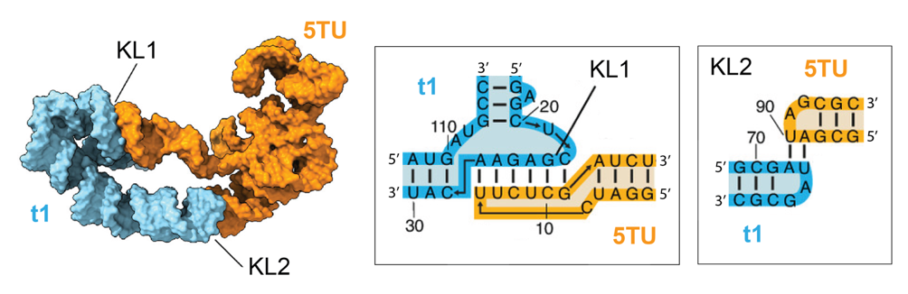
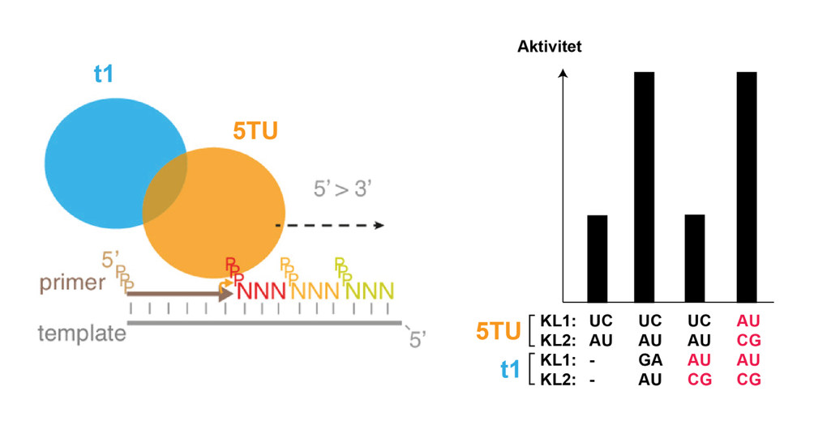
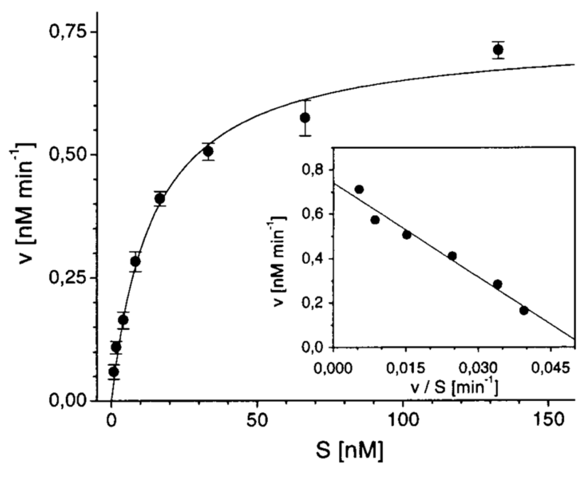
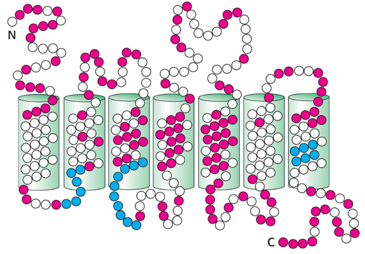
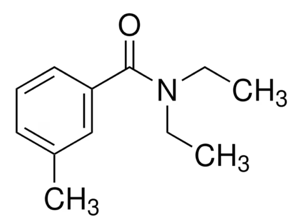
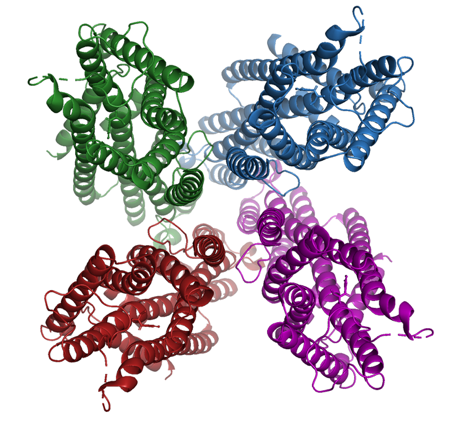
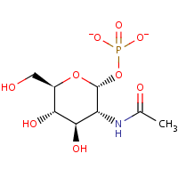
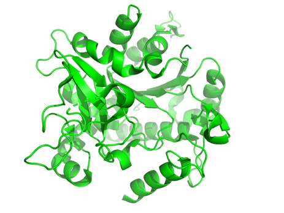
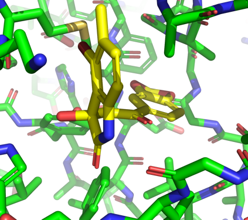

**BMSF 2024 reeksamen (maj 2025)**

## Opgave 1

I følge RNA-verden-hypotesen opstod livet ved at et RNA-molekyle begyndte at kopiere sig selv, men et sådant RNA-molekyle er endnu ikke fundet i naturen. Forskere har derfor brugt kunstig (*in vitro*) evolution til at udvikle et fungerende RNA polymerase ribozym (RPR) ud fra randomiserede sekvenser. Strukturen af RPR blev bestemt med cryo-elektronmikroskopi og viste sig at bestå af to RNA-molekyler (5TU og t1) holdt sammen af interaktioner på to steder, KL1 og KL2, som vist nedenfor.

{width="6.6930555555555555in" height="2.172222222222222in"}

**Spørgsmål 1.** Forklar hvilken type interaktion, er der tale om mellem 5TU og t1 (primær, sekundær, tertiær eller kvarternær) og hvad kaldes det motiv, de RNA-enheder bliver holdt sammen af i KL1 og KL2?

**Svar:**\
Kvarternære interaktioner (mellem to separate molekyler, 5 point), kissing-loop interaktioner (5 point).

Åbn strukturen af RPR med PDB ID 8T2P i PyMOL og undersøg RNA strukturen, der består af en A og en B kæde. Farv evt. kæderne som vist i ovenstående figur.

**Spørgsmål 2.** Undersøg KL1-interaktionen i PyMOL. Hvilke nukleotider er involveret i stacking-interaktioner mellem de to loops? Angiv basetype og sekvensnummer.

**Svar:**\
C5-U21 stack (4 point).\
U6-G110 stack (3 point).\
G11-G23 stack (3 point).

**Spørgsmål 3**. Undersøg KL2-interaktionen i PyMOL. Hvilke nukleotider deltager i ikke-Watson-Crick-interaktioner (angiv basetype og sekvensnummer)? Beskriv i hvert tilfælde hvilken type interaktion, der er tale om.

**Svar:**\
De symmetriske basepar A66-G92 og A89-G69 er trans-WS (trans-Watson-Crick-Sugar edge, 5 point).\
De symmetriske basepar G88-A91 og G65-A68 er trans-HS (Högsteen-Sugar edge, 5 point).

RPR kan forlænge en RNA primer på en RNA-template ved sammenkobling af matchende triplet-nukleotider (tre nukleotider koblet sammen 5'-3' og på 5' trifosfatform, 5'-^PPP^NNN-3'). For at undersøge effekten af KL1- og KL2-interaktionerne på denne reaktion, har man indført specifikke mutationer i 5TU KL1 position 7-8, 5TU KL2 position 89-90, t1 KL1 position 25-26, og t1 KL2 position 72-73. Effekten af mutationerne på aktiviteten af enzymet er vist på figuren herunder, hvor mutationer er indikeret i rød og `-` angiver at t1 ikke er til stede.

{width="6.6930555555555555in" height="3.5034722222222223in"}

**Spørgsmål 4.** Hvad viser forsøget om vigtigheden af t1? Kom desuden med en forklaring på resultaterne observeret for de specifikke mutationer af KL1 og KL2.

**Svar:**\
Forsøget viser at t1 har en aktiverende effekt på 5TU (5 point).\
Mutationerne i KL1 og KL2 viser at når KL1 og KL2 brydes går aktiviteten ned og når KL1 og KL2 gendannes går aktiviteten op (5 point).

## Opgave 2

Restriktionsendonukleaser (R), også kaldet restriktionsenzymer, udgør en del af bakteriers naturlige forsvar mod virus, bakteriofagerne. Ved at udtrykke et R-enzym på samme tid som et DNA-methylerende enzym (M) kan bakterierne beskytte deres eget DNA fra at blive nedbrudt mens enhver form for invasiv DNA fra f.eks. virus vil blive klippet itu. R-enzymer benytter flere af følgende katalytiske strategier til at kløve DNA: Kovalent katalyse, generel syre/base-katalyse, nærhedsprincippet og metalionkatalyse.

**Spørgsmål 1.** Forklar, baseret på enzymet EcoRV, hvilke principper, der generelt gør sig gældende for R-enzymer og hvordan disse påvirker den katalytiske proces.

**Svar:** R-enzymer benytter sig af generel syre/base-katalyse og metalionkatalyse. En Mg^2+^-ion kræves for at arrangere og aktivere et vandmolekyle, der angriber det phosphoratom, der bygger bro mellem to nukleotider, hvilket bryder phosphodiesterbindingen. Vandmolekylet aktiveres ligeledes af Asp74, der som generel base hjælper med at deprotonere og danne en nukleofil hydroxylion.

R-enzymet EcoRI fra bakterien *Escherichia coli* er et af de mest kendte og anvendte restriktionsenzymer indenfor bioteknologi, da det både er meget aktivt og specifikt. Det genkender DNA-sekvensen GAATTC og klipper dsDNA som vist med grønt nedenfor:

**Spørgsmål 2.** Forklar hvordan genkendelsessekvensen og kløvningsstedet for EcoRI adskiller sig fra EcoRV og hvilket fælles princip, der gør sig gældende for de to sekvenser. Hvordan afspejles dette princip i R-enzymernes struktur?

**Svar:** EcoRV genkender GATATC og kløver efter GA, hvor EcoRI genkender GAATTC og kløver efter G. Begge sekvenser er palindromiske, hvilket er vigtigt fordi R-enzymerne er homodimerer, der genkender symmetrisk DNA.

Nedenfor ses resultatet af et enzymatisk forsøg, hvor 160 pM EcoRI blev inkuberet med forskellige koncentrationer af mærket DNA ved 27°C. Initielle reaktionshastigheder blev bestemt ved lineær regression af datapunkter målt fra 5-20 min.

{width="3.844659886264217in" height="3.132891513560805in"}

Det indsatte plot er et såkaldt Eadie-Hofstee diagram, hvor den katalytiske parameter K~m~ kan bestemmes som den negative hældning ("minus hældningen").

**Spørgsmål 3.** Forklar hvordan Eadie-Hofstee diagrammet er konstrueret ud fra de målte data og bestem K~m~. Hvad er enheden for K~m~ og hvad repræsenterer tallet?

**Svar:** I Eadie-Hofstee diagrammet afsættes den intielle hastighed (v) som funktion af v/S, hvor S er substratkoncentrationen.

I dette tilfælde er Km \~ -(0.15-0.5)/(0.040-0.015) = 14 nM.

Enheden er nM og værdien repræsenterer den substratkoncentration, hvor den halve Vmax er opnået.

**Spørgsmål 4.** Hent strukturen af EcoRI bundet til DNA via PDB ID 1QPS. Beskriv hvilke kæder, der findes i PDB-filen og forklar hvordan man i PyMOL kan generere den biologiske samling. Angiv hvilke aminosyrerester, der interagerer med Mn^2+^-ionen og forklar endelig hvilken tilstand (før/efter kløvning) enzym-DNA-komplekset befinder sig i samt hvordan det ses.

**Svar:** PDB-filen indeholder én kæde af EcoRI og én DNA-streng. Ved hjælp af kommandoerne,

fetch 1qps, type=pdb1

split_states 1qps

kan man generere den biologiske samling. Dette kan også gøres med symmetriekspansion (sym_exp) og efterfølgende udvælgelse af de korresponderende objekter.

Asp91 (carboxylate), Glu111 (carboxylate) samt Ala112 (carbonyl) koordinerer Mn^2+^-ionen. Endelig ses det at DNA-strengen er kløvet, så strukturen repræsenterer en post-hydrolytisk / post-kløvningstilstand.

## Opgave 3

Genkendelse af duftstoffer i sansesystemet adskiller sig fundamentalt fra genkendelse af sødestoffer, selv om begge systemer er baseret på membranbundne receptorer.

**Spørgsmål 1.** Forklar hvilke molekylære principper, der ligger til grund for genkendelse af duftstoffer (odoranter) i sanseneuronernes receptorer og beskriv hvordan genkendelsen af sødestoffer adskiller sig fra dette.

**Svar:** Odoranter genkendes molekylært i små lommer på overfladen af den membranbundne odorantreceptor og det er specielt antallet og placeringen af funktionelle grupper, der er vigtig. Det er i høj grad stoffernes form snarere end deres kemiske egenskaber, der genkendes, hvilket bla. ses ved at stoffer, der er hinandens spejlbilleder, giver anledning til helt forskellige duftindtryk.

Genkendelsen af sødestoffer i smagssansen er fundamentalt anderledes, da det her er et spørgsmål om at stofferne genkendes i interface på en membranbunden dimer, dvs. at det er i højere grad sammensætningen af dimeren, der afgør hvad der genkendes.

Odorantreceptoren er membranbunden og tilhører klassen af 7TM-proteiner, der består af 7 transmembrane helicer. Dette gør sig også gældende for bitterreceptoren:

**Spørgsmål 2.** Forklar hvad de røde og blå farver repræsenterer i figuren ovenfor og forklar hvordan de to receptortyper adskiller sig på den ydre (øverst) og indre (nederst) side af membranen samt i det transmembrane område. Kom med forslag til hvorfor der er områder af proteinerne, der har henholdsvis den ene eller anden funktion.

**Svar:** De røde områder er meget variable aminosyrer og de blå områder meget konserverede aminosyrer. Bitterreceptoren er mere variant på ydersiden mens odorantreceptoren er mere variant i det transmembrane område. Grunden til at der er mange variable områder kan dels skyldes almindelig divergens mellem organismer samt at receptorerne skal kunne reagere på mange forskellige stoffer. Grunden til at der er bevarede områder er at de skal fungere på samme måde i signalvejen og i forhold til binding af G-proteinerne.

De fleste vingede insekter (*neoptera*) udtrykker, ligesom pattedyr, en lang række odorantreceptorer og kan dermed opfatte dufte. Man mener endog, at odorantreceptoren stammer fra insekterne og opstod i forbindelse med at de blev landbaserede for mio. af år siden, hvor luftbårne dufte kunne opfattes. Primitive insekter som "jumping bristletail" (*Machilis hrabei*), der minder om sølvfisk, udtrykker et meget simpelt duftsystem (MhOR), hvor odorantmolekylerne binder direkte til en membranbunden ionkanal og den G-protein koblede receptor og signalvejen dermed er unødvendig.

**Spørgsmål 3.** Hent strukturen af *M. hrabei* MhOR bundet til insektmidlet DEET via PDB ID 7LIG og angiv foldningsklasse og oligomerisk struktur. Skriv et PyMOL-script, der viser kanalen i cartoon på hvid baggrund med forskellige farver for hver monomer samt liganden i `sticks` og atomfarver. Dit svar skal indeholde figuren samt PyMOL-scriptet.

Svar:

Foldningsklassen er alpha og kanalen er en homotetramer.

Eksempel på script og resulterende figur:

reinitialize

fetch 7lig, MhOR

hide all

show cartoon, chain A+B+C+D

select DEET, resn DE3

show sticks, DEET

util.cnc DEET

color skyblue, chain A

color forest, chain B

color firebrick, chain C

color purple, chain D

bg_color white

set_view (\\

0.886480570, -0.460420191, -0.046539988,\\

0.459967166, 0.887695789, -0.020647712,\\

0.050820164, -0.003102819, 0.998702824,\\

0.000000000, 0.000000000, -360.913269043,\\

154.437133789, 154.522872925, 148.109680176,\\

299.514251709, 422.312316895, -20.000000000 )

**Spørgsmål 4.** Analysér interaktionen mellem DEET og ionkanalen i PyMOL og angiv hvilke aminosyrerester, duftstoffet interagerer med. Er interaktionen primært hydrofil eller hydrofobisk? Forklar endelig hvordan binding af et duftstof til ionkanalen kan give anledning til et nervesignal.

**Svar:** DEET ligger i en primært hydrofobisk lomme bestående af store og mellemstore hydrofobe aminosyrerester som Tyr380, Val88, Tyr383, Tyr91 og Ile213.

Binding kan lede til at kanalen åbner og lader f.eks. Na^+^ og Ca^2+^ strømme ind i nervecellen, hvilket giver anledning til et aktionspotentiale.

## Opgave 4

Acetylcholinreceptoren er en ligand-styret ionkanal, der tillader passage af flere typer kationer, såsom Na^+^, K^+^ og Ca^2+^.

**Spørgsmål 1.** Forklar hvorfor denne receptor ikke er specifik for en enkelt iontype.

**Svar:** I modsætning til de meget selektive kanaler (f.eks. K^+^-kanaler) mangler acetylcholinreceptoren et selektivitetsfilter. Dens porediameter og ladningsfordeling er optimeret til hurtig ionflux snarere end selektivitet.

**Spørgsmål 2.** Forklar, hvordan spændingsstyrede K⁺-kanaler bidrager til repolariseringsfasen af et aktionspotentiale.

**Svar:** Spændingsstyrede K⁺-kanaler åbner sig under repolariseringsfasen, så K⁺ kan strømme ud af cellen, hvilket genopretter membranpotentialet til dets hviletilstand.

**Spørgsmål 3.** Hvordan sikrer selektivitetsfilteret for K⁺-kanaler specificitet for K⁺-ioner over mindre ioner som Na⁺?

**Svar:** Det er energetisk favorabelt for K⁺-ioner at koordineres i selektivititsfiltret da desolveringsenergien er mindre end resolvereingsenergien i selektivitetsfiltret. Koordineringen af Na⁺ er ikke optimal i selektivitetsfiltret og det er derfor ikke energetisk favorabelt for Na⁺ at smider sin solvent skal.

Kaliblock er et lægemiddel, der hæmmer spændingsstyrede K⁺-kanaler.

**Spørgsmål 4.** Forudsig og forklare, hvordan anvendelsen af Kaliblock vil påvirke varigheden af et aktionspotentiale.

**Svar:** Inhibering af spændingsstyrede K^+^-kanaler ville forhindre eller forsinke repolarisering af membranen og vil føre til et forlænget aktionspotentiale.

## Opgave 5

Enzymet UDP-N-acetylglucosamine diphosphorylase (UAP) katalyserer reaktioner af typen nedenfor.

**Spørgsmål 1.** Hvad er konfigurationen omkring det anomere carbon i phosphatidyl-N-acetylglucosamine?

**Svar:** Det er en α-konfiguration, idet phosphatgruppen er på modsat side af ringen i forhold til C6-positionen.

Strukturen af **TbUAP** fra parasitten *Trypanosoma brucei* (en parasit, der forårsager sovesyge) er bestemt eksperimentelt i kompleks med en inhibitor. I figuren nedenfor er vist det centrale nukleotid bindende domæne i TbUAP som cartoon.

{width="3.072580927384077in" height="2.308182414698163in"}

**Spørgsmål 2.** Hvilken foldningsklasse tilhører det nukleotidbindende domæne?

**Svar:** Domænet tilhører αβ klassen, mere specifikt α/β.

Bindingsstedet for inhibitoren er lokaliseret i interface mellem det N-terminale domæne og det nukleotidbindende domæne, vist nedenfor til venstre. Til højre ses det samme udsnit af strukturen af det tilsvarende enzym fra mennesker, HsUAP. Strukturen af HsUAP er vist overlejret med TbUAP, men kun inhibitoren af TbUAP ses.

**Spørgsmål 3.** Vil inhibitoren også inhibere det humane enzym? Begrund dit svar.

**Svar:** Nej, det vil den ikke. I hvert fald ikke i det samme site, da det er blokeret af en argininsidekæde (forrest i billedet) og en aspartatrest bagest.

**Spørgsmål 4.** Beskriv effekten af inhibitoren på processering af proteiner og forklar hvorfor inhibitoren eventuelt kan være anvendelig til behandling af sovesyge.

**Svar:** UAP er essentielt for modifikation af proteoglycaner, idet dannelsen af intermediatet, UDP-hexose, er essentielt som substrat for glykosyltransferaser involveret i modfikation af glykosyleringer i Golgi. Et inhiberet UAP-enzym vil derfor medføre at modifikation af glycosyleringer ikke sker korrekt, hvilket igen kan medføre misfoldning og/eller en immunrespons jvf AB0-systemet. Forkert glykosylering kan også påvirke funktionen på forskellig vis.

Inhibitoren ser umiddelbart ud til at opfylde lipinskis rule of 5 og kan ikke inhibere det humane enzym. Risikoen for bivirkninger er derfor umiddelbart mindre. Så det er en kandidat til et lægemiddel mod sovesyge.