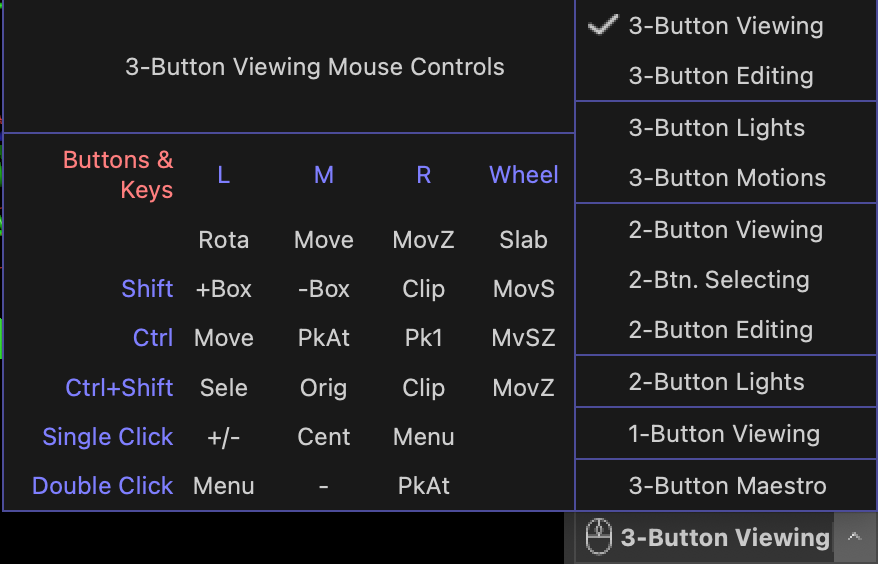
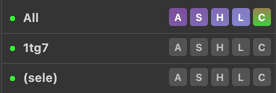
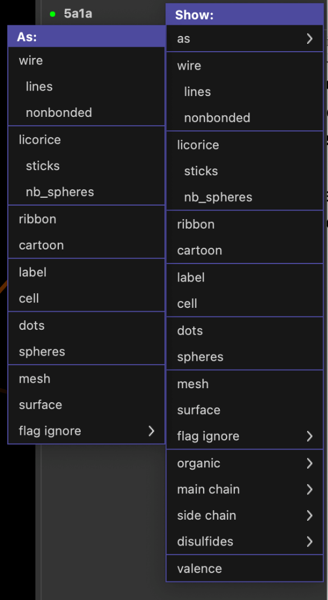
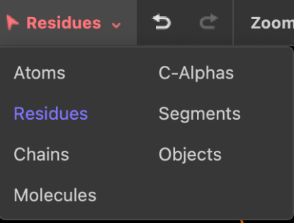
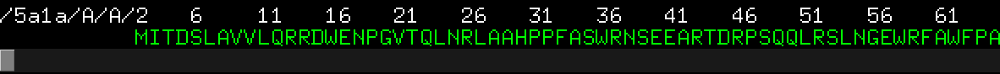
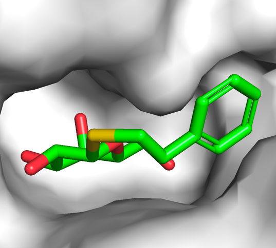
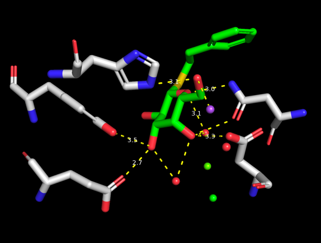
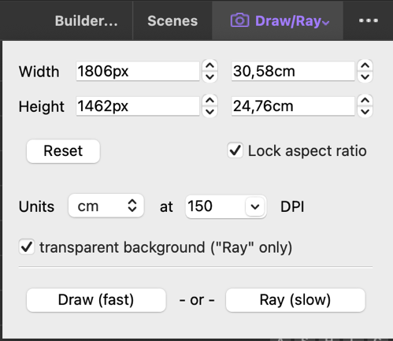
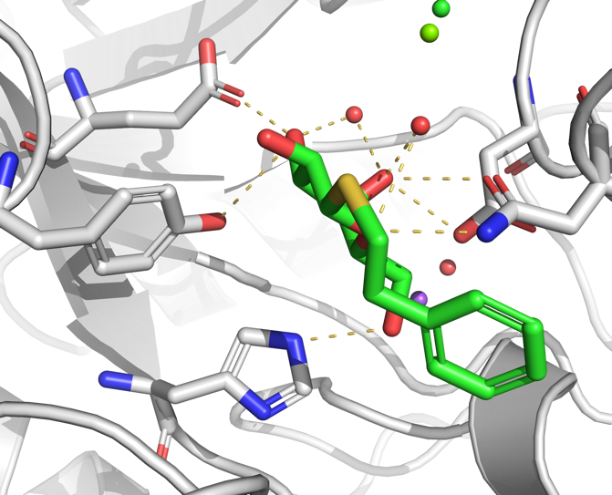

```default
<style>
  .top-menu { color: #e21cb1; font-weight: bold; }
  .display-panel { color: #e6c01dff; font-weight: bold; }
  .object-panel { color: #2c6b2aff; font-weight: bold; }
  .command-line { color: #1693daff; font-weight: bold; }
  .log-window { color: #ea1111ff; font-weight: bold; }
  .bottom-menu { color: #c96906ff; font-weight: bold; }
</style>
```
# Overview 

This tutorial provides a basic introduction to molecular visualization
with PyMOL 3. It only covers the use of the graphical user interface
(GUI) and not the use of the command line. It covers aspects of the
program useful for structural biology and medicinal chemistry such as
exploring protein-ligand interactions, as well as making figures for use
in reports. 

## The graphical user interface (GUI) 

The PyMOL GUI consists of multiple panels as shown in **Figure 1**. The
[top menu]{.top-menu} provides a set of handy buttons for quick access to various
functions. The main [display panel]{.display-panel} provides the visualization of the loaded molecules while the [object panel]{.object-panel} on the right-hand side
provides a menu of options for the loaded molecules. While the object
menu provides various operations by clicking, the same tasks can be
achieved using the [command line]{.command-line} located at the bottom of the window.
The [log window]{.log-window} contains log of which commands have been executed and
details of selections. Note also the [bottom menu]{.bottom-menu} of the object menu
that contains controls for mouse, wizards, sequences and movies and a
button to hide/show the log window.


It is highly recommended to use a 3-button mouse for navigating PyMOL as
the 3-button viewing mode is the most convenient and has most
functionality attached. You can use the [bottom menu]{.bottom-menu} to set the mouse mode and see a guide to the different functions that are available (see
figure below).

{width="80%" fig-align="center"}

Most tasks in PyMOL can be achieved using the [object panel]{.object-panel} on the right-hand side of the [display panel]{.display-panel}. Here, each line (or entry) in the menu correspond to the objects you have loaded into PyMOL (e.g.
molecules). In the figure below, **1tg7** is one such object. Note that
the entries in the menu in a parenthesis (`Sele` in the figure)
represents an *atom selection* and not an object (important difference).

{width="60%" fig-align="center"}

Next to the object names the menu, items are located. These are labelled
**A**, **S**, **H**, **L**, **C**. These letters stand for **A**ction,
**S**how, **H**ide, **L**abel, and **C**olor. Go ahead and click a
letter and observe the menu appearing. We will explore these menus in
more detail later.

## Molecular representations 

PyMOL provides multiple molecular representations for visualization. For
a quick overview of these use the main menu and click

### Wizard → Demo → Representation 

You can also find the wizard tools in the [bottom menu]{.bottom-menu} next to the mouse button. This will display the 8 different molecular
representations available in PyMOL. These are *lines, sticks, spheres,
surface, mesh, dots, ribbon, and cartoon*. Of these, the lines, sticks
and cartoon representation are probably the most commonly used to
display biomolecular structures. Go ahead and select various other demos
from the menu on the right-hand side (e.g. **Cartoon Ribbons**). Click
the **End Demonstration** button when you are done.

# Exploring *E. coli* beta-galactosidase 

## Loading your first protein structure 

In this tutorial we will first explore the structure of
beta-galactosidase (**LacZ**) and investigate the molecular interactions
with the inhibitor PETG -- a cell permeable inhibitor.

To load the LacZ PDB structure into PyMOL, navigate in the main menu
system:

> **File** → **Get PDB..** → \[enter the 4-character PDB code **5a1a**\]

The PyMOL [display panel]{.display-panel} will now show the 3D structure of *E. coli*LacZ in the default cartoon representation with the ligand shown as
sticks colored by atom type. Note that the [object panel]{.object-panel} now contains an entry named **5a1a** representing our newly created object.

Familiarize yourself with the mouse controls before we move on:

- **Rotate**: Press and hold the left mouse button while moving the
  mouse.

- **Zoom**: Press and hold the right mouse button while moving the
  mouse.

- **Translate**: Press and hold the middle mouse button while moving the
  mouse.

- **Clip the view**: Scroll.

Click the **Zoom** button in the [top menu]{.top-menu} to zoom on all or selected
molecules. The **Orient** button will orient the view to display the
molecule along its longest axis aligned with the x-axis. (Try it out).

## Using the visualization presets 

PyMOL comes with multiple built-in visualization preset views. These can
be accessed through the Action (**A**) button(s) in the [object
panel]{.object-panel}. Click the **A** next to the **5a1a** object. From the menu that
appears click **preset** → **ligands**. The program will now
automatically zoom into the ligand region of the protein. In our case
the protein is a tetramer and binds four ligands, so we zoom to see all
four. To see individual ligands use the \"Zoom\" button in the [top
menu]{.top-menu} and choose "Next Ligand", which will zoom to a view of an
individual ligand.

Observe that there was a change in the representation of the protein to
ribbon, the residues close to the ligand will show in lines, and the
ligand is shown as sticks. Also notice the yellow dashed lines appearing
between polar groups between the protein and ligand (**Figure 2**).


PyMOL also offers various similar visualization presets for the
protein-ligand interactions. Explore these through navigating in the
[object panel]{.object-panel} (**A** → **preset** → **ligand sites**). See in particular
the following:

- **cartoon**: provides the same view as **ligands** but with the
  protein in cartoon representation,

- **solid surface**: draws the binding pocket in solid surface,

- **transparent**: draws the binding pocket in transparent surface.

## Displaying molecular representations 

::: {style="float: right; margin: 10px; width: 40%;"}
{width="100%"}
:::

Besides the various automatic representation presets shown above you can
also set the molecular representation to be shown more manually. Click
the **S** (show) button from the [object panel]{.object-panel} next to the **5a1a** entry.
From the menu appearing you can choose to show various molecular
representations, such as **lines**, **sticks**, **ribbon**, etc. From
the first menu entry (**as**) you can select the representation in which
you want the protein to be shown as.

Try the following and observe how the molecular representation changes
in the viewer window:

- **S** → **as** → **spheres**

- **S** → **as** → **lines**

- **S** → **cartoon**

Observe that using **S** → **as** changes the whole representation,
whereas **S** → adds a representation on top of the former
representation.

The various representations can also be hidden using the **H** (hide)
button from the object menu. e.g. try the following:

- **H** → **cartoon**

- **H** → **lines**

Explore also the various other options in the Show menu (such as
**organic**, **main chain**, etc).

Make sure you use **S** → **as** → **lines** before continuing to the
next step.

## Working with atom selections 

More customized visualization and investigations of biomolecular
structures often requires functionality to select individual or group of
atoms. In PyMOL the simplest approach for atom selection is by simply
clicking the particular atom in the [display panel]{.display-panel}.

Click any atom in the protein. Note the new entry in the object menu on
the right-hand side called **(sele)**, and the selected atoms are shown
in the [display panel]{.display-panel} with small pink squares.

To zoom in on your selection simply do **A** → **zoom** on the
**(sele)** entry.

You can now assign a different molecular representation to the selection
e.g. with **S** → **sticks** on the **(sele)** entry. The selected atoms
should now appear as sticks in [display panel]{.display-panel}.

::: {style="float: right; margin: 10px; width: 40%;"}

:::

Even though we initially only clicked at
one atom in the protein, all atoms in the residue are selected by
default. This behavior can be changed by clicking on the \"selection
button\" in the left side of the [top menu]{top-menu} (named \"Residues\" by
default). If you choose **Atoms**, you will be able to select a single
atom when clicking on it in the [display panel]{.display-panel}. Now zoom out to see
the full molecule using the Zoom button in the \"top menu\". If you
choose **Chains**, you will be able to select one chain of the tetramer
when clicking on it in the [display panel]{.display-panel}. Choose **Residues** again
before continuing.

The parenthesis in **(sele)** means that this entry is a *selection*.
Conversely, the **5a1a** entry is an object, and **(sele)** is an atom
selection of this object. The selection entry has much the same menu
system attached to it as an object entry.

Another way of selecting residues is through the \"sequence viewer\"
which you can toggle on/off through the **SEQ** (for sequence) button in
the [bottom menu]{.bottom-menu}. When clicking **SEQ** once you will see the
\"sequence viewer\" on the top of the \"display panel\". To select a
residue from here, simply click (and drag) the relevant residue codes.
To disable the selection, click on an empty part in the [display panel]{.display-panel}, or click the **(sele)** entry in the object menu.



Selections can be deleted by clicking **A** → **delete selection**, and
renamed with **A** → **rename selection**.

## Color the atom selections 

With selections we can easily color different elements in the structure.
As an example, select a part of the protein, then use the **C** button
(for color) next to the selection to change the color e.g. from green to
blue.

Note that it is often useful to color by atom elements, i.e. to keep
oxygens red, nitrogens blue, sulphurs yellow etc, and only adjust the
colors of carbon atoms. This coloring option is available through **C**
→ **by element** → **CHNOS**.

**Task**: Based on the tools shown so far, try and select the 4 chains
of the LacZ, and color them 4 different colors

## Overview of LacZ 

In the following we will focus on the monomer to make a nice figure for
the interaction between LacZ and PETG (named **PTQ** in the model). With
our selection skills from above we can now easily create a nice overview
figure of *E. coli* LacZ in complex with PTQ.

Start by focusing on the entire protein by clicking on the **Orient**
button.

Show LacZ as lines by using **S** → **lines** and show the ligand PTQ as
spheres by using **S** → **organic** → **spheres**.

Now use the mouse to select the PTQ ligand in one of the subunits and
name the selection \"PTQ\". In the same subunit, click the protein and
rename the selection \"protein\".

To hide the other subunits, use **(protein)** → **H** → **unselected**
and the show the ligand again using **(PTQ)** → **S** → **spheres**.

Now use **Zoom** → **Visible** to focus on the chosen subunit.

### Cartoon representation 

Show the protein selection in cartoon representation. Try different
coloring options for the two selections and find a suitable orientation
that shows the ligand binding site.

Make sure to color the ligand with different atom colors and with a
color for the carbon atoms that makes it stand out using **(PTQ)** →
**C** → **by element** → **CHNOS**.

Color the protein by secondary structure elements (hint: **C** → **by
ss**) to see which elements are close to the binding site.

Color the protein to identify N-terminal and C-terminal ends (hint:
**C** → **spectrum** → **rainbow**) to see which parts of the protein
are close to the binding site.

Color the protein in a more neural color to make the ligand stand out.

Save this session by navigating in the main menu before we continue:
**File** → **Save session**.

Saving sessions allows you to save the precise way that your current
setup looks, and not just the positions of atoms in the file, like with
a pdb file.

### Surface representation 

::: {style="float: right; margin: 10px; width: 40%;"}

:::

While the cartoon representation displays
how the protein chain is folded, the surface representation is better
for displaying cavities and other surface properties. From the show
(**S**) menu of the protein selection entry, select **surface** and show
the ligand as sticks. Color the protein in white and PTQ as green CHNOS.
Zoom on the ligand using **(PTQ)** → **A** → **zoom** and observe the
cavity in which PTQ binds, which should look like the image on the
right. Save it as a session file.

Verify that you still have the selections **(protein)** and **(PTQ)** in
the object menu on the right. Click **Zoom** → **Visible** and show the
protein as cartoon representation and PTQ as sticks.

## Exploring the binding of PTQ

To explore the binding site in more detail it can be useful to only
select and show the residues in the immediate vicinity of the ligand.
This can be done by using the *modify* function from the action (**A**)
menu:

Click on the ligand to make a new selection. From the selection entry
click **(sele)** → **A** → **modify** → **around** → **residues within 5
A**. This approach will modify the selection to contain the atoms around
the ligand (and not the ligand itself). Rename this selection to
**near** using **A** → **rename selection**. Our new **(near)**
selection contains the atoms within 5 Å of the ligand. Show these
residues as lines using **(near)** → **S** → **lines** and show waters
and ions as non-bonded spheres using **(near)** → **S** →
**nb_spheres**. Zoom on the selection using **(near)** → **A** →
**zoom**.

Now that we see all residues close to the ligand, we can more easily
pick out residues particularly important for the binding of PTQ to LacZ.

::: {style="float: right; margin: 10px; width: 40%;"}

:::

To show potential hydrogen bonds use
**(PTQ)** → **A** → **find** → **polar contacts** → **to other atoms in
object**. Select the residues that are in contact with the ligand by
clicking on them one at the time. Rename the selection to hbondres. Use
your skills from above to hide the protein and show the selected
residues as sticks. Should look something like the image on the right.

You can use the measurement tool to measure the length of the polar
contacts. Do this by clicking the wizard button in the [bottom menu]{.bottom-menu}
or by navigating in the main menu through **Wizard** → **Measurement**.
Follow the instructions on the screen (**click first atom, click second
atom**). Notice the label with the distance (in Å), as well as a new
**measure01** object appearing in the object menu. Measure the distances
between a few of the potential hydrogen bonds between PTQ and the
protein residues (in particular the charged residues).

# Publication quality figures for your report

## Ray tracing for better resolution 

::: {style="float: right; margin: 10px; width: 28%;"}

:::

Now we're getting close to a nice representation of the LacZ:PTQ
complex. To use the figure in a publication (or report) it is good
practice to enhance the quality and resolution by ray tracing.

Use the \"Draw/Ray\" button in the [top menu]{.top-menu} to make a ray tracing of
your current view. Click \"Ray (slow)\" and observe the better quality
when the ray tracing has completed.

## Adjusting the default settings 

For publications or reports in particular it's good practice to use
white background. Set this in the main menu by clicking **Display** →
**Background** → **White**.

::: {style="float: right; margin: 10px; width: 40%;"}

:::

Personal preference obviously plays a role, but here are some additional settings that can be used to make a nice
publication quality figure.

**Setting** → **Cartoon** → **Fancy Helices**

**Setting** → **Rendering** → **Shadows** → **Medium**

An example of a rendering is shown to the right.

> **Task**: Use your new skills to color the protein, ligand and a few
> selected residues and display them in a nice view. Use your favorite
> ray trace mode and ray trace your view. Finally, you may want to
> annotate your image with amino acid names and numbers.

## Some useful links 

The internet is full of tricks on how to make nice figures with PyMOL.
Here are some links that you might want to check out:

> [[http://www.pymolwiki.org/index.php/PLoS]{.underline}](http://www.pymolwiki.org/index.php/PLoS)

> [[http://www.pymolwiki.org/index.php/Gallery]{.underline}](http://www.pymolwiki.org/index.php/Gallery)
