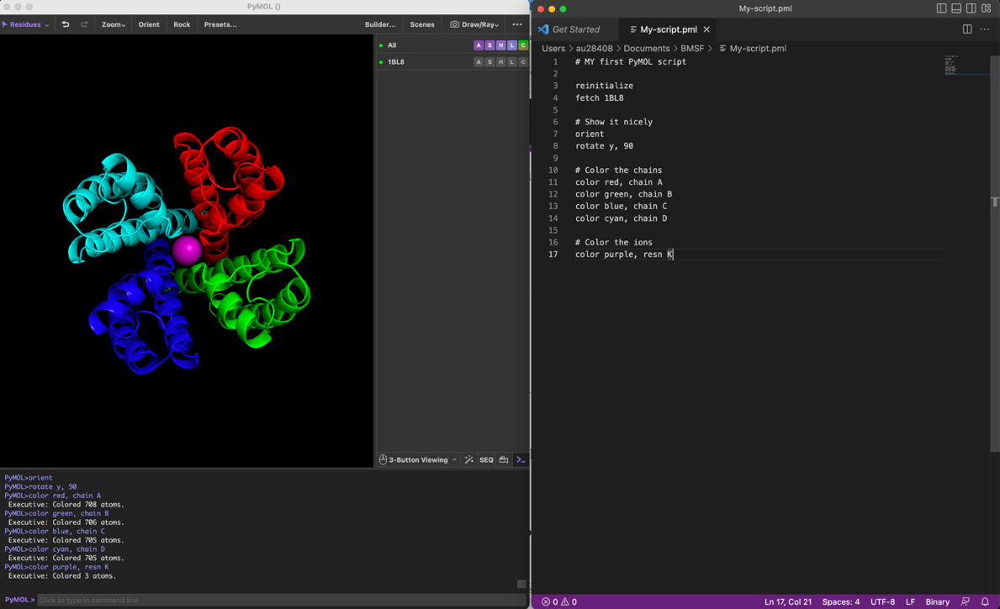

## Overview 

To be an advanced user of PyMOL, who need to use commands and scripting.
This tutorial provides a basic introduction to molecular visualization
using commands and scripting in PyMOL 3. We will first introduce some
general points about how best to work with the command line and then go
through different usage examples that demonstrate basic functionality.
At the end of the text we have provided a list of commands that can be
used to look up useful commands.

## Controling PyMOL on the command line and through scripting

To work with commands and scripting you need to focus on the following
windows and panels as shown in **Figure 1**. You need to think in input
(the command/script) and output (the visualization). The **command
line** is located at the bottom of the window and if you want a
repository of commands, you can have them stored in a **text editor** on
the side. The output visualization is seen in the main **display**
**panel**. The **log window** contains log of which commands have been
executed and details of selections. Note also the **\"\>\_\" button** to
hide/show the log window. A script is a list of commands in a text file
that can be executed on the command line. A script helps you build up
complex visualization and analysis pipelines that can be modified and
reused.



> **Figure 1**: The PyMOL graphical user interface with PDB ID **1tg7**
> loaded.


## Introducing the command line 

All commands through the menu system can also be provided through the
PyMOL command line console. You might find this complicated at first,
but once you master it, you will find this very useful (if not
essential).

> To load a structure into PyMOL use the fetch command on the command
> line:

```pymol
fetch 1rg7
```

> You can also load a PDB file from your own file system using the load
> command:

```pymol
load 1rg7.pdb
```


To show a particular representation, use the show command followed the
by representation name:

```pymol
show cartoon (shows cartoon for all objects)
show lines (shows lines for all objects)
```


To hide a representation use

```pymol
hide lines
```


You can also choose to show only one particular representation with the
as command:

```pymol
as cartoon
as ribbon
```


The zoom and orient commands are the equivalent to the zoom and orient
buttons, respectively:

```pymol
zoom
orient
```


We will come back to more useful commands through the tutorial. Make
sure you use

```pymol
as lines
```


before you continue to the next section.

## Atom selections with the command line 

> Using the command line enables more versatile and specific atom
> selections. The "select" command enables atom selection through the
> command line. The command can be combined with various keywords
> specifying which atoms, residues, or chains to select. Here are some
> examples:
>
> **select resname** selects the residue(s) by name. e.g. select residue
> with name MTX:

```pymol
select resname MTX
```

> **select resid** selects the residue(s) by identifier. e.g. select
> residue with ID 161:

```pymol
select resid 161
```

> **select chain** selects atoms in the specified chain. e.g. select
> chain with ID A:

```pymol
select chain A
```

> **select name** selects atoms with the specified name. e.g. select all
> CA atoms:

```pymol
select name CA
```

> The selection commands above will generate a selection with the
> default name **(sele)**. You can specify another name by adding it to
> the command like this:
>
> Create a new selection called **(mtx)**:

```pymol
select mtx, resname MTX
```

> Create a new selection called **(protein)**:

```pymol
select protein, resid 1-160
```

> Similarly to using the in range (-) symbol, you can use the addition
> (+) syntax. The following command will select the residues in rage 15
> to 20 as well as residue number 25:

```pymol
select resid 15-20+25
```

> You can also combine selection statements using the **AND** and **OR**
> operator. AND will select the atoms present in both the first and the
> second statement (intersection) while OR will select the atoms present
> in the first or the second statement (union). The following example
> will select 5 atoms corresponding to the CA (c-alph) atoms in the
> residues 15-20:

```pymol
select resid 15-20 and name CA
```


Read more about atom selection in PyMOL
[~\--~[here]{.underline}~-~](http://pymolwiki.org/index.php/Property_Selectors)
.

**Task**: Create a selection with name "bsite" consisting of residues
with IDs 27, 31, and 94. Display the selection sticks representation on
zoom on it.

## Colour the atom selections 

> Now that we have a few selection entries (protein, mtx, bsite) we can
> easily color these to contrast the different elements in the
> structure.
>
> Coloring can be done using the command line. Below we color the mtx
> selection red and the protein blue:

```pymol
color red, mtx
color blue, protein
```

> Note that it is often useful to color by atom elements, i.e. to keep
> oxygens red, nitrogens blue, sulphurs yellow etc, and only adjust the
> colors of carbon atoms. In the command line it can be carried out with
> combining the color command with selection statements:

```pymol
color green, mtx and elem C color red, mtx and elem O
color blue, mtx and elem N
```

> Now we have coloured all carbon elements of the mtx selection green;
> oxygens red; and nitrogens blue.


# Pymol Reference Card

## Modes

> Pymol supports two modes of input: point and click mode, and command
> line mode. The point and click allows you to quickly rotate the
> molecule(s) zoom in and out and change the clipping planes. The
> command line mode where commands are entered into the external GUI
> window supports all of the commands in the point and click mode but is
> more flexible and possibly useful for complex selection and command
> issuing. Commands entered on the command line are executed when you
> press the return key.


- command help help *keyword*

## Loading Files

- file loading load data/test/pept.pdb

- loading from terminal pymol data/test/pept.pdb

- toggle between text and graphics *Esc*

- toggle Y axis rocking rock

- stereo view stereo on/off

- stereo type stereo crosseye / walleye / quadbuffer

- undo action undo

- reset view reset

- reinitialize Pymol reinitialize

- quit (force, even if unsaved) quit

## Mouse Control

- set the center of rotation origin *selection*

## Atom Selection

```pymol
object-name/segi-id/chain-id/resi-id/name-id
```


- molecular system selection /pept

- molecule selection /pept/lig

- chain selection /pept/lig/a

- residue selection /pept/lig/a/10

- atom /pept/lig/a/10/ca

- ranges lig/a/10-12/ca

- ranges a/6+8/c+o

- missing selections /pept//a

- naming a selection select bb, name c+o+n+ca

- count atoms in a selection count atoms bb

- remove atoms from a selection remove resi 5

- general all, none, hydro, hetatm, visible, present

- atoms not in a selection select sidechains, ! bb

- atoms with a vdW gap \< 3 Å resi 6 around 3

- atom centers with a gap \< 1.0 Å all near 1 of resi 6

- atom centers within \< 4.0 Å all within 4 of resi 6

## Basic Commands

> Some commands used with atoms selections. If you are unsure about the
> selection, click on the molecule part that you want in the viewing
> window and then look at the output line to see the selection.


- fill viewer with selection zoom /pept//a

- center a selection center /pept//a

- colour a selection colour pink, /pept//a

- force Pymol to reapply colours recolor

- set background colour bg color white

- vdW representation of selection show spheres, 156/ca

- stick representation of selection show sticks, a//

- line representation of selection show lines, /pept

- ribbon representation of selection show ribbon, /pept

- dot representation of selection show dots, /pept

- mesh representation of selection show mesh, /pept

- surface representation of selection show surface, /pept

- nonbonded representation of selection show nonbonded, /pept

- nonbonded sphere representation of selection show nb spheres, /pept

- cartoon representation of selection show cartoon, a//

- clear all hide all

- rotate a selection rotate *axis*, angle, *selection*

- translate a selection translate \[x,y,z\], *selection*

## Cartoon Settings

Setting the value at the end to 0 forces the secondary structure to go
though the CA position.

- cylindrical helices set cartoon cylindrical helices,1

- fancy helices \[tubular edge\] set cartoon fancy helices,1

- flat sheets set cartoon flat sheets,1

- smooth loops set cartoon smooth loops,1

- find rings for cartoon set cartoon ring finder,\[1,2,3,4\]

- ring mode set cartoon ring mode,\[1,2,3\]

- nucleic acid mode set nucleic acid mode,\[0,1,2,3,4\]

- cartoon sidechains set cartoon side chain helper; rebuild

- primary colour set cartoon color,blue

- secondary colour set cartoon highlight color,grey

- limit colour to ss set cartoon discrete colors,on

- cartoon transparency set cartoon transparency,0.5

- cartoon loop cartoon loop, a//

- cartoon loop cartoon loop, a//

- cartoon rectangular cartoon rect, a//

- cartoon oval cartoon oval, a//

- cartoon tubular cartoon tube, a//

- cartoon arrow cartoon arrow, a//

- cartoon dumbell cartoon dumbell, a//

- b-factor sausage cartoon putty, a//

## Image Output

- low resolution ray

- high resolution ray 2000,2000

- ultra-high resolution ray 5000,5000

- change the default size \[pts\] viewport 640,480

- image shadow control set ray shadow,0

- image fog control set ray trace fog,0

- image depth cue control set depth cue,0

- image antialiasing control set antialias,1

- export image as .png png *image*.png

## Hydrogen Bonding

> Draw bonds between atoms and label the residues that are involved.


- draw a line between atoms distance 542/oe1,538/ne

- set the line dash gap set dash gap,0.09

- set the line dash width set dash width,3.0

- set the line dash radius set dash radius,0.0

- set the line dash length set dash length,0.15

- set round dash ends set dash round ends,on

- hide a label hide labels, dist01

- label a reside label (542/oe1), \"%s\" %(\"E542\")

- set label font set label font id,4

- set label colour set label color,white

## Electrostatics

> There are a number of ways to apply electrostatics in Pymol. The user
> can use GRASP to generate a map and then import it. Alternatively the
> user can use the APBS Pymol plugin. Pymol also has a built in function
> that is quick and dirty.

```pymol
generate electrostatic surface action \> generate \> vacuum
electrostatics \> protein contact potential
```


## Pymol Movies (mac)

- move the camera move x,10

- turn the camera turn x,90

- play the movie mplay

- stop the movie mstop

- writeout png files mpng *prefix* \[, first \[, last\]\]

- show a particular frame frame *number*

- move forward on frame forward

- move back one frame backwards

- go to the start of the movie rewind

- go to the middle of the movie middle

- go to the movie end ending

- determine the current frame get frame

- clear the movie cache mclear

- execute a command in a frame mdo 1, turn x,5; turn y,5;

- dump current movie commands mdump

- reset the number of frames per second meter_reset

## Miscellaneous

- add hydrogens in to a molecule selection h add

- alias a set of commands separated by ";" alias go,load 1hpv.pdb; zoom
  200/; show sticks, 200/ around 8

- structurally align align prot1////CA, prot2, object=alignment

- fit one molelcule to another fit *selection*, *target*

- copy at selection copy *target*, *source*

- create a new selection create *target*, *selection*

- delete a selection delete *selection*

- save file save *filename*, *selection*

- protect or deprotect a selection \[de\]protect *selection*

- mask or demask to allow/stop selection \[un\]mask *selection*

- align coordinates with axis orient *selection*

- get the current rotation matrix get_view

- input a rotation matrix set_view

- safely refresh the scene refresh

- store a scene view *name*, store, *description*

- restore a view view *name*, \[recall\]

- set a new colour set_color *name*, *rgb*

## Secondary Structures

Pymol has a secondary structure determination algorithm called dss,
however it is better to use the DSSP algorithm and then define the
limits manually.

- to run dss dss *selection*

- to define helical structure alter 11-40/, ss='H'

- to define loop regions alter 40-50/, ss='L'

- to define strand structure alter 50-60/, ss='S'

- rebuild the cartoon after alteration rebuild

- get dihedral angle get dihedral 4/n,4/c,4/ca,4/cb

## Files

- change the working directory cd \<path\>

- list contents of current directory ls

- print current working directory pwd

## Crystal Structures

To recreate crystal packing of molelcules within 5 Å of pept in the
pept.pdb (which must contain CRYST date), use the symexp command. symexp
sym,pept,(pept),5.0

## NMR Structures

NMR models should be loaded into the same object, but should have
different states.

- load a model into an object load *file*.pdb, *object*

- show all models in an object set all states,1

- show only one object model set all states,0

- show a particular model frame *model_number*

- determine which model get_model

- fit two structures to one another fit *selection*

- fit and calculate the rms rms *selection*

- rms without fitting rms_cur *selection*

- fit ensemble structures intra fit *selection*,1

- calculate rms intra_rms *selection*,*state*

- ensemble rms without fitting intra_rms cur *selection*,*state*

## Changing Structures

- add a bond bond atom1, atom2

- remove bonds unbond atom1,atom2

- join to molecules together fuse \[atom1, atom2\]

## Old School Images

- Load a .pdb and make a cartoon view. Then change the background colour
  to white and change the ray mode to 2. set ray trace mode,2

- make the lines thinner set antialias,2

- raytrace the image ray
